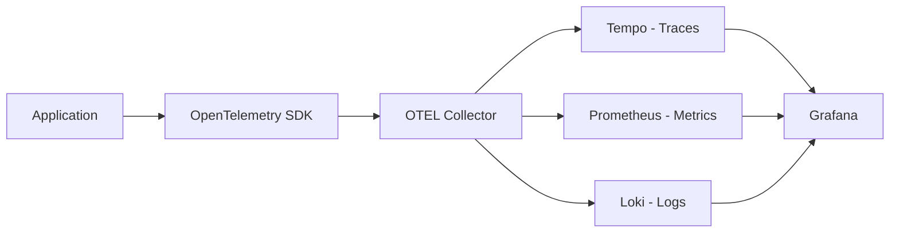

# How to Configure APM in Grafana

Author: [nawazdhandala](https://www.github.com/nawazdhandala)

Tags: Grafana, APM, Application Performance Monitoring, Traces, Metrics, OpenTelemetry, Tempo

Description: Set up Application Performance Monitoring in Grafana using traces, metrics, and logs to understand application behavior, identify bottlenecks, and resolve performance issues.

---

## What Is APM?

Application Performance Monitoring (APM) provides visibility into how your applications behave in production. Unlike infrastructure monitoring that focuses on servers and networks, APM tracks:

- Request latency and throughput
- Error rates and types
- Service dependencies
- Database query performance
- External API call behavior
- User-facing performance metrics

Grafana's APM capabilities combine traces from Tempo, metrics from Prometheus, and logs from Loki into a unified experience.

## APM Architecture



## Setting Up OpenTelemetry Instrumentation

### Auto-Instrumentation for Common Languages

**Python with Flask:**

```python
# requirements.txt
opentelemetry-distro
opentelemetry-exporter-otlp
opentelemetry-instrumentation-flask
opentelemetry-instrumentation-requests
opentelemetry-instrumentation-sqlalchemy

# Run with auto-instrumentation
# opentelemetry-instrument python app.py
```

```python
# app.py
from flask import Flask
from opentelemetry import trace

app = Flask(__name__)
tracer = trace.get_tracer(__name__)

@app.route('/api/users/<user_id>')
def get_user(user_id):
    with tracer.start_as_current_span("fetch_user_data") as span:
        span.set_attribute("user.id", user_id)
        user = db.get_user(user_id)
        return user.to_dict()
```

**Node.js with Express:**

```javascript
// tracing.js - Load this first
const { NodeSDK } = require('@opentelemetry/sdk-node');
const { OTLPTraceExporter } = require('@opentelemetry/exporter-trace-otlp-grpc');
const { getNodeAutoInstrumentations } = require('@opentelemetry/auto-instrumentations-node');

const sdk = new NodeSDK({
  traceExporter: new OTLPTraceExporter({
    url: 'http://otel-collector:4317',
  }),
  instrumentations: [getNodeAutoInstrumentations()],
  serviceName: 'api-service',
});

sdk.start();
```

```javascript
// app.js
const express = require('express');
const { trace } = require('@opentelemetry/api');

const app = express();
const tracer = trace.getTracer('api-service');

app.get('/api/orders/:id', async (req, res) => {
  const span = tracer.startSpan('process_order');
  span.setAttribute('order.id', req.params.id);

  try {
    const order = await orderService.getOrder(req.params.id);
    span.setStatus({ code: SpanStatusCode.OK });
    res.json(order);
  } catch (error) {
    span.setStatus({ code: SpanStatusCode.ERROR, message: error.message });
    res.status(500).json({ error: 'Internal error' });
  } finally {
    span.end();
  }
});
```

**Java with Spring Boot:**

```xml
<!-- pom.xml -->
<dependency>
    <groupId>io.opentelemetry</groupId>
    <artifactId>opentelemetry-api</artifactId>
</dependency>
<dependency>
    <groupId>io.opentelemetry.instrumentation</groupId>
    <artifactId>opentelemetry-spring-boot-starter</artifactId>
</dependency>
```

```yaml
# application.yml
otel:
  exporter:
    otlp:
      endpoint: http://otel-collector:4317
  resource:
    attributes:
      service.name: order-service
      deployment.environment: production
```

## OpenTelemetry Collector Configuration

```yaml
# otel-collector.yaml
receivers:
  otlp:
    protocols:
      grpc:
        endpoint: 0.0.0.0:4317
      http:
        endpoint: 0.0.0.0:4318

processors:
  batch:
    timeout: 1s
    send_batch_size: 1024

  # Add service graph metrics
  servicegraph:
    metrics_exporter: prometheus
    latency_histogram_buckets: [1ms, 10ms, 100ms, 1s, 10s]

  # Generate span metrics
  spanmetrics:
    metrics_exporter: prometheus
    latency_histogram_buckets: [1ms, 10ms, 100ms, 1s]
    dimensions:
      - name: http.method
      - name: http.status_code

exporters:
  otlp/tempo:
    endpoint: tempo:4317
    tls:
      insecure: true

  prometheus:
    endpoint: 0.0.0.0:8889

  loki:
    endpoint: http://loki:3100/loki/api/v1/push

service:
  pipelines:
    traces:
      receivers: [otlp]
      processors: [batch, servicegraph, spanmetrics]
      exporters: [otlp/tempo]

    metrics:
      receivers: [otlp]
      processors: [batch]
      exporters: [prometheus]

    logs:
      receivers: [otlp]
      processors: [batch]
      exporters: [loki]
```

## Grafana Data Source Configuration

### Tempo Data Source

```yaml
# provisioning/datasources/tempo.yaml
apiVersion: 1

datasources:
  - name: Tempo
    type: tempo
    access: proxy
    url: http://tempo:3200
    jsonData:
      httpMethod: GET
      tracesToLogs:
        datasourceUid: loki
        filterByTraceID: true
        filterBySpanID: true
        mapTagNamesEnabled: true
        mappedTags:
          - key: service.name
            value: service
      tracesToMetrics:
        datasourceUid: prometheus
        queries:
          - name: Request rate
            query: sum(rate(traces_spanmetrics_calls_total{$$__tags}[5m]))
          - name: Error rate
            query: sum(rate(traces_spanmetrics_calls_total{$$__tags, status_code="STATUS_CODE_ERROR"}[5m]))
      serviceMap:
        datasourceUid: prometheus
      nodeGraph:
        enabled: true
      lokiSearch:
        datasourceUid: loki
```

### Prometheus Data Source for Span Metrics

```yaml
- name: Prometheus
  type: prometheus
  access: proxy
  url: http://prometheus:9090
  jsonData:
    exemplarTraceIdDestinations:
      - name: traceID
        datasourceUid: tempo
```

## Building APM Dashboards

### Service Overview Panel

```promql
# Request rate
sum(rate(traces_spanmetrics_calls_total{service_name="$service"}[5m]))

# Error rate
sum(rate(traces_spanmetrics_calls_total{service_name="$service", status_code="STATUS_CODE_ERROR"}[5m]))
/
sum(rate(traces_spanmetrics_calls_total{service_name="$service"}[5m]))

# Latency percentiles
histogram_quantile(0.50, sum(rate(traces_spanmetrics_latency_bucket{service_name="$service"}[5m])) by (le))
histogram_quantile(0.95, sum(rate(traces_spanmetrics_latency_bucket{service_name="$service"}[5m])) by (le))
histogram_quantile(0.99, sum(rate(traces_spanmetrics_latency_bucket{service_name="$service"}[5m])) by (le))
```

### Service Map

Enable the service graph in Tempo's data source settings. The service map visualizes:
- Service dependencies
- Request rates between services
- Error rates on edges
- Latency distributions

### Endpoint Analysis

```promql
# Top endpoints by request volume
topk(10, sum(rate(traces_spanmetrics_calls_total{service_name="$service"}[5m])) by (span_name))

# Slowest endpoints
topk(10, histogram_quantile(0.99, sum(rate(traces_spanmetrics_latency_bucket{service_name="$service"}[5m])) by (span_name, le)))

# Highest error rate endpoints
topk(10,
  sum(rate(traces_spanmetrics_calls_total{service_name="$service", status_code="STATUS_CODE_ERROR"}[5m])) by (span_name)
  /
  sum(rate(traces_spanmetrics_calls_total{service_name="$service"}[5m])) by (span_name)
)
```

### Database Performance

```promql
# Database query duration
histogram_quantile(0.99, sum(rate(traces_spanmetrics_latency_bucket{service_name="$service", span_kind="SPAN_KIND_CLIENT", db_system!=""}[5m])) by (le, db_system))

# Queries per second by database
sum(rate(traces_spanmetrics_calls_total{service_name="$service", db_system!=""}[5m])) by (db_system)
```

### External API Calls

```promql
# External HTTP call latency
histogram_quantile(0.99, sum(rate(traces_spanmetrics_latency_bucket{service_name="$service", span_kind="SPAN_KIND_CLIENT", http_url!=""}[5m])) by (le, http_host))

# External call error rate
sum(rate(traces_spanmetrics_calls_total{service_name="$service", span_kind="SPAN_KIND_CLIENT", http_status_code=~"5.."}[5m])) by (http_host)
```

## Trace Analysis in Explore

### Finding Problematic Traces

Use TraceQL in Grafana Explore:

```traceql
# Find slow traces
{service.name="api-service"} | duration > 1s

# Find error traces
{service.name="api-service" && status.code=error}

# Find traces with specific attributes
{service.name="api-service" && http.status_code >= 500}

# Find traces touching specific endpoint
{service.name="api-service" && name="GET /api/orders"}
```

### Correlating Traces with Logs

With trace-log correlation configured:

1. Find a problematic trace in Explore
2. Click on a span
3. Select "Logs for this span" to see related log entries

```logql
# Query logs with trace context
{service="api-service"} | json | trace_id="abc123"
```

## Alerting on APM Metrics

### Latency Alerts

```yaml
groups:
  - name: apm-alerts
    rules:
      - alert: HighLatency
        expr: |
          histogram_quantile(0.99, sum(rate(traces_spanmetrics_latency_bucket[5m])) by (le, service_name))
          > 1
        for: 5m
        labels:
          severity: warning
        annotations:
          summary: "High latency on {{ $labels.service_name }}"
          description: "P99 latency is {{ $value | humanizeDuration }}"

      - alert: HighErrorRate
        expr: |
          sum(rate(traces_spanmetrics_calls_total{status_code="STATUS_CODE_ERROR"}[5m])) by (service_name)
          /
          sum(rate(traces_spanmetrics_calls_total[5m])) by (service_name)
          > 0.05
        for: 5m
        labels:
          severity: critical
        annotations:
          summary: "High error rate on {{ $labels.service_name }}"
          description: "Error rate is {{ $value | humanizePercentage }}"
```

### Dependency Health Alerts

```yaml
- alert: DependencyErrors
  expr: |
    sum(rate(traces_service_graph_request_failed_total[5m])) by (client, server)
    /
    sum(rate(traces_service_graph_request_total[5m])) by (client, server)
    > 0.1
  for: 5m
  labels:
    severity: warning
  annotations:
    summary: "Elevated errors from {{ $labels.client }} to {{ $labels.server }}"
```

## Best Practices

### Sampling Strategy

Not every trace needs to be stored:

```yaml
# otel-collector.yaml
processors:
  probabilistic_sampler:
    sampling_percentage: 10  # Keep 10% of traces

  tail_sampling:
    decision_wait: 10s
    policies:
      # Always keep error traces
      - name: errors
        type: status_code
        status_code:
          status_codes: [ERROR]
      # Always keep slow traces
      - name: slow-traces
        type: latency
        latency:
          threshold_ms: 1000
      # Sample normal traces
      - name: probabilistic
        type: probabilistic
        probabilistic:
          sampling_percentage: 5
```

### Meaningful Span Attributes

Add business context to spans:

```python
span.set_attribute("user.id", user_id)
span.set_attribute("order.value", order.total)
span.set_attribute("customer.tier", customer.tier)
span.set_attribute("feature.flag", feature_enabled)
```

### Span Naming Conventions

Use consistent, low-cardinality span names:

```python
# Good: Uses parameterized route
span_name = "GET /api/users/{id}"

# Bad: Includes specific ID (high cardinality)
span_name = f"GET /api/users/{user_id}"
```

## Troubleshooting APM Issues

### Missing Traces

- Verify collector is receiving data: check collector metrics
- Check sampling configuration
- Verify network connectivity between app and collector
- Check trace context propagation between services

### Broken Service Map

- Ensure all services report to the same collector
- Verify servicegraph processor is configured
- Check that trace context headers propagate across service boundaries

### High Cardinality Issues

- Review span attribute values for unbounded data
- Use attribute processors to limit cardinality
- Check span names for dynamic content

## Conclusion

APM in Grafana provides the deep application visibility needed to understand performance issues and optimize user experience. Start with auto-instrumentation for quick wins, add custom spans for business-critical paths, and build dashboards that answer the questions your team asks during incidents. The combination of traces, metrics, and logs in Grafana creates a powerful troubleshooting environment where you can move from high-level service health to individual request traces in seconds.
