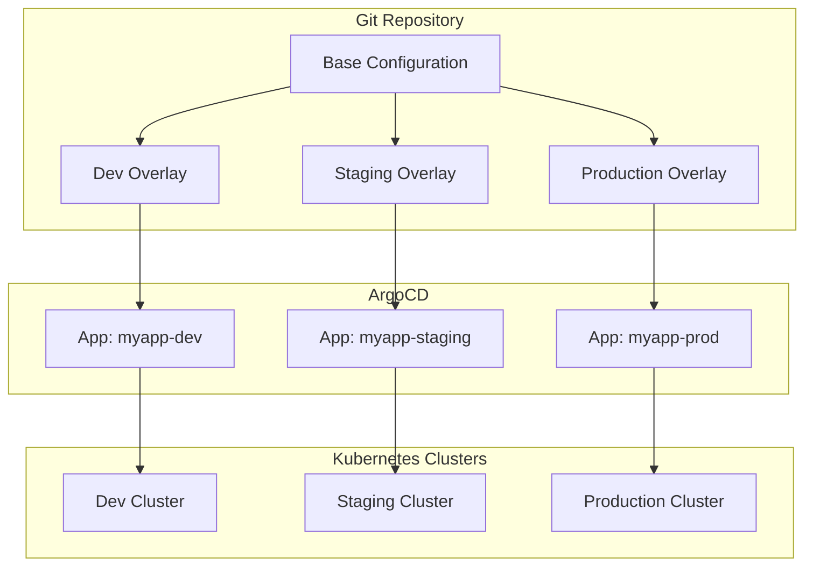
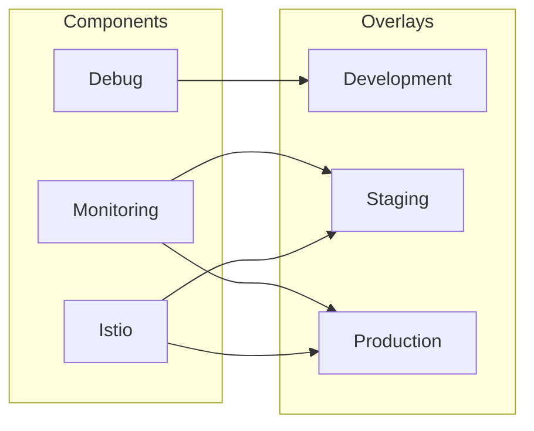
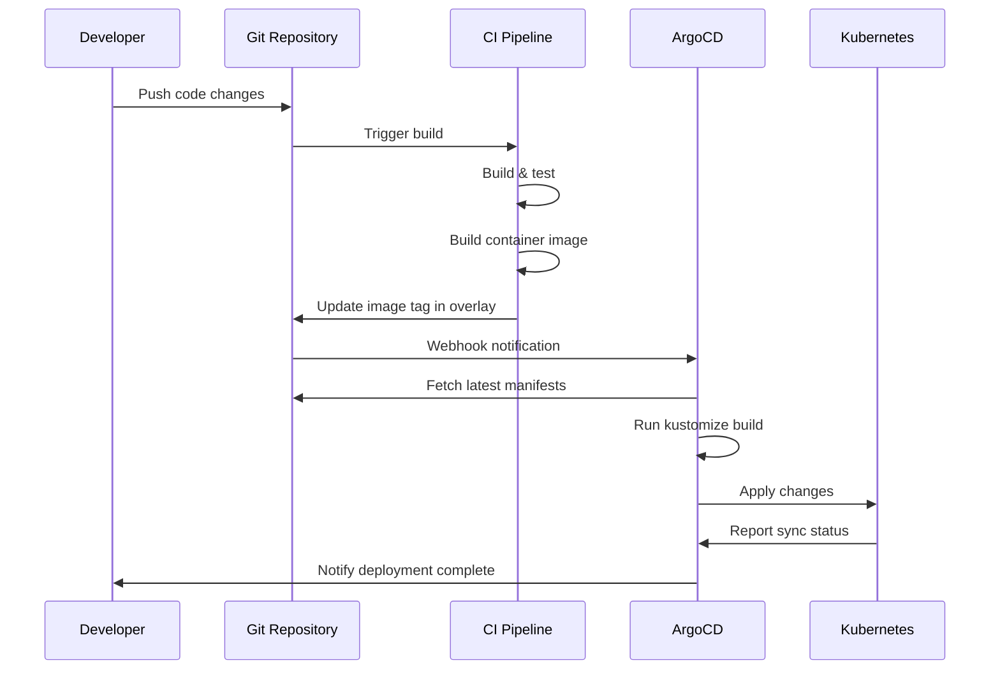

# How to Use ArgoCD with Kustomize

By [Nawaz Dhandala](https://github.com/nawazdhandala)

Tags: Kubernetes, ArgoCD, Kustomize, GitOps, DevOps, CI/CD, Configuration Management

Description: A comprehensive guide to using ArgoCD with Kustomize for managing Kubernetes deployments across multiple environments. Learn about overlays, strategic merge patches, component reuse, and best practices for GitOps workflows.

---

> "The best way to manage configuration is to not manage configuration at all. Let your tools do it." - Kelsey Hightower

## Introduction

Kustomize is a template-free configuration customization tool built into kubectl. When combined with ArgoCD, it provides a powerful GitOps workflow for managing Kubernetes deployments across multiple environments without duplicating YAML files.



## Understanding Kustomize Basics

Kustomize works on the principle of bases and overlays. The base contains common configuration, while overlays customize it for specific environments.

### Project Structure

```
myapp/
├── base/                           # Common configuration shared across all environments
│   ├── kustomization.yaml          # Declares resources and common transformations
│   ├── deployment.yaml             # Base deployment specification
│   ├── service.yaml                # Service definition
│   ├── configmap.yaml              # Default configuration values
│   └── hpa.yaml                    # Horizontal Pod Autoscaler (optional)
├── components/                     # Reusable configuration modules
│   ├── monitoring/                 # Adds Prometheus annotations and ServiceMonitor
│   │   └── kustomization.yaml
│   ├── istio/                      # Injects Istio sidecar configuration
│   │   └── kustomization.yaml
│   └── debug/                      # Enables debug logging and profiling
│       └── kustomization.yaml
└── overlays/                       # Environment-specific customizations
    ├── development/
    │   ├── kustomization.yaml      # References base + dev-specific patches
    │   ├── namespace.yaml          # Development namespace
    │   └── patches/
    │       └── resources.yaml      # Lower resource limits for dev
    ├── staging/
    │   ├── kustomization.yaml
    │   ├── namespace.yaml
    │   └── patches/
    │       ├── resources.yaml      # Medium resource limits
    │       └── replicas.yaml       # 2 replicas for testing HA
    └── production/
        ├── kustomization.yaml
        ├── namespace.yaml
        └── patches/
            ├── resources.yaml      # Production resource limits
            ├── replicas.yaml       # 3+ replicas for high availability
            └── pdb.yaml            # Pod Disruption Budget
```

## Creating the Base Configuration

The base contains resources common to all environments.

### Base Kustomization

```yaml
# base/kustomization.yaml
# This file declares all resources and common labels/annotations
# that will be inherited by all overlays

apiVersion: kustomize.config.k8s.io/v1beta1
kind: Kustomization

# Common labels applied to all resources
# These help with resource identification and selection
commonLabels:
  app.kubernetes.io/name: myapp
  app.kubernetes.io/managed-by: kustomize

# Common annotations for tracking
commonAnnotations:
  app.kubernetes.io/part-of: myapp-suite

# Resources included in the base
resources:
  - deployment.yaml
  - service.yaml
  - configmap.yaml
```

### Base Deployment

```yaml
# base/deployment.yaml
# Template deployment that will be customized per environment
# Resource limits and replicas will be overridden by overlays

apiVersion: apps/v1
kind: Deployment
metadata:
  name: myapp
spec:
  # Default replica count - overlays will override this
  replicas: 1
  selector:
    matchLabels:
      app.kubernetes.io/name: myapp
  template:
    metadata:
      labels:
        app.kubernetes.io/name: myapp
    spec:
      containers:
        - name: myapp
          # Image tag will be replaced by overlays using images transformer
          image: myregistry/myapp:latest
          ports:
            - name: http
              containerPort: 8080
              protocol: TCP
          # Probes ensure the application is healthy
          livenessProbe:
            httpGet:
              path: /health
              port: http
            initialDelaySeconds: 10
            periodSeconds: 10
          readinessProbe:
            httpGet:
              path: /ready
              port: http
            initialDelaySeconds: 5
            periodSeconds: 5
          # Default resources - will be patched per environment
          resources:
            requests:
              cpu: 100m
              memory: 128Mi
            limits:
              cpu: 500m
              memory: 512Mi
          # Environment variables from ConfigMap
          envFrom:
            - configMapRef:
                name: myapp-config
```

### Base Service

```yaml
# base/service.yaml
# Service definition remains mostly constant across environments
# Only the service type might change (ClusterIP vs LoadBalancer)

apiVersion: v1
kind: Service
metadata:
  name: myapp
spec:
  type: ClusterIP
  ports:
    - name: http
      port: 80
      targetPort: http
      protocol: TCP
  selector:
    app.kubernetes.io/name: myapp
```

### Base ConfigMap

```yaml
# base/configmap.yaml
# Default configuration values
# Environment-specific values will be patched in overlays

apiVersion: v1
kind: ConfigMap
metadata:
  name: myapp-config
data:
  # Default log level - production uses "info", dev uses "debug"
  LOG_LEVEL: "info"
  # Feature flags - can be toggled per environment
  FEATURE_NEW_UI: "false"
  # Cache TTL in seconds
  CACHE_TTL: "300"
```

## Environment-Specific Overlays

Overlays customize the base for specific environments without modifying the original files.

### Development Overlay

```yaml
# overlays/development/kustomization.yaml
# Development environment configuration
# Uses minimal resources and enables debug features

apiVersion: kustomize.config.k8s.io/v1beta1
kind: Kustomization

# Inherit from the base configuration
resources:
  - ../../base
  - namespace.yaml

# Set the namespace for all resources
namespace: myapp-dev

# Add environment-specific name suffix to avoid conflicts
nameSuffix: -dev

# Override the image tag for development
# Uses 'latest' tag for continuous deployment from main branch
images:
  - name: myregistry/myapp
    newTag: latest

# Strategic merge patches for environment customization
patches:
  # Reduce resources for development
  - path: patches/resources.yaml

# ConfigMap generator for dev-specific values
configMapGenerator:
  - name: myapp-config
    behavior: merge
    literals:
      # Enable debug logging in development
      - LOG_LEVEL=debug
      # Enable experimental features for testing
      - FEATURE_NEW_UI=true
      # Shorter cache for faster iteration
      - CACHE_TTL=60
```

### Development Resource Patch

```yaml
# overlays/development/patches/resources.yaml
# Reduce resource allocation for development environment
# This saves cluster resources while still allowing local testing

apiVersion: apps/v1
kind: Deployment
metadata:
  name: myapp
spec:
  # Single replica is sufficient for development
  replicas: 1
  template:
    spec:
      containers:
        - name: myapp
          # Minimal resources for dev - enough to run but not waste
          resources:
            requests:
              cpu: 50m
              memory: 64Mi
            limits:
              cpu: 200m
              memory: 256Mi
```

### Staging Overlay

```yaml
# overlays/staging/kustomization.yaml
# Staging environment - mirrors production but with fewer resources
# Used for integration testing and pre-production validation

apiVersion: kustomize.config.k8s.io/v1beta1
kind: Kustomization

resources:
  - ../../base
  - namespace.yaml

namespace: myapp-staging

nameSuffix: -staging

# Use specific version tags for staging deployments
# This ensures we test exactly what will go to production
images:
  - name: myregistry/myapp
    newTag: v1.2.3-rc1

patches:
  - path: patches/resources.yaml
  - path: patches/replicas.yaml

configMapGenerator:
  - name: myapp-config
    behavior: merge
    literals:
      - LOG_LEVEL=info
      - FEATURE_NEW_UI=true
      - CACHE_TTL=300
```

### Staging Replicas Patch

```yaml
# overlays/staging/patches/replicas.yaml
# Run 2 replicas in staging to test high availability
# This helps catch issues with session affinity and load balancing

apiVersion: apps/v1
kind: Deployment
metadata:
  name: myapp
spec:
  replicas: 2
```

### Production Overlay

```yaml
# overlays/production/kustomization.yaml
# Production environment - maximum reliability and performance
# Includes PDB, anti-affinity, and production-grade resources

apiVersion: kustomize.config.k8s.io/v1beta1
kind: Kustomization

resources:
  - ../../base
  - namespace.yaml
  - pdb.yaml  # Pod Disruption Budget for safe updates

namespace: myapp-prod

# Production images use semantic versioning
images:
  - name: myregistry/myapp
    newTag: v1.2.3

patches:
  - path: patches/resources.yaml
  - path: patches/replicas.yaml
  - path: patches/pod-anti-affinity.yaml

configMapGenerator:
  - name: myapp-config
    behavior: merge
    literals:
      - LOG_LEVEL=warn
      - FEATURE_NEW_UI=false
      - CACHE_TTL=600
```

### Production Resource Patch

```yaml
# overlays/production/patches/resources.yaml
# Production-grade resource allocation
# Based on load testing and actual usage patterns

apiVersion: apps/v1
kind: Deployment
metadata:
  name: myapp
spec:
  template:
    spec:
      containers:
        - name: myapp
          resources:
            requests:
              # Guaranteed resources for consistent performance
              cpu: 500m
              memory: 512Mi
            limits:
              # Allow bursting for traffic spikes
              cpu: 2000m
              memory: 2Gi
```

### Pod Disruption Budget

```yaml
# overlays/production/pdb.yaml
# Ensures minimum availability during voluntary disruptions
# Protects against simultaneous pod evictions during node maintenance

apiVersion: policy/v1
kind: PodDisruptionBudget
metadata:
  name: myapp-pdb
spec:
  # At least 2 pods must remain available during disruptions
  minAvailable: 2
  selector:
    matchLabels:
      app.kubernetes.io/name: myapp
```

## Strategic Merge Patches

Strategic merge patches allow fine-grained modifications to existing resources.

### Adding Environment Variables

```yaml
# patches/add-env-vars.yaml
# Adds additional environment variables without replacing existing ones
# Strategic merge patch merges arrays by name field

apiVersion: apps/v1
kind: Deployment
metadata:
  name: myapp
spec:
  template:
    spec:
      containers:
        - name: myapp
          env:
            # Database connection for this environment
            - name: DATABASE_URL
              valueFrom:
                secretKeyRef:
                  name: myapp-secrets
                  key: database-url
            # External API endpoint
            - name: API_ENDPOINT
              value: "https://api.production.example.com"
```

### Adding Sidecar Containers

```yaml
# patches/add-sidecar.yaml
# Adds a logging sidecar container to the deployment
# Useful for centralized log collection

apiVersion: apps/v1
kind: Deployment
metadata:
  name: myapp
spec:
  template:
    spec:
      containers:
        - name: myapp
          # This references the existing container
          volumeMounts:
            - name: logs
              mountPath: /var/log/myapp
        # Add a new sidecar container
        - name: log-shipper
          image: fluent/fluent-bit:latest
          volumeMounts:
            - name: logs
              mountPath: /var/log/myapp
              readOnly: true
          resources:
            requests:
              cpu: 10m
              memory: 32Mi
            limits:
              cpu: 50m
              memory: 64Mi
      volumes:
        - name: logs
          emptyDir: {}
```

### Pod Anti-Affinity Patch

```yaml
# patches/pod-anti-affinity.yaml
# Spreads pods across nodes for high availability
# Prevents single node failure from taking down all replicas

apiVersion: apps/v1
kind: Deployment
metadata:
  name: myapp
spec:
  template:
    spec:
      affinity:
        podAntiAffinity:
          # Prefer spreading across nodes, but don't require it
          preferredDuringSchedulingIgnoredDuringExecution:
            - weight: 100
              podAffinityTerm:
                labelSelector:
                  matchLabels:
                    app.kubernetes.io/name: myapp
                topologyKey: kubernetes.io/hostname
          # Hard requirement: spread across availability zones
          requiredDuringSchedulingIgnoredDuringExecution:
            - labelSelector:
                matchLabels:
                  app.kubernetes.io/name: myapp
              topologyKey: topology.kubernetes.io/zone
```

## Reusable Components

Components are reusable pieces of configuration that can be included in multiple overlays.



### Monitoring Component

```yaml
# components/monitoring/kustomization.yaml
# Adds Prometheus monitoring annotations and ServiceMonitor
# Include this component in any overlay that needs monitoring

apiVersion: kustomize.config.k8s.io/v1alpha1
kind: Component

# Patch deployment to add Prometheus annotations
patches:
  - patch: |-
      apiVersion: apps/v1
      kind: Deployment
      metadata:
        name: myapp
      spec:
        template:
          metadata:
            annotations:
              # Prometheus scraping configuration
              prometheus.io/scrape: "true"
              prometheus.io/port: "8080"
              prometheus.io/path: "/metrics"

# Add ServiceMonitor for Prometheus Operator
resources:
  - servicemonitor.yaml
```

### ServiceMonitor Resource

```yaml
# components/monitoring/servicemonitor.yaml
# ServiceMonitor for Prometheus Operator
# Automatically configures Prometheus to scrape this service

apiVersion: monitoring.coreos.com/v1
kind: ServiceMonitor
metadata:
  name: myapp
  labels:
    app.kubernetes.io/name: myapp
spec:
  selector:
    matchLabels:
      app.kubernetes.io/name: myapp
  endpoints:
    - port: http
      path: /metrics
      interval: 30s
      scrapeTimeout: 10s
```

### Istio Component

```yaml
# components/istio/kustomization.yaml
# Configures Istio service mesh integration
# Adds sidecar injection and destination rules

apiVersion: kustomize.config.k8s.io/v1alpha1
kind: Component

patches:
  - patch: |-
      apiVersion: apps/v1
      kind: Deployment
      metadata:
        name: myapp
      spec:
        template:
          metadata:
            annotations:
              # Enable Istio sidecar injection
              sidecar.istio.io/inject: "true"
              # Configure proxy resources
              sidecar.istio.io/proxyCPU: "100m"
              sidecar.istio.io/proxyMemory: "128Mi"

resources:
  - destinationrule.yaml
  - virtualservice.yaml
```

### Using Components in Overlays

```yaml
# overlays/production/kustomization.yaml
# Production overlay with monitoring and Istio components

apiVersion: kustomize.config.k8s.io/v1beta1
kind: Kustomization

resources:
  - ../../base
  - namespace.yaml
  - pdb.yaml

namespace: myapp-prod

# Include reusable components
# Components are applied after resources but before patches
components:
  - ../../components/monitoring
  - ../../components/istio

images:
  - name: myregistry/myapp
    newTag: v1.2.3

patches:
  - path: patches/resources.yaml
  - path: patches/replicas.yaml
  - path: patches/pod-anti-affinity.yaml
```

## ArgoCD Application Configuration

Configure ArgoCD to deploy Kustomize overlays.

### Single Environment Application

```yaml
# argocd/applications/production.yaml
# ArgoCD Application for production environment
# Points to the production overlay in the Git repository

apiVersion: argoproj.io/v1alpha1
kind: Application
metadata:
  name: myapp-production
  namespace: argocd
  # Cascade delete: removing the Application removes deployed resources
  finalizers:
    - resources-finalizer.argocd.argoproj.io
spec:
  project: default

  source:
    repoURL: https://github.com/myorg/myapp-config.git
    targetRevision: main
    # Path to the Kustomize overlay
    path: overlays/production

  destination:
    server: https://kubernetes.default.svc
    namespace: myapp-prod

  syncPolicy:
    automated:
      # Remove resources that are no longer in Git
      prune: true
      # Automatically fix manual changes
      selfHeal: true
      # Allow empty diffs during initial sync
      allowEmpty: false
    syncOptions:
      # Create namespace if it doesn't exist
      - CreateNamespace=true
      # Use server-side apply for better conflict resolution
      - ServerSideApply=true
      # Validate resources before applying
      - Validate=true
    retry:
      limit: 5
      backoff:
        duration: 5s
        factor: 2
        maxDuration: 3m
```

### ApplicationSet for All Environments

```yaml
# argocd/applicationsets/myapp-environments.yaml
# Generates ArgoCD Applications for all environments
# Reduces duplication and ensures consistency

apiVersion: argoproj.io/v1alpha1
kind: ApplicationSet
metadata:
  name: myapp-environments
  namespace: argocd
spec:
  generators:
    # List generator creates one Application per environment
    - list:
        elements:
          - env: development
            cluster: https://kubernetes.default.svc
            revision: main
            autoSync: true
          - env: staging
            cluster: https://kubernetes.default.svc
            revision: main
            autoSync: true
          - env: production
            cluster: https://prod-cluster.example.com
            revision: main
            autoSync: false  # Manual approval for production

  template:
    metadata:
      name: 'myapp-{{env}}'
      namespace: argocd
      labels:
        app: myapp
        environment: '{{env}}'
    spec:
      project: default
      source:
        repoURL: https://github.com/myorg/myapp-config.git
        targetRevision: '{{revision}}'
        path: 'overlays/{{env}}'
      destination:
        server: '{{cluster}}'
        namespace: 'myapp-{{env}}'
      syncPolicy:
        automated:
          prune: '{{autoSync}}'
          selfHeal: '{{autoSync}}'
        syncOptions:
          - CreateNamespace=true
          - ServerSideApply=true
```

## Advanced Kustomize Patterns

### JSON Patches for Complex Modifications

```yaml
# overlays/production/kustomization.yaml
# Use JSON patches when strategic merge doesn't work
# JSON patches provide precise control over modifications

apiVersion: kustomize.config.k8s.io/v1beta1
kind: Kustomization

resources:
  - ../../base

patches:
  # JSON patch to modify specific array elements
  - target:
      kind: Deployment
      name: myapp
    patch: |-
      # Add a new container at the end of the containers array
      - op: add
        path: /spec/template/spec/containers/-
        value:
          name: metrics-exporter
          image: prom/statsd-exporter:latest
          ports:
            - containerPort: 9102
      # Replace the first container's image pull policy
      - op: replace
        path: /spec/template/spec/containers/0/imagePullPolicy
        value: Always
```

### Replacement Transformers

```yaml
# overlays/production/kustomization.yaml
# Replacements copy values from one resource to another
# Useful for referencing generated names or dynamic values

apiVersion: kustomize.config.k8s.io/v1beta1
kind: Kustomization

resources:
  - ../../base
  - external-secret.yaml

replacements:
  # Copy the secret name from ExternalSecret to Deployment
  - source:
      kind: ExternalSecret
      name: myapp-secrets
      fieldPath: spec.target.name
    targets:
      - select:
          kind: Deployment
          name: myapp
        fieldPaths:
          - spec.template.spec.containers.[name=myapp].envFrom.[configMapRef].name
```

### Generators for Dynamic Resources

```yaml
# overlays/production/kustomization.yaml
# Generators create resources from various sources
# Includes hash suffixes for automatic rollouts on changes

apiVersion: kustomize.config.k8s.io/v1beta1
kind: Kustomization

resources:
  - ../../base

# Generate ConfigMap from files
configMapGenerator:
  - name: myapp-nginx-config
    files:
      - nginx.conf
    options:
      # Disable hash suffix if you need a stable name
      disableNameSuffixHash: false

# Generate Secret from literals and files
secretGenerator:
  - name: myapp-tls
    type: kubernetes.io/tls
    files:
      - tls.crt=certs/server.crt
      - tls.key=certs/server.key
    options:
      # Annotations to add to the generated secret
      annotations:
        cert-manager.io/common-name: myapp.example.com
```

## GitOps Workflow with ArgoCD and Kustomize



### CI Pipeline Example

```yaml
# .github/workflows/deploy.yaml
# GitHub Actions workflow that updates the Kustomize overlay
# After image is built, it updates the image tag in Git

name: Build and Deploy

on:
  push:
    branches: [main]

jobs:
  build:
    runs-on: ubuntu-latest
    steps:
      - uses: actions/checkout@v4

      - name: Build and push image
        run: |
          # Build the container image
          docker build -t myregistry/myapp:${{ github.sha }} .
          docker push myregistry/myapp:${{ github.sha }}

      - name: Update Kustomize overlay
        run: |
          # Clone the config repository
          git clone https://github.com/myorg/myapp-config.git
          cd myapp-config

          # Update the image tag in the staging overlay
          cd overlays/staging
          kustomize edit set image myregistry/myapp:${{ github.sha }}

          # Commit and push the change
          git config user.name "GitHub Actions"
          git config user.email "actions@github.com"
          git add .
          git commit -m "Update staging image to ${{ github.sha }}"
          git push
```

## Monitoring Your ArgoCD Deployments

Once your GitOps workflow is in place, monitoring becomes critical. [OneUptime](https://oneuptime.com) provides comprehensive observability for your Kubernetes deployments:

- **Real-time Alerts**: Get notified immediately when ArgoCD sync fails or applications become unhealthy
- **Deployment Tracking**: Monitor deployment frequency, success rates, and rollback patterns
- **Resource Monitoring**: Track CPU, memory, and pod health across all environments
- **Log Aggregation**: Centralize logs from ArgoCD and your applications for troubleshooting
- **Status Pages**: Keep stakeholders informed about deployment status and service health

## Troubleshooting

### Preview Kustomize Output

```bash
# Preview what Kustomize will generate
# Always test locally before committing changes
kustomize build overlays/production

# Compare with current cluster state
kustomize build overlays/production | kubectl diff -f -

# Validate the output
kustomize build overlays/production | kubectl apply --dry-run=server -f -
```

### Debug ArgoCD Sync Issues

```bash
# Check application status
argocd app get myapp-production

# View sync details
argocd app sync myapp-production --dry-run

# Force a hard refresh to clear cache
argocd app get myapp-production --hard-refresh

# View application manifests as ArgoCD sees them
argocd app manifests myapp-production
```

### Common Issues

```yaml
# Issue: Resources not updating after ConfigMap changes
# Solution: Enable hash suffixes in configMapGenerator
configMapGenerator:
  - name: myapp-config
    # Hash suffix ensures Deployment rolls when ConfigMap changes
    options:
      disableNameSuffixHash: false

---
# Issue: Namespace not created automatically
# Solution: Add CreateNamespace sync option
syncPolicy:
  syncOptions:
    - CreateNamespace=true

---
# Issue: ArgoCD shows OutOfSync but no actual differences
# Solution: Add ignore differences for dynamic fields
spec:
  ignoreDifferences:
    - group: apps
      kind: Deployment
      jsonPointers:
        - /spec/replicas  # Ignore if HPA manages replicas
    - group: ""
      kind: Service
      jsonPointers:
        - /spec/clusterIP  # Ignore auto-assigned ClusterIP
```

## Best Practices Summary

1. **Keep bases minimal**: Only include resources that are truly common across all environments
2. **Use components for optional features**: Monitoring, service mesh, and debug features should be components
3. **Version your overlays**: Use Git tags for production deployments
4. **Separate config from code**: Keep Kubernetes manifests in a dedicated repository
5. **Enable hash suffixes**: Ensures pods restart when ConfigMaps or Secrets change
6. **Use strategic merge patches**: They're more readable and maintainable than JSON patches
7. **Test locally first**: Always run `kustomize build` before pushing changes
8. **Document your patches**: Comments explaining why each patch exists save future debugging time

---

Kustomize and ArgoCD together provide a robust GitOps workflow without the complexity of templating languages. Start with a simple base and overlay structure, then gradually add components and advanced patches as your needs grow. The declarative nature of both tools means your entire deployment state is version-controlled and auditable.
