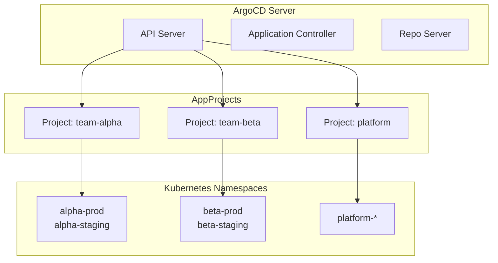
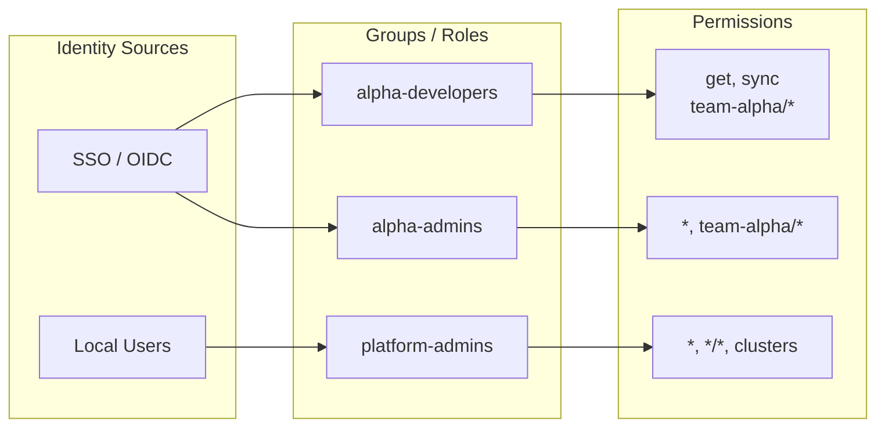
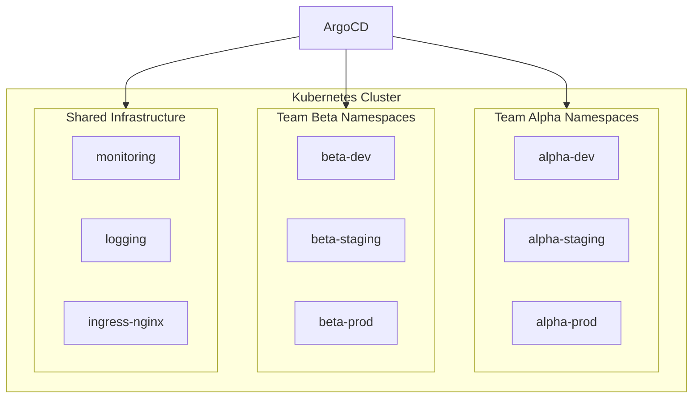
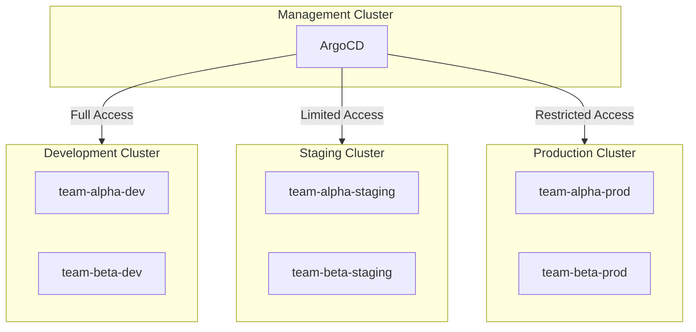

# How to Implement ArgoCD Multi-Tenancy

Author: [nawazdhandala](https://github.com/nawazdhandala)

Tags: Kubernetes, ArgoCD, Multi-Tenancy, GitOps, RBAC, DevOps, Security, Namespace Isolation

Description: A comprehensive guide to implementing multi-tenancy in ArgoCD, covering AppProjects for team isolation, RBAC configuration, namespace-based tenancy, cluster-level permissions, and security best practices for enterprise deployments.

---

> Multi-tenancy in ArgoCD is not just about separating teams; it is about creating security boundaries that prevent blast radius expansion while enabling teams to move fast with self-service deployments.

## Why Multi-Tenancy Matters

When multiple teams share a single ArgoCD installation, you need clear boundaries. Without proper isolation:
- Team A could accidentally deploy to Team B's namespace
- A misconfigured application could affect the entire cluster
- Audit trails become unclear
- Security compliance becomes impossible



## AppProjects for Team Isolation

AppProjects are the foundation of ArgoCD multi-tenancy. Each project defines what repositories, clusters, and namespaces applications can access.

### Basic Team Project

```yaml
# appproject-team-alpha.yaml
# This project restricts team-alpha to their own repos and namespaces
apiVersion: argoproj.io/v1alpha1
kind: AppProject
metadata:
  name: team-alpha
  namespace: argocd
  # Finalizer prevents accidental deletion
  finalizers:
    - resources-finalizer.argocd.argoproj.io
spec:
  description: "Team Alpha - Backend Services"

  # Only allow deployments from team-alpha's repositories
  sourceRepos:
    - 'https://github.com/myorg/team-alpha-*'
    - 'https://github.com/myorg/shared-charts'

  # Restrict where applications can deploy
  destinations:
    # Allow alpha namespaces on the local cluster
    - namespace: 'alpha-*'
      server: https://kubernetes.default.svc
    # Allow specific namespace on production cluster
    - namespace: 'alpha-prod'
      server: https://prod.k8s.example.com

  # Deny deployments to these namespaces (overrides destinations)
  namespaceResourceBlacklist:
    - group: ''
      kind: ResourceQuota
    - group: ''
      kind: LimitRange

  # Only allow specific cluster-scoped resources
  clusterResourceWhitelist:
    - group: ''
      kind: Namespace
```

### Namespace-Scoped Resource Restrictions

```yaml
# appproject-restricted.yaml
# This project limits what resource types teams can deploy
apiVersion: argoproj.io/v1alpha1
kind: AppProject
metadata:
  name: team-beta-restricted
  namespace: argocd
spec:
  description: "Team Beta - Limited Permissions"

  sourceRepos:
    - 'https://github.com/myorg/team-beta-*'

  destinations:
    - namespace: 'beta-*'
      server: https://kubernetes.default.svc

  # Explicitly allow only these namespace-scoped resources
  # If not specified, all resources are allowed
  namespaceResourceWhitelist:
    - group: ''
      kind: ConfigMap
    - group: ''
      kind: Secret
    - group: ''
      kind: Service
    - group: apps
      kind: Deployment
    - group: apps
      kind: StatefulSet
    - group: networking.k8s.io
      kind: Ingress
    - group: autoscaling
      kind: HorizontalPodAutoscaler

  # Block all cluster-scoped resources
  clusterResourceWhitelist: []
```

## RBAC Configuration

ArgoCD RBAC controls who can do what with applications and projects.

### RBAC Architecture



### ConfigMap-Based RBAC

```yaml
# argocd-rbac-cm.yaml
# Configure RBAC policies in the argocd-rbac-cm ConfigMap
apiVersion: v1
kind: ConfigMap
metadata:
  name: argocd-rbac-cm
  namespace: argocd
data:
  # Default policy for authenticated users (restrictive)
  policy.default: role:readonly

  # Scopes to check in JWT tokens
  scopes: '[groups, email]'

  policy.csv: |
    # Format: p, <subject>, <resource>, <action>, <object>, <allow/deny>

    # Project-level roles (defined in AppProject)
    # These are referenced as proj:<project>:<role>

    # Global roles
    # Team Alpha developers can view and sync their apps
    p, role:alpha-developer, applications, get, team-alpha/*, allow
    p, role:alpha-developer, applications, sync, team-alpha/*, allow
    p, role:alpha-developer, applications, action/*, team-alpha/*, allow
    p, role:alpha-developer, logs, get, team-alpha/*, allow

    # Team Alpha admins can do everything with their apps
    p, role:alpha-admin, applications, *, team-alpha/*, allow
    p, role:alpha-admin, projects, get, team-alpha, allow
    p, role:alpha-admin, repositories, get, *, allow
    p, role:alpha-admin, clusters, get, *, allow
    p, role:alpha-admin, logs, get, team-alpha/*, allow
    p, role:alpha-admin, exec, create, team-alpha/*, allow

    # Team Beta roles
    p, role:beta-developer, applications, get, team-beta/*, allow
    p, role:beta-developer, applications, sync, team-beta/*, allow
    p, role:beta-developer, logs, get, team-beta/*, allow

    # Platform team can manage everything
    p, role:platform-admin, applications, *, */*, allow
    p, role:platform-admin, projects, *, *, allow
    p, role:platform-admin, repositories, *, *, allow
    p, role:platform-admin, clusters, *, *, allow
    p, role:platform-admin, accounts, *, *, allow
    p, role:platform-admin, gpgkeys, *, *, allow
    p, role:platform-admin, logs, get, */*, allow
    p, role:platform-admin, exec, create, */*, allow

    # Map OIDC groups to roles
    g, alpha-developers, role:alpha-developer
    g, alpha-admins, role:alpha-admin
    g, beta-developers, role:beta-developer
    g, platform-team, role:platform-admin

    # Specific user assignments
    g, alice@example.com, role:alpha-admin
    g, bob@example.com, role:beta-developer
```

### Project-Scoped Roles

```yaml
# appproject-with-roles.yaml
# Define roles within the AppProject for fine-grained control
apiVersion: argoproj.io/v1alpha1
kind: AppProject
metadata:
  name: team-gamma
  namespace: argocd
spec:
  description: "Team Gamma with embedded roles"

  sourceRepos:
    - 'https://github.com/myorg/team-gamma-*'

  destinations:
    - namespace: 'gamma-*'
      server: https://kubernetes.default.svc

  # Define roles specific to this project
  roles:
    # Developers can view and sync
    - name: developer
      description: "Developer access - view and sync"
      policies:
        # p, proj:<project>:<role>, <resource>, <action>, <project>/<app>, <allow/deny>
        - p, proj:team-gamma:developer, applications, get, team-gamma/*, allow
        - p, proj:team-gamma:developer, applications, sync, team-gamma/*, allow
        - p, proj:team-gamma:developer, logs, get, team-gamma/*, allow
      # Map OIDC groups to this role
      groups:
        - gamma-developers
        - gamma-contractors

    # Leads can also create and delete
    - name: lead
      description: "Tech lead access - full application control"
      policies:
        - p, proj:team-gamma:lead, applications, *, team-gamma/*, allow
        - p, proj:team-gamma:lead, logs, get, team-gamma/*, allow
        - p, proj:team-gamma:lead, exec, create, team-gamma/*, allow
      groups:
        - gamma-leads

    # CI/CD service account for automated deployments
    - name: ci
      description: "CI/CD automation"
      policies:
        - p, proj:team-gamma:ci, applications, get, team-gamma/*, allow
        - p, proj:team-gamma:ci, applications, sync, team-gamma/*, allow
        - p, proj:team-gamma:ci, applications, update, team-gamma/*, allow
      # JWT tokens with this subject get this role
      jwtTokens:
        - iat: 1700000000
          exp: 1800000000
```

## Namespace-Based Tenancy

Namespaces provide Kubernetes-native isolation boundaries.

### Namespace Strategy



### Creating Tenant Namespaces with ArgoCD

```yaml
# namespace-application.yaml
# Use ArgoCD to manage namespace creation with proper labels
apiVersion: argoproj.io/v1alpha1
kind: Application
metadata:
  name: tenant-namespaces
  namespace: argocd
spec:
  project: platform
  source:
    repoURL: https://github.com/myorg/platform-config.git
    path: namespaces
    targetRevision: HEAD
  destination:
    server: https://kubernetes.default.svc
  syncPolicy:
    automated:
      prune: true
      selfHeal: true
```

```yaml
# namespaces/team-alpha.yaml
# Namespace with proper labels and resource quotas
apiVersion: v1
kind: Namespace
metadata:
  name: alpha-prod
  labels:
    # Labels for network policies and monitoring
    team: alpha
    environment: production
    managed-by: argocd
  annotations:
    # Contact info for the team
    team-contact: alpha-team@example.com
    cost-center: "12345"
---
# Resource quota prevents runaway resource usage
apiVersion: v1
kind: ResourceQuota
metadata:
  name: alpha-prod-quota
  namespace: alpha-prod
spec:
  hard:
    requests.cpu: "20"
    requests.memory: 40Gi
    limits.cpu: "40"
    limits.memory: 80Gi
    pods: "100"
    services: "20"
    secrets: "50"
    configmaps: "50"
    persistentvolumeclaims: "20"
---
# LimitRange sets defaults and prevents extreme values
apiVersion: v1
kind: LimitRange
metadata:
  name: alpha-prod-limits
  namespace: alpha-prod
spec:
  limits:
    - default:
        cpu: "500m"
        memory: "512Mi"
      defaultRequest:
        cpu: "100m"
        memory: "128Mi"
      max:
        cpu: "4"
        memory: "8Gi"
      min:
        cpu: "50m"
        memory: "64Mi"
      type: Container
```

### Network Policies for Namespace Isolation

```yaml
# network-policy-isolation.yaml
# Default deny all ingress/egress for tenant namespaces
apiVersion: networking.k8s.io/v1
kind: NetworkPolicy
metadata:
  name: default-deny-all
  namespace: alpha-prod
spec:
  podSelector: {}
  policyTypes:
    - Ingress
    - Egress
---
# Allow ingress from ingress controller
apiVersion: networking.k8s.io/v1
kind: NetworkPolicy
metadata:
  name: allow-ingress-controller
  namespace: alpha-prod
spec:
  podSelector: {}
  policyTypes:
    - Ingress
  ingress:
    - from:
        - namespaceSelector:
            matchLabels:
              name: ingress-nginx
---
# Allow egress to DNS and within namespace
apiVersion: networking.k8s.io/v1
kind: NetworkPolicy
metadata:
  name: allow-dns-and-internal
  namespace: alpha-prod
spec:
  podSelector: {}
  policyTypes:
    - Egress
  egress:
    # Allow DNS resolution
    - to:
        - namespaceSelector: {}
          podSelector:
            matchLabels:
              k8s-app: kube-dns
      ports:
        - protocol: UDP
          port: 53
    # Allow communication within namespace
    - to:
        - podSelector: {}
```

## Cluster-Level Permissions

For organizations with multiple clusters, ArgoCD can manage cross-cluster deployments with proper isolation.

### Multi-Cluster Architecture



### Adding Clusters with Limited Permissions

```yaml
# cluster-secret-dev.yaml
# Cluster secret with full admin access (development)
apiVersion: v1
kind: Secret
metadata:
  name: dev-cluster
  namespace: argocd
  labels:
    argocd.argoproj.io/secret-type: cluster
    environment: development
stringData:
  name: development
  server: https://dev.k8s.example.com
  config: |
    {
      "bearerToken": "<service-account-token>",
      "tlsClientConfig": {
        "insecure": false,
        "caData": "<base64-ca-cert>"
      }
    }
```

```yaml
# cluster-secret-prod.yaml
# Production cluster with namespace-scoped service account
apiVersion: v1
kind: Secret
metadata:
  name: prod-cluster
  namespace: argocd
  labels:
    argocd.argoproj.io/secret-type: cluster
    environment: production
stringData:
  name: production
  server: https://prod.k8s.example.com
  # Using a service account with limited RBAC
  config: |
    {
      "bearerToken": "<namespace-scoped-token>",
      "tlsClientConfig": {
        "insecure": false,
        "caData": "<base64-ca-cert>"
      }
    }
  # Namespaces this cluster connection can access
  namespaces: "alpha-prod,beta-prod,gamma-prod"
```

### Cluster-Scoped Service Account for ArgoCD

```yaml
# argocd-manager-sa.yaml
# Create a limited service account on target clusters
apiVersion: v1
kind: ServiceAccount
metadata:
  name: argocd-manager
  namespace: kube-system
---
# ClusterRole with limited permissions
apiVersion: rbac.authorization.k8s.io/v1
kind: ClusterRole
metadata:
  name: argocd-manager
rules:
  # Read-only cluster-wide for discovery
  - apiGroups: [""]
    resources: ["namespaces"]
    verbs: ["get", "list", "watch"]
  - apiGroups: ["apiextensions.k8s.io"]
    resources: ["customresourcedefinitions"]
    verbs: ["get", "list", "watch"]
  # Full access to specific resource types
  - apiGroups: [""]
    resources: ["configmaps", "secrets", "services", "serviceaccounts", "persistentvolumeclaims"]
    verbs: ["*"]
  - apiGroups: ["apps"]
    resources: ["deployments", "statefulsets", "daemonsets", "replicasets"]
    verbs: ["*"]
  - apiGroups: ["networking.k8s.io"]
    resources: ["ingresses", "networkpolicies"]
    verbs: ["*"]
  - apiGroups: ["autoscaling"]
    resources: ["horizontalpodautoscalers"]
    verbs: ["*"]
  - apiGroups: ["batch"]
    resources: ["jobs", "cronjobs"]
    verbs: ["*"]
---
apiVersion: rbac.authorization.k8s.io/v1
kind: ClusterRoleBinding
metadata:
  name: argocd-manager
roleRef:
  apiGroup: rbac.authorization.k8s.io
  kind: ClusterRole
  name: argocd-manager
subjects:
  - kind: ServiceAccount
    name: argocd-manager
    namespace: kube-system
```

### Per-Team Cluster Restrictions in AppProjects

```yaml
# appproject-cluster-restricted.yaml
# Restrict team to specific clusters and namespaces
apiVersion: argoproj.io/v1alpha1
kind: AppProject
metadata:
  name: team-alpha
  namespace: argocd
spec:
  description: "Team Alpha - Multi-cluster deployment"

  sourceRepos:
    - 'https://github.com/myorg/team-alpha-*'

  destinations:
    # Development cluster - any alpha namespace
    - namespace: 'alpha-*'
      server: https://dev.k8s.example.com
    # Staging cluster - only staging namespace
    - namespace: 'alpha-staging'
      server: https://staging.k8s.example.com
    # Production cluster - only production namespace
    - namespace: 'alpha-prod'
      server: https://prod.k8s.example.com

  # Block dangerous cluster resources
  clusterResourceBlacklist:
    - group: ''
      kind: Node
    - group: rbac.authorization.k8s.io
      kind: ClusterRole
    - group: rbac.authorization.k8s.io
      kind: ClusterRoleBinding

  # Allow only namespace creation as cluster resource
  clusterResourceWhitelist:
    - group: ''
      kind: Namespace
```

## ApplicationSets for Multi-Tenant Deployments

ApplicationSets automate Application generation for multiple teams and environments.

```yaml
# applicationset-multi-tenant.yaml
# Generate applications for all teams across environments
apiVersion: argoproj.io/v1alpha1
kind: ApplicationSet
metadata:
  name: team-applications
  namespace: argocd
spec:
  generators:
    # Matrix generator combines teams with environments
    - matrix:
        generators:
          # List of teams
          - list:
              elements:
                - team: alpha
                  repo: https://github.com/myorg/team-alpha-apps.git
                  project: team-alpha
                - team: beta
                  repo: https://github.com/myorg/team-beta-apps.git
                  project: team-beta
                - team: gamma
                  repo: https://github.com/myorg/team-gamma-apps.git
                  project: team-gamma
          # List of environments
          - list:
              elements:
                - env: dev
                  cluster: https://dev.k8s.example.com
                - env: staging
                  cluster: https://staging.k8s.example.com
                - env: prod
                  cluster: https://prod.k8s.example.com

  template:
    metadata:
      # Application name: team-env (e.g., alpha-prod)
      name: '{{team}}-{{env}}'
      labels:
        team: '{{team}}'
        environment: '{{env}}'
    spec:
      # Use team-specific project
      project: '{{project}}'
      source:
        repoURL: '{{repo}}'
        targetRevision: HEAD
        path: 'overlays/{{env}}'
      destination:
        server: '{{cluster}}'
        namespace: '{{team}}-{{env}}'
      syncPolicy:
        automated:
          prune: true
          selfHeal: true
        syncOptions:
          - CreateNamespace=true
```

## SSO Integration for Multi-Tenancy

Configure OIDC/SAML for group-based access control.

```yaml
# argocd-cm-sso.yaml
# Configure OIDC integration with group claims
apiVersion: v1
kind: ConfigMap
metadata:
  name: argocd-cm
  namespace: argocd
data:
  # OIDC configuration
  oidc.config: |
    name: Okta
    issuer: https://myorg.okta.com
    clientID: argo-cd
    clientSecret: $oidc.okta.clientSecret
    requestedScopes:
      - openid
      - profile
      - email
      - groups
    # Map OIDC groups to ArgoCD groups
    requestedIDTokenClaims:
      groups:
        essential: true

  # URL for ArgoCD
  url: https://argocd.example.com
```

```yaml
# argocd-secret-sso.yaml
# Store OIDC client secret
apiVersion: v1
kind: Secret
metadata:
  name: argocd-secret
  namespace: argocd
stringData:
  oidc.okta.clientSecret: "your-client-secret"
```

## Audit Logging for Compliance

Enable audit logging to track who did what.

```yaml
# argocd-cm-audit.yaml
# Enable audit logging in ArgoCD
apiVersion: v1
kind: ConfigMap
metadata:
  name: argocd-cmd-params-cm
  namespace: argocd
data:
  # Enable application event logging
  application.log.format: json

  # Controller logging
  controller.log.format: json
  controller.log.level: info

  # Server logging
  server.log.format: json
  server.log.level: info
```

```yaml
# argocd-notifications-audit.yaml
# Send audit events to external systems
apiVersion: v1
kind: ConfigMap
metadata:
  name: argocd-notifications-cm
  namespace: argocd
data:
  # Webhook for audit events
  service.webhook.audit: |
    url: https://audit.example.com/argocd
    headers:
      - name: Authorization
        value: Bearer $audit-token

  # Template for audit events
  template.audit-sync: |
    webhook:
      audit:
        method: POST
        body: |
          {
            "event": "sync",
            "application": "{{.app.metadata.name}}",
            "project": "{{.app.spec.project}}",
            "user": "{{.app.status.operationState.operation.initiatedBy.username}}",
            "revision": "{{.app.status.sync.revision}}",
            "timestamp": "{{.app.status.operationState.startedAt}}"
          }

  # Trigger on sync completion
  trigger.on-sync-complete: |
    - when: app.status.operationState.phase in ['Succeeded', 'Failed']
      send: [audit-sync]
```

## Best Practices Summary

### Project Structure

1. **One project per team** - Each team gets their own AppProject
2. **Explicit allowlists** - Use whitelists over blacklists for resources
3. **Namespace prefixes** - Use team prefixes (alpha-*, beta-*) for easy filtering
4. **Separate environments** - Different clusters or namespaces per environment

### RBAC Guidelines

1. **Least privilege** - Start with minimal permissions, add as needed
2. **Group-based access** - Use OIDC/SAML groups instead of individual users
3. **Project-scoped roles** - Define team roles within AppProjects
4. **Audit regularly** - Review RBAC policies quarterly

### Security Considerations

1. **Network policies** - Implement namespace isolation at network level
2. **Resource quotas** - Prevent noisy neighbor problems
3. **Cluster resource restrictions** - Block ClusterRole, ClusterRoleBinding creation
4. **Audit logging** - Track all sync operations and access

### Operational Best Practices

1. **GitOps for GitOps** - Manage ArgoCD config itself via GitOps
2. **ApplicationSets** - Automate Application creation across teams
3. **Sync windows** - Restrict production syncs to maintenance windows
4. **Health checks** - Define custom health checks for team-specific CRDs

```yaml
# Example sync window for production
apiVersion: argoproj.io/v1alpha1
kind: AppProject
metadata:
  name: team-alpha
spec:
  syncWindows:
    # Allow sync only during maintenance window
    - kind: allow
      schedule: '0 2 * * 1-5'  # 2 AM UTC, Mon-Fri
      duration: 2h
      applications:
        - '*-prod'
      namespaces:
        - 'alpha-prod'
    # Deny sync during business hours
    - kind: deny
      schedule: '0 8 * * 1-5'  # 8 AM UTC, Mon-Fri
      duration: 12h
      applications:
        - '*-prod'
```

---

Multi-tenancy in ArgoCD requires thoughtful planning across projects, RBAC, namespaces, and clusters. Start with clear team boundaries using AppProjects, layer in RBAC for fine-grained access control, and enforce isolation at the Kubernetes level with network policies and resource quotas. This combination creates a secure, scalable GitOps platform that multiple teams can share without stepping on each other.

For comprehensive monitoring of your multi-tenant ArgoCD deployments and Kubernetes clusters, check out [OneUptime](https://oneuptime.com) - the open-source observability platform that helps you track deployments, monitor application health, and respond to incidents across all your environments.
