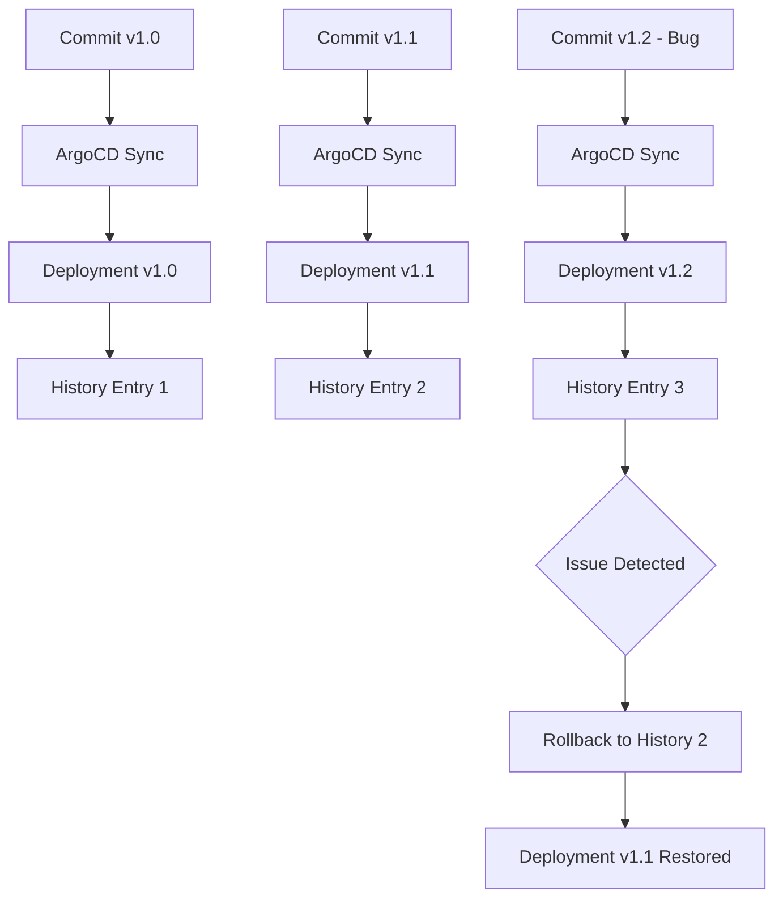
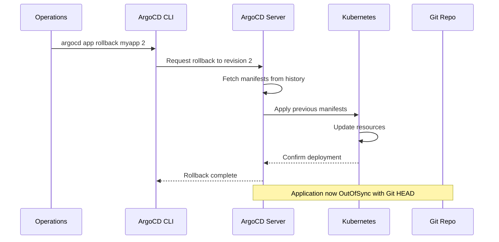
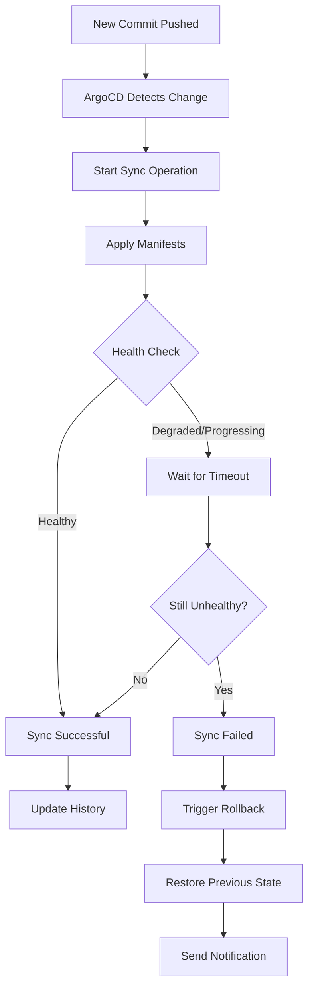
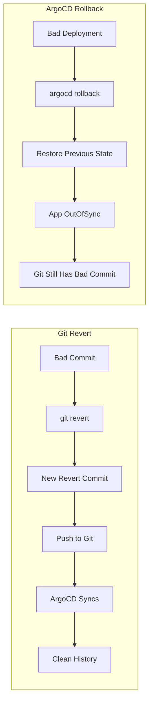
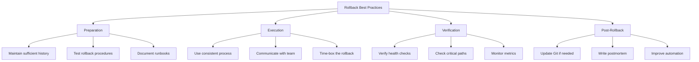

# How to Implement ArgoCD Rollbacks

By [Nawaz Dhandala](https://github.com/nawazdhandala)

Tags: Kubernetes, ArgoCD, GitOps, Rollback, DevOps, CI/CD, Deployment, Disaster Recovery

Description: A comprehensive guide to implementing rollbacks in ArgoCD, covering history management, manual and automated rollback procedures, Git revert strategies, and best practices for reliable deployment recovery.

---

> "The best rollback is one you never have to think about - ArgoCD makes recovery as simple as pointing to a previous state, whether through Git history or application revisions."

## Understanding ArgoCD History

ArgoCD maintains a history of all deployments for each application. This history is your safety net when things go wrong. Understanding how ArgoCD tracks revisions is essential for effective rollback strategies.



### Viewing Application History

```bash
# List all history entries for an application
# Shows revision number, deployment time, and sync status
argocd app history myapp

# Sample output:
# ID  DATE                           REVISION
# 1   2026-01-25 10:30:00 +0000 UTC  abc123def (v1.0.0)
# 2   2026-01-26 14:15:00 +0000 UTC  def456ghi (v1.1.0)
# 3   2026-01-27 09:00:00 +0000 UTC  ghi789jkl (v1.2.0)
```

### Inspecting a Specific Revision

```bash
# Get detailed information about a specific history entry
# Useful for understanding what was deployed at that point
argocd app history myapp --id 2

# View the manifests that were deployed in a specific revision
argocd app manifests myapp --revision def456ghi
```

### Configuring History Retention

```yaml
# argocd-cm ConfigMap - controls how much history ArgoCD retains
apiVersion: v1
kind: ConfigMap
metadata:
  name: argocd-cm
  namespace: argocd
data:
  # Number of history entries to keep per application
  # Higher values provide more rollback options but use more storage
  resource.customizations.health.argoproj.io_Application: |
    hs = {}
    hs.status = "Healthy"
    return hs
  # Configure history limit (default is 10)
  controller.status.processors: "20"
```

```yaml
# Per-application history limit in Application spec
apiVersion: argoproj.io/v1alpha1
kind: Application
metadata:
  name: myapp
  namespace: argocd
spec:
  project: default
  source:
    repoURL: https://github.com/myorg/myapp.git
    targetRevision: HEAD
    path: k8s/production
  destination:
    server: https://kubernetes.default.svc
    namespace: production
  # Retain last 15 revisions for this critical application
  revisionHistoryLimit: 15
```

## Manual Rollback Procedures

When you detect an issue with a deployment, manual rollback gives you precise control over the recovery process. ArgoCD provides multiple ways to perform manual rollbacks.



### Rollback Using CLI

```bash
# Rollback to a specific history ID
# This is the fastest way to recover from a bad deployment
argocd app rollback myapp 2

# Rollback with additional options
argocd app rollback myapp 2 \
  --prune  # Remove resources not in the target revision

# Verify the rollback was successful
argocd app get myapp
```

### Rollback Using the Web UI

The ArgoCD web interface provides a visual way to perform rollbacks:

1. Navigate to your application in the ArgoCD UI
2. Click on "History and Rollback" in the top menu
3. Select the revision you want to rollback to
4. Click "Rollback" and confirm the action

### Rollback Using Kubernetes API

```yaml
# You can trigger a rollback by patching the Application resource
# This approach works well in automation pipelines
apiVersion: argoproj.io/v1alpha1
kind: Application
metadata:
  name: myapp
  namespace: argocd
spec:
  source:
    # Set targetRevision to a specific commit SHA for rollback
    targetRevision: def456ghi  # Previous known-good commit
```

```bash
# Apply the rollback using kubectl
kubectl patch application myapp -n argocd --type merge \
  -p '{"spec":{"source":{"targetRevision":"def456ghi"}}}'

# Force a sync to apply the rollback immediately
argocd app sync myapp
```

### Emergency Rollback Script

```bash
#!/bin/bash
# emergency-rollback.sh - Quick rollback script for incidents
# Usage: ./emergency-rollback.sh <app-name> [revision-id]

set -e

APP_NAME="${1:?Application name required}"
REVISION_ID="${2:-}"

echo "Starting emergency rollback for ${APP_NAME}..."

# If no revision specified, rollback to previous
if [ -z "$REVISION_ID" ]; then
    # Get the second-to-last revision (previous deployment)
    REVISION_ID=$(argocd app history "$APP_NAME" -o json | \
        jq -r '.[-2].id // empty')

    if [ -z "$REVISION_ID" ]; then
        echo "Error: No previous revision found"
        exit 1
    fi
    echo "Rolling back to previous revision: ${REVISION_ID}"
fi

# Perform the rollback
argocd app rollback "$APP_NAME" "$REVISION_ID" --prune

# Wait for sync to complete
echo "Waiting for rollback to complete..."
argocd app wait "$APP_NAME" --health --timeout 300

# Verify application health
STATUS=$(argocd app get "$APP_NAME" -o json | jq -r '.status.health.status')
if [ "$STATUS" = "Healthy" ]; then
    echo "Rollback successful! Application is healthy."
else
    echo "Warning: Application status is ${STATUS}"
    exit 1
fi
```

## Automated Rollback with Health Checks

Automated rollbacks take the human element out of incident response. By combining ArgoCD's sync policies with health checks, you can create self-healing deployments.



### Configure Automated Sync with Rollback

```yaml
apiVersion: argoproj.io/v1alpha1
kind: Application
metadata:
  name: myapp
  namespace: argocd
  # Annotations for automated rollback behavior
  annotations:
    # Enable notifications on sync failure
    notifications.argoproj.io/subscribe.on-sync-failed.slack: alerts
spec:
  project: default
  source:
    repoURL: https://github.com/myorg/myapp.git
    targetRevision: HEAD
    path: k8s/production
  destination:
    server: https://kubernetes.default.svc
    namespace: production
  syncPolicy:
    automated:
      # Automatically sync when Git changes
      prune: true
      # Revert manual changes made to the cluster
      selfHeal: true
      # Allow empty resources (useful during rollback)
      allowEmpty: false
    syncOptions:
      - Validate=true
      - CreateNamespace=true
      # Apply resources in order (respects sync waves)
      - ApplyOutOfSyncOnly=true
    retry:
      # Retry failed syncs automatically
      limit: 3
      backoff:
        duration: 5s
        factor: 2
        maxDuration: 3m
```

### Custom Health Checks for Rollback Decisions

```yaml
# argocd-cm ConfigMap - define custom health checks
apiVersion: v1
kind: ConfigMap
metadata:
  name: argocd-cm
  namespace: argocd
data:
  # Custom health check for Deployments
  # Considers deployment unhealthy if less than 50% of pods are ready
  resource.customizations.health.apps_Deployment: |
    hs = {}
    if obj.status ~= nil then
      if obj.status.replicas ~= nil and obj.status.readyReplicas ~= nil then
        if obj.status.readyReplicas / obj.status.replicas < 0.5 then
          hs.status = "Degraded"
          hs.message = "Less than 50% of pods are ready"
          return hs
        end
      end
      if obj.status.conditions ~= nil then
        for i, condition in ipairs(obj.status.conditions) do
          if condition.type == "Available" and condition.status == "False" then
            hs.status = "Degraded"
            hs.message = condition.message
            return hs
          end
        end
      end
    end
    hs.status = "Healthy"
    return hs
```

### Automated Rollback Controller

For fully automated rollbacks, you can create a custom controller that monitors application health:

```yaml
# CronJob that checks application health and triggers rollback
apiVersion: batch/v1
kind: CronJob
metadata:
  name: argocd-auto-rollback
  namespace: argocd
spec:
  # Check every minute
  schedule: "* * * * *"
  jobTemplate:
    spec:
      template:
        spec:
          serviceAccountName: argocd-auto-rollback
          containers:
          - name: rollback-checker
            image: argoproj/argocd:v2.9.0
            command:
            - /bin/bash
            - -c
            - |
              # List of applications to monitor for auto-rollback
              APPS="myapp-production myapp-staging"

              for APP in $APPS; do
                # Get current health status
                HEALTH=$(argocd app get $APP -o json | jq -r '.status.health.status')
                SYNC=$(argocd app get $APP -o json | jq -r '.status.sync.status')

                # Check if unhealthy for more than 5 minutes
                if [ "$HEALTH" = "Degraded" ]; then
                  echo "Application $APP is degraded, initiating rollback..."

                  # Get previous healthy revision
                  PREV_REV=$(argocd app history $APP -o json | jq -r '.[-2].id')

                  if [ -n "$PREV_REV" ]; then
                    argocd app rollback $APP $PREV_REV
                    echo "Rolled back $APP to revision $PREV_REV"
                  fi
                fi
              done
          restartPolicy: OnFailure
```

### Progressive Delivery with Argo Rollouts

For more sophisticated automated rollbacks, combine ArgoCD with Argo Rollouts:

```yaml
# Rollout with automatic rollback on metrics failure
apiVersion: argoproj.io/v1alpha1
kind: Rollout
metadata:
  name: myapp
spec:
  replicas: 10
  strategy:
    canary:
      # Start with 20% of traffic
      steps:
      - setWeight: 20
      - pause: {duration: 5m}
      - setWeight: 50
      - pause: {duration: 5m}
      - setWeight: 100
      analysis:
        templates:
        - templateName: success-rate
        startingStep: 1
        args:
        - name: service-name
          value: myapp
  # Automatic rollback on analysis failure
  rollbackWindow:
    revisions: 3
---
# Analysis template for canary metrics
apiVersion: argoproj.io/v1alpha1
kind: AnalysisTemplate
metadata:
  name: success-rate
spec:
  args:
  - name: service-name
  metrics:
  - name: success-rate
    # Query Prometheus for success rate
    interval: 1m
    successCondition: result[0] >= 0.95
    failureLimit: 3
    provider:
      prometheus:
        address: http://prometheus:9090
        query: |
          sum(rate(http_requests_total{service="{{args.service-name}}",status=~"2.."}[5m])) /
          sum(rate(http_requests_total{service="{{args.service-name}}"}[5m]))
```

## Git Revert vs ArgoCD Rollback

Understanding when to use Git revert versus ArgoCD rollback is crucial for maintaining a clean deployment history and following GitOps principles.



### When to Use Git Revert

Git revert is the GitOps-native approach and should be your default choice:

```bash
# Revert the last commit
git revert HEAD --no-edit

# Revert a specific commit
git revert abc123def --no-edit

# Revert multiple commits
git revert HEAD~3..HEAD --no-edit

# Push the revert commit
git push origin main
```

```bash
# Complete Git revert workflow
# Step 1: Identify the bad commit
git log --oneline -10

# Step 2: Create a revert commit
git revert abc123def -m "Revert: deployment caused 5xx errors"

# Step 3: Push to trigger ArgoCD sync
git push origin main

# Step 4: Verify ArgoCD syncs the revert
argocd app get myapp --refresh
argocd app wait myapp --sync
```

Advantages of Git revert:
- Maintains complete audit trail in Git
- Works with automated sync policies
- Keeps Git and cluster in sync
- Follows GitOps principles

### When to Use ArgoCD Rollback

ArgoCD rollback is appropriate for emergency situations:

```bash
# Emergency rollback - faster than Git revert
# Use when every second counts
argocd app rollback myapp 2

# Then create a Git revert to match
git revert HEAD --no-edit
git push origin main
```

Use ArgoCD rollback when:
- You need immediate recovery (seconds matter)
- Git access is temporarily unavailable
- You need to verify the previous version works before committing to Git

### Hybrid Approach for Production

```bash
#!/bin/bash
# hybrid-rollback.sh - Best of both worlds
# Performs ArgoCD rollback immediately, then syncs with Git

APP_NAME="${1:?App name required}"
BAD_COMMIT="${2:?Bad commit SHA required}"

echo "Phase 1: Immediate ArgoCD rollback for fast recovery..."
argocd app rollback "$APP_NAME" --prune
argocd app wait "$APP_NAME" --health --timeout 120

echo "Phase 2: Creating Git revert for GitOps compliance..."
cd /path/to/gitops-repo
git fetch origin
git checkout main
git pull origin main

# Create revert commit
git revert "$BAD_COMMIT" --no-edit -m "Emergency revert: deployment issue"
git push origin main

echo "Phase 3: Syncing ArgoCD with Git revert..."
# Wait for ArgoCD to detect the change
sleep 10
argocd app sync "$APP_NAME"
argocd app wait "$APP_NAME" --sync --health

echo "Rollback complete. Git and cluster are now in sync."
```

### Comparison Table

| Aspect | Git Revert | ArgoCD Rollback |
|--------|------------|-----------------|
| Speed | Slower (requires push) | Immediate |
| GitOps Compliant | Yes | Temporarily breaks sync |
| Audit Trail | Complete in Git | Only in ArgoCD history |
| Requires Git Access | Yes | No |
| Cluster State After | Synced | OutOfSync |
| Best For | Planned rollbacks | Emergencies |

## Rollback Best Practices

Following these best practices ensures reliable and stress-free rollbacks when you need them most.



### 1. Maintain Adequate History

```yaml
# Ensure sufficient revision history for rollbacks
apiVersion: argoproj.io/v1alpha1
kind: Application
metadata:
  name: critical-app
spec:
  # Keep at least 10 revisions for critical applications
  # This provides a week+ of rollback options with daily deployments
  revisionHistoryLimit: 10
  # ... rest of spec
```

### 2. Implement Health Checks

```yaml
# Comprehensive health check configuration
apiVersion: apps/v1
kind: Deployment
metadata:
  name: myapp
spec:
  template:
    spec:
      containers:
      - name: myapp
        # Liveness probe - restart if unhealthy
        livenessProbe:
          httpGet:
            path: /health/live
            port: 8080
          initialDelaySeconds: 30
          periodSeconds: 10
          failureThreshold: 3
        # Readiness probe - remove from service if not ready
        readinessProbe:
          httpGet:
            path: /health/ready
            port: 8080
          initialDelaySeconds: 5
          periodSeconds: 5
          failureThreshold: 3
        # Startup probe - allow time for slow-starting apps
        startupProbe:
          httpGet:
            path: /health/started
            port: 8080
          failureThreshold: 30
          periodSeconds: 10
```

### 3. Use Sync Waves for Safe Deployments

```yaml
# Deploy database migrations before application updates
apiVersion: batch/v1
kind: Job
metadata:
  name: db-migrate
  annotations:
    # Run before main deployment
    argocd.argoproj.io/sync-wave: "-1"
    # Only keep successful jobs
    argocd.argoproj.io/hook-delete-policy: HookSucceeded
spec:
  template:
    spec:
      containers:
      - name: migrate
        image: myapp:latest
        command: ["./migrate.sh"]
      restartPolicy: Never
---
apiVersion: apps/v1
kind: Deployment
metadata:
  name: myapp
  annotations:
    # Deploy after migrations complete
    argocd.argoproj.io/sync-wave: "0"
```

### 4. Configure Notifications

```yaml
# Get alerted immediately when rollback is needed
apiVersion: v1
kind: ConfigMap
metadata:
  name: argocd-notifications-cm
  namespace: argocd
data:
  # Slack notification service
  service.slack: |
    token: $slack-token

  # Template for degraded applications
  template.app-degraded: |
    message: |
      :warning: Application {{.app.metadata.name}} is degraded!
      Health: {{.app.status.health.status}}
      Sync: {{.app.status.sync.status}}
      Revision: {{.app.status.sync.revision}}

      Consider rollback: `argocd app rollback {{.app.metadata.name}}`

  # Trigger on health degradation
  trigger.on-health-degraded: |
    - description: Application health is degraded
      send: [app-degraded]
      when: app.status.health.status == 'Degraded'
```

### 5. Test Rollback Procedures

```bash
#!/bin/bash
# test-rollback.sh - Regular rollback drill
# Run this monthly to ensure rollback procedures work

APP_NAME="myapp-staging"

echo "=== Rollback Drill Started ==="
echo "Testing rollback procedures for: $APP_NAME"

# Record current state
CURRENT_REV=$(argocd app get "$APP_NAME" -o json | jq -r '.status.sync.revision')
echo "Current revision: $CURRENT_REV"

# Get previous revision
HISTORY=$(argocd app history "$APP_NAME" -o json)
PREV_REV=$(echo "$HISTORY" | jq -r '.[-2].id')
echo "Previous revision: $PREV_REV"

# Perform rollback
echo "Executing rollback..."
START_TIME=$(date +%s)
argocd app rollback "$APP_NAME" "$PREV_REV"
argocd app wait "$APP_NAME" --health --timeout 120
END_TIME=$(date +%s)

DURATION=$((END_TIME - START_TIME))
echo "Rollback completed in ${DURATION} seconds"

# Verify health
HEALTH=$(argocd app get "$APP_NAME" -o json | jq -r '.status.health.status')
if [ "$HEALTH" = "Healthy" ]; then
    echo "SUCCESS: Application is healthy after rollback"
else
    echo "WARNING: Application health is $HEALTH"
fi

# Restore original state
echo "Restoring original state..."
argocd app sync "$APP_NAME" --revision "$CURRENT_REV"
argocd app wait "$APP_NAME" --health --timeout 120

echo "=== Rollback Drill Complete ==="
echo "Time to rollback: ${DURATION}s"
```

### 6. Document Runbooks

Create clear runbooks for your team:

```markdown
## Emergency Rollback Runbook

### Prerequisites
- ArgoCD CLI installed and authenticated
- Access to argocd namespace

### Quick Rollback (< 1 minute)
1. Identify the affected application
2. Run: `argocd app rollback <app-name>`
3. Verify: `argocd app get <app-name>`

### Detailed Rollback (with verification)
1. Check application history: `argocd app history <app-name>`
2. Identify last known good revision
3. Execute rollback: `argocd app rollback <app-name> <revision-id>`
4. Wait for completion: `argocd app wait <app-name> --health`
5. Verify health checks pass
6. Create Git revert if needed
7. Document in incident channel
```

## Best Practices Summary

| Practice | Description |
|----------|-------------|
| Keep sufficient history | Maintain at least 10 revisions for production apps |
| Implement health checks | Use liveness, readiness, and startup probes |
| Use sync waves | Control deployment order for safe rollouts |
| Configure notifications | Get alerted immediately on degradation |
| Test regularly | Run rollback drills monthly |
| Document runbooks | Clear procedures reduce MTTR |
| Prefer Git revert | Maintains GitOps compliance |
| Use ArgoCD rollback for emergencies | When seconds matter |
| Automate where possible | Reduce human error in incidents |
| Monitor post-rollback | Verify the rollback actually fixed the issue |

---

Effective rollback strategies are essential for maintaining reliable deployments. ArgoCD provides powerful tools for both manual and automated rollbacks, but the key is preparation. Regular testing, clear documentation, and proper health checks ensure that when issues occur, recovery is swift and stress-free.

For comprehensive monitoring of your ArgoCD deployments and automated alerting on deployment issues, check out [OneUptime](https://oneuptime.com) - the open-source observability platform that helps you detect and respond to incidents before they impact your users.
