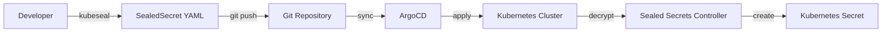
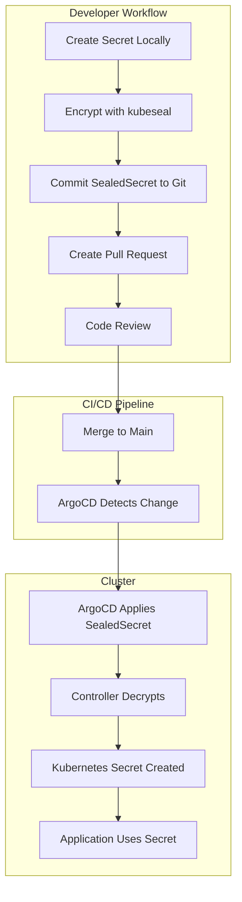
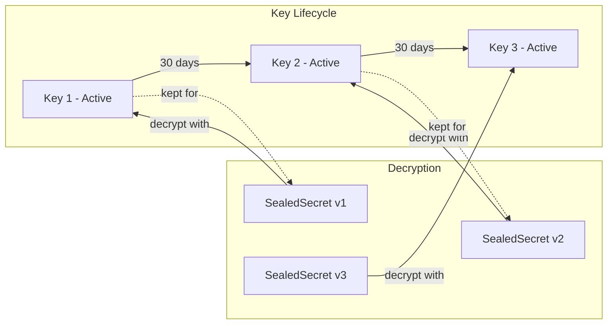
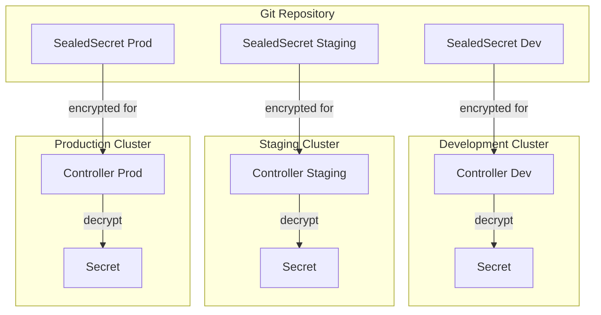

# How to Handle ArgoCD Secrets with Sealed Secrets

Author: [nawazdhandala](https://www.github.com/nawazdhandala)

Tags: Kubernetes, ArgoCD, Sealed Secrets, GitOps, Security, DevOps, Secrets Management

Description: A comprehensive guide to managing secrets in ArgoCD using Bitnami Sealed Secrets, covering controller installation, secret encryption, key rotation, and GitOps best practices for secure secret management.

---

> "The only truly secure system is one that is powered off, cast in a block of concrete and sealed in a lead-lined room with armed guards." - Gene Spafford

GitOps demands that everything lives in Git. But secrets? You cannot just commit plaintext passwords to a repository. Sealed Secrets solves this by encrypting secrets client-side so only your cluster can decrypt them. The encrypted version is safe to commit, review, and version alongside your application manifests.

## Why Sealed Secrets for ArgoCD?

ArgoCD watches Git repositories and syncs cluster state. This GitOps model breaks down when secrets are involved because you cannot store Kubernetes Secrets in Git without encryption. Sealed Secrets bridges this gap.



Key benefits:

1. **Git-native** - Encrypted secrets live alongside application manifests
2. **Cluster-scoped decryption** - Only the target cluster can decrypt secrets
3. **Audit trail** - Full history of secret changes in Git
4. **No external dependencies** - No Vault, no cloud KMS required

## Installing the Sealed Secrets Controller

The controller runs in your cluster and holds the private key for decryption. Install it before creating any SealedSecrets.

### Option 1: Using Helm (Recommended)

```bash
# Add the Sealed Secrets Helm repository
helm repo add sealed-secrets https://bitnami-labs.github.io/sealed-secrets

# Update repository cache to get latest charts
helm repo update

# Install the controller in the kube-system namespace
# This creates the controller deployment and generates encryption keys
helm install sealed-secrets sealed-secrets/sealed-secrets \
  --namespace kube-system \
  --set fullnameOverride=sealed-secrets-controller
```

### Option 2: Using kubectl

```bash
# Apply the controller manifest directly from GitHub releases
# Replace v0.24.0 with the latest version
kubectl apply -f https://github.com/bitnami-labs/sealed-secrets/releases/download/v0.24.0/controller.yaml
```

### Verify Installation

```bash
# Check that the controller pod is running
kubectl get pods -n kube-system -l app.kubernetes.io/name=sealed-secrets

# Verify the controller logs for successful startup
kubectl logs -n kube-system -l app.kubernetes.io/name=sealed-secrets

# The controller generates a key pair on first startup
# This key pair is stored as a Secret in kube-system
kubectl get secret -n kube-system -l sealedsecrets.bitnami.com/sealed-secrets-key
```

### Install kubeseal CLI

The `kubeseal` CLI encrypts secrets using the controller's public key.

```bash
# macOS using Homebrew
brew install kubeseal

# Linux - download binary directly
KUBESEAL_VERSION='0.24.0'
wget "https://github.com/bitnami-labs/sealed-secrets/releases/download/v${KUBESEAL_VERSION}/kubeseal-${KUBESEAL_VERSION}-linux-amd64.tar.gz"
tar -xvzf kubeseal-${KUBESEAL_VERSION}-linux-amd64.tar.gz kubeseal
sudo install -m 755 kubeseal /usr/local/bin/kubeseal

# Verify installation by fetching the controller's public key
kubeseal --fetch-cert --controller-name=sealed-secrets-controller --controller-namespace=kube-system
```

## Encrypting Secrets with kubeseal

The encryption workflow converts a standard Kubernetes Secret into a SealedSecret that is safe for Git.

### Basic Encryption

```bash
# Create a regular Kubernetes Secret manifest (do NOT apply this)
# Using --dry-run ensures we only generate YAML without creating the resource
kubectl create secret generic db-credentials \
  --from-literal=username=admin \
  --from-literal=password='super-secret-password' \
  --dry-run=client -o yaml > secret.yaml

# Encrypt the Secret using kubeseal
# The output is a SealedSecret that can be safely committed to Git
kubeseal --format yaml \
  --controller-name=sealed-secrets-controller \
  --controller-namespace=kube-system \
  < secret.yaml > sealed-secret.yaml

# Remove the plaintext secret - never commit this
rm secret.yaml
```

### Encrypted SealedSecret Structure

The resulting SealedSecret contains encrypted data that only your cluster can decrypt:

```yaml
# sealed-secret.yaml - safe to commit to Git
apiVersion: bitnami.com/v1alpha1
kind: SealedSecret
metadata:
  name: db-credentials
  namespace: default
spec:
  encryptedData:
    # Each value is individually encrypted
    # The ciphertext includes the namespace and name to prevent reuse attacks
    username: AgBy3i4OJSWK+PiTySYZZA9rO43cGDEq...
    password: AgBOhGvJKMWpYDE2kz8xQKmnSzNj3Yj...
  template:
    metadata:
      name: db-credentials
      namespace: default
    type: Opaque
```

### Encrypting from Files

For complex secrets like TLS certificates or configuration files:

```bash
# Create a Secret from files
kubectl create secret generic tls-secret \
  --from-file=tls.crt=./certificate.crt \
  --from-file=tls.key=./private.key \
  --dry-run=client -o yaml | \
  kubeseal --format yaml \
    --controller-name=sealed-secrets-controller \
    --controller-namespace=kube-system \
    > sealed-tls-secret.yaml
```

### Namespace and Scope Control

Sealed Secrets support different scopes to control where secrets can be decrypted:

```bash
# strict (default) - Secret must be created in the exact namespace and name
kubeseal --scope strict \
  --controller-name=sealed-secrets-controller \
  --controller-namespace=kube-system \
  < secret.yaml > sealed-secret.yaml

# namespace-wide - Secret can be created with any name in the specified namespace
kubeseal --scope namespace-wide \
  --controller-name=sealed-secrets-controller \
  --controller-namespace=kube-system \
  < secret.yaml > sealed-secret.yaml

# cluster-wide - Secret can be created anywhere in the cluster
# Use with caution - reduces security isolation
kubeseal --scope cluster-wide \
  --controller-name=sealed-secrets-controller \
  --controller-namespace=kube-system \
  < secret.yaml > sealed-secret.yaml
```

## GitOps Workflow with Sealed Secrets

Integrating Sealed Secrets into your ArgoCD GitOps workflow requires a structured approach.



### Repository Structure

Organize your GitOps repository to separate SealedSecrets from other manifests:

```
gitops-repo/
├── apps/
│   └── myapp/
│       ├── base/
│       │   ├── kustomization.yaml
│       │   ├── deployment.yaml
│       │   └── service.yaml
│       └── overlays/
│           ├── development/
│           │   ├── kustomization.yaml
│           │   └── sealed-secrets/
│           │       └── db-credentials.yaml
│           ├── staging/
│           │   ├── kustomization.yaml
│           │   └── sealed-secrets/
│           │       └── db-credentials.yaml
│           └── production/
│               ├── kustomization.yaml
│               └── sealed-secrets/
│                   └── db-credentials.yaml
└── infrastructure/
    └── sealed-secrets/
        └── controller.yaml
```

### Kustomization with SealedSecrets

Include SealedSecrets in your Kustomize overlays:

```yaml
# apps/myapp/overlays/production/kustomization.yaml
apiVersion: kustomize.config.k8s.io/v1beta1
kind: Kustomization

namespace: production

resources:
  - ../../base
  # Include SealedSecrets in the overlay
  - sealed-secrets/db-credentials.yaml

# Patch deployment to use the secret
patches:
  - patch: |-
      - op: add
        path: /spec/template/spec/containers/0/envFrom
        value:
          - secretRef:
              name: db-credentials
    target:
      kind: Deployment
      name: myapp
```

### ArgoCD Application Configuration

Configure ArgoCD to sync the SealedSecrets along with your application:

```yaml
# ArgoCD Application manifest
apiVersion: argoproj.io/v1alpha1
kind: Application
metadata:
  name: myapp-production
  namespace: argocd
spec:
  project: default
  source:
    repoURL: https://github.com/myorg/gitops-repo.git
    targetRevision: HEAD
    path: apps/myapp/overlays/production
  destination:
    server: https://kubernetes.default.svc
    namespace: production
  syncPolicy:
    automated:
      prune: true
      selfHeal: true
    syncOptions:
      - CreateNamespace=true
```

### Sync Wave Ordering

Ensure secrets are created before deployments that depend on them:

```yaml
# sealed-secrets/db-credentials.yaml
apiVersion: bitnami.com/v1alpha1
kind: SealedSecret
metadata:
  name: db-credentials
  namespace: production
  annotations:
    # Sync wave -1 ensures secrets are created first
    argocd.argoproj.io/sync-wave: "-1"
spec:
  encryptedData:
    username: AgBy3i4OJSWK+PiTySYZZA9rO43cGDEq...
    password: AgBOhGvJKMWpYDE2kz8xQKmnSzNj3Yj...
```

```yaml
# deployment.yaml
apiVersion: apps/v1
kind: Deployment
metadata:
  name: myapp
  annotations:
    # Sync wave 0 runs after secrets (wave -1)
    argocd.argoproj.io/sync-wave: "0"
spec:
  template:
    spec:
      containers:
        - name: myapp
          envFrom:
            - secretRef:
                name: db-credentials
```

## Key Rotation

Regularly rotating encryption keys is a security best practice. Sealed Secrets supports key rotation without disrupting existing secrets.

### Understanding Key Management



The controller keeps old keys to decrypt existing SealedSecrets while new secrets use the latest key.

### Automatic Key Rotation

Configure automatic key rotation in the Helm values:

```yaml
# sealed-secrets-values.yaml
# Key rotation interval - generates new key every 30 days
keyrenewperiod: "720h"

# Enable automatic key generation
secretName: "sealed-secrets-key"

# Number of old keys to retain for decrypting existing secrets
# Retain enough keys to cover your secret refresh cycle
resources:
  requests:
    memory: "64Mi"
    cpu: "100m"
  limits:
    memory: "128Mi"
    cpu: "200m"
```

```bash
# Install or upgrade with rotation enabled
helm upgrade sealed-secrets sealed-secrets/sealed-secrets \
  --namespace kube-system \
  --values sealed-secrets-values.yaml
```

### Manual Key Rotation

Force immediate key rotation when required (e.g., after a security incident):

```bash
# Generate a new sealing key
# The controller automatically detects and uses the new key
kubectl -n kube-system label secret \
  -l sealedsecrets.bitnami.com/sealed-secrets-key \
  sealedsecrets.bitnami.com/sealed-secrets-key=compromised

# Restart the controller to pick up the new label
kubectl rollout restart deployment sealed-secrets-controller -n kube-system

# Verify new key is active
kubectl get secret -n kube-system \
  -l sealedsecrets.bitnami.com/sealed-secrets-key \
  --show-labels
```

### Re-encrypting Secrets After Rotation

After rotation, re-encrypt all SealedSecrets with the new key:

```bash
#!/bin/bash
# re-encrypt-secrets.sh
# Re-encrypts all SealedSecrets in a directory with the current key

SEALED_SECRETS_DIR="./apps"
CONTROLLER_NAME="sealed-secrets-controller"
CONTROLLER_NAMESPACE="kube-system"

# Find all SealedSecret files
find "$SEALED_SECRETS_DIR" -name "*.yaml" -type f | while read -r file; do
  # Check if file contains a SealedSecret
  if grep -q "kind: SealedSecret" "$file"; then
    echo "Re-encrypting: $file"

    # Extract the original secret (requires cluster access)
    SECRET_NAME=$(yq e '.metadata.name' "$file")
    SECRET_NS=$(yq e '.metadata.namespace' "$file")

    # Get the decrypted secret from the cluster
    kubectl get secret "$SECRET_NAME" -n "$SECRET_NS" -o yaml | \
      # Remove cluster-specific metadata
      yq e 'del(.metadata.resourceVersion, .metadata.uid, .metadata.creationTimestamp, .metadata.annotations)' - | \
      # Re-encrypt with the new key
      kubeseal --format yaml \
        --controller-name="$CONTROLLER_NAME" \
        --controller-namespace="$CONTROLLER_NAMESPACE" \
        > "$file.new"

    # Replace the old file
    mv "$file.new" "$file"
    echo "Re-encrypted: $file"
  fi
done
```

### Backing Up Keys

Always backup your sealing keys to recover from disasters:

```bash
# Export all sealing keys (store securely - these are sensitive)
kubectl get secret -n kube-system \
  -l sealedsecrets.bitnami.com/sealed-secrets-key \
  -o yaml > sealed-secrets-keys-backup.yaml

# Store this backup in a secure location:
# - Hardware security module (HSM)
# - Cloud KMS with strict access controls
# - Encrypted offline storage

# To restore keys to a new cluster:
kubectl apply -f sealed-secrets-keys-backup.yaml
kubectl rollout restart deployment sealed-secrets-controller -n kube-system
```

## Multi-Cluster Considerations

When running ArgoCD with multiple clusters, each cluster needs its own Sealed Secrets controller with unique keys.



### Encrypting for Specific Clusters

```bash
# Fetch the public certificate from each cluster
# Development cluster
kubeseal --fetch-cert \
  --controller-name=sealed-secrets-controller \
  --controller-namespace=kube-system \
  --kubeconfig=~/.kube/dev-config > dev-cert.pem

# Staging cluster
kubeseal --fetch-cert \
  --controller-name=sealed-secrets-controller \
  --controller-namespace=kube-system \
  --kubeconfig=~/.kube/staging-config > staging-cert.pem

# Production cluster
kubeseal --fetch-cert \
  --controller-name=sealed-secrets-controller \
  --controller-namespace=kube-system \
  --kubeconfig=~/.kube/prod-config > prod-cert.pem

# Encrypt secrets using the appropriate certificate
# For development
kubeseal --format yaml --cert dev-cert.pem < secret.yaml > sealed-secret-dev.yaml

# For staging
kubeseal --format yaml --cert staging-cert.pem < secret.yaml > sealed-secret-staging.yaml

# For production
kubeseal --format yaml --cert prod-cert.pem < secret.yaml > sealed-secret-prod.yaml
```

## Troubleshooting

### SealedSecret Not Decrypting

```bash
# Check the controller logs for decryption errors
kubectl logs -n kube-system deployment/sealed-secrets-controller

# Common errors:
# - "no key could decrypt secret" - key mismatch
# - "namespace mismatch" - secret scope violation

# Verify the SealedSecret was encrypted for this cluster
kubeseal --validate \
  --controller-name=sealed-secrets-controller \
  --controller-namespace=kube-system \
  < sealed-secret.yaml
```

### ArgoCD Shows OutOfSync

```bash
# Check if the Secret was created
kubectl get secret db-credentials -n production

# If missing, check SealedSecret status
kubectl get sealedsecret db-credentials -n production -o yaml

# Look for status conditions indicating errors
kubectl describe sealedsecret db-credentials -n production
```

### Certificate Expired

```bash
# Fetch a fresh certificate from the cluster
kubeseal --fetch-cert \
  --controller-name=sealed-secrets-controller \
  --controller-namespace=kube-system \
  > current-cert.pem

# Re-encrypt all secrets with the fresh cert
# Use the re-encrypt script from the Key Rotation section
```

## Best Practices Summary

1. **Never commit plaintext secrets** - Always use SealedSecrets for GitOps
2. **Use strict scope** - Default to strict namespace+name binding for maximum security
3. **Rotate keys regularly** - Configure automatic rotation (e.g., every 30 days)
4. **Backup sealing keys** - Store encrypted backups in secure, separate locations
5. **Use sync waves** - Ensure secrets deploy before dependent applications
6. **Audit secret changes** - Git history provides a complete audit trail
7. **Separate secrets by environment** - Each environment should have its own encrypted secrets
8. **Monitor controller health** - Use [OneUptime](https://oneuptime.com) to monitor the Sealed Secrets controller and get alerted if decryption fails

---

Sealed Secrets makes GitOps possible for secret management. Your secrets live encrypted in Git, reviewed like code, and deployed automatically by ArgoCD. The workflow is straightforward: encrypt locally, commit to Git, let ArgoCD sync, and the controller handles decryption. Combined with regular key rotation and proper monitoring with [OneUptime](https://oneuptime.com), you have a secure, auditable, and fully automated secret management pipeline.
