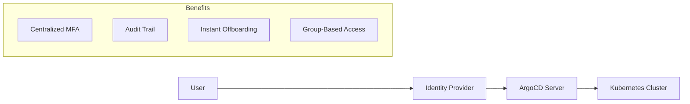
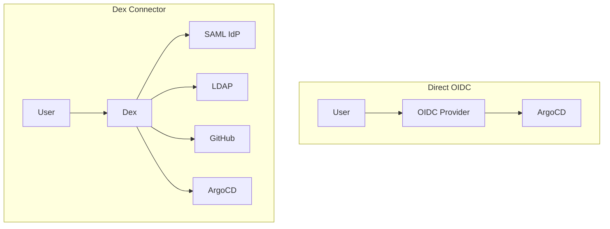
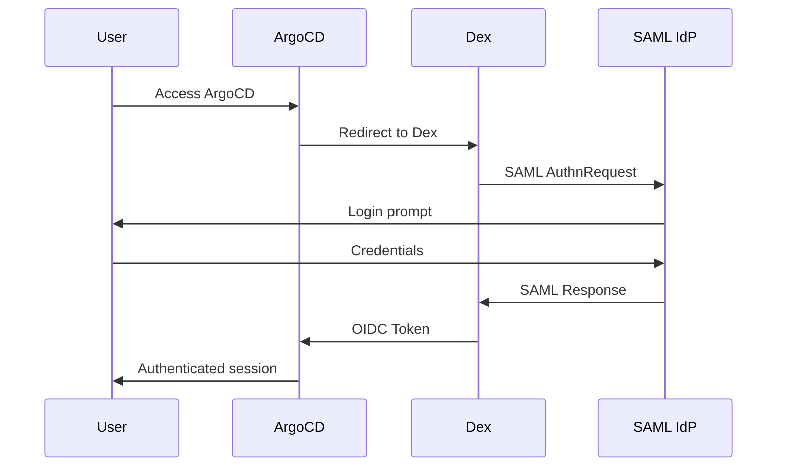
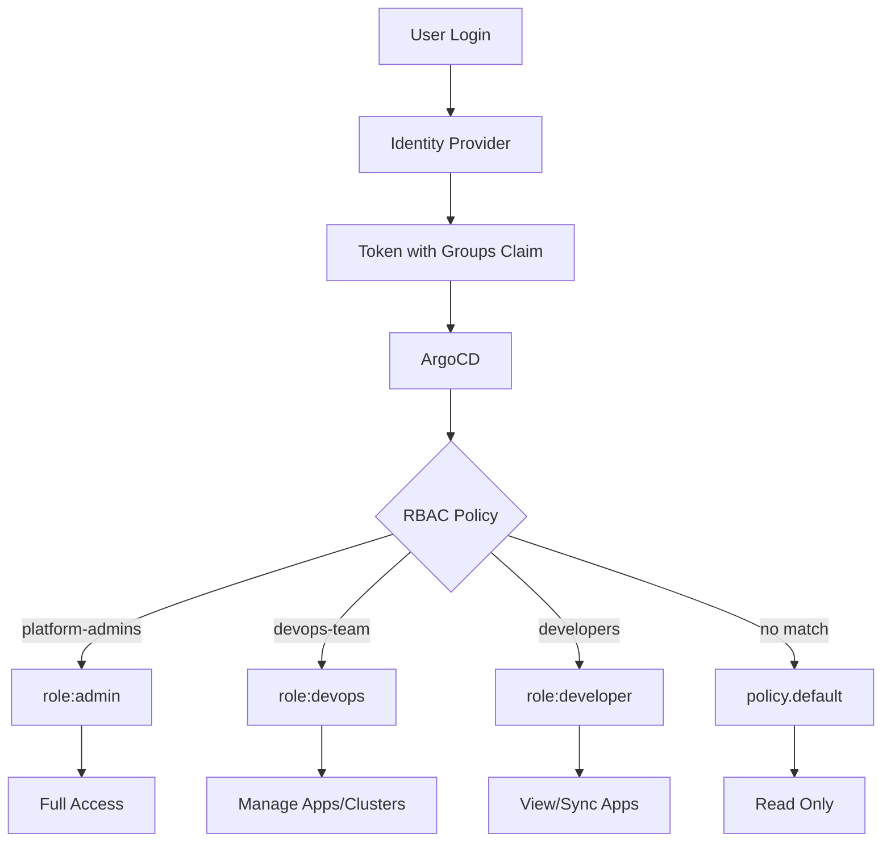

# How to Configure ArgoCD SSO

By [Nawaz Dhandala](https://github.com/nawazdhandala)

Tags: ArgoCD, SSO, OIDC, SAML, Dex, Kubernetes, Authentication, RBAC, Security

Description: A comprehensive guide to configuring Single Sign-On (SSO) in ArgoCD using OIDC, SAML, and Dex, including RBAC integration with identity provider groups for secure GitOps workflows.

---

> "Security is not a product, but a process." - Bruce Schneier

ArgoCD ships with local user authentication by default, but production deployments demand more. Single Sign-On (SSO) centralizes authentication, enforces MFA through your identity provider, and maps IdP groups to ArgoCD roles. This guide covers every path: direct OIDC, SAML via Dex, and group-based RBAC.

## Why SSO for ArgoCD?



Key benefits:
1. **Centralized authentication** - One login for all tools
2. **MFA enforcement** - Handled by your IdP, not ArgoCD
3. **Automatic offboarding** - Remove user from IdP, access revoked everywhere
4. **Group-based RBAC** - Map IdP groups directly to ArgoCD roles
5. **Audit compliance** - All logins traced to corporate identity

## SSO Architecture Overview

ArgoCD supports two SSO paths:



**Direct OIDC**: Use when your IdP supports OIDC natively (Okta, Azure AD, Google).

**Dex**: Use when you need SAML, LDAP, or multiple identity sources.

## Option 1: OIDC Configuration

OIDC is the cleanest path when your IdP supports it. ArgoCD connects directly without Dex.

### Okta OIDC Setup

First, create an application in Okta:

1. Navigate to Applications > Create App Integration
2. Select OIDC and Web Application
3. Set the redirect URI to `https://argocd.example.com/auth/callback`
4. Note the Client ID and Client Secret

Configure ArgoCD:

```yaml
# argocd-cm ConfigMap
# This configures the OIDC provider for ArgoCD authentication
apiVersion: v1
kind: ConfigMap
metadata:
  name: argocd-cm
  namespace: argocd
data:
  # URL where ArgoCD is accessible - used for redirect URIs
  url: https://argocd.example.com

  # OIDC configuration block
  oidc.config: |
    # Display name shown on the login button
    name: Okta

    # OIDC issuer URL - must match your Okta domain
    issuer: https://your-org.okta.com

    # Client credentials from Okta application
    clientID: your-client-id
    clientSecret: $oidc.okta.clientSecret

    # Scopes to request - groups is required for RBAC
    requestedScopes:
      - openid
      - profile
      - email
      - groups

    # Claim that contains group membership
    # Okta uses 'groups' by default
    requestedIDTokenClaims:
      groups:
        essential: true
```

Store the client secret securely:

```yaml
# argocd-secret Secret
# Store sensitive credentials here, not in ConfigMap
apiVersion: v1
kind: Secret
metadata:
  name: argocd-secret
  namespace: argocd
type: Opaque
stringData:
  # Reference this in ConfigMap with $oidc.okta.clientSecret
  oidc.okta.clientSecret: your-client-secret
```

### Azure AD OIDC Setup

Azure AD requires app registration:

1. Navigate to Azure Portal > App registrations > New registration
2. Set redirect URI to `https://argocd.example.com/auth/callback`
3. Under Certificates & secrets, create a new client secret
4. Under Token configuration, add the `groups` optional claim

```yaml
# argocd-cm ConfigMap for Azure AD
apiVersion: v1
kind: ConfigMap
metadata:
  name: argocd-cm
  namespace: argocd
data:
  url: https://argocd.example.com

  oidc.config: |
    name: Azure AD

    # Azure AD issuer includes tenant ID
    issuer: https://login.microsoftonline.com/YOUR_TENANT_ID/v2.0

    clientID: your-app-client-id
    clientSecret: $oidc.azure.clientSecret

    requestedScopes:
      - openid
      - profile
      - email

    # Azure AD returns groups in 'groups' claim by default
    # For large group counts, configure group filtering in Azure
    requestedIDTokenClaims:
      groups:
        essential: true
```

### Google Workspace OIDC

Google requires a Cloud Console project:

1. Create OAuth 2.0 credentials in Google Cloud Console
2. Add authorized redirect URI: `https://argocd.example.com/auth/callback`
3. Enable the Admin SDK API for group claims

```yaml
# argocd-cm ConfigMap for Google Workspace
apiVersion: v1
kind: ConfigMap
metadata:
  name: argocd-cm
  namespace: argocd
data:
  url: https://argocd.example.com

  oidc.config: |
    name: Google
    issuer: https://accounts.google.com

    clientID: your-client-id.apps.googleusercontent.com
    clientSecret: $oidc.google.clientSecret

    requestedScopes:
      - openid
      - profile
      - email

    # Google doesn't include groups by default
    # Use Dex with Google connector for group support
```

## Option 2: SAML Integration via Dex

Many enterprises require SAML. ArgoCD uses Dex as a SAML-to-OIDC bridge.

### Dex Architecture



### SAML with Okta

Configure Okta SAML application:

1. Create a SAML 2.0 application in Okta
2. Set Single Sign-On URL to `https://argocd.example.com/api/dex/callback`
3. Set Audience URI to `https://argocd.example.com/api/dex/callback`
4. Add group attribute statement

```yaml
# argocd-cm ConfigMap with Dex SAML connector
apiVersion: v1
kind: ConfigMap
metadata:
  name: argocd-cm
  namespace: argocd
data:
  url: https://argocd.example.com

  # Dex configuration for SAML
  dex.config: |
    # Dex OIDC connector for ArgoCD
    connectors:
      - type: saml
        id: okta
        name: Okta SAML
        config:
          # SSO URL from Okta application
          ssoURL: https://your-org.okta.com/app/xxx/sso/saml

          # CA certificate for validating SAML responses
          # Download from Okta SAML settings
          caData: |
            LS0tLS1CRUdJTiBDRVJUSUZJQ0FURS0tLS0t...

          # Must match Audience URI in Okta
          redirectURI: https://argocd.example.com/api/dex/callback

          # Attribute mappings - adjust based on your SAML assertions
          usernameAttr: email
          emailAttr: email

          # Group attribute name from SAML assertion
          groupsAttr: groups

          # Optional: filter groups by prefix
          # groupsDelim: ","
```

### SAML with Azure AD

```yaml
# Dex configuration for Azure AD SAML
apiVersion: v1
kind: ConfigMap
metadata:
  name: argocd-cm
  namespace: argocd
data:
  url: https://argocd.example.com

  dex.config: |
    connectors:
      - type: saml
        id: azure
        name: Azure AD
        config:
          # Federation metadata URL from Azure AD
          ssoURL: https://login.microsoftonline.com/TENANT_ID/saml2

          # Download certificate from Azure AD SAML configuration
          caData: |
            LS0tLS1CRUdJTiBDRVJUSUZJQ0FURS0tLS0t...

          redirectURI: https://argocd.example.com/api/dex/callback

          # Azure AD attribute names
          usernameAttr: http://schemas.xmlsoap.org/ws/2005/05/identity/claims/name
          emailAttr: http://schemas.xmlsoap.org/ws/2005/05/identity/claims/emailaddress
          groupsAttr: http://schemas.microsoft.com/ws/2008/06/identity/claims/groups

          # Entity ID must match Azure AD configuration
          entityIssuer: https://argocd.example.com/api/dex/callback
```

## Option 3: Dex with Multiple Connectors

Dex shines when you need multiple identity sources or protocols not directly supported.

### GitHub Connector

```yaml
# Dex configuration for GitHub authentication
apiVersion: v1
kind: ConfigMap
metadata:
  name: argocd-cm
  namespace: argocd
data:
  url: https://argocd.example.com

  dex.config: |
    connectors:
      - type: github
        id: github
        name: GitHub
        config:
          # Create OAuth App at GitHub > Settings > Developer settings
          clientID: your-github-client-id
          clientSecret: $dex.github.clientSecret

          # Redirect URI registered in GitHub OAuth App
          redirectURI: https://argocd.example.com/api/dex/callback

          # Restrict to specific org
          orgs:
            - name: your-org
              # Optionally restrict to specific teams
              teams:
                - platform-team
                - developers

          # Load all teams for RBAC mapping
          loadAllGroups: true

          # Use team slug for group names (e.g., your-org:platform-team)
          teamNameField: slug
```

### LDAP Connector

```yaml
# Dex configuration for LDAP/Active Directory
apiVersion: v1
kind: ConfigMap
metadata:
  name: argocd-cm
  namespace: argocd
data:
  url: https://argocd.example.com

  dex.config: |
    connectors:
      - type: ldap
        id: ldap
        name: Corporate LDAP
        config:
          # LDAP server address
          host: ldap.example.com:636

          # Use TLS
          insecureNoSSL: false
          insecureSkipVerify: false

          # CA certificate for LDAP server
          rootCAData: |
            LS0tLS1CRUdJTiBDRVJUSUZJQ0FURS0tLS0t...

          # Bind credentials for searching
          bindDN: cn=argocd-service,ou=services,dc=example,dc=com
          bindPW: $dex.ldap.bindPW

          # User search configuration
          userSearch:
            baseDN: ou=users,dc=example,dc=com
            filter: "(objectClass=person)"
            username: sAMAccountName
            idAttr: distinguishedName
            emailAttr: mail
            nameAttr: displayName

          # Group search configuration
          groupSearch:
            baseDN: ou=groups,dc=example,dc=com
            filter: "(objectClass=group)"
            userMatchers:
              - userAttr: distinguishedName
                groupAttr: member
            nameAttr: cn
```

### Multiple Connectors

```yaml
# Dex configuration with multiple identity sources
apiVersion: v1
kind: ConfigMap
metadata:
  name: argocd-cm
  namespace: argocd
data:
  url: https://argocd.example.com

  dex.config: |
    # Users can choose which provider to authenticate with
    connectors:
      # Primary: Corporate SSO
      - type: saml
        id: corporate-sso
        name: Corporate SSO
        config:
          ssoURL: https://sso.example.com/saml
          caData: |
            LS0tLS1CRUdJTiBDRVJUSUZJQ0FURS0tLS0t...
          redirectURI: https://argocd.example.com/api/dex/callback
          usernameAttr: email
          emailAttr: email
          groupsAttr: groups

      # Secondary: GitHub for external contributors
      - type: github
        id: github
        name: GitHub (External)
        config:
          clientID: your-github-client-id
          clientSecret: $dex.github.clientSecret
          redirectURI: https://argocd.example.com/api/dex/callback
          orgs:
            - name: your-org
          loadAllGroups: true
```

## RBAC with SSO Groups

SSO without RBAC is incomplete. Map IdP groups to ArgoCD permissions.

### RBAC Configuration

```yaml
# argocd-rbac-cm ConfigMap
# Defines who can do what in ArgoCD
apiVersion: v1
kind: ConfigMap
metadata:
  name: argocd-rbac-cm
  namespace: argocd
data:
  # Default policy for authenticated users with no matching rules
  # Options: role:readonly, role:admin, or blank (no access)
  policy.default: role:readonly

  # CSV-based policy rules
  # Format: p, <subject>, <resource>, <action>, <object>, <effect>
  # Groups from IdP are referenced directly
  policy.csv: |
    # Platform team gets full admin access
    g, platform-admins, role:admin

    # DevOps team can manage applications and clusters
    p, role:devops, applications, *, */*, allow
    p, role:devops, clusters, get, *, allow
    p, role:devops, repositories, *, *, allow
    p, role:devops, logs, get, *, allow
    p, role:devops, exec, create, */*, allow
    g, devops-team, role:devops

    # Developers can view and sync their team's apps
    p, role:developer, applications, get, */*, allow
    p, role:developer, applications, sync, */*, allow
    p, role:developer, logs, get, *, allow
    g, developers, role:developer

    # QA team has read-only access
    p, role:qa, applications, get, */*, allow
    p, role:qa, logs, get, *, allow
    g, qa-team, role:qa

    # Project-scoped access example
    # Backend team only manages backend-* applications
    p, role:backend-team, applications, *, backend/*, allow
    p, role:backend-team, logs, get, *, allow
    g, backend-developers, role:backend-team

  # Match groups from OIDC/SAML claims
  # Scopes control which claims ArgoCD reads
  scopes: '[groups, email]'
```

### RBAC Flow Diagram



### Project-Level RBAC

For multi-tenant clusters, use ArgoCD Projects with RBAC:

```yaml
# AppProject with RBAC
apiVersion: argoproj.io/v1alpha1
kind: AppProject
metadata:
  name: team-frontend
  namespace: argocd
spec:
  description: Frontend team applications

  # Allowed source repositories
  sourceRepos:
    - 'https://github.com/myorg/frontend-*'

  # Allowed deployment targets
  destinations:
    - namespace: 'frontend-*'
      server: https://kubernetes.default.svc

  # Cluster resources this project can deploy
  clusterResourceWhitelist:
    - group: ''
      kind: Namespace

  # Project-level roles mapped to IdP groups
  roles:
    - name: admin
      description: Frontend team admin
      policies:
        - p, proj:team-frontend:admin, applications, *, team-frontend/*, allow
      # Map to IdP group
      groups:
        - frontend-leads

    - name: developer
      description: Frontend developer
      policies:
        - p, proj:team-frontend:developer, applications, get, team-frontend/*, allow
        - p, proj:team-frontend:developer, applications, sync, team-frontend/*, allow
      groups:
        - frontend-developers
```

### Testing RBAC

Verify group memberships and permissions:

```bash
# Check current user's groups
argocd account get-user-info

# Test what a specific user can do
argocd admin settings rbac can <username> get applications '*/*'

# Validate RBAC policy syntax
argocd admin settings rbac validate --policy-file policy.csv
```

## Complete Configuration Example

Here's a production-ready configuration combining all components:

```yaml
# Complete ArgoCD SSO configuration
---
apiVersion: v1
kind: ConfigMap
metadata:
  name: argocd-cm
  namespace: argocd
data:
  # ArgoCD server URL
  url: https://argocd.example.com

  # Application status badge feature
  statusbadge.enabled: "true"

  # Disable local admin after SSO is working
  # admin.enabled: "false"

  # OIDC configuration for Okta
  oidc.config: |
    name: Okta
    issuer: https://your-org.okta.com
    clientID: your-client-id
    clientSecret: $oidc.okta.clientSecret
    requestedScopes:
      - openid
      - profile
      - email
      - groups
    requestedIDTokenClaims:
      groups:
        essential: true

---
apiVersion: v1
kind: ConfigMap
metadata:
  name: argocd-rbac-cm
  namespace: argocd
data:
  # No default access - must match a group
  policy.default: ''

  policy.csv: |
    # Admin access for platform team
    g, argocd-admins, role:admin

    # DevOps role with cluster management
    p, role:devops, applications, *, */*, allow
    p, role:devops, clusters, *, *, allow
    p, role:devops, repositories, *, *, allow
    p, role:devops, certificates, *, *, allow
    p, role:devops, accounts, *, *, allow
    p, role:devops, gpgkeys, *, *, allow
    p, role:devops, logs, get, *, allow
    p, role:devops, exec, create, */*, allow
    g, argocd-devops, role:devops

    # Developer role
    p, role:developer, applications, get, */*, allow
    p, role:developer, applications, sync, */*, allow
    p, role:developer, applications, action/*, */*, allow
    p, role:developer, logs, get, *, allow
    p, role:developer, repositories, get, *, allow
    g, argocd-developers, role:developer

    # Read-only for everyone else authenticated
    p, role:viewer, applications, get, */*, allow
    p, role:viewer, logs, get, *, allow
    g, argocd-viewers, role:viewer

  scopes: '[groups, email]'

---
apiVersion: v1
kind: Secret
metadata:
  name: argocd-secret
  namespace: argocd
type: Opaque
stringData:
  # OIDC client secret - rotate regularly
  oidc.okta.clientSecret: your-client-secret-here
```

Apply the configuration:

```bash
# Apply all configurations
kubectl apply -f argocd-sso-config.yaml

# Restart ArgoCD server to pick up changes
kubectl rollout restart deployment argocd-server -n argocd

# Verify SSO is working
kubectl logs -n argocd deployment/argocd-server | grep -i oidc
```

## Troubleshooting SSO

### Common Issues

**Redirect URI mismatch:**
```bash
# Check the URL in ArgoCD config matches IdP exactly
kubectl get cm argocd-cm -n argocd -o yaml | grep url

# Common mistake: trailing slash
# Wrong: https://argocd.example.com/
# Right: https://argocd.example.com
```

**Groups not appearing:**
```bash
# Verify groups claim is in the token
# Enable debug logging
kubectl patch configmap argocd-cmd-params-cm -n argocd \
  --type merge \
  -p '{"data":{"server.log.level":"debug"}}'

# Check server logs for token claims
kubectl logs -n argocd deployment/argocd-server | grep -i groups
```

**RBAC not working:**
```bash
# Test RBAC policy
argocd admin settings rbac can user@example.com get applications 'default/*' \
  --policy-file <(kubectl get cm argocd-rbac-cm -n argocd -o jsonpath='{.data.policy\.csv}')

# Check user's groups
argocd account get-user-info
```

### Dex Debug Mode

```yaml
# Enable Dex debug logging
apiVersion: v1
kind: ConfigMap
metadata:
  name: argocd-cm
  namespace: argocd
data:
  dex.config: |
    logger:
      level: debug
      format: json
    connectors:
      # ... connector config
```

## Monitoring SSO with OneUptime

SSO failures can lock teams out of critical GitOps infrastructure. Monitor ArgoCD authentication with [OneUptime](https://oneuptime.com) to catch issues before they impact deployments.

Key metrics to track:
- **Login success rate** - Drop indicates IdP or configuration issues
- **Authentication latency** - Slow logins degrade developer experience
- **Group sync failures** - RBAC breaks when groups don't sync
- **Token refresh errors** - Expired tokens cause session drops

Set up alerts for:
- SSO endpoint availability
- Authentication error rate spikes
- RBAC policy evaluation failures
- Dex connector health

OneUptime's synthetic monitoring can periodically test the SSO flow end-to-end, ensuring your GitOps pipeline stays accessible.

## Summary

ArgoCD SSO brings enterprise-grade authentication to your GitOps workflow:

1. **Choose your path**: Direct OIDC for modern IdPs, Dex for SAML/LDAP
2. **Configure connectors**: Match your IdP's setup exactly
3. **Map groups to roles**: RBAC policies control who does what
4. **Test thoroughly**: Verify groups appear and permissions work
5. **Monitor continuously**: SSO failures can halt deployments

Start with a single connector, verify RBAC works correctly, then expand to additional identity sources as needed. The investment in proper SSO configuration pays dividends in security, compliance, and operational efficiency.
