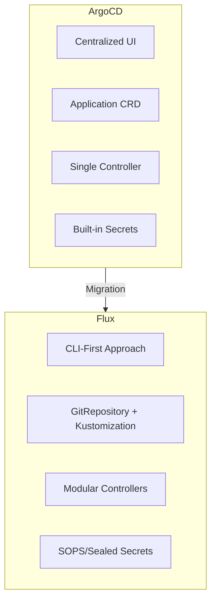
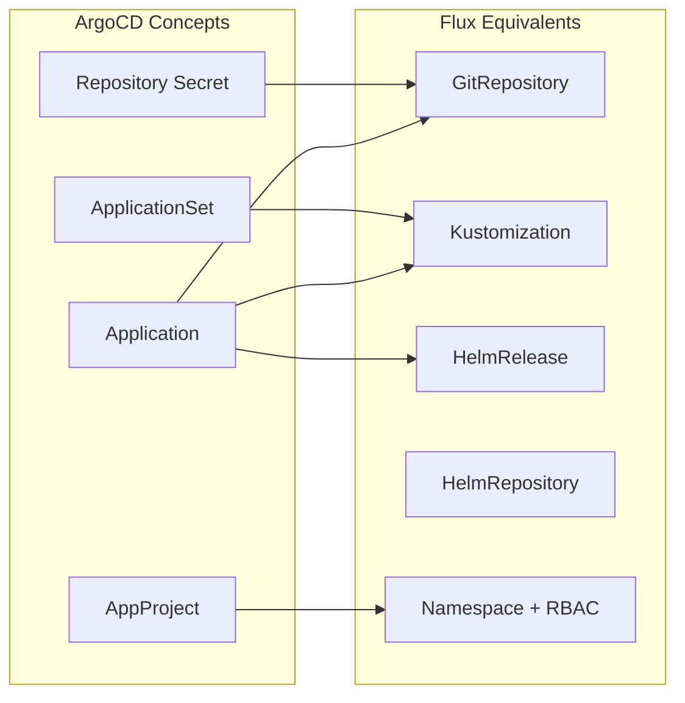
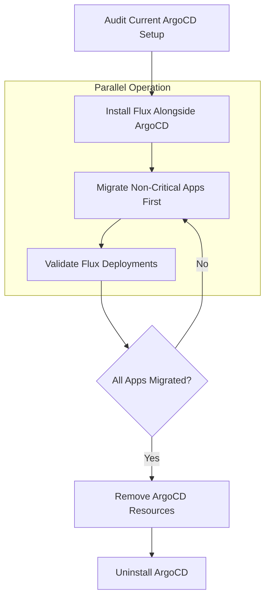
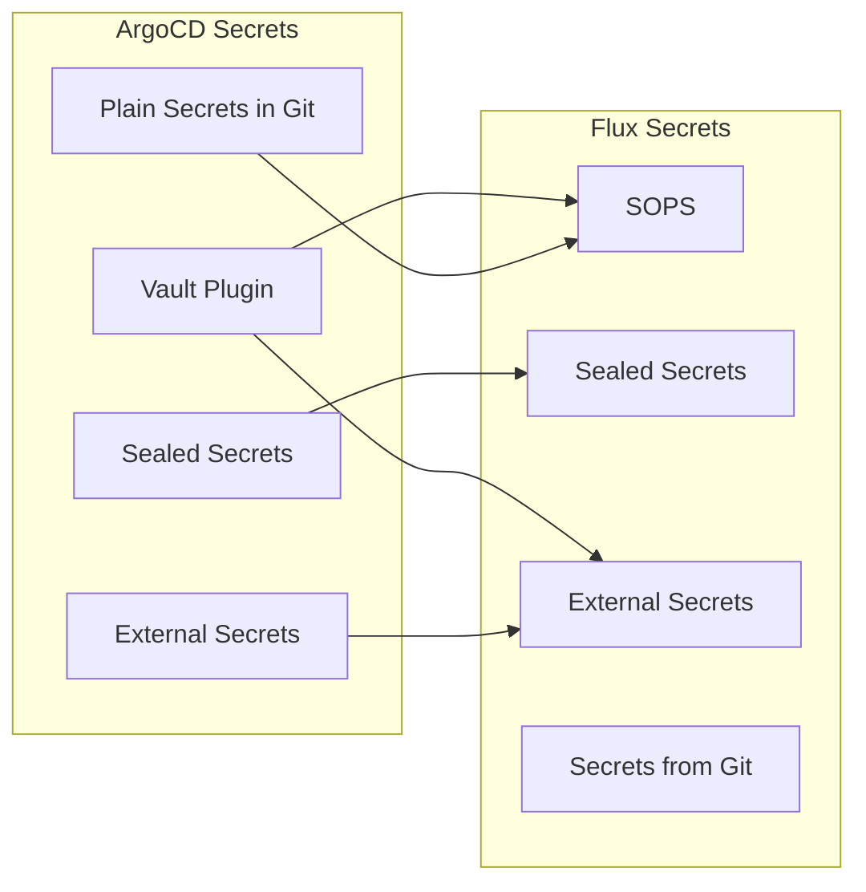
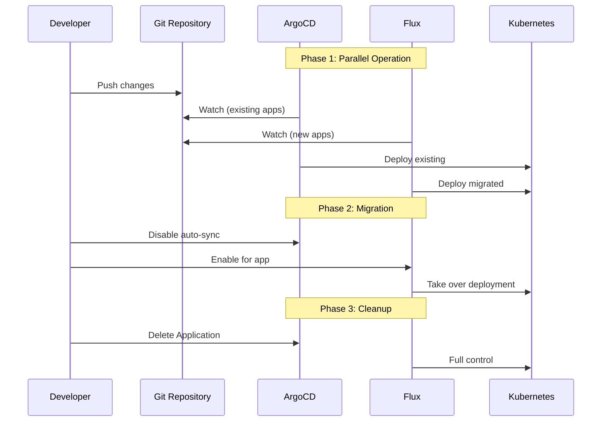

# How to Migrate from ArgoCD to Flux

Author: [nawazdhandala](https://github.com/nawazdhandala)

Tags: Kubernetes, GitOps, ArgoCD, Flux, Migration, CI/CD, DevOps

Description: A comprehensive guide to migrating your GitOps workflows from ArgoCD to Flux, covering concept mapping, application conversion, secrets migration, and strategies for a smooth zero-downtime transition.

---

> The best migration is one your team barely notices. Plan thoroughly, migrate gradually, and keep both systems running until Flux proves itself in production.

## Why Migrate from ArgoCD to Flux?

Before diving into the migration process, understand why teams consider this switch:



**Common reasons for migration:**

| Factor | ArgoCD | Flux |
|--------|--------|------|
| Architecture | Monolithic | Modular (GitOps Toolkit) |
| Resource Usage | Higher (UI, Redis, Dex) | Lower (no UI by default) |
| Multi-tenancy | Project-based | Namespace-based |
| Helm Support | Via Application | Native HelmRelease CRD |
| OCI Registry | Limited | First-class support |
| Notifications | Built-in | Separate controller |

## Comparing ArgoCD and Flux Concepts

Understanding the concept mapping is crucial for a successful migration.



### Concept Mapping Reference

```yaml
# ArgoCD Application maps to multiple Flux resources:
#
# ArgoCD                    -> Flux
# -------                      ----
# Application               -> GitRepository + Kustomization
# Application (Helm)        -> HelmRepository + HelmRelease
# ApplicationSet            -> Kustomization with variable substitution
# AppProject                -> Namespace + ServiceAccount + RBAC
# Repository (Git)          -> GitRepository
# Repository (Helm)         -> HelmRepository
# Sync Policy (automated)   -> Kustomization.spec.interval
# Self-Heal                 -> Kustomization.spec.prune + force
# Sync Waves                -> Kustomization.spec.dependsOn
```

### ArgoCD Application Structure

```yaml
# ArgoCD Application - What you have today
apiVersion: argoproj.io/v1alpha1
kind: Application
metadata:
  name: myapp
  namespace: argocd
  # ArgoCD uses finalizers for cascade deletion
  finalizers:
    - resources-finalizer.argocd.argoproj.io
spec:
  # Project defines RBAC boundaries in ArgoCD
  project: production

  source:
    # Git repository containing manifests
    repoURL: https://github.com/myorg/myapp.git
    targetRevision: main
    path: k8s/overlays/production

  destination:
    # Target cluster (in-cluster or external)
    server: https://kubernetes.default.svc
    namespace: production

  syncPolicy:
    # Automated sync with self-healing
    automated:
      prune: true      # Remove resources deleted from Git
      selfHeal: true   # Revert manual changes
    syncOptions:
      - CreateNamespace=true
      - PruneLast=true
```

### Equivalent Flux Resources

```yaml
# Flux GitRepository - Defines where to pull manifests from
apiVersion: source.toolkit.fluxcd.io/v1
kind: GitRepository
metadata:
  name: myapp
  namespace: flux-system  # Flux resources typically live here
spec:
  # Polling interval for new commits
  interval: 1m

  # Repository URL (HTTPS or SSH)
  url: https://github.com/myorg/myapp.git

  # Branch, tag, or semver range
  ref:
    branch: main

  # Authentication (if private repo)
  secretRef:
    name: myapp-git-auth

---
# Flux Kustomization - Defines what to deploy and how
apiVersion: kustomize.toolkit.fluxcd.io/v1
kind: Kustomization
metadata:
  name: myapp
  namespace: flux-system
spec:
  # Link to the GitRepository source
  sourceRef:
    kind: GitRepository
    name: myapp

  # Path within the repository
  path: ./k8s/overlays/production

  # Reconciliation interval (like ArgoCD's sync)
  interval: 5m

  # Equivalent to ArgoCD's automated.prune
  prune: true

  # Target namespace for resources
  targetNamespace: production

  # Wait for resources to be ready
  wait: true
  timeout: 5m

  # Health checks (similar to ArgoCD's health assessment)
  healthChecks:
    - apiVersion: apps/v1
      kind: Deployment
      name: myapp
      namespace: production
```

## Migration Planning

A successful migration requires careful planning. Here is the recommended approach.



### Step 1: Audit Your ArgoCD Installation

```bash
#!/bin/bash
# audit-argocd.sh
# Script to audit your current ArgoCD setup before migration

echo "=== ArgoCD Audit Report ==="
echo ""

# List all Applications
echo "## Applications"
kubectl get applications -n argocd -o custom-columns=\
NAME:.metadata.name,\
PROJECT:.spec.project,\
REPO:.spec.source.repoURL,\
PATH:.spec.source.path,\
SYNC:.status.sync.status

echo ""

# List all AppProjects
echo "## AppProjects"
kubectl get appprojects -n argocd -o custom-columns=\
NAME:.metadata.name,\
DESCRIPTION:.spec.description

echo ""

# List all ApplicationSets
echo "## ApplicationSets"
kubectl get applicationsets -n argocd -o custom-columns=\
NAME:.metadata.name,\
GENERATOR:.spec.generators[0]

echo ""

# Check for Helm-based applications
echo "## Helm Applications"
kubectl get applications -n argocd -o json | \
  jq -r '.items[] | select(.spec.source.chart != null) |
    "\(.metadata.name): \(.spec.source.chart) @ \(.spec.source.repoURL)"'

echo ""

# List repository credentials
echo "## Repository Credentials"
kubectl get secrets -n argocd -l argocd.argoproj.io/secret-type=repository \
  -o custom-columns=NAME:.metadata.name,URL:.data.url

echo ""
echo "=== Audit Complete ==="
```

### Step 2: Install Flux

```bash
# Install Flux CLI
# macOS
brew install fluxcd/tap/flux

# Linux
curl -s https://fluxcd.io/install.sh | sudo bash

# Verify Flux prerequisites
flux check --pre

# Bootstrap Flux with your Git repository
# This creates the flux-system namespace and core controllers
flux bootstrap github \
  --owner=myorg \
  --repository=fleet-infra \
  --branch=main \
  --path=clusters/production \
  --personal

# Alternatively, bootstrap with GitLab
flux bootstrap gitlab \
  --owner=myorg \
  --repository=fleet-infra \
  --branch=main \
  --path=clusters/production
```

### Step 3: Create Migration Inventory

```yaml
# migration-inventory.yaml
# Track migration status for each application
apiVersion: v1
kind: ConfigMap
metadata:
  name: migration-inventory
  namespace: flux-system
data:
  inventory.yaml: |
    applications:
      # Critical applications - migrate last
      - name: payment-service
        argocd_project: production
        priority: 3
        status: pending
        notes: "Requires secrets migration"

      # Standard applications
      - name: user-service
        argocd_project: production
        priority: 2
        status: pending

      # Non-critical - migrate first
      - name: internal-tools
        argocd_project: tools
        priority: 1
        status: pending

    helm_releases:
      - name: prometheus
        chart: prometheus-community/prometheus
        priority: 2
        status: pending

      - name: nginx-ingress
        chart: ingress-nginx/ingress-nginx
        priority: 1
        status: pending
```

## Converting Application to GitRepository and Kustomization

Here is how to convert different ArgoCD application types to Flux.

### Basic Application Conversion

```yaml
# BEFORE: ArgoCD Application
# This is what you currently have in ArgoCD
apiVersion: argoproj.io/v1alpha1
kind: Application
metadata:
  name: backend-api
  namespace: argocd
spec:
  project: default
  source:
    repoURL: https://github.com/myorg/backend-api.git
    targetRevision: HEAD
    path: deploy/production
  destination:
    server: https://kubernetes.default.svc
    namespace: backend
  syncPolicy:
    automated:
      prune: true
      selfHeal: true
    syncOptions:
      - CreateNamespace=true

---
# AFTER: Flux GitRepository + Kustomization
# Create these resources to replace the ArgoCD Application

# First, create the GitRepository to define the source
apiVersion: source.toolkit.fluxcd.io/v1
kind: GitRepository
metadata:
  name: backend-api
  namespace: flux-system
spec:
  interval: 1m
  url: https://github.com/myorg/backend-api.git
  ref:
    branch: main  # HEAD in ArgoCD maps to main/master branch

---
# Then, create the Kustomization to deploy from that source
apiVersion: kustomize.toolkit.fluxcd.io/v1
kind: Kustomization
metadata:
  name: backend-api
  namespace: flux-system
spec:
  sourceRef:
    kind: GitRepository
    name: backend-api
  path: ./deploy/production
  interval: 5m
  prune: true  # Equivalent to ArgoCD's automated.prune
  targetNamespace: backend
  # Flux creates namespaces automatically when targetNamespace is set
  # No explicit CreateNamespace option needed
```

### Converting Helm-Based Applications

```yaml
# BEFORE: ArgoCD Application with Helm
apiVersion: argoproj.io/v1alpha1
kind: Application
metadata:
  name: redis
  namespace: argocd
spec:
  project: infrastructure
  source:
    repoURL: https://charts.bitnami.com/bitnami
    chart: redis
    targetRevision: 17.11.3
    helm:
      values: |
        architecture: replication
        replica:
          replicaCount: 3
        auth:
          enabled: true
          existingSecret: redis-password
  destination:
    server: https://kubernetes.default.svc
    namespace: redis
  syncPolicy:
    automated:
      prune: true

---
# AFTER: Flux HelmRepository + HelmRelease

# Define the Helm repository source
apiVersion: source.toolkit.fluxcd.io/v1
kind: HelmRepository
metadata:
  name: bitnami
  namespace: flux-system
spec:
  interval: 1h  # How often to check for new charts
  url: https://charts.bitnami.com/bitnami

---
# Define the HelmRelease to deploy the chart
apiVersion: helm.toolkit.fluxcd.io/v2
kind: HelmRelease
metadata:
  name: redis
  namespace: redis  # HelmRelease can live in target namespace
spec:
  interval: 5m
  chart:
    spec:
      chart: redis
      version: "17.11.3"  # Pin the version for reproducibility
      sourceRef:
        kind: HelmRepository
        name: bitnami
        namespace: flux-system
  values:
    # Same values as ArgoCD helm.values
    architecture: replication
    replica:
      replicaCount: 3
    auth:
      enabled: true
      existingSecret: redis-password
  # Flux-specific: upgrade and rollback settings
  upgrade:
    remediation:
      retries: 3
  rollback:
    cleanupOnFail: true
```

### Converting ApplicationSets

```yaml
# BEFORE: ArgoCD ApplicationSet with List Generator
apiVersion: argoproj.io/v1alpha1
kind: ApplicationSet
metadata:
  name: microservices
  namespace: argocd
spec:
  generators:
    - list:
        elements:
          - name: user-service
            namespace: users
          - name: order-service
            namespace: orders
          - name: inventory-service
            namespace: inventory
  template:
    metadata:
      name: '{{name}}'
    spec:
      project: production
      source:
        repoURL: https://github.com/myorg/{{name}}.git
        targetRevision: main
        path: k8s
      destination:
        server: https://kubernetes.default.svc
        namespace: '{{namespace}}'
      syncPolicy:
        automated:
          prune: true

---
# AFTER: Flux approach using multiple Kustomizations
# Option 1: Individual resources (explicit)

apiVersion: source.toolkit.fluxcd.io/v1
kind: GitRepository
metadata:
  name: user-service
  namespace: flux-system
spec:
  interval: 1m
  url: https://github.com/myorg/user-service.git
  ref:
    branch: main

---
apiVersion: kustomize.toolkit.fluxcd.io/v1
kind: Kustomization
metadata:
  name: user-service
  namespace: flux-system
spec:
  sourceRef:
    kind: GitRepository
    name: user-service
  path: ./k8s
  interval: 5m
  prune: true
  targetNamespace: users

# Repeat for order-service, inventory-service...

---
# Option 2: Using Flux's variable substitution (similar to ApplicationSet)
# Create a single GitRepository for a monorepo structure

apiVersion: source.toolkit.fluxcd.io/v1
kind: GitRepository
metadata:
  name: microservices-monorepo
  namespace: flux-system
spec:
  interval: 1m
  url: https://github.com/myorg/microservices.git
  ref:
    branch: main

---
# Kustomization with postBuild variable substitution
apiVersion: kustomize.toolkit.fluxcd.io/v1
kind: Kustomization
metadata:
  name: user-service
  namespace: flux-system
spec:
  sourceRef:
    kind: GitRepository
    name: microservices-monorepo
  path: ./services/user-service/k8s
  interval: 5m
  prune: true
  targetNamespace: users
  # Variable substitution (similar to ArgoCD templating)
  postBuild:
    substitute:
      SERVICE_NAME: user-service
      ENVIRONMENT: production
```

## Handling Secrets Migration

Secrets management differs significantly between ArgoCD and Flux.



### Migrating from ArgoCD Vault Plugin to SOPS

```yaml
# Step 1: Install SOPS in your cluster
# This is typically done via Flux itself

apiVersion: source.toolkit.fluxcd.io/v1
kind: GitRepository
metadata:
  name: flux-system
  namespace: flux-system
spec:
  interval: 1m
  url: https://github.com/myorg/fleet-infra.git
  ref:
    branch: main

---
# Step 2: Configure SOPS decryption in Flux
apiVersion: kustomize.toolkit.fluxcd.io/v1
kind: Kustomization
metadata:
  name: apps
  namespace: flux-system
spec:
  sourceRef:
    kind: GitRepository
    name: flux-system
  path: ./apps
  interval: 5m
  prune: true
  # Enable SOPS decryption
  decryption:
    provider: sops
    secretRef:
      name: sops-age  # Age key for decryption
```

```bash
#!/bin/bash
# migrate-secrets-to-sops.sh
# Convert existing secrets to SOPS-encrypted format

# Install age for encryption
brew install age  # macOS
# or: apt install age  # Ubuntu

# Generate age key pair
age-keygen -o age.agekey

# Extract the public key
AGE_PUBLIC_KEY=$(grep "public key:" age.agekey | cut -d: -f2 | tr -d ' ')

# Create .sops.yaml configuration
cat > .sops.yaml << EOF
creation_rules:
  - path_regex: .*\.yaml$
    encrypted_regex: ^(data|stringData)$
    age: ${AGE_PUBLIC_KEY}
EOF

# Encrypt an existing secret
# First, export from ArgoCD/cluster
kubectl get secret db-credentials -n production -o yaml > db-credentials.yaml

# Remove cluster-specific metadata
yq eval 'del(.metadata.resourceVersion, .metadata.uid, .metadata.creationTimestamp, .metadata.managedFields)' -i db-credentials.yaml

# Encrypt with SOPS
sops --encrypt --in-place db-credentials.yaml

# Create the SOPS key secret in Flux
kubectl create secret generic sops-age \
  --namespace=flux-system \
  --from-file=age.agekey
```

### Migrating External Secrets

```yaml
# External Secrets work similarly in both ArgoCD and Flux
# No changes needed to ExternalSecret resources

# Just ensure the External Secrets Operator is deployed via Flux
apiVersion: source.toolkit.fluxcd.io/v1
kind: HelmRepository
metadata:
  name: external-secrets
  namespace: flux-system
spec:
  interval: 1h
  url: https://charts.external-secrets.io

---
apiVersion: helm.toolkit.fluxcd.io/v2
kind: HelmRelease
metadata:
  name: external-secrets
  namespace: external-secrets
spec:
  interval: 5m
  chart:
    spec:
      chart: external-secrets
      version: "0.9.x"
      sourceRef:
        kind: HelmRepository
        name: external-secrets
        namespace: flux-system
  values:
    installCRDs: true
```

### Migrating Git Repository Credentials

```yaml
# BEFORE: ArgoCD repository secret
apiVersion: v1
kind: Secret
metadata:
  name: private-repo
  namespace: argocd
  labels:
    argocd.argoproj.io/secret-type: repository
stringData:
  type: git
  url: https://github.com/myorg/private-repo.git
  username: git
  password: ghp_xxxxxxxxxxxx

---
# AFTER: Flux GitRepository with authentication
apiVersion: v1
kind: Secret
metadata:
  name: private-repo-auth
  namespace: flux-system
type: Opaque
stringData:
  username: git
  password: ghp_xxxxxxxxxxxx

---
apiVersion: source.toolkit.fluxcd.io/v1
kind: GitRepository
metadata:
  name: private-repo
  namespace: flux-system
spec:
  interval: 1m
  url: https://github.com/myorg/private-repo.git
  ref:
    branch: main
  secretRef:
    name: private-repo-auth
```

```bash
# For SSH-based authentication
# Create SSH key secret for Flux
flux create secret git private-repo-auth \
  --url=ssh://git@github.com/myorg/private-repo.git \
  --private-key-file=./id_rsa
```

## Gradual Migration Strategy

Minimize risk by running both systems in parallel.



### Phase 1: Install Flux Without Disruption

```yaml
# flux-system/kustomization.yaml
# Bootstrap Flux in a non-conflicting way

apiVersion: kustomize.config.k8s.io/v1beta1
kind: Kustomization
resources:
  - gotk-components.yaml
  - gotk-sync.yaml

# Ensure Flux doesn't manage ArgoCD namespace
patches:
  - patch: |
      - op: add
        path: /spec/template/spec/containers/0/args/-
        value: --watch-all-namespaces=true
    target:
      kind: Deployment
      name: kustomize-controller
```

### Phase 2: Migrate Applications One by One

```bash
#!/bin/bash
# migrate-app.sh - Migrate a single application from ArgoCD to Flux
# Usage: ./migrate-app.sh <app-name>

APP_NAME=$1

if [ -z "$APP_NAME" ]; then
  echo "Usage: ./migrate-app.sh <app-name>"
  exit 1
fi

echo "=== Migrating $APP_NAME from ArgoCD to Flux ==="

# Step 1: Get ArgoCD application details
echo "Fetching ArgoCD application configuration..."
kubectl get application $APP_NAME -n argocd -o yaml > /tmp/argocd-$APP_NAME.yaml

# Extract key details
REPO_URL=$(yq eval '.spec.source.repoURL' /tmp/argocd-$APP_NAME.yaml)
PATH=$(yq eval '.spec.source.path' /tmp/argocd-$APP_NAME.yaml)
TARGET_NS=$(yq eval '.spec.destination.namespace' /tmp/argocd-$APP_NAME.yaml)
REVISION=$(yq eval '.spec.source.targetRevision' /tmp/argocd-$APP_NAME.yaml)

echo "Repository: $REPO_URL"
echo "Path: $PATH"
echo "Namespace: $TARGET_NS"
echo "Revision: $REVISION"

# Step 2: Disable ArgoCD auto-sync (keep it as backup)
echo "Disabling ArgoCD auto-sync..."
kubectl patch application $APP_NAME -n argocd --type=json \
  -p='[{"op": "remove", "path": "/spec/syncPolicy/automated"}]' 2>/dev/null || true

# Step 3: Create Flux resources
echo "Creating Flux GitRepository..."
cat << EOF | kubectl apply -f -
apiVersion: source.toolkit.fluxcd.io/v1
kind: GitRepository
metadata:
  name: $APP_NAME
  namespace: flux-system
spec:
  interval: 1m
  url: $REPO_URL
  ref:
    branch: ${REVISION:-main}
EOF

echo "Creating Flux Kustomization..."
cat << EOF | kubectl apply -f -
apiVersion: kustomize.toolkit.fluxcd.io/v1
kind: Kustomization
metadata:
  name: $APP_NAME
  namespace: flux-system
spec:
  sourceRef:
    kind: GitRepository
    name: $APP_NAME
  path: ./$PATH
  interval: 5m
  prune: true
  targetNamespace: $TARGET_NS
  wait: true
  timeout: 5m
EOF

# Step 4: Wait for Flux to reconcile
echo "Waiting for Flux reconciliation..."
flux reconcile kustomization $APP_NAME --with-source

# Step 5: Verify deployment
echo "Verifying deployment status..."
kubectl get kustomization $APP_NAME -n flux-system

echo ""
echo "=== Migration complete ==="
echo "ArgoCD application $APP_NAME is now disabled (manual sync only)"
echo "Flux is now managing the deployment"
echo ""
echo "To complete migration, delete the ArgoCD application:"
echo "  kubectl delete application $APP_NAME -n argocd"
```

### Phase 3: Handle Sync Wave Dependencies

```yaml
# ArgoCD uses sync-wave annotations for ordering
# Flux uses dependsOn for the same purpose

# BEFORE: ArgoCD sync waves
# Namespace (wave -1) -> ConfigMap (wave 0) -> Deployment (wave 1)

# AFTER: Flux dependsOn chain
apiVersion: kustomize.toolkit.fluxcd.io/v1
kind: Kustomization
metadata:
  name: app-namespace
  namespace: flux-system
spec:
  sourceRef:
    kind: GitRepository
    name: myapp
  path: ./k8s/namespace
  interval: 5m
  prune: true

---
apiVersion: kustomize.toolkit.fluxcd.io/v1
kind: Kustomization
metadata:
  name: app-config
  namespace: flux-system
spec:
  # Wait for namespace to be ready
  dependsOn:
    - name: app-namespace
  sourceRef:
    kind: GitRepository
    name: myapp
  path: ./k8s/config
  interval: 5m
  prune: true

---
apiVersion: kustomize.toolkit.fluxcd.io/v1
kind: Kustomization
metadata:
  name: app-deployment
  namespace: flux-system
spec:
  # Wait for config to be ready
  dependsOn:
    - name: app-config
  sourceRef:
    kind: GitRepository
    name: myapp
  path: ./k8s/deployment
  interval: 5m
  prune: true
  # Health checks ensure deployment is ready
  healthChecks:
    - apiVersion: apps/v1
      kind: Deployment
      name: myapp
      namespace: production
```

### Phase 4: Cleanup ArgoCD

```bash
#!/bin/bash
# cleanup-argocd.sh
# Run this after all applications are migrated and verified

echo "=== ArgoCD Cleanup ==="

# Verify all Flux kustomizations are healthy
echo "Checking Flux kustomization health..."
UNHEALTHY=$(flux get kustomizations -A | grep -v "True" | grep -v "NAME")
if [ -n "$UNHEALTHY" ]; then
  echo "WARNING: Some Flux kustomizations are not healthy:"
  echo "$UNHEALTHY"
  echo "Please fix these before proceeding."
  exit 1
fi

# List remaining ArgoCD applications
echo "Remaining ArgoCD applications:"
kubectl get applications -n argocd

read -p "Delete all ArgoCD applications? (yes/no) " CONFIRM
if [ "$CONFIRM" != "yes" ]; then
  echo "Aborted"
  exit 0
fi

# Remove finalizers and delete applications
for app in $(kubectl get applications -n argocd -o name); do
  echo "Removing finalizers from $app..."
  kubectl patch $app -n argocd --type=json \
    -p='[{"op": "remove", "path": "/metadata/finalizers"}]' 2>/dev/null || true

  echo "Deleting $app..."
  kubectl delete $app -n argocd
done

# Uninstall ArgoCD
echo "Uninstalling ArgoCD..."
kubectl delete -n argocd -f https://raw.githubusercontent.com/argoproj/argo-cd/stable/manifests/install.yaml

# Delete ArgoCD namespace
kubectl delete namespace argocd

echo "=== ArgoCD cleanup complete ==="
```

## Monitoring the Migration

```yaml
# Deploy Flux monitoring to track reconciliation
apiVersion: source.toolkit.fluxcd.io/v1
kind: HelmRepository
metadata:
  name: prometheus-community
  namespace: flux-system
spec:
  interval: 1h
  url: https://prometheus-community.github.io/helm-charts

---
apiVersion: helm.toolkit.fluxcd.io/v2
kind: HelmRelease
metadata:
  name: kube-prometheus-stack
  namespace: monitoring
spec:
  interval: 5m
  chart:
    spec:
      chart: kube-prometheus-stack
      sourceRef:
        kind: HelmRepository
        name: prometheus-community
        namespace: flux-system
  values:
    prometheus:
      prometheusSpec:
        # Scrape Flux metrics
        additionalScrapeConfigs:
          - job_name: flux-system
            static_configs:
              - targets:
                  - source-controller.flux-system:8080
                  - kustomize-controller.flux-system:8080
                  - helm-controller.flux-system:8080
                  - notification-controller.flux-system:8080
```

```yaml
# Flux notification for migration status
apiVersion: notification.toolkit.fluxcd.io/v1
kind: Provider
metadata:
  name: slack
  namespace: flux-system
spec:
  type: slack
  channel: gitops-alerts
  secretRef:
    name: slack-webhook

---
apiVersion: notification.toolkit.fluxcd.io/v1
kind: Alert
metadata:
  name: migration-alerts
  namespace: flux-system
spec:
  providerRef:
    name: slack
  eventSeverity: info
  eventSources:
    - kind: Kustomization
      name: '*'
    - kind: HelmRelease
      name: '*'
  # Alert on reconciliation failures
  eventMetadata:
    summary: "Flux reconciliation status"
```

## Best Practices Summary

### Migration Checklist

```yaml
# migration-checklist.yaml
# Use this to track your migration progress

checklist:
  preparation:
    - name: "Audit all ArgoCD Applications"
      done: false
    - name: "Document all repository credentials"
      done: false
    - name: "Map ArgoCD Projects to Flux namespaces"
      done: false
    - name: "Identify secrets management approach"
      done: false
    - name: "Create migration runbook"
      done: false

  installation:
    - name: "Install Flux CLI"
      done: false
    - name: "Bootstrap Flux"
      done: false
    - name: "Configure Git authentication"
      done: false
    - name: "Set up SOPS/secrets management"
      done: false
    - name: "Configure notifications"
      done: false

  migration:
    - name: "Migrate non-critical apps first"
      done: false
    - name: "Validate each migration"
      done: false
    - name: "Update CI/CD pipelines"
      done: false
    - name: "Migrate critical apps"
      done: false
    - name: "Document new workflows"
      done: false

  cleanup:
    - name: "Verify all Flux resources healthy"
      done: false
    - name: "Remove ArgoCD Applications"
      done: false
    - name: "Uninstall ArgoCD"
      done: false
    - name: "Update documentation"
      done: false
    - name: "Train team on Flux"
      done: false
```

### Key Recommendations

1. **Run in parallel**: Keep ArgoCD running until Flux proves stable
2. **Migrate incrementally**: Start with non-critical applications
3. **Test thoroughly**: Verify each application after migration
4. **Document everything**: Keep a migration log for rollback
5. **Automate where possible**: Use scripts for repetitive tasks
6. **Monitor closely**: Set up alerts for reconciliation failures
7. **Train your team**: Flux CLI differs from ArgoCD UI workflows
8. **Plan for secrets**: Choose your secrets strategy early
9. **Update CI/CD**: Ensure pipelines work with Flux triggers
10. **Keep backups**: Export ArgoCD configs before deletion

### Common Pitfalls to Avoid

```yaml
# Common mistakes during migration

pitfalls:
  - mistake: "Deleting ArgoCD before validating Flux"
    solution: "Keep ArgoCD in manual-sync mode as backup"

  - mistake: "Migrating all apps at once"
    solution: "Use phased approach, validate each migration"

  - mistake: "Forgetting to migrate repository credentials"
    solution: "Audit and recreate all Git/Helm repo secrets"

  - mistake: "Ignoring sync wave dependencies"
    solution: "Map ArgoCD sync-waves to Flux dependsOn"

  - mistake: "Not updating team documentation"
    solution: "Create Flux runbooks before migration"
```

---

Migrating from ArgoCD to Flux requires careful planning but pays off with a lighter, more modular GitOps system. Take your time, migrate incrementally, and always have a rollback plan. The parallel operation period is your safety net - use it wisely.

For monitoring your Flux deployments and ensuring your GitOps pipelines stay healthy, check out [OneUptime](https://oneuptime.com) for comprehensive observability across your Kubernetes infrastructure.
