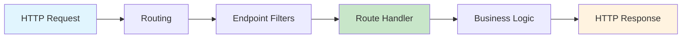
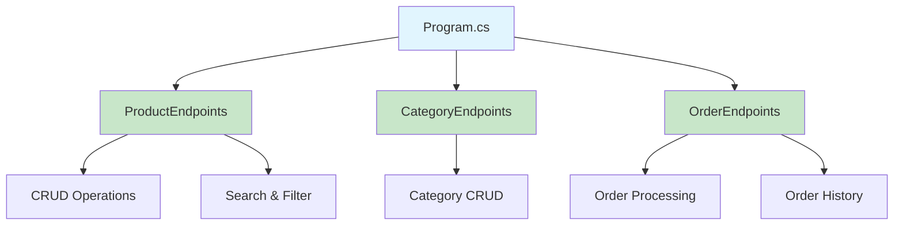
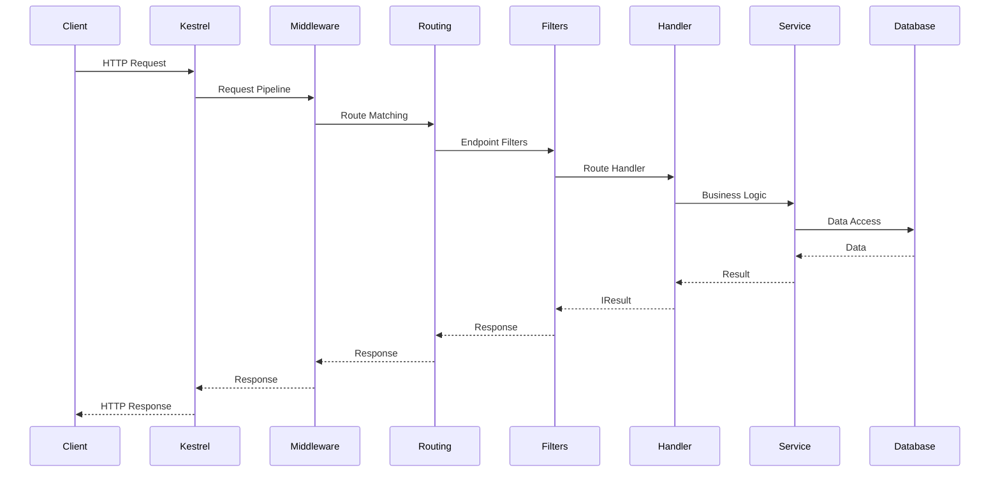

# How to Build Minimal APIs in ASP.NET Core 8

By [Nawaz Dhandala](https://github.com/nawazdhandala)

Tags: ASP.NET Core, Minimal APIs, C#, .NET 8, Web Development, REST API, Backend Development, OpenAPI

Description: A comprehensive guide to building lightweight, high-performance REST APIs using ASP.NET Core 8 Minimal APIs, covering route handlers, dependency injection, validation, OpenAPI integration, and production best practices.

---

> "Simplicity is the ultimate sophistication." - Leonardo da Vinci

Minimal APIs in ASP.NET Core 8 provide a streamlined approach to building HTTP APIs with minimal code and ceremony. Unlike traditional controller-based APIs, Minimal APIs let you define endpoints directly in your Program.cs file, making them ideal for microservices, small APIs, and scenarios where you want to reduce boilerplate.

## Understanding Minimal APIs

Minimal APIs were introduced in .NET 6 and have matured significantly in .NET 8. They offer a functional programming style for defining HTTP endpoints while still providing access to the full power of ASP.NET Core.



### Traditional Controller vs Minimal API

Here is how the same endpoint looks in both approaches:

```csharp
// Traditional Controller-based API
// Requires a separate class file and more boilerplate

[ApiController]
[Route("api/[controller]")]
public class ProductsController : ControllerBase
{
    private readonly IProductService _productService;

    public ProductsController(IProductService productService)
    {
        _productService = productService;
    }

    [HttpGet("{id}")]
    public async Task<ActionResult<Product>> GetProduct(int id)
    {
        var product = await _productService.GetByIdAsync(id);
        return product is null ? NotFound() : Ok(product);
    }
}
```

```csharp
// Minimal API equivalent
// Everything in one line with the same functionality

app.MapGet("/api/products/{id}", async (int id, IProductService productService) =>
    await productService.GetByIdAsync(id) is Product product
        ? Results.Ok(product)
        : Results.NotFound());
```

## Getting Started

### Creating a Minimal API Project

```bash
# Create a new minimal API project
dotnet new web -n MyMinimalApi

# Navigate to the project directory
cd MyMinimalApi

# Run the application
dotnet run
```

### Basic Project Structure

```csharp
// Program.cs - The entire application in one file

var builder = WebApplication.CreateBuilder(args);

// Add services to the container
builder.Services.AddEndpointsApiExplorer();
builder.Services.AddSwaggerGen();

var app = builder.Build();

// Configure the HTTP request pipeline
if (app.Environment.IsDevelopment())
{
    app.UseSwagger();
    app.UseSwaggerUI();
}

app.UseHttpsRedirection();

// Define your first endpoint
app.MapGet("/", () => "Hello, Minimal API!");

app.Run();
```

## Route Handlers

Route handlers are the core of Minimal APIs. They define what happens when a specific HTTP request matches a route pattern.

### HTTP Method Mappings

```csharp
// GET - Retrieve resources
// Use for read-only operations that don't modify state
app.MapGet("/api/products", () => "Get all products");
app.MapGet("/api/products/{id}", (int id) => $"Get product {id}");

// POST - Create new resources
// Returns 201 Created with location header for new resources
app.MapPost("/api/products", (Product product) =>
    Results.Created($"/api/products/{product.Id}", product));

// PUT - Update entire resources
// Replaces the entire resource at the specified location
app.MapPut("/api/products/{id}", (int id, Product product) =>
    Results.NoContent());

// PATCH - Partial updates
// Updates only the specified fields of a resource
app.MapPatch("/api/products/{id}", (int id, ProductPatch patch) =>
    Results.Ok(patch));

// DELETE - Remove resources
// Returns 204 No Content on successful deletion
app.MapDelete("/api/products/{id}", (int id) => Results.NoContent());
```

### Route Parameters and Constraints

```csharp
// Basic route parameter
// The {id} parameter is automatically bound from the URL
app.MapGet("/api/products/{id}", (int id) => $"Product ID: {id}");

// Multiple parameters
// Parameters can appear anywhere in the route template
app.MapGet("/api/categories/{categoryId}/products/{productId}",
    (int categoryId, int productId) =>
        $"Category: {categoryId}, Product: {productId}");

// Route constraints ensure type safety at the routing level
// These constraints are evaluated before the handler is called
app.MapGet("/api/products/{id:int}", (int id) => $"Integer ID: {id}");
app.MapGet("/api/products/{slug:alpha}", (string slug) => $"Slug: {slug}");
app.MapGet("/api/products/{id:guid}", (Guid id) => $"GUID: {id}");

// Minimum and maximum constraints
// Useful for pagination and limiting input ranges
app.MapGet("/api/products/{id:min(1)}", (int id) => $"ID >= 1: {id}");
app.MapGet("/api/products/{id:range(1,100)}", (int id) => $"ID 1-100: {id}");

// Regex constraints for custom patterns
// Use sparingly as they can impact routing performance
app.MapGet("/api/products/{sku:regex(^[A-Z]{{3}}-\\d{{4}}$)}",
    (string sku) => $"SKU: {sku}");

// Optional parameters with default values
// The ? makes the parameter optional
app.MapGet("/api/products/{id:int?}", (int? id) =>
    id.HasValue ? $"Product {id}" : "All products");
```

### Query String Parameters

```csharp
// Query parameters are automatically bound from the URL query string
// Example: /api/products?page=1&pageSize=10&sortBy=name

app.MapGet("/api/products", (int page = 1, int pageSize = 10, string? sortBy = null) =>
{
    // Default values are used when parameters are not provided
    return Results.Ok(new
    {
        Page = page,
        PageSize = pageSize,
        SortBy = sortBy ?? "id"
    });
});

// Complex query parameters using a record
// Records provide immutability and value equality
public record ProductFilter(
    string? Name,
    decimal? MinPrice,
    decimal? MaxPrice,
    string? Category,
    bool? InStock
);

app.MapGet("/api/products/search", ([AsParameters] ProductFilter filter) =>
{
    // AsParameters binds all record properties from query string
    return Results.Ok(filter);
});
```

### Request Body Binding

```csharp
// Define a product record for JSON binding
// Using records ensures immutability and simplifies serialization
public record CreateProductRequest(
    string Name,
    string Description,
    decimal Price,
    int CategoryId
);

// POST with JSON body
// The request body is automatically deserialized to the parameter type
app.MapPost("/api/products", (CreateProductRequest request) =>
{
    // Validate and process the request
    var product = new Product
    {
        Id = Guid.NewGuid(),
        Name = request.Name,
        Description = request.Description,
        Price = request.Price,
        CategoryId = request.CategoryId,
        CreatedAt = DateTime.UtcNow
    };

    return Results.Created($"/api/products/{product.Id}", product);
});

// Binding from multiple sources
// Combine route parameters, query strings, and body in one handler
app.MapPut("/api/categories/{categoryId}/products/{productId}",
    (int categoryId, int productId, UpdateProductRequest request, bool? notify) =>
    {
        // categoryId and productId from route
        // request from body
        // notify from query string
        return Results.NoContent();
    });
```

## Dependency Injection

Minimal APIs fully support ASP.NET Core's dependency injection system. Services can be injected directly into route handlers.

### Registering Services

```csharp
var builder = WebApplication.CreateBuilder(args);

// Register services with appropriate lifetimes
// Singleton: One instance for the entire application lifetime
builder.Services.AddSingleton<ICacheService, RedisCacheService>();

// Scoped: One instance per HTTP request
builder.Services.AddScoped<IProductRepository, ProductRepository>();
builder.Services.AddScoped<IProductService, ProductService>();

// Transient: New instance every time it's requested
builder.Services.AddTransient<IEmailService, SmtpEmailService>();

// Register DbContext for Entity Framework Core
builder.Services.AddDbContext<AppDbContext>(options =>
    options.UseNpgsql(builder.Configuration.GetConnectionString("DefaultConnection")));

// Register HttpClient for external API calls
builder.Services.AddHttpClient<IExternalApiClient, ExternalApiClient>(client =>
{
    client.BaseAddress = new Uri("https://api.example.com");
    client.Timeout = TimeSpan.FromSeconds(30);
});

var app = builder.Build();
```

### Injecting Services into Handlers

```csharp
// Services are injected as parameters to the route handler
// The DI container resolves them automatically

app.MapGet("/api/products", async (IProductService productService) =>
{
    var products = await productService.GetAllAsync();
    return Results.Ok(products);
});

// Multiple service injection
// Order doesn't matter - services are resolved by type
app.MapPost("/api/products", async (
    CreateProductRequest request,
    IProductService productService,
    ICacheService cache,
    ILogger<Program> logger) =>
{
    logger.LogInformation("Creating product: {Name}", request.Name);

    var product = await productService.CreateAsync(request);

    // Invalidate cache after creating a new product
    await cache.RemoveAsync("products:all");

    return Results.Created($"/api/products/{product.Id}", product);
});

// Special services available automatically
// HttpContext, HttpRequest, HttpResponse, CancellationToken
app.MapGet("/api/products/{id}", async (
    int id,
    IProductService productService,
    HttpContext context,
    CancellationToken cancellationToken) =>
{
    // Access request headers
    var correlationId = context.Request.Headers["X-Correlation-ID"].FirstOrDefault();

    // Pass cancellation token to async operations
    var product = await productService.GetByIdAsync(id, cancellationToken);

    return product is null ? Results.NotFound() : Results.Ok(product);
});
```

### Service Patterns

```csharp
// Repository pattern implementation
public interface IProductRepository
{
    Task<IEnumerable<Product>> GetAllAsync(CancellationToken ct = default);
    Task<Product?> GetByIdAsync(int id, CancellationToken ct = default);
    Task<Product> CreateAsync(Product product, CancellationToken ct = default);
    Task UpdateAsync(Product product, CancellationToken ct = default);
    Task DeleteAsync(int id, CancellationToken ct = default);
}

public class ProductRepository : IProductRepository
{
    private readonly AppDbContext _context;

    public ProductRepository(AppDbContext context)
    {
        _context = context;
    }

    public async Task<IEnumerable<Product>> GetAllAsync(CancellationToken ct = default)
    {
        return await _context.Products
            .AsNoTracking()
            .ToListAsync(ct);
    }

    public async Task<Product?> GetByIdAsync(int id, CancellationToken ct = default)
    {
        return await _context.Products
            .AsNoTracking()
            .FirstOrDefaultAsync(p => p.Id == id, ct);
    }

    public async Task<Product> CreateAsync(Product product, CancellationToken ct = default)
    {
        _context.Products.Add(product);
        await _context.SaveChangesAsync(ct);
        return product;
    }

    public async Task UpdateAsync(Product product, CancellationToken ct = default)
    {
        _context.Products.Update(product);
        await _context.SaveChangesAsync(ct);
    }

    public async Task DeleteAsync(int id, CancellationToken ct = default)
    {
        await _context.Products
            .Where(p => p.Id == id)
            .ExecuteDeleteAsync(ct);
    }
}
```

## Validation

ASP.NET Core 8 provides multiple approaches to validation in Minimal APIs.

### Data Annotations

```csharp
using System.ComponentModel.DataAnnotations;

// Define a request model with validation attributes
// These attributes define the validation rules declaratively
public record CreateProductRequest(
    [Required(ErrorMessage = "Name is required")]
    [StringLength(100, MinimumLength = 3, ErrorMessage = "Name must be 3-100 characters")]
    string Name,

    [StringLength(500, ErrorMessage = "Description cannot exceed 500 characters")]
    string? Description,

    [Required]
    [Range(0.01, 999999.99, ErrorMessage = "Price must be between 0.01 and 999999.99")]
    decimal Price,

    [Required]
    [Range(1, int.MaxValue, ErrorMessage = "Invalid category")]
    int CategoryId,

    [Url(ErrorMessage = "Invalid URL format")]
    string? ImageUrl,

    [EmailAddress(ErrorMessage = "Invalid email format")]
    string? ContactEmail
);
```

### Manual Validation with Endpoint Filters

```csharp
// Create a validation filter that can be reused across endpoints
public class ValidationFilter<T> : IEndpointFilter where T : class
{
    public async ValueTask<object?> InvokeAsync(
        EndpointFilterInvocationContext context,
        EndpointFilterDelegate next)
    {
        // Find the argument of type T
        var argument = context.Arguments
            .OfType<T>()
            .FirstOrDefault();

        if (argument is null)
        {
            return Results.BadRequest("Invalid request body");
        }

        // Validate using data annotations
        var validationContext = new ValidationContext(argument);
        var validationResults = new List<ValidationResult>();

        if (!Validator.TryValidateObject(
            argument,
            validationContext,
            validationResults,
            validateAllProperties: true))
        {
            // Return validation errors in a structured format
            var errors = validationResults
                .GroupBy(r => r.MemberNames.FirstOrDefault() ?? "")
                .ToDictionary(
                    g => g.Key,
                    g => g.Select(r => r.ErrorMessage).ToArray()
                );

            return Results.ValidationProblem(errors);
        }

        return await next(context);
    }
}

// Apply validation filter to endpoints
app.MapPost("/api/products", (CreateProductRequest request, IProductService service) =>
{
    // Request is guaranteed to be valid at this point
    return service.CreateAsync(request);
})
.AddEndpointFilter<ValidationFilter<CreateProductRequest>>();
```

### FluentValidation Integration

```csharp
// Install FluentValidation: dotnet add package FluentValidation.DependencyInjectionExtensions

using FluentValidation;

// Define a validator with fluent rules
// FluentValidation provides more expressive validation logic
public class CreateProductRequestValidator : AbstractValidator<CreateProductRequest>
{
    public CreateProductRequestValidator()
    {
        RuleFor(x => x.Name)
            .NotEmpty().WithMessage("Name is required")
            .Length(3, 100).WithMessage("Name must be 3-100 characters")
            .Must(name => !name.Contains("<script>"))
            .WithMessage("Name contains invalid characters");

        RuleFor(x => x.Price)
            .GreaterThan(0).WithMessage("Price must be positive")
            .LessThanOrEqualTo(999999.99m).WithMessage("Price exceeds maximum");

        RuleFor(x => x.CategoryId)
            .GreaterThan(0).WithMessage("Invalid category");

        RuleFor(x => x.Description)
            .MaximumLength(500)
            .When(x => !string.IsNullOrEmpty(x.Description));

        RuleFor(x => x.ImageUrl)
            .Must(url => Uri.TryCreate(url, UriKind.Absolute, out _))
            .When(x => !string.IsNullOrEmpty(x.ImageUrl))
            .WithMessage("Invalid image URL");
    }
}

// Register validators in DI
builder.Services.AddValidatorsFromAssemblyContaining<Program>();

// Create a generic FluentValidation filter
public class FluentValidationFilter<T> : IEndpointFilter where T : class
{
    private readonly IValidator<T> _validator;

    public FluentValidationFilter(IValidator<T> validator)
    {
        _validator = validator;
    }

    public async ValueTask<object?> InvokeAsync(
        EndpointFilterInvocationContext context,
        EndpointFilterDelegate next)
    {
        var argument = context.Arguments.OfType<T>().FirstOrDefault();

        if (argument is null)
        {
            return Results.BadRequest("Invalid request body");
        }

        var validationResult = await _validator.ValidateAsync(argument);

        if (!validationResult.IsValid)
        {
            var errors = validationResult.Errors
                .GroupBy(e => e.PropertyName)
                .ToDictionary(
                    g => g.Key,
                    g => g.Select(e => e.ErrorMessage).ToArray()
                );

            return Results.ValidationProblem(errors);
        }

        return await next(context);
    }
}
```

## OpenAPI Integration

ASP.NET Core 8 provides built-in support for OpenAPI (Swagger) documentation.

### Basic Setup

```csharp
var builder = WebApplication.CreateBuilder(args);

// Add OpenAPI services
builder.Services.AddEndpointsApiExplorer();
builder.Services.AddSwaggerGen(options =>
{
    options.SwaggerDoc("v1", new OpenApiInfo
    {
        Title = "Product API",
        Version = "v1",
        Description = "API for managing products",
        Contact = new OpenApiContact
        {
            Name = "API Support",
            Email = "support@example.com",
            Url = new Uri("https://example.com/support")
        },
        License = new OpenApiLicense
        {
            Name = "MIT",
            Url = new Uri("https://opensource.org/licenses/MIT")
        }
    });
});

var app = builder.Build();

// Enable Swagger UI in development
if (app.Environment.IsDevelopment())
{
    app.UseSwagger();
    app.UseSwaggerUI(options =>
    {
        options.SwaggerEndpoint("/swagger/v1/swagger.json", "Product API v1");
        options.RoutePrefix = "swagger";
    });
}
```

### Documenting Endpoints

```csharp
// Add metadata to endpoints for better documentation
app.MapGet("/api/products", async (IProductService service) =>
{
    var products = await service.GetAllAsync();
    return Results.Ok(products);
})
.WithName("GetAllProducts")
.WithTags("Products")
.WithDescription("Retrieves all products from the catalog")
.WithOpenApi(operation =>
{
    operation.Summary = "Get all products";
    operation.Description = "Returns a list of all available products";
    return operation;
})
.Produces<IEnumerable<Product>>(StatusCodes.Status200OK)
.Produces(StatusCodes.Status500InternalServerError);

// Document request and response types
app.MapPost("/api/products", async (CreateProductRequest request, IProductService service) =>
{
    var product = await service.CreateAsync(request);
    return Results.Created($"/api/products/{product.Id}", product);
})
.WithName("CreateProduct")
.WithTags("Products")
.WithOpenApi(operation =>
{
    operation.Summary = "Create a new product";
    operation.Description = "Creates a new product in the catalog";
    operation.RequestBody = new OpenApiRequestBody
    {
        Description = "Product details",
        Required = true
    };
    return operation;
})
.Accepts<CreateProductRequest>("application/json")
.Produces<Product>(StatusCodes.Status201Created)
.Produces<ValidationProblemDetails>(StatusCodes.Status400BadRequest)
.ProducesValidationProblem();

// Document path parameters
app.MapGet("/api/products/{id}", async (int id, IProductService service) =>
{
    var product = await service.GetByIdAsync(id);
    return product is null ? Results.NotFound() : Results.Ok(product);
})
.WithName("GetProductById")
.WithTags("Products")
.WithOpenApi(operation =>
{
    operation.Summary = "Get product by ID";
    operation.Parameters[0].Description = "The unique product identifier";
    return operation;
})
.Produces<Product>(StatusCodes.Status200OK)
.Produces(StatusCodes.Status404NotFound);
```

### Adding Authentication Documentation

```csharp
// Configure Swagger with JWT authentication
builder.Services.AddSwaggerGen(options =>
{
    options.SwaggerDoc("v1", new OpenApiInfo { Title = "Product API", Version = "v1" });

    // Define the security scheme
    options.AddSecurityDefinition("Bearer", new OpenApiSecurityScheme
    {
        Name = "Authorization",
        Type = SecuritySchemeType.Http,
        Scheme = "bearer",
        BearerFormat = "JWT",
        In = ParameterLocation.Header,
        Description = "Enter your JWT token"
    });

    // Apply security globally
    options.AddSecurityRequirement(new OpenApiSecurityRequirement
    {
        {
            new OpenApiSecurityScheme
            {
                Reference = new OpenApiReference
                {
                    Type = ReferenceType.SecurityScheme,
                    Id = "Bearer"
                }
            },
            Array.Empty<string>()
        }
    });
});

// Mark endpoints as requiring authentication
app.MapPost("/api/products", async (CreateProductRequest request, IProductService service) =>
{
    // Handler logic
})
.RequireAuthorization()
.WithOpenApi();
```

## Organizing Minimal APIs

As your API grows, you will want to organize endpoints into separate files.



### Extension Method Pattern

```csharp
// ProductEndpoints.cs
// Group related endpoints in a static class with extension methods

public static class ProductEndpoints
{
    public static IEndpointRouteBuilder MapProductEndpoints(this IEndpointRouteBuilder app)
    {
        var group = app.MapGroup("/api/products")
            .WithTags("Products");

        group.MapGet("/", GetAllProducts)
            .WithName("GetAllProducts")
            .Produces<IEnumerable<Product>>(StatusCodes.Status200OK);

        group.MapGet("/{id}", GetProductById)
            .WithName("GetProductById")
            .Produces<Product>(StatusCodes.Status200OK)
            .Produces(StatusCodes.Status404NotFound);

        group.MapPost("/", CreateProduct)
            .WithName("CreateProduct")
            .AddEndpointFilter<ValidationFilter<CreateProductRequest>>()
            .Produces<Product>(StatusCodes.Status201Created)
            .ProducesValidationProblem();

        group.MapPut("/{id}", UpdateProduct)
            .WithName("UpdateProduct")
            .Produces(StatusCodes.Status204NoContent)
            .Produces(StatusCodes.Status404NotFound);

        group.MapDelete("/{id}", DeleteProduct)
            .WithName("DeleteProduct")
            .RequireAuthorization("AdminOnly")
            .Produces(StatusCodes.Status204NoContent)
            .Produces(StatusCodes.Status404NotFound);

        return app;
    }

    // Handler methods - keep them small and focused
    private static async Task<IResult> GetAllProducts(
        IProductService service,
        int page = 1,
        int pageSize = 10)
    {
        var products = await service.GetAllAsync(page, pageSize);
        return Results.Ok(products);
    }

    private static async Task<IResult> GetProductById(
        int id,
        IProductService service)
    {
        var product = await service.GetByIdAsync(id);
        return product is null
            ? Results.NotFound()
            : Results.Ok(product);
    }

    private static async Task<IResult> CreateProduct(
        CreateProductRequest request,
        IProductService service)
    {
        var product = await service.CreateAsync(request);
        return Results.Created($"/api/products/{product.Id}", product);
    }

    private static async Task<IResult> UpdateProduct(
        int id,
        UpdateProductRequest request,
        IProductService service)
    {
        var exists = await service.ExistsAsync(id);
        if (!exists) return Results.NotFound();

        await service.UpdateAsync(id, request);
        return Results.NoContent();
    }

    private static async Task<IResult> DeleteProduct(
        int id,
        IProductService service)
    {
        var exists = await service.ExistsAsync(id);
        if (!exists) return Results.NotFound();

        await service.DeleteAsync(id);
        return Results.NoContent();
    }
}

// Program.cs - Clean and minimal
var builder = WebApplication.CreateBuilder(args);

// Add services
builder.Services.AddEndpointsApiExplorer();
builder.Services.AddSwaggerGen();
builder.Services.AddScoped<IProductService, ProductService>();

var app = builder.Build();

// Configure middleware
if (app.Environment.IsDevelopment())
{
    app.UseSwagger();
    app.UseSwaggerUI();
}

// Map endpoints from extension methods
app.MapProductEndpoints();
app.MapCategoryEndpoints();
app.MapOrderEndpoints();

app.Run();
```

### Route Groups

```csharp
// Route groups allow you to apply common configuration to multiple endpoints

var builder = WebApplication.CreateBuilder(args);
var app = builder.Build();

// Create a versioned API group
var v1 = app.MapGroup("/api/v1");

// Nested groups for different resources
var products = v1.MapGroup("/products")
    .WithTags("Products v1");

var orders = v1.MapGroup("/orders")
    .WithTags("Orders v1")
    .RequireAuthorization();

// Define endpoints within groups
products.MapGet("/", () => "List products v1");
products.MapGet("/{id}", (int id) => $"Get product {id}");

orders.MapGet("/", () => "List orders");
orders.MapPost("/", (Order order) => Results.Created($"/api/v1/orders/{order.Id}", order));

// Apply filters to entire groups
var adminProducts = v1.MapGroup("/admin/products")
    .RequireAuthorization("AdminPolicy")
    .AddEndpointFilter<AuditLogFilter>();

adminProducts.MapPost("/", (CreateProductRequest request) => { /* ... */ });
adminProducts.MapDelete("/{id}", (int id) => { /* ... */ });
```

## Error Handling

Proper error handling ensures your API returns consistent, informative responses.

```csharp
// Global exception handler middleware
app.UseExceptionHandler(errorApp =>
{
    errorApp.Run(async context =>
    {
        context.Response.ContentType = "application/problem+json";

        var exceptionFeature = context.Features.Get<IExceptionHandlerFeature>();
        var exception = exceptionFeature?.Error;

        var problem = new ProblemDetails
        {
            Instance = context.Request.Path
        };

        // Map exception types to HTTP status codes
        switch (exception)
        {
            case NotFoundException notFound:
                problem.Status = StatusCodes.Status404NotFound;
                problem.Title = "Resource not found";
                problem.Detail = notFound.Message;
                break;

            case ValidationException validation:
                problem.Status = StatusCodes.Status400BadRequest;
                problem.Title = "Validation failed";
                problem.Detail = validation.Message;
                break;

            case UnauthorizedAccessException:
                problem.Status = StatusCodes.Status403Forbidden;
                problem.Title = "Access denied";
                problem.Detail = "You do not have permission to access this resource";
                break;

            default:
                problem.Status = StatusCodes.Status500InternalServerError;
                problem.Title = "An error occurred";
                problem.Detail = app.Environment.IsDevelopment()
                    ? exception?.Message
                    : "An unexpected error occurred";
                break;
        }

        context.Response.StatusCode = problem.Status.Value;
        await context.Response.WriteAsJsonAsync(problem);
    });
});

// Custom exception types
public class NotFoundException : Exception
{
    public NotFoundException(string message) : base(message) { }
}

public class ValidationException : Exception
{
    public ValidationException(string message) : base(message) { }
}

// Using Results for typed responses
app.MapGet("/api/products/{id}", async (int id, IProductService service) =>
{
    try
    {
        var product = await service.GetByIdAsync(id);
        return product is null
            ? Results.NotFound(new ProblemDetails
            {
                Title = "Product not found",
                Detail = $"No product found with ID {id}",
                Status = 404
            })
            : Results.Ok(product);
    }
    catch (Exception ex)
    {
        return Results.Problem(
            title: "Error retrieving product",
            detail: ex.Message,
            statusCode: 500
        );
    }
});
```

## Complete Example

Here is a complete minimal API application demonstrating all the concepts:

```csharp
// Program.cs - Complete Minimal API Example

using System.ComponentModel.DataAnnotations;
using Microsoft.AspNetCore.Http.HttpResults;
using Microsoft.OpenApi.Models;

var builder = WebApplication.CreateBuilder(args);

// Configure services
builder.Services.AddEndpointsApiExplorer();
builder.Services.AddSwaggerGen(options =>
{
    options.SwaggerDoc("v1", new OpenApiInfo
    {
        Title = "Product Catalog API",
        Version = "v1",
        Description = "A minimal API for managing product catalogs"
    });
});

// Register application services
builder.Services.AddSingleton<IProductRepository, InMemoryProductRepository>();
builder.Services.AddScoped<IProductService, ProductService>();

var app = builder.Build();

// Configure middleware pipeline
if (app.Environment.IsDevelopment())
{
    app.UseSwagger();
    app.UseSwaggerUI();
}

app.UseHttpsRedirection();

// Map endpoints
var api = app.MapGroup("/api/v1");

api.MapGet("/products", async (
    IProductService service,
    string? category,
    decimal? minPrice,
    decimal? maxPrice,
    int page = 1,
    int pageSize = 10) =>
{
    var filter = new ProductFilter(category, minPrice, maxPrice);
    var products = await service.GetAllAsync(filter, page, pageSize);
    return Results.Ok(products);
})
.WithName("GetProducts")
.WithTags("Products")
.Produces<PagedResult<Product>>(StatusCodes.Status200OK);

api.MapGet("/products/{id}", async Task<Results<Ok<Product>, NotFound>> (
    int id,
    IProductService service) =>
{
    var product = await service.GetByIdAsync(id);
    return product is null
        ? TypedResults.NotFound()
        : TypedResults.Ok(product);
})
.WithName("GetProductById")
.WithTags("Products");

api.MapPost("/products", async Task<Results<Created<Product>, ValidationProblem>> (
    CreateProductRequest request,
    IProductService service) =>
{
    // Manual validation example
    var validationResults = new List<ValidationResult>();
    if (!Validator.TryValidateObject(request, new ValidationContext(request), validationResults, true))
    {
        var errors = validationResults
            .GroupBy(r => r.MemberNames.FirstOrDefault() ?? "")
            .ToDictionary(g => g.Key, g => g.Select(r => r.ErrorMessage!).ToArray());
        return TypedResults.ValidationProblem(errors);
    }

    var product = await service.CreateAsync(request);
    return TypedResults.Created($"/api/v1/products/{product.Id}", product);
})
.WithName("CreateProduct")
.WithTags("Products");

api.MapPut("/products/{id}", async Task<Results<NoContent, NotFound, ValidationProblem>> (
    int id,
    UpdateProductRequest request,
    IProductService service) =>
{
    if (!await service.ExistsAsync(id))
        return TypedResults.NotFound();

    await service.UpdateAsync(id, request);
    return TypedResults.NoContent();
})
.WithName("UpdateProduct")
.WithTags("Products");

api.MapDelete("/products/{id}", async Task<Results<NoContent, NotFound>> (
    int id,
    IProductService service) =>
{
    if (!await service.ExistsAsync(id))
        return TypedResults.NotFound();

    await service.DeleteAsync(id);
    return TypedResults.NoContent();
})
.WithName("DeleteProduct")
.WithTags("Products");

app.Run();

// Models
public record Product(
    int Id,
    string Name,
    string Description,
    decimal Price,
    string Category,
    DateTime CreatedAt
);

public record CreateProductRequest(
    [Required][StringLength(100)] string Name,
    [StringLength(500)] string? Description,
    [Required][Range(0.01, 999999.99)] decimal Price,
    [Required] string Category
);

public record UpdateProductRequest(
    [Required][StringLength(100)] string Name,
    [StringLength(500)] string? Description,
    [Required][Range(0.01, 999999.99)] decimal Price,
    [Required] string Category
);

public record ProductFilter(string? Category, decimal? MinPrice, decimal? MaxPrice);

public record PagedResult<T>(IEnumerable<T> Items, int TotalCount, int Page, int PageSize);

// Interfaces
public interface IProductRepository
{
    Task<IEnumerable<Product>> GetAllAsync(ProductFilter? filter, int page, int pageSize);
    Task<int> GetCountAsync(ProductFilter? filter);
    Task<Product?> GetByIdAsync(int id);
    Task<Product> CreateAsync(Product product);
    Task UpdateAsync(Product product);
    Task DeleteAsync(int id);
    Task<bool> ExistsAsync(int id);
}

public interface IProductService
{
    Task<PagedResult<Product>> GetAllAsync(ProductFilter? filter, int page, int pageSize);
    Task<Product?> GetByIdAsync(int id);
    Task<Product> CreateAsync(CreateProductRequest request);
    Task UpdateAsync(int id, UpdateProductRequest request);
    Task DeleteAsync(int id);
    Task<bool> ExistsAsync(int id);
}

// Implementation
public class ProductService : IProductService
{
    private readonly IProductRepository _repository;

    public ProductService(IProductRepository repository)
    {
        _repository = repository;
    }

    public async Task<PagedResult<Product>> GetAllAsync(ProductFilter? filter, int page, int pageSize)
    {
        var items = await _repository.GetAllAsync(filter, page, pageSize);
        var count = await _repository.GetCountAsync(filter);
        return new PagedResult<Product>(items, count, page, pageSize);
    }

    public Task<Product?> GetByIdAsync(int id) => _repository.GetByIdAsync(id);

    public async Task<Product> CreateAsync(CreateProductRequest request)
    {
        var product = new Product(
            Id: 0,
            Name: request.Name,
            Description: request.Description ?? "",
            Price: request.Price,
            Category: request.Category,
            CreatedAt: DateTime.UtcNow
        );
        return await _repository.CreateAsync(product);
    }

    public async Task UpdateAsync(int id, UpdateProductRequest request)
    {
        var existing = await _repository.GetByIdAsync(id);
        if (existing is null) throw new InvalidOperationException("Product not found");

        var updated = existing with
        {
            Name = request.Name,
            Description = request.Description ?? "",
            Price = request.Price,
            Category = request.Category
        };
        await _repository.UpdateAsync(updated);
    }

    public Task DeleteAsync(int id) => _repository.DeleteAsync(id);
    public Task<bool> ExistsAsync(int id) => _repository.ExistsAsync(id);
}

// In-memory repository for demo purposes
public class InMemoryProductRepository : IProductRepository
{
    private readonly List<Product> _products = new();
    private int _nextId = 1;

    public Task<IEnumerable<Product>> GetAllAsync(ProductFilter? filter, int page, int pageSize)
    {
        var query = _products.AsEnumerable();

        if (filter is not null)
        {
            if (!string.IsNullOrEmpty(filter.Category))
                query = query.Where(p => p.Category == filter.Category);
            if (filter.MinPrice.HasValue)
                query = query.Where(p => p.Price >= filter.MinPrice.Value);
            if (filter.MaxPrice.HasValue)
                query = query.Where(p => p.Price <= filter.MaxPrice.Value);
        }

        var result = query
            .Skip((page - 1) * pageSize)
            .Take(pageSize);

        return Task.FromResult(result);
    }

    public Task<int> GetCountAsync(ProductFilter? filter)
    {
        var query = _products.AsEnumerable();

        if (filter is not null)
        {
            if (!string.IsNullOrEmpty(filter.Category))
                query = query.Where(p => p.Category == filter.Category);
            if (filter.MinPrice.HasValue)
                query = query.Where(p => p.Price >= filter.MinPrice.Value);
            if (filter.MaxPrice.HasValue)
                query = query.Where(p => p.Price <= filter.MaxPrice.Value);
        }

        return Task.FromResult(query.Count());
    }

    public Task<Product?> GetByIdAsync(int id) =>
        Task.FromResult(_products.FirstOrDefault(p => p.Id == id));

    public Task<Product> CreateAsync(Product product)
    {
        var newProduct = product with { Id = _nextId++ };
        _products.Add(newProduct);
        return Task.FromResult(newProduct);
    }

    public Task UpdateAsync(Product product)
    {
        var index = _products.FindIndex(p => p.Id == product.Id);
        if (index >= 0) _products[index] = product;
        return Task.CompletedTask;
    }

    public Task DeleteAsync(int id)
    {
        _products.RemoveAll(p => p.Id == id);
        return Task.CompletedTask;
    }

    public Task<bool> ExistsAsync(int id) =>
        Task.FromResult(_products.Any(p => p.Id == id));
}
```

## Request Flow Architecture

Understanding how requests flow through a Minimal API helps with debugging and optimization.



## Monitoring Your Minimal APIs

Once your Minimal API is in production, you need visibility into its performance and reliability. [OneUptime](https://oneuptime.com) provides comprehensive monitoring for ASP.NET Core applications:

- **API Endpoint Monitoring**: Track response times, error rates, and availability for each endpoint
- **Real-time Alerting**: Get notified immediately when your API experiences issues
- **Performance Metrics**: Monitor request latency percentiles (p50, p95, p99) to catch performance regressions
- **Status Pages**: Keep your users informed about API availability
- **Incident Management**: Coordinate response when issues occur

Integrating monitoring from day one helps you catch issues before they impact users and provides the data you need to optimize your API's performance.

## Summary

Minimal APIs in ASP.NET Core 8 provide a powerful, lightweight approach to building HTTP APIs. Key takeaways:

| Feature | Benefit |
|---------|---------|
| **Minimal Syntax** | Less boilerplate, faster development |
| **Route Handlers** | Functional approach to endpoint definition |
| **Dependency Injection** | Full DI support with automatic resolution |
| **Validation** | Multiple approaches including FluentValidation |
| **OpenAPI** | Built-in Swagger documentation |
| **Route Groups** | Organize endpoints with shared configuration |
| **Typed Results** | Compile-time checking of response types |

Minimal APIs are ideal for microservices, small APIs, and scenarios where you want to maximize productivity while maintaining the full power of ASP.NET Core.
