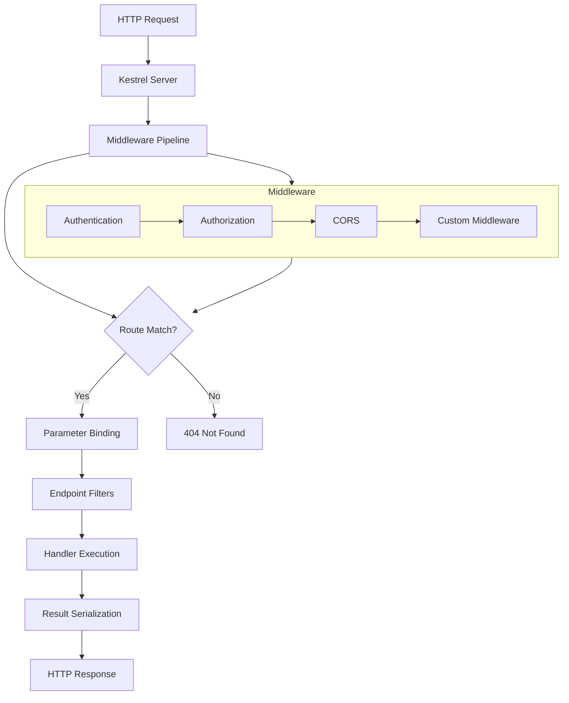
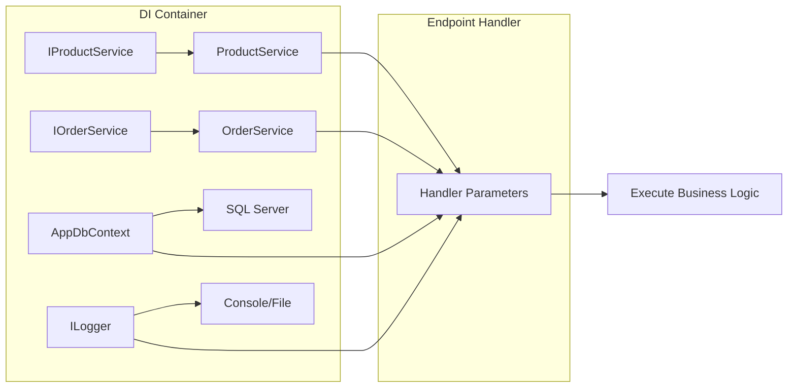
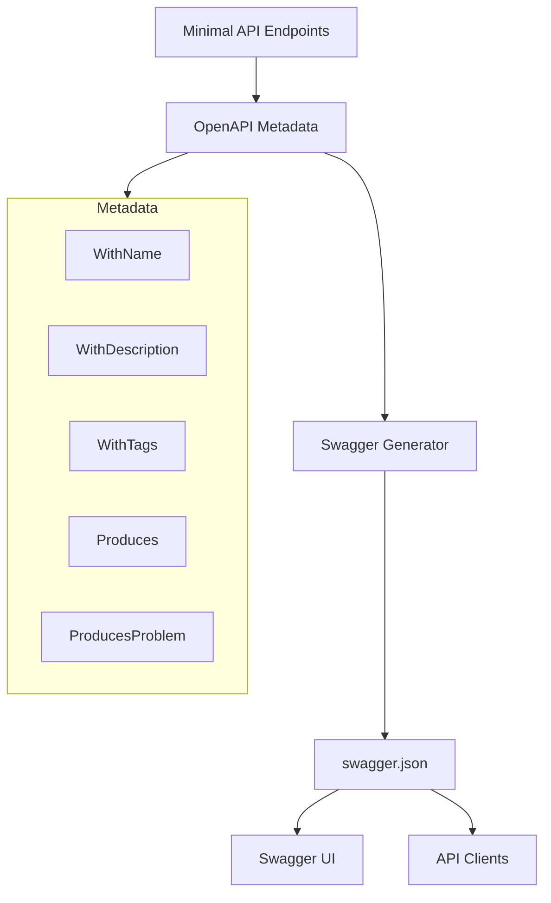
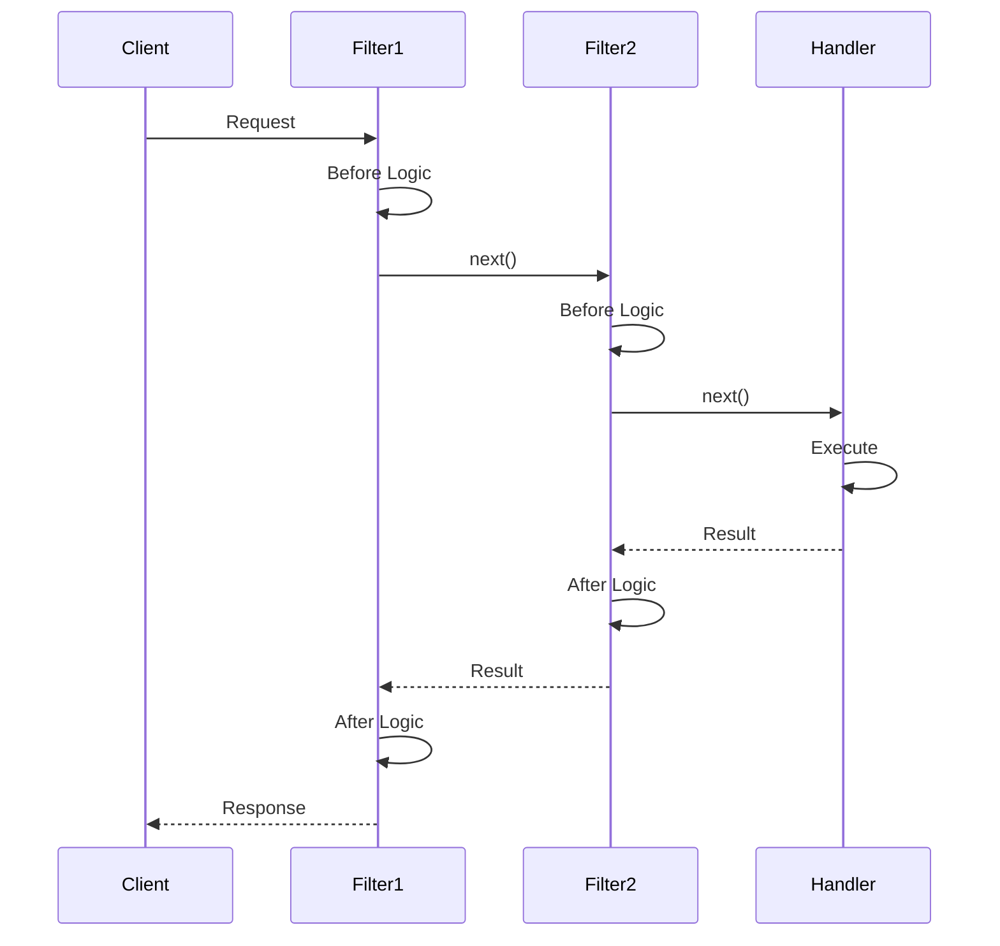
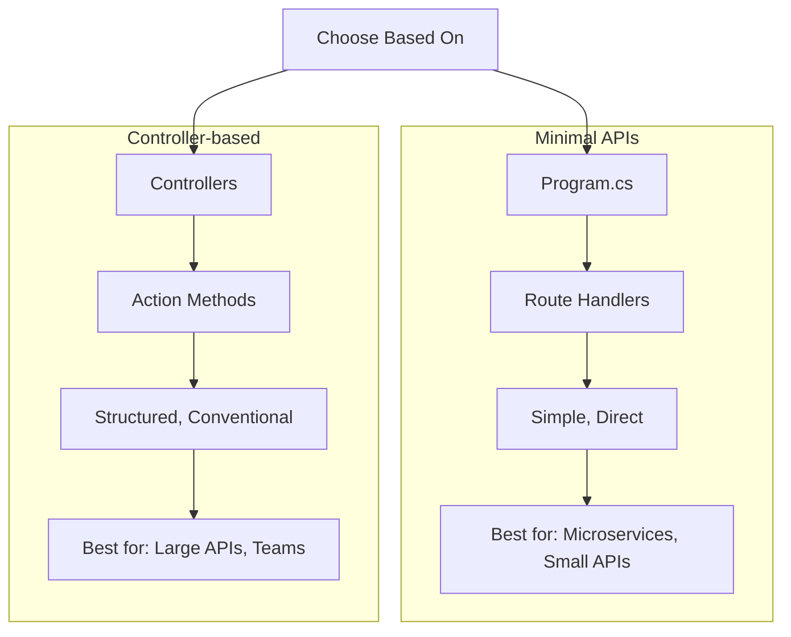

# How to Build Minimal APIs in ASP.NET Core 8

Author: [nawazdhandala](https://www.github.com/nawazdhandala)

Tags: .NET, C#, ASP.NET Core, Minimal APIs, REST, Web API, Backend Development

Description: Learn how to build lightweight, high-performance REST APIs using the Minimal API pattern in ASP.NET Core 8 with practical examples and best practices.

---

> Minimal APIs in ASP.NET Core 8 let you build HTTP endpoints with minimal ceremony - no controllers, no attributes, just clean C# code that maps routes to handlers. This approach reduces boilerplate while maintaining the full power of the ASP.NET Core framework.

## What Are Minimal APIs?

Minimal APIs were introduced in .NET 6 as a simpler way to build HTTP APIs without the overhead of controllers. In ASP.NET Core 8, they have matured into a powerful option for building microservices, serverless functions, and lightweight APIs.

The key difference from traditional controller-based APIs is the elimination of ceremony. Instead of creating controller classes, applying attributes, and following MVC conventions, you define endpoints directly in your `Program.cs` file using lambda expressions or method references.

```csharp
// Program.cs - A complete minimal API in just a few lines
// This is all you need for a working HTTP endpoint

var builder = WebApplication.CreateBuilder(args);
var app = builder.Build();

// Define a simple GET endpoint that returns a string
// No controller class, no attributes, no routing configuration
app.MapGet("/", () => "Hello, OneUptime!");

app.Run();
```

## Request Processing Flow

Understanding how requests flow through a minimal API application helps you design better endpoints.



## Creating Minimal API Endpoints

Minimal APIs provide methods for all standard HTTP verbs. Each method maps a route pattern to a handler delegate.

### MapGet - Retrieving Resources

```csharp
var builder = WebApplication.CreateBuilder(args);
var app = builder.Build();

// Simple GET endpoint returning a string
// Useful for health checks and simple status endpoints
app.MapGet("/api/health", () => "OK");

// GET endpoint returning an anonymous object
// ASP.NET Core automatically serializes it to JSON
app.MapGet("/api/status", () => new {
    Status = "Running",
    Timestamp = DateTime.UtcNow,
    Version = "1.0.0"
});

// GET endpoint with typed response and explicit result
// Results.Ok() provides more control over the response
app.MapGet("/api/products", () =>
{
    // Return a list of products
    // In production, this would come from a database
    var products = new List<Product>
    {
        new Product(1, "Monitor", 299.99m),
        new Product(2, "Keyboard", 79.99m),
        new Product(3, "Mouse", 49.99m)
    };
    return Results.Ok(products);
});

app.Run();

// Record type for clean, immutable data modeling
// Records automatically generate equality, GetHashCode, and ToString
record Product(int Id, string Name, decimal Price);
```

### MapPost - Creating Resources

```csharp
// POST endpoint to create a new product
// The product parameter is automatically deserialized from the JSON request body
app.MapPost("/api/products", (Product product) =>
{
    // In a real application, you would:
    // 1. Validate the input
    // 2. Save to database
    // 3. Return the created resource with its ID

    // Results.Created returns 201 with Location header
    return Results.Created($"/api/products/{product.Id}", product);
});

// POST with async handler and database context
// Dependency injection works seamlessly with minimal APIs
app.MapPost("/api/orders", async (Order order, AppDbContext db) =>
{
    // Entity Framework Core integration
    db.Orders.Add(order);
    await db.SaveChangesAsync();

    // Return 201 Created with the location of the new resource
    return Results.Created($"/api/orders/{order.Id}", order);
});
```

### MapPut - Updating Resources

```csharp
// PUT endpoint for full resource updates
// PUT should replace the entire resource
app.MapPut("/api/products/{id}", async (int id, Product updatedProduct, AppDbContext db) =>
{
    // Find the existing product by ID
    var product = await db.Products.FindAsync(id);

    // Return 404 if not found
    if (product is null)
    {
        return Results.NotFound(new { Message = $"Product with ID {id} not found" });
    }

    // Update all properties (full replacement)
    product.Name = updatedProduct.Name;
    product.Price = updatedProduct.Price;
    product.Description = updatedProduct.Description;
    product.Category = updatedProduct.Category;

    await db.SaveChangesAsync();

    return Results.Ok(product);
});

// PATCH for partial updates (using JsonPatch or manual approach)
app.MapPatch("/api/products/{id}", async (int id, ProductPatch patch, AppDbContext db) =>
{
    var product = await db.Products.FindAsync(id);
    if (product is null) return Results.NotFound();

    // Only update provided fields
    if (patch.Name is not null) product.Name = patch.Name;
    if (patch.Price.HasValue) product.Price = patch.Price.Value;

    await db.SaveChangesAsync();
    return Results.Ok(product);
});

// Record for partial updates with nullable properties
record ProductPatch(string? Name, decimal? Price);
```

### MapDelete - Removing Resources

```csharp
// DELETE endpoint to remove a product
app.MapDelete("/api/products/{id}", async (int id, AppDbContext db) =>
{
    // Find the product
    var product = await db.Products.FindAsync(id);

    if (product is null)
    {
        // Return 404 if the resource doesn't exist
        return Results.NotFound();
    }

    // Remove from database
    db.Products.Remove(product);
    await db.SaveChangesAsync();

    // Return 204 No Content on successful deletion
    // This is the standard response for DELETE operations
    return Results.NoContent();
});
```

## Route Parameters and Query Strings

Minimal APIs support various ways to extract data from incoming requests.

### Route Parameters

```csharp
// Single route parameter
// The {id} placeholder is automatically bound to the id parameter
app.MapGet("/api/users/{id}", (int id) =>
{
    // Parameter names must match the route placeholder names
    return Results.Ok(new { UserId = id });
});

// Multiple route parameters
// Useful for nested resources
app.MapGet("/api/users/{userId}/orders/{orderId}", (int userId, int orderId) =>
{
    return Results.Ok(new {
        UserId = userId,
        OrderId = orderId,
        Message = $"Fetching order {orderId} for user {userId}"
    });
});

// Optional route parameter with nullable type
// The ? makes the segment optional in the route
app.MapGet("/api/products/{category?}", (string? category) =>
{
    if (string.IsNullOrEmpty(category))
    {
        return Results.Ok("Returning all products");
    }
    return Results.Ok($"Returning products in category: {category}");
});

// Route constraints for type safety and validation
// :int ensures the parameter is a valid integer
app.MapGet("/api/items/{id:int}", (int id) => $"Item ID: {id}");

// :guid constraint for GUID parameters
app.MapGet("/api/orders/{orderId:guid}", (Guid orderId) => $"Order: {orderId}");

// :regex constraint for pattern matching
app.MapGet("/api/items/{slug:regex(^[a-z-]+$)}", (string slug) => $"Item slug: {slug}");

// :minlength and :maxlength for string validation
app.MapGet("/api/search/{term:minlength(3):maxlength(50)}", (string term) =>
    $"Searching for: {term}");
```

### Query String Parameters

```csharp
// Query parameters are automatically bound by name
// Example: GET /api/products/search?name=monitor&minPrice=100&maxPrice=500
app.MapGet("/api/products/search", (string? name, decimal? minPrice, decimal? maxPrice) =>
{
    // All parameters are optional (nullable)
    // Build a dynamic response based on provided parameters
    var filters = new List<string>();

    if (!string.IsNullOrEmpty(name))
        filters.Add($"name contains '{name}'");
    if (minPrice.HasValue)
        filters.Add($"price >= {minPrice}");
    if (maxPrice.HasValue)
        filters.Add($"price <= {maxPrice}");

    return Results.Ok(new {
        Filters = filters,
        Message = filters.Any()
            ? $"Searching with filters: {string.Join(", ", filters)}"
            : "No filters applied"
    });
});

// Using [AsParameters] for complex query parameters
// Groups related parameters into a single object
app.MapGet("/api/products/filter", ([AsParameters] ProductFilter filter) =>
{
    // All properties are populated from query string
    return Results.Ok(new {
        Filter = filter,
        PageInfo = $"Page {filter.Page} of size {filter.PageSize}"
    });
});

// Parameter class with default values
// Defaults are used when query parameters are not provided
class ProductFilter
{
    public string? Name { get; set; }
    public string? Category { get; set; }
    public decimal MinPrice { get; set; } = 0;
    public decimal MaxPrice { get; set; } = decimal.MaxValue;
    public int Page { get; set; } = 1;
    public int PageSize { get; set; } = 10;
    public string SortBy { get; set; } = "name";
    public bool Descending { get; set; } = false;
}
```

## Request and Response Handling

### Accessing HttpContext and Request Details

```csharp
// Inject HttpContext for full request access
app.MapGet("/api/request-info", (HttpContext context) =>
{
    // Access request headers, cookies, query string, etc.
    return Results.Ok(new {
        Method = context.Request.Method,
        Path = context.Request.Path.Value,
        QueryString = context.Request.QueryString.Value,
        ContentType = context.Request.ContentType,
        UserAgent = context.Request.Headers.UserAgent.ToString(),
        ClientIP = context.Connection.RemoteIpAddress?.ToString()
    });
});

// Inject specific request components
app.MapPost("/api/upload", async (HttpRequest request) =>
{
    // Handle file uploads
    if (!request.HasFormContentType)
    {
        return Results.BadRequest("Expected form data");
    }

    var form = await request.ReadFormAsync();
    var file = form.Files.FirstOrDefault();

    if (file is null)
    {
        return Results.BadRequest("No file uploaded");
    }

    return Results.Ok(new {
        FileName = file.FileName,
        ContentType = file.ContentType,
        Size = file.Length
    });
});
```

### Custom Response Types

```csharp
// Return different result types based on conditions
app.MapGet("/api/products/{id}", async (int id, AppDbContext db) =>
{
    var product = await db.Products.FindAsync(id);

    // Results class provides strongly-typed HTTP responses
    return product switch
    {
        null => Results.NotFound(new { Error = "Product not found", Id = id }),
        { IsDeleted: true } => Results.Gone(),  // 410 Gone
        { IsActive: false } => Results.NoContent(),  // 204 No Content
        _ => Results.Ok(product)  // 200 OK with product
    };
});

// Return custom status codes
app.MapPost("/api/products", async (Product product, AppDbContext db) =>
{
    // Check for duplicates
    var exists = await db.Products.AnyAsync(p => p.Sku == product.Sku);
    if (exists)
    {
        // 409 Conflict for duplicate resources
        return Results.Conflict(new {
            Error = "Product with this SKU already exists",
            Sku = product.Sku
        });
    }

    db.Products.Add(product);
    await db.SaveChangesAsync();

    // 201 Created with Location header
    return Results.Created($"/api/products/{product.Id}", product);
});

// Stream response for large data
app.MapGet("/api/export", async (AppDbContext db) =>
{
    // Return as a streaming response
    return Results.Stream(async stream =>
    {
        var writer = new StreamWriter(stream);
        await foreach (var product in db.Products.AsAsyncEnumerable())
        {
            await writer.WriteLineAsync($"{product.Id},{product.Name},{product.Price}");
            await writer.FlushAsync();
        }
    }, contentType: "text/csv");
});
```

## Dependency Injection in Minimal APIs

ASP.NET Core 8 Minimal APIs fully support dependency injection. Services are automatically resolved and injected into handlers.



### Registering Services

```csharp
var builder = WebApplication.CreateBuilder(args);

// Register services with the DI container
// Scoped: new instance per request (ideal for DB contexts)
builder.Services.AddScoped<IProductService, ProductService>();
builder.Services.AddScoped<IOrderService, OrderService>();

// Register Entity Framework Core DbContext
builder.Services.AddDbContext<AppDbContext>(options =>
    options.UseSqlServer(builder.Configuration.GetConnectionString("Default")));

// Singleton: single instance for the application lifetime
// Good for stateless services and caches
builder.Services.AddSingleton<ICacheService, RedisCacheService>();

// Transient: new instance every time it's requested
builder.Services.AddTransient<IEmailService, SmtpEmailService>();

// Register HttpClient for external API calls
// HttpClientFactory manages connection pooling
builder.Services.AddHttpClient<IExternalApiClient, ExternalApiClient>(client =>
{
    client.BaseAddress = new Uri("https://api.example.com");
    client.Timeout = TimeSpan.FromSeconds(30);
    client.DefaultRequestHeaders.Add("Accept", "application/json");
});

// Register options pattern for configuration
builder.Services.Configure<ApiSettings>(
    builder.Configuration.GetSection("ApiSettings"));

var app = builder.Build();
```

### Injecting Services into Handlers

```csharp
// Services are injected as handler parameters
// The DI container resolves them automatically
app.MapGet("/api/products", async (IProductService productService) =>
{
    var products = await productService.GetAllAsync();
    return Results.Ok(products);
});

// Multiple services can be injected
// Mix services with route parameters and request data
app.MapPost("/api/orders", async (
    Order order,                           // From request body
    IOrderService orderService,            // Injected service
    INotificationService notificationService,  // Injected service
    ILogger<Program> logger)               // Built-in logger
{
    logger.LogInformation("Creating order for customer {CustomerId}", order.CustomerId);

    var createdOrder = await orderService.CreateAsync(order);

    // Fire-and-forget notification (consider background jobs for production)
    _ = notificationService.SendOrderConfirmationAsync(createdOrder);

    return Results.Created($"/api/orders/{createdOrder.Id}", createdOrder);
});

// Inject configuration using IOptions pattern
app.MapGet("/api/settings", (IOptions<ApiSettings> options) =>
{
    var settings = options.Value;
    return Results.Ok(new {
        AppName = settings.Name,
        Version = settings.Version,
        Environment = settings.Environment
    });
});

// Inject IConfiguration for direct config access
app.MapGet("/api/feature-flags", (IConfiguration config) =>
{
    return Results.Ok(new {
        NewCheckoutEnabled = config.GetValue<bool>("Features:NewCheckout"),
        MaxUploadSize = config.GetValue<int>("Limits:MaxUploadSizeMB")
    });
});
```

### Service Interface and Implementation Example

```csharp
// IProductService.cs
// Define the contract for product operations
public interface IProductService
{
    Task<IEnumerable<Product>> GetAllAsync();
    Task<Product?> GetByIdAsync(int id);
    Task<Product> CreateAsync(Product product);
    Task<Product?> UpdateAsync(int id, Product product);
    Task<bool> DeleteAsync(int id);
    Task<IEnumerable<Product>> SearchAsync(string term);
}

// ProductService.cs
// Implementation with constructor injection
public class ProductService : IProductService
{
    private readonly AppDbContext _context;
    private readonly ILogger<ProductService> _logger;
    private readonly ICacheService _cache;

    // Constructor injection - dependencies are provided by DI container
    public ProductService(
        AppDbContext context,
        ILogger<ProductService> logger,
        ICacheService cache)
    {
        _context = context;
        _logger = logger;
        _cache = cache;
    }

    public async Task<IEnumerable<Product>> GetAllAsync()
    {
        // Try cache first
        var cached = await _cache.GetAsync<IEnumerable<Product>>("products:all");
        if (cached is not null)
        {
            _logger.LogDebug("Returning products from cache");
            return cached;
        }

        _logger.LogInformation("Fetching all products from database");
        var products = await _context.Products
            .Where(p => !p.IsDeleted)
            .OrderBy(p => p.Name)
            .ToListAsync();

        // Cache for 5 minutes
        await _cache.SetAsync("products:all", products, TimeSpan.FromMinutes(5));

        return products;
    }

    public async Task<Product?> GetByIdAsync(int id)
    {
        var cacheKey = $"products:{id}";
        var cached = await _cache.GetAsync<Product>(cacheKey);
        if (cached is not null) return cached;

        var product = await _context.Products.FindAsync(id);
        if (product is not null)
        {
            await _cache.SetAsync(cacheKey, product, TimeSpan.FromMinutes(5));
        }
        return product;
    }

    public async Task<Product> CreateAsync(Product product)
    {
        _context.Products.Add(product);
        await _context.SaveChangesAsync();

        _logger.LogInformation("Created product {ProductId}: {ProductName}",
            product.Id, product.Name);

        // Invalidate cache
        await _cache.RemoveAsync("products:all");

        return product;
    }

    public async Task<Product?> UpdateAsync(int id, Product product)
    {
        var existing = await _context.Products.FindAsync(id);
        if (existing is null) return null;

        existing.Name = product.Name;
        existing.Price = product.Price;
        existing.Description = product.Description;
        existing.UpdatedAt = DateTime.UtcNow;

        await _context.SaveChangesAsync();

        // Invalidate caches
        await _cache.RemoveAsync($"products:{id}");
        await _cache.RemoveAsync("products:all");

        return existing;
    }

    public async Task<bool> DeleteAsync(int id)
    {
        var product = await _context.Products.FindAsync(id);
        if (product is null) return false;

        // Soft delete
        product.IsDeleted = true;
        product.DeletedAt = DateTime.UtcNow;
        await _context.SaveChangesAsync();

        // Invalidate caches
        await _cache.RemoveAsync($"products:{id}");
        await _cache.RemoveAsync("products:all");

        return true;
    }

    public async Task<IEnumerable<Product>> SearchAsync(string term)
    {
        _logger.LogInformation("Searching products with term: {Term}", term);

        return await _context.Products
            .Where(p => !p.IsDeleted &&
                (p.Name.Contains(term) || p.Description.Contains(term)))
            .Take(50)
            .ToListAsync();
    }
}
```

## OpenAPI/Swagger Integration

ASP.NET Core 8 has excellent built-in support for OpenAPI documentation, making it easy to generate interactive API documentation.



### Basic Setup

```csharp
var builder = WebApplication.CreateBuilder(args);

// Add OpenAPI services
// This scans your endpoints and generates the OpenAPI spec
builder.Services.AddEndpointsApiExplorer();

// Configure Swagger generation
builder.Services.AddSwaggerGen(options =>
{
    // Define API information shown in Swagger UI
    options.SwaggerDoc("v1", new OpenApiInfo
    {
        Title = "Product API",
        Version = "v1",
        Description = "A high-performance API for managing products built with ASP.NET Core 8 Minimal APIs",
        Contact = new OpenApiContact
        {
            Name = "OneUptime",
            Url = new Uri("https://oneuptime.com"),
            Email = "support@oneuptime.com"
        },
        License = new OpenApiLicense
        {
            Name = "MIT License",
            Url = new Uri("https://opensource.org/licenses/MIT")
        }
    });

    // Include XML comments if available
    var xmlFile = $"{Assembly.GetExecutingAssembly().GetName().Name}.xml";
    var xmlPath = Path.Combine(AppContext.BaseDirectory, xmlFile);
    if (File.Exists(xmlPath))
    {
        options.IncludeXmlComments(xmlPath);
    }
});

var app = builder.Build();

// Enable Swagger in development (and optionally in other environments)
if (app.Environment.IsDevelopment())
{
    app.UseSwagger();
    app.UseSwaggerUI(options =>
    {
        options.SwaggerEndpoint("/swagger/v1/swagger.json", "Product API v1");
        options.RoutePrefix = string.Empty; // Serve Swagger UI at root URL
        options.DocumentTitle = "Product API Documentation";

        // UI customization
        options.DefaultModelsExpandDepth(-1); // Hide schemas section by default
        options.DocExpansion(DocExpansion.List); // Collapse operations by default
    });
}
```

### Documenting Endpoints

```csharp
// Add metadata to endpoints for comprehensive documentation
app.MapGet("/api/products", async (IProductService service) =>
{
    return Results.Ok(await service.GetAllAsync());
})
.WithName("GetAllProducts")  // Operation ID for client generation
.WithDescription("Retrieves all active products from the catalog")
.WithSummary("Get all products")  // Short summary
.WithTags("Products")  // Group in Swagger UI
.Produces<IEnumerable<Product>>(StatusCodes.Status200OK)
.ProducesProblem(StatusCodes.Status500InternalServerError);

app.MapGet("/api/products/{id}", async (int id, IProductService service) =>
{
    var product = await service.GetByIdAsync(id);
    return product is not null
        ? Results.Ok(product)
        : Results.NotFound(new { Error = "Product not found" });
})
.WithName("GetProductById")
.WithDescription("Retrieves a specific product by its unique identifier")
.WithTags("Products")
.Produces<Product>(StatusCodes.Status200OK)
.ProducesProblem(StatusCodes.Status404NotFound)
.WithOpenApi(operation =>
{
    // Customize the OpenAPI operation
    operation.Parameters[0].Description = "The unique product identifier";
    operation.Parameters[0].Example = new OpenApiInteger(42);
    return operation;
});

app.MapPost("/api/products", async (CreateProductRequest request, IProductService service) =>
{
    var product = await service.CreateAsync(new Product
    {
        Name = request.Name,
        Price = request.Price,
        Description = request.Description,
        Category = request.Category
    });
    return Results.Created($"/api/products/{product.Id}", product);
})
.WithName("CreateProduct")
.WithDescription("Creates a new product in the catalog. The product ID is auto-generated.")
.WithTags("Products")
.Accepts<CreateProductRequest>("application/json")
.Produces<Product>(StatusCodes.Status201Created)
.ProducesValidationProblem()
.ProducesProblem(StatusCodes.Status500InternalServerError);
```

### Adding Security Documentation

```csharp
builder.Services.AddSwaggerGen(options =>
{
    // Add JWT Bearer authentication scheme
    options.AddSecurityDefinition("Bearer", new OpenApiSecurityScheme
    {
        Description = "JWT Authorization header using the Bearer scheme. Enter 'Bearer' [space] and then your token.",
        Name = "Authorization",
        In = ParameterLocation.Header,
        Type = SecuritySchemeType.Http,
        Scheme = "bearer",
        BearerFormat = "JWT"
    });

    // Add API Key authentication scheme
    options.AddSecurityDefinition("ApiKey", new OpenApiSecurityScheme
    {
        Description = "API Key authentication. Enter your API key.",
        Name = "X-API-Key",
        In = ParameterLocation.Header,
        Type = SecuritySchemeType.ApiKey
    });

    // Apply security globally
    options.AddSecurityRequirement(new OpenApiSecurityRequirement
    {
        {
            new OpenApiSecurityScheme
            {
                Reference = new OpenApiReference
                {
                    Type = ReferenceType.SecurityScheme,
                    Id = "Bearer"
                }
            },
            Array.Empty<string>()
        }
    });
});

// Apply security to specific endpoints
app.MapDelete("/api/products/{id}", async (int id, IProductService service) =>
{
    var deleted = await service.DeleteAsync(id);
    return deleted ? Results.NoContent() : Results.NotFound();
})
.RequireAuthorization("AdminPolicy")
.WithTags("Products")
.WithOpenApi(operation =>
{
    operation.Security = new List<OpenApiSecurityRequirement>
    {
        new OpenApiSecurityRequirement
        {
            {
                new OpenApiSecurityScheme
                {
                    Reference = new OpenApiReference { Type = ReferenceType.SecurityScheme, Id = "Bearer" }
                },
                new[] { "products:delete" }
            }
        }
    };
    return operation;
});
```

## Endpoint Filters

Filters in ASP.NET Core 8 Minimal APIs allow you to run code before and after endpoint handlers, similar to action filters in MVC.



### Creating Custom Filters

```csharp
// Inline logging filter using lambda
app.MapGet("/api/products", async (IProductService service) =>
{
    return Results.Ok(await service.GetAllAsync());
})
.AddEndpointFilter(async (context, next) =>
{
    // Code runs BEFORE the handler
    var logger = context.HttpContext.RequestServices.GetRequiredService<ILogger<Program>>();
    var stopwatch = Stopwatch.StartNew();
    var path = context.HttpContext.Request.Path;

    logger.LogInformation("Request started: {Path}", path);

    // Call the next filter or the handler
    var result = await next(context);

    // Code runs AFTER the handler
    stopwatch.Stop();
    logger.LogInformation("Request completed: {Path} in {ElapsedMs}ms",
        path, stopwatch.ElapsedMilliseconds);

    return result;
});
```

### Reusable Filter Classes

```csharp
// ValidationFilter.cs - Reusable validation filter
// Validates request objects using DataAnnotations
public class ValidationFilter<T> : IEndpointFilter where T : class
{
    public async ValueTask<object?> InvokeAsync(
        EndpointFilterInvocationContext context,
        EndpointFilterDelegate next)
    {
        // Find the argument of type T in the handler parameters
        var argument = context.Arguments.OfType<T>().FirstOrDefault();

        if (argument is null)
        {
            return Results.BadRequest(new {
                Error = "Request body is required",
                ExpectedType = typeof(T).Name
            });
        }

        // Validate using DataAnnotations
        var validationResults = new List<ValidationResult>();
        var validationContext = new ValidationContext(argument);

        if (!Validator.TryValidateObject(argument, validationContext, validationResults, validateAllProperties: true))
        {
            var errors = validationResults
                .GroupBy(r => r.MemberNames.FirstOrDefault() ?? "Unknown")
                .ToDictionary(
                    g => g.Key,
                    g => g.Select(r => r.ErrorMessage ?? "Validation failed").ToArray()
                );

            return Results.ValidationProblem(errors);
        }

        // Validation passed, continue to the handler
        return await next(context);
    }
}

// Apply the filter to an endpoint
app.MapPost("/api/products", (CreateProductRequest request, IProductService service) =>
{
    // Request is guaranteed to be valid here
    return Results.Created($"/api/products/{request.Name}", request);
})
.AddEndpointFilter<ValidationFilter<CreateProductRequest>>();
```

### Authentication and Authorization Filters

```csharp
// ApiKeyFilter.cs - API key validation filter
public class ApiKeyFilter : IEndpointFilter
{
    private const string ApiKeyHeaderName = "X-API-Key";

    public async ValueTask<object?> InvokeAsync(
        EndpointFilterInvocationContext context,
        EndpointFilterDelegate next)
    {
        var configuration = context.HttpContext.RequestServices
            .GetRequiredService<IConfiguration>();

        // Check for API key in header
        if (!context.HttpContext.Request.Headers.TryGetValue(ApiKeyHeaderName, out var providedKey))
        {
            return Results.Unauthorized();
        }

        var validApiKey = configuration["ApiSettings:ApiKey"];

        // Constant-time comparison to prevent timing attacks
        if (!CryptographicOperations.FixedTimeEquals(
            Encoding.UTF8.GetBytes(providedKey.ToString()),
            Encoding.UTF8.GetBytes(validApiKey ?? "")))
        {
            return Results.Json(
                new { Error = "Invalid API key" },
                statusCode: StatusCodes.Status403Forbidden
            );
        }

        return await next(context);
    }
}

// RateLimitingFilter.cs - Simple rate limiting
public class RateLimitingFilter : IEndpointFilter
{
    private static readonly ConcurrentDictionary<string, (int Count, DateTime Window)> _requests = new();
    private readonly int _maxRequests;
    private readonly TimeSpan _window;

    public RateLimitingFilter(int maxRequests = 100, int windowSeconds = 60)
    {
        _maxRequests = maxRequests;
        _window = TimeSpan.FromSeconds(windowSeconds);
    }

    public async ValueTask<object?> InvokeAsync(
        EndpointFilterInvocationContext context,
        EndpointFilterDelegate next)
    {
        var clientId = context.HttpContext.Connection.RemoteIpAddress?.ToString() ?? "unknown";
        var now = DateTime.UtcNow;

        var (count, windowStart) = _requests.GetOrAdd(clientId, (0, now));

        // Reset window if expired
        if (now - windowStart > _window)
        {
            _requests[clientId] = (1, now);
            return await next(context);
        }

        // Check rate limit
        if (count >= _maxRequests)
        {
            context.HttpContext.Response.Headers["Retry-After"] =
                ((int)(_window - (now - windowStart)).TotalSeconds).ToString();

            return Results.Json(
                new { Error = "Rate limit exceeded", RetryAfterSeconds = (int)(_window - (now - windowStart)).TotalSeconds },
                statusCode: StatusCodes.Status429TooManyRequests
            );
        }

        _requests[clientId] = (count + 1, windowStart);
        return await next(context);
    }
}

// Apply filters to protected endpoints
app.MapPost("/api/admin/products", (Product product) => Results.Ok(product))
    .AddEndpointFilter<ApiKeyFilter>()
    .AddEndpointFilter(new RateLimitingFilter(maxRequests: 10, windowSeconds: 60));
```

## Grouping Endpoints with Route Groups

ASP.NET Core 8 allows you to organize related endpoints into groups, reducing repetition and improving code organization.

```csharp
var builder = WebApplication.CreateBuilder(args);
var app = builder.Build();

// Create a route group for products
// All routes in this group are prefixed with /api/products
var products = app.MapGroup("/api/products")
    .WithTags("Products")
    .WithOpenApi();

// Define endpoints within the group
// No need to repeat /api/products prefix
products.MapGet("/", async (IProductService service) =>
    Results.Ok(await service.GetAllAsync()))
    .WithName("GetAllProducts");

products.MapGet("/{id}", async (int id, IProductService service) =>
{
    var product = await service.GetByIdAsync(id);
    return product is not null ? Results.Ok(product) : Results.NotFound();
})
.WithName("GetProductById");

products.MapPost("/", async (CreateProductRequest request, IProductService service) =>
{
    var product = await service.CreateAsync(new Product { Name = request.Name, Price = request.Price });
    return Results.Created($"/api/products/{product.Id}", product);
})
.WithName("CreateProduct")
.AddEndpointFilter<ValidationFilter<CreateProductRequest>>();

products.MapPut("/{id}", async (int id, Product product, IProductService service) =>
{
    var updated = await service.UpdateAsync(id, product);
    return updated is not null ? Results.Ok(updated) : Results.NotFound();
})
.WithName("UpdateProduct");

products.MapDelete("/{id}", async (int id, IProductService service) =>
{
    var deleted = await service.DeleteAsync(id);
    return deleted ? Results.NoContent() : Results.NotFound();
})
.WithName("DeleteProduct");

app.Run();
```

### Applying Filters to Groups

```csharp
// Apply authentication and rate limiting to an entire group
var adminApi = app.MapGroup("/api/admin")
    .RequireAuthorization("AdminPolicy")
    .AddEndpointFilter<ApiKeyFilter>()
    .AddEndpointFilter(new RateLimitingFilter(maxRequests: 50, windowSeconds: 60))
    .WithTags("Admin");

adminApi.MapGet("/users", (IUserService service) => service.GetAllAsync());
adminApi.MapDelete("/users/{id}", (int id, IUserService service) => service.DeleteAsync(id));
adminApi.MapGet("/stats", (IStatsService service) => service.GetDashboardStats());

// Public endpoints with different rate limits
var publicApi = app.MapGroup("/api/public")
    .AddEndpointFilter(new RateLimitingFilter(maxRequests: 1000, windowSeconds: 60))
    .WithTags("Public");

publicApi.MapGet("/products", (IProductService service) => service.GetAllAsync());
publicApi.MapGet("/categories", (ICategoryService service) => service.GetAllAsync());
```

### Organizing with Extension Methods

```csharp
// ProductEndpoints.cs - Clean organization using extension methods
public static class ProductEndpoints
{
    public static RouteGroupBuilder MapProductEndpoints(this RouteGroupBuilder group)
    {
        group.MapGet("/", GetAllProducts)
            .WithName("GetAllProducts")
            .Produces<IEnumerable<Product>>();

        group.MapGet("/{id}", GetProductById)
            .WithName("GetProductById")
            .Produces<Product>()
            .ProducesProblem(StatusCodes.Status404NotFound);

        group.MapPost("/", CreateProduct)
            .WithName("CreateProduct")
            .Produces<Product>(StatusCodes.Status201Created)
            .ProducesValidationProblem()
            .AddEndpointFilter<ValidationFilter<CreateProductRequest>>();

        group.MapPut("/{id}", UpdateProduct)
            .WithName("UpdateProduct")
            .Produces<Product>()
            .ProducesProblem(StatusCodes.Status404NotFound);

        group.MapDelete("/{id}", DeleteProduct)
            .WithName("DeleteProduct")
            .Produces(StatusCodes.Status204NoContent)
            .ProducesProblem(StatusCodes.Status404NotFound);

        return group;
    }

    // Handler methods with clear signatures
    private static async Task<IResult> GetAllProducts(IProductService service)
    {
        var products = await service.GetAllAsync();
        return Results.Ok(products);
    }

    private static async Task<IResult> GetProductById(int id, IProductService service)
    {
        var product = await service.GetByIdAsync(id);
        return product is not null
            ? Results.Ok(product)
            : Results.NotFound(new { Error = $"Product {id} not found" });
    }

    private static async Task<IResult> CreateProduct(
        CreateProductRequest request,
        IProductService service)
    {
        var product = await service.CreateAsync(new Product
        {
            Name = request.Name,
            Price = request.Price
        });
        return Results.Created($"/api/products/{product.Id}", product);
    }

    private static async Task<IResult> UpdateProduct(
        int id,
        Product product,
        IProductService service)
    {
        var updated = await service.UpdateAsync(id, product);
        return updated is not null
            ? Results.Ok(updated)
            : Results.NotFound(new { Error = $"Product {id} not found" });
    }

    private static async Task<IResult> DeleteProduct(int id, IProductService service)
    {
        var deleted = await service.DeleteAsync(id);
        return deleted
            ? Results.NoContent()
            : Results.NotFound(new { Error = $"Product {id} not found" });
    }
}

// Program.cs - Clean and organized
var builder = WebApplication.CreateBuilder(args);

builder.Services.AddScoped<IProductService, ProductService>();
builder.Services.AddEndpointsApiExplorer();
builder.Services.AddSwaggerGen();

var app = builder.Build();

app.UseSwagger();
app.UseSwaggerUI();

// Register all product endpoints with a single line
app.MapGroup("/api/products")
    .WithTags("Products")
    .MapProductEndpoints();

// Register other endpoint groups
app.MapGroup("/api/orders")
    .WithTags("Orders")
    .MapOrderEndpoints();

app.Run();
```

## Best Practices Summary

| Practice | Recommendation |
|----------|----------------|
| **Project structure** | Use extension methods to organize endpoints by feature or domain |
| **Dependency injection** | Register services with appropriate lifetimes (Scoped for DB contexts, Singleton for stateless services) |
| **Validation** | Use endpoint filters with FluentValidation or Data Annotations for consistent validation |
| **Error handling** | Return ProblemDetails for errors using Results.Problem() or Results.ValidationProblem() |
| **Documentation** | Always add WithName, WithDescription, and Produces metadata for OpenAPI documentation |
| **Route groups** | Group related endpoints and apply common filters, tags, and authorization at the group level |
| **Async handlers** | Use async/await for all I/O operations to maximize throughput |
| **Security** | Apply RequireAuthorization at the group level for protected endpoints |
| **Versioning** | Use route groups with version prefixes (/api/v1, /api/v2) for API versioning |
| **Testing** | Extract handler logic into separate methods or services for easier unit testing |
| **Logging** | Inject ILogger and log important operations with appropriate log levels |
| **Caching** | Use response caching and output caching for frequently accessed, rarely changing data |

## Minimal APIs vs Controllers



Minimal APIs in ASP.NET Core 8 provide a clean, performant way to build HTTP APIs. They are particularly well-suited for microservices, serverless functions, and scenarios where the ceremony of controllers adds unnecessary complexity. Combined with features like endpoint filters, route groups, and built-in OpenAPI support, minimal APIs are a production-ready choice for modern .NET development.

---

Monitor your ASP.NET Core APIs with [OneUptime](https://oneuptime.com) - the open-source observability platform that helps you track performance, uptime, and errors across all your services.
