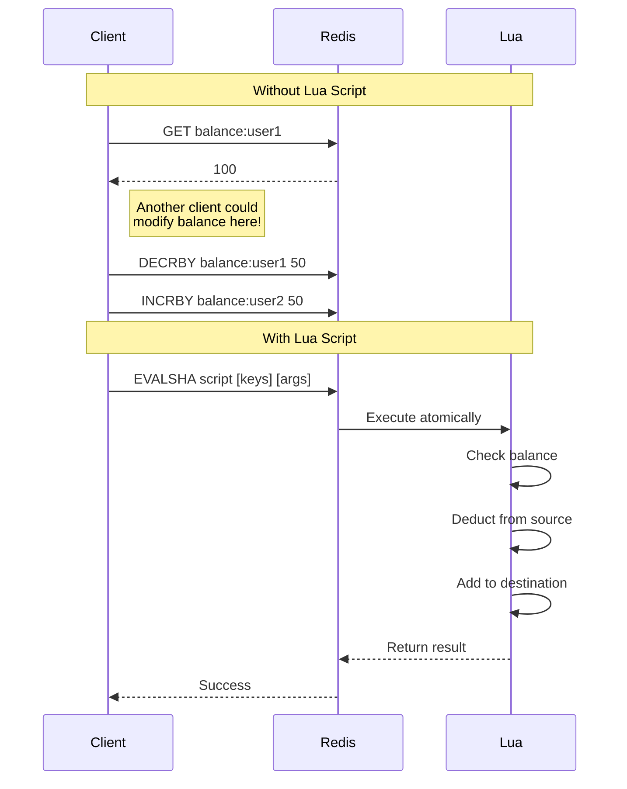

# How to Perform Atomic Operations with Redis Lua Scripts

Author: [nawazdhandala](https://www.github.com/nawazdhandala)

Tags: Redis, Lua, Atomic Operations, Scripting, Transactions, Performance

Description: Learn how to write Redis Lua scripts for complex atomic operations that cannot be achieved with basic commands. This guide covers script writing, debugging, and production patterns.

---

Redis commands are atomic individually, but what happens when you need multiple commands to execute as a single unit? Traditional transactions with MULTI/EXEC do not allow you to read and write in the same transaction. Lua scripts solve this by running on the Redis server, guaranteeing atomicity for complex operations.

## Why Lua Scripts?

Consider transferring funds between two accounts. You need to:
1. Check if source has enough balance
2. Deduct from source
3. Add to destination

With separate commands, another client could modify balances between steps. Lua scripts run atomically on the server, making this safe.



## Basic Lua Script Structure

```javascript
// lua-basics.js
// Basic Redis Lua script execution
const Redis = require('ioredis');
const redis = new Redis();

// Execute a simple Lua script
// EVAL script numkeys key [key ...] arg [arg ...]
async function basicScript() {
  const script = `
    -- Get current value
    local current = redis.call('GET', KEYS[1])

    -- If no value, set default
    if not current then
      current = '0'
    end

    -- Increment by argument
    local newValue = tonumber(current) + tonumber(ARGV[1])

    -- Set new value
    redis.call('SET', KEYS[1], newValue)

    -- Return new value
    return newValue
  `;

  // KEYS[1] = 'counter', ARGV[1] = '5'
  const result = await redis.eval(script, 1, 'counter', '5');
  console.log('New counter value:', result);
}

// Using EVALSHA for cached scripts (faster)
async function cachedScript() {
  const script = `
    return redis.call('GET', KEYS[1])
  `;

  // Load script and get SHA1 hash
  const sha = await redis.script('LOAD', script);
  console.log('Script SHA:', sha);

  // Execute using SHA (faster, no script transfer)
  const result = await redis.evalsha(sha, 1, 'mykey');
  console.log('Result:', result);
}

module.exports = { basicScript, cachedScript };
```

## Practical Example: Rate Limiter

A sliding window rate limiter that's impossible to implement correctly without atomicity.

```javascript
// rate-limiter.js
// Atomic sliding window rate limiter using Lua
const Redis = require('ioredis');
const redis = new Redis();

// Lua script for sliding window rate limiting
const RATE_LIMIT_SCRIPT = `
-- KEYS[1] = rate limit key
-- ARGV[1] = window size in milliseconds
-- ARGV[2] = max requests allowed
-- ARGV[3] = current timestamp in milliseconds

local key = KEYS[1]
local window = tonumber(ARGV[1])
local maxRequests = tonumber(ARGV[2])
local now = tonumber(ARGV[3])
local windowStart = now - window

-- Remove old entries outside the window
redis.call('ZREMRANGEBYSCORE', key, '-inf', windowStart)

-- Count current requests in window
local currentRequests = redis.call('ZCARD', key)

if currentRequests < maxRequests then
  -- Add this request
  redis.call('ZADD', key, now, now .. '-' .. math.random(1000000))
  -- Set expiry on the key
  redis.call('PEXPIRE', key, window)

  return {1, maxRequests - currentRequests - 1, 0}
else
  -- Get oldest entry to calculate retry time
  local oldest = redis.call('ZRANGE', key, 0, 0, 'WITHSCORES')
  local retryAfter = 0
  if oldest[2] then
    retryAfter = tonumber(oldest[2]) + window - now
  end

  return {0, 0, retryAfter}
end
`;

class RateLimiter {
  constructor(options = {}) {
    this.windowMs = options.windowMs || 60000; // 1 minute
    this.maxRequests = options.maxRequests || 100;
    this.keyPrefix = options.keyPrefix || 'rl:';
    this.scriptSha = null;
  }

  async loadScript() {
    this.scriptSha = await redis.script('LOAD', RATE_LIMIT_SCRIPT);
  }

  async checkLimit(identifier) {
    if (!this.scriptSha) {
      await this.loadScript();
    }

    const key = this.keyPrefix + identifier;
    const now = Date.now();

    try {
      const result = await redis.evalsha(
        this.scriptSha,
        1,
        key,
        this.windowMs,
        this.maxRequests,
        now
      );

      return {
        allowed: result[0] === 1,
        remaining: result[1],
        retryAfterMs: result[2],
      };
    } catch (error) {
      // Script might have been flushed, reload
      if (error.message.includes('NOSCRIPT')) {
        await this.loadScript();
        return this.checkLimit(identifier);
      }
      throw error;
    }
  }
}

// Express middleware
function rateLimitMiddleware(options) {
  const limiter = new RateLimiter(options);

  return async (req, res, next) => {
    const identifier = req.ip || req.headers['x-forwarded-for'];
    const result = await limiter.checkLimit(identifier);

    res.set('X-RateLimit-Remaining', result.remaining);

    if (!result.allowed) {
      res.set('Retry-After', Math.ceil(result.retryAfterMs / 1000));
      return res.status(429).json({
        error: 'Too many requests',
        retryAfter: Math.ceil(result.retryAfterMs / 1000),
      });
    }

    next();
  };
}

module.exports = { RateLimiter, rateLimitMiddleware };
```

## Fund Transfer (Compare and Swap)

Atomic fund transfer with balance validation.

```javascript
// fund-transfer.js
// Atomic fund transfer using Lua
const Redis = require('ioredis');
const redis = new Redis();

const TRANSFER_SCRIPT = `
-- KEYS[1] = source account key
-- KEYS[2] = destination account key
-- ARGV[1] = amount to transfer

local sourceKey = KEYS[1]
local destKey = KEYS[2]
local amount = tonumber(ARGV[1])

-- Validate amount
if amount <= 0 then
  return {err = 'Invalid amount'}
end

-- Get source balance
local sourceBalance = tonumber(redis.call('GET', sourceKey) or '0')

-- Check sufficient funds
if sourceBalance < amount then
  return {err = 'Insufficient funds', balance = sourceBalance}
end

-- Perform transfer
local newSourceBalance = sourceBalance - amount
local destBalance = tonumber(redis.call('GET', destKey) or '0')
local newDestBalance = destBalance + amount

redis.call('SET', sourceKey, newSourceBalance)
redis.call('SET', destKey, newDestBalance)

return {
  ok = true,
  sourceBalance = newSourceBalance,
  destBalance = newDestBalance
}
`;

class AccountService {
  constructor() {
    this.scriptSha = null;
    this.keyPrefix = 'account:';
  }

  async loadScript() {
    this.scriptSha = await redis.script('LOAD', TRANSFER_SCRIPT);
  }

  async transfer(fromAccount, toAccount, amount) {
    if (!this.scriptSha) {
      await this.loadScript();
    }

    const fromKey = this.keyPrefix + fromAccount;
    const toKey = this.keyPrefix + toAccount;

    const result = await redis.evalsha(
      this.scriptSha,
      2,
      fromKey,
      toKey,
      amount
    );

    // Lua returns arrays, parse the result
    const parsed = this.parseResult(result);

    if (parsed.err) {
      throw new Error(parsed.err);
    }

    return {
      success: true,
      fromBalance: parsed.sourceBalance,
      toBalance: parsed.destBalance,
    };
  }

  parseResult(result) {
    // Redis returns Lua tables as alternating key-value arrays
    if (Array.isArray(result)) {
      const obj = {};
      for (let i = 0; i < result.length; i += 2) {
        obj[result[i]] = result[i + 1];
      }
      return obj;
    }
    return result;
  }

  async getBalance(account) {
    const balance = await redis.get(this.keyPrefix + account);
    return parseFloat(balance) || 0;
  }

  async setBalance(account, amount) {
    await redis.set(this.keyPrefix + account, amount);
  }
}

module.exports = AccountService;
```

## Distributed Lock with Fencing Token

A robust distributed lock implementation.

```javascript
// distributed-lock.js
// Distributed lock with fencing tokens using Lua
const Redis = require('ioredis');
const crypto = require('crypto');
const redis = new Redis();

// Acquire lock script
const ACQUIRE_SCRIPT = `
-- KEYS[1] = lock key
-- ARGV[1] = token (unique identifier)
-- ARGV[2] = TTL in milliseconds

local key = KEYS[1]
local token = ARGV[1]
local ttl = tonumber(ARGV[2])

-- Try to acquire lock
local acquired = redis.call('SET', key, token, 'NX', 'PX', ttl)

if acquired then
  -- Get fencing token (incrementing counter)
  local fenceKey = key .. ':fence'
  local fenceToken = redis.call('INCR', fenceKey)
  redis.call('PEXPIRE', fenceKey, ttl * 2)
  return {1, fenceToken}
end

return {0, 0}
`;

// Release lock script
const RELEASE_SCRIPT = `
-- KEYS[1] = lock key
-- ARGV[1] = token (must match to release)

local key = KEYS[1]
local token = ARGV[1]

-- Only release if we own the lock
if redis.call('GET', key) == token then
  redis.call('DEL', key)
  return 1
end

return 0
`;

// Extend lock script
const EXTEND_SCRIPT = `
-- KEYS[1] = lock key
-- ARGV[1] = token
-- ARGV[2] = new TTL in milliseconds

local key = KEYS[1]
local token = ARGV[1]
local ttl = tonumber(ARGV[2])

if redis.call('GET', key) == token then
  redis.call('PEXPIRE', key, ttl)
  return 1
end

return 0
`;

class DistributedLock {
  constructor(options = {}) {
    this.lockPrefix = options.lockPrefix || 'lock:';
    this.defaultTTL = options.defaultTTL || 30000; // 30 seconds
    this.retryDelay = options.retryDelay || 100;
    this.maxRetries = options.maxRetries || 50;

    this.acquireSha = null;
    this.releaseSha = null;
    this.extendSha = null;
  }

  async loadScripts() {
    [this.acquireSha, this.releaseSha, this.extendSha] = await Promise.all([
      redis.script('LOAD', ACQUIRE_SCRIPT),
      redis.script('LOAD', RELEASE_SCRIPT),
      redis.script('LOAD', EXTEND_SCRIPT),
    ]);
  }

  generateToken() {
    return crypto.randomBytes(16).toString('hex');
  }

  async acquire(resource, ttl = this.defaultTTL) {
    if (!this.acquireSha) {
      await this.loadScripts();
    }

    const key = this.lockPrefix + resource;
    const token = this.generateToken();

    for (let attempt = 0; attempt < this.maxRetries; attempt++) {
      const result = await redis.evalsha(
        this.acquireSha,
        1,
        key,
        token,
        ttl
      );

      if (result[0] === 1) {
        return {
          acquired: true,
          token,
          fenceToken: result[1],
          key,
          ttl,
        };
      }

      await this.sleep(this.retryDelay);
    }

    return { acquired: false };
  }

  async release(lock) {
    if (!lock.acquired) return false;

    const result = await redis.evalsha(
      this.releaseSha,
      1,
      lock.key,
      lock.token
    );

    return result === 1;
  }

  async extend(lock, ttl = this.defaultTTL) {
    if (!lock.acquired) return false;

    const result = await redis.evalsha(
      this.extendSha,
      1,
      lock.key,
      lock.token,
      ttl
    );

    return result === 1;
  }

  // Execute function with lock
  async withLock(resource, fn, options = {}) {
    const lock = await this.acquire(resource, options.ttl);

    if (!lock.acquired) {
      throw new Error(`Failed to acquire lock on ${resource}`);
    }

    try {
      // Pass fence token to function for validation
      return await fn(lock.fenceToken);
    } finally {
      await this.release(lock);
    }
  }

  sleep(ms) {
    return new Promise((resolve) => setTimeout(resolve, ms));
  }
}

module.exports = DistributedLock;
```

## Script Management

Best practices for managing Lua scripts in production.

```javascript
// script-manager.js
// Manage and cache Lua scripts
const Redis = require('ioredis');
const crypto = require('crypto');
const fs = require('fs');
const path = require('path');

const redis = new Redis();

class ScriptManager {
  constructor() {
    this.scripts = new Map();
    this.shas = new Map();
  }

  // Register a script by name
  register(name, script) {
    // Normalize whitespace for consistent hashing
    const normalized = script.trim().replace(/\s+/g, ' ');
    this.scripts.set(name, normalized);
  }

  // Load scripts from a directory
  loadFromDirectory(dir) {
    const files = fs.readdirSync(dir);

    for (const file of files) {
      if (file.endsWith('.lua')) {
        const name = file.replace('.lua', '');
        const content = fs.readFileSync(path.join(dir, file), 'utf8');
        this.register(name, content);
      }
    }
  }

  // Load all registered scripts into Redis
  async loadAll() {
    const pipeline = redis.pipeline();

    for (const [name, script] of this.scripts) {
      pipeline.script('LOAD', script);
    }

    const results = await pipeline.exec();

    let i = 0;
    for (const name of this.scripts.keys()) {
      const [err, sha] = results[i++];
      if (err) throw err;
      this.shas.set(name, sha);
    }

    console.log(`Loaded ${this.shas.size} scripts`);
  }

  // Execute a script by name
  async exec(name, keys, args) {
    const sha = this.shas.get(name);

    if (!sha) {
      throw new Error(`Script not found: ${name}`);
    }

    try {
      return await redis.evalsha(sha, keys.length, ...keys, ...args);
    } catch (error) {
      if (error.message.includes('NOSCRIPT')) {
        // Script was flushed, reload and retry
        await this.loadAll();
        return this.exec(name, keys, args);
      }
      throw error;
    }
  }

  // Check if scripts are loaded
  async verifyScripts() {
    const shas = Array.from(this.shas.values());
    const exists = await redis.script('EXISTS', ...shas);

    const missing = [];
    let i = 0;
    for (const [name, sha] of this.shas) {
      if (!exists[i++]) {
        missing.push(name);
      }
    }

    return {
      loaded: missing.length === 0,
      missing,
    };
  }
}

// Usage example
const manager = new ScriptManager();

// Register scripts
manager.register('increment', `
  local current = redis.call('GET', KEYS[1]) or '0'
  local newVal = tonumber(current) + tonumber(ARGV[1])
  redis.call('SET', KEYS[1], newVal)
  return newVal
`);

manager.register('getset', `
  local old = redis.call('GET', KEYS[1])
  redis.call('SET', KEYS[1], ARGV[1])
  return old
`);

module.exports = { ScriptManager, manager };
```

## Debugging Lua Scripts

```javascript
// debug-scripts.js
// Tips for debugging Lua scripts

// 1. Use redis.log() for debugging (appears in Redis logs)
const debugScript = `
  redis.log(redis.LOG_WARNING, 'Debug: key=' .. KEYS[1])
  redis.log(redis.LOG_WARNING, 'Debug: value=' .. tostring(ARGV[1]))

  local result = redis.call('GET', KEYS[1])
  redis.log(redis.LOG_WARNING, 'Debug: result=' .. tostring(result))

  return result
`;

// 2. Return intermediate values during development
const intermediateScript = `
  local debug = {}

  local step1 = redis.call('GET', KEYS[1])
  table.insert(debug, 'step1: ' .. tostring(step1))

  local step2 = redis.call('INCR', KEYS[1])
  table.insert(debug, 'step2: ' .. tostring(step2))

  -- Return debug info along with result
  return {step2, debug}
`;

// 3. Validate inputs early
const validatedScript = `
  -- Input validation
  if #KEYS ~= 2 then
    return redis.error_reply('Expected 2 keys, got ' .. #KEYS)
  end

  if #ARGV ~= 1 then
    return redis.error_reply('Expected 1 argument, got ' .. #ARGV)
  end

  local amount = tonumber(ARGV[1])
  if not amount or amount <= 0 then
    return redis.error_reply('Invalid amount: ' .. tostring(ARGV[1]))
  end

  -- Continue with validated inputs
  return redis.call('INCRBY', KEYS[1], amount)
`;
```

## Best Practices

| Practice | Reason |
|----------|--------|
| Keep scripts short | Long scripts block Redis |
| Use EVALSHA in production | Avoids transferring script text |
| Handle NOSCRIPT errors | Scripts can be flushed |
| Validate inputs in script | Fail fast with clear errors |
| Use key arguments properly | Enables cluster mode compatibility |
| Test scripts in isolation | Easier debugging |

Lua scripts are powerful tools for complex atomic operations in Redis. They eliminate race conditions and reduce network round trips while keeping all logic on the server. Start with simple scripts and build up complexity as you become comfortable with the patterns.
