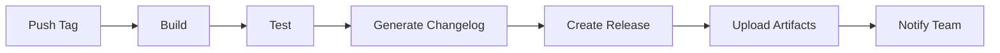

# How to Automate Releases with GitLab CI

Author: [nawazdhandala](https://www.github.com/nawazdhandala)

Tags: GitLab CI, Releases, Automation, Semantic Versioning, CI/CD, DevOps

Description: Learn how to automate releases in GitLab CI with automatic version bumping, changelog generation, artifact publishing, and release notes creation.

---

Manual releases are error-prone and time-consuming. Someone has to remember to update version numbers, write changelog entries, create tags, and upload artifacts. GitLab CI can automate all of this. This guide shows you how to build a release pipeline that handles versioning, changelogs, and artifact publishing automatically.

## GitLab Release Basics

A GitLab release consists of:
- A Git tag marking the commit
- Release notes describing changes
- Optional artifacts attached to the release
- Links to related resources

The `release` keyword in GitLab CI creates releases automatically.

## Simple Release Job

Start with a basic release triggered by tags.

```yaml
stages:
  - build
  - release

build:
  stage: build
  script:
    - npm run build
  artifacts:
    paths:
      - dist/

release:
  stage: release
  image: registry.gitlab.com/gitlab-org/release-cli:latest
  script:
    - echo "Creating release for ${CI_COMMIT_TAG}"
  release:
    tag_name: ${CI_COMMIT_TAG}
    name: 'Release ${CI_COMMIT_TAG}'
    description: 'Release created from pipeline'
  rules:
    - if: $CI_COMMIT_TAG
```

Push a tag to trigger the release:

```bash
git tag v1.0.0
git push origin v1.0.0
```

## Release Flow

Here's the automated release process:



## Semantic Versioning Automation

Automate version bumping based on commit messages.

```yaml
stages:
  - version
  - build
  - release

determine-version:
  stage: version
  image: node:20
  script:
    - npm install -g semantic-release @semantic-release/gitlab
    # Dry run to get next version
    - |
      VERSION=$(npx semantic-release --dry-run 2>&1 | grep -oP 'next release version is \K[0-9]+\.[0-9]+\.[0-9]+' || echo "")
      if [ -z "$VERSION" ]; then
        echo "No release needed"
        echo "SKIP_RELEASE=true" >> version.env
      else
        echo "Next version: ${VERSION}"
        echo "VERSION=${VERSION}" >> version.env
        echo "SKIP_RELEASE=false" >> version.env
      fi
  artifacts:
    reports:
      dotenv: version.env
  rules:
    - if: $CI_COMMIT_BRANCH == "main"

create-release:
  stage: release
  image: node:20
  script:
    - npm install -g semantic-release @semantic-release/gitlab
    - npx semantic-release
  rules:
    - if: $CI_COMMIT_BRANCH == "main" && $SKIP_RELEASE != "true"
  needs:
    - determine-version
```

Configure semantic-release in `.releaserc.json`:

```json
{
  "branches": ["main"],
  "plugins": [
    "@semantic-release/commit-analyzer",
    "@semantic-release/release-notes-generator",
    "@semantic-release/changelog",
    ["@semantic-release/gitlab", {
      "assets": ["dist/**/*"]
    }]
  ]
}
```

## Changelog Generation

Generate changelogs from commit history.

```yaml
generate-changelog:
  stage: prepare
  image: node:20
  script:
    - npm install -g conventional-changelog-cli
    # Generate changelog from commits since last tag
    - conventional-changelog -p angular -i CHANGELOG.md -s -r 1
    # Extract release notes for current version
    - |
      sed -n '/^## \[/,/^## \[/p' CHANGELOG.md | head -n -1 > RELEASE_NOTES.md
  artifacts:
    paths:
      - CHANGELOG.md
      - RELEASE_NOTES.md
  rules:
    - if: $CI_COMMIT_TAG
```

Use the generated notes in your release:

```yaml
release:
  stage: release
  image: registry.gitlab.com/gitlab-org/release-cli:latest
  script:
    - echo "Creating release ${CI_COMMIT_TAG}"
  release:
    tag_name: ${CI_COMMIT_TAG}
    name: 'Release ${CI_COMMIT_TAG}'
    description: './RELEASE_NOTES.md'  # Read from file
  needs:
    - generate-changelog
  rules:
    - if: $CI_COMMIT_TAG
```

## Attaching Assets to Releases

Upload build artifacts to the release.

```yaml
release:
  stage: release
  image: registry.gitlab.com/gitlab-org/release-cli:latest
  script:
    - echo "Releasing ${CI_COMMIT_TAG}"
  release:
    tag_name: ${CI_COMMIT_TAG}
    name: 'Release ${CI_COMMIT_TAG}'
    description: 'Automated release'
    assets:
      links:
        - name: 'Linux Binary'
          url: '${CI_PROJECT_URL}/-/jobs/${BUILD_JOB_ID}/artifacts/raw/dist/app-linux'
          filepath: '/binaries/app-linux'
          link_type: 'package'
        - name: 'macOS Binary'
          url: '${CI_PROJECT_URL}/-/jobs/${BUILD_JOB_ID}/artifacts/raw/dist/app-macos'
          filepath: '/binaries/app-macos'
          link_type: 'package'
        - name: 'Windows Binary'
          url: '${CI_PROJECT_URL}/-/jobs/${BUILD_JOB_ID}/artifacts/raw/dist/app-windows.exe'
          filepath: '/binaries/app-windows.exe'
          link_type: 'package'
```

## Multi-Platform Release Builds

Build for multiple platforms before creating the release.

```yaml
stages:
  - build
  - package
  - release

build:
  stage: build
  parallel:
    matrix:
      - GOOS: [linux, darwin, windows]
        GOARCH: [amd64, arm64]
  script:
    - |
      OUTPUT="app-${GOOS}-${GOARCH}"
      if [ "${GOOS}" = "windows" ]; then
        OUTPUT="${OUTPUT}.exe"
      fi
      GOOS=${GOOS} GOARCH=${GOARCH} go build -o dist/${OUTPUT}
  artifacts:
    paths:
      - dist/

package:
  stage: package
  script:
    # Create checksums
    - cd dist && sha256sum * > checksums.txt
    # Create archives
    - |
      for file in app-*; do
        if [[ "$file" != *.exe ]]; then
          tar -czvf "${file}.tar.gz" "$file"
        else
          zip "${file%.exe}.zip" "$file"
        fi
      done
  artifacts:
    paths:
      - dist/
  rules:
    - if: $CI_COMMIT_TAG

release:
  stage: release
  image: registry.gitlab.com/gitlab-org/release-cli:latest
  script:
    - echo "Releasing ${CI_COMMIT_TAG}"
  release:
    tag_name: ${CI_COMMIT_TAG}
    name: 'Release ${CI_COMMIT_TAG}'
    description: 'Automated release'
    assets:
      links:
        - name: 'Checksums'
          url: '${CI_PROJECT_URL}/-/jobs/${PACKAGE_JOB_ID}/artifacts/file/dist/checksums.txt'
        - name: 'Linux AMD64'
          url: '${CI_PROJECT_URL}/-/jobs/${PACKAGE_JOB_ID}/artifacts/file/dist/app-linux-amd64.tar.gz'
        - name: 'Linux ARM64'
          url: '${CI_PROJECT_URL}/-/jobs/${PACKAGE_JOB_ID}/artifacts/file/dist/app-linux-arm64.tar.gz'
        - name: 'macOS AMD64'
          url: '${CI_PROJECT_URL}/-/jobs/${PACKAGE_JOB_ID}/artifacts/file/dist/app-darwin-amd64.tar.gz'
        - name: 'macOS ARM64'
          url: '${CI_PROJECT_URL}/-/jobs/${PACKAGE_JOB_ID}/artifacts/file/dist/app-darwin-arm64.tar.gz'
        - name: 'Windows AMD64'
          url: '${CI_PROJECT_URL}/-/jobs/${PACKAGE_JOB_ID}/artifacts/file/dist/app-windows-amd64.zip'
  rules:
    - if: $CI_COMMIT_TAG
```

## Publishing to Package Registries

Publish packages alongside the release.

```yaml
stages:
  - build
  - publish
  - release

publish-npm:
  stage: publish
  script:
    - npm config set //registry.npmjs.org/:_authToken=${NPM_TOKEN}
    - npm publish
  rules:
    - if: $CI_COMMIT_TAG

publish-docker:
  stage: publish
  script:
    - docker login -u $CI_REGISTRY_USER -p $CI_REGISTRY_PASSWORD $CI_REGISTRY
    - docker build -t $CI_REGISTRY_IMAGE:$CI_COMMIT_TAG .
    - docker push $CI_REGISTRY_IMAGE:$CI_COMMIT_TAG
    - docker tag $CI_REGISTRY_IMAGE:$CI_COMMIT_TAG $CI_REGISTRY_IMAGE:latest
    - docker push $CI_REGISTRY_IMAGE:latest
  rules:
    - if: $CI_COMMIT_TAG

release:
  stage: release
  image: registry.gitlab.com/gitlab-org/release-cli:latest
  release:
    tag_name: ${CI_COMMIT_TAG}
    name: 'Release ${CI_COMMIT_TAG}'
    description: |
      ## Installation

      ### npm
      ```bash
      npm install my-package@${CI_COMMIT_TAG}
      ```

      ### Docker
      ```bash
      docker pull ${CI_REGISTRY_IMAGE}:${CI_COMMIT_TAG}
      ```
  rules:
    - if: $CI_COMMIT_TAG
  needs:
    - publish-npm
    - publish-docker
```

## Release Branches

Handle release branches for maintenance versions.

```yaml
release:
  stage: release
  image: registry.gitlab.com/gitlab-org/release-cli:latest
  script:
    - echo "Creating release"
  release:
    tag_name: ${CI_COMMIT_TAG}
    name: 'Release ${CI_COMMIT_TAG}'
    description: 'Release from ${CI_COMMIT_REF_NAME}'
    ref: ${CI_COMMIT_SHA}  # Explicit commit reference
  rules:
    # Release tags from main
    - if: $CI_COMMIT_TAG && $CI_COMMIT_BRANCH == "main"
    # Also allow from release branches
    - if: $CI_COMMIT_TAG && $CI_COMMIT_BRANCH =~ /^release\//
```

## Pre-Release Versions

Mark releases as pre-release for testing.

```yaml
release:
  stage: release
  image: registry.gitlab.com/gitlab-org/release-cli:latest
  script:
    # Determine if this is a pre-release
    - |
      if [[ "${CI_COMMIT_TAG}" =~ (alpha|beta|rc) ]]; then
        echo "PRERELEASE=true" >> release.env
      else
        echo "PRERELEASE=false" >> release.env
      fi
  release:
    tag_name: ${CI_COMMIT_TAG}
    name: 'Release ${CI_COMMIT_TAG}'
    description: 'Automated release'
  rules:
    - if: $CI_COMMIT_TAG
```

## Notifications

Notify team members about new releases.

```yaml
notify-release:
  stage: notify
  script:
    # Slack notification
    - |
      curl -X POST -H 'Content-type: application/json' \
        --data "{\"text\":\"New release: ${CI_COMMIT_TAG}\nURL: ${CI_PROJECT_URL}/-/releases/${CI_COMMIT_TAG}\"}" \
        ${SLACK_WEBHOOK_URL}
    # Email via SendGrid
    - |
      curl --request POST \
        --url https://api.sendgrid.com/v3/mail/send \
        --header "Authorization: Bearer ${SENDGRID_API_KEY}" \
        --header "Content-Type: application/json" \
        --data "{\"personalizations\":[{\"to\":[{\"email\":\"team@example.com\"}]}],\"from\":{\"email\":\"releases@example.com\"},\"subject\":\"New Release: ${CI_COMMIT_TAG}\",\"content\":[{\"type\":\"text/plain\",\"value\":\"A new release is available.\"}]}"
  rules:
    - if: $CI_COMMIT_TAG
  needs:
    - release
```

## Complete Release Pipeline

Here's a full production release pipeline:

```yaml
stages:
  - validate
  - build
  - test
  - publish
  - release
  - notify

validate-tag:
  stage: validate
  script:
    # Verify tag follows semver
    - |
      if [[ ! "${CI_COMMIT_TAG}" =~ ^v[0-9]+\.[0-9]+\.[0-9]+(-[a-zA-Z0-9]+)?$ ]]; then
        echo "Invalid tag format. Use semver: v1.2.3 or v1.2.3-rc1"
        exit 1
      fi
  rules:
    - if: $CI_COMMIT_TAG

build:
  stage: build
  script:
    - npm ci
    - npm run build
  artifacts:
    paths:
      - dist/
  rules:
    - if: $CI_COMMIT_TAG

test:
  stage: test
  script:
    - npm test
  rules:
    - if: $CI_COMMIT_TAG

generate-notes:
  stage: publish
  script:
    - npm install -g conventional-changelog-cli
    - conventional-changelog -p angular -r 1 > RELEASE_NOTES.md
  artifacts:
    paths:
      - RELEASE_NOTES.md
  rules:
    - if: $CI_COMMIT_TAG

publish-npm:
  stage: publish
  script:
    - npm publish
  rules:
    - if: $CI_COMMIT_TAG && $CI_COMMIT_TAG !~ /-(alpha|beta|rc)/

release:
  stage: release
  image: registry.gitlab.com/gitlab-org/release-cli:latest
  script:
    - echo "Creating release ${CI_COMMIT_TAG}"
  release:
    tag_name: ${CI_COMMIT_TAG}
    name: 'Release ${CI_COMMIT_TAG}'
    description: './RELEASE_NOTES.md'
  rules:
    - if: $CI_COMMIT_TAG
  needs:
    - build
    - test
    - generate-notes

notify-slack:
  stage: notify
  script:
    - ./scripts/notify-release.sh
  rules:
    - if: $CI_COMMIT_TAG
  needs:
    - release
```

---

Automated releases eliminate manual errors and ensure consistent delivery. Start with simple tag-triggered releases, then add changelog generation and multi-platform builds as your project matures. The key is making releases so easy that they happen frequently, reducing the risk of each individual release.
