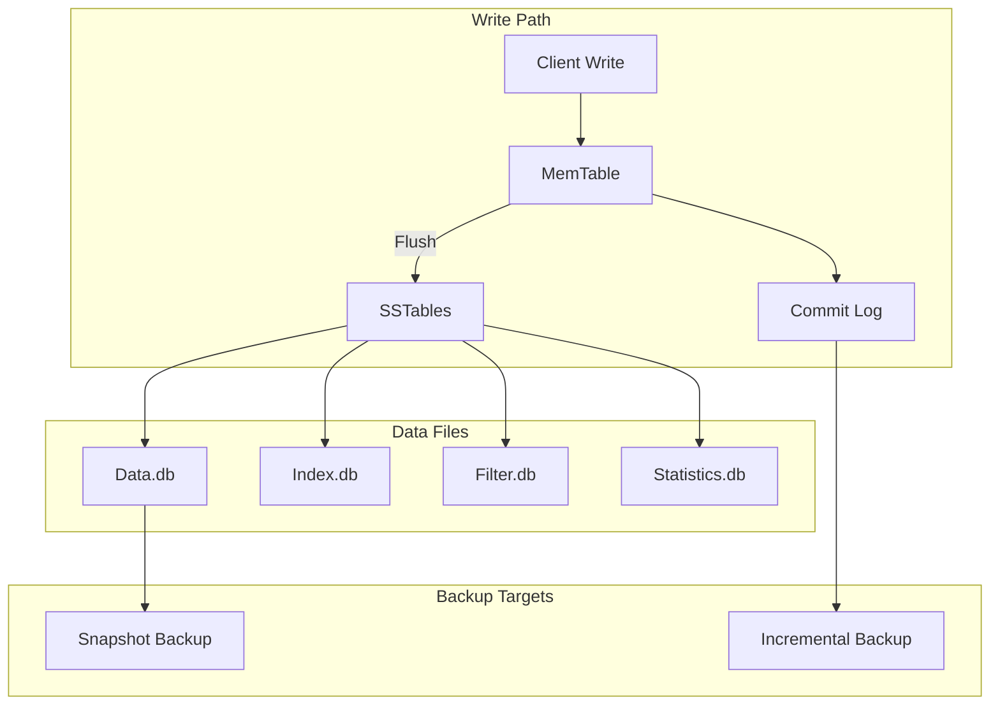
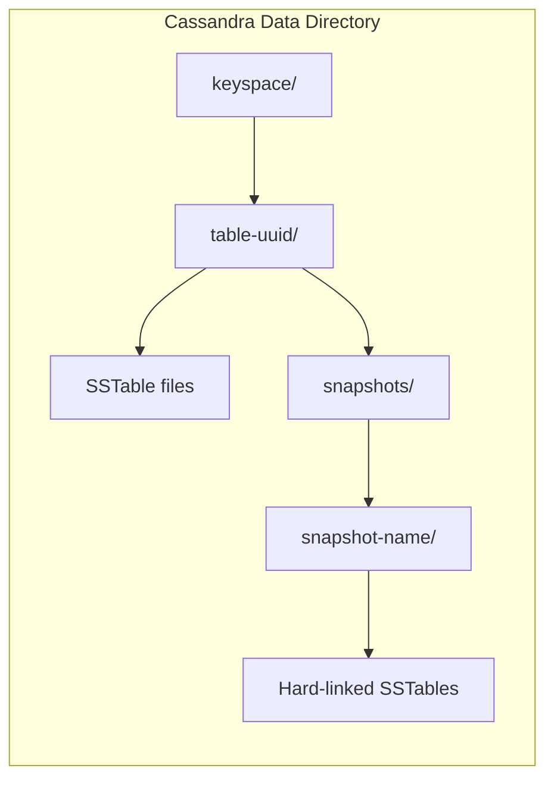
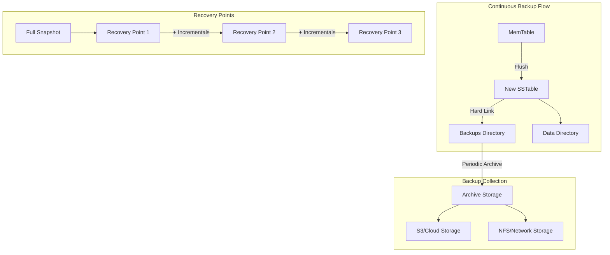
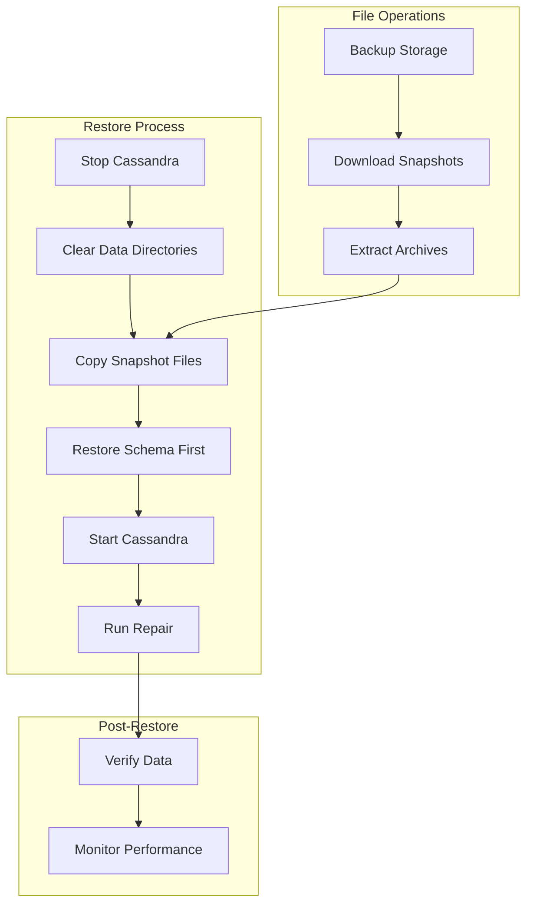
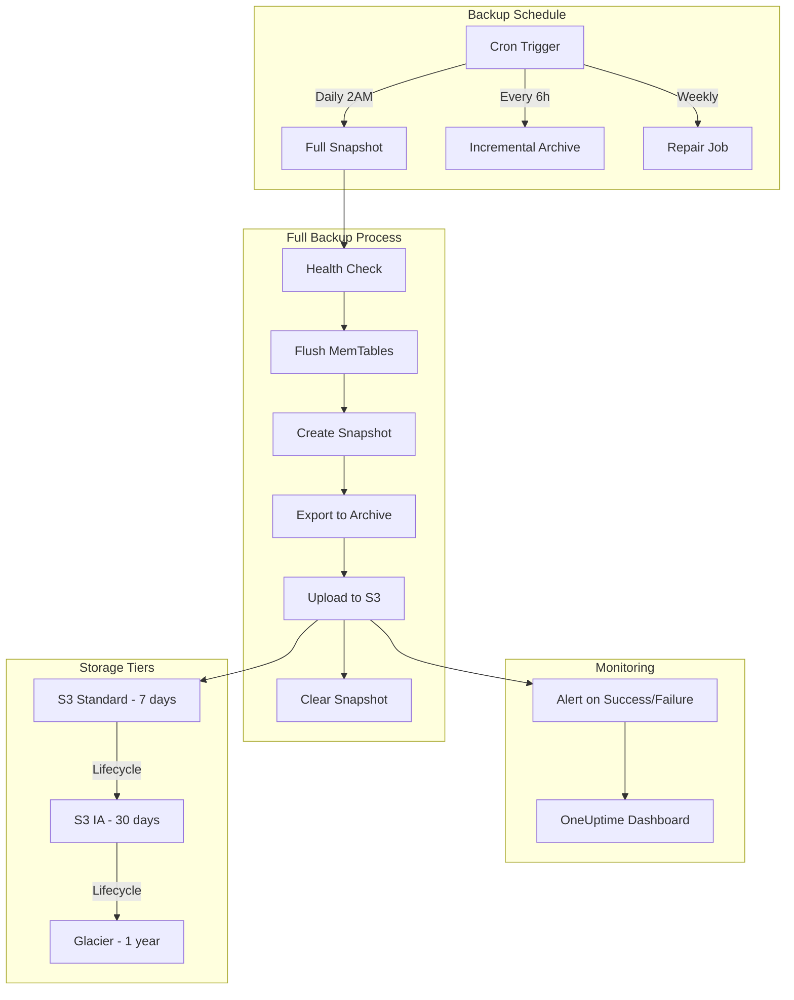
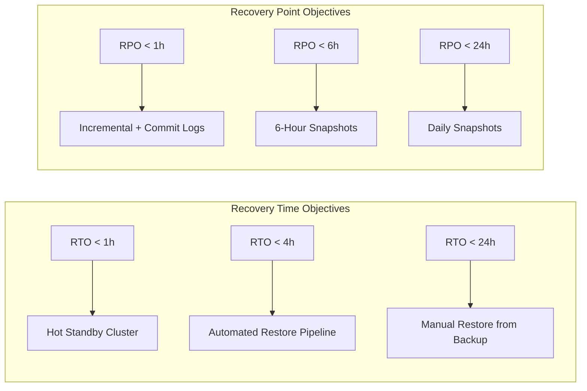

# How to Backup Cassandra Databases

Author: [nawazdhandala](https://www.github.com/nawazdhandala)

Tags: Cassandra, Database, Backup, Disaster Recovery, NoSQL, DevOps, Data Protection

Description: A comprehensive guide to backing up Apache Cassandra databases, covering snapshot-based backups, incremental backups, nodetool operations, restore procedures, and automation strategies for production environments.

---

> **Key Insight**: Cassandra's distributed architecture means backups must be coordinated across all nodes. A backup from a single node is not a complete backup - you need snapshots from every node to restore your entire dataset.

## Understanding Cassandra's Data Model for Backups

Before diving into backup strategies, it is essential to understand how Cassandra stores data. Cassandra uses a log-structured merge-tree (LSM) architecture with multiple components that affect backup strategies.



### Key Components to Back Up

| Component | Location | Purpose |
|-----------|----------|---------|
| SSTables | `/var/lib/cassandra/data/` | Immutable data files |
| Commit Log | `/var/lib/cassandra/commitlog/` | Write-ahead log for durability |
| Schema | System tables | Table definitions and settings |
| Configuration | `/etc/cassandra/` | Cluster settings |

## Snapshot-Based Backups

Snapshots are the primary backup mechanism in Cassandra. They create hard links to SSTable files, making them instant and space-efficient until the original files are compacted away.

### Creating a Snapshot with nodetool

```bash
#!/bin/bash
# create-snapshot.sh
# Creates a named snapshot across all keyspaces on the current node

# Define snapshot name with timestamp for easy identification
SNAPSHOT_NAME="backup-$(date +%Y%m%d-%H%M%S)"

# Create snapshot of all keyspaces
# The -t flag specifies the snapshot tag/name
nodetool snapshot -t "$SNAPSHOT_NAME"

# Verify the snapshot was created successfully
# This lists all snapshots and their sizes
nodetool listsnapshots

echo "Snapshot '$SNAPSHOT_NAME' created successfully"
```

### Snapshot a Specific Keyspace

```bash
#!/bin/bash
# snapshot-keyspace.sh
# Creates a snapshot of a specific keyspace

KEYSPACE="my_application"
SNAPSHOT_NAME="$KEYSPACE-$(date +%Y%m%d-%H%M%S)"

# Create snapshot for a single keyspace
# Use -- to separate the snapshot name from the keyspace name
nodetool snapshot -t "$SNAPSHOT_NAME" -- "$KEYSPACE"

# List snapshots to verify
nodetool listsnapshots | grep "$KEYSPACE"
```

### Snapshot Specific Tables

```bash
#!/bin/bash
# snapshot-tables.sh
# Creates a snapshot of specific tables within a keyspace

KEYSPACE="my_application"
TABLES="users orders transactions"
SNAPSHOT_NAME="critical-tables-$(date +%Y%m%d-%H%M%S)"

# Snapshot multiple specific tables
# The -cf flag specifies column families (tables) to snapshot
nodetool snapshot -t "$SNAPSHOT_NAME" -cf "$TABLES" -- "$KEYSPACE"

echo "Snapshot created for tables: $TABLES"
```

### Understanding Snapshot Storage Location



Snapshots are stored at:
```
/var/lib/cassandra/data/<keyspace>/<table-uuid>/snapshots/<snapshot-name>/
```

### Exporting Snapshots for Offsite Storage

```bash
#!/bin/bash
# export-snapshot.sh
# Compresses and exports a snapshot to external storage

SNAPSHOT_NAME=$1
DATA_DIR="/var/lib/cassandra/data"
BACKUP_DIR="/backup/cassandra"
HOSTNAME=$(hostname)
DATE=$(date +%Y%m%d)

# Validate snapshot name provided
if [ -z "$SNAPSHOT_NAME" ]; then
    echo "Usage: $0 <snapshot-name>"
    exit 1
fi

# Create backup directory structure
mkdir -p "$BACKUP_DIR/$DATE/$HOSTNAME"

# Find and compress all snapshot directories
# We iterate through each keyspace and table to find snapshots
for keyspace_dir in "$DATA_DIR"/*/; do
    keyspace=$(basename "$keyspace_dir")

    # Skip system keyspaces for application backups
    # Include them if you need full cluster recovery
    if [[ "$keyspace" == system* ]]; then
        continue
    fi

    for table_dir in "$keyspace_dir"*/; do
        snapshot_path="$table_dir/snapshots/$SNAPSHOT_NAME"

        if [ -d "$snapshot_path" ]; then
            table=$(basename "$table_dir")

            # Create tar archive preserving directory structure
            # Use gzip for compression to reduce storage requirements
            tar -czf "$BACKUP_DIR/$DATE/$HOSTNAME/${keyspace}_${table}.tar.gz" \
                -C "$table_dir/snapshots" "$SNAPSHOT_NAME"

            echo "Exported: $keyspace.$table"
        fi
    done
done

echo "Snapshot export complete: $BACKUP_DIR/$DATE/$HOSTNAME"
```

## Incremental Backups

Incremental backups capture SSTables as they are flushed from memory, providing point-in-time recovery capability between full snapshots.

### Enabling Incremental Backups

```yaml
# /etc/cassandra/cassandra.yaml
# Enable incremental backups to capture every flushed SSTable

# When enabled, Cassandra hard-links each flushed SSTable to a backup directory
# This happens automatically without any nodetool commands
incremental_backups: true

# Backups are stored in:
# /var/lib/cassandra/data/<keyspace>/<table>/backups/
```

```bash
# Apply the configuration change
# Note: This requires a rolling restart of each node

# On each node, one at a time:
sudo systemctl restart cassandra

# Verify the setting is active
nodetool getconfig incremental_backups
```

### Managing Incremental Backup Files

```bash
#!/bin/bash
# manage-incremental-backups.sh
# Processes and cleans up incremental backup files

DATA_DIR="/var/lib/cassandra/data"
ARCHIVE_DIR="/backup/cassandra/incremental"
RETENTION_DAYS=7

# Process incremental backups for archival
process_incremental_backups() {
    local hostname=$(hostname)
    local date_dir=$(date +%Y%m%d)

    mkdir -p "$ARCHIVE_DIR/$date_dir/$hostname"

    # Find all incremental backup directories
    find "$DATA_DIR" -type d -name "backups" | while read backup_dir; do
        # Extract keyspace and table from path
        # Path format: /var/lib/cassandra/data/<keyspace>/<table>/backups/
        local rel_path=${backup_dir#$DATA_DIR/}
        local keyspace=$(echo "$rel_path" | cut -d'/' -f1)
        local table=$(echo "$rel_path" | cut -d'/' -f2)

        # Skip empty backup directories
        if [ -z "$(ls -A "$backup_dir" 2>/dev/null)" ]; then
            continue
        fi

        # Archive the incremental files
        tar -czf "$ARCHIVE_DIR/$date_dir/$hostname/${keyspace}_${table}_incr.tar.gz" \
            -C "$backup_dir" .

        # Clear processed files to prevent disk space issues
        # Only do this after successful archive
        rm -f "$backup_dir"/*

        echo "Archived incremental backup: $keyspace.$table"
    done
}

# Clean up old archived backups
cleanup_old_backups() {
    find "$ARCHIVE_DIR" -type d -mtime +$RETENTION_DAYS -exec rm -rf {} + 2>/dev/null
    echo "Cleaned up backups older than $RETENTION_DAYS days"
}

# Execute backup processing
process_incremental_backups
cleanup_old_backups
```

### Incremental Backup Architecture



## Using nodetool for Backup Operations

nodetool provides various commands essential for backup management beyond simple snapshot creation.

### Pre-Backup Preparation

```bash
#!/bin/bash
# prepare-backup.sh
# Prepares a Cassandra node for consistent backup

NODE_IP=$(hostname -I | awk '{print $1}')

# Step 1: Check cluster health before backup
# Ensures all nodes are up and no repairs are running
echo "=== Checking cluster status ==="
nodetool status

# Verify no streaming operations are in progress
# Active streams could result in inconsistent backups
nodetool netstats | grep -i "mode"

# Step 2: Flush all memtables to disk
# This ensures all committed data is in SSTables
# Without this, recent writes may not be included in snapshot
echo "=== Flushing memtables ==="
nodetool flush

# Step 3: Run a repair to ensure data consistency (optional but recommended)
# This is time-consuming for large datasets
# Consider running this periodically rather than before every backup
# nodetool repair -pr  # Only repair primary ranges to reduce time

# Step 4: Drain pending writes (for maintenance scenarios)
# Note: This stops accepting writes - use only if taking node offline
# nodetool drain

echo "Node prepared for backup"
```

### Comprehensive nodetool Backup Script

```bash
#!/bin/bash
# full-backup-nodetool.sh
# Complete backup workflow using nodetool commands

set -e  # Exit on any error

SNAPSHOT_NAME="backup-$(date +%Y%m%d-%H%M%S)"
LOG_FILE="/var/log/cassandra/backup-$SNAPSHOT_NAME.log"

log() {
    echo "[$(date '+%Y-%m-%d %H:%M:%S')] $1" | tee -a "$LOG_FILE"
}

# Check if Cassandra is running and accepting commands
check_cassandra_health() {
    log "Checking Cassandra health..."

    # Verify node is up and normal
    if ! nodetool status | grep -q "UN"; then
        log "ERROR: Node not in UN (Up/Normal) state"
        exit 1
    fi

    # Check for compaction backlog
    # Large backlog might indicate disk pressure
    local pending=$(nodetool compactionstats | grep "pending tasks" | awk '{print $3}')
    if [ "$pending" -gt 100 ]; then
        log "WARNING: $pending pending compactions"
    fi

    log "Health check passed"
}

# Flush all data to ensure consistency
flush_data() {
    log "Flushing all keyspaces..."
    nodetool flush

    # Wait for flush to complete
    sleep 5

    # Verify no pending flushes
    while nodetool tpstats | grep -q "FlushWriter.*[1-9]"; do
        log "Waiting for flush to complete..."
        sleep 2
    done

    log "Flush complete"
}

# Create snapshot with verification
create_snapshot() {
    log "Creating snapshot: $SNAPSHOT_NAME"

    # Create the snapshot
    nodetool snapshot -t "$SNAPSHOT_NAME"

    # Verify snapshot exists
    if ! nodetool listsnapshots | grep -q "$SNAPSHOT_NAME"; then
        log "ERROR: Snapshot creation failed"
        exit 1
    fi

    # Log snapshot details
    nodetool listsnapshots | grep "$SNAPSHOT_NAME" >> "$LOG_FILE"

    log "Snapshot created successfully"
}

# Calculate and log backup size
report_backup_size() {
    log "Calculating backup size..."

    local total_size=0
    local data_dir="/var/lib/cassandra/data"

    # Sum up all snapshot sizes
    while IFS= read -r snapshot_dir; do
        local size=$(du -sb "$snapshot_dir" 2>/dev/null | awk '{print $1}')
        total_size=$((total_size + size))
    done < <(find "$data_dir" -type d -name "$SNAPSHOT_NAME")

    # Convert to human-readable format
    local human_size=$(numfmt --to=iec-i --suffix=B $total_size)

    log "Total backup size: $human_size"
}

# Main execution
log "=== Starting Cassandra Backup ==="
check_cassandra_health
flush_data
create_snapshot
report_backup_size
log "=== Backup Complete ==="

echo "Backup completed. Snapshot name: $SNAPSHOT_NAME"
```

### Monitoring Backup Progress

```bash
#!/bin/bash
# monitor-backup.sh
# Monitors ongoing backup and streaming operations

echo "=== Compaction Status ==="
# Shows active compactions that might affect backup consistency
nodetool compactionstats

echo ""
echo "=== Thread Pool Statistics ==="
# Shows pending operations including flushes
nodetool tpstats | head -20

echo ""
echo "=== Network Statistics ==="
# Shows streaming operations (data movement between nodes)
nodetool netstats

echo ""
echo "=== Snapshot Sizes ==="
# Lists all snapshots with their true size on disk
nodetool listsnapshots
```

## Restore Procedures

Restoring Cassandra data requires careful coordination across nodes. The process varies based on whether you are restoring to the same cluster or a new one.

### Restore Architecture



### Restoring from Snapshot - Same Cluster

```bash
#!/bin/bash
# restore-same-cluster.sh
# Restores a snapshot to the same Cassandra cluster

SNAPSHOT_NAME=$1
KEYSPACE=$2
DATA_DIR="/var/lib/cassandra/data"

if [ -z "$SNAPSHOT_NAME" ] || [ -z "$KEYSPACE" ]; then
    echo "Usage: $0 <snapshot-name> <keyspace>"
    exit 1
fi

# Step 1: Verify the snapshot exists
echo "=== Verifying snapshot ==="
if ! nodetool listsnapshots | grep -q "$SNAPSHOT_NAME"; then
    echo "ERROR: Snapshot '$SNAPSHOT_NAME' not found"
    exit 1
fi

# Step 2: Truncate the table (optional - removes existing data)
# WARNING: This deletes current data!
# Uncomment only if you want to replace data completely
# echo "=== Truncating keyspace ==="
# cqlsh -e "TRUNCATE $KEYSPACE.table_name;"

# Step 3: Use sstableloader to restore data
# This method works without stopping Cassandra
echo "=== Restoring data with sstableloader ==="

for table_dir in "$DATA_DIR/$KEYSPACE"/*/; do
    table=$(basename "$table_dir")
    snapshot_path="$table_dir/snapshots/$SNAPSHOT_NAME"

    if [ -d "$snapshot_path" ]; then
        echo "Restoring: $KEYSPACE.$table"

        # sstableloader streams data back into the cluster
        # -d specifies the contact point (any node in the cluster)
        sstableloader \
            -d $(hostname) \
            -u cassandra \
            -pw cassandra \
            "$snapshot_path"

        echo "Restored: $KEYSPACE.$table"
    fi
done

echo "=== Restore complete ==="
echo "Run 'nodetool repair $KEYSPACE' to ensure consistency"
```

### Restoring to a New Cluster

```bash
#!/bin/bash
# restore-new-cluster.sh
# Restores Cassandra data to a fresh cluster from backup archives

BACKUP_ARCHIVE=$1
TARGET_NODE=$2
CASSANDRA_USER="cassandra"
CASSANDRA_PASS="cassandra"

if [ -z "$BACKUP_ARCHIVE" ] || [ -z "$TARGET_NODE" ]; then
    echo "Usage: $0 <backup-archive-dir> <target-node>"
    exit 1
fi

# Step 1: Restore schema first
# The schema must exist before loading data
echo "=== Restoring Schema ==="
if [ -f "$BACKUP_ARCHIVE/schema.cql" ]; then
    cqlsh "$TARGET_NODE" -u "$CASSANDRA_USER" -p "$CASSANDRA_PASS" \
        -f "$BACKUP_ARCHIVE/schema.cql"
    echo "Schema restored successfully"
else
    echo "WARNING: No schema file found. Ensure schema exists on target cluster."
fi

# Step 2: Wait for schema to propagate
echo "Waiting for schema agreement..."
sleep 10

# Step 3: Restore data for each keyspace/table
echo "=== Restoring Data ==="
for archive in "$BACKUP_ARCHIVE"/*.tar.gz; do
    # Extract keyspace and table from filename
    filename=$(basename "$archive")
    keyspace=$(echo "$filename" | cut -d'_' -f1)
    table=$(echo "$filename" | cut -d'_' -f2 | sed 's/.tar.gz//')

    # Create temp directory for extraction
    temp_dir=$(mktemp -d)

    # Extract the archive
    tar -xzf "$archive" -C "$temp_dir"

    # Find the actual SSTable directory
    sstable_dir=$(find "$temp_dir" -type f -name "*.db" -printf "%h\n" | head -1)

    if [ -n "$sstable_dir" ]; then
        echo "Loading: $keyspace.$table"

        # Use sstableloader to stream data to cluster
        # The tool handles token-aware data distribution
        sstableloader \
            -d "$TARGET_NODE" \
            -u "$CASSANDRA_USER" \
            -pw "$CASSANDRA_PASS" \
            --no-progress \
            "$sstable_dir"
    fi

    # Cleanup temp directory
    rm -rf "$temp_dir"
done

echo "=== Data Restore Complete ==="
echo "Running repair to ensure consistency..."

# Step 4: Run repair on all keyspaces
nodetool repair -pr
```

### Point-in-Time Recovery with Commit Logs

```bash
#!/bin/bash
# point-in-time-recovery.sh
# Restores to a specific point in time using snapshots and commit logs

SNAPSHOT_NAME=$1
COMMITLOG_DIR=$2
RECOVERY_TIME=$3  # Format: "2024-01-15 14:30:00"
DATA_DIR="/var/lib/cassandra/data"
COMMITLOG_ARCHIVE="/var/lib/cassandra/commitlog_archive"

if [ -z "$SNAPSHOT_NAME" ] || [ -z "$COMMITLOG_DIR" ]; then
    echo "Usage: $0 <snapshot-name> <commitlog-backup-dir> [recovery-time]"
    exit 1
fi

echo "=== Point-in-Time Recovery ==="
echo "Snapshot: $SNAPSHOT_NAME"
echo "Commit logs: $COMMITLOG_DIR"
echo "Recovery time: ${RECOVERY_TIME:-'Latest'}"

# Step 1: Stop Cassandra
echo "Stopping Cassandra..."
sudo systemctl stop cassandra

# Step 2: Clear existing data
echo "Clearing current data..."
rm -rf "$DATA_DIR"/*
rm -rf /var/lib/cassandra/commitlog/*
rm -rf /var/lib/cassandra/saved_caches/*

# Step 3: Restore snapshot data
echo "Restoring snapshot data..."
# This would be your snapshot restore logic
# Copy snapshot files to appropriate table directories

# Step 4: Restore commit logs for replay
echo "Restoring commit logs..."
mkdir -p "$COMMITLOG_ARCHIVE"
cp "$COMMITLOG_DIR"/* "$COMMITLOG_ARCHIVE/"

# Step 5: Configure commit log replay settings
# Edit cassandra.yaml to set commitlog_archiving if using time-based recovery
if [ -n "$RECOVERY_TIME" ]; then
    echo "Configuring time-based recovery..."
    # Set restore point in commitlog_archiving.properties
    cat > /etc/cassandra/commitlog_archiving.properties << EOF
restore_command=cp -f %from %to
restore_directories=$COMMITLOG_ARCHIVE
restore_point_in_time=$RECOVERY_TIME
EOF
fi

# Step 6: Start Cassandra - it will replay commit logs
echo "Starting Cassandra with commit log replay..."
sudo systemctl start cassandra

# Wait for Cassandra to start
sleep 30

# Verify cluster status
nodetool status

echo "=== Point-in-Time Recovery Complete ==="
```

## Backup Automation Strategies

Automating backups ensures consistent protection without manual intervention. Here are several approaches for different environments.

### Cron-Based Automation

```bash
#!/bin/bash
# /usr/local/bin/cassandra-backup-cron.sh
# Automated backup script for cron scheduling

set -e

# Configuration
BACKUP_BASE="/backup/cassandra"
RETENTION_DAYS=7
S3_BUCKET="s3://my-cassandra-backups"
HOSTNAME=$(hostname)
DATE=$(date +%Y%m%d-%H%M%S)
SNAPSHOT_NAME="auto-$DATE"
LOG_FILE="/var/log/cassandra/backup-$DATE.log"

# Logging function
log() {
    echo "[$(date '+%Y-%m-%d %H:%M:%S')] $1" | tee -a "$LOG_FILE"
}

# Send alert on failure
send_alert() {
    local message=$1
    # Integrate with your alerting system
    # Example: Send to OneUptime webhook
    curl -s -X POST "https://oneuptime.com/api/webhook/backup-alert" \
        -H "Content-Type: application/json" \
        -d "{\"message\": \"$message\", \"host\": \"$HOSTNAME\"}" || true
}

# Cleanup old local backups
cleanup_local() {
    log "Cleaning up local backups older than $RETENTION_DAYS days..."
    find "$BACKUP_BASE" -type d -mtime +$RETENTION_DAYS -exec rm -rf {} + 2>/dev/null || true
}

# Upload to cloud storage
upload_to_cloud() {
    local backup_dir=$1
    log "Uploading to cloud storage..."

    aws s3 sync "$backup_dir" "$S3_BUCKET/$HOSTNAME/$DATE/" \
        --storage-class STANDARD_IA \
        --only-show-errors

    log "Upload complete"
}

# Main backup process
main() {
    log "=== Starting Automated Cassandra Backup ==="

    # Pre-backup health check
    if ! nodetool status | grep -q "^UN"; then
        send_alert "Backup skipped: Node not healthy"
        exit 1
    fi

    # Flush memtables
    log "Flushing memtables..."
    nodetool flush

    # Create snapshot
    log "Creating snapshot: $SNAPSHOT_NAME"
    nodetool snapshot -t "$SNAPSHOT_NAME"

    # Export snapshot
    local export_dir="$BACKUP_BASE/$DATE"
    mkdir -p "$export_dir"

    log "Exporting snapshot..."
    /usr/local/bin/export-snapshot.sh "$SNAPSHOT_NAME" "$export_dir"

    # Export schema
    log "Exporting schema..."
    cqlsh localhost -e "DESC SCHEMA" > "$export_dir/schema.cql"

    # Upload to cloud
    upload_to_cloud "$export_dir"

    # Clear snapshot from Cassandra
    log "Clearing local snapshot..."
    nodetool clearsnapshot -t "$SNAPSHOT_NAME"

    # Cleanup old backups
    cleanup_local

    log "=== Backup Complete ==="
}

# Execute with error handling
if ! main; then
    send_alert "Cassandra backup failed on $HOSTNAME"
    exit 1
fi
```

### Crontab Configuration

```bash
# /etc/cron.d/cassandra-backup
# Cassandra backup schedule

# Full snapshot backup daily at 2 AM
0 2 * * * root /usr/local/bin/cassandra-backup-cron.sh >> /var/log/cassandra/backup-cron.log 2>&1

# Process incremental backups every 6 hours
0 */6 * * * root /usr/local/bin/manage-incremental-backups.sh >> /var/log/cassandra/incremental-cron.log 2>&1

# Weekly full repair (Sunday at 4 AM)
0 4 * * 0 root nodetool repair -pr >> /var/log/cassandra/repair-cron.log 2>&1
```

### Kubernetes CronJob for Cassandra Backup

```yaml
# cassandra-backup-cronjob.yaml
# Kubernetes CronJob for backing up Cassandra StatefulSet
apiVersion: batch/v1
kind: CronJob
metadata:
  name: cassandra-backup
  namespace: database
spec:
  # Run daily at 3 AM UTC
  schedule: "0 3 * * *"
  # Keep job history
  successfulJobsHistoryLimit: 3
  failedJobsHistoryLimit: 3
  # Don't run concurrent backups
  concurrencyPolicy: Forbid
  jobTemplate:
    spec:
      # Retry once on failure
      backoffLimit: 1
      template:
        spec:
          # Run on same node as Cassandra pod
          affinity:
            podAffinity:
              requiredDuringSchedulingIgnoredDuringExecution:
                - labelSelector:
                    matchLabels:
                      app: cassandra
                  topologyKey: kubernetes.io/hostname
          containers:
            - name: backup
              image: cassandra:4.1
              env:
                - name: CASSANDRA_HOST
                  value: "cassandra-0.cassandra.database.svc.cluster.local"
                - name: AWS_ACCESS_KEY_ID
                  valueFrom:
                    secretKeyRef:
                      name: aws-credentials
                      key: access-key
                - name: AWS_SECRET_ACCESS_KEY
                  valueFrom:
                    secretKeyRef:
                      name: aws-credentials
                      key: secret-key
              command:
                - /bin/bash
                - -c
                - |
                  set -e

                  SNAPSHOT_NAME="k8s-backup-$(date +%Y%m%d-%H%M%S)"

                  # Create snapshot on all Cassandra nodes
                  # Iterate through StatefulSet replicas
                  for i in 0 1 2; do
                    HOST="cassandra-$i.cassandra.database.svc.cluster.local"
                    echo "Creating snapshot on $HOST..."

                    # Use nodetool to create snapshot
                    nodetool -h $HOST snapshot -t $SNAPSHOT_NAME
                  done

                  echo "Snapshots created: $SNAPSHOT_NAME"

                  # Export and upload would go here
                  # Using shared volume or S3 client
              volumeMounts:
                - name: cassandra-data
                  mountPath: /var/lib/cassandra
                  readOnly: true
          volumes:
            - name: cassandra-data
              persistentVolumeClaim:
                claimName: cassandra-data-cassandra-0
          restartPolicy: OnFailure
```

### Multi-Node Backup Coordination

```bash
#!/bin/bash
# cluster-backup.sh
# Coordinates backup across all Cassandra nodes in the cluster

# Configuration
NODES="cass-node1.example.com cass-node2.example.com cass-node3.example.com"
SSH_USER="cassandra-admin"
SNAPSHOT_NAME="cluster-backup-$(date +%Y%m%d-%H%M%S)"
BACKUP_CENTRAL="/backup/cassandra/cluster"
LOG_FILE="/var/log/cassandra/cluster-backup-$(date +%Y%m%d).log"

log() {
    echo "[$(date '+%Y-%m-%d %H:%M:%S')] $1" | tee -a "$LOG_FILE"
}

# Execute command on remote node
remote_exec() {
    local node=$1
    local command=$2
    ssh -o StrictHostKeyChecking=no "$SSH_USER@$node" "$command"
}

# Create snapshot on all nodes
create_snapshots() {
    log "Creating snapshots on all nodes..."

    local pids=()
    for node in $NODES; do
        log "Starting snapshot on $node..."
        remote_exec "$node" "nodetool flush && nodetool snapshot -t $SNAPSHOT_NAME" &
        pids+=($!)
    done

    # Wait for all snapshots to complete
    for pid in "${pids[@]}"; do
        wait $pid
        if [ $? -ne 0 ]; then
            log "ERROR: Snapshot failed on at least one node"
            return 1
        fi
    done

    log "All snapshots created successfully"
}

# Export snapshots from all nodes
export_snapshots() {
    log "Exporting snapshots from all nodes..."

    mkdir -p "$BACKUP_CENTRAL/$SNAPSHOT_NAME"

    for node in $NODES; do
        log "Exporting from $node..."

        local node_backup_dir="$BACKUP_CENTRAL/$SNAPSHOT_NAME/$node"
        mkdir -p "$node_backup_dir"

        # Copy snapshot data
        rsync -avz --progress \
            "$SSH_USER@$node:/var/lib/cassandra/data/*/snapshots/$SNAPSHOT_NAME/" \
            "$node_backup_dir/"

        # Export schema from this node (only need once, but good for verification)
        remote_exec "$node" "cqlsh localhost -e 'DESC SCHEMA'" > "$node_backup_dir/schema.cql"
    done

    log "Export complete"
}

# Cleanup snapshots on all nodes
cleanup_snapshots() {
    log "Cleaning up snapshots on all nodes..."

    for node in $NODES; do
        remote_exec "$node" "nodetool clearsnapshot -t $SNAPSHOT_NAME"
    done

    log "Cleanup complete"
}

# Main execution
main() {
    log "=== Starting Cluster-Wide Backup ==="
    log "Snapshot name: $SNAPSHOT_NAME"
    log "Nodes: $NODES"

    create_snapshots || exit 1
    export_snapshots || exit 1
    cleanup_snapshots

    # Calculate total backup size
    local total_size=$(du -sh "$BACKUP_CENTRAL/$SNAPSHOT_NAME" | awk '{print $1}')
    log "Total backup size: $total_size"

    log "=== Cluster Backup Complete ==="
}

main
```

### Backup Workflow Diagram



## Backup Verification and Testing

Regular backup testing is crucial. An untested backup is not a backup.

```bash
#!/bin/bash
# verify-backup.sh
# Verifies backup integrity and performs test restore

BACKUP_ARCHIVE=$1
TEST_KEYSPACE="backup_test_$(date +%s)"

if [ -z "$BACKUP_ARCHIVE" ]; then
    echo "Usage: $0 <backup-archive>"
    exit 1
fi

echo "=== Backup Verification ==="

# Step 1: Verify archive integrity
echo "Checking archive integrity..."
if ! tar -tzf "$BACKUP_ARCHIVE" > /dev/null 2>&1; then
    echo "ERROR: Archive is corrupted"
    exit 1
fi
echo "Archive integrity: OK"

# Step 2: Check for required files
echo "Checking required files..."
required_files=("schema.cql" "*.db")
for pattern in "${required_files[@]}"; do
    if ! tar -tzf "$BACKUP_ARCHIVE" | grep -q "$pattern"; then
        echo "WARNING: Pattern '$pattern' not found in archive"
    fi
done

# Step 3: Test restore to temporary keyspace
echo "Performing test restore..."

# Create test keyspace
cqlsh -e "CREATE KEYSPACE IF NOT EXISTS $TEST_KEYSPACE
    WITH replication = {'class': 'SimpleStrategy', 'replication_factor': 1};"

# Extract and load a sample table
temp_dir=$(mktemp -d)
tar -xzf "$BACKUP_ARCHIVE" -C "$temp_dir"

# Verify data can be loaded
if ls "$temp_dir"/*/*.db > /dev/null 2>&1; then
    echo "SSTable files found and extractable: OK"
else
    echo "ERROR: No SSTable files found"
    exit 1
fi

# Cleanup test keyspace
cqlsh -e "DROP KEYSPACE IF EXISTS $TEST_KEYSPACE;"
rm -rf "$temp_dir"

echo "=== Verification Complete: Backup is valid ==="
```

## Best Practices Summary

### Backup Strategy Checklist

1. **Frequency**: Take full snapshots daily; process incremental backups every 4-6 hours
2. **Retention**: Keep daily backups for 7 days, weekly for 4 weeks, monthly for 12 months
3. **Location**: Store backups in a different region/data center than production
4. **Encryption**: Encrypt backups at rest and in transit
5. **Testing**: Test restore procedures monthly
6. **Monitoring**: Alert immediately on backup failures
7. **Documentation**: Maintain runbooks for restore procedures

### What to Back Up

| Component | Priority | Frequency |
|-----------|----------|-----------|
| SSTable snapshots | Critical | Daily |
| Incremental backups | High | Every 4-6 hours |
| Schema definitions | Critical | With every snapshot |
| Cassandra configuration | High | On change |
| Commit logs | Medium | If point-in-time recovery needed |

### Common Pitfalls to Avoid

1. **Single-node backups**: Always back up ALL nodes for complete data
2. **Forgetting schema**: Data without schema is unusable
3. **No verification**: Test restores regularly
4. **Ignoring repair**: Run repairs to ensure backup consistency
5. **Insufficient retention**: Keep enough history for compliance needs
6. **No monitoring**: Undetected backup failures are worse than no backups

### Disaster Recovery Planning



---

A robust backup strategy is your insurance against data loss. Cassandra's distributed nature requires coordinated backups across all nodes, but the same architecture that provides high availability also enables non-disruptive backup operations. Implement automated backups, test them regularly, and integrate monitoring with [OneUptime](https://oneuptime.com) to ensure your backup jobs never silently fail. Your future self will thank you when disaster strikes and recovery is just a restore away.
