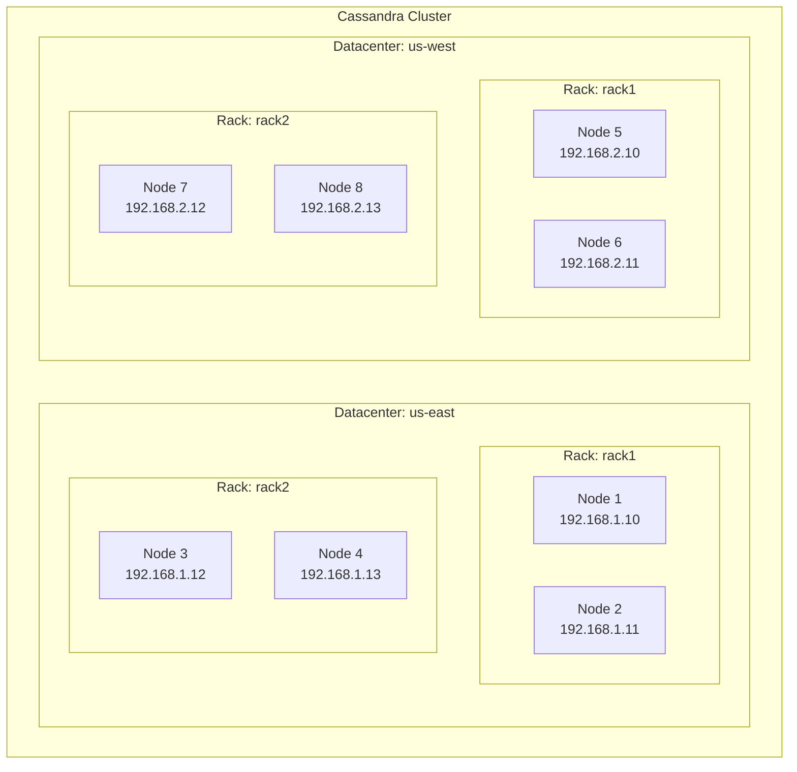
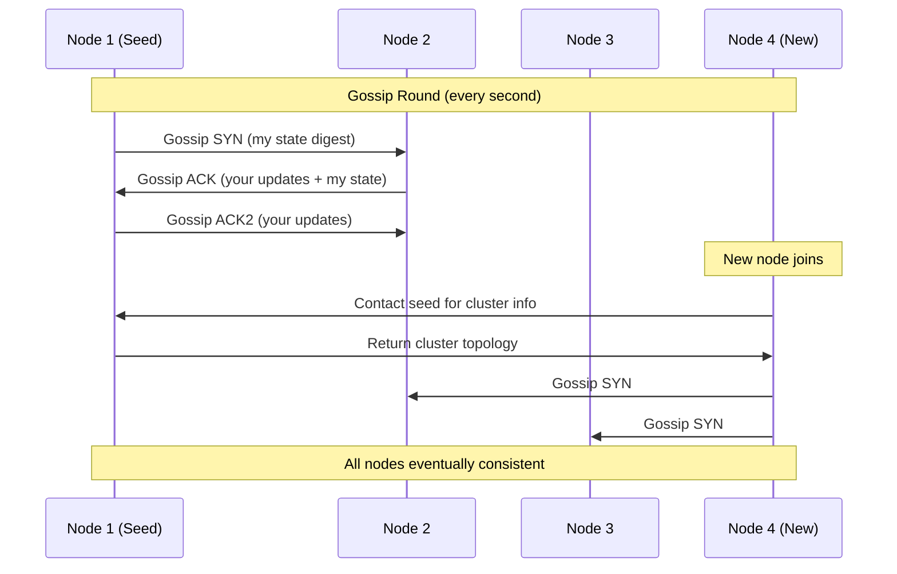
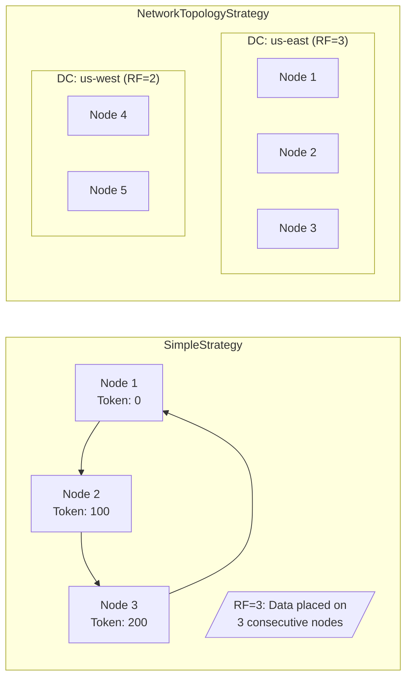
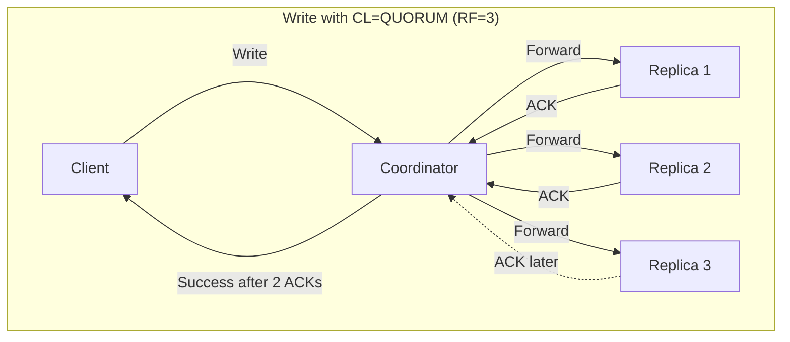

# How to Configure a Cassandra Cluster

Author: [nawazdhandala](https://github.com/nawazdhandala)

Tags: Cassandra, Database, Distributed Systems, NoSQL, High Availability, DevOps, Cluster Configuration

Description: A comprehensive guide to configuring Apache Cassandra clusters, covering cluster topology design, cassandra.yaml configuration, seed nodes, gossip protocol, replication strategies, and consistency levels for production deployments.

---

> **Key Insight:** Cassandra's power lies in its masterless architecture. Every node can handle reads and writes, but this flexibility demands careful configuration of replication, consistency, and gossip settings to achieve the balance between availability and data integrity your application requires.

Apache Cassandra is a distributed NoSQL database designed for high availability and linear scalability. Unlike traditional databases with primary-replica architectures, Cassandra uses a peer-to-peer model where every node is equal. This guide walks you through configuring a production-ready Cassandra cluster from the ground up.

## Cluster Topology Design

Before touching configuration files, you need to understand how Cassandra organizes nodes. The hierarchy flows from **cluster** to **datacenter** to **rack** to **node**.



Key topology decisions:

- **Datacenter:** Physical or logical grouping of nodes. Use separate datacenters for geographic distribution or to isolate workloads (OLTP vs. analytics).
- **Rack:** Represents a failure domain. Cassandra will not place replicas on the same rack if possible.
- **Node:** A single Cassandra instance. Plan for 1-2 TB of data per node for optimal performance.

```yaml
# Example: GossipingPropertyFileSnitch configuration
# Located at /etc/cassandra/cassandra-rackdc.properties

# Define the datacenter and rack for this node
dc=us-east
rack=rack1

# Optional: prefer local datacenter for reads
# prefer_local=true
```

## cassandra.yaml Configuration

The `cassandra.yaml` file is the heart of Cassandra configuration. Here are the critical settings for a production cluster.

```yaml
# /etc/cassandra/cassandra.yaml

# -----------------------------------------------------------------
# CLUSTER IDENTIFICATION
# -----------------------------------------------------------------
# All nodes in the cluster must share the same cluster_name
cluster_name: 'production-cluster'

# Number of tokens per node. Higher values = better load distribution
# Use 256 for clusters with varying node capacities
# Use 16 for vnodes with uniform hardware (Cassandra 4.0+)
num_tokens: 16

# -----------------------------------------------------------------
# NETWORK CONFIGURATION
# -----------------------------------------------------------------
# Address to bind for intra-cluster communication
# Use the node's private IP, not 0.0.0.0
listen_address: 192.168.1.10

# Address for client connections (CQL)
# Can differ from listen_address for security
rpc_address: 192.168.1.10

# Port configurations
storage_port: 7000           # Inter-node communication
ssl_storage_port: 7001       # Encrypted inter-node communication
native_transport_port: 9042  # CQL client connections

# -----------------------------------------------------------------
# SEED NODE CONFIGURATION
# -----------------------------------------------------------------
seed_provider:
  - class_name: org.apache.cassandra.locator.SimpleSeedProvider
    parameters:
      # List 2-3 seed nodes per datacenter
      # Do NOT list all nodes as seeds
      - seeds: "192.168.1.10,192.168.1.11,192.168.2.10"

# -----------------------------------------------------------------
# SNITCH CONFIGURATION
# -----------------------------------------------------------------
# GossipingPropertyFileSnitch reads from cassandra-rackdc.properties
# Preferred for production multi-datacenter deployments
endpoint_snitch: GossipingPropertyFileSnitch

# -----------------------------------------------------------------
# DATA DIRECTORIES
# -----------------------------------------------------------------
# Separate disks for data, commitlog, and hints improves performance
data_file_directories:
  - /var/lib/cassandra/data

commitlog_directory: /var/lib/cassandra/commitlog
saved_caches_directory: /var/lib/cassandra/saved_caches
hints_directory: /var/lib/cassandra/hints

# -----------------------------------------------------------------
# MEMORY AND PERFORMANCE
# -----------------------------------------------------------------
# Commitlog sync mode: periodic (better throughput) or batch (better durability)
commitlog_sync: periodic
commitlog_sync_period_in_ms: 10000

# Total commitlog space in MB
commitlog_total_space_in_mb: 8192

# Concurrent reads/writes - tune based on CPU cores
concurrent_reads: 32
concurrent_writes: 32
concurrent_counter_writes: 32

# Memtable flush settings
memtable_flush_writers: 4

# -----------------------------------------------------------------
# COMPACTION
# -----------------------------------------------------------------
# Choose based on workload:
# - SizeTieredCompactionStrategy: Write-heavy, time-series
# - LeveledCompactionStrategy: Read-heavy, consistent latency
# - TimeWindowCompactionStrategy: Time-series with TTL
compaction_throughput_mb_per_sec: 64

# -----------------------------------------------------------------
# TIMEOUTS
# -----------------------------------------------------------------
read_request_timeout_in_ms: 5000
write_request_timeout_in_ms: 2000
counter_write_request_timeout_in_ms: 5000
request_timeout_in_ms: 10000

# -----------------------------------------------------------------
# HINTED HANDOFF
# -----------------------------------------------------------------
# Store hints for unavailable nodes
hinted_handoff_enabled: true
max_hint_window_in_ms: 10800000  # 3 hours
hints_flush_period_in_ms: 10000
max_hints_file_size_in_mb: 128
```

## Seed Nodes and Gossip Protocol

Cassandra uses a peer-to-peer gossip protocol for cluster communication. Understanding this is critical for proper configuration.



### Gossip Protocol Details

```yaml
# Gossip-related settings in cassandra.yaml

# -----------------------------------------------------------------
# FAILURE DETECTION
# -----------------------------------------------------------------
# Phi Accrual Failure Detector threshold
# Higher values = more tolerant of network latency
# Lower values = faster failure detection
phi_convict_threshold: 8

# -----------------------------------------------------------------
# GOSSIP INTERNALS
# -----------------------------------------------------------------
# These are typically not modified but good to understand

# Gossip runs every second by default
# Each round, a node contacts:
# 1. One random live node
# 2. One random unreachable node (if any)
# 3. A seed node (probabilistically)
```

### Seed Node Best Practices

```bash
#!/bin/bash
# Script to verify seed node connectivity

# seed_check.sh - Run on each node before cluster formation

SEEDS="192.168.1.10 192.168.1.11 192.168.2.10"
GOSSIP_PORT=7000

echo "Checking connectivity to seed nodes..."

for seed in $SEEDS; do
    # Check if seed is reachable on gossip port
    if nc -zv -w 5 "$seed" $GOSSIP_PORT 2>&1 | grep -q "succeeded"; then
        echo "[OK] Seed $seed:$GOSSIP_PORT is reachable"
    else
        echo "[FAIL] Cannot reach seed $seed:$GOSSIP_PORT"
    fi
done

# Verify DNS resolution if using hostnames
echo ""
echo "Verifying hostname resolution..."
for seed in $SEEDS; do
    if host "$seed" > /dev/null 2>&1; then
        resolved=$(host "$seed" | awk '/has address/ {print $4}')
        echo "[OK] $seed resolves to $resolved"
    else
        echo "[INFO] $seed is an IP address or DNS lookup failed"
    fi
done
```

**Seed node rules:**

1. Choose 2-3 nodes per datacenter as seeds
2. Seeds should be stable, long-running nodes
3. Never make all nodes seeds (defeats the protocol's efficiency)
4. Ensure seeds are reachable from all other nodes

## Replication Strategies

Replication determines how many copies of your data exist and where they are placed.



### Creating Keyspaces with Replication

```cql
-- Simple replication (single datacenter only)
-- Not recommended for production multi-DC deployments
CREATE KEYSPACE simple_example
WITH replication = {
    'class': 'SimpleStrategy',
    'replication_factor': 3
};

-- NetworkTopologyStrategy (recommended for production)
-- Specify replication factor per datacenter
CREATE KEYSPACE production_keyspace
WITH replication = {
    'class': 'NetworkTopologyStrategy',
    'us-east': 3,    -- 3 replicas in us-east datacenter
    'us-west': 3     -- 3 replicas in us-west datacenter
}
AND durable_writes = true;

-- Analytics keyspace with lower replication (cost optimization)
CREATE KEYSPACE analytics_keyspace
WITH replication = {
    'class': 'NetworkTopologyStrategy',
    'us-east': 2,
    'us-west': 1     -- Single replica for DR, not serving reads
};

-- Alter existing keyspace replication
ALTER KEYSPACE existing_keyspace
WITH replication = {
    'class': 'NetworkTopologyStrategy',
    'us-east': 3,
    'us-west': 3
};

-- After changing replication, run repair to sync data
-- nodetool repair -full existing_keyspace
```

### Replication Factor Guidelines

```python
# replication_calculator.py
# Helper to determine optimal replication factor

def calculate_replication(
    nodes_per_dc: int,
    availability_requirement: float,  # e.g., 0.999 for 99.9%
    node_failure_rate: float = 0.02   # 2% typical for commodity hardware
) -> dict:
    """
    Calculate recommended replication factor based on availability requirements.

    Args:
        nodes_per_dc: Number of nodes in the datacenter
        availability_requirement: Target availability (0.0 to 1.0)
        node_failure_rate: Expected node failure rate

    Returns:
        Dictionary with recommendations
    """
    import math

    recommendations = {}

    # Calculate availability for different RF values
    for rf in range(1, min(nodes_per_dc + 1, 6)):
        # Probability that all replicas fail simultaneously
        # (simplified model assuming independent failures)
        failure_prob = node_failure_rate ** rf
        availability = 1 - failure_prob

        recommendations[rf] = {
            'replication_factor': rf,
            'theoretical_availability': f"{availability * 100:.6f}%",
            'meets_requirement': availability >= availability_requirement,
            'storage_overhead': f"{rf}x",
            'min_nodes_required': rf
        }

    # Find minimum RF that meets requirement
    min_rf = next(
        (rf for rf, data in recommendations.items() if data['meets_requirement']),
        nodes_per_dc
    )

    return {
        'recommended_rf': min_rf,
        'analysis': recommendations,
        'notes': [
            f"RF={min_rf} provides {recommendations[min_rf]['theoretical_availability']} availability",
            "Always use odd RF values for better quorum calculations",
            "RF should not exceed nodes in smallest datacenter"
        ]
    }

# Example usage
if __name__ == "__main__":
    result = calculate_replication(
        nodes_per_dc=6,
        availability_requirement=0.9999  # 99.99% uptime
    )
    print(f"Recommended RF: {result['recommended_rf']}")
    for note in result['notes']:
        print(f"  - {note}")
```

## Consistency Levels

Consistency levels determine how many replicas must respond before a query succeeds. This is the core of Cassandra's tunable consistency.



### Consistency Level Reference

```python
# consistency_levels.py
# Reference for Cassandra consistency levels

from enum import Enum
from dataclasses import dataclass
from typing import Optional

class ConsistencyLevel(Enum):
    """
    Cassandra Consistency Levels

    Choose based on your CAP theorem requirements:
    - Strong consistency: Use QUORUM or higher
    - High availability: Use ONE or LOCAL_ONE
    - Balance: Use LOCAL_QUORUM for multi-DC
    """

    # -------------------------------------------------------------------------
    # SINGLE DATACENTER LEVELS
    # -------------------------------------------------------------------------

    ANY = "ANY"
    # Writes: Succeeds if ANY node (including hints) acknowledges
    # Reads: Not supported
    # Use case: Fire-and-forget logging where durability is less critical

    ONE = "ONE"
    # Writes/Reads: Requires 1 replica to respond
    # Use case: High-throughput, eventual consistency acceptable

    TWO = "TWO"
    # Writes/Reads: Requires 2 replicas to respond
    # Use case: Slightly better consistency than ONE

    THREE = "THREE"
    # Writes/Reads: Requires 3 replicas to respond
    # Use case: When you need exactly 3 confirmations

    QUORUM = "QUORUM"
    # Writes/Reads: Requires (RF/2) + 1 replicas across ALL datacenters
    # Use case: Strong consistency in single-DC or when cross-DC consistency needed
    # Formula: QUORUM = floor(sum_of_all_RF / 2) + 1

    ALL = "ALL"
    # Writes/Reads: ALL replicas must respond
    # Use case: Maximum consistency, but any node failure blocks operations

    # -------------------------------------------------------------------------
    # MULTI-DATACENTER LEVELS
    # -------------------------------------------------------------------------

    LOCAL_ONE = "LOCAL_ONE"
    # Writes/Reads: 1 replica in the LOCAL datacenter
    # Use case: Fast local reads, cross-DC replication is async

    LOCAL_QUORUM = "LOCAL_QUORUM"
    # Writes/Reads: Quorum of replicas in LOCAL datacenter only
    # Use case: Strong local consistency without cross-DC latency
    # Formula: LOCAL_QUORUM = floor(local_RF / 2) + 1

    EACH_QUORUM = "EACH_QUORUM"
    # Writes: Quorum in EACH datacenter (writes only)
    # Reads: Not supported
    # Use case: Ensure data is durably written to all DCs

    LOCAL_SERIAL = "LOCAL_SERIAL"
    # For lightweight transactions (LWT) in local DC only
    # Use case: Compare-and-set operations with local scope

    SERIAL = "SERIAL"
    # For lightweight transactions across all DCs
    # Use case: Global compare-and-set operations


@dataclass
class ConsistencyCalculator:
    """Calculate required responses for different consistency levels."""

    replication_factor: int
    datacenters: int = 1
    local_rf: Optional[int] = None

    def __post_init__(self):
        if self.local_rf is None:
            self.local_rf = self.replication_factor

    def quorum(self) -> int:
        """Calculate global QUORUM requirement."""
        total_rf = self.replication_factor * self.datacenters
        return (total_rf // 2) + 1

    def local_quorum(self) -> int:
        """Calculate LOCAL_QUORUM requirement."""
        return (self.local_rf // 2) + 1

    def is_strongly_consistent(self, read_cl: str, write_cl: str) -> bool:
        """
        Check if read + write CLs guarantee strong consistency.

        Strong consistency requires: R + W > RF
        Where R = read replicas, W = write replicas, RF = replication factor
        """
        cl_to_replicas = {
            'ONE': 1,
            'TWO': 2,
            'THREE': 3,
            'QUORUM': self.quorum(),
            'LOCAL_QUORUM': self.local_quorum(),
            'ALL': self.replication_factor
        }

        r = cl_to_replicas.get(read_cl, 1)
        w = cl_to_replicas.get(write_cl, 1)

        return r + w > self.replication_factor


# Example usage
if __name__ == "__main__":
    calc = ConsistencyCalculator(replication_factor=3, datacenters=2)

    print(f"QUORUM requires: {calc.quorum()} replicas")
    print(f"LOCAL_QUORUM requires: {calc.local_quorum()} replicas")

    # Check consistency combinations
    combinations = [
        ('ONE', 'ONE'),
        ('QUORUM', 'QUORUM'),
        ('LOCAL_QUORUM', 'LOCAL_QUORUM'),
        ('ONE', 'ALL'),
    ]

    for read_cl, write_cl in combinations:
        is_strong = calc.is_strongly_consistent(read_cl, write_cl)
        status = "Strong" if is_strong else "Eventual"
        print(f"Read={read_cl}, Write={write_cl}: {status} consistency")
```

### Practical Consistency Examples

```cql
-- Example CQL queries with different consistency levels

-- High-throughput writes (eventual consistency)
CONSISTENCY ONE;
INSERT INTO events.user_activity (user_id, timestamp, action)
VALUES (uuid(), toTimestamp(now()), 'page_view');

-- Critical writes (strong consistency in local DC)
CONSISTENCY LOCAL_QUORUM;
INSERT INTO payments.transactions (id, user_id, amount, status)
VALUES (uuid(), ?, ?, 'pending');

-- Read your own writes (use same CL for read and write)
CONSISTENCY QUORUM;
SELECT * FROM users.profiles WHERE user_id = ?;

-- Analytics queries (can tolerate stale data)
CONSISTENCY LOCAL_ONE;
SELECT COUNT(*) FROM metrics.daily_aggregates WHERE date = ?;

-- Lightweight transactions (compare-and-set)
-- Automatically uses SERIAL consistency
INSERT INTO inventory.stock (product_id, quantity)
VALUES ('SKU-123', 100)
IF NOT EXISTS;

-- Conditional update with LWT
UPDATE inventory.stock
SET quantity = 95
WHERE product_id = 'SKU-123'
IF quantity = 100;
```

## Monitoring and Health Checks

```bash
#!/bin/bash
# cassandra_health_check.sh
# Comprehensive health check script for Cassandra nodes

set -euo pipefail

NODETOOL="/usr/bin/nodetool"
CQLSH="/usr/bin/cqlsh"

# Colors for output
RED='\033[0;31m'
GREEN='\033[0;32m'
YELLOW='\033[1;33m'
NC='\033[0m' # No Color

echo "=========================================="
echo "Cassandra Cluster Health Check"
echo "=========================================="
echo ""

# 1. Check node status
echo "1. Cluster Status (nodetool status)"
echo "-----------------------------------"
$NODETOOL status

echo ""

# 2. Check ring distribution
echo "2. Token Ring Distribution"
echo "--------------------------"
$NODETOOL ring | head -20

echo ""

# 3. Check gossip info
echo "3. Gossip Information"
echo "---------------------"
$NODETOOL gossipinfo | grep -E "(STATUS|LOAD|SCHEMA)" | head -20

echo ""

# 4. Check thread pool stats
echo "4. Thread Pool Statistics"
echo "-------------------------"
$NODETOOL tpstats | grep -E "(Pool Name|Active|Pending|Blocked)" | head -15

echo ""

# 5. Check compaction stats
echo "5. Compaction Statistics"
echo "------------------------"
$NODETOOL compactionstats

echo ""

# 6. Check for dropped mutations
echo "6. Dropped Mutations (indicates overload)"
echo "-----------------------------------------"
dropped=$($NODETOOL tpstats | grep -E "MUTATION|READ|COUNTER" | awk '{sum += $5} END {print sum}')
if [ "$dropped" -gt 0 ]; then
    echo -e "${RED}WARNING: $dropped dropped messages detected${NC}"
else
    echo -e "${GREEN}OK: No dropped messages${NC}"
fi

echo ""

# 7. Check schema agreement
echo "7. Schema Agreement"
echo "-------------------"
schema_versions=$($NODETOOL describecluster | grep -A 100 "Schema versions:" | grep -c "\[")
if [ "$schema_versions" -eq 1 ]; then
    echo -e "${GREEN}OK: All nodes agree on schema${NC}"
else
    echo -e "${RED}WARNING: Schema disagreement detected ($schema_versions versions)${NC}"
    $NODETOOL describecluster | grep -A 20 "Schema versions:"
fi

echo ""

# 8. Check heap usage
echo "8. JVM Heap Usage"
echo "-----------------"
$NODETOOL info | grep -E "(Heap|Off)"

echo ""

# 9. Quick CQL connectivity test
echo "9. CQL Connectivity Test"
echo "------------------------"
if $CQLSH -e "SELECT cluster_name FROM system.local;" > /dev/null 2>&1; then
    echo -e "${GREEN}OK: CQL connection successful${NC}"
else
    echo -e "${RED}FAIL: Cannot connect via CQL${NC}"
fi

echo ""
echo "=========================================="
echo "Health check complete"
echo "=========================================="
```

## Best Practices Summary

Configuring a production Cassandra cluster requires attention to multiple layers. Here is a consolidated checklist:

**Topology and Hardware:**
- Plan for 1-2 TB of data per node maximum
- Use SSDs for commitlog and data directories on separate disks
- Allocate 8+ CPU cores and 16-32 GB RAM per node
- Distribute nodes across racks and availability zones

**Configuration:**
- Use `GossipingPropertyFileSnitch` for multi-datacenter deployments
- Set `num_tokens: 16` for Cassandra 4.0+ with uniform hardware
- Configure 2-3 seed nodes per datacenter (never all nodes)
- Separate directories for data, commitlog, and hints

**Replication:**
- Use `NetworkTopologyStrategy` for production keyspaces
- Set RF >= 3 for production data
- Match RF to your availability SLO requirements
- Run `nodetool repair` after changing replication settings

**Consistency:**
- Use `LOCAL_QUORUM` for strong consistency without cross-DC latency
- Ensure R + W > RF for strong consistency guarantees
- Use `ONE` or `LOCAL_ONE` only when eventual consistency is acceptable
- Reserve `ALL` consistency for rare, critical operations

**Operations:**
- Monitor dropped mutations, pending compactions, and heap usage
- Run regular repairs (at least once within gc_grace_seconds)
- Test failover scenarios before production deployment
- Use incremental backups combined with periodic snapshots

For comprehensive monitoring and alerting on your Cassandra cluster, consider integrating with [OneUptime](https://oneuptime.com). OneUptime provides real-time observability, automated alerting, and incident management that helps you detect and respond to Cassandra issues before they impact your users.
