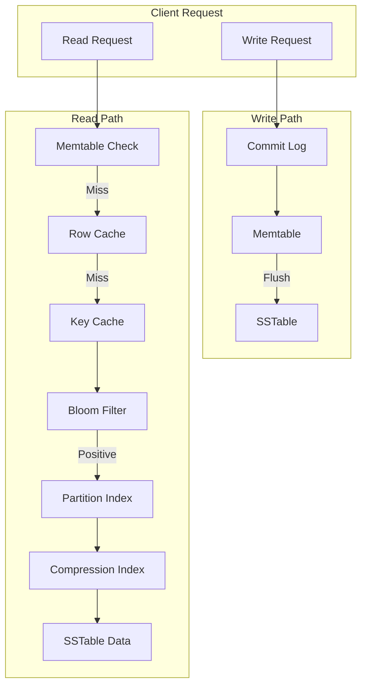
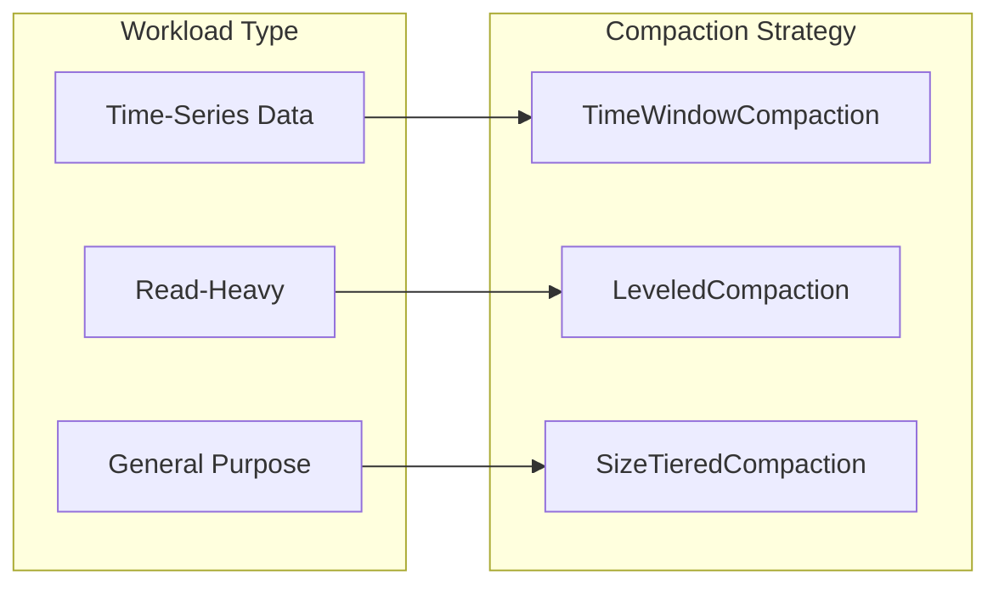
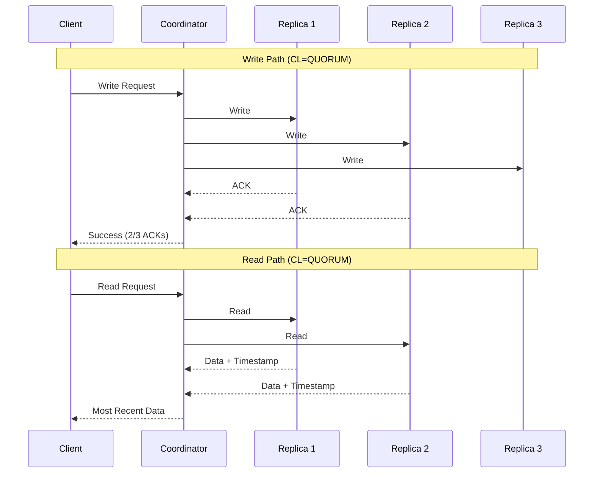
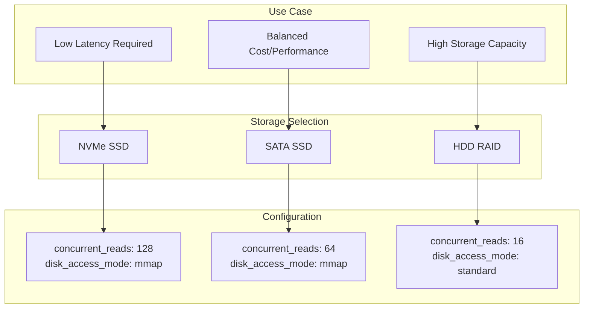
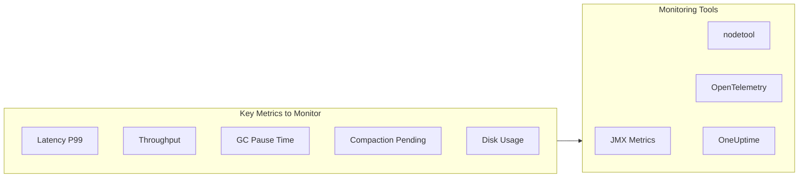

# How to Tune Cassandra for Performance

Author: [nawazdhandala](https://www.github.com/nawazdhandala)

Tags: Cassandra, Database, Performance Tuning, NoSQL, JVM, Compaction, Caching, Distributed Systems

Description: A comprehensive guide to tuning Apache Cassandra for optimal performance, covering JVM settings, compaction strategies, memory configuration, read/write path optimization, and hardware considerations.

---

> **Key Insight:** Cassandra performance tuning is not about finding a single magic setting. It is about understanding your workload characteristics and aligning JVM, compaction, caching, and hardware configurations to match your specific read/write patterns.

## Understanding Cassandra Architecture

Before diving into tuning, you need to understand how Cassandra processes data. This knowledge helps you make informed decisions about which knobs to turn.



## JVM Tuning for Cassandra

The JVM is the foundation of Cassandra performance. Incorrect JVM settings can cause long GC pauses, out-of-memory errors, and unpredictable latencies.

### Heap Size Configuration

```bash
# /etc/cassandra/jvm.options
# ============================================================
# HEAP SETTINGS
# ============================================================

# Set min and max heap to the same value to prevent resizing
# Rule of thumb: 8GB is often optimal. Never exceed 32GB.
# For larger memory systems, leave more for off-heap and OS cache.
-Xms8G
-Xmx8G

# New generation size (G1GC will manage this automatically,
# but for CMS you should set it to 100MB per CPU core)
# -Xmn2G  # Uncomment only for CMS, not needed for G1GC
```

### G1GC Configuration (Recommended for Cassandra 4.x+)

```bash
# /etc/cassandra/jvm11-server.options
# ============================================================
# G1GC SETTINGS - Recommended for Java 11+
# ============================================================

# Enable G1 Garbage Collector
-XX:+UseG1GC

# Set target pause time (200ms is a good starting point)
# Lower values reduce latency but may increase GC frequency
-XX:MaxGCPauseMillis=200

# Initial and max heap region size
# Larger regions reduce GC overhead for large heaps
-XX:G1HeapRegionSize=16m

# Reserve memory for allocations during GC
# 10% is default; increase if you see allocation failures
-XX:G1ReservePercent=10

# Start marking cycle earlier to avoid full GC
# Lower values trigger GC earlier when heap is less full
-XX:InitiatingHeapOccupancyPercent=45

# Parallel GC threads (typically matches CPU cores)
-XX:ParallelGCThreads=16

# Concurrent GC threads (typically 1/4 of parallel threads)
-XX:ConcGCThreads=4

# Enable GC logging for analysis
-Xlog:gc*:file=/var/log/cassandra/gc.log:time,uptime:filecount=10,filesize=10M
```

### CMS Configuration (Legacy Systems)

```bash
# /etc/cassandra/jvm.options
# ============================================================
# CMS SETTINGS - For Java 8 or systems requiring CMS
# ============================================================

# Enable CMS Garbage Collector
-XX:+UseConcMarkSweepGC
-XX:+CMSParallelRemarkEnabled

# Promote objects to old gen after surviving this many minor GCs
-XX:MaxTenuringThreshold=1

# Trigger CMS when old gen reaches this percentage
# Lower values prevent promotion failures but increase GC frequency
-XX:CMSInitiatingOccupancyFraction=75
-XX:+UseCMSInitiatingOccupancyOnly

# Enable class unloading during CMS
-XX:+CMSClassUnloadingEnabled

# New generation size (important for CMS)
# Formula: 100MB * number_of_cpu_cores, max 25% of heap
-Xmn2G
```

## Compaction Strategy Selection

Compaction significantly impacts both read and write performance. The right strategy depends on your workload pattern.



### Size-Tiered Compaction (STCS) - Default

```sql
-- Good for: Write-heavy workloads, general purpose
-- Trade-off: Requires 2x disk space during compaction, may cause read amplification

CREATE TABLE user_events (
    user_id uuid,
    event_time timestamp,
    event_type text,
    payload text,
    PRIMARY KEY (user_id, event_time)
) WITH compaction = {
    'class': 'SizeTieredCompactionStrategy',

    -- Minimum SSTables to trigger compaction (default: 4)
    -- Lower values reduce space amplification but increase compaction frequency
    'min_threshold': 4,

    -- Maximum SSTables to compact at once (default: 32)
    -- Lower values reduce compaction resource usage
    'max_threshold': 32,

    -- Minimum SSTable size to consider for compaction
    -- Prevents compacting very small SSTables
    'min_sstable_size': 52428800  -- 50MB
};
```

### Leveled Compaction (LCS)

```sql
-- Good for: Read-heavy workloads, consistent latencies
-- Trade-off: Higher write amplification, more I/O during compaction

CREATE TABLE user_profiles (
    user_id uuid PRIMARY KEY,
    email text,
    name text,
    preferences map<text, text>,
    updated_at timestamp
) WITH compaction = {
    'class': 'LeveledCompactionStrategy',

    -- Target size for SSTables (default: 160MB)
    -- Smaller values improve read performance but increase compaction
    'sstable_size_in_mb': 160,

    -- Enable single-SSTable compaction for tombstone removal
    'single_sstable_uplevel': true
};
```

### Time-Window Compaction (TWCS)

```sql
-- Good for: Time-series data with TTL, log data
-- Trade-off: Not suitable for data that gets updated after initial write

CREATE TABLE metrics (
    sensor_id uuid,
    bucket_time timestamp,
    reading_time timestamp,
    value double,
    PRIMARY KEY ((sensor_id, bucket_time), reading_time)
) WITH compaction = {
    'class': 'TimeWindowCompactionStrategy',

    -- Window size unit: MINUTES, HOURS, DAYS
    'compaction_window_unit': 'HOURS',

    -- Number of units per window
    -- All data within a window compacts together
    'compaction_window_size': 1,

    -- Timestamp resolution for window calculation
    'timestamp_resolution': 'MICROSECONDS'
}
AND default_time_to_live = 604800;  -- 7 days TTL
```

## Memory and Caching Configuration

Cassandra uses multiple caches to accelerate reads. Proper cache sizing can dramatically reduce disk I/O.

```yaml
# cassandra.yaml
# ============================================================
# CACHE CONFIGURATION
# ============================================================

# Key Cache: Stores partition index entries
# Dramatically speeds up locating partitions on disk
key_cache_size_in_mb: 100
# Save cache to disk every N seconds (0 disables)
key_cache_save_period: 14400
# Number of keys to save (reduces startup warmup time)
key_cache_keys_to_save: 100000

# Row Cache: Stores entire rows (use sparingly)
# Only beneficial for hot rows read far more than written
# WARNING: Row cache invalidation is expensive on writes
row_cache_size_in_mb: 0  # Disabled by default, enable with caution
row_cache_save_period: 0
row_cache_keys_to_save: 0

# Counter Cache: For counter workloads
counter_cache_size_in_mb: 50
counter_cache_save_period: 7200

# ============================================================
# MEMTABLE CONFIGURATION
# ============================================================

# Total memory for memtables across all tables
# Formula: heap_size * 0.25 is a good starting point
memtable_heap_space_in_mb: 2048

# Off-heap memtables (reduces GC pressure)
memtable_offheap_space_in_mb: 2048

# Flush memtable when commit log reaches this size
commitlog_total_space_in_mb: 8192

# Memtable allocation type:
# - heap_buffers: On-heap (more GC pressure)
# - offheap_buffers: Off-heap (recommended)
# - offheap_objects: Off-heap with object serialization
memtable_allocation_type: offheap_buffers

# ============================================================
# BLOOM FILTER CONFIGURATION
# ============================================================

# Bloom filter false positive probability
# Lower values use more memory but reduce unnecessary disk reads
# Table-level setting, shown here for reference
# bloom_filter_fp_chance: 0.01  # 1% false positive rate
```

### Per-Table Cache Settings

```sql
-- Enable caching for frequently accessed tables
ALTER TABLE user_sessions WITH caching = {
    -- Enable key cache for this table
    'keys': 'ALL',

    -- Row cache options: 'NONE', 'ALL', or number of rows
    -- Only enable for small, hot tables with infrequent writes
    'rows_per_partition': 'NONE'
};

-- For hot lookup tables with rare updates
ALTER TABLE country_codes WITH caching = {
    'keys': 'ALL',
    'rows_per_partition': 'ALL'  -- Cache all rows
};

-- Adjust bloom filter for tables with many partitions
ALTER TABLE user_events WITH
    bloom_filter_fp_chance = 0.001;  -- 0.1% false positive
```

## Read/Write Path Optimization

Understanding and optimizing the read/write paths is crucial for achieving low latencies.



### Consistency Level Tuning

```java
// Example: Configuring consistency levels in Java driver
// ============================================================
// Choose consistency based on your requirements:
// - ONE: Fastest, lowest consistency (single node)
// - QUORUM: Balance of speed and consistency
// - LOCAL_QUORUM: Multi-DC with local consistency
// - ALL: Strongest consistency, highest latency
// ============================================================

import com.datastax.oss.driver.api.core.CqlSession;
import com.datastax.oss.driver.api.core.config.DefaultDriverOption;
import com.datastax.oss.driver.api.core.config.DriverConfigLoader;
import com.datastax.oss.driver.api.core.ConsistencyLevel;

public class CassandraConfig {

    public CqlSession createSession() {
        // Configure driver with performance optimizations
        DriverConfigLoader loader = DriverConfigLoader.programmaticBuilder()
            // Default consistency for all queries
            .withString(DefaultDriverOption.REQUEST_CONSISTENCY, "LOCAL_QUORUM")

            // Timeout settings
            .withDuration(DefaultDriverOption.REQUEST_TIMEOUT,
                Duration.ofSeconds(2))

            // Connection pool settings
            // More connections = more parallel queries
            .withInt(DefaultDriverOption.CONNECTION_POOL_LOCAL_SIZE, 4)
            .withInt(DefaultDriverOption.CONNECTION_POOL_REMOTE_SIZE, 2)

            // Enable speculative execution for latency-sensitive reads
            // Sends duplicate requests if first is slow
            .withClass(DefaultDriverOption.SPECULATIVE_EXECUTION_POLICY_CLASS,
                ConstantSpeculativeExecutionPolicy.class)
            .withInt(DefaultDriverOption.SPECULATIVE_EXECUTION_MAX, 2)
            .withDuration(DefaultDriverOption.SPECULATIVE_EXECUTION_DELAY,
                Duration.ofMillis(100))

            .build();

        return CqlSession.builder()
            .withConfigLoader(loader)
            .build();
    }
}
```

### Write Optimization Settings

```yaml
# cassandra.yaml
# ============================================================
# WRITE PATH OPTIMIZATION
# ============================================================

# Commit log sync mode:
# - periodic: Faster, small data loss window on crash
# - batch: Safer, higher latency
commitlog_sync: periodic

# Sync interval for periodic mode (milliseconds)
# Lower values = safer but slower
commitlog_sync_period_in_ms: 10000

# Commit log segment size (should match workload)
commitlog_segment_size_in_mb: 32

# Enable compression for commit log (reduces I/O)
commitlog_compression:
  - class_name: LZ4Compressor

# Concurrent writes (controls memtable flush parallelism)
# Formula: 8 * number_of_drives is a good starting point
concurrent_writes: 32

# Concurrent memtable flushes
memtable_flush_writers: 4

# ============================================================
# READ PATH OPTIMIZATION
# ============================================================

# Concurrent reads (controls disk read parallelism)
# Formula: 16 * number_of_drives for SSD, 4 * number_of_drives for HDD
concurrent_reads: 32

# Read request timeout
read_request_timeout_in_ms: 5000

# Range request timeout (for range scans)
range_request_timeout_in_ms: 10000

# Enable chunk cache for compressed SSTables (off-heap)
# Caches decompressed chunks in memory
file_cache_size_in_mb: 512

# Disk access mode
# - standard: Traditional buffered I/O
# - mmap: Memory-mapped I/O (better for SSDs)
# - mmap_index_only: Hybrid approach
disk_access_mode: mmap
```

### Batch and Prepared Statement Optimization

```java
// ============================================================
// PREPARED STATEMENTS - Always use for repeated queries
// Prepared statements are parsed once and cached
// ============================================================

public class OptimizedCassandraRepository {
    private final CqlSession session;
    private final PreparedStatement insertStatement;
    private final PreparedStatement selectStatement;

    public OptimizedCassandraRepository(CqlSession session) {
        this.session = session;

        // Prepare statements once at startup
        this.insertStatement = session.prepare(
            "INSERT INTO events (id, timestamp, data) VALUES (?, ?, ?)"
        );

        this.selectStatement = session.prepare(
            "SELECT * FROM events WHERE id = ?"
        );
    }

    // ============================================================
    // BATCH WRITES - Use UNLOGGED for performance
    // Only batch writes to the SAME partition for atomicity
    // Cross-partition batches hurt performance
    // ============================================================

    public void batchInsert(UUID partitionId, List<Event> events) {
        // UNLOGGED batch: No distributed transaction overhead
        // Safe when all statements target the same partition
        BatchStatement batch = BatchStatement.builder(BatchType.UNLOGGED)
            .setConsistencyLevel(ConsistencyLevel.LOCAL_QUORUM)
            .build();

        for (Event event : events) {
            batch = batch.add(insertStatement.bind(
                partitionId,
                event.getTimestamp(),
                event.getData()
            ));
        }

        session.execute(batch);
    }

    // ============================================================
    // ASYNC OPERATIONS - For high throughput
    // Execute multiple queries in parallel
    // ============================================================

    public CompletableFuture<List<Row>> asyncRead(List<UUID> ids) {
        List<CompletionStage<AsyncResultSet>> futures = ids.stream()
            .map(id -> session.executeAsync(selectStatement.bind(id)))
            .collect(Collectors.toList());

        return CompletableFuture.allOf(
            futures.toArray(new CompletableFuture[0])
        ).thenApply(v -> futures.stream()
            .map(CompletionStage::toCompletableFuture)
            .map(CompletableFuture::join)
            .flatMap(rs -> StreamSupport.stream(rs.currentPage().spliterator(), false))
            .collect(Collectors.toList())
        );
    }
}
```

## Hardware Considerations

Hardware choices fundamentally affect Cassandra performance. Here is a decision framework.



### Recommended Hardware Configurations

```yaml
# Production Node Sizing Guide
# ============================================================

# SMALL CLUSTER (Development/Staging)
# -----------------------------------
small_node:
  cpu_cores: 4-8
  memory_gb: 16-32
  heap_size_gb: 8
  storage: "500GB SSD"
  network: "1 Gbps"
  data_per_node_tb: 0.5

# MEDIUM CLUSTER (Production - Standard)
# --------------------------------------
medium_node:
  cpu_cores: 8-16
  memory_gb: 32-64
  heap_size_gb: 8-16
  storage: "2TB NVMe SSD"
  network: "10 Gbps"
  data_per_node_tb: 1-2

# LARGE CLUSTER (Production - High Performance)
# ---------------------------------------------
large_node:
  cpu_cores: 16-32
  memory_gb: 64-128
  heap_size_gb: 16-31  # Never exceed 32GB (pointer compression)
  storage: "4TB+ NVMe SSD"
  network: "25 Gbps"
  data_per_node_tb: 2-4

# ============================================================
# CRITICAL RATIOS TO MAINTAIN
# ============================================================

ratios:
  # Data density: Keep under 1TB per core for optimal performance
  data_per_core_tb: 0.5-1.0

  # Memory to data ratio: More memory = better caching
  memory_to_data_ratio: "1GB RAM per 10GB data (minimum)"

  # Disk I/O: Plan for compaction overhead
  disk_headroom_percent: 50  # Keep 50% free for compaction
```

### Disk I/O Configuration

```bash
#!/bin/bash
# ============================================================
# DISK OPTIMIZATION SCRIPT FOR CASSANDRA
# Run on each Cassandra node
# ============================================================

# Set disk scheduler to 'none' for NVMe or 'deadline' for SATA SSD
DEVICE="nvme0n1"

# For NVMe SSDs - no scheduler needed
echo "none" > /sys/block/${DEVICE}/queue/scheduler

# For SATA SSDs - use deadline or mq-deadline
# echo "mq-deadline" > /sys/block/${DEVICE}/queue/scheduler

# Increase read-ahead for sequential workloads
# Lower values (8-64) better for random I/O
# Higher values (128-256) better for sequential/compaction
echo 64 > /sys/block/${DEVICE}/queue/read_ahead_kb

# Disable write-back caching if you have battery-backed cache
# hdparm -W 0 /dev/${DEVICE}

# Set optimal nr_requests for high concurrency
echo 256 > /sys/block/${DEVICE}/queue/nr_requests

# ============================================================
# FILE SYSTEM MOUNT OPTIONS
# ============================================================

# Recommended mount options for XFS (preferred for Cassandra)
# /dev/nvme0n1 /var/lib/cassandra xfs noatime,nodiratime,nobarrier 0 0

# For ext4
# /dev/nvme0n1 /var/lib/cassandra ext4 noatime,nodiratime,data=writeback,barrier=0,nobh 0 0
```

### Network Configuration

```bash
#!/bin/bash
# ============================================================
# NETWORK OPTIMIZATION FOR CASSANDRA
# ============================================================

# Increase socket buffer sizes for high throughput
sysctl -w net.core.rmem_max=16777216
sysctl -w net.core.wmem_max=16777216
sysctl -w net.core.rmem_default=1048576
sysctl -w net.core.wmem_default=1048576

# TCP buffer auto-tuning
sysctl -w net.ipv4.tcp_rmem="4096 1048576 16777216"
sysctl -w net.ipv4.tcp_wmem="4096 1048576 16777216"

# Increase connection tracking and backlog
sysctl -w net.core.somaxconn=65535
sysctl -w net.core.netdev_max_backlog=65535

# Enable TCP timestamps and window scaling
sysctl -w net.ipv4.tcp_timestamps=1
sysctl -w net.ipv4.tcp_window_scaling=1

# Reduce TIME_WAIT sockets
sysctl -w net.ipv4.tcp_fin_timeout=15
sysctl -w net.ipv4.tcp_tw_reuse=1

# Disable slow start after idle
sysctl -w net.ipv4.tcp_slow_start_after_idle=0

# Make settings persistent
cat >> /etc/sysctl.conf << EOF
net.core.rmem_max=16777216
net.core.wmem_max=16777216
net.ipv4.tcp_rmem=4096 1048576 16777216
net.ipv4.tcp_wmem=4096 1048576 16777216
net.core.somaxconn=65535
EOF
```

## Monitoring and Diagnostics

You cannot tune what you cannot measure. Set up comprehensive monitoring to guide your tuning decisions.



### Essential nodetool Commands

```bash
# ============================================================
# DIAGNOSTIC COMMANDS
# ============================================================

# Check cluster status and ring ownership
nodetool status

# View table statistics (reads, writes, latencies)
nodetool tablestats keyspace_name.table_name

# Check pending compactions (high numbers indicate I/O bottleneck)
nodetool compactionstats

# View thread pool statistics
nodetool tpstats

# Check GC activity
nodetool gcstats

# View cache hit rates
nodetool info | grep -i cache

# Identify large partitions (can cause latency spikes)
nodetool tablehistograms keyspace_name.table_name

# ============================================================
# MAINTENANCE COMMANDS
# ============================================================

# Force compaction (use during maintenance windows)
nodetool compact keyspace_name table_name

# Rebuild bloom filters (after FP chance change)
nodetool upgradesstables --include-all-sstables keyspace_name table_name

# Clear snapshots to reclaim disk space
nodetool clearsnapshot --all
```

## Best Practices Summary

1. **Start with defaults and measure** before making changes. Premature optimization often backfires.

2. **Match compaction to workload**: STCS for writes, LCS for reads, TWCS for time-series.

3. **Keep heap size reasonable**: 8-16GB is optimal for most workloads. Never exceed 32GB.

4. **Use G1GC for Java 11+**: Better pause times and automatic tuning compared to CMS.

5. **Size caches appropriately**: Key cache should have near 100% hit rate. Row cache only for hot, rarely-updated data.

6. **Use prepared statements always**: They reduce parsing overhead and enable server-side caching.

7. **Batch within partitions only**: Cross-partition batches create coordinator overhead.

8. **Monitor continuously**: Track P99 latencies, GC pauses, and compaction backlog to catch issues early.

9. **Plan for compaction**: Keep 50% disk headroom. Schedule major compactions during low-traffic periods.

10. **Test changes in staging**: Performance tuning changes can have unexpected interactions.

## Monitor Your Cassandra Cluster with OneUptime

Tuning is an ongoing process that requires continuous monitoring. [OneUptime](https://oneuptime.com) provides comprehensive observability for your Cassandra clusters:

- **Real-time metrics dashboards** for latency, throughput, and resource utilization
- **Intelligent alerting** that notifies you before performance degrades
- **Distributed tracing** to identify slow queries and bottlenecks
- **Custom SLOs** to track your performance targets against actual measurements

Start monitoring your Cassandra infrastructure today and make data-driven tuning decisions.
