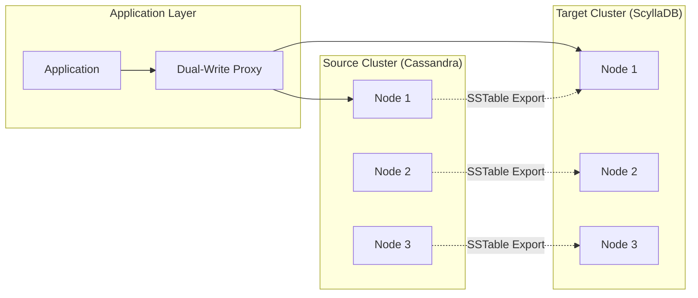
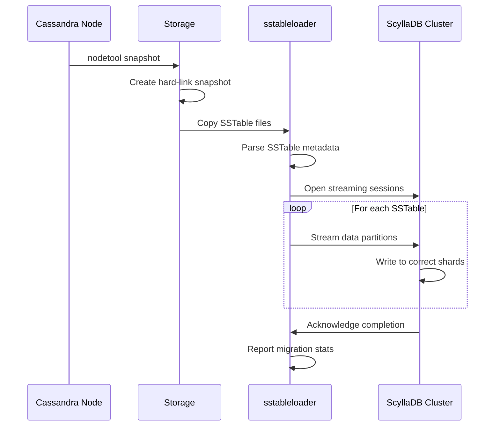
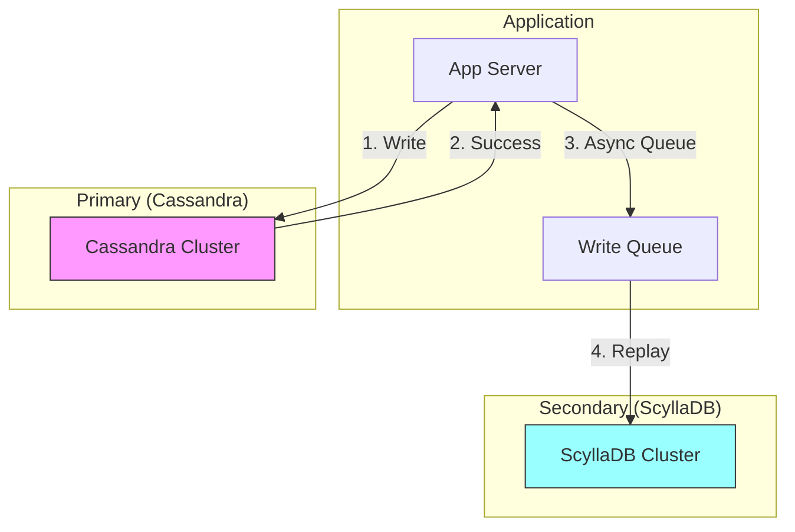
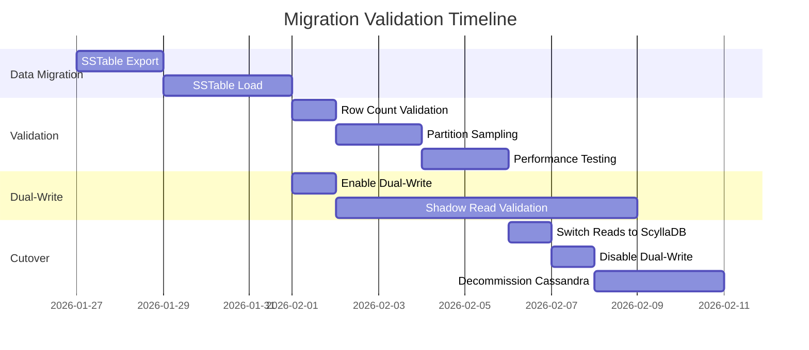

# How to Migrate from Cassandra to ScyllaDB

By [Nawaz Dhandala](https://github.com/nawazdhandala)

Tags: Cassandra, ScyllaDB, Database Migration, NoSQL, Performance, DevOps

Description: A comprehensive guide to migrating from Apache Cassandra to ScyllaDB, covering planning strategies, data migration with sstableloader, driver compatibility, dual-write patterns, and validation techniques for zero-downtime migrations.

---

> ScyllaDB is not just a drop-in replacement for Cassandra; it is a shard-per-core reimplementation in C++ that eliminates the JVM's garbage collection pauses. Migration is straightforward because ScyllaDB speaks CQL and accepts Cassandra SSTables directly, but the devil is in the details: schema nuances, driver tuning, and validation at scale.

## Why Migrate to ScyllaDB?

Before diving into the how, understand the why. ScyllaDB offers several advantages over Cassandra:

- **Higher throughput with lower latency:** The shard-per-core architecture eliminates cross-CPU contention and JVM GC pauses.
- **Lower operational overhead:** Automatic tuning replaces manual JVM heap sizing and compaction throttling.
- **Cassandra compatibility:** CQL protocol support means existing drivers and queries work with minimal changes.
- **Cost efficiency:** Better hardware utilization often means fewer nodes for the same workload.

## Migration Architecture Overview



## Phase 1: Planning the Migration

A successful migration starts with thorough planning. Audit your existing Cassandra cluster and understand the data characteristics.

### Inventory Your Schema

```sql
-- Export all keyspace definitions from Cassandra
-- Run this on any Cassandra node to capture the schema

-- List all keyspaces (excluding system keyspaces)
SELECT keyspace_name, replication
FROM system_schema.keyspaces
WHERE keyspace_name NOT IN ('system', 'system_auth', 'system_distributed', 'system_schema', 'system_traces');

-- For each keyspace, describe the full schema
-- This command exports CREATE statements for all tables, types, and indexes
DESCRIBE KEYSPACE my_keyspace;
```

### Assess Data Volume and Distribution

```bash
#!/bin/bash
# assess_cassandra_cluster.sh
# Run this script to gather cluster metrics before migration

# Get cluster status and token distribution
echo "=== Cluster Status ==="
nodetool status

# Check data distribution across nodes
echo "=== Data Distribution ==="
nodetool ring

# Get table statistics for sizing
echo "=== Table Statistics ==="
nodetool tablestats my_keyspace

# Estimate total data size
echo "=== Disk Usage ==="
du -sh /var/lib/cassandra/data/my_keyspace/*/

# Check compaction status - migrations work best when compaction is complete
echo "=== Pending Compactions ==="
nodetool compactionstats
```

### Schema Compatibility Checklist

ScyllaDB supports most Cassandra features, but verify these items:

```yaml
# migration_checklist.yaml
# Use this checklist to verify schema compatibility

schema_verification:
  supported:
    - Standard CQL data types (text, int, bigint, uuid, timestamp, etc.)
    - Collections (list, set, map)
    - User-defined types (UDTs)
    - Secondary indexes (with performance considerations)
    - Materialized views (check ScyllaDB version for full support)
    - Lightweight transactions (LWT/Paxos)
    - TTL and per-cell timestamps

  verify_before_migration:
    - Counter tables (ensure proper anti-entropy)
    - Custom compaction strategies (ScyllaDB has its own optimized strategies)
    - Encryption at rest configuration differences
    - Authentication and authorization settings

  not_supported_or_different:
    - SASI indexes (use ScyllaDB secondary indexes instead)
    - Some JMX metrics (ScyllaDB uses different monitoring)
    - Certain compaction strategy parameters
```

## Phase 2: Using sstableloader for Data Migration

The `sstableloader` tool is the most reliable method for bulk data migration. It streams SSTable files directly to ScyllaDB nodes.

### Prepare the Target Cluster

```bash
#!/bin/bash
# prepare_scylla_cluster.sh
# Set up ScyllaDB cluster before data migration

# Create the keyspace with matching replication settings
# Adjust replication factor based on your cluster size
cqlsh scylla-node1 -e "
CREATE KEYSPACE IF NOT EXISTS my_keyspace
WITH replication = {
    'class': 'NetworkTopologyStrategy',
    'datacenter1': 3
}
AND durable_writes = true;
"

# Create all tables with identical schemas
# Export from Cassandra using DESCRIBE and apply here
cqlsh scylla-node1 -f /tmp/schema_export.cql

# Verify schema was applied correctly
cqlsh scylla-node1 -e "DESCRIBE KEYSPACE my_keyspace;"
```

### Export SSTables from Cassandra

```bash
#!/bin/bash
# export_sstables.sh
# Safely export SSTables from Cassandra for migration

KEYSPACE="my_keyspace"
TABLE="my_table"
EXPORT_DIR="/mnt/migration/sstables"

# Create export directory
mkdir -p "${EXPORT_DIR}/${KEYSPACE}/${TABLE}"

# Option 1: Snapshot-based export (recommended for production)
# Creates a hard-link snapshot without stopping writes
nodetool snapshot -t migration_snapshot ${KEYSPACE}

# Find and copy snapshot files
SNAPSHOT_DIR="/var/lib/cassandra/data/${KEYSPACE}/${TABLE}-*/snapshots/migration_snapshot"
cp -r ${SNAPSHOT_DIR}/* "${EXPORT_DIR}/${KEYSPACE}/${TABLE}/"

# Option 2: Direct copy during maintenance window
# Only use this if you can afford a brief pause in writes
nodetool drain  # Flush all memtables to SSTables
cp -r /var/lib/cassandra/data/${KEYSPACE}/${TABLE}-*/*-Data.db "${EXPORT_DIR}/${KEYSPACE}/${TABLE}/"
# Copy all associated files (-Index.db, -Filter.db, -Statistics.db, etc.)
```

### Stream Data with sstableloader

```bash
#!/bin/bash
# run_sstableloader.sh
# Stream SSTables to ScyllaDB cluster

SCYLLA_NODES="scylla-node1,scylla-node2,scylla-node3"
KEYSPACE="my_keyspace"
TABLE="my_table"
SSTABLE_DIR="/mnt/migration/sstables/${KEYSPACE}/${TABLE}"

# Run sstableloader with optimized settings
# -d: comma-separated list of ScyllaDB nodes
# -t: throttle in Mbps (adjust based on network capacity)
# --connections-per-host: parallel streams per node
sstableloader \
    -d ${SCYLLA_NODES} \
    -t 500 \
    --connections-per-host 4 \
    --keyspace ${KEYSPACE} \
    ${SSTABLE_DIR}

# For authenticated clusters, add credentials
sstableloader \
    -d ${SCYLLA_NODES} \
    -u cassandra \
    -pw ${CASSANDRA_PASSWORD} \
    -t 500 \
    ${SSTABLE_DIR}

# Monitor progress - sstableloader shows streaming progress
# Watch for "Streaming session complete" messages
```

### Migration Flow with sstableloader



## Phase 3: Driver Compatibility Considerations

ScyllaDB is wire-compatible with Cassandra, but optimizing driver configuration improves performance.

### Java Driver Configuration

```java
// ScyllaDbSessionConfig.java
// Configure the DataStax Java driver for ScyllaDB

import com.datastax.oss.driver.api.core.CqlSession;
import com.datastax.oss.driver.api.core.config.DefaultDriverOption;
import com.datastax.oss.driver.api.core.config.DriverConfigLoader;
import com.datastax.oss.driver.api.core.loadbalancing.LoadBalancingPolicy;

import java.net.InetSocketAddress;
import java.time.Duration;

public class ScyllaDbSessionConfig {

    /**
     * Creates a CqlSession configured for ScyllaDB.
     * Key differences from Cassandra configuration:
     * - ScyllaDB's shard-aware driver can route requests to specific CPU cores
     * - Lower latency means tighter timeouts are appropriate
     * - Connection pooling can be more aggressive
     */
    public CqlSession createSession() {
        DriverConfigLoader loader = DriverConfigLoader.programmaticBuilder()
            // Use shard-aware routing for optimal performance
            // This routes requests directly to the shard owning the partition
            .withString(DefaultDriverOption.LOAD_BALANCING_LOCAL_DATACENTER, "datacenter1")

            // Connection pool settings optimized for ScyllaDB
            // ScyllaDB handles more concurrent requests per connection
            .withInt(DefaultDriverOption.CONNECTION_POOL_LOCAL_SIZE, 1)
            .withInt(DefaultDriverOption.CONNECTION_POOL_REMOTE_SIZE, 1)

            // Request timeout - ScyllaDB is faster, tighten timeouts
            .withDuration(DefaultDriverOption.REQUEST_TIMEOUT, Duration.ofMillis(2000))

            // Speculative execution for tail latency reduction
            // ScyllaDB's consistent latency makes this less critical
            .withString(DefaultDriverOption.SPECULATIVE_EXECUTION_POLICY_CLASS,
                "ConstantSpeculativeExecutionPolicy")
            .withInt(DefaultDriverOption.SPECULATIVE_EXECUTION_MAX, 2)
            .withDuration(DefaultDriverOption.SPECULATIVE_EXECUTION_DELAY,
                Duration.ofMillis(100))

            .build();

        return CqlSession.builder()
            .addContactPoint(new InetSocketAddress("scylla-node1", 9042))
            .addContactPoint(new InetSocketAddress("scylla-node2", 9042))
            .addContactPoint(new InetSocketAddress("scylla-node3", 9042))
            .withConfigLoader(loader)
            .withKeyspace("my_keyspace")
            .build();
    }
}
```

### Python Driver Configuration

```python
# scylla_client.py
# Configure the Python Cassandra driver for ScyllaDB

from cassandra.cluster import Cluster, ExecutionProfile, EXEC_PROFILE_DEFAULT
from cassandra.policies import (
    DCAwareRoundRobinPolicy,
    TokenAwarePolicy,
    ConstantSpeculativeExecutionPolicy
)
from cassandra.query import ConsistencyLevel

def create_scylla_session():
    """
    Creates a Cassandra driver session optimized for ScyllaDB.

    The Python driver is fully compatible with ScyllaDB.
    Key optimizations:
    - TokenAwarePolicy routes queries to the replica owning the partition
    - Speculative execution handles occasional slow nodes
    - Protocol version 4 is recommended for ScyllaDB
    """

    # Configure load balancing with token awareness
    # This minimizes network hops by routing to the correct replica
    load_balancing_policy = TokenAwarePolicy(
        DCAwareRoundRobinPolicy(local_dc='datacenter1')
    )

    # Speculative execution retries slow queries on another node
    # ScyllaDB's predictable latency means this rarely triggers
    speculative_policy = ConstantSpeculativeExecutionPolicy(
        delay=0.1,  # 100ms delay before speculative retry
        max_attempts=2
    )

    # Create execution profile with optimized settings
    profile = ExecutionProfile(
        load_balancing_policy=load_balancing_policy,
        speculative_execution_policy=speculative_policy,
        consistency_level=ConsistencyLevel.LOCAL_QUORUM,
        request_timeout=2.0  # 2 second timeout (ScyllaDB is fast)
    )

    # Build cluster connection
    cluster = Cluster(
        contact_points=['scylla-node1', 'scylla-node2', 'scylla-node3'],
        port=9042,
        execution_profiles={EXEC_PROFILE_DEFAULT: profile},
        protocol_version=4,  # Use protocol v4 for best compatibility
        # Connection pooling - ScyllaDB handles high concurrency well
        # Fewer connections needed compared to Cassandra
    )

    session = cluster.connect('my_keyspace')

    # Prepare frequently used statements for better performance
    # Prepared statements are cached on the server side
    return session, cluster


# Example usage with connection management
class ScyllaClient:
    """
    A managed ScyllaDB client with connection lifecycle handling.
    """

    def __init__(self):
        self.session = None
        self.cluster = None
        self._prepared_statements = {}

    def connect(self):
        self.session, self.cluster = create_scylla_session()
        self._prepare_statements()

    def _prepare_statements(self):
        """Pre-compile frequently used CQL statements."""
        self._prepared_statements['insert_user'] = self.session.prepare(
            "INSERT INTO users (user_id, email, created_at) VALUES (?, ?, ?)"
        )
        self._prepared_statements['get_user'] = self.session.prepare(
            "SELECT * FROM users WHERE user_id = ?"
        )

    def close(self):
        if self.session:
            self.session.shutdown()
        if self.cluster:
            self.cluster.shutdown()
```

## Phase 4: Dual-Write Strategies

For zero-downtime migrations, implement dual-write to keep both clusters synchronized during the transition.

### Dual-Write Architecture



### Implementing Dual-Write in Java

```java
// DualWriteService.java
// Implements dual-write pattern for migration

import com.datastax.oss.driver.api.core.CqlSession;
import com.datastax.oss.driver.api.core.cql.BoundStatement;
import com.datastax.oss.driver.api.core.cql.PreparedStatement;
import com.datastax.oss.driver.api.core.cql.ResultSet;

import java.util.concurrent.CompletableFuture;
import java.util.concurrent.ExecutorService;
import java.util.concurrent.Executors;
import org.slf4j.Logger;
import org.slf4j.LoggerFactory;

public class DualWriteService {

    private static final Logger logger = LoggerFactory.getLogger(DualWriteService.class);

    private final CqlSession cassandraSession;
    private final CqlSession scyllaSession;
    private final ExecutorService asyncExecutor;

    // Feature flag to control migration phases
    private volatile boolean dualWriteEnabled = true;
    private volatile boolean readFromScylla = false;

    public DualWriteService(CqlSession cassandraSession, CqlSession scyllaSession) {
        this.cassandraSession = cassandraSession;
        this.scyllaSession = scyllaSession;
        // Dedicated thread pool for async writes to secondary cluster
        this.asyncExecutor = Executors.newFixedThreadPool(10);
    }

    /**
     * Writes data to both clusters with Cassandra as primary.
     *
     * Strategy:
     * 1. Write synchronously to Cassandra (primary) - must succeed
     * 2. Write asynchronously to ScyllaDB (secondary) - best effort
     * 3. Log failures for later reconciliation
     *
     * This ensures no impact to production while populating ScyllaDB.
     */
    public void write(String cql, Object... values) {
        // Primary write to Cassandra - synchronous, must succeed
        PreparedStatement cassandraStmt = cassandraSession.prepare(cql);
        BoundStatement bound = cassandraStmt.bind(values);

        try {
            cassandraSession.execute(bound);
        } catch (Exception e) {
            // Primary write failed - propagate error to caller
            logger.error("Primary write to Cassandra failed", e);
            throw e;
        }

        // Secondary write to ScyllaDB - asynchronous, best effort
        if (dualWriteEnabled) {
            CompletableFuture.runAsync(() -> {
                try {
                    PreparedStatement scyllaStmt = scyllaSession.prepare(cql);
                    BoundStatement scyllaBound = scyllaStmt.bind(values);
                    scyllaSession.execute(scyllaBound);
                } catch (Exception e) {
                    // Log for reconciliation - don't fail the request
                    logger.warn("Secondary write to ScyllaDB failed, queuing for retry", e);
                    queueForRetry(cql, values);
                }
            }, asyncExecutor);
        }
    }

    /**
     * Reads from the active cluster based on migration phase.
     *
     * Migration phases:
     * 1. Read from Cassandra only (initial state)
     * 2. Shadow read from both, compare results (validation)
     * 3. Read from ScyllaDB only (migration complete)
     */
    public ResultSet read(String cql, Object... values) {
        if (readFromScylla) {
            PreparedStatement stmt = scyllaSession.prepare(cql);
            return scyllaSession.execute(stmt.bind(values));
        } else {
            PreparedStatement stmt = cassandraSession.prepare(cql);
            return cassandraSession.execute(stmt.bind(values));
        }
    }

    /**
     * Shadow read for validation - compares results from both clusters.
     */
    public ValidationResult shadowRead(String cql, Object... values) {
        CompletableFuture<ResultSet> cassandraFuture = CompletableFuture.supplyAsync(() -> {
            PreparedStatement stmt = cassandraSession.prepare(cql);
            return cassandraSession.execute(stmt.bind(values));
        });

        CompletableFuture<ResultSet> scyllaFuture = CompletableFuture.supplyAsync(() -> {
            PreparedStatement stmt = scyllaSession.prepare(cql);
            return scyllaSession.execute(stmt.bind(values));
        });

        // Compare results for consistency validation
        return CompletableFuture.allOf(cassandraFuture, scyllaFuture)
            .thenApply(v -> compareResults(
                cassandraFuture.join(),
                scyllaFuture.join()
            )).join();
    }

    private void queueForRetry(String cql, Object[] values) {
        // Implement retry queue - could use Kafka, Redis, or local queue
        // This ensures eventual consistency during migration
    }

    private ValidationResult compareResults(ResultSet cassandra, ResultSet scylla) {
        // Implement comparison logic
        // Check row counts, column values, ordering
        return new ValidationResult(true, "Results match");
    }

    // Migration phase control methods
    public void enableScyllaReads() { this.readFromScylla = true; }
    public void disableDualWrite() { this.dualWriteEnabled = false; }
}
```

### Dual-Write with Change Data Capture

```python
# cdc_dual_write.py
# Alternative dual-write using Cassandra CDC for guaranteed delivery

from cassandra.cluster import Cluster
from kafka import KafkaConsumer, KafkaProducer
import json

class CDCMigrationPipeline:
    """
    Uses Cassandra CDC (Change Data Capture) to stream changes to ScyllaDB.

    This approach guarantees no data loss because:
    1. CDC logs are persisted before the write is acknowledged
    2. A separate consumer processes CDC logs and applies to ScyllaDB
    3. Failed writes can be retried from the CDC log
    """

    def __init__(self, kafka_brokers, scylla_nodes):
        self.kafka_consumer = KafkaConsumer(
            'cassandra-cdc-events',
            bootstrap_servers=kafka_brokers,
            group_id='scylla-migration',
            auto_offset_reset='earliest',
            enable_auto_commit=False,
            value_deserializer=lambda m: json.loads(m.decode('utf-8'))
        )

        self.scylla_cluster = Cluster(scylla_nodes)
        self.scylla_session = self.scylla_cluster.connect('my_keyspace')

        # Track processed offsets for exactly-once semantics
        self.offset_store = {}

    def process_cdc_events(self):
        """
        Continuously process CDC events and apply to ScyllaDB.

        CDC event format:
        {
            "operation": "INSERT|UPDATE|DELETE",
            "keyspace": "my_keyspace",
            "table": "my_table",
            "partition_key": {...},
            "clustering_key": {...},
            "columns": {...},
            "timestamp": 1234567890
        }
        """
        for message in self.kafka_consumer:
            event = message.value

            try:
                if event['operation'] == 'INSERT':
                    self._apply_insert(event)
                elif event['operation'] == 'UPDATE':
                    self._apply_update(event)
                elif event['operation'] == 'DELETE':
                    self._apply_delete(event)

                # Commit offset only after successful apply
                self.kafka_consumer.commit()

            except Exception as e:
                # Log error and continue - event will be reprocessed
                print(f"Failed to apply CDC event: {e}")
                # Implement dead letter queue for persistent failures

    def _apply_insert(self, event):
        """Apply INSERT operation to ScyllaDB."""
        columns = list(event['columns'].keys())
        placeholders = ', '.join(['?' for _ in columns])
        cql = f"INSERT INTO {event['table']} ({', '.join(columns)}) VALUES ({placeholders})"

        stmt = self.scylla_session.prepare(cql)
        self.scylla_session.execute(stmt, list(event['columns'].values()))

    def _apply_update(self, event):
        """Apply UPDATE operation to ScyllaDB with timestamp ordering."""
        # Use USING TIMESTAMP to preserve write ordering
        set_clause = ', '.join([f"{k} = ?" for k in event['columns'].keys()])
        where_clause = self._build_where_clause(event)

        cql = f"UPDATE {event['table']} USING TIMESTAMP {event['timestamp']} SET {set_clause} WHERE {where_clause}"

        stmt = self.scylla_session.prepare(cql)
        values = list(event['columns'].values()) + self._get_key_values(event)
        self.scylla_session.execute(stmt, values)

    def _apply_delete(self, event):
        """Apply DELETE operation to ScyllaDB."""
        where_clause = self._build_where_clause(event)
        cql = f"DELETE FROM {event['table']} USING TIMESTAMP {event['timestamp']} WHERE {where_clause}"

        stmt = self.scylla_session.prepare(cql)
        self.scylla_session.execute(stmt, self._get_key_values(event))
```

## Phase 5: Validation and Testing

Thorough validation ensures data integrity and application compatibility before cutover.

### Data Validation Script

```python
# validate_migration.py
# Comprehensive validation of migrated data

from cassandra.cluster import Cluster
from cassandra.query import SimpleStatement, ConsistencyLevel
import hashlib
import json
from concurrent.futures import ThreadPoolExecutor, as_completed

class MigrationValidator:
    """
    Validates data consistency between Cassandra and ScyllaDB clusters.

    Validation strategies:
    1. Row count comparison - quick sanity check
    2. Partition sampling - spot check random partitions
    3. Full scan comparison - thorough but slow
    4. Checksum comparison - efficient for large datasets
    """

    def __init__(self, cassandra_nodes, scylla_nodes, keyspace):
        self.cassandra = Cluster(cassandra_nodes).connect(keyspace)
        self.scylla = Cluster(scylla_nodes).connect(keyspace)
        self.keyspace = keyspace

    def validate_row_counts(self, table):
        """
        Compare row counts between clusters.

        Note: COUNT(*) can be expensive on large tables.
        For very large tables, use ALLOW FILTERING with LIMIT
        or estimate from nodetool tablestats.
        """
        cql = f"SELECT COUNT(*) FROM {table}"

        # Use LOCAL_ONE for faster counts during validation
        stmt = SimpleStatement(cql, consistency_level=ConsistencyLevel.LOCAL_ONE)

        cassandra_count = self.cassandra.execute(stmt).one()[0]
        scylla_count = self.scylla.execute(stmt).one()[0]

        result = {
            'table': table,
            'cassandra_count': cassandra_count,
            'scylla_count': scylla_count,
            'match': cassandra_count == scylla_count,
            'difference': abs(cassandra_count - scylla_count)
        }

        print(f"Table {table}: Cassandra={cassandra_count}, ScyllaDB={scylla_count}, Match={result['match']}")
        return result

    def validate_partition_sample(self, table, partition_key_column, sample_size=1000):
        """
        Sample random partitions and compare data.

        This catches data corruption without scanning the entire table.
        """
        # Get sample of partition keys from Cassandra
        sample_cql = f"SELECT DISTINCT {partition_key_column} FROM {table} LIMIT {sample_size}"
        partition_keys = [row[0] for row in self.cassandra.execute(sample_cql)]

        mismatches = []

        for pk in partition_keys:
            # Fetch full partition from both clusters
            fetch_cql = f"SELECT * FROM {table} WHERE {partition_key_column} = ?"

            cassandra_rows = list(self.cassandra.execute(fetch_cql, [pk]))
            scylla_rows = list(self.scylla.execute(fetch_cql, [pk]))

            if not self._compare_rows(cassandra_rows, scylla_rows):
                mismatches.append({
                    'partition_key': pk,
                    'cassandra_row_count': len(cassandra_rows),
                    'scylla_row_count': len(scylla_rows)
                })

        result = {
            'table': table,
            'sampled_partitions': len(partition_keys),
            'mismatches': len(mismatches),
            'mismatch_details': mismatches[:10]  # First 10 for debugging
        }

        print(f"Table {table}: Sampled {len(partition_keys)} partitions, {len(mismatches)} mismatches")
        return result

    def _compare_rows(self, cassandra_rows, scylla_rows):
        """Compare row sets for equality."""
        if len(cassandra_rows) != len(scylla_rows):
            return False

        # Sort by all columns for deterministic comparison
        def row_to_tuple(row):
            return tuple(str(getattr(row, col)) for col in row._fields)

        cassandra_sorted = sorted(row_to_tuple(r) for r in cassandra_rows)
        scylla_sorted = sorted(row_to_tuple(r) for r in scylla_rows)

        return cassandra_sorted == scylla_sorted

    def generate_validation_report(self, tables):
        """
        Generate comprehensive validation report for all tables.
        """
        report = {
            'keyspace': self.keyspace,
            'tables': {},
            'summary': {'passed': 0, 'failed': 0}
        }

        for table in tables:
            count_result = self.validate_row_counts(table)
            sample_result = self.validate_partition_sample(table, 'id')

            passed = count_result['match'] and sample_result['mismatches'] == 0

            report['tables'][table] = {
                'row_count': count_result,
                'partition_sample': sample_result,
                'passed': passed
            }

            if passed:
                report['summary']['passed'] += 1
            else:
                report['summary']['failed'] += 1

        return report


# Run validation
if __name__ == '__main__':
    validator = MigrationValidator(
        cassandra_nodes=['cassandra-node1', 'cassandra-node2'],
        scylla_nodes=['scylla-node1', 'scylla-node2'],
        keyspace='my_keyspace'
    )

    tables = ['users', 'orders', 'events', 'sessions']
    report = validator.generate_validation_report(tables)

    print(json.dumps(report, indent=2))
```

### Performance Comparison Testing

```bash
#!/bin/bash
# performance_comparison.sh
# Compare performance between Cassandra and ScyllaDB clusters

# Install cassandra-stress if not available
# apt-get install cassandra-tools

CASSANDRA_HOST="cassandra-node1"
SCYLLA_HOST="scylla-node1"
THREADS=64
OPERATIONS=1000000

echo "=== Write Performance Test ==="

# Test Cassandra write performance
echo "Testing Cassandra writes..."
cassandra-stress write n=${OPERATIONS} \
    -node ${CASSANDRA_HOST} \
    -rate threads=${THREADS} \
    -mode native cql3 \
    -schema "replication(factor=3)" \
    -log file=cassandra_write.log

# Test ScyllaDB write performance
echo "Testing ScyllaDB writes..."
cassandra-stress write n=${OPERATIONS} \
    -node ${SCYLLA_HOST} \
    -rate threads=${THREADS} \
    -mode native cql3 \
    -schema "replication(factor=3)" \
    -log file=scylla_write.log

echo "=== Read Performance Test ==="

# Test Cassandra read performance
echo "Testing Cassandra reads..."
cassandra-stress read n=${OPERATIONS} \
    -node ${CASSANDRA_HOST} \
    -rate threads=${THREADS} \
    -mode native cql3 \
    -log file=cassandra_read.log

# Test ScyllaDB read performance
echo "Testing ScyllaDB reads..."
cassandra-stress read n=${OPERATIONS} \
    -node ${SCYLLA_HOST} \
    -rate threads=${THREADS} \
    -mode native cql3 \
    -log file=scylla_read.log

echo "=== Mixed Workload Test ==="

# Test mixed read/write workload
cassandra-stress mixed ratio\(write=1,read=3\) n=${OPERATIONS} \
    -node ${SCYLLA_HOST} \
    -rate threads=${THREADS} \
    -mode native cql3 \
    -log file=scylla_mixed.log

# Parse and compare results
echo "=== Results Summary ==="
grep "Op rate" cassandra_write.log scylla_write.log
grep "Latency mean" cassandra_write.log scylla_write.log
grep "Latency 99th" cassandra_write.log scylla_write.log
```

### Validation Timeline



## Best Practices Summary

### Before Migration

1. **Audit your schema thoroughly** - Document all keyspaces, tables, indexes, and materialized views. Verify ScyllaDB compatibility for each feature.

2. **Size your ScyllaDB cluster appropriately** - ScyllaDB typically requires fewer nodes than Cassandra for the same workload due to better resource utilization.

3. **Plan for network bandwidth** - SSTable streaming and dual-write both consume significant network resources. Schedule migrations during low-traffic periods.

4. **Test driver compatibility** - Run your application test suite against ScyllaDB before migration. Most issues surface in edge cases around consistency levels and timeouts.

### During Migration

5. **Use snapshots for SSTable export** - Snapshots create hard links and do not impact production reads or writes.

6. **Monitor both clusters** - Track latency, throughput, and error rates on both Cassandra and ScyllaDB throughout the migration.

7. **Implement circuit breakers** - If ScyllaDB writes fail during dual-write, do not let it impact your primary Cassandra cluster.

8. **Validate continuously** - Run validation queries throughout the migration, not just at the end.

### After Migration

9. **Keep Cassandra running initially** - Maintain the Cassandra cluster for at least one week after cutover as a rollback option.

10. **Tune ScyllaDB-specific settings** - After migration, optimize ScyllaDB-specific configurations like compaction strategies and memory allocation.

11. **Update monitoring and alerting** - ScyllaDB metrics differ from Cassandra. Update your dashboards and alerts accordingly.

12. **Document the migration** - Record lessons learned, performance comparisons, and any issues encountered for future reference.

## Monitor Your Migration with OneUptime

A successful migration requires comprehensive observability. [OneUptime](https://oneuptime.com) provides:

- **Real-time performance dashboards** - Monitor latency percentiles, throughput, and error rates for both clusters during migration.
- **Automated alerting** - Get notified immediately when validation failures or performance degradation occur.
- **Distributed tracing** - Track requests across your application to identify bottlenecks in dual-write paths.
- **Custom metrics** - Emit migration-specific metrics like rows migrated, validation success rates, and replication lag.

Set up monitoring before starting your migration to catch issues early and maintain confidence throughout the process.
