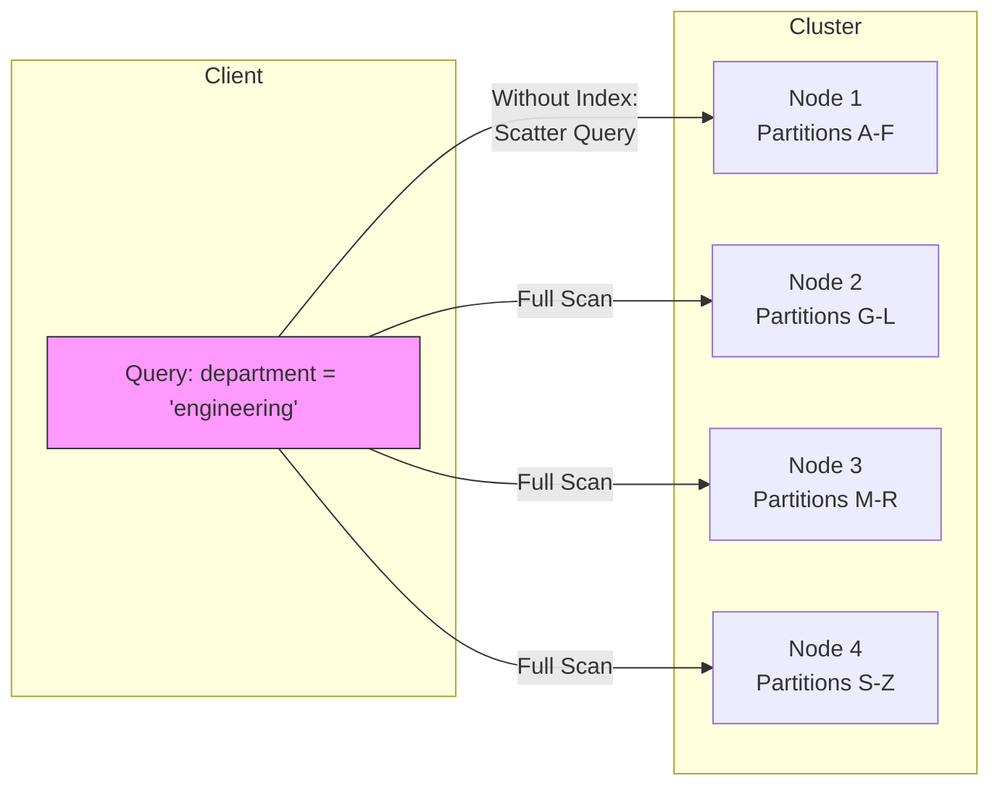
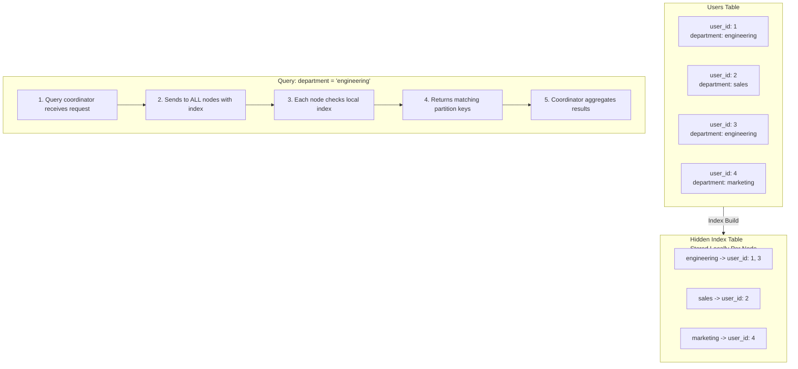
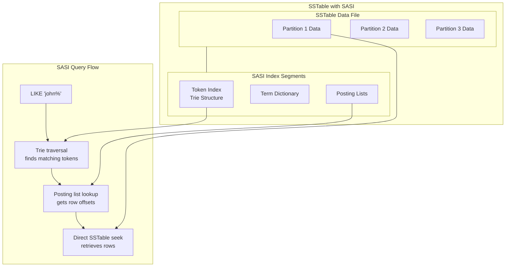
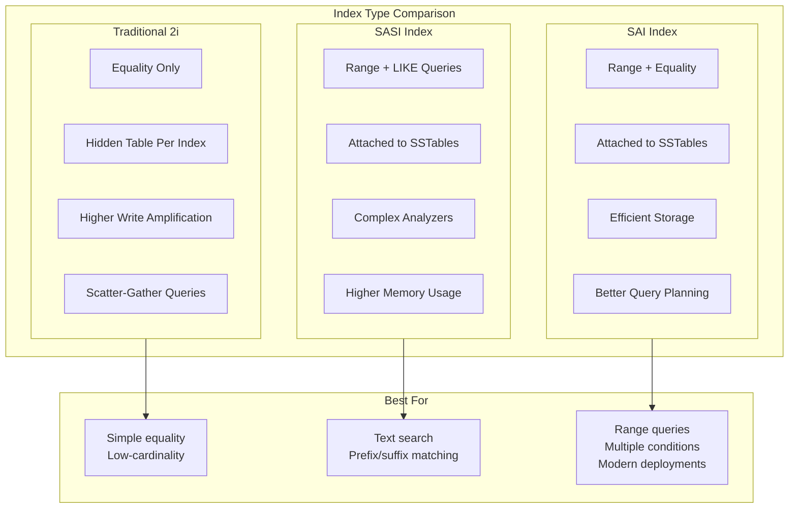
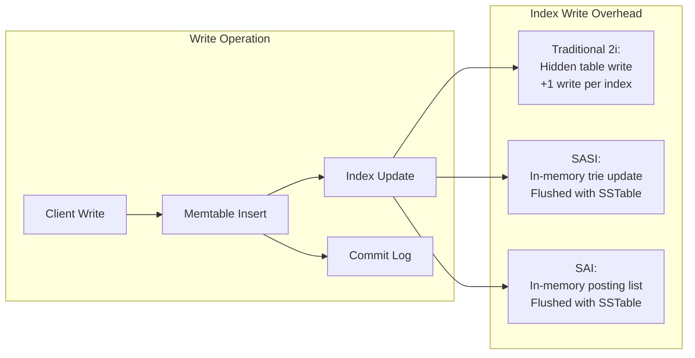
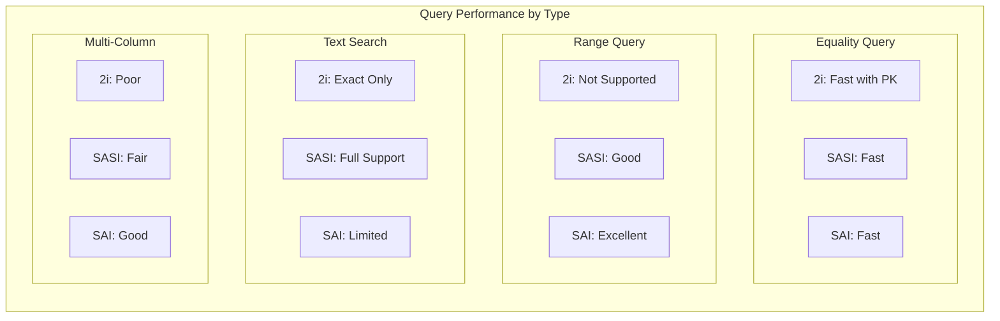
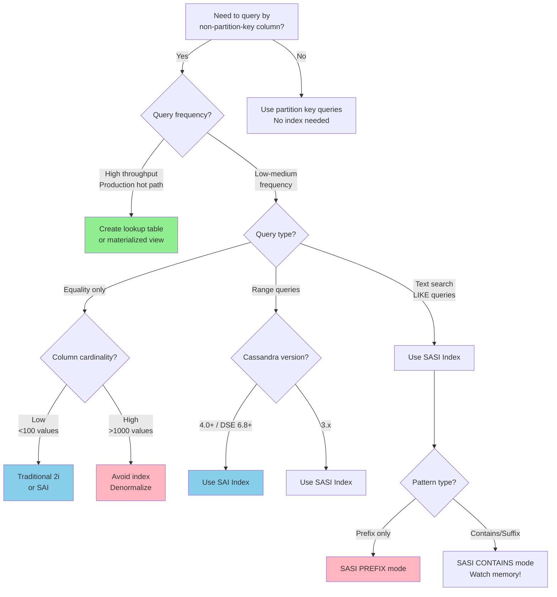
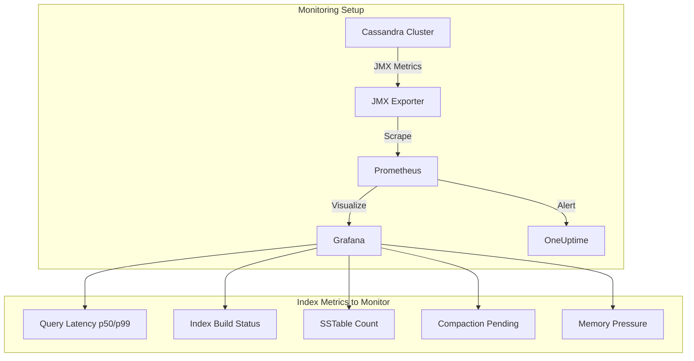

# How to Use Cassandra Secondary Indexes

Author: [nawazdhandala](https://www.github.com/nawazdhandala)

Tags: Cassandra, Database, Secondary Indexes, SASI, SAI, NoSQL, Performance, Query Optimization

Description: A comprehensive guide to using secondary indexes in Apache Cassandra, covering traditional secondary indexes, SASI indexes, and Storage-Attached Indexes (SAI), with performance considerations and best practices for production deployments.

---

> "The art of database optimization is knowing when to index and when to denormalize. In Cassandra, this choice can mean the difference between millisecond queries and cluster-killing scans."

Apache Cassandra is designed for high-throughput, low-latency workloads at scale. Its partition-based data model excels when you query by partition key, but what happens when you need to query by non-key columns? This is where secondary indexes come into play, but they come with significant trade-offs that every Cassandra developer must understand.

This guide walks through the three types of secondary indexes in Cassandra, when to use each, and how to avoid the performance pitfalls that catch many teams off guard.

---

## Table of Contents

1. Understanding Cassandra's Data Model
2. When to Use Secondary Indexes
3. Traditional Secondary Indexes (2i)
4. SASI Indexes (SSTable Attached Secondary Indexes)
5. Storage-Attached Indexes (SAI)
6. Performance Implications
7. Index Selection Decision Tree
8. Production Best Practices
9. Monitoring Your Indexes

---

## 1. Understanding Cassandra's Data Model

Before diving into secondary indexes, let's understand why they exist. Cassandra's primary data access pattern is designed around partition keys.

```cql
-- Standard Cassandra table design
-- Queries by partition key (user_id) are fast and scalable
CREATE TABLE users (
    user_id uuid,
    email text,
    username text,
    created_at timestamp,
    department text,
    PRIMARY KEY (user_id)
);

-- This query is efficient - direct partition lookup
SELECT * FROM users WHERE user_id = 123e4567-e89b-12d3-a456-426614174000;

-- This query FAILS without an index
-- Cassandra doesn't know which partitions contain 'engineering'
SELECT * FROM users WHERE department = 'engineering';
-- Error: Cannot execute this query as it might involve data filtering
```

The challenge: Cassandra distributes data across nodes based on the partition key hash. Without knowing the partition key, a query must scan all nodes, which defeats Cassandra's distributed architecture.



---

## 2. When to Use Secondary Indexes

Secondary indexes are appropriate in specific scenarios. Using them incorrectly can devastate cluster performance.

### Good Use Cases

```cql
-- Low-cardinality columns (few distinct values)
-- Example: status field with ~5 possible values
CREATE INDEX ON orders (status);

-- Query pattern: already have partition key, filtering by indexed column
-- This is efficient because Cassandra goes to one partition first
SELECT * FROM orders
WHERE customer_id = ? AND status = 'pending';

-- Infrequent queries that don't justify denormalization
-- Analytics or admin queries, not production hot paths
```

### Bad Use Cases

```cql
-- High-cardinality columns (many distinct values)
-- DON'T DO THIS - email is nearly unique per user
CREATE INDEX ON users (email);  -- Anti-pattern!

-- High-throughput production queries
-- If you query by email frequently, create a lookup table instead:
CREATE TABLE users_by_email (
    email text PRIMARY KEY,
    user_id uuid
);

-- Columns with very low cardinality relative to data size
-- DON'T DO THIS - boolean with massive imbalance
CREATE INDEX ON events (is_processed);  -- Anti-pattern!
-- Better: Use a separate table for unprocessed events
```

### Decision Matrix

| Scenario | Recommendation |
|----------|----------------|
| Query by partition key + filter column | Secondary index acceptable |
| High-throughput lookups by non-key column | Create materialized view or lookup table |
| Low-cardinality column (<100 values) | Secondary index works well |
| High-cardinality column (>10K values) | Avoid index, denormalize instead |
| Range queries on non-key columns | Use SASI or SAI |
| Full-text search requirements | Use SASI with analyzed mode |

---

## 3. Traditional Secondary Indexes (2i)

Traditional secondary indexes have been available since Cassandra's early versions. They create a hidden table mapping indexed values to partition keys.

### Creating a Traditional Index

```cql
-- Basic secondary index creation
CREATE INDEX idx_users_department ON users (department);

-- Index on a collection column (map keys)
CREATE INDEX idx_user_attributes_keys ON users (KEYS(attributes));

-- Index on collection values
CREATE INDEX idx_user_attributes_values ON users (VALUES(attributes));

-- Index on map entries (both key and value)
CREATE INDEX idx_user_attributes_entries ON users (ENTRIES(attributes));

-- Custom index name for easier management
CREATE INDEX users_department_idx ON users (department);

-- Check existing indexes
DESCRIBE INDEX users_department_idx;
```

### How Traditional Indexes Work Internally



### Querying with Traditional Indexes

```cql
-- Simple equality query (now works with index)
SELECT * FROM users WHERE department = 'engineering';

-- Combined with partition key (most efficient pattern)
-- Cassandra first locates the partition, then filters
SELECT * FROM users
WHERE user_id = ? AND department = 'engineering';

-- Multiple indexed columns (requires ALLOW FILTERING)
-- Use sparingly - this scans more data
SELECT * FROM users
WHERE department = 'engineering'
AND created_at > '2024-01-01'
ALLOW FILTERING;
```

### Limitations of Traditional Indexes

```cql
-- These operations are NOT supported with traditional 2i:

-- Range queries on indexed column
SELECT * FROM users WHERE department > 'e';
-- Error: Only EQ and IN relation are supported

-- LIKE queries
SELECT * FROM users WHERE department LIKE 'eng%';
-- Error: LIKE is not supported

-- For these use cases, consider SASI or SAI indexes
```

---

## 4. SASI Indexes (SSTable Attached Secondary Indexes)

SASI indexes were introduced in Cassandra 3.4 to address traditional index limitations. They attach directly to SSTables and support range queries, prefix searches, and tokenization.

### Enabling SASI

```cql
-- SASI must be enabled in cassandra.yaml (Cassandra 4.0+)
-- sasi_indexes_enabled: true

-- Create a basic SASI index
CREATE CUSTOM INDEX idx_users_email_sasi ON users (email)
USING 'org.apache.cassandra.index.sasi.SASIIndex';

-- SASI with PREFIX mode (for LIKE 'prefix%' queries)
CREATE CUSTOM INDEX idx_users_username_prefix ON users (username)
USING 'org.apache.cassandra.index.sasi.SASIIndex'
WITH OPTIONS = {
    'mode': 'PREFIX'
};

-- SASI with CONTAINS mode (for LIKE '%substring%' queries)
-- More expensive but enables full substring matching
CREATE CUSTOM INDEX idx_users_bio_contains ON users (bio)
USING 'org.apache.cassandra.index.sasi.SASIIndex'
WITH OPTIONS = {
    'mode': 'CONTAINS',
    'analyzer_class': 'org.apache.cassandra.index.sasi.analyzer.StandardAnalyzer',
    'case_sensitive': 'false'
};

-- SASI on numeric column for range queries
CREATE CUSTOM INDEX idx_orders_amount_sasi ON orders (amount)
USING 'org.apache.cassandra.index.sasi.SASIIndex'
WITH OPTIONS = {
    'mode': 'PREFIX'
};
```

### SASI Query Capabilities

```cql
-- Prefix search (fast with PREFIX mode)
SELECT * FROM users WHERE username LIKE 'john%';

-- Suffix search (requires CONTAINS mode, slower)
SELECT * FROM users WHERE username LIKE '%smith';

-- Substring search (requires CONTAINS mode)
SELECT * FROM users WHERE bio LIKE '%kubernetes%';

-- Range queries on indexed columns
SELECT * FROM orders WHERE amount > 100 AND amount < 500;

-- Combining SASI with partition key (optimal)
SELECT * FROM orders
WHERE customer_id = ?
AND amount > 100;

-- Case-insensitive search (with StandardAnalyzer)
SELECT * FROM users WHERE bio LIKE '%Cassandra%';
-- Matches 'cassandra', 'CASSANDRA', 'Cassandra'
```

### SASI Analyzer Options

```cql
-- Standard Analyzer: tokenizes text, case normalization
CREATE CUSTOM INDEX ON articles (content)
USING 'org.apache.cassandra.index.sasi.SASIIndex'
WITH OPTIONS = {
    'mode': 'CONTAINS',
    'analyzer_class': 'org.apache.cassandra.index.sasi.analyzer.StandardAnalyzer',
    'tokenization_enable_stemming': 'true',
    'tokenization_locale': 'en',
    'tokenization_skip_stop_words': 'true',
    'case_sensitive': 'false'
};

-- NonTokenizing Analyzer: treats value as single token
-- Good for exact matching with case insensitivity
CREATE CUSTOM INDEX ON users (email)
USING 'org.apache.cassandra.index.sasi.SASIIndex'
WITH OPTIONS = {
    'mode': 'PREFIX',
    'analyzer_class': 'org.apache.cassandra.index.sasi.analyzer.NonTokenizingAnalyzer',
    'case_sensitive': 'false'
};
```

### SASI Index Architecture



---

## 5. Storage-Attached Indexes (SAI)

Storage-Attached Indexes (SAI) are the newest indexing technology, available in Cassandra 4.0+ and DataStax Enterprise. SAI combines the best aspects of traditional indexes and SASI while improving performance and reducing storage overhead.

### Creating SAI Indexes

```cql
-- SAI must be enabled (default in Cassandra 5.0+)
-- In cassandra.yaml: sai_indexes_enabled: true

-- Basic SAI index
CREATE CUSTOM INDEX idx_users_dept_sai ON users (department)
USING 'StorageAttachedIndex';

-- SAI with case-insensitive matching
CREATE CUSTOM INDEX idx_users_name_sai ON users (name)
USING 'StorageAttachedIndex'
WITH OPTIONS = {
    'case_sensitive': 'false',
    'normalize': 'true'
};

-- SAI on numeric column (excellent for range queries)
CREATE CUSTOM INDEX idx_orders_total_sai ON orders (total_amount)
USING 'StorageAttachedIndex';

-- SAI on timestamp column
CREATE CUSTOM INDEX idx_events_time_sai ON events (event_time)
USING 'StorageAttachedIndex';

-- SAI on collection columns
CREATE CUSTOM INDEX idx_tags_sai ON articles (tags)
USING 'StorageAttachedIndex';
```

### SAI Query Examples

```cql
-- Equality queries
SELECT * FROM users WHERE department = 'engineering';

-- Range queries (SAI excels here)
SELECT * FROM orders
WHERE total_amount >= 100.00
AND total_amount < 1000.00;

-- Timestamp ranges
SELECT * FROM events
WHERE event_time >= '2024-01-01'
AND event_time < '2024-02-01';

-- Multiple SAI indexes in one query
-- SAI handles this efficiently with index intersection
SELECT * FROM orders
WHERE status = 'shipped'
AND total_amount > 500
AND created_at > '2024-01-01';

-- Collection contains
SELECT * FROM articles WHERE tags CONTAINS 'cassandra';

-- Combining with partition key (always preferred)
SELECT * FROM orders
WHERE customer_id = ?
AND status = 'pending'
AND total_amount > 100;
```

### SAI vs SASI vs Traditional Index



### SAI Index Internals

```cql
-- View SAI index details
SELECT * FROM system_schema.indexes
WHERE keyspace_name = 'my_keyspace';

-- SAI stores index data in the same SSTable structure
-- Benefits:
-- 1. No separate index tables (lower storage overhead)
-- 2. Compaction includes index data (consistent cleanup)
-- 3. Efficient memory usage with on-disk structures

-- SAI creates these components per SSTable:
-- - Term dictionary (sorted terms)
-- - Posting lists (row IDs per term)
-- - Numeric KD-trees (for range queries)
-- - Column index (for quick term lookups)
```

---

## 6. Performance Implications

Understanding the performance characteristics of each index type is critical for production deployments.

### Write Path Impact



### Read Path Performance

```python
# Performance characteristics by index type and query pattern

# Traditional Secondary Index (2i)
# - Scatter-gather to all nodes
# - Good: low-cardinality + partition key
# - Bad: high-cardinality standalone queries
performance_2i = {
    "equality_with_partition_key": "O(1) - single partition",
    "equality_without_partition_key": "O(N) - all nodes queried",
    "range_queries": "Not supported",
    "write_overhead": "High (separate table writes)"
}

# SASI Index
# - Local index per SSTable
# - Good: prefix/contains searches
# - Bad: high memory during compaction
performance_sasi = {
    "equality_queries": "O(log n) per SSTable",
    "prefix_like": "O(log n) - trie traversal",
    "contains_like": "O(n) - full term scan",
    "range_queries": "O(log n) - efficient",
    "write_overhead": "Medium (trie maintenance)"
}

# SAI Index
# - Modern design, balanced trade-offs
# - Good: range queries, multiple conditions
# - Better memory efficiency than SASI
performance_sai = {
    "equality_queries": "O(log n) per SSTable",
    "range_queries": "O(log n) - KD-tree",
    "multi_column": "Efficient index intersection",
    "write_overhead": "Low-Medium"
}
```

### Memory and Storage Overhead

```cql
-- Check index sizes
SELECT index_name,
       space_used_total,
       mean_partition_size
FROM system.size_estimates
WHERE keyspace_name = 'my_keyspace';

-- SASI memory considerations:
-- - CONTAINS mode builds full in-memory trie during compaction
-- - Can cause OOM on large datasets
-- - Consider max_memory_mb option:
CREATE CUSTOM INDEX ON large_table (column)
USING 'org.apache.cassandra.index.sasi.SASIIndex'
WITH OPTIONS = {
    'mode': 'PREFIX',
    'max_memory_mb': '256'
};

-- SAI is more memory-efficient:
-- - Uses on-disk structures with memory-mapped access
-- - Better for large datasets
-- - Configurable in cassandra.yaml:
-- sai_max_rows_per_segment: 10000
```

### Query Performance Comparison



---

## 7. Index Selection Decision Tree

Use this decision tree to choose the right index type for your use case.



---

## 8. Production Best Practices

### Index Creation Guidelines

```cql
-- 1. Always test index creation on staging first
-- Index building can impact cluster performance

-- 2. Create indexes during low-traffic periods
-- Use IF NOT EXISTS to make scripts idempotent
CREATE INDEX IF NOT EXISTS idx_orders_status
ON orders (status);

-- 3. Monitor index build progress
SELECT * FROM system.index_build_status;

-- 4. For large tables, consider streaming index build
-- In cassandra.yaml:
-- concurrent_index_builders: 2

-- 5. Set appropriate index options for your workload
CREATE CUSTOM INDEX idx_logs_level ON logs (level)
USING 'StorageAttachedIndex'
WITH OPTIONS = {
    'case_sensitive': 'true'  -- Avoid unnecessary case conversion
};
```

### Query Optimization with Indexes

```cql
-- GOOD: Combine index with partition key
-- This queries one partition, then filters
SELECT * FROM orders
WHERE customer_id = ?      -- Partition key first
AND status = 'pending'     -- Indexed column filter
LIMIT 100;                 -- Always use LIMIT

-- GOOD: Use specific value ranges
SELECT * FROM orders
WHERE customer_id = ?
AND total > 100 AND total < 500;  -- Bounded range

-- BAD: Open-ended queries without partition key
SELECT * FROM orders WHERE status = 'pending';
-- This hits ALL nodes!

-- BAD: Unbounded results
SELECT * FROM orders WHERE status = 'pending';
-- Add LIMIT to prevent memory issues

-- Use TRACING to analyze query performance
TRACING ON;
SELECT * FROM orders
WHERE customer_id = ? AND status = 'pending';
TRACING OFF;
```

### Capacity Planning

```python
# Estimate index storage overhead

def estimate_index_size(
    row_count: int,
    indexed_column_avg_size: int,
    index_type: str
) -> dict:
    """
    Rough estimates for index storage requirements.
    Actual values depend on data distribution.
    """

    if index_type == "traditional_2i":
        # Hidden table stores (indexed_value, primary_key) tuples
        overhead_ratio = 0.3  # ~30% of indexed column data

    elif index_type == "sasi":
        # Trie + posting lists, varies by mode
        overhead_ratio = 0.5  # ~50% for PREFIX mode
        # CONTAINS mode can be 2-3x higher

    elif index_type == "sai":
        # Most efficient storage
        overhead_ratio = 0.2  # ~20% typical

    estimated_bytes = row_count * indexed_column_avg_size * overhead_ratio

    return {
        "estimated_size_mb": estimated_bytes / (1024 * 1024),
        "recommendation": "Monitor actual size after deployment"
    }

# Example calculation
print(estimate_index_size(
    row_count=10_000_000,
    indexed_column_avg_size=50,  # 50 bytes average
    index_type="sai"
))
# Output: {'estimated_size_mb': 95.37, 'recommendation': '...'}
```

### Anti-Patterns to Avoid

```cql
-- ANTI-PATTERN 1: Indexing high-cardinality unique columns
CREATE INDEX ON users (user_id);      -- user_id is already the key!
CREATE INDEX ON users (email);        -- Nearly unique - bad!
CREATE INDEX ON users (session_id);   -- Definitely unique - bad!

-- ANTI-PATTERN 2: Indexing extremely low-cardinality
CREATE INDEX ON events (is_processed);  -- Only true/false
-- Better: Separate table for unprocessed events

-- ANTI-PATTERN 3: Too many indexes on one table
-- Each index adds write overhead
-- Limit to 3-5 indexes per table maximum

-- ANTI-PATTERN 4: Using ALLOW FILTERING in production
SELECT * FROM orders
WHERE amount > 100
ALLOW FILTERING;  -- DANGEROUS in production!

-- ANTI-PATTERN 5: SASI CONTAINS on large text fields
CREATE CUSTOM INDEX ON articles (full_text)
USING 'org.apache.cassandra.index.sasi.SASIIndex'
WITH OPTIONS = {'mode': 'CONTAINS'};
-- This can OOM during compaction!
```

---

## 9. Monitoring Your Indexes

Effective monitoring is essential for maintaining healthy indexes in production.

### Key Metrics to Track

```cql
-- Query latency by index
SELECT * FROM system_views.local_read_latency
WHERE table_name = 'my_table';

-- Index-specific metrics (DSE/Cassandra 4.0+)
nodetool tablestats my_keyspace.my_table

-- Check for index build status
SELECT * FROM system.index_build_status;

-- SASI-specific: memory pressure during compaction
nodetool tpstats | grep -i index
```

### Setting Up Alerting

```yaml
# Prometheus alerting rules for Cassandra indexes
# Add to your prometheus rules configuration

groups:
  - name: cassandra_index_alerts
    rules:
      # Alert on slow index queries
      - alert: CassandraSlowIndexQuery
        expr: cassandra_table_read_latency_p99{table="my_table"} > 100
        for: 5m
        labels:
          severity: warning
        annotations:
          summary: "Slow index queries detected on {{ $labels.table }}"

      # Alert on index build failures
      - alert: CassandraIndexBuildFailed
        expr: cassandra_index_build_status == 0
        for: 1m
        labels:
          severity: critical
        annotations:
          summary: "Index build failed on {{ $labels.index_name }}"
```

### Index Health Dashboard



For comprehensive monitoring of your Cassandra cluster and indexes, consider using [OneUptime](https://oneuptime.com) which provides real-time metrics visualization, alerting, and incident management. OneUptime can ingest Cassandra metrics via OpenTelemetry, giving you a unified view of database performance alongside your application metrics.

---

## Summary

| Index Type | Best For | Avoid When |
|------------|----------|------------|
| Traditional 2i | Low-cardinality equality queries with partition key | High-cardinality, standalone queries, range queries |
| SASI | Text search, prefix matching, range queries (legacy) | Large CONTAINS indexes, memory-constrained environments |
| SAI | Range queries, multi-column conditions, modern deployments | Cassandra < 4.0 (not available) |

Key takeaways:

1. **Always question if you need an index** - denormalization is often better for high-throughput queries
2. **Combine indexes with partition keys** - this dramatically improves query efficiency
3. **Choose SAI for new deployments** - it offers the best balance of features and performance
4. **Monitor index performance** - track latencies and storage overhead
5. **Limit indexes per table** - 3-5 indexes maximum to control write amplification

---

## Further Reading

- [Apache Cassandra Documentation - Secondary Indexes](https://cassandra.apache.org/doc/latest/cassandra/cql/indexes.html)
- [DataStax SAI Documentation](https://docs.datastax.com/en/dse/6.8/cql/cql/cql_using/cql_indexing/saiUsing.html)
- [Cassandra Data Modeling Best Practices](https://cassandra.apache.org/doc/latest/cassandra/data_modeling/)

---

*Need visibility into your Cassandra cluster performance? [OneUptime](https://oneuptime.com) provides comprehensive database monitoring with support for custom metrics, alerting, and incident management. Track query latencies, index performance, and cluster health in one unified platform.*
