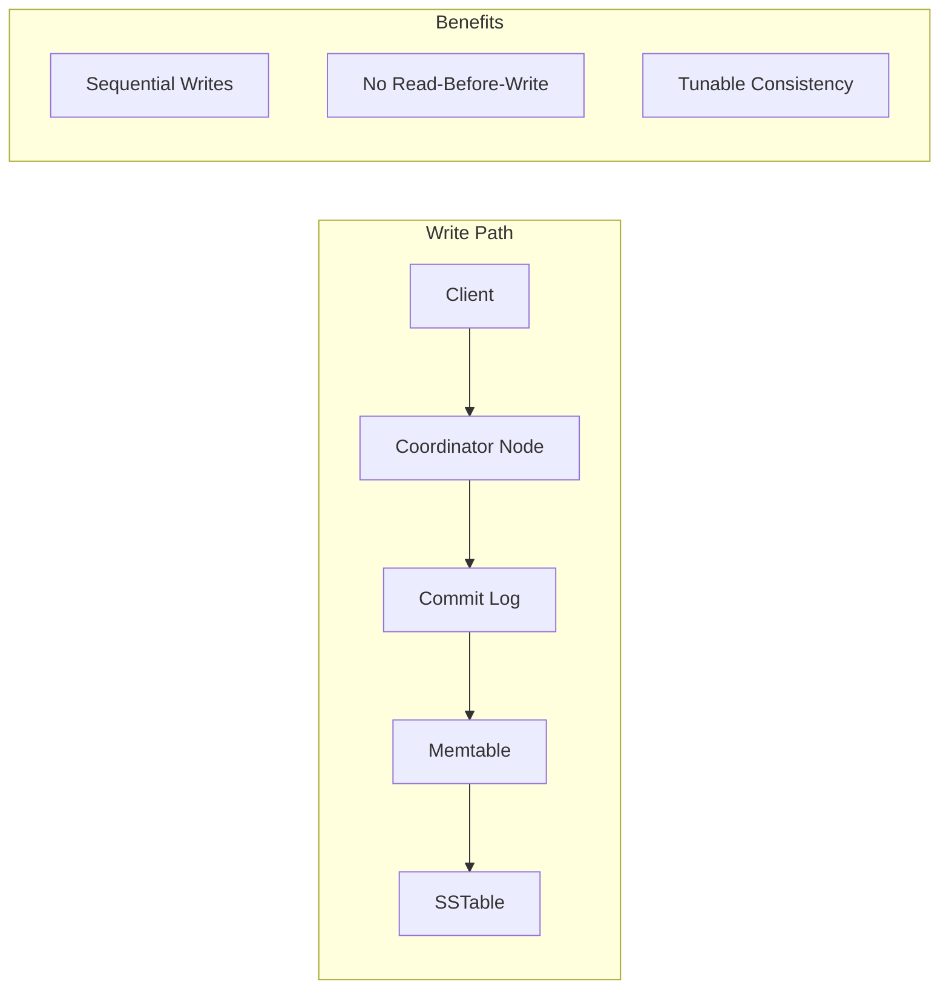
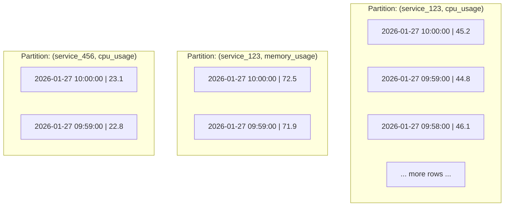
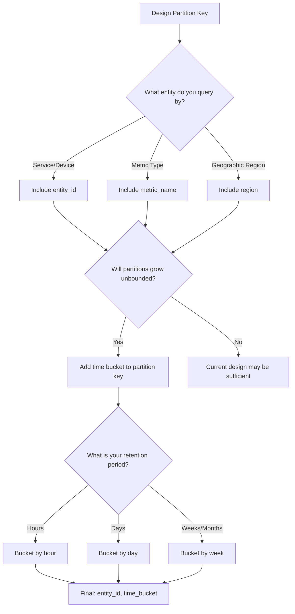
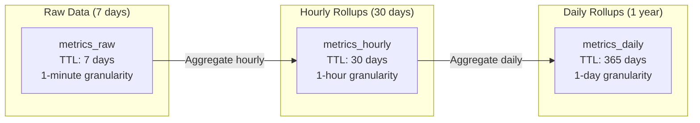
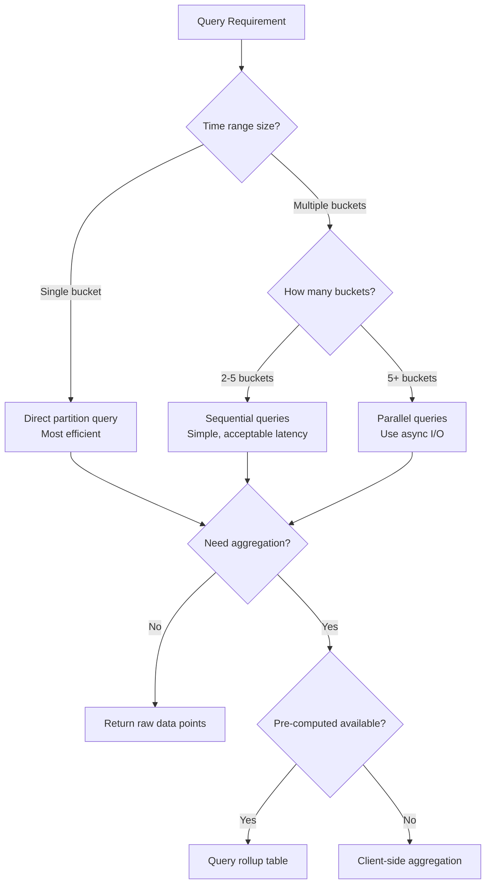

# How to Use Cassandra with Time-Series Data

Author: [nawazdhandala](https://www.github.com/nawazdhandala)

Tags: Cassandra, Time-Series, Database, NoSQL, Data Modeling, Performance, Observability

Description: A comprehensive guide to modeling, storing, and querying time-series data in Apache Cassandra. Learn partition key design, time-based bucketing strategies, TTL for automatic expiration, and query patterns for high-performance time-series workloads.

---

> Time-series data is the lifeblood of observability. Cassandra's write-optimized architecture and tunable consistency make it an excellent choice for storing metrics, logs, and events at scale - but only if you model your data correctly.

Apache Cassandra excels at handling time-series workloads due to its distributed architecture, linear scalability, and optimized write path. However, getting the data model right is critical. A poorly designed schema can lead to hot partitions, unbounded partition growth, and query timeouts.

This guide walks you through practical patterns for modeling time-series data in Cassandra, from partition key design to TTL-based data expiration.

---

## Table of Contents

1. Why Cassandra for Time-Series Data
2. Time-Series Data Modeling Fundamentals
3. Partition Key Design for Time-Series
4. Time-Based Bucketing Strategies
5. TTL for Automatic Data Expiration
6. Query Patterns for Time-Series Data
7. Best Practices Summary
8. Conclusion

---

## 1. Why Cassandra for Time-Series Data

Cassandra's architecture provides several advantages for time-series workloads:



| Feature | Benefit for Time-Series |
|---------|------------------------|
| Write-optimized | Handles high ingestion rates (millions of writes/second) |
| Linear scalability | Add nodes to increase capacity without downtime |
| No single point of failure | Data replicated across multiple nodes |
| TTL support | Automatic data expiration without manual cleanup |
| Wide rows | Efficient storage of related time-series points |
| Tunable consistency | Trade consistency for availability based on use case |

---

## 2. Time-Series Data Modeling Fundamentals

In Cassandra, your data model is driven by your query patterns, not your entity relationships. For time-series data, you typically query by:

1. A specific entity (sensor, server, user)
2. A time range (last hour, last day, specific window)

### Basic Time-Series Table Structure

```sql
-- Basic time-series table for metrics
-- This design stores metrics for monitored services
CREATE TABLE IF NOT EXISTS metrics (
    -- Partition key: identifies the metric source
    service_id UUID,
    metric_name TEXT,

    -- Clustering column: orders data within the partition
    -- DESC ensures newest data is read first (most common query pattern)
    timestamp TIMESTAMP,

    -- Metric values
    value DOUBLE,
    tags MAP<TEXT, TEXT>,

    -- Primary key combines partition key and clustering columns
    -- (service_id, metric_name) = partition key
    -- timestamp = clustering column
    PRIMARY KEY ((service_id, metric_name), timestamp)
) WITH CLUSTERING ORDER BY (timestamp DESC);
```

### Understanding the Data Layout



**Key insight**: Data within a partition is stored contiguously on disk. Queries that read from a single partition are fast. Queries that span many partitions require coordinating reads across multiple nodes.

---

## 3. Partition Key Design for Time-Series

The partition key determines data distribution across the cluster. Poor partition key design leads to:

- **Hot partitions**: One node handles disproportionate load
- **Unbounded growth**: Partitions grow indefinitely, causing performance degradation
- **Query inefficiency**: Scanning many small partitions instead of reading one

### Anti-Pattern: Time-Only Partition Key

```sql
-- BAD: All data for a given day goes to the same partition
-- This creates hot partitions during high-traffic periods
CREATE TABLE metrics_bad (
    day DATE,
    timestamp TIMESTAMP,
    service_id UUID,
    metric_name TEXT,
    value DOUBLE,
    PRIMARY KEY (day, timestamp, service_id, metric_name)
);

-- Problem: If you have 1000 services writing every second,
-- that's 86.4 million rows per partition per day!
```

### Better: Composite Partition Key

```sql
-- GOOD: Distribute data by entity AND time bucket
-- Each service's metrics for each day are in their own partition
CREATE TABLE metrics_by_service (
    service_id UUID,
    metric_name TEXT,
    day DATE,                    -- Time bucket (daily)
    timestamp TIMESTAMP,
    value DOUBLE,
    tags MAP<TEXT, TEXT>,

    -- Composite partition key includes time bucket
    PRIMARY KEY ((service_id, metric_name, day), timestamp)
) WITH CLUSTERING ORDER BY (timestamp DESC);
```

### Partition Key Selection Guide



---

## 4. Time-Based Bucketing Strategies

Time bucketing prevents unbounded partition growth by including a time component in the partition key.

### Hourly Bucketing (High-Frequency Data)

```sql
-- For data with sub-second granularity (logs, events, traces)
-- Each partition contains up to 1 hour of data
CREATE TABLE events_hourly (
    service_id UUID,
    event_type TEXT,
    -- Hour bucket: truncate timestamp to hour
    bucket_hour TIMESTAMP,
    -- Full timestamp for ordering within partition
    event_time TIMESTAMP,
    event_id TIMEUUID,
    payload TEXT,

    PRIMARY KEY ((service_id, event_type, bucket_hour), event_time, event_id)
) WITH CLUSTERING ORDER BY (event_time DESC, event_id DESC);
```

```python
# Python: Calculate hour bucket for inserts and queries
from datetime import datetime, timedelta

def get_hour_bucket(timestamp: datetime) -> datetime:
    """
    Truncate timestamp to the start of its hour.
    Used for both inserting and querying data.
    """
    return timestamp.replace(minute=0, second=0, microsecond=0)

def get_hour_buckets_for_range(start: datetime, end: datetime) -> list[datetime]:
    """
    Generate all hour buckets needed to cover a time range.
    Used when querying across multiple hours.
    """
    buckets = []
    current = get_hour_bucket(start)
    end_bucket = get_hour_bucket(end)

    while current <= end_bucket:
        buckets.append(current)
        current += timedelta(hours=1)

    return buckets

# Example usage
now = datetime(2026, 1, 27, 14, 35, 22)
bucket = get_hour_bucket(now)  # 2026-01-27 14:00:00

# Query last 3 hours
start = now - timedelta(hours=3)
buckets = get_hour_buckets_for_range(start, now)
# Returns: [2026-01-27 11:00:00, 2026-01-27 12:00:00,
#           2026-01-27 13:00:00, 2026-01-27 14:00:00]
```

### Daily Bucketing (Metrics and Aggregates)

```sql
-- For minute-level metrics (typical monitoring data)
-- Each partition contains up to 1 day of data (1440 points at 1-minute intervals)
CREATE TABLE metrics_daily (
    service_id UUID,
    metric_name TEXT,
    -- Day bucket: date only, no time component
    bucket_date DATE,
    timestamp TIMESTAMP,
    value DOUBLE,

    -- Statistical aggregates for the data point
    min_value DOUBLE,
    max_value DOUBLE,
    count INT,

    PRIMARY KEY ((service_id, metric_name, bucket_date), timestamp)
) WITH CLUSTERING ORDER BY (timestamp DESC);
```

```java
// Java: Daily bucket calculation with Cassandra driver
import com.datastax.oss.driver.api.core.CqlSession;
import com.datastax.oss.driver.api.core.cql.PreparedStatement;
import com.datastax.oss.driver.api.core.cql.ResultSet;
import java.time.LocalDate;
import java.time.Instant;
import java.time.ZoneOffset;
import java.util.ArrayList;
import java.util.List;
import java.util.UUID;

public class MetricsRepository {
    private final CqlSession session;
    private final PreparedStatement insertStmt;
    private final PreparedStatement selectStmt;

    public MetricsRepository(CqlSession session) {
        this.session = session;

        // Prepare statements once, reuse for all operations
        // This avoids parsing overhead on each query
        this.insertStmt = session.prepare(
            "INSERT INTO metrics_daily " +
            "(service_id, metric_name, bucket_date, timestamp, value) " +
            "VALUES (?, ?, ?, ?, ?)"
        );

        this.selectStmt = session.prepare(
            "SELECT timestamp, value FROM metrics_daily " +
            "WHERE service_id = ? AND metric_name = ? " +
            "AND bucket_date = ? AND timestamp >= ? AND timestamp <= ?"
        );
    }

    /**
     * Insert a metric data point.
     * The bucket_date is derived from the timestamp.
     */
    public void insertMetric(UUID serviceId, String metricName,
                            Instant timestamp, double value) {
        // Calculate daily bucket from timestamp
        LocalDate bucketDate = timestamp.atOffset(ZoneOffset.UTC).toLocalDate();

        session.execute(insertStmt.bind(
            serviceId,
            metricName,
            bucketDate,
            timestamp,
            value
        ));
    }

    /**
     * Query metrics for a time range.
     * Automatically handles spanning multiple daily buckets.
     */
    public List<MetricPoint> queryRange(UUID serviceId, String metricName,
                                        Instant start, Instant end) {
        List<MetricPoint> results = new ArrayList<>();

        // Generate all daily buckets in the range
        LocalDate startDate = start.atOffset(ZoneOffset.UTC).toLocalDate();
        LocalDate endDate = end.atOffset(ZoneOffset.UTC).toLocalDate();

        // Query each bucket and merge results
        for (LocalDate date = startDate; !date.isAfter(endDate);
             date = date.plusDays(1)) {
            ResultSet rs = session.execute(selectStmt.bind(
                serviceId, metricName, date, start, end
            ));

            rs.forEach(row -> results.add(new MetricPoint(
                row.getInstant("timestamp"),
                row.getDouble("value")
            )));
        }

        return results;
    }
}
```

### Bucket Size Selection Matrix

| Data Frequency | Retention | Recommended Bucket | Max Rows/Partition |
|---------------|-----------|-------------------|-------------------|
| Sub-second (logs) | Hours | 1 hour | ~3,600,000 |
| Per-second (events) | Days | 1 hour | ~3,600 |
| Per-minute (metrics) | Weeks | 1 day | ~1,440 |
| Per-hour (aggregates) | Months | 1 week | ~168 |
| Daily (reports) | Years | 1 month | ~31 |

**Rule of thumb**: Keep partitions under 100MB and under 100,000 rows for optimal performance.

---

## 5. TTL for Automatic Data Expiration

Cassandra's TTL (Time To Live) feature automatically deletes data after a specified duration. This is essential for time-series data to prevent unbounded storage growth.

### Setting TTL at Insert Time

```sql
-- Insert with 7-day TTL (604800 seconds)
-- Data will be automatically tombstoned after 7 days
INSERT INTO metrics_daily (
    service_id, metric_name, bucket_date, timestamp, value
) VALUES (
    123e4567-e89b-12d3-a456-426614174000,
    'cpu_usage',
    '2026-01-27',
    '2026-01-27 10:00:00',
    45.2
) USING TTL 604800;
```

### Table-Level Default TTL

```sql
-- Set default TTL for all inserts to this table
-- Individual inserts can still override with USING TTL
CREATE TABLE metrics_with_ttl (
    service_id UUID,
    metric_name TEXT,
    bucket_date DATE,
    timestamp TIMESTAMP,
    value DOUBLE,
    PRIMARY KEY ((service_id, metric_name, bucket_date), timestamp)
) WITH CLUSTERING ORDER BY (timestamp DESC)
  AND default_time_to_live = 604800  -- 7 days in seconds
  AND gc_grace_seconds = 86400;      -- 1 day grace period for tombstones
```

### Tiered Retention with Multiple Tables



```sql
-- Raw metrics: 7-day retention, full granularity
CREATE TABLE metrics_raw (
    service_id UUID,
    metric_name TEXT,
    bucket_hour TIMESTAMP,
    timestamp TIMESTAMP,
    value DOUBLE,
    PRIMARY KEY ((service_id, metric_name, bucket_hour), timestamp)
) WITH CLUSTERING ORDER BY (timestamp DESC)
  AND default_time_to_live = 604800;  -- 7 days

-- Hourly rollups: 30-day retention
CREATE TABLE metrics_hourly (
    service_id UUID,
    metric_name TEXT,
    bucket_date DATE,
    hour TIMESTAMP,
    avg_value DOUBLE,
    min_value DOUBLE,
    max_value DOUBLE,
    count BIGINT,
    PRIMARY KEY ((service_id, metric_name, bucket_date), hour)
) WITH CLUSTERING ORDER BY (hour DESC)
  AND default_time_to_live = 2592000;  -- 30 days

-- Daily rollups: 1-year retention
CREATE TABLE metrics_daily_rollup (
    service_id UUID,
    metric_name TEXT,
    bucket_month TEXT,  -- Format: '2026-01'
    day DATE,
    avg_value DOUBLE,
    min_value DOUBLE,
    max_value DOUBLE,
    count BIGINT,
    p50 DOUBLE,
    p95 DOUBLE,
    p99 DOUBLE,
    PRIMARY KEY ((service_id, metric_name, bucket_month), day)
) WITH CLUSTERING ORDER BY (day DESC)
  AND default_time_to_live = 31536000;  -- 365 days
```

### TTL Best Practices

```python
# Python: Managing TTL in application code
from cassandra.cluster import Cluster
from datetime import datetime, timedelta

class TimeSeriesWriter:
    # Define retention policies in seconds
    RETENTION_POLICIES = {
        'raw': 7 * 24 * 3600,      # 7 days
        'hourly': 30 * 24 * 3600,  # 30 days
        'daily': 365 * 24 * 3600,  # 1 year
    }

    def __init__(self, session):
        self.session = session

        # Prepare statements with TTL placeholder
        self.insert_raw = session.prepare(
            "INSERT INTO metrics_raw "
            "(service_id, metric_name, bucket_hour, timestamp, value) "
            "VALUES (?, ?, ?, ?, ?) "
            "USING TTL ?"
        )

    def write_metric(self, service_id: str, metric_name: str,
                     timestamp: datetime, value: float,
                     retention_tier: str = 'raw'):
        """
        Write a metric with appropriate TTL based on retention tier.

        The TTL ensures data is automatically cleaned up,
        preventing unbounded storage growth.
        """
        ttl = self.RETENTION_POLICIES.get(retention_tier,
                                          self.RETENTION_POLICIES['raw'])

        bucket_hour = timestamp.replace(minute=0, second=0, microsecond=0)

        self.session.execute(self.insert_raw.bind([
            service_id,
            metric_name,
            bucket_hour,
            timestamp,
            value,
            ttl  # TTL in seconds
        ]))

    def write_batch_with_ttl(self, metrics: list, retention_tier: str = 'raw'):
        """
        Batch write metrics with consistent TTL.

        Using batches for metrics going to the SAME partition
        can improve performance. Avoid batching across partitions.
        """
        from cassandra.query import BatchStatement, BatchType

        ttl = self.RETENTION_POLICIES[retention_tier]

        # Group metrics by partition key for efficient batching
        partitions = {}
        for m in metrics:
            bucket = m['timestamp'].replace(minute=0, second=0, microsecond=0)
            key = (m['service_id'], m['metric_name'], bucket)
            if key not in partitions:
                partitions[key] = []
            partitions[key].append(m)

        # Execute one batch per partition
        for partition_key, partition_metrics in partitions.items():
            batch = BatchStatement(batch_type=BatchType.UNLOGGED)
            for m in partition_metrics:
                batch.add(self.insert_raw.bind([
                    m['service_id'],
                    m['metric_name'],
                    partition_key[2],  # bucket_hour
                    m['timestamp'],
                    m['value'],
                    ttl
                ]))
            self.session.execute(batch)
```

---

## 6. Query Patterns for Time-Series Data

Cassandra query patterns must align with your data model. Here are common patterns for time-series data.

### Pattern 1: Latest N Points

```sql
-- Get the 100 most recent metrics for a service
-- Efficient because it reads from one partition with LIMIT
SELECT timestamp, value
FROM metrics_daily
WHERE service_id = 123e4567-e89b-12d3-a456-426614174000
  AND metric_name = 'cpu_usage'
  AND bucket_date = '2026-01-27'
ORDER BY timestamp DESC
LIMIT 100;
```

### Pattern 2: Time Range Query (Single Partition)

```sql
-- Query metrics within a specific time window
-- Efficient when the range falls within one bucket
SELECT timestamp, value
FROM metrics_daily
WHERE service_id = 123e4567-e89b-12d3-a456-426614174000
  AND metric_name = 'cpu_usage'
  AND bucket_date = '2026-01-27'
  AND timestamp >= '2026-01-27 09:00:00'
  AND timestamp <= '2026-01-27 10:00:00';
```

### Pattern 3: Time Range Query (Multiple Partitions)

```python
# Python: Query across multiple time buckets
# This requires querying each partition separately and merging results
import asyncio
from cassandra.cluster import Cluster
from cassandra.query import SimpleStatement
from datetime import datetime, timedelta
from typing import List, Dict, Any

class TimeSeriesReader:
    def __init__(self, session):
        self.session = session

        # Prepare the query once
        self.range_query = session.prepare(
            "SELECT timestamp, value FROM metrics_daily "
            "WHERE service_id = ? AND metric_name = ? "
            "AND bucket_date = ? "
            "AND timestamp >= ? AND timestamp <= ?"
        )

    def query_time_range(
        self,
        service_id: str,
        metric_name: str,
        start: datetime,
        end: datetime
    ) -> List[Dict[str, Any]]:
        """
        Query metrics across a time range that may span multiple partitions.

        Strategy:
        1. Calculate all daily buckets in the range
        2. Query each bucket (can be parallelized)
        3. Merge and sort results
        """
        results = []

        # Generate all daily buckets
        current_date = start.date()
        end_date = end.date()

        while current_date <= end_date:
            # Execute query for this partition
            rows = self.session.execute(self.range_query.bind([
                service_id,
                metric_name,
                current_date,
                start,
                end
            ]))

            for row in rows:
                results.append({
                    'timestamp': row.timestamp,
                    'value': row.value
                })

            current_date += timedelta(days=1)

        # Results are already sorted within partitions,
        # but we need to merge-sort across partitions
        results.sort(key=lambda x: x['timestamp'], reverse=True)

        return results

    async def query_time_range_parallel(
        self,
        service_id: str,
        metric_name: str,
        start: datetime,
        end: datetime
    ) -> List[Dict[str, Any]]:
        """
        Parallel version for better performance on large ranges.

        Queries multiple partitions concurrently using async I/O.
        Useful when querying across many days/weeks.
        """
        from cassandra.cluster import Session

        # Generate bucket dates
        bucket_dates = []
        current = start.date()
        while current <= end.date():
            bucket_dates.append(current)
            current += timedelta(days=1)

        # Create async tasks for each bucket
        async def query_bucket(bucket_date):
            # Note: In production, use async Cassandra driver
            rows = self.session.execute(self.range_query.bind([
                service_id, metric_name, bucket_date, start, end
            ]))
            return [{'timestamp': r.timestamp, 'value': r.value} for r in rows]

        # Execute all queries concurrently
        tasks = [query_bucket(d) for d in bucket_dates]
        partition_results = await asyncio.gather(*tasks)

        # Flatten and sort
        results = [item for sublist in partition_results for item in sublist]
        results.sort(key=lambda x: x['timestamp'], reverse=True)

        return results
```

### Pattern 4: Aggregation Queries

```python
# Python: Client-side aggregation for time-series data
# Cassandra does not support complex aggregations, so we compute them client-side
from dataclasses import dataclass
from typing import List, Optional
import statistics

@dataclass
class AggregatedMetrics:
    """Computed statistics for a time range."""
    count: int
    min_value: float
    max_value: float
    avg_value: float
    sum_value: float
    p50: float  # median
    p95: float
    p99: float

def aggregate_metrics(values: List[float]) -> Optional[AggregatedMetrics]:
    """
    Compute aggregations on metric values.

    For large datasets, consider:
    1. Pre-computing aggregates during ingestion
    2. Using a separate analytics database (ClickHouse, TimescaleDB)
    3. Streaming aggregation with Kafka Streams or Flink
    """
    if not values:
        return None

    sorted_values = sorted(values)
    n = len(sorted_values)

    def percentile(p: float) -> float:
        """Calculate percentile using linear interpolation."""
        k = (n - 1) * p / 100
        f = int(k)
        c = f + 1 if f + 1 < n else f
        return sorted_values[f] + (k - f) * (sorted_values[c] - sorted_values[f])

    return AggregatedMetrics(
        count=n,
        min_value=min(values),
        max_value=max(values),
        avg_value=statistics.mean(values),
        sum_value=sum(values),
        p50=percentile(50),
        p95=percentile(95),
        p99=percentile(99)
    )

# Usage example
reader = TimeSeriesReader(session)
data = reader.query_time_range(
    service_id='123e4567-e89b-12d3-a456-426614174000',
    metric_name='response_time_ms',
    start=datetime(2026, 1, 27, 0, 0),
    end=datetime(2026, 1, 27, 23, 59)
)

values = [point['value'] for point in data]
stats = aggregate_metrics(values)
print(f"Avg: {stats.avg_value:.2f}ms, P95: {stats.p95:.2f}ms, P99: {stats.p99:.2f}ms")
```

### Query Pattern Summary



---

## 7. Best Practices Summary

### Data Modeling

| Practice | Why |
|----------|-----|
| Include time bucket in partition key | Prevents unbounded partition growth |
| Use composite partition keys | Distributes load across cluster |
| Order clustering columns DESC | Optimizes for "latest first" queries |
| Keep partitions under 100MB | Ensures consistent read/write performance |
| Model for your queries, not your entities | Cassandra is query-driven, not relationship-driven |

### Write Performance

| Practice | Why |
|----------|-----|
| Use prepared statements | Avoids parsing overhead, enables server-side caching |
| Batch writes to same partition only | Cross-partition batches hurt performance |
| Use async writes for high throughput | Non-blocking I/O maximizes write rate |
| Set appropriate consistency level | LOCAL_ONE for writes is often sufficient |

### Read Performance

| Practice | Why |
|----------|-----|
| Query single partitions when possible | Avoids coordinator overhead |
| Use LIMIT clauses | Prevents scanning entire partitions |
| Parallelize multi-partition queries | Reduces total latency |
| Pre-compute aggregations | Avoids expensive client-side computation |

### Data Lifecycle

| Practice | Why |
|----------|-----|
| Always set TTL on time-series data | Prevents unbounded storage growth |
| Use tiered retention (raw, hourly, daily) | Balances detail vs. storage cost |
| Set appropriate gc_grace_seconds | Controls tombstone cleanup timing |
| Monitor partition sizes | Catches unbounded growth early |

### Operations

```sql
-- Monitor partition sizes with nodetool
-- Run this periodically to catch growing partitions
-- nodetool tablehistograms keyspace.table

-- Check for large partitions in system tables
SELECT * FROM system.size_estimates
WHERE keyspace_name = 'your_keyspace'
  AND table_name = 'your_table';
```

---

## 8. Conclusion

Cassandra is an excellent choice for time-series workloads when you:

1. **Design your schema for your queries** - Include time buckets in partition keys
2. **Prevent unbounded partition growth** - Use appropriate bucket sizes
3. **Leverage TTL for data lifecycle** - Automatic expiration simplifies operations
4. **Optimize query patterns** - Single-partition queries are fastest
5. **Use tiered storage** - Raw data with short TTL, rollups with longer retention

The key insight is that Cassandra's performance characteristics are predictable when you understand how data is distributed and accessed. A well-designed time-series schema can handle millions of writes per second while maintaining consistent read latency.

---

*Need to monitor your Cassandra cluster and the applications writing time-series data? [OneUptime](https://oneuptime.com) provides unified observability for your entire stack - from infrastructure metrics to application traces. Send your Cassandra metrics via OpenTelemetry and get instant visibility into cluster health, query performance, and data ingestion rates.*
