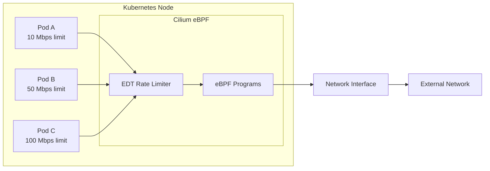
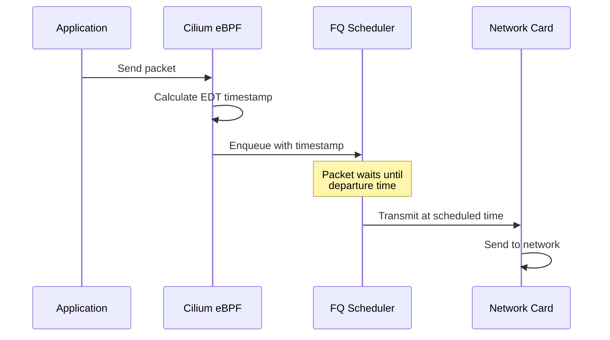
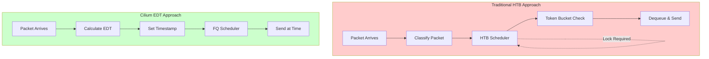
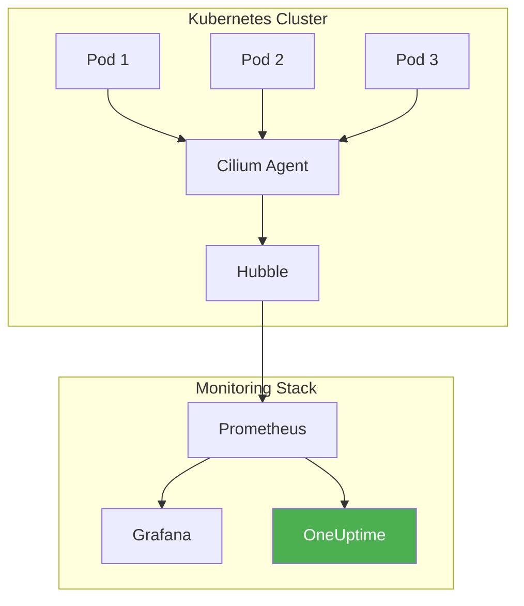

# How to Configure Cilium Bandwidth Management

Author: [nawazdhandala](https://www.github.com/nawazdhandala)

Tags: Kubernetes, Cilium, Networking, Bandwidth Management, QoS, EDT, Rate Limiting, DevOps

Description: A practical guide to configuring Cilium bandwidth management in Kubernetes, covering rate limiting, pod bandwidth annotations, EDT-based rate limiting, and monitoring bandwidth usage for optimal cluster performance.

---

> "Bandwidth is like a highway - without proper traffic management, even the widest road becomes congested during rush hour." - Network Engineering Wisdom

## Introduction to Cilium Bandwidth Management

Cilium provides advanced bandwidth management capabilities for Kubernetes clusters using eBPF. Unlike traditional approaches that rely on tc (traffic control) and HTB (Hierarchical Token Bucket), Cilium uses EDT (Earliest Departure Time) for more efficient and accurate rate limiting.



### Why Cilium Bandwidth Management?

Traditional Linux traffic control has several limitations:
- **High CPU overhead** from HTB scheduling
- **Lock contention** in multi-queue environments
- **Inaccurate rate limiting** under burst conditions

Cilium's EDT-based approach solves these by:
- Computing packet departure times upfront
- Eliminating per-packet lock contention
- Achieving more accurate rate limiting with lower CPU overhead

## Prerequisites

Before configuring bandwidth management, ensure your cluster meets these requirements:

```bash
# Check Cilium is installed and running
cilium status

# Verify kernel version (5.1+ required for full EDT support)
uname -r

# Check if bandwidth manager is enabled
cilium config view | grep bandwidth
```

### Enable Bandwidth Manager

If not already enabled, configure Cilium with bandwidth management support:

```yaml
# cilium-config.yaml
# Helm values for enabling Cilium bandwidth management
apiVersion: v1
kind: ConfigMap
metadata:
  name: cilium-config
  namespace: kube-system
data:
  # Enable bandwidth management with EDT
  enable-bandwidth-manager: "true"

  # Enable BBR congestion control (recommended)
  enable-bbr: "true"
```

Or using Helm:

```bash
# Install or upgrade Cilium with bandwidth management enabled
helm upgrade cilium cilium/cilium \
  --namespace kube-system \
  --set bandwidthManager.enabled=true \
  --set bandwidthManager.bbr=true
```

## Rate Limiting with Pod Bandwidth Annotations

The simplest way to apply bandwidth limits is through Kubernetes annotations on pods.

### Basic Pod Bandwidth Annotations

```yaml
# pod-with-bandwidth-limits.yaml
# Pod with ingress and egress bandwidth limits
apiVersion: v1
kind: Pod
metadata:
  name: bandwidth-limited-app
  annotations:
    # Limit incoming traffic to 10 Megabits per second
    kubernetes.io/ingress-bandwidth: "10M"
    # Limit outgoing traffic to 5 Megabits per second
    kubernetes.io/egress-bandwidth: "5M"
spec:
  containers:
    - name: app
      image: nginx:latest
      ports:
        - containerPort: 80
      resources:
        requests:
          memory: "64Mi"
          cpu: "250m"
        limits:
          memory: "128Mi"
          cpu: "500m"
```

### Bandwidth Limits in Deployments

```yaml
# deployment-with-bandwidth.yaml
# Deployment with bandwidth-limited pods
apiVersion: apps/v1
kind: Deployment
metadata:
  name: api-server
  labels:
    app: api-server
spec:
  replicas: 3
  selector:
    matchLabels:
      app: api-server
  template:
    metadata:
      labels:
        app: api-server
      annotations:
        # Limit each pod to 100 Mbps ingress
        kubernetes.io/ingress-bandwidth: "100M"
        # Limit each pod to 50 Mbps egress
        kubernetes.io/egress-bandwidth: "50M"
    spec:
      containers:
        - name: api
          image: myregistry/api-server:v1.2.3
          ports:
            - containerPort: 8080
          env:
            - name: MAX_CONNECTIONS
              value: "1000"
```

### Understanding Bandwidth Units

Cilium supports these bandwidth notation formats:

```yaml
# bandwidth-units-examples.yaml
# Examples of valid bandwidth unit notations
metadata:
  annotations:
    # Kilobits per second
    kubernetes.io/egress-bandwidth: "500K"

    # Megabits per second
    kubernetes.io/egress-bandwidth: "100M"

    # Gigabits per second
    kubernetes.io/egress-bandwidth: "1G"

    # Explicit bits per second
    kubernetes.io/egress-bandwidth: "10000000"  # 10 Mbps
```

## EDT-Based Rate Limiting Deep Dive

EDT (Earliest Departure Time) is the modern approach to rate limiting that Cilium uses by default.



### How EDT Works

```yaml
# cilium-edt-config.yaml
# ConfigMap showing EDT-related settings
apiVersion: v1
kind: ConfigMap
metadata:
  name: cilium-config
  namespace: kube-system
data:
  # EDT is used automatically when bandwidth-manager is enabled
  enable-bandwidth-manager: "true"

  # The FQ (Fair Queue) scheduler is required for EDT
  # This is automatically configured by Cilium

  # BBR congestion control works well with EDT
  enable-bbr: "true"
```

### Verifying EDT Configuration

```bash
# Check if EDT is active on the node
# Look for "fq" qdisc on the main interface
tc qdisc show dev eth0

# Example output showing FQ scheduler:
# qdisc fq 8001: root refcnt 2 limit 10000p flow_limit 100p
#   buckets 1024 orphan_mask 1023 quantum 3028b initial_quantum 15140b

# Verify Cilium bandwidth manager status
cilium bpf bandwidth list

# Check EDT timestamps on packets (requires bpftrace)
bpftrace -e 'kprobe:__dev_queue_xmit {
  printf("skb tstamp: %lld\n", ((struct sk_buff *)arg0)->tstamp);
}'
```

### EDT vs HTB Comparison



## Advanced Rate Limiting Patterns

### Per-Namespace Bandwidth Policies

Use Cilium Network Policies to enforce bandwidth limits at the namespace level:

```yaml
# namespace-bandwidth-policy.yaml
# CiliumClusterwideNetworkPolicy for namespace-level bandwidth control
apiVersion: cilium.io/v2
kind: CiliumClusterwideNetworkPolicy
metadata:
  name: production-bandwidth-limit
spec:
  description: "Limit bandwidth for production namespace"
  endpointSelector:
    matchLabels:
      "k8s:io.kubernetes.pod.namespace": production
  egress:
    - toEntities:
        - world
      # Note: L7 policies can also include rate limiting rules
```

### Tiered Bandwidth Classes

Create different bandwidth tiers for different workload types:

```yaml
# tiered-bandwidth-deployments.yaml
# High-priority tier - Premium bandwidth allocation
---
apiVersion: apps/v1
kind: Deployment
metadata:
  name: premium-service
  labels:
    bandwidth-tier: premium
spec:
  replicas: 2
  selector:
    matchLabels:
      app: premium-service
  template:
    metadata:
      labels:
        app: premium-service
        bandwidth-tier: premium
      annotations:
        # Premium tier: 1 Gbps limits
        kubernetes.io/ingress-bandwidth: "1G"
        kubernetes.io/egress-bandwidth: "1G"
    spec:
      containers:
        - name: app
          image: premium-app:latest
---
# Standard tier - Normal bandwidth allocation
apiVersion: apps/v1
kind: Deployment
metadata:
  name: standard-service
  labels:
    bandwidth-tier: standard
spec:
  replicas: 5
  selector:
    matchLabels:
      app: standard-service
  template:
    metadata:
      labels:
        app: standard-service
        bandwidth-tier: standard
      annotations:
        # Standard tier: 100 Mbps limits
        kubernetes.io/ingress-bandwidth: "100M"
        kubernetes.io/egress-bandwidth: "100M"
    spec:
      containers:
        - name: app
          image: standard-app:latest
---
# Background tier - Limited bandwidth for batch jobs
apiVersion: apps/v1
kind: Deployment
metadata:
  name: batch-processor
  labels:
    bandwidth-tier: background
spec:
  replicas: 10
  selector:
    matchLabels:
      app: batch-processor
  template:
    metadata:
      labels:
        app: batch-processor
        bandwidth-tier: background
      annotations:
        # Background tier: 10 Mbps limits
        kubernetes.io/ingress-bandwidth: "10M"
        kubernetes.io/egress-bandwidth: "10M"
    spec:
      containers:
        - name: processor
          image: batch-processor:latest
```

### Burst Handling Configuration

Configure burst allowances for applications with spiky traffic patterns:

```yaml
# Note: Cilium EDT handles bursts more gracefully than HTB
# The FQ scheduler allows for natural micro-bursting while
# maintaining long-term rate compliance

# For applications needing specific burst handling,
# consider combining with application-level rate limiting
---
apiVersion: v1
kind: Pod
metadata:
  name: burst-tolerant-app
  annotations:
    # Set a higher limit to accommodate bursts
    # Application-level rate limiting handles fine-grained control
    kubernetes.io/ingress-bandwidth: "200M"
    kubernetes.io/egress-bandwidth: "200M"
spec:
  containers:
    - name: app
      image: burst-app:latest
      env:
        # Application-level rate limiting for precise control
        - name: RATE_LIMIT_RPS
          value: "1000"
        - name: BURST_SIZE
          value: "100"
```

## Monitoring Bandwidth Usage

Effective bandwidth management requires visibility into actual usage patterns.



### Enable Hubble for Flow Visibility

```yaml
# hubble-config.yaml
# Enable Hubble for detailed traffic observability
apiVersion: v1
kind: ConfigMap
metadata:
  name: cilium-config
  namespace: kube-system
data:
  enable-hubble: "true"
  hubble-listen-address: ":4244"
  hubble-metrics-server: ":9965"
  hubble-metrics:
    - dns
    - drop
    - tcp
    - flow
    - icmp
    - http
```

### Prometheus Metrics for Bandwidth

```yaml
# prometheus-servicemonitor.yaml
# ServiceMonitor to scrape Cilium and Hubble metrics
apiVersion: monitoring.coreos.com/v1
kind: ServiceMonitor
metadata:
  name: cilium-metrics
  namespace: monitoring
spec:
  selector:
    matchLabels:
      k8s-app: cilium
  namespaceSelector:
    matchNames:
      - kube-system
  endpoints:
    - port: metrics
      interval: 15s
      path: /metrics
---
apiVersion: monitoring.coreos.com/v1
kind: ServiceMonitor
metadata:
  name: hubble-metrics
  namespace: monitoring
spec:
  selector:
    matchLabels:
      k8s-app: hubble
  namespaceSelector:
    matchNames:
      - kube-system
  endpoints:
    - port: metrics
      interval: 15s
```

### Key Metrics to Monitor

```bash
# Useful PromQL queries for bandwidth monitoring

# Total bytes transmitted per pod
sum(rate(hubble_flows_processed_total{verdict="FORWARDED"}[5m])) by (source_pod)

# Dropped packets due to policy or rate limiting
sum(rate(hubble_drop_total[5m])) by (reason)

# Network throughput by namespace
sum(rate(container_network_transmit_bytes_total[5m])) by (namespace)

# Bandwidth utilization percentage (requires custom recording rules)
# This compares actual usage against pod bandwidth annotations
```

### Grafana Dashboard for Bandwidth

```json
{
  "dashboard": {
    "title": "Cilium Bandwidth Management",
    "panels": [
      {
        "title": "Pod Egress Bandwidth",
        "type": "timeseries",
        "targets": [
          {
            "expr": "sum(rate(container_network_transmit_bytes_total[5m])) by (pod) * 8",
            "legendFormat": "{{pod}}"
          }
        ],
        "fieldConfig": {
          "defaults": {
            "unit": "bps"
          }
        }
      },
      {
        "title": "Pod Ingress Bandwidth",
        "type": "timeseries",
        "targets": [
          {
            "expr": "sum(rate(container_network_receive_bytes_total[5m])) by (pod) * 8",
            "legendFormat": "{{pod}}"
          }
        ],
        "fieldConfig": {
          "defaults": {
            "unit": "bps"
          }
        }
      },
      {
        "title": "Bandwidth Limit Violations",
        "type": "stat",
        "targets": [
          {
            "expr": "sum(rate(hubble_drop_total{reason=\"Policy denied\"}[5m]))"
          }
        ]
      }
    ]
  }
}
```

### Alerting on Bandwidth Issues

```yaml
# prometheus-rules.yaml
# PrometheusRule for bandwidth-related alerts
apiVersion: monitoring.coreos.com/v1
kind: PrometheusRule
metadata:
  name: bandwidth-alerts
  namespace: monitoring
spec:
  groups:
    - name: bandwidth
      rules:
        # Alert when pod approaches bandwidth limit
        - alert: PodBandwidthNearLimit
          expr: |
            (sum(rate(container_network_transmit_bytes_total[5m])) by (pod, namespace) * 8)
            > 0.8 * 100000000
          for: 5m
          labels:
            severity: warning
          annotations:
            summary: "Pod {{ $labels.pod }} approaching bandwidth limit"
            description: "Pod is using more than 80% of its 100Mbps bandwidth limit"

        # Alert on high packet drops
        - alert: HighPacketDropRate
          expr: |
            sum(rate(hubble_drop_total[5m])) by (reason) > 100
          for: 2m
          labels:
            severity: critical
          annotations:
            summary: "High packet drop rate detected"
            description: "Dropping {{ $value }} packets/sec due to {{ $labels.reason }}"
```

## Integrating with OneUptime

For comprehensive monitoring of your Cilium bandwidth management, integrate with [OneUptime](https://oneuptime.com) to get unified observability across your entire infrastructure.

```yaml
# oneuptime-integration.yaml
# OpenTelemetry Collector config for OneUptime integration
apiVersion: v1
kind: ConfigMap
metadata:
  name: otel-collector-config
  namespace: monitoring
data:
  config.yaml: |
    receivers:
      prometheus:
        config:
          scrape_configs:
            - job_name: 'cilium'
              kubernetes_sd_configs:
                - role: pod
              relabel_configs:
                - source_labels: [__meta_kubernetes_pod_label_k8s_app]
                  regex: cilium
                  action: keep
            - job_name: 'hubble'
              kubernetes_sd_configs:
                - role: pod
              relabel_configs:
                - source_labels: [__meta_kubernetes_pod_label_k8s_app]
                  regex: hubble
                  action: keep

    processors:
      batch:
        timeout: 10s

    exporters:
      otlp:
        endpoint: "https://otlp.oneuptime.com:443"
        headers:
          x-oneuptime-token: "${ONEUPTIME_TOKEN}"

    service:
      pipelines:
        metrics:
          receivers: [prometheus]
          processors: [batch]
          exporters: [otlp]
```

OneUptime provides:
- Real-time dashboards for bandwidth utilization
- Intelligent alerting on bandwidth anomalies
- Historical trend analysis for capacity planning
- Incident management when bandwidth issues cause outages

## Troubleshooting Common Issues

### Issue: Bandwidth Limits Not Applied

```bash
# Verify Cilium bandwidth manager is enabled
cilium config view | grep bandwidth

# Check if pod has the annotations
kubectl get pod <pod-name> -o jsonpath='{.metadata.annotations}'

# Verify Cilium endpoint status
cilium endpoint list

# Check for any errors in Cilium agent logs
kubectl logs -n kube-system -l k8s-app=cilium | grep -i bandwidth
```

### Issue: Lower Than Expected Throughput

```bash
# Check if BBR is enabled (recommended for better performance)
cilium config view | grep bbr

# Verify FQ scheduler is active
tc qdisc show dev eth0

# Check for CPU throttling on nodes
kubectl top nodes

# Monitor packet drops
hubble observe --verdict DROPPED
```

### Issue: Inconsistent Rate Limiting

```bash
# EDT requires kernel 5.1+ for best results
uname -r

# Check for clock synchronization issues
timedatectl status

# Verify no conflicting tc rules
tc qdisc show
tc filter show

# Check Cilium BPF maps
cilium bpf bandwidth list
```

### Debugging Script

```bash
#!/bin/bash
# bandwidth-debug.sh
# Comprehensive debugging script for Cilium bandwidth issues

echo "=== Cilium Status ==="
cilium status

echo -e "\n=== Bandwidth Manager Config ==="
cilium config view | grep -E "(bandwidth|bbr)"

echo -e "\n=== Kernel Version ==="
uname -r

echo -e "\n=== TC Qdiscs ==="
tc qdisc show

echo -e "\n=== Cilium BPF Bandwidth ==="
cilium bpf bandwidth list

echo -e "\n=== Recent Drops ==="
hubble observe --verdict DROPPED --last 10

echo -e "\n=== Pod Bandwidth Annotations ==="
kubectl get pods -A -o jsonpath='{range .items[*]}{.metadata.namespace}/{.metadata.name}: ingress={.metadata.annotations.kubernetes\.io/ingress-bandwidth}, egress={.metadata.annotations.kubernetes\.io/egress-bandwidth}{"\n"}{end}' | grep -v "ingress=, egress="
```

## Best Practices

### 1. Start with Monitoring Before Limiting

```yaml
# monitoring-first-approach.yaml
# Deploy without limits first, observe actual usage
apiVersion: apps/v1
kind: Deployment
metadata:
  name: new-service
spec:
  template:
    metadata:
      labels:
        app: new-service
        # Label for monitoring, no bandwidth limits yet
        bandwidth-monitoring: enabled
    spec:
      containers:
        - name: app
          image: new-service:latest
```

### 2. Use Graduated Limits

```yaml
# graduated-limits.yaml
# Start generous, tighten based on data
# Week 1: Observe baseline
# Week 2: Set limits at 2x observed peak
# Week 3+: Optimize based on actual needs

# Initial generous limit
kubernetes.io/egress-bandwidth: "500M"

# After observing 50Mbps peak, reduce to
kubernetes.io/egress-bandwidth: "100M"
```

### 3. Document Bandwidth Requirements

```yaml
# documented-deployment.yaml
apiVersion: apps/v1
kind: Deployment
metadata:
  name: video-processor
  annotations:
    # Document the reasoning for bandwidth settings
    bandwidth-justification: |
      Processes 4K video streams at ~25 Mbps each.
      Max concurrent streams: 4
      Required bandwidth: 100 Mbps + 20% headroom = 120 Mbps
spec:
  template:
    metadata:
      annotations:
        kubernetes.io/ingress-bandwidth: "120M"
        kubernetes.io/egress-bandwidth: "120M"
```

### 4. Test Under Load

```bash
# Use iperf3 to test bandwidth limits
# Server pod
kubectl run iperf-server --image=networkstatic/iperf3 -- -s

# Client pod with bandwidth limit
kubectl run iperf-client --image=networkstatic/iperf3 \
  --annotations="kubernetes.io/egress-bandwidth=50M" \
  -- -c iperf-server -t 30

# Verify the limit is enforced
kubectl logs iperf-client
# Expected: ~50 Mbits/sec throughput
```

## Conclusion

Cilium bandwidth management provides a modern, efficient approach to network QoS in Kubernetes. By leveraging EDT-based rate limiting, you get more accurate bandwidth control with lower CPU overhead compared to traditional approaches.

Key takeaways:
- Enable bandwidth manager with `bandwidthManager.enabled=true`
- Use pod annotations for simple rate limiting
- Monitor with Hubble and Prometheus metrics
- Start with observation, then apply graduated limits
- Integrate with [OneUptime](https://oneuptime.com) for comprehensive monitoring

With proper bandwidth management, you can ensure fair resource allocation, prevent noisy neighbor problems, and maintain predictable network performance across your Kubernetes cluster.
