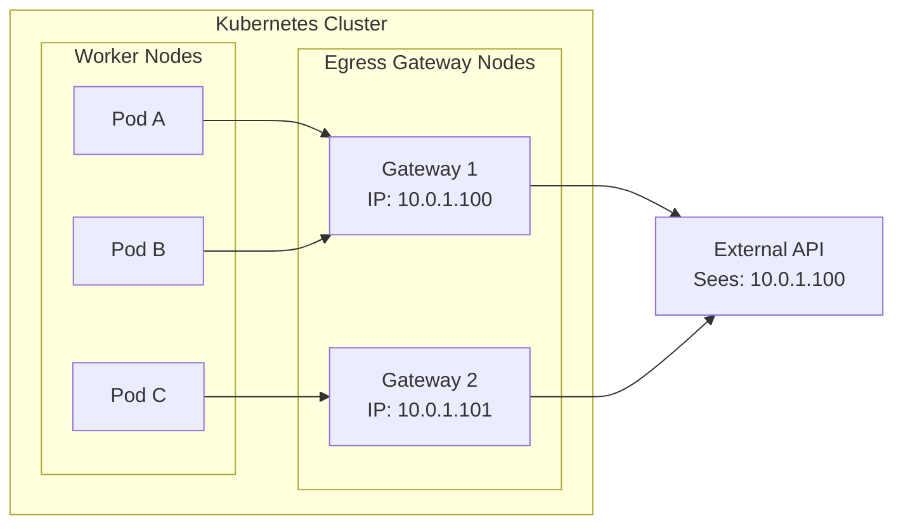
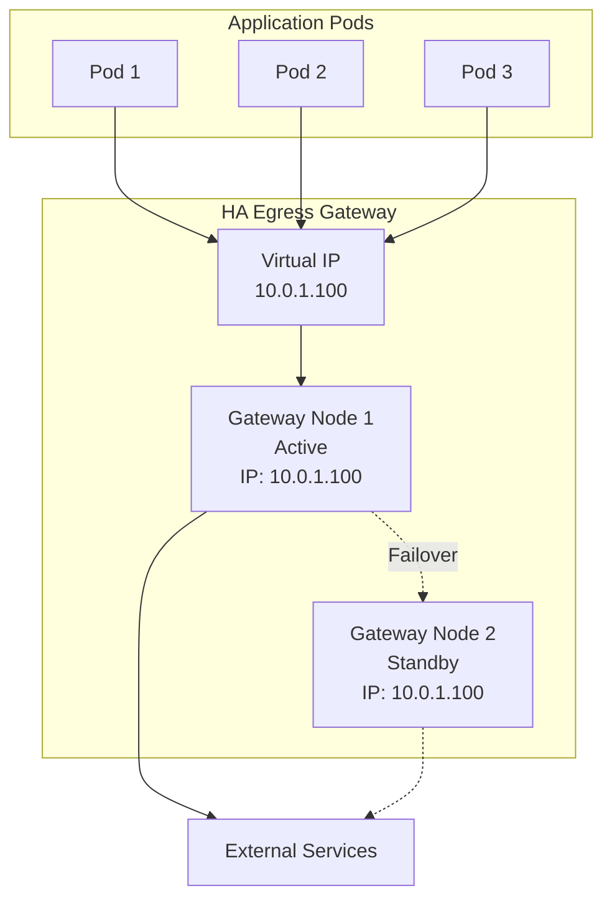
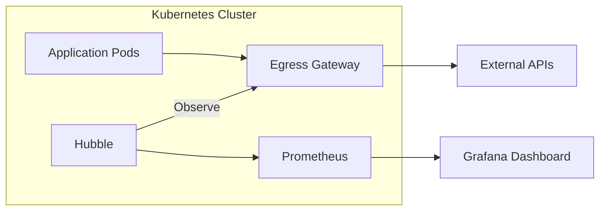

# How to Configure Cilium Egress Gateway

Author: [nawazdhandala](https://www.github.com/nawazdhandala)

Tags: Cilium, Kubernetes, Egress Gateway, Networking, Security, DevOps, Service Mesh

Description: A comprehensive guide to configuring Cilium Egress Gateway for controlling and monitoring outbound traffic from Kubernetes clusters, including selective routing, high availability, and observability.

---

> Egress gateways give you a predictable, auditable, and secure way to route outbound traffic from your Kubernetes workloads. Instead of traffic leaving from any node with any IP, you control exactly which gateway nodes handle egress and what source IP external services see.

## Understanding Egress Gateway Concepts

By default, when a pod makes an outbound connection to an external service, the traffic is SNAT'd to the node's IP address. This creates several problems:

- External services see different source IPs depending on which node the pod runs on
- IP-based allowlists become unmanageable
- Auditing and compliance become difficult
- No centralized control over egress traffic

Cilium Egress Gateway solves these problems by routing egress traffic through dedicated gateway nodes with predictable IP addresses.



### Prerequisites

Before configuring egress gateway, ensure:

1. **Cilium 1.13+** is installed with egress gateway support enabled
2. **BPF masquerading** is enabled (IPtables masquerading is not supported)
3. **Dedicated gateway nodes** are available with static IPs

Check your Cilium installation:

```bash
# Verify Cilium is running
cilium status

# Check Cilium version
cilium version

# Verify BPF masquerading is enabled
kubectl -n kube-system exec ds/cilium -- cilium status | grep Masquerading
```

## Enabling Egress Gateway in Cilium

First, enable the egress gateway feature in Cilium's configuration.

### Helm Installation

```yaml
# values.yaml for Cilium Helm chart
# Enable egress gateway functionality
egressGateway:
  enabled: true

# BPF masquerading is required for egress gateway
bpf:
  masquerade: true

# Enable policy enforcement for egress control
policyEnforcementMode: "default"

# Optional: Enable Hubble for observability
hubble:
  enabled: true
  relay:
    enabled: true
  ui:
    enabled: true
```

Install or upgrade Cilium:

```bash
# Add Cilium Helm repository
helm repo add cilium https://helm.cilium.io/
helm repo update

# Install Cilium with egress gateway enabled
helm upgrade --install cilium cilium/cilium \
  --namespace kube-system \
  --values values.yaml \
  --wait
```

### Label Gateway Nodes

Designate specific nodes as egress gateways by labeling them:

```bash
# Label nodes that will serve as egress gateways
# These nodes should have static, predictable IPs
kubectl label nodes gateway-node-1 egress-gateway=true
kubectl label nodes gateway-node-2 egress-gateway=true

# Verify labels
kubectl get nodes -l egress-gateway=true
```

## Gateway Configuration

Now create the egress gateway policy to route traffic through gateway nodes.

### Basic Egress Gateway Policy

```yaml
# egress-gateway-policy.yaml
# Route all traffic from specific pods through egress gateway
apiVersion: cilium.io/v2
kind: CiliumEgressGatewayPolicy
metadata:
  name: external-api-egress
  # Policies are cluster-scoped, no namespace needed
spec:
  # Select pods that should use this egress gateway
  selectors:
    - podSelector:
        matchLabels:
          app: payment-service
          # Only pods with this label use the egress gateway
          egress: external

  # Define which destination CIDRs trigger egress gateway routing
  destinationCIDRs:
    # Route traffic to external networks through gateway
    - "0.0.0.0/0"

  # Exclude internal cluster traffic from egress routing
  excludedCIDRs:
    - "10.0.0.0/8"      # Internal pod network
    - "172.16.0.0/12"   # Internal service network
    - "192.168.0.0/16"  # Other internal ranges

  # Select gateway nodes and specify egress IP
  egressGateway:
    # Node selector for gateway nodes
    nodeSelector:
      matchLabels:
        egress-gateway: "true"
    # The interface on gateway nodes for egress
    interface: eth0
    # The egress IP address (must be configured on the node)
    egressIP: 10.0.1.100
```

Apply the policy:

```bash
kubectl apply -f egress-gateway-policy.yaml

# Verify policy is active
kubectl get ciliumegressgatewaypolicies
kubectl describe ciliumegressgatewaypolicy external-api-egress
```

### Multiple Egress IPs for Different Services

```yaml
# payment-egress.yaml
# Dedicated egress IP for payment services
apiVersion: cilium.io/v2
kind: CiliumEgressGatewayPolicy
metadata:
  name: payment-egress
spec:
  selectors:
    - podSelector:
        matchLabels:
          app: payment-processor
  destinationCIDRs:
    # Stripe API ranges (example)
    - "35.190.247.0/24"
    - "35.201.97.0/24"
  egressGateway:
    nodeSelector:
      matchLabels:
        egress-gateway: "true"
    egressIP: 10.0.1.100

---
# analytics-egress.yaml
# Different egress IP for analytics services
apiVersion: cilium.io/v2
kind: CiliumEgressGatewayPolicy
metadata:
  name: analytics-egress
spec:
  selectors:
    - podSelector:
        matchLabels:
          app: analytics-pipeline
  destinationCIDRs:
    # Google Analytics API ranges (example)
    - "142.250.0.0/16"
  egressGateway:
    nodeSelector:
      matchLabels:
        egress-gateway: "true"
    egressIP: 10.0.1.101
```

## Selective Egress Routing

Fine-grained control over which traffic uses egress gateways.

### Namespace-Based Selection

```yaml
# namespace-egress.yaml
# Route all traffic from production namespace through egress
apiVersion: cilium.io/v2
kind: CiliumEgressGatewayPolicy
metadata:
  name: production-namespace-egress
spec:
  selectors:
    # Select by namespace label
    - podSelector:
        matchLabels:
          io.kubernetes.pod.namespace: production
  destinationCIDRs:
    - "0.0.0.0/0"
  excludedCIDRs:
    - "10.0.0.0/8"
    - "172.16.0.0/12"
  egressGateway:
    nodeSelector:
      matchLabels:
        egress-gateway: "true"
    egressIP: 10.0.1.100
```

### Destination-Based Routing

```yaml
# destination-based-egress.yaml
# Different egress IPs based on destination
apiVersion: cilium.io/v2
kind: CiliumEgressGatewayPolicy
metadata:
  name: aws-services-egress
spec:
  selectors:
    - podSelector:
        matchLabels:
          egress: aws
  # AWS API endpoints in us-east-1
  destinationCIDRs:
    - "52.94.0.0/16"
    - "54.239.0.0/16"
  egressGateway:
    nodeSelector:
      matchLabels:
        egress-gateway: "true"
        region: us-east-1
    egressIP: 10.0.1.100

---
apiVersion: cilium.io/v2
kind: CiliumEgressGatewayPolicy
metadata:
  name: azure-services-egress
spec:
  selectors:
    - podSelector:
        matchLabels:
          egress: azure
  # Azure API endpoints
  destinationCIDRs:
    - "13.64.0.0/11"
    - "40.64.0.0/10"
  egressGateway:
    nodeSelector:
      matchLabels:
        egress-gateway: "true"
        region: azure-eastus
    egressIP: 10.0.2.100
```

### Combining Multiple Selectors

```yaml
# complex-egress.yaml
# Complex selection with multiple criteria
apiVersion: cilium.io/v2
kind: CiliumEgressGatewayPolicy
metadata:
  name: multi-criteria-egress
spec:
  selectors:
    # First selector: production payment pods
    - podSelector:
        matchLabels:
          app: payment
          env: production
    # Second selector: any pod with external-api label
    - podSelector:
        matchLabels:
          network: external-api
    # Third selector: specific namespace
    - podSelector:
        matchExpressions:
          - key: io.kubernetes.pod.namespace
            operator: In
            values:
              - finance
              - compliance
  destinationCIDRs:
    - "0.0.0.0/0"
  excludedCIDRs:
    - "10.0.0.0/8"
    - "172.16.0.0/12"
  egressGateway:
    nodeSelector:
      matchLabels:
        egress-gateway: "true"
    egressIP: 10.0.1.100
```

## High Availability Setup

Ensure egress gateway remains available during node failures.



### Multiple Gateway Nodes

```yaml
# ha-egress-policy.yaml
# High availability egress with multiple gateway nodes
apiVersion: cilium.io/v2
kind: CiliumEgressGatewayPolicy
metadata:
  name: ha-egress-gateway
spec:
  selectors:
    - podSelector:
        matchLabels:
          egress: external
  destinationCIDRs:
    - "0.0.0.0/0"
  excludedCIDRs:
    - "10.0.0.0/8"
    - "172.16.0.0/12"
  egressGateway:
    # Select multiple gateway nodes
    # Cilium will distribute traffic and handle failover
    nodeSelector:
      matchLabels:
        egress-gateway: "true"
    egressIP: 10.0.1.100
```

### Node Preparation for HA

```bash
# Prepare gateway nodes with required configuration
# Run on each gateway node

# Ensure the egress IP is configured as a secondary IP
# This allows the IP to float between nodes
sudo ip addr add 10.0.1.100/32 dev eth0

# For cloud providers, use their mechanisms:
# AWS: Elastic IP attached to ENI
# GCP: Alias IP range
# Azure: Secondary IP configuration
```

### Using External Load Balancer

For true high availability with automatic failover:

```yaml
# external-lb-egress.yaml
# Use external load balancer for egress HA
apiVersion: v1
kind: Service
metadata:
  name: egress-lb
  namespace: kube-system
  annotations:
    # Cloud-specific annotations for internal LB
    service.beta.kubernetes.io/aws-load-balancer-internal: "true"
    service.beta.kubernetes.io/aws-load-balancer-type: "nlb"
spec:
  type: LoadBalancer
  loadBalancerIP: 10.0.1.100  # Static IP for egress
  selector:
    egress-gateway: "true"
  ports:
    - port: 443
      targetPort: 443
      protocol: TCP
```

### Health Checks for Gateway Nodes

```yaml
# gateway-health-daemonset.yaml
# Health monitoring for egress gateway nodes
apiVersion: apps/v1
kind: DaemonSet
metadata:
  name: egress-gateway-health
  namespace: kube-system
spec:
  selector:
    matchLabels:
      app: egress-health
  template:
    metadata:
      labels:
        app: egress-health
    spec:
      nodeSelector:
        egress-gateway: "true"
      tolerations:
        - operator: Exists
      containers:
        - name: health-check
          image: curlimages/curl:latest
          command:
            - /bin/sh
            - -c
            - |
              while true; do
                # Check egress connectivity
                if curl -s --max-time 5 https://api.github.com > /dev/null; then
                  echo "Egress healthy"
                else
                  echo "Egress failed"
                  # Alert or trigger failover
                fi
                sleep 30
              done
          resources:
            requests:
              cpu: 10m
              memory: 16Mi
            limits:
              cpu: 50m
              memory: 64Mi
```

## Monitoring Egress Traffic

Visibility into egress traffic patterns and health.



### Enable Hubble Observability

```yaml
# hubble-config.yaml
# Enhanced Hubble configuration for egress monitoring
apiVersion: v1
kind: ConfigMap
metadata:
  name: cilium-config
  namespace: kube-system
data:
  # Enable Hubble for flow visibility
  enable-hubble: "true"
  hubble-listen-address: ":4244"
  hubble-disable-tls: "false"

  # Enable metrics export
  hubble-metrics-server: ":9965"
  hubble-metrics:
    - dns
    - drop
    - tcp
    - flow
    - icmp
    - http
```

### Hubble CLI Commands

```bash
# Install Hubble CLI
HUBBLE_VERSION=$(curl -s https://raw.githubusercontent.com/cilium/hubble/master/stable.txt)
curl -L --remote-name-all https://github.com/cilium/hubble/releases/download/$HUBBLE_VERSION/hubble-linux-amd64.tar.gz
tar xzvfC hubble-linux-amd64.tar.gz /usr/local/bin

# Port forward to Hubble relay
kubectl port-forward -n kube-system svc/hubble-relay 4245:80 &

# Observe all egress traffic
hubble observe --type trace:to-network

# Filter egress traffic from specific namespace
hubble observe --namespace production --type trace:to-network

# Watch traffic to specific destination
hubble observe --to-ip 35.190.247.0/24

# Monitor egress gateway policy matches
hubble observe --verdict FORWARDED --type policy-verdict

# Export flows to JSON for analysis
hubble observe --type trace:to-network -o json > egress-flows.json
```

### Prometheus Metrics

```yaml
# prometheus-servicemonitor.yaml
# Scrape Cilium and Hubble metrics
apiVersion: monitoring.coreos.com/v1
kind: ServiceMonitor
metadata:
  name: cilium-metrics
  namespace: monitoring
spec:
  selector:
    matchLabels:
      app.kubernetes.io/name: cilium-agent
  namespaceSelector:
    matchNames:
      - kube-system
  endpoints:
    - port: prometheus
      interval: 30s
      path: /metrics

---
apiVersion: monitoring.coreos.com/v1
kind: ServiceMonitor
metadata:
  name: hubble-metrics
  namespace: monitoring
spec:
  selector:
    matchLabels:
      app.kubernetes.io/name: hubble
  namespaceSelector:
    matchNames:
      - kube-system
  endpoints:
    - port: metrics
      interval: 30s
```

### Key Metrics to Monitor

```yaml
# prometheus-rules.yaml
# Alerting rules for egress gateway
apiVersion: monitoring.coreos.com/v1
kind: PrometheusRule
metadata:
  name: egress-gateway-alerts
  namespace: monitoring
spec:
  groups:
    - name: egress-gateway
      rules:
        # Alert on high egress traffic
        - alert: HighEgressTraffic
          expr: |
            sum(rate(hubble_flows_processed_total{
              type="Trace",
              subtype="to-network"
            }[5m])) > 10000
          for: 5m
          labels:
            severity: warning
          annotations:
            summary: High egress traffic detected

        # Alert on egress policy drops
        - alert: EgressPolicyDrops
          expr: |
            sum(rate(hubble_drop_total{
              reason="Policy denied"
            }[5m])) > 100
          for: 2m
          labels:
            severity: critical
          annotations:
            summary: Egress traffic being dropped by policy

        # Alert on gateway node down
        - alert: EgressGatewayNodeDown
          expr: |
            count(kube_node_status_condition{
              condition="Ready",
              status="true"
            } * on(node) kube_node_labels{
              label_egress_gateway="true"
            }) < 2
          for: 1m
          labels:
            severity: critical
          annotations:
            summary: Egress gateway redundancy lost
```

### Grafana Dashboard

```json
{
  "dashboard": {
    "title": "Cilium Egress Gateway",
    "panels": [
      {
        "title": "Egress Traffic Rate",
        "type": "graph",
        "targets": [
          {
            "expr": "sum(rate(hubble_flows_processed_total{type=\"Trace\",subtype=\"to-network\"}[5m])) by (destination)",
            "legendFormat": "{{destination}}"
          }
        ]
      },
      {
        "title": "Egress Gateway Node Health",
        "type": "stat",
        "targets": [
          {
            "expr": "count(kube_node_status_condition{condition=\"Ready\",status=\"true\"} * on(node) kube_node_labels{label_egress_gateway=\"true\"})"
          }
        ]
      },
      {
        "title": "Policy Drops",
        "type": "graph",
        "targets": [
          {
            "expr": "sum(rate(hubble_drop_total{reason=\"Policy denied\"}[5m])) by (source_namespace)"
          }
        ]
      }
    ]
  }
}
```

## Troubleshooting

### Verify Egress Gateway Status

```bash
# Check Cilium egress gateway status
kubectl -n kube-system exec ds/cilium -- cilium bpf egress list

# Verify policy is applied
kubectl get ciliumegressgatewaypolicies -o yaml

# Check endpoint status
kubectl -n kube-system exec ds/cilium -- cilium endpoint list

# Debug connectivity from a pod
kubectl exec -it test-pod -- curl -v https://api.external.com
```

### Common Issues

**Traffic not routed through gateway:**
- Verify pod labels match policy selectors
- Check destination CIDR is not in excludedCIDRs
- Ensure gateway nodes are labeled correctly

**Egress IP not working:**
- Verify egress IP is configured on gateway node interface
- Check cloud provider allows the IP assignment
- Ensure BPF masquerading is enabled

**High latency through gateway:**
- Check gateway node capacity
- Verify network path between pods and gateway
- Consider adding more gateway nodes

## Best Practices Summary

1. **Dedicated Gateway Nodes**: Use dedicated nodes for egress gateways to ensure predictable performance and easier troubleshooting.

2. **Static IPs**: Always use static IPs for egress gateways to maintain consistent allowlisting with external services.

3. **High Availability**: Deploy at least two gateway nodes in different availability zones for redundancy.

4. **Selective Routing**: Only route traffic that needs egress control through gateways; use excludedCIDRs for internal traffic.

5. **Monitor Everything**: Enable Hubble and set up comprehensive monitoring and alerting for egress traffic patterns.

6. **Document Policies**: Maintain clear documentation of which services use which egress IPs and why.

7. **Test Failover**: Regularly test gateway node failover to ensure HA configuration works as expected.

8. **Audit Regularly**: Review egress policies and traffic patterns quarterly to ensure they match security requirements.

9. **Version Control**: Store all egress gateway policies in Git for auditability and rollback capability.

10. **Least Privilege**: Apply egress policies only to pods that need external access; default deny for everything else.

---

Egress gateways are essential for enterprise Kubernetes deployments where you need predictable source IPs, audit trails, and centralized control over outbound traffic. Cilium makes this straightforward with its native egress gateway support and excellent observability through Hubble.

For monitoring your Kubernetes clusters, egress gateways, and the applications that depend on them, check out [OneUptime](https://oneuptime.com) - a comprehensive observability platform that helps you understand what's happening across your infrastructure.
