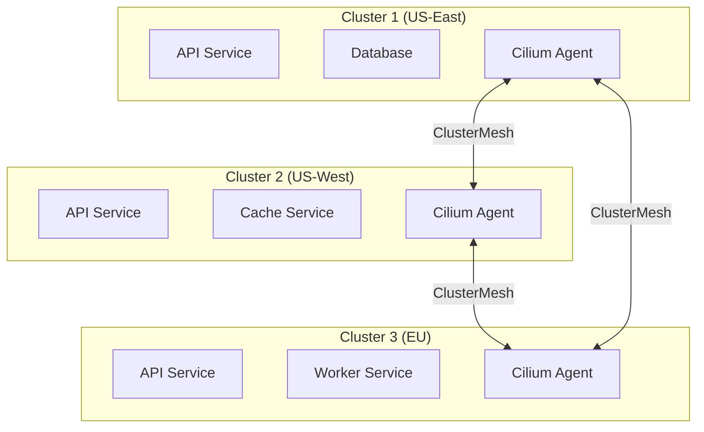
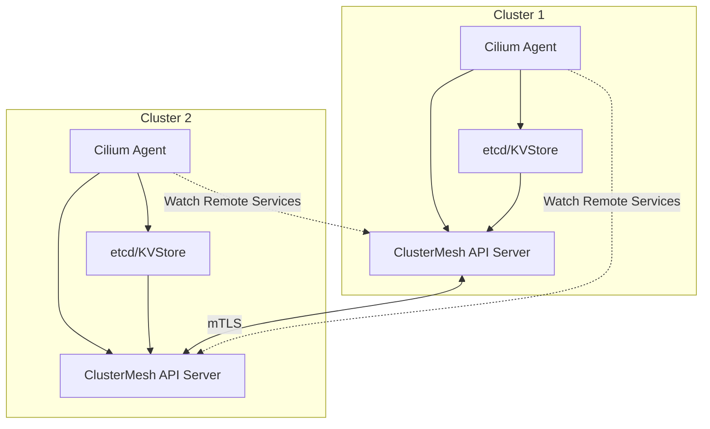
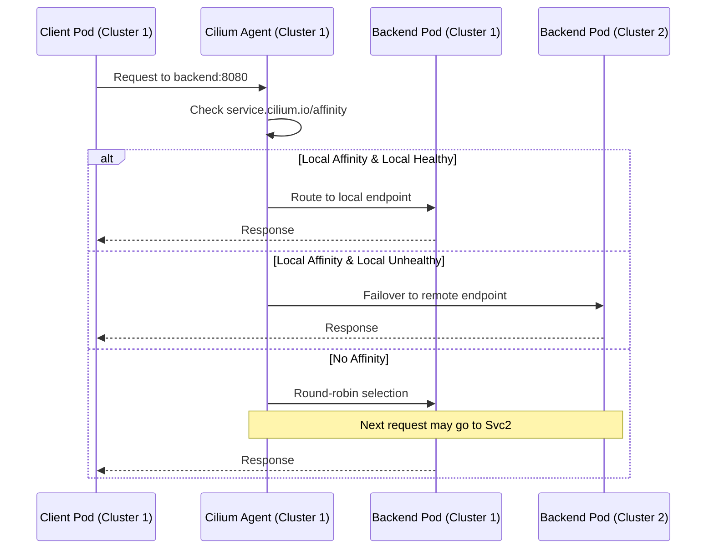
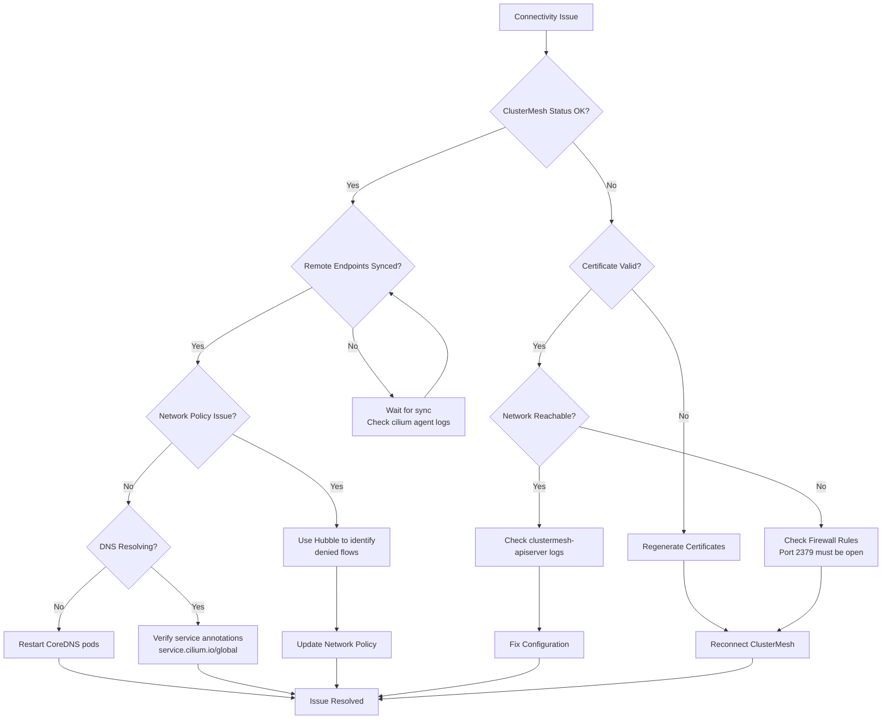

# How to Use Cilium for Multi-Cluster Networking

Author: [nawazdhandala](https://www.github.com/nawazdhandala)

Tags: Cilium, Kubernetes, Multi-Cluster, Networking, ClusterMesh, Service Discovery, eBPF, DevOps

Description: A comprehensive guide to setting up Cilium ClusterMesh for multi-cluster Kubernetes networking, including service discovery, global services, network policies, and troubleshooting connectivity issues.

---

> "The network is the computer." - John Gage, Sun Microsystems

## Why Cilium for Multi-Cluster Networking?

Cilium is an eBPF-based networking solution that provides high-performance, secure, and observable networking for Kubernetes. When you need to connect multiple Kubernetes clusters, Cilium's ClusterMesh feature enables seamless pod-to-pod communication, service discovery, and network policy enforcement across cluster boundaries.



### Key Benefits

- **Native Kubernetes Integration**: Works with existing Service and Endpoint resources
- **High Performance**: eBPF-based data plane bypasses iptables overhead
- **Global Services**: Load balance traffic across clusters
- **Network Policies**: Enforce security policies across cluster boundaries
- **Observability**: Built-in Hubble for network flow visibility

## Prerequisites

Before setting up ClusterMesh, ensure you have:

```bash
# Verify Cilium CLI is installed
cilium version

# Expected output:
# cilium-cli: v0.15.0 or later
# cilium image (default): v1.14.0 or later

# Check kubectl contexts for your clusters
kubectl config get-contexts

# Example output:
# CURRENT   NAME        CLUSTER     AUTHINFO    NAMESPACE
# *         cluster1    cluster1    admin       default
#           cluster2    cluster2    admin       default
```

### Cluster Requirements

Each cluster must meet these requirements:

```yaml
# Cilium configuration requirements for ClusterMesh
# Each cluster needs unique identifiers and non-overlapping CIDRs

# Cluster 1 Configuration
cluster:
  name: cluster1
  id: 1                    # Must be unique across all clusters (1-255)

networking:
  podCIDR: 10.0.0.0/16     # Must not overlap with other clusters
  serviceCIDR: 10.96.0.0/12

# Cluster 2 Configuration
cluster:
  name: cluster2
  id: 2

networking:
  podCIDR: 10.1.0.0/16     # Different from cluster1
  serviceCIDR: 10.112.0.0/12
```

## Installing Cilium with ClusterMesh Support

### Step 1: Install Cilium on Each Cluster

```bash
# Install Cilium on cluster1
# The cluster.name and cluster.id are critical for ClusterMesh
cilium install \
  --context cluster1 \
  --set cluster.name=cluster1 \
  --set cluster.id=1 \
  --set ipam.mode=kubernetes

# Install Cilium on cluster2 with different cluster ID
cilium install \
  --context cluster2 \
  --set cluster.name=cluster2 \
  --set cluster.id=2 \
  --set ipam.mode=kubernetes

# Verify installation on both clusters
cilium status --context cluster1
cilium status --context cluster2
```

### Step 2: Enable ClusterMesh

```bash
# Enable ClusterMesh on cluster1
# This deploys the clustermesh-apiserver and generates TLS certificates
cilium clustermesh enable --context cluster1 --service-type LoadBalancer

# Enable ClusterMesh on cluster2
cilium clustermesh enable --context cluster2 --service-type LoadBalancer

# Wait for ClusterMesh to be ready (this may take a few minutes)
cilium clustermesh status --context cluster1 --wait
cilium clustermesh status --context cluster2 --wait
```

### Step 3: Connect the Clusters

```bash
# Connect cluster1 to cluster2
# This exchanges certificates and establishes the mesh connection
cilium clustermesh connect \
  --context cluster1 \
  --destination-context cluster2

# Verify the connection is established
cilium clustermesh status --context cluster1

# Expected output:
# Cluster Connections:
# - cluster2: connected
```

## ClusterMesh Architecture



## Service Discovery Across Clusters

Once ClusterMesh is connected, services can discover and communicate with pods in remote clusters automatically.

### Automatic Service Discovery

```yaml
# Deploy a service in cluster1
# services/backend-cluster1.yaml
apiVersion: v1
kind: Service
metadata:
  name: backend
  namespace: production
  annotations:
    # This annotation makes the service discoverable across clusters
    service.cilium.io/global: "true"
spec:
  selector:
    app: backend
  ports:
    - port: 8080
      targetPort: 8080
---
apiVersion: apps/v1
kind: Deployment
metadata:
  name: backend
  namespace: production
spec:
  replicas: 3
  selector:
    matchLabels:
      app: backend
  template:
    metadata:
      labels:
        app: backend
    spec:
      containers:
        - name: backend
          image: myapp/backend:v1.0
          ports:
            - containerPort: 8080
```

```bash
# Apply to cluster1
kubectl --context cluster1 apply -f services/backend-cluster1.yaml

# The service is now discoverable from cluster2
# Pods in cluster2 can reach it via: backend.production.svc.cluster.local
```

### Verifying Cross-Cluster Service Discovery

```bash
# From a pod in cluster2, test connectivity to cluster1's service
kubectl --context cluster2 run test-pod --rm -it --image=curlimages/curl -- \
  curl -s http://backend.production.svc.cluster.local:8080/health

# Check Cilium endpoints to see remote services
kubectl --context cluster2 exec -n kube-system ds/cilium -- \
  cilium service list | grep backend

# Example output showing global service with endpoints from both clusters:
# ID   Frontend            Service Type   Backend
# 42   10.96.100.50:8080   ClusterIP      1 => 10.0.1.15:8080 (cluster1)
#                                         2 => 10.0.1.16:8080 (cluster1)
#                                         3 => 10.1.2.20:8080 (cluster2)
```

## Global Services

Global services allow you to load balance traffic across pods in multiple clusters. This is essential for high availability and geographic distribution.

### Configuring Global Services

```yaml
# Deploy the same service in both clusters with the global annotation
# The service name and namespace must match across clusters

# cluster1-service.yaml
apiVersion: v1
kind: Service
metadata:
  name: api-gateway
  namespace: production
  annotations:
    # Enable global service - traffic will be load balanced across all clusters
    service.cilium.io/global: "true"
    # Optional: prefer local endpoints but fallback to remote
    service.cilium.io/affinity: "local"
spec:
  selector:
    app: api-gateway
  ports:
    - name: http
      port: 80
      targetPort: 8080
    - name: grpc
      port: 9090
      targetPort: 9090
```

### Service Affinity Options

```yaml
# Option 1: No affinity - round-robin across all clusters
apiVersion: v1
kind: Service
metadata:
  name: stateless-service
  annotations:
    service.cilium.io/global: "true"
    # Traffic is distributed evenly across all healthy endpoints
spec:
  # ...

---
# Option 2: Local affinity - prefer local, fallback to remote
apiVersion: v1
kind: Service
metadata:
  name: latency-sensitive-service
  annotations:
    service.cilium.io/global: "true"
    # Prefer endpoints in the same cluster for lower latency
    service.cilium.io/affinity: "local"
spec:
  # ...

---
# Option 3: Remote affinity - prefer remote clusters
apiVersion: v1
kind: Service
metadata:
  name: dr-failover-service
  annotations:
    service.cilium.io/global: "true"
    # Use remote endpoints primarily (useful for DR scenarios)
    service.cilium.io/affinity: "remote"
spec:
  # ...
```

### Global Service Traffic Flow



### Shared Services Pattern

```yaml
# Deploy a shared database service that exists only in cluster1
# but is accessible from all clusters
apiVersion: v1
kind: Service
metadata:
  name: postgres
  namespace: database
  annotations:
    # Make this service globally accessible
    service.cilium.io/global: "true"
    # Ensure all traffic goes to this cluster (no local fallback)
    service.cilium.io/shared: "true"
spec:
  selector:
    app: postgres
  ports:
    - port: 5432
      targetPort: 5432
```

## Network Policies Across Clusters

Cilium extends Kubernetes NetworkPolicies to work across cluster boundaries using CiliumNetworkPolicy and CiliumClusterwideNetworkPolicy.

### Cross-Cluster Network Policy

```yaml
# Allow frontend pods in any cluster to access backend pods
apiVersion: cilium.io/v2
kind: CiliumNetworkPolicy
metadata:
  name: allow-frontend-to-backend
  namespace: production
spec:
  endpointSelector:
    matchLabels:
      app: backend
  ingress:
    - fromEndpoints:
        - matchLabels:
            app: frontend
            # This allows frontend from ANY connected cluster
            # Cilium automatically handles cross-cluster identity
      toPorts:
        - ports:
            - port: "8080"
              protocol: TCP
```

### Cluster-Specific Policies

```yaml
# Only allow traffic from specific clusters
apiVersion: cilium.io/v2
kind: CiliumNetworkPolicy
metadata:
  name: restrict-to-trusted-clusters
  namespace: production
spec:
  endpointSelector:
    matchLabels:
      app: sensitive-service
  ingress:
    - fromEndpoints:
        - matchLabels:
            app: authorized-client
            # Use io.cilium.k8s.policy.cluster label to restrict by cluster
            io.cilium.k8s.policy.cluster: cluster1
      toPorts:
        - ports:
            - port: "443"
              protocol: TCP
```

### Deny Cross-Cluster by Default

```yaml
# Default deny policy for cross-cluster traffic
# Apply this to namespaces that should be isolated
apiVersion: cilium.io/v2
kind: CiliumClusterwideNetworkPolicy
metadata:
  name: deny-cross-cluster-default
spec:
  endpointSelector:
    matchLabels:
      cross-cluster-isolated: "true"
  ingress:
    - fromEndpoints:
        - matchLabels:
            # Only allow traffic from the same cluster
            io.cilium.k8s.policy.cluster: "{{.ClusterName}}"
  egress:
    - toEndpoints:
        - matchLabels:
            io.cilium.k8s.policy.cluster: "{{.ClusterName}}"
```

## Troubleshooting Connectivity

When ClusterMesh connections fail, systematic debugging is essential.

### Diagnostic Commands

```bash
# Step 1: Check ClusterMesh status
# This shows connection state to all remote clusters
cilium clustermesh status --context cluster1

# Expected healthy output:
# ClusterMesh:        Ok
# Cluster Connections:
# - cluster2: connected (last failure: never)

# Step 2: Verify Cilium agent health
kubectl --context cluster1 exec -n kube-system ds/cilium -- cilium status

# Step 3: Check if remote cluster endpoints are synced
kubectl --context cluster1 exec -n kube-system ds/cilium -- \
  cilium endpoint list | grep -i cluster2

# Step 4: Inspect service backends
kubectl --context cluster1 exec -n kube-system ds/cilium -- \
  cilium service list --clustermesh-affinity
```

### Common Issues and Solutions

```bash
# Issue 1: ClusterMesh connection failing
# Check the clustermesh-apiserver logs
kubectl --context cluster1 logs -n kube-system \
  -l k8s-app=clustermesh-apiserver --tail=100

# Issue 2: Certificate errors
# Regenerate certificates if expired or corrupted
cilium clustermesh disable --context cluster1
cilium clustermesh enable --context cluster1 --service-type LoadBalancer

# Issue 3: Network connectivity between clusters
# Verify the ClusterMesh API server is reachable
kubectl --context cluster1 get svc -n kube-system clustermesh-apiserver

# Test connectivity from cluster2 to cluster1's ClusterMesh API
CLUSTER1_CM_IP=$(kubectl --context cluster1 get svc -n kube-system \
  clustermesh-apiserver -o jsonpath='{.status.loadBalancer.ingress[0].ip}')
kubectl --context cluster2 run test --rm -it --image=busybox -- \
  nc -zv $CLUSTER1_CM_IP 2379
```

### Hubble for Network Observability

```bash
# Enable Hubble for network flow visibility
cilium hubble enable --context cluster1
cilium hubble enable --context cluster2

# Port-forward to Hubble UI
cilium hubble ui --context cluster1

# Use Hubble CLI to observe cross-cluster flows
hubble observe --context cluster1 \
  --from-label app=frontend \
  --to-label app=backend \
  --verdict DROPPED

# Example output for debugging:
# TIMESTAMP             SOURCE                    DESTINATION              VERDICT
# Jan 27 10:15:32.123   production/frontend-xyz   production/backend-abc   DROPPED (Policy denied)
```

### Connectivity Test

```bash
# Run Cilium connectivity test across clusters
# This validates ClusterMesh is working correctly
cilium connectivity test --context cluster1 --multi-cluster cluster2

# The test performs:
# - Pod-to-pod connectivity across clusters
# - Service discovery verification
# - Network policy enforcement
# - DNS resolution for remote services
```

### Debugging Flow Diagram



## Production Best Practices

### Health Monitoring

```yaml
# Deploy health check endpoints for ClusterMesh monitoring
apiVersion: v1
kind: Service
metadata:
  name: clustermesh-health
  namespace: kube-system
  labels:
    app: clustermesh-health
spec:
  selector:
    k8s-app: clustermesh-apiserver
  ports:
    - name: health
      port: 9879
      targetPort: 9879
---
# ServiceMonitor for Prometheus (if using Prometheus Operator)
apiVersion: monitoring.coreos.com/v1
kind: ServiceMonitor
metadata:
  name: clustermesh-metrics
  namespace: monitoring
spec:
  selector:
    matchLabels:
      app: clustermesh-health
  namespaceSelector:
    matchNames:
      - kube-system
  endpoints:
    - port: health
      interval: 30s
      path: /metrics
```

### Alerting Rules

```yaml
# Prometheus alerting rules for ClusterMesh
apiVersion: monitoring.coreos.com/v1
kind: PrometheusRule
metadata:
  name: clustermesh-alerts
  namespace: monitoring
spec:
  groups:
    - name: clustermesh
      rules:
        # Alert when a cluster connection is lost
        - alert: ClusterMeshConnectionLost
          expr: |
            cilium_clustermesh_remote_clusters_connected <
            cilium_clustermesh_remote_clusters_total
          for: 5m
          labels:
            severity: critical
          annotations:
            summary: "ClusterMesh connection lost"
            description: "Cluster {{ $labels.cluster }} lost connection to remote cluster"

        # Alert on high cross-cluster latency
        - alert: ClusterMeshHighLatency
          expr: |
            histogram_quantile(0.99,
              rate(cilium_clustermesh_remote_cluster_readiness_latency_seconds_bucket[5m])
            ) > 5
          for: 10m
          labels:
            severity: warning
          annotations:
            summary: "High ClusterMesh sync latency"
```

## Monitoring with OneUptime

For comprehensive multi-cluster monitoring, integrate your Cilium ClusterMesh setup with [OneUptime](https://oneuptime.com). OneUptime provides:

- **Uptime Monitoring**: Monitor ClusterMesh API server endpoints across all clusters
- **Incident Management**: Automated alerting when cross-cluster connectivity fails
- **Status Pages**: Communicate multi-cluster service status to stakeholders
- **On-Call Scheduling**: Route ClusterMesh alerts to the right team members

```yaml
# Example: Monitor ClusterMesh health with OneUptime
# Configure HTTP monitors for each cluster's ClusterMesh API server
monitors:
  - name: "Cluster1 ClusterMesh API"
    type: http
    url: "https://clustermesh.cluster1.example.com:2379/health"
    interval: 60s

  - name: "Cluster2 ClusterMesh API"
    type: http
    url: "https://clustermesh.cluster2.example.com:2379/health"
    interval: 60s

# Monitor cross-cluster service connectivity
  - name: "Cross-Cluster Service Health"
    type: http
    url: "https://global-api.example.com/health"
    interval: 30s
```

## Conclusion

Cilium ClusterMesh transforms multi-cluster Kubernetes networking from a complex challenge into a manageable reality. By leveraging eBPF, Cilium provides high-performance, secure, and observable cross-cluster connectivity without the overhead of traditional overlay networks.

Key takeaways:

1. **Plan your CIDRs**: Ensure non-overlapping pod and service CIDRs before deployment
2. **Use global services wisely**: Apply appropriate affinity settings based on your latency and availability requirements
3. **Secure with network policies**: Extend your zero-trust security model across cluster boundaries
4. **Monitor proactively**: Use Hubble and external monitoring tools like OneUptime to catch issues before they impact users
5. **Test failover regularly**: Validate that traffic correctly shifts between clusters during outages

With ClusterMesh properly configured, you gain the flexibility to deploy workloads across regions, cloud providers, or hybrid environments while maintaining seamless service discovery and consistent security policies.
