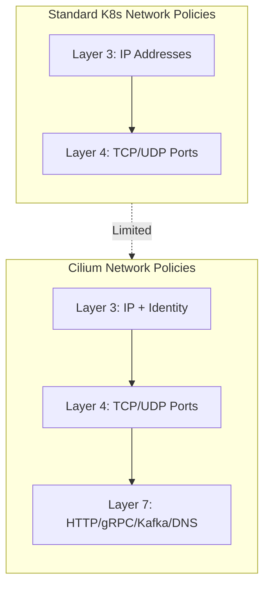
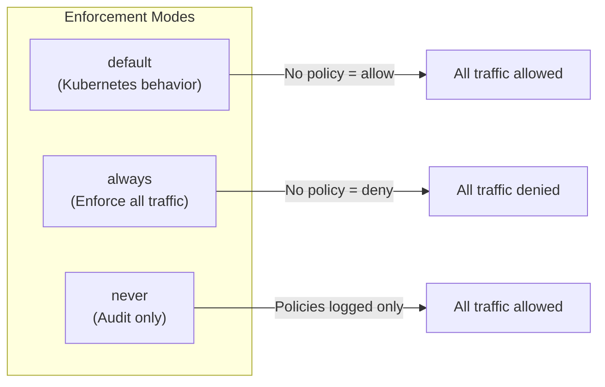
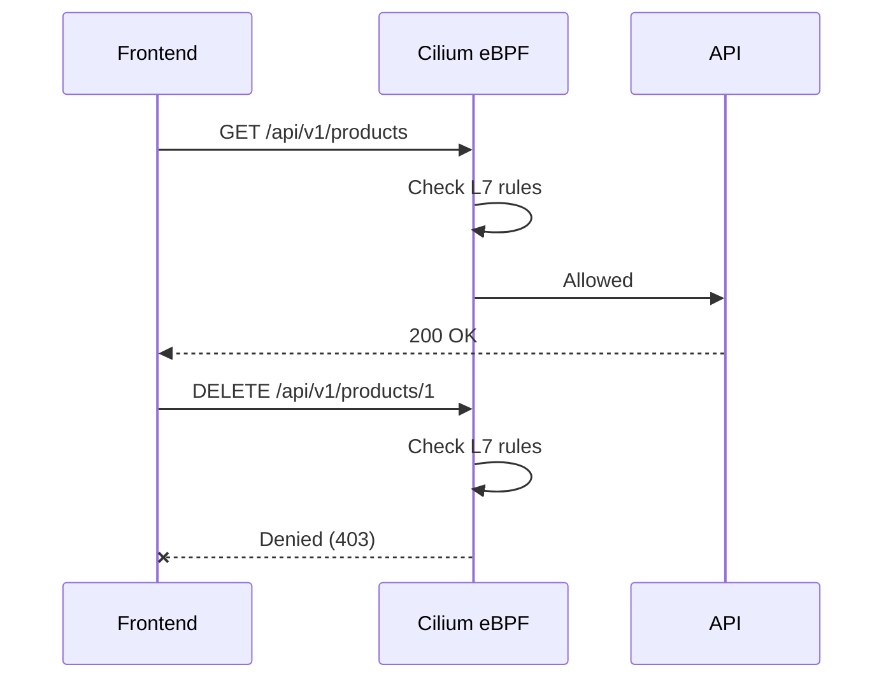
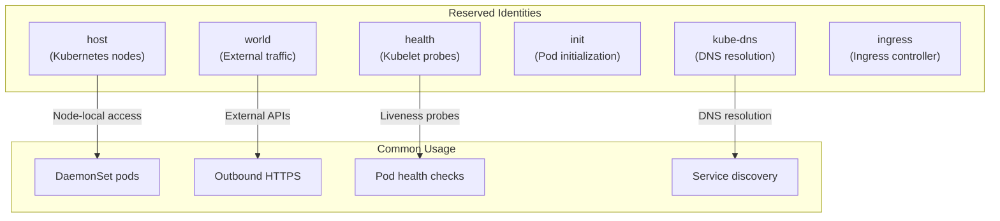
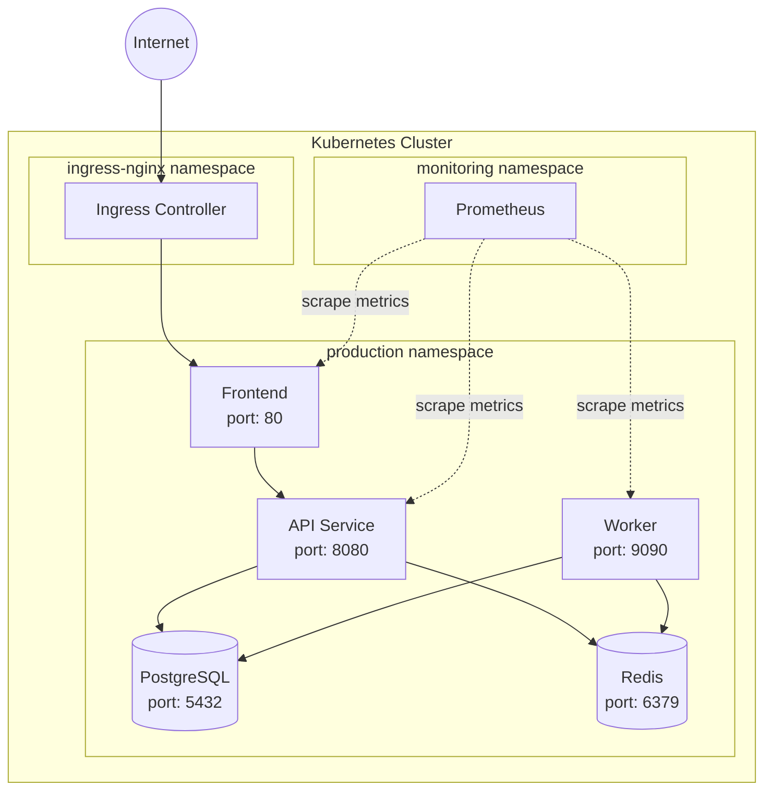

# How to Use Cilium Network Policies

Author: [nawazdhandala](https://www.github.com/nawazdhandala)

Tags: Kubernetes, Cilium, Network Policies, Security, eBPF, L7 Policies, Zero Trust, Networking

Description: A comprehensive guide to implementing advanced network security in Kubernetes using Cilium Network Policies, covering L3/L4 policies, L7 HTTP filtering, endpoint selectors, and policy enforcement modes.

---

> "The network is the computer, and securing it is securing everything." - Adapted from John Gage

Cilium takes Kubernetes networking to the next level with eBPF-powered network policies. While standard Kubernetes Network Policies work at Layer 3/4, Cilium extends this to Layer 7, letting you filter HTTP methods, paths, and even headers. This guide covers everything from basic L3/L4 policies to advanced L7 filtering.

## Why Cilium Network Policies?

Standard Kubernetes Network Policies are limited to IP addresses and ports. Cilium Network Policies offer:

- **L7 Protocol Awareness**: Filter HTTP, gRPC, Kafka, and DNS at the application layer
- **Identity-Based Security**: Use Kubernetes labels instead of IP addresses
- **DNS-Aware Egress**: Allow traffic to specific FQDNs, not just IP blocks
- **Better Performance**: eBPF runs in the kernel, avoiding iptables overhead



## Understanding Cilium Concepts

### Endpoints and Identities

Cilium assigns each pod an identity based on its labels. Policies reference these identities, not IPs.

```bash
# View Cilium endpoints and their identities
cilium endpoint list

# Output shows endpoint ID, identity, and labels
# ENDPOINT   POLICY    IDENTITY   LABELS
# 1234       Enabled   54321      k8s:app=frontend
```

### Policy Enforcement Modes

Cilium supports three enforcement modes:



Configure the mode in your Cilium ConfigMap:

```yaml
# Cilium ConfigMap configuration for policy enforcement mode
apiVersion: v1
kind: ConfigMap
metadata:
  name: cilium-config
  namespace: kube-system
data:
  # "default" - Standard Kubernetes behavior: no policy means allow all
  # "always" - Zero-trust: no policy means deny all (most secure)
  # "never" - Audit mode: policies are logged but not enforced
  enable-policy: "default"
```

Or via Helm during installation:

```bash
# Install Cilium with always-enforce mode for zero-trust security
helm upgrade --install cilium cilium/cilium \
  --namespace kube-system \
  --set policyEnforcementMode=always
```

## L3/L4 Policies: The Foundation

L3/L4 policies control traffic based on IP addresses, CIDR blocks, and ports.

### Basic Ingress Policy

Allow traffic from specific pods to your API service:

```yaml
# CiliumNetworkPolicy: Allow frontend pods to access API on port 8080
# This policy uses endpoint selectors based on Kubernetes labels
apiVersion: cilium.io/v2
kind: CiliumNetworkPolicy
metadata:
  name: api-allow-frontend
  namespace: production
spec:
  # Target pods with label app=api
  endpointSelector:
    matchLabels:
      app: api
  ingress:
    # Allow traffic from pods with label app=frontend
    - fromEndpoints:
        - matchLabels:
            app: frontend
      # Only allow TCP traffic on port 8080
      toPorts:
        - ports:
            - port: "8080"
              protocol: TCP
```

### Egress Policy with CIDR Blocks

Control outbound traffic to external services:

```yaml
# CiliumNetworkPolicy: Allow payment service to reach external payment gateways
# Uses CIDR blocks for external IP ranges
apiVersion: cilium.io/v2
kind: CiliumNetworkPolicy
metadata:
  name: payment-external-egress
  namespace: production
spec:
  endpointSelector:
    matchLabels:
      app: payment-service
  egress:
    # Allow HTTPS to external payment processors
    - toCIDR:
        - 203.0.113.0/24  # Example: Stripe IP range
        - 198.51.100.0/24 # Example: PayPal IP range
      toPorts:
        - ports:
            - port: "443"
              protocol: TCP
    # Explicitly deny internal network ranges
    - toCIDRSet:
        - cidr: 0.0.0.0/0
          except:
            - 10.0.0.0/8
            - 172.16.0.0/12
            - 192.168.0.0/16
```

### Cross-Namespace Communication

Allow pods in one namespace to access services in another:

```yaml
# CiliumNetworkPolicy: Allow monitoring namespace to scrape metrics
# Demonstrates cross-namespace communication with namespace selectors
apiVersion: cilium.io/v2
kind: CiliumNetworkPolicy
metadata:
  name: allow-prometheus-scrape
  namespace: production
spec:
  # Apply to all pods in the production namespace
  endpointSelector: {}
  ingress:
    # Allow from Prometheus in the monitoring namespace
    - fromEndpoints:
        - matchLabels:
            # k8s:io.kubernetes.pod.namespace is a reserved label
            k8s:io.kubernetes.pod.namespace: monitoring
            app: prometheus
      toPorts:
        - ports:
            # Metrics endpoint
            - port: "9090"
              protocol: TCP
            # Application metrics
            - port: "8080"
              protocol: TCP
```

## L7 Policies: Application-Layer Security

This is where Cilium shines. L7 policies let you filter based on HTTP methods, paths, headers, and more.

### HTTP Method and Path Filtering

Restrict API access to specific methods and paths:

```yaml
# CiliumNetworkPolicy: L7 HTTP policy for fine-grained API access control
# Only allows specific HTTP methods and paths from frontend
apiVersion: cilium.io/v2
kind: CiliumNetworkPolicy
metadata:
  name: api-l7-restrictions
  namespace: production
spec:
  endpointSelector:
    matchLabels:
      app: api
  ingress:
    - fromEndpoints:
        - matchLabels:
            app: frontend
      toPorts:
        - ports:
            - port: "8080"
              protocol: TCP
          # L7 rules define allowed HTTP patterns
          rules:
            http:
              # Allow GET requests to any /api/v1/ endpoint
              - method: GET
                path: "/api/v1/.*"
              # Allow POST only to specific endpoints
              - method: POST
                path: "/api/v1/orders"
              - method: POST
                path: "/api/v1/users"
              # Allow health checks
              - method: GET
                path: "/health"
              - method: GET
                path: "/ready"
```



### HTTP Header-Based Filtering

Filter requests based on HTTP headers:

```yaml
# CiliumNetworkPolicy: L7 policy with header-based access control
# Only allows requests with valid API key header
apiVersion: cilium.io/v2
kind: CiliumNetworkPolicy
metadata:
  name: api-header-auth
  namespace: production
spec:
  endpointSelector:
    matchLabels:
      app: api
  ingress:
    - fromEndpoints:
        - matchLabels:
            app: external-gateway
      toPorts:
        - ports:
            - port: "8080"
              protocol: TCP
          rules:
            http:
              # Only allow requests with specific headers
              - method: GET
                path: "/api/.*"
                headers:
                  # Require API version header
                  - "X-API-Version: v1"
              # Admin endpoints require admin header
              - method: ".*"
                path: "/admin/.*"
                headers:
                  - "X-Admin-Token: .*"
```

### gRPC Policy

Filter gRPC services by service and method name:

```yaml
# CiliumNetworkPolicy: L7 gRPC policy for service-level access control
# Restricts which gRPC methods can be called
apiVersion: cilium.io/v2
kind: CiliumNetworkPolicy
metadata:
  name: grpc-service-policy
  namespace: production
spec:
  endpointSelector:
    matchLabels:
      app: user-service
  ingress:
    - fromEndpoints:
        - matchLabels:
            app: api-gateway
      toPorts:
        - ports:
            - port: "50051"
              protocol: TCP
          rules:
            http:
              # Allow specific gRPC methods
              # gRPC uses HTTP/2, paths are /package.Service/Method
              - method: POST
                path: "/user.UserService/GetUser"
              - method: POST
                path: "/user.UserService/ListUsers"
              # Block DeleteUser from gateway
              # - method: POST
              #   path: "/user.UserService/DeleteUser"
```

## Endpoint Selectors Deep Dive

Endpoint selectors are the heart of Cilium policies. They determine which pods a policy applies to.

### Label-Based Selection

The most common selector type:

```yaml
# Various endpoint selector patterns
apiVersion: cilium.io/v2
kind: CiliumNetworkPolicy
metadata:
  name: selector-examples
  namespace: production
spec:
  # Match pods with ALL specified labels (AND logic)
  endpointSelector:
    matchLabels:
      app: api
      environment: production
      team: backend
---
apiVersion: cilium.io/v2
kind: CiliumNetworkPolicy
metadata:
  name: selector-expressions
  namespace: production
spec:
  # Match using expressions for complex logic
  endpointSelector:
    matchExpressions:
      # app label must be either api or worker
      - key: app
        operator: In
        values:
          - api
          - worker
      # Must NOT be in test environment
      - key: environment
        operator: NotIn
        values:
          - test
          - development
      # Must have a version label (any value)
      - key: version
        operator: Exists
```

### Reserved Identities

Cilium has special identities for system traffic:

```yaml
# CiliumNetworkPolicy: Using reserved identities for system traffic
apiVersion: cilium.io/v2
kind: CiliumNetworkPolicy
metadata:
  name: allow-system-traffic
  namespace: production
spec:
  endpointSelector:
    matchLabels:
      app: api
  ingress:
    # Allow traffic from host (node)
    - fromEntities:
        - host
    # Allow health checks from Kubernetes
    - fromEntities:
        - health
  egress:
    # Allow DNS to kube-dns
    - toEntities:
        - kube-dns
      toPorts:
        - ports:
            - port: "53"
              protocol: UDP
    # Allow to world (external) - use with caution
    - toEntities:
        - world
      toPorts:
        - ports:
            - port: "443"
              protocol: TCP
```



### Cluster-Wide Policies

Apply policies across all namespaces:

```yaml
# CiliumClusterwideNetworkPolicy: Enforce DNS egress cluster-wide
# This policy applies to ALL pods in ALL namespaces
apiVersion: cilium.io/v2
kind: CiliumClusterwideNetworkPolicy
metadata:
  name: cluster-dns-policy
spec:
  # Empty selector matches all endpoints
  endpointSelector: {}
  egress:
    # Allow DNS to CoreDNS
    - toEndpoints:
        - matchLabels:
            k8s:io.kubernetes.pod.namespace: kube-system
            k8s-app: kube-dns
      toPorts:
        - ports:
            - port: "53"
              protocol: UDP
            - port: "53"
              protocol: TCP
```

## DNS-Based Egress Policies

One of Cilium's most powerful features: allow egress to FQDNs instead of IP addresses.

### FQDN Egress Rules

```yaml
# CiliumNetworkPolicy: DNS-aware egress for external API access
# Allows traffic to specific domains regardless of IP changes
apiVersion: cilium.io/v2
kind: CiliumNetworkPolicy
metadata:
  name: allow-external-apis
  namespace: production
spec:
  endpointSelector:
    matchLabels:
      app: backend
  egress:
    # Allow DNS resolution first (required for FQDN rules)
    - toEntities:
        - kube-dns
      toPorts:
        - ports:
            - port: "53"
              protocol: UDP
    # Allow specific external domains
    - toFQDNs:
        # Exact match
        - matchName: "api.github.com"
        - matchName: "api.stripe.com"
        # Wildcard pattern for subdomains
        - matchPattern: "*.amazonaws.com"
        - matchPattern: "*.s3.amazonaws.com"
      toPorts:
        - ports:
            - port: "443"
              protocol: TCP
```

### DNS Visibility and Logging

Enable DNS visibility to see what domains pods are accessing:

```yaml
# CiliumNetworkPolicy: Enable DNS proxy for visibility
apiVersion: cilium.io/v2
kind: CiliumNetworkPolicy
metadata:
  name: dns-visibility
  namespace: production
spec:
  endpointSelector:
    matchLabels:
      app: backend
  egress:
    - toEntities:
        - kube-dns
      toPorts:
        - ports:
            - port: "53"
              protocol: UDP
          rules:
            dns:
              # Log all DNS queries
              - matchPattern: "*"
```

View DNS queries with Hubble:

```bash
# Enable Hubble for traffic observation
cilium hubble enable

# Watch DNS queries from a specific pod
hubble observe --namespace production --pod backend --protocol DNS

# Output example:
# TIMESTAMP         SOURCE          DESTINATION      TYPE    NAMES
# Jan 27 10:15:32   production/backend  kube-system/coredns  DNS Query  api.github.com
```

## Policy Enforcement Modes in Practice

### Default Mode

Standard Kubernetes behavior - no policy means allow all:

```yaml
# With default mode, this allows frontend->api, everything else still works
apiVersion: cilium.io/v2
kind: CiliumNetworkPolicy
metadata:
  name: api-ingress
  namespace: production
spec:
  endpointSelector:
    matchLabels:
      app: api
  ingress:
    - fromEndpoints:
        - matchLabels:
            app: frontend
```

### Always Mode (Zero Trust)

No policy means deny all - most secure option:

```bash
# Enable always-enforce mode
kubectl patch configmap cilium-config -n kube-system \
  --type merge \
  -p '{"data":{"enable-policy":"always"}}'

# Restart Cilium to apply
kubectl rollout restart daemonset/cilium -n kube-system
```

With always mode, you need explicit policies for everything:

```yaml
# In always mode, you need explicit allow rules for all traffic
# This comprehensive policy allows essential traffic
apiVersion: cilium.io/v2
kind: CiliumNetworkPolicy
metadata:
  name: api-complete-policy
  namespace: production
spec:
  endpointSelector:
    matchLabels:
      app: api
  ingress:
    # Allow from frontend
    - fromEndpoints:
        - matchLabels:
            app: frontend
      toPorts:
        - ports:
            - port: "8080"
    # Allow health checks from kubelet
    - fromEntities:
        - health
  egress:
    # Allow DNS
    - toEntities:
        - kube-dns
      toPorts:
        - ports:
            - port: "53"
              protocol: UDP
    # Allow database access
    - toEndpoints:
        - matchLabels:
            app: postgres
      toPorts:
        - ports:
            - port: "5432"
```

### Never Mode (Audit)

Policies are tracked but not enforced - useful for testing:

```bash
# Enable audit mode for policy testing
kubectl patch configmap cilium-config -n kube-system \
  --type merge \
  -p '{"data":{"enable-policy":"never"}}'
```

Monitor policy decisions in audit mode:

```bash
# Watch what would be blocked
hubble observe --verdict DROPPED --follow

# Check policy verdicts for a specific pod
cilium endpoint get <endpoint-id> | grep PolicyVerdicts
```

## Complete Example: Microservices Architecture

Here's a complete policy set for a typical three-tier application:



```yaml
# Complete Cilium Network Policy set for three-tier microservices
# File: policies/production-policies.yaml

# 1. Default deny all traffic in production namespace
---
apiVersion: cilium.io/v2
kind: CiliumNetworkPolicy
metadata:
  name: default-deny
  namespace: production
spec:
  endpointSelector: {}
  ingress:
    - {}
  egress:
    - {}

# 2. Allow DNS for all pods (required for service discovery)
---
apiVersion: cilium.io/v2
kind: CiliumNetworkPolicy
metadata:
  name: allow-dns
  namespace: production
spec:
  endpointSelector: {}
  egress:
    - toEntities:
        - kube-dns
      toPorts:
        - ports:
            - port: "53"
              protocol: UDP

# 3. Frontend policies
---
apiVersion: cilium.io/v2
kind: CiliumNetworkPolicy
metadata:
  name: frontend-ingress
  namespace: production
spec:
  endpointSelector:
    matchLabels:
      app: frontend
  ingress:
    # Allow from ingress controller
    - fromEndpoints:
        - matchLabels:
            k8s:io.kubernetes.pod.namespace: ingress-nginx
      toPorts:
        - ports:
            - port: "80"
    # Allow health checks
    - fromEntities:
        - health
---
apiVersion: cilium.io/v2
kind: CiliumNetworkPolicy
metadata:
  name: frontend-egress
  namespace: production
spec:
  endpointSelector:
    matchLabels:
      app: frontend
  egress:
    # Allow to API service only
    - toEndpoints:
        - matchLabels:
            app: api
      toPorts:
        - ports:
            - port: "8080"

# 4. API policies with L7 rules
---
apiVersion: cilium.io/v2
kind: CiliumNetworkPolicy
metadata:
  name: api-ingress
  namespace: production
spec:
  endpointSelector:
    matchLabels:
      app: api
  ingress:
    - fromEndpoints:
        - matchLabels:
            app: frontend
      toPorts:
        - ports:
            - port: "8080"
          rules:
            http:
              # Public API endpoints
              - method: GET
                path: "/api/v1/.*"
              - method: POST
                path: "/api/v1/orders"
              - method: POST
                path: "/api/v1/auth/.*"
              # Health endpoints
              - method: GET
                path: "/health"
              - method: GET
                path: "/ready"
    # Allow Prometheus scraping
    - fromEndpoints:
        - matchLabels:
            k8s:io.kubernetes.pod.namespace: monitoring
            app: prometheus
      toPorts:
        - ports:
            - port: "9090"
---
apiVersion: cilium.io/v2
kind: CiliumNetworkPolicy
metadata:
  name: api-egress
  namespace: production
spec:
  endpointSelector:
    matchLabels:
      app: api
  egress:
    # Database access
    - toEndpoints:
        - matchLabels:
            app: postgres
      toPorts:
        - ports:
            - port: "5432"
    # Redis cache access
    - toEndpoints:
        - matchLabels:
            app: redis
      toPorts:
        - ports:
            - port: "6379"
    # External APIs (e.g., payment processor)
    - toFQDNs:
        - matchName: "api.stripe.com"
      toPorts:
        - ports:
            - port: "443"

# 5. Database policies - most restrictive
---
apiVersion: cilium.io/v2
kind: CiliumNetworkPolicy
metadata:
  name: postgres-ingress
  namespace: production
spec:
  endpointSelector:
    matchLabels:
      app: postgres
  ingress:
    # Only API and Worker can access database
    - fromEndpoints:
        - matchLabels:
            app: api
        - matchLabels:
            app: worker
      toPorts:
        - ports:
            - port: "5432"

# 6. Redis policies
---
apiVersion: cilium.io/v2
kind: CiliumNetworkPolicy
metadata:
  name: redis-ingress
  namespace: production
spec:
  endpointSelector:
    matchLabels:
      app: redis
  ingress:
    - fromEndpoints:
        - matchLabels:
            app: api
        - matchLabels:
            app: worker
      toPorts:
        - ports:
            - port: "6379"
```

## Testing and Debugging Policies

### Verify Policy Application

```bash
# Check if policies are applied to endpoints
cilium endpoint list

# Get detailed policy status for an endpoint
cilium endpoint get <endpoint-id>

# List all policies
kubectl get cnp,ccnp -A

# Describe a specific policy
kubectl describe ciliumnetworkpolicy api-ingress -n production
```

### Use Hubble for Traffic Analysis

```bash
# Install Hubble CLI
HUBBLE_VERSION=$(curl -s https://raw.githubusercontent.com/cilium/hubble/master/stable.txt)
curl -L --remote-name-all https://github.com/cilium/hubble/releases/download/$HUBBLE_VERSION/hubble-linux-amd64.tar.gz
tar xzvf hubble-linux-amd64.tar.gz
sudo mv hubble /usr/local/bin

# Enable Hubble relay
cilium hubble enable

# Port forward to Hubble
kubectl port-forward -n kube-system svc/hubble-relay 4245:80 &

# Watch all traffic
hubble observe --follow

# Filter by namespace
hubble observe --namespace production

# Show only dropped traffic (policy violations)
hubble observe --verdict DROPPED

# Filter by pod
hubble observe --pod production/api-7d8f9c6b5-abc12

# Show L7 HTTP traffic
hubble observe --protocol HTTP
```

### Connectivity Test

```bash
# Run Cilium connectivity test
cilium connectivity test

# Test specific scenarios
cilium connectivity test --test client-egress
cilium connectivity test --test pod-to-pod
```

## Monitoring Cilium Policies with OneUptime

Network policies are critical security controls. Monitor their effectiveness with [OneUptime](https://oneuptime.com):

1. **Policy Enforcement Metrics**: Track policy allow/deny decisions
2. **Hubble Flow Logs**: Ingest Cilium flow logs for security analysis
3. **Alert on Policy Violations**: Get notified when unexpected traffic is blocked
4. **Visualize Traffic Patterns**: Understand your microservices communication

```yaml
# Example: Export Cilium metrics to OneUptime via OpenTelemetry
apiVersion: v1
kind: ConfigMap
metadata:
  name: otel-collector-config
  namespace: monitoring
data:
  config.yaml: |
    receivers:
      prometheus:
        config:
          scrape_configs:
            - job_name: 'cilium'
              kubernetes_sd_configs:
                - role: pod
              relabel_configs:
                - source_labels: [__meta_kubernetes_pod_label_k8s_app]
                  regex: cilium
                  action: keep
    exporters:
      otlp:
        endpoint: "https://otlp.oneuptime.com:4317"
        headers:
          x-oneuptime-token: "${ONEUPTIME_TOKEN}"
    service:
      pipelines:
        metrics:
          receivers: [prometheus]
          exporters: [otlp]
```

## Best Practices Summary

1. **Start with Default Deny**: Apply default-deny policies before adding allow rules
2. **Use Labels, Not IPs**: Identity-based policies survive pod restarts and scaling
3. **Layer L7 on L4**: Start with L3/L4 policies, add L7 rules for sensitive endpoints
4. **Test in Audit Mode**: Use `enable-policy: never` to validate before enforcing
5. **Monitor with Hubble**: Enable observability to understand traffic patterns
6. **Version Control Policies**: Store policies in Git, deploy via GitOps
7. **Document Everything**: Comment why each policy exists, not just what it does
8. **Review Regularly**: Audit policies quarterly for stale or overly permissive rules

---

Cilium Network Policies give you fine-grained control over Kubernetes networking that standard Network Policies simply cannot match. The combination of eBPF performance, L7 filtering, and DNS-aware egress makes Cilium the gold standard for Kubernetes network security. Start with the basics, enable Hubble for visibility, and progressively add L7 policies as your security requirements grow.
