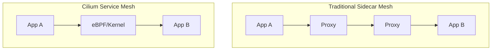
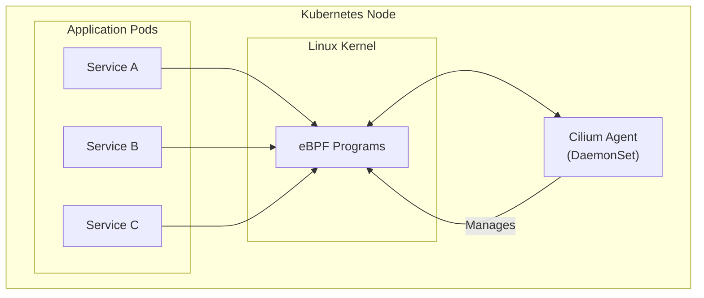
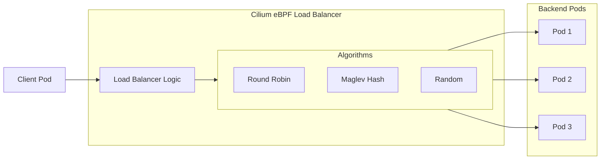
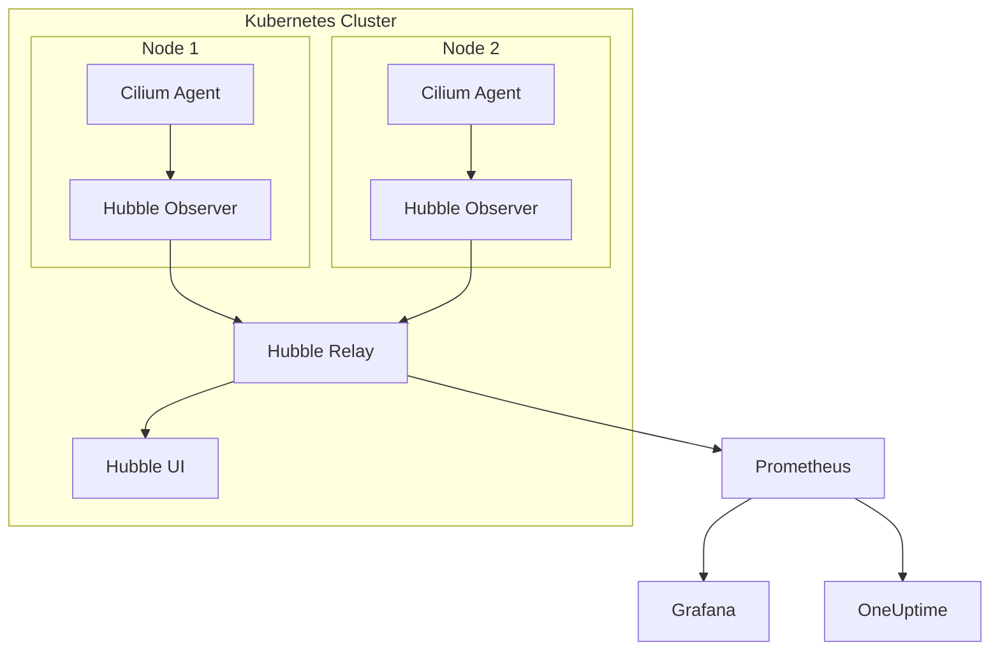
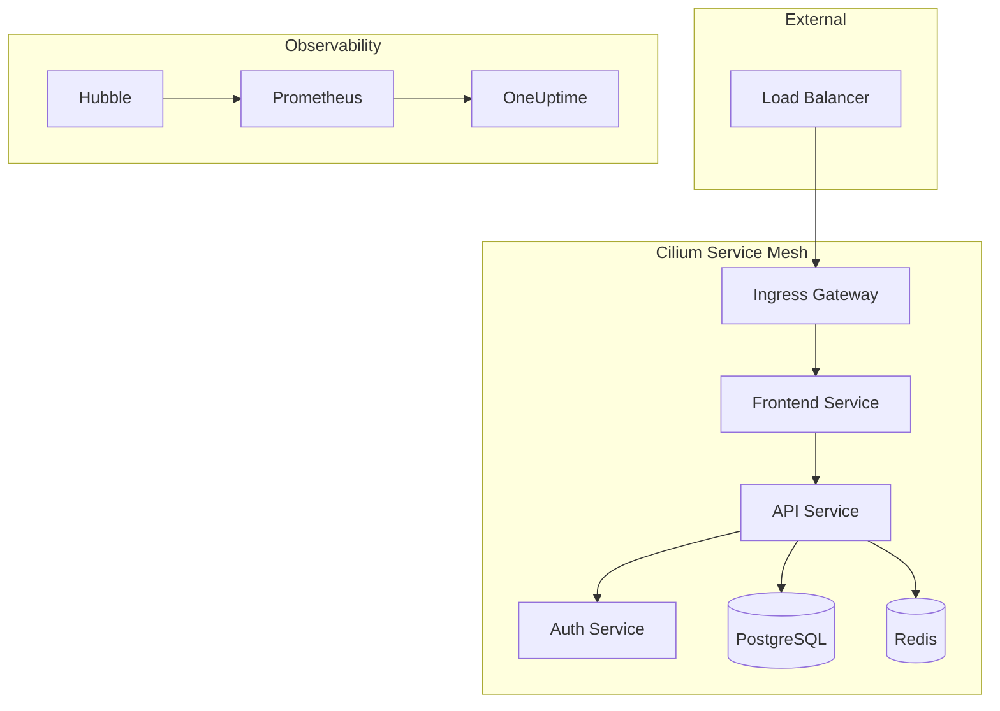

# How to Implement Cilium Service Mesh

Author: [nawazdhandala](https://www.github.com/nawazdhandala)

Tags: Cilium, Service Mesh, Kubernetes, eBPF, mTLS, Observability, Hubble, Load Balancing, Sidecar-Free

Description: A comprehensive guide to implementing Cilium Service Mesh in Kubernetes, covering sidecar-free architecture, mTLS encryption, load balancing, and observability with Hubble.

---

> "The best service mesh is the one you don't notice - it just works at the kernel level." - Cilium Philosophy

Service meshes have traditionally relied on sidecar proxies to handle traffic between services. Cilium takes a radically different approach by leveraging eBPF (extended Berkeley Packet Filter) to implement service mesh capabilities directly in the Linux kernel. This eliminates the overhead of sidecars while providing superior performance and observability.

## Why Cilium Service Mesh?

Traditional service meshes like Istio or Linkerd inject a sidecar proxy container alongside every application pod. While effective, this approach has drawbacks:

- **Resource overhead**: Each sidecar consumes CPU and memory
- **Latency**: Traffic must traverse the sidecar proxy
- **Complexity**: More containers to manage and debug
- **Cold start**: Sidecars add to pod startup time

Cilium's eBPF-based approach runs at the kernel level, eliminating these concerns entirely.



## Prerequisites

Before implementing Cilium Service Mesh, ensure you have:

- Kubernetes cluster version 1.21 or higher
- Helm 3.x installed
- kubectl configured with cluster access
- Linux kernel 4.19+ (5.10+ recommended for full features)

Check your kernel version:

```bash
# Verify kernel version supports eBPF features
# Cilium requires kernel 4.19+, but 5.10+ enables all features
uname -r
```

## Installing Cilium with Service Mesh Features

### Step 1: Add the Cilium Helm Repository

```bash
# Add the official Cilium Helm repository
# This provides access to Cilium charts and updates
helm repo add cilium https://helm.cilium.io/

# Update repository cache to get latest chart versions
helm repo update
```

### Step 2: Install Cilium with Service Mesh Enabled

```bash
# Install Cilium with service mesh features enabled
# Key flags:
#   --set kubeProxyReplacement=true: Replace kube-proxy with Cilium
#   --set ingressController.enabled=true: Enable ingress controller
#   --set hubble.enabled=true: Enable observability
#   --set hubble.relay.enabled=true: Enable Hubble API relay
#   --set hubble.ui.enabled=true: Enable Hubble web UI
helm install cilium cilium/cilium --version 1.15.0 \
  --namespace kube-system \
  --set kubeProxyReplacement=true \
  --set k8sServiceHost=${API_SERVER_IP} \
  --set k8sServicePort=${API_SERVER_PORT} \
  --set ingressController.enabled=true \
  --set ingressController.loadBalancerMode=dedicated \
  --set hubble.enabled=true \
  --set hubble.relay.enabled=true \
  --set hubble.ui.enabled=true \
  --set encryption.enabled=true \
  --set encryption.type=wireguard
```

### Step 3: Verify Installation

```bash
# Check Cilium deployment status
# All pods should be Running with 1/1 Ready
kubectl get pods -n kube-system -l k8s-app=cilium

# Verify Cilium status using the CLI
# This shows connectivity status and feature enablement
cilium status --wait
```

Expected output shows all components healthy:

```
    /¯¯\
 /¯¯\__/¯¯\    Cilium:             OK
 \__/¯¯\__/    Operator:           OK
 /¯¯\__/¯¯\    Envoy DaemonSet:    OK
 \__/¯¯\__/    Hubble Relay:       OK
    \__/       ClusterMesh:        disabled

Cluster Pods:      18/18 managed by Cilium
Helm chart version: 1.15.0
```

## Sidecar-Free Architecture

Cilium's sidecar-free approach is the core differentiator. Here's how the architecture works:



The Cilium agent runs as a DaemonSet on each node, programming eBPF hooks into the kernel. These hooks intercept network traffic without requiring any changes to your application pods.

### Enable Service Mesh for a Namespace

```yaml
# namespace-mesh.yaml
# Enable Cilium service mesh features for the production namespace
# The annotation tells Cilium to apply mesh policies to pods in this namespace
apiVersion: v1
kind: Namespace
metadata:
  name: production
  annotations:
    # Enable service mesh features for this namespace
    cilium.io/service-mesh: "enabled"
  labels:
    # Label for policy selection
    environment: production
```

Apply the configuration:

```bash
# Apply namespace configuration
kubectl apply -f namespace-mesh.yaml
```

## Implementing mTLS with Cilium

Mutual TLS (mTLS) ensures all service-to-service communication is encrypted and authenticated. Cilium provides two approaches: WireGuard-based encryption and SPIFFE/SPIRE integration.

### Option 1: WireGuard Encryption (Recommended)

WireGuard provides transparent encryption at the node level:

```yaml
# cilium-wireguard-config.yaml
# ConfigMap to enable WireGuard encryption for all pod traffic
# WireGuard operates at Layer 3, encrypting all traffic between nodes
apiVersion: v1
kind: ConfigMap
metadata:
  name: cilium-config
  namespace: kube-system
data:
  # Enable WireGuard-based encryption
  enable-wireguard: "true"
  # Encrypt traffic between nodes
  encrypt-node: "true"
```

Verify encryption is active:

```bash
# Check WireGuard encryption status
# Shows encryption enabled and peer information
cilium encrypt status

# Expected output:
# Encryption: Wireguard
# Keys in use: 1
# Max Seq. Number: 0x12345/0xffffffff
```

### Option 2: SPIFFE/SPIRE Integration for mTLS

For workload identity-based mTLS:

```yaml
# cilium-spire-config.yaml
# Cilium Helm values for SPIFFE/SPIRE integration
# This provides cryptographic workload identities
authentication:
  mutual:
    spire:
      enabled: true
      install:
        enabled: true
        namespace: cilium-spire
        server:
          dataStorage:
            size: 1Gi
```

Install with SPIRE:

```bash
# Install Cilium with SPIRE for mTLS
# SPIRE provides SPIFFE identities for workloads
helm upgrade cilium cilium/cilium --version 1.15.0 \
  --namespace kube-system \
  --reuse-values \
  --set authentication.mutual.spire.enabled=true \
  --set authentication.mutual.spire.install.enabled=true
```

### Enforce mTLS with CiliumNetworkPolicy

```yaml
# mtls-policy.yaml
# CiliumNetworkPolicy requiring mTLS authentication
# This policy ensures only authenticated traffic is allowed
apiVersion: cilium.io/v2
kind: CiliumNetworkPolicy
metadata:
  name: require-mtls
  namespace: production
spec:
  # Apply to all endpoints in the namespace
  endpointSelector: {}
  ingress:
    - fromEndpoints:
        - {}
      authentication:
        # Require mutual TLS authentication
        mode: "required"
  egress:
    - toEndpoints:
        - {}
      authentication:
        mode: "required"
```

## Load Balancing with Cilium

Cilium provides advanced load balancing capabilities that replace kube-proxy with eBPF-based implementations.

### Service Load Balancing Architecture



### Configure Maglev Load Balancing

Maglev provides consistent hashing for better connection affinity:

```bash
# Enable Maglev consistent hashing algorithm
# Maglev provides minimal disruption when backends change
helm upgrade cilium cilium/cilium --version 1.15.0 \
  --namespace kube-system \
  --reuse-values \
  --set loadBalancer.algorithm=maglev \
  --set maglev.tableSize=65521
```

### Service Configuration with Annotations

```yaml
# service-lb.yaml
# Service with Cilium-specific load balancing annotations
apiVersion: v1
kind: Service
metadata:
  name: api-service
  namespace: production
  annotations:
    # Use Maglev for this specific service
    cilium.io/lb-algorithm: "maglev"
    # Enable session affinity using source IP
    cilium.io/lb-affinity: "sourceIP"
    # Session timeout in seconds
    cilium.io/lb-affinity-timeout: "3600"
spec:
  type: ClusterIP
  selector:
    app: api
  ports:
    - port: 80
      targetPort: 8080
      protocol: TCP
```

### L7 Load Balancing with Envoy

For HTTP-aware load balancing, Cilium uses Envoy:

```yaml
# l7-policy.yaml
# CiliumNetworkPolicy with L7 HTTP load balancing rules
# This enables HTTP-aware routing and load balancing
apiVersion: cilium.io/v2
kind: CiliumNetworkPolicy
metadata:
  name: api-l7-lb
  namespace: production
spec:
  endpointSelector:
    matchLabels:
      app: api-gateway
  egress:
    - toEndpoints:
        - matchLabels:
            app: backend-api
      toPorts:
        - ports:
            - port: "8080"
              protocol: TCP
          rules:
            http:
              # Route based on HTTP path
              - method: "GET"
                path: "/api/v1/.*"
              - method: "POST"
                path: "/api/v1/orders"
                headers:
                  - "Content-Type: application/json"
```

### Weighted Load Balancing

```yaml
# weighted-service.yaml
# CiliumEnvoyConfig for weighted traffic splitting
# Useful for canary deployments and A/B testing
apiVersion: cilium.io/v2
kind: CiliumEnvoyConfig
metadata:
  name: weighted-routing
  namespace: production
spec:
  services:
    - name: api-service
      namespace: production
  backendServices:
    - name: api-v1
      namespace: production
      weight: 90  # 90% of traffic
    - name: api-v2
      namespace: production
      weight: 10  # 10% of traffic (canary)
```

## Observability with Hubble

Hubble is Cilium's observability layer, providing deep visibility into network flows, service dependencies, and security events.

### Hubble Architecture



### Install Hubble CLI

```bash
# Download and install Hubble CLI
# The CLI provides command-line access to observe network flows
HUBBLE_VERSION=$(curl -s https://raw.githubusercontent.com/cilium/hubble/master/stable.txt)
curl -L --remote-name-all https://github.com/cilium/hubble/releases/download/$HUBBLE_VERSION/hubble-linux-amd64.tar.gz
tar xzvf hubble-linux-amd64.tar.gz
sudo mv hubble /usr/local/bin/

# Verify installation
hubble version
```

### Enable Hubble Metrics

```bash
# Enable comprehensive Hubble metrics for observability
# These metrics integrate with Prometheus for monitoring
helm upgrade cilium cilium/cilium --version 1.15.0 \
  --namespace kube-system \
  --reuse-values \
  --set hubble.metrics.enabled="{dns,drop,tcp,flow,icmp,http}" \
  --set hubble.metrics.serviceMonitor.enabled=true
```

### Access Hubble UI

```bash
# Port-forward to access Hubble UI locally
# The UI provides visual service maps and flow inspection
kubectl port-forward -n kube-system svc/hubble-ui 12000:80

# Open browser to http://localhost:12000
```

### Observe Traffic with Hubble CLI

```bash
# Observe all traffic in a namespace
# Shows real-time network flows with source and destination
hubble observe --namespace production

# Filter by verdict (forwarded, dropped, etc.)
hubble observe --verdict DROPPED

# Observe specific service traffic
hubble observe --to-service production/api-service

# Watch HTTP traffic with detailed information
hubble observe --protocol http -o json

# Export flows for analysis
hubble observe --namespace production -o json > flows.json
```

### Example Hubble Output

```bash
# Sample output showing service-to-service communication
Jan 27 10:15:23.456: production/frontend-abc123 -> production/api-def456 http-request FORWARDED (HTTP/1.1 GET /api/v1/users)
Jan 27 10:15:23.489: production/api-def456 -> production/frontend-abc123 http-response FORWARDED (HTTP/1.1 200 OK)
Jan 27 10:15:24.123: production/api-def456 -> production/postgres-ghi789 tcp-flags FORWARDED (SYN)
```

### Hubble Metrics for Prometheus

```yaml
# hubble-servicemonitor.yaml
# ServiceMonitor for Prometheus to scrape Hubble metrics
apiVersion: monitoring.coreos.com/v1
kind: ServiceMonitor
metadata:
  name: hubble-metrics
  namespace: kube-system
  labels:
    app: hubble
spec:
  selector:
    matchLabels:
      k8s-app: hubble
  namespaceSelector:
    matchNames:
      - kube-system
  endpoints:
    - port: hubble-metrics
      interval: 30s
      path: /metrics
```

### Grafana Dashboard for Cilium

```yaml
# grafana-dashboard-configmap.yaml
# ConfigMap containing Grafana dashboard for Cilium metrics
apiVersion: v1
kind: ConfigMap
metadata:
  name: cilium-dashboard
  namespace: monitoring
  labels:
    grafana_dashboard: "true"
data:
  cilium-dashboard.json: |
    {
      "title": "Cilium Service Mesh",
      "panels": [
        {
          "title": "Request Rate by Service",
          "type": "graph",
          "targets": [
            {
              "expr": "sum(rate(hubble_http_requests_total[5m])) by (destination_service)"
            }
          ]
        },
        {
          "title": "Request Latency P99",
          "type": "graph",
          "targets": [
            {
              "expr": "histogram_quantile(0.99, sum(rate(hubble_http_request_duration_seconds_bucket[5m])) by (le, destination_service))"
            }
          ]
        },
        {
          "title": "Dropped Packets",
          "type": "graph",
          "targets": [
            {
              "expr": "sum(rate(hubble_drop_total[5m])) by (reason)"
            }
          ]
        }
      ]
    }
```

## Complete Example: Microservices with Cilium Service Mesh

Let's deploy a complete microservices application with Cilium Service Mesh:

### Application Architecture



### Namespace and Base Configuration

```yaml
# namespace.yaml
# Create namespace with Cilium mesh enabled
apiVersion: v1
kind: Namespace
metadata:
  name: microservices
  annotations:
    cilium.io/service-mesh: "enabled"
  labels:
    environment: production
---
# Default deny policy for zero-trust
apiVersion: cilium.io/v2
kind: CiliumNetworkPolicy
metadata:
  name: default-deny
  namespace: microservices
spec:
  endpointSelector: {}
  ingress:
    - {}
  egress:
    - {}
```

### Service Definitions

```yaml
# services.yaml
# Frontend Service
apiVersion: apps/v1
kind: Deployment
metadata:
  name: frontend
  namespace: microservices
spec:
  replicas: 3
  selector:
    matchLabels:
      app: frontend
  template:
    metadata:
      labels:
        app: frontend
        # Labels for Cilium policy selection
        tier: web
    spec:
      containers:
        - name: frontend
          image: frontend:v1.0
          ports:
            - containerPort: 3000
---
apiVersion: v1
kind: Service
metadata:
  name: frontend
  namespace: microservices
spec:
  selector:
    app: frontend
  ports:
    - port: 80
      targetPort: 3000
---
# API Service
apiVersion: apps/v1
kind: Deployment
metadata:
  name: api
  namespace: microservices
spec:
  replicas: 3
  selector:
    matchLabels:
      app: api
  template:
    metadata:
      labels:
        app: api
        tier: backend
    spec:
      containers:
        - name: api
          image: api:v1.0
          ports:
            - containerPort: 8080
---
apiVersion: v1
kind: Service
metadata:
  name: api
  namespace: microservices
  annotations:
    cilium.io/lb-algorithm: "maglev"
spec:
  selector:
    app: api
  ports:
    - port: 80
      targetPort: 8080
```

### Network Policies

```yaml
# network-policies.yaml
# Allow ingress to frontend from ingress controller
apiVersion: cilium.io/v2
kind: CiliumNetworkPolicy
metadata:
  name: frontend-ingress
  namespace: microservices
spec:
  endpointSelector:
    matchLabels:
      app: frontend
  ingress:
    - fromEntities:
        - world
      toPorts:
        - ports:
            - port: "3000"
              protocol: TCP
---
# Allow frontend to call API with L7 rules
apiVersion: cilium.io/v2
kind: CiliumNetworkPolicy
metadata:
  name: frontend-to-api
  namespace: microservices
spec:
  endpointSelector:
    matchLabels:
      app: frontend
  egress:
    - toEndpoints:
        - matchLabels:
            app: api
      toPorts:
        - ports:
            - port: "8080"
              protocol: TCP
          rules:
            http:
              - method: "GET"
                path: "/api/.*"
              - method: "POST"
                path: "/api/.*"
---
# Allow API to reach database
apiVersion: cilium.io/v2
kind: CiliumNetworkPolicy
metadata:
  name: api-to-database
  namespace: microservices
spec:
  endpointSelector:
    matchLabels:
      app: api
  egress:
    - toEndpoints:
        - matchLabels:
            app: postgres
      toPorts:
        - ports:
            - port: "5432"
              protocol: TCP
---
# Allow API to reach Redis cache
apiVersion: cilium.io/v2
kind: CiliumNetworkPolicy
metadata:
  name: api-to-cache
  namespace: microservices
spec:
  endpointSelector:
    matchLabels:
      app: api
  egress:
    - toEndpoints:
        - matchLabels:
            app: redis
      toPorts:
        - ports:
            - port: "6379"
              protocol: TCP
```

### Ingress Configuration

```yaml
# ingress.yaml
# Cilium Ingress for external traffic
apiVersion: networking.k8s.io/v1
kind: Ingress
metadata:
  name: microservices-ingress
  namespace: microservices
  annotations:
    # Use Cilium ingress controller
    kubernetes.io/ingress.class: cilium
    # Enable TLS termination
    cilium.io/tls-mode: "enabled"
spec:
  tls:
    - hosts:
        - app.example.com
      secretName: app-tls-secret
  rules:
    - host: app.example.com
      http:
        paths:
          - path: /
            pathType: Prefix
            backend:
              service:
                name: frontend
                port:
                  number: 80
          - path: /api
            pathType: Prefix
            backend:
              service:
                name: api
                port:
                  number: 80
```

## Monitoring Cilium with OneUptime

For production deployments, integrate Cilium metrics with [OneUptime](https://oneuptime.com) for comprehensive monitoring, alerting, and incident management.

### Export Metrics to OneUptime

Configure Prometheus remote write to send Cilium metrics to OneUptime:

```yaml
# prometheus-remote-write.yaml
# Configure Prometheus to forward metrics to OneUptime
apiVersion: v1
kind: ConfigMap
metadata:
  name: prometheus-config
  namespace: monitoring
data:
  prometheus.yml: |
    global:
      scrape_interval: 15s

    scrape_configs:
      - job_name: 'hubble'
        kubernetes_sd_configs:
          - role: pod
        relabel_configs:
          - source_labels: [__meta_kubernetes_pod_label_k8s_app]
            regex: hubble
            action: keep

    remote_write:
      - url: "https://oneuptime.com/api/telemetry/metrics"
        headers:
          X-OneUptime-Token: "${ONEUPTIME_TOKEN}"
```

### Key Metrics to Monitor

Set up alerts in OneUptime for these critical Cilium metrics:

| Metric | Description | Alert Threshold |
|--------|-------------|-----------------|
| `hubble_drop_total` | Dropped packets | > 100/min |
| `hubble_http_requests_total` | HTTP request rate | Anomaly detection |
| `hubble_http_request_duration_seconds` | Request latency | P99 > 500ms |
| `cilium_endpoint_state` | Endpoint health | != ready |
| `cilium_unreachable_nodes` | Node connectivity | > 0 |

## Troubleshooting

### Common Issues and Solutions

**Issue: Pods cannot communicate after enabling Cilium**

```bash
# Check Cilium agent status on the node
kubectl exec -n kube-system cilium-xxxxx -- cilium status

# Verify endpoint is correctly registered
kubectl exec -n kube-system cilium-xxxxx -- cilium endpoint list

# Check for policy drops
hubble observe --verdict DROPPED --namespace <namespace>
```

**Issue: mTLS not working**

```bash
# Verify encryption status
cilium encrypt status

# Check SPIRE health (if using SPIRE)
kubectl get pods -n cilium-spire

# View authentication failures
hubble observe --type trace:sock --namespace <namespace>
```

**Issue: High latency after enabling L7 policies**

```bash
# L7 policies require Envoy, which adds latency
# Consider using L4 policies where L7 is not needed

# Check Envoy proxy status
kubectl exec -n kube-system cilium-xxxxx -- cilium envoy admin
```

### Useful Debugging Commands

```bash
# Full connectivity test
cilium connectivity test

# View BPF maps
kubectl exec -n kube-system cilium-xxxxx -- cilium bpf lb list

# Monitor Cilium agent logs
kubectl logs -n kube-system -l k8s-app=cilium -f

# Export complete diagnostic bundle
cilium sysdump
```

## Conclusion

Cilium Service Mesh provides a powerful, sidecar-free alternative to traditional service meshes. By leveraging eBPF, it delivers:

- **Better performance**: No sidecar proxy overhead
- **Transparent encryption**: WireGuard or SPIFFE-based mTLS
- **Advanced load balancing**: Maglev consistent hashing and L7 routing
- **Deep observability**: Hubble provides unparalleled visibility

The key to success with Cilium is starting simple - enable basic features first, then gradually add mTLS, L7 policies, and advanced observability as your team becomes comfortable with the platform.

For production deployments, integrate with [OneUptime](https://oneuptime.com) to monitor your service mesh health, track SLOs, and receive alerts when issues arise. OneUptime's native Prometheus integration makes it easy to visualize Cilium and Hubble metrics alongside your application telemetry.
