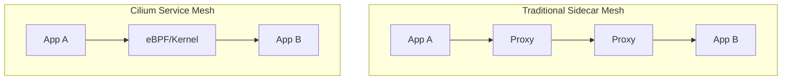
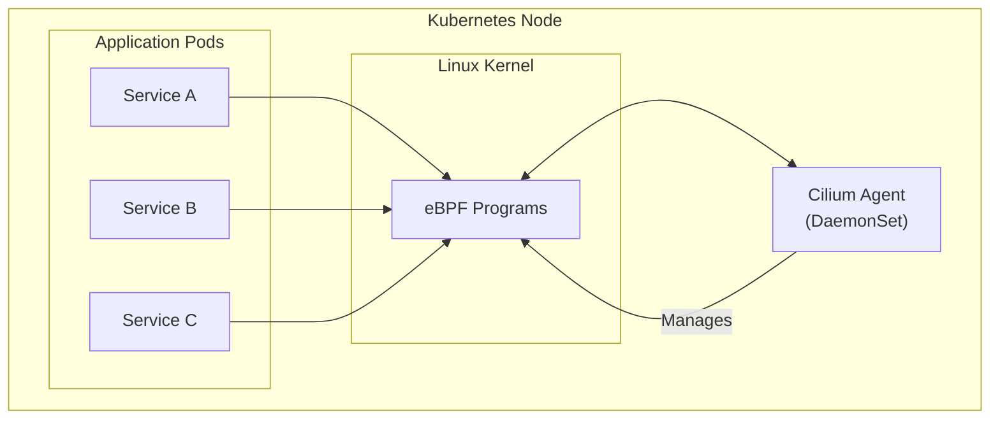
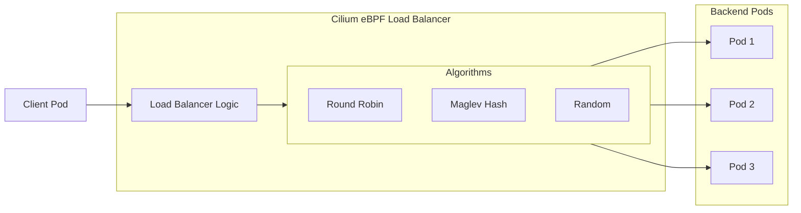
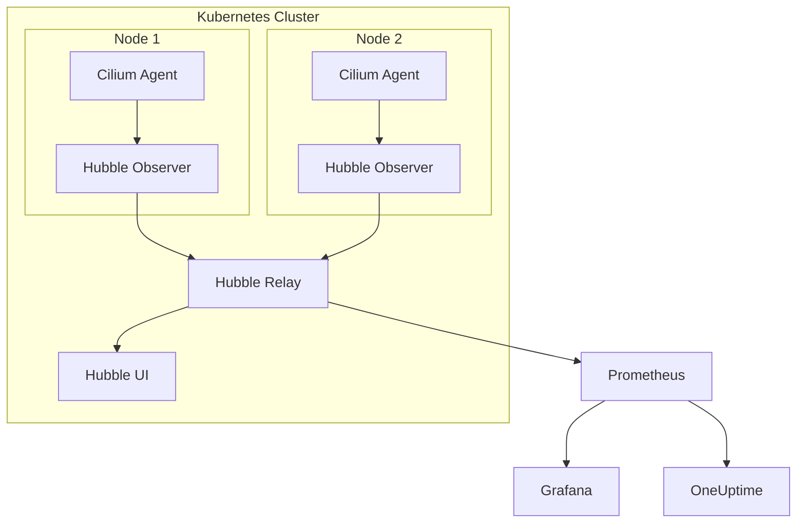
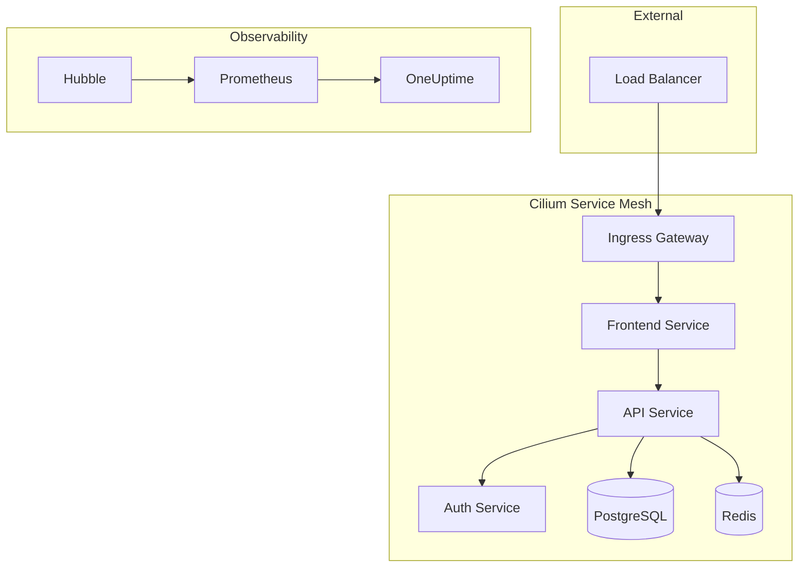

# How to Implement Cilium Service Mesh

Author: [nawazdhandala](https://www.github.com/nawazdhandala)

Tags: Cilium, Service Mesh, Kubernetes, eBPF, mTLS, Observability, Hubble, Load Balancing, Sidecar-Free

Description: A comprehensive guide to implementing Cilium Service Mesh in Kubernetes, covering sidecar-free architecture, mTLS encryption, load balancing, and observability with Hubble.

---

> "The best service mesh is the one you don't notice - it just works at the kernel level." - Cilium Philosophy

Service meshes have traditionally relied on sidecar proxies to handle traffic between services. Cilium takes a radically different approach by leveraging eBPF (extended Berkeley Packet Filter) for networking, load balancing, policy, and observability, while using Envoy for Layer 7 features when needed. This eliminates the overhead of per-pod sidecars while providing strong performance and observability.

## Why Cilium Service Mesh?

Traditional service meshes like Istio or Linkerd inject a sidecar proxy container alongside every application pod. While effective, this approach has drawbacks:

- **Resource overhead**: Each sidecar consumes CPU and memory
- **Latency**: Traffic must traverse the sidecar proxy
- **Complexity**: More containers to manage and debug
- **Cold start**: Sidecars add to pod startup time

Cilium's eBPF-based datapath runs at the kernel level and avoids per-pod sidecar injection, reducing these concerns.


```mermaid
flowchart TB
    subgraph Traditional["Traditional Sidecar Mesh"]
        direction LR
        A1[App A] --> P1[Proxy]
        P1 --> P2[Proxy]
        P2 --> A2[App B]
    end

    subgraph Cilium["Cilium Service Mesh"]
        direction LR
        B1[App A] --> K[eBPF/Kernel]
        K --> B2[App B]
    end
```

## Prerequisites

Before implementing Cilium Service Mesh, ensure you have:

- A Kubernetes version supported by your Cilium release
- Helm 3.x installed
- kubectl configured with cluster access
- Linux kernel 5.10+ or equivalent, such as 4.18 on RHEL 8.10

Check your kernel version:

```bash
# Verify kernel version supports eBPF features

# Cilium recommends kernel 5.10+ or equivalent for current releases
uname -r
```

## Installing Cilium with Service Mesh Features

### Step 1: Add the Cilium Helm Repository

```bash
# Add the official Cilium Helm repository
# This provides access to Cilium charts and updates
helm repo add cilium https://helm.cilium.io/

# Update repository cache to get latest chart versions
helm repo update
```

### Step 2: Install Cilium with Service Mesh Enabled

```bash
# Install Cilium with service mesh features enabled
# Key flags:
#   --set kubeProxyReplacement=true: Replace kube-proxy with Cilium
#   --set ingressController.enabled=true: Enable ingress controller
#   --set hubble.enabled=true: Enable observability
#   --set hubble.relay.enabled=true: Enable Hubble API relay
#   --set hubble.ui.enabled=true: Enable Hubble web UI
helm install cilium cilium/cilium --version 1.19.4 \
  --namespace kube-system \
  --set kubeProxyReplacement=true \
  --set k8sServiceHost=${API_SERVER_IP} \
  --set k8sServicePort=${API_SERVER_PORT} \
  --set ingressController.enabled=true \
  --set ingressController.loadbalancerMode=dedicated \
  --set hubble.enabled=true \
  --set hubble.relay.enabled=true \
  --set hubble.ui.enabled=true \
  --set encryption.enabled=true \
  --set encryption.type=wireguard \
  --set encryption.nodeEncryption=true
```

### Step 3: Verify Installation

```bash
# Check Cilium deployment status
# All pods should be Running with 1/1 Ready
kubectl get pods -n kube-system -l k8s-app=cilium

# Verify Cilium status using the CLI
# This shows connectivity status and feature enablement
cilium status --wait
```

Expected output shows all components healthy:

```text
    /¯¯\
 /¯¯\__/¯¯\    Cilium:             OK
 \__/¯¯\__/    Operator:           OK
 /¯¯\__/¯¯\    Envoy DaemonSet:    OK
 \__/¯¯\__/    Hubble Relay:       OK
    \__/       ClusterMesh:        disabled

Cluster Pods:      18/18 managed by Cilium
Helm chart version: 1.19.4
```

## Sidecar-Free Architecture

Cilium's sidecar-free approach is the core differentiator. Here's how the architecture works:


```mermaid
flowchart TB
    subgraph Node["Kubernetes Node"]
        subgraph Kernel["Linux Kernel"]
            eBPF["eBPF Programs"]
        end

        subgraph Pods["Application Pods"]
            Pod1["Service A"]
            Pod2["Service B"]
            Pod3["Service C"]
        end

        CA["Cilium Agent<br/>(DaemonSet)"]
    end

    Pod1 --> eBPF
    Pod2 --> eBPF
    Pod3 --> eBPF
    eBPF <--> CA

    CA --> |"Manages"| eBPF
```

The Cilium agent runs as a DaemonSet on each node, programming eBPF hooks into the kernel. These hooks intercept network traffic without requiring any changes to your application pods.

### Create a Namespace for Mesh Policies

```yaml
# namespace-mesh.yaml
# Create the production namespace for Cilium policies
apiVersion: v1
kind: Namespace
metadata:
  name: production
  labels:
    # Label for policy selection
    environment: production
```

Apply the configuration:

```bash
# Apply namespace configuration
kubectl apply -f namespace-mesh.yaml
```

## Implementing Encryption and Mutual Authentication with Cilium

Service-to-service protection requires both encryption and authentication. Cilium supports transparent WireGuard encryption and SPIFFE/SPIRE-based mutual authentication.

### Option 1: WireGuard Encryption

WireGuard provides transparent encryption at the node level:

```bash
# Enable WireGuard encryption for Cilium-managed traffic
# WireGuard operates at Layer 3, encrypting traffic between nodes
helm upgrade cilium cilium/cilium --version 1.19.4 \
  --namespace kube-system \
  --reuse-values \
  --set encryption.enabled=true \
  --set encryption.type=wireguard \
  --set encryption.nodeEncryption=true
```

Verify encryption is active:

```bash
# Check WireGuard encryption status
# Shows encryption enabled and peer information
kubectl exec -n kube-system cilium-xxxxx -- cilium-dbg encrypt status

# Expected output:
# Encryption: Wireguard
# Keys in use: 1
# Max Seq. Number: 0x12345/0xffffffff
```

### Option 2: SPIFFE/SPIRE Integration for Mutual Authentication

For workload identity-based mutual authentication:

```yaml
# cilium-spire-config.yaml
# Cilium Helm values for SPIFFE/SPIRE integration
# This provides cryptographic workload identities
authentication:
  mutual:
    spire:
      enabled: true
      install:
        enabled: true
        namespace: cilium-spire
        server:
          dataStorage:
            size: 1Gi
```

Install with SPIRE:

```bash
# Install Cilium with SPIRE for mutual authentication
# SPIRE provides SPIFFE identities for workloads
helm upgrade cilium cilium/cilium --version 1.19.4 \
  --namespace kube-system \
  --reuse-values \
  --set authentication.enabled=true \
  --set authentication.mutual.spire.enabled=true \
  --set authentication.mutual.spire.install.enabled=true
```

### Enforce Mutual Authentication with CiliumNetworkPolicy

```yaml
# mtls-policy.yaml
# CiliumNetworkPolicy requiring Cilium mutual authentication
# This policy ensures only authenticated traffic is allowed
apiVersion: cilium.io/v2
kind: CiliumNetworkPolicy
metadata:
  name: require-mtls
  namespace: production
spec:
  # Apply to all endpoints in the namespace
  endpointSelector: {}
  ingress:
    - fromEndpoints:
        - {}
      authentication:
        # Require mutual TLS authentication
        mode: "required"
  egress:
    - toEndpoints:
        - {}
      authentication:
        mode: "required"
```

## Load Balancing with Cilium

Cilium provides advanced load balancing capabilities that replace kube-proxy with eBPF-based implementations.

### Service Load Balancing Architecture


```mermaid
flowchart LR
    Client[Client Pod]

    subgraph Cilium["Cilium eBPF Load Balancer"]
        LB[Load Balancer Logic]

        subgraph Algorithms["Algorithms"]
            RR[Round Robin]
            MH[Maglev Hash]
            RND[Random]
        end
    end

    subgraph Backend["Backend Pods"]
        B1[Pod 1]
        B2[Pod 2]
        B3[Pod 3]
    end

    Client --> LB
    LB --> Algorithms
    Algorithms --> B1
    Algorithms --> B2
    Algorithms --> B3
```

### Configure Maglev Load Balancing

Maglev provides consistent hashing for better connection affinity:

```bash
# Enable Maglev consistent hashing algorithm
# Maglev provides minimal disruption when backends change
helm upgrade cilium cilium/cilium --version 1.19.4 \
  --namespace kube-system \
  --reuse-values \
  --set loadBalancer.algorithm=maglev \
  --set maglev.tableSize=65521 \
  --set bpf.lbAlgorithmAnnotation=true
```

### Service Configuration with Annotations

```yaml
# service-lb.yaml
# Service with Cilium-specific load balancing annotations
apiVersion: v1
kind: Service
metadata:
  name: api-service
  namespace: production
  annotations:
    # Use Maglev for this specific service
    service.cilium.io/lb-algorithm: "maglev"
spec:
  type: LoadBalancer
  selector:
    app: api
  sessionAffinity: ClientIP
  sessionAffinityConfig:
    clientIP:
      timeoutSeconds: 3600
  ports:
    - port: 80
      targetPort: 8080
      protocol: TCP
```

### L7 Policy Enforcement with Envoy

For HTTP-aware policy enforcement, Cilium uses Envoy:

```yaml
# l7-policy.yaml
# CiliumNetworkPolicy with L7 HTTP rules
# This enables HTTP-aware policy enforcement
apiVersion: cilium.io/v2
kind: CiliumNetworkPolicy
metadata:
  name: api-l7-lb
  namespace: production
spec:
  endpointSelector:
    matchLabels:
      app: api-gateway
  egress:
    - toEndpoints:
        - matchLabels:
            app: backend-api
      toPorts:
        - ports:
            - port: "8080"
              protocol: TCP
          rules:
            http:
              # Allow traffic based on HTTP path
              - method: "GET"
                path: "/api/v1/.*"
              - method: "POST"
                path: "/api/v1/orders"
                headers:
                  - "Content-Type: application/json"
```

### Weighted Load Balancing

```yaml
# weighted-service.yaml
# CiliumEnvoyConfig for weighted traffic splitting
# Useful for canary deployments and A/B testing
apiVersion: cilium.io/v2
kind: CiliumEnvoyConfig
metadata:
  name: weighted-routing
  namespace: production
spec:
  services:
    - name: api-service
      namespace: production
  backendServices:
    - name: api-v1
      namespace: production
    - name: api-v2
      namespace: production
  resources:
    - "@type": type.googleapis.com/envoy.config.listener.v3.Listener
      name: weighted-routing-listener
      filter_chains:
        - filters:
            - name: envoy.filters.network.http_connection_manager
              typed_config:
                "@type": type.googleapis.com/envoy.extensions.filters.network.http_connection_manager.v3.HttpConnectionManager
                stat_prefix: weighted-routing
                rds:
                  route_config_name: weighted-routing
                http_filters:
                  - name: envoy.filters.http.router
                    typed_config:
                      "@type": type.googleapis.com/envoy.extensions.filters.http.router.v3.Router
    - "@type": type.googleapis.com/envoy.config.route.v3.RouteConfiguration
      name: weighted-routing
      virtual_hosts:
        - name: api-service
          domains:
            - "*"
          routes:
            - match:
                prefix: "/"
              route:
                weighted_clusters:
                  clusters:
                    - name: "production/api-v1"
                      weight: 90
                    - name: "production/api-v2"
                      weight: 10
    - "@type": type.googleapis.com/envoy.config.cluster.v3.Cluster
      name: "production/api-v1"
      connect_timeout: 5s
      lb_policy: ROUND_ROBIN
      type: EDS
    - "@type": type.googleapis.com/envoy.config.cluster.v3.Cluster
      name: "production/api-v2"
      connect_timeout: 5s
      lb_policy: ROUND_ROBIN
      type: EDS
```

## Observability with Hubble

Hubble is Cilium's observability layer, providing deep visibility into network flows, service dependencies, and security events.

### Hubble Architecture


```mermaid
flowchart TB
    subgraph Cluster["Kubernetes Cluster"]
        subgraph Node1["Node 1"]
            CA1[Cilium Agent]
            H1[Hubble Observer]
        end

        subgraph Node2["Node 2"]
            CA2[Cilium Agent]
            H2[Hubble Observer]
        end

        HR[Hubble Relay]
        HUI[Hubble UI]
    end

    Prom[Prometheus]
    Graf[Grafana]
    OT[OneUptime]

    CA1 --> H1
    CA2 --> H2
    H1 --> HR
    H2 --> HR
    HR --> HUI
    HR --> Prom
    Prom --> Graf
    Prom --> OT
```

### Install Hubble CLI

```bash
# Download and install Hubble CLI
# The CLI provides command-line access to observe network flows
HUBBLE_VERSION=$(curl -s https://raw.githubusercontent.com/cilium/hubble/master/stable.txt)
curl -L --remote-name-all https://github.com/cilium/hubble/releases/download/$HUBBLE_VERSION/hubble-linux-amd64.tar.gz
tar xzvf hubble-linux-amd64.tar.gz
sudo mv hubble /usr/local/bin/

# Verify installation
hubble version
```

### Enable Hubble Metrics

```bash
# Enable comprehensive Hubble metrics for observability
# These metrics integrate with Prometheus for monitoring
helm upgrade cilium cilium/cilium --version 1.19.4 \
  --namespace kube-system \
  --reuse-values \
  --set hubble.metrics.enabled="{dns,drop,tcp,flow,icmp,httpV2:labelsContext=destination_workload}" \
  --set hubble.metrics.serviceMonitor.enabled=true
```

### Access Hubble UI

```bash
# Port-forward to access Hubble UI locally
# The UI provides visual service maps and flow inspection
kubectl port-forward -n kube-system svc/hubble-ui 12000:80

# Open browser to http://localhost:12000
```

### Observe Traffic with Hubble CLI

```bash
# Observe all traffic in a namespace
# Shows real-time network flows with source and destination
hubble observe --namespace production

# Filter by verdict (forwarded, dropped, etc.)
hubble observe --verdict DROPPED

# Observe specific service traffic
hubble observe --to-service production/api-service

# Watch HTTP traffic with detailed information
hubble observe --protocol http -o json

# Export flows for analysis
hubble observe --namespace production -o json > flows.json
```

### Example Hubble Output

```bash
# Sample output showing service-to-service communication
Jan 27 10:15:23.456: production/frontend-abc123 -> production/api-def456 http-request FORWARDED (HTTP/1.1 GET /api/v1/users)
Jan 27 10:15:23.489: production/api-def456 -> production/frontend-abc123 http-response FORWARDED (HTTP/1.1 200 OK)
Jan 27 10:15:24.123: production/api-def456 -> production/postgres-ghi789 tcp-flags FORWARDED (SYN)
```

### Hubble Metrics for Prometheus

```yaml
# hubble-servicemonitor.yaml
# ServiceMonitor for Prometheus to scrape Hubble metrics
apiVersion: monitoring.coreos.com/v1
kind: ServiceMonitor
metadata:
  name: hubble-metrics
  namespace: kube-system
  labels:
    app: hubble
spec:
  selector:
    matchLabels:
      k8s-app: hubble
  namespaceSelector:
    matchNames:
      - kube-system
  endpoints:
    - port: hubble-metrics
      interval: 30s
      path: /metrics
```

### Grafana Dashboard for Cilium

```yaml
# grafana-dashboard-configmap.yaml
# ConfigMap containing Grafana dashboard for Cilium metrics
apiVersion: v1
kind: ConfigMap
metadata:
  name: cilium-dashboard
  namespace: monitoring
  labels:
    grafana_dashboard: "true"
data:
  cilium-dashboard.json: |
    {
      "title": "Cilium Service Mesh",
      "panels": [
        {
          "title": "Request Rate by Service",
          "type": "graph",
          "targets": [
            {
              "expr": "sum(rate(hubble_http_requests_total[5m])) by (destination_workload)"
            }
          ]
        },
        {
          "title": "Request Latency P99",
          "type": "graph",
          "targets": [
            {
              "expr": "histogram_quantile(0.99, sum(rate(hubble_http_request_duration_seconds_bucket[5m])) by (le, destination_workload))"
            }
          ]
        },
        {
          "title": "Dropped Packets",
          "type": "graph",
          "targets": [
            {
              "expr": "sum(rate(hubble_drop_total[5m])) by (reason)"
            }
          ]
        }
      ]
    }
```

## Complete Example: Microservices with Cilium Service Mesh

Let's deploy a complete microservices application with Cilium Service Mesh:

### Application Architecture


```mermaid
flowchart TB
    subgraph External
        LB[Load Balancer]
    end

    subgraph Mesh["Cilium Service Mesh"]
        IG[Ingress Gateway]
        FE[Frontend Service]
        API[API Service]
        AUTH[Auth Service]
        DB[(PostgreSQL)]
        CACHE[(Redis)]
    end

    subgraph Observability
        HUB[Hubble]
        PROM[Prometheus]
        OUT[OneUptime]
    end

    LB --> IG
    IG --> FE
    FE --> API
    API --> AUTH
    API --> DB
    API --> CACHE

    HUB --> PROM
    PROM --> OUT
```

### Namespace and Base Configuration

```yaml
# namespace.yaml
# Create namespace for Cilium policies
apiVersion: v1
kind: Namespace
metadata:
  name: microservices
  labels:
    environment: production
---
# Default deny policy for zero-trust
apiVersion: cilium.io/v2
kind: CiliumNetworkPolicy
metadata:
  name: default-deny
  namespace: microservices
spec:
  endpointSelector: {}
  ingress: []
  egress: []
```

### Service Definitions

```yaml
# services.yaml
# Frontend Service
apiVersion: apps/v1
kind: Deployment
metadata:
  name: frontend
  namespace: microservices
spec:
  replicas: 3
  selector:
    matchLabels:
      app: frontend
  template:
    metadata:
      labels:
        app: frontend
        # Labels for Cilium policy selection
        tier: web
    spec:
      containers:
        - name: frontend
          image: frontend:v1.0
          ports:
            - containerPort: 3000
---
apiVersion: v1
kind: Service
metadata:
  name: frontend
  namespace: microservices
spec:
  selector:
    app: frontend
  ports:
    - port: 80
      targetPort: 3000
---
# API Service
apiVersion: apps/v1
kind: Deployment
metadata:
  name: api
  namespace: microservices
spec:
  replicas: 3
  selector:
    matchLabels:
      app: api
  template:
    metadata:
      labels:
        app: api
        tier: backend
    spec:
      containers:
        - name: api
          image: api:v1.0
          ports:
            - containerPort: 8080
---
apiVersion: v1
kind: Service
metadata:
  name: api
  namespace: microservices
spec:
  selector:
    app: api
  ports:
    - port: 80
      targetPort: 8080
```

### Network Policies

```yaml
# network-policies.yaml
# Allow ingress to frontend from ingress controller
apiVersion: cilium.io/v2
kind: CiliumNetworkPolicy
metadata:
  name: frontend-ingress
  namespace: microservices
spec:
  endpointSelector:
    matchLabels:
      app: frontend
  ingress:
    - fromEntities:
        - world
      toPorts:
        - ports:
            - port: "3000"
              protocol: TCP
---
# Allow frontend to call API with L7 rules
apiVersion: cilium.io/v2
kind: CiliumNetworkPolicy
metadata:
  name: frontend-to-api
  namespace: microservices
spec:
  endpointSelector:
    matchLabels:
      app: frontend
  egress:
    - toEndpoints:
        - matchLabels:
            app: api
      toPorts:
        - ports:
            - port: "8080"
              protocol: TCP
          rules:
            http:
              - method: "GET"
                path: "/api/.*"
              - method: "POST"
                path: "/api/.*"
---
# Allow API to reach database
apiVersion: cilium.io/v2
kind: CiliumNetworkPolicy
metadata:
  name: api-to-database
  namespace: microservices
spec:
  endpointSelector:
    matchLabels:
      app: api
  egress:
    - toEndpoints:
        - matchLabels:
            app: postgres
      toPorts:
        - ports:
            - port: "5432"
              protocol: TCP
---
# Allow API to reach Redis cache
apiVersion: cilium.io/v2
kind: CiliumNetworkPolicy
metadata:
  name: api-to-cache
  namespace: microservices
spec:
  endpointSelector:
    matchLabels:
      app: api
  egress:
    - toEndpoints:
        - matchLabels:
            app: redis
      toPorts:
        - ports:
            - port: "6379"
              protocol: TCP
```

### Ingress Configuration

```yaml
# ingress.yaml
# Cilium Ingress for external traffic
apiVersion: networking.k8s.io/v1
kind: Ingress
metadata:
  name: microservices-ingress
  namespace: microservices
spec:
  ingressClassName: cilium
  tls:
    - hosts:
        - app.example.com
      secretName: app-tls-secret
  rules:
    - host: app.example.com
      http:
        paths:
          - path: /
            pathType: Prefix
            backend:
              service:
                name: frontend
                port:
                  number: 80
          - path: /api
            pathType: Prefix
            backend:
              service:
                name: api
                port:
                  number: 80
```

## Monitoring Cilium with OneUptime

For production deployments, integrate Cilium metrics with [OneUptime](https://oneuptime.com) for comprehensive monitoring, alerting, and incident management.

### Export Metrics to OneUptime

Configure an OpenTelemetry Collector to scrape Hubble metrics and send them to OneUptime:

```yaml
# otel-collector-hubble.yaml
# Configure OpenTelemetry Collector to forward Hubble metrics to OneUptime
apiVersion: v1
kind: ConfigMap
metadata:
  name: otel-collector-config
  namespace: monitoring
data:
  collector.yaml: |
    receivers:
      prometheus:
        config:
          scrape_configs:
            - job_name: 'hubble'
              kubernetes_sd_configs:
                - role: endpoints
              relabel_configs:
                - source_labels: [__meta_kubernetes_service_name]
                  regex: hubble-metrics
                  action: keep

    exporters:
      otlphttp:
        endpoint: "https://oneuptime.com/otlp"
        encoding: json
        headers:
          x-oneuptime-token: "${ONEUPTIME_TOKEN}"

    service:
      pipelines:
        metrics:
          receivers: [prometheus]
          exporters: [otlphttp]
```

### Key Metrics to Monitor

Set up alerts in OneUptime for these critical Cilium metrics:

| Metric | Description | Alert Threshold |
|--------|-------------|-----------------|
| `hubble_drop_total` | Dropped packets | > 100/min |
| `hubble_http_requests_total` | HTTP request rate | Anomaly detection |
| `hubble_http_request_duration_seconds` | Request latency | P99 > 500ms |
| `cilium_endpoint_state` | Endpoint state | `state!="ready"` |
| `cilium_unreachable_nodes` | Node connectivity | > 0 |

## Troubleshooting

### Common Issues and Solutions

**Issue: Pods cannot communicate after enabling Cilium**

```bash
# Check Cilium agent status on the node
kubectl exec -n kube-system cilium-xxxxx -- cilium-dbg status

# Verify endpoint is correctly registered
kubectl exec -n kube-system cilium-xxxxx -- cilium-dbg endpoint list

# Check for policy drops
hubble observe --verdict DROPPED --namespace <namespace>
```

**Issue: mTLS not working**

```bash
# Verify encryption status
kubectl exec -n kube-system cilium-xxxxx -- cilium-dbg encrypt status

# Check SPIRE health (if using SPIRE)
kubectl get pods -n cilium-spire

# View authentication failures
hubble observe --type trace:sock --namespace <namespace>
```

**Issue: High latency after enabling L7 policies**

```bash
# L7 policies require Envoy, which adds latency
# Consider using L4 policies where L7 is not needed

# Check Envoy proxy status
kubectl exec -n kube-system cilium-xxxxx -- cilium-dbg envoy admin
```

### Useful Debugging Commands

```bash
# Full connectivity test
cilium connectivity test

# View BPF maps
kubectl exec -n kube-system cilium-xxxxx -- cilium-dbg bpf lb list

# Monitor Cilium agent logs
kubectl logs -n kube-system -l k8s-app=cilium -f

# Export complete diagnostic bundle
cilium sysdump
```

## Conclusion

Cilium Service Mesh provides a powerful, sidecar-free alternative to traditional service meshes. By leveraging eBPF, it delivers:

- **Better performance**: No sidecar proxy overhead
- **Transparent encryption and authentication**: WireGuard encryption with optional SPIFFE/SPIRE-based mutual authentication
- **Advanced load balancing**: Maglev consistent hashing and L7 routing
- **Deep observability**: Hubble provides unparalleled visibility

The key to success with Cilium is starting simple - enable basic features first, then gradually add transparent encryption, mutual authentication, L7 policies, and advanced observability as your team becomes comfortable with the platform.

For production deployments, integrate with [OneUptime](https://oneuptime.com) to monitor your service mesh health, track SLOs, and receive alerts when issues arise. OneUptime's OpenTelemetry ingestion makes it easy to visualize Cilium and Hubble metrics alongside your application telemetry.
