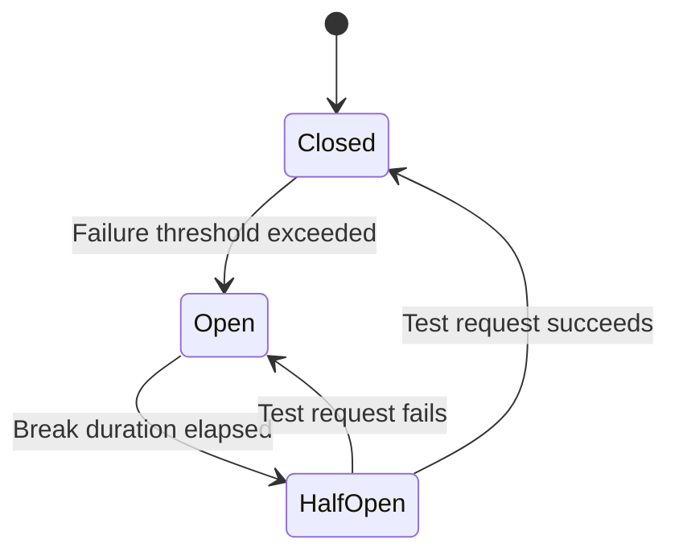

# How to Implement Circuit Breakers with Polly in .NET

Author: [nawazdhandala](https://www.github.com/nawazdhandala)

Tags: .NET, Polly, Circuit Breaker, Resilience, C#, Microservices

Description: Learn how to implement the circuit breaker pattern using Polly in .NET to build resilient applications that gracefully handle failures in external services and prevent cascade failures.

---

When your application depends on external services, those services will eventually fail. Network issues, overloaded servers, or deployment problems can cause requests to hang or return errors. Without protection, your application will keep hammering the failing service, wasting resources and potentially causing cascade failures. The circuit breaker pattern solves this by detecting failures and stopping requests to unhealthy services.

## Understanding Circuit Breakers

A circuit breaker works like an electrical breaker in your home. When it detects too many failures, it "trips" and stops allowing requests through. After a cooling-off period, it allows a test request. If that succeeds, normal operation resumes.



The three states are:

| State | Behavior |
|-------|----------|
| Closed | Requests flow normally, failures are tracked |
| Open | Requests fail immediately without calling the service |
| Half-Open | One test request is allowed to check service health |

## Setting Up Polly

Install the Polly packages:

```bash
dotnet add package Polly
dotnet add package Microsoft.Extensions.Http.Polly
```

## Basic Circuit Breaker

Create a simple circuit breaker policy:

```csharp
using Polly;
using Polly.CircuitBreaker;

// Create a circuit breaker that opens after 3 consecutive failures
var circuitBreakerPolicy = Policy
    .Handle<HttpRequestException>()
    .OrResult<HttpResponseMessage>(r => !r.IsSuccessStatusCode)
    .CircuitBreakerAsync(
        handledEventsAllowedBeforeBreaking: 3,
        durationOfBreak: TimeSpan.FromSeconds(30),
        onBreak: (outcome, breakDelay) =>
        {
            Console.WriteLine($"Circuit opened for {breakDelay.TotalSeconds}s due to: {outcome.Exception?.Message ?? outcome.Result?.StatusCode.ToString()}");
        },
        onReset: () =>
        {
            Console.WriteLine("Circuit closed, normal operation resumed");
        },
        onHalfOpen: () =>
        {
            Console.WriteLine("Circuit half-open, testing with next request");
        });
```

Using the policy:

```csharp
var httpClient = new HttpClient();

try
{
    var response = await circuitBreakerPolicy.ExecuteAsync(async () =>
    {
        return await httpClient.GetAsync("https://api.example.com/data");
    });

    // Process response
    var content = await response.Content.ReadAsStringAsync();
}
catch (BrokenCircuitException)
{
    // Circuit is open, service is unavailable
    Console.WriteLine("Service temporarily unavailable, please try again later");
}
```

## Advanced Circuit Breaker Configuration

For more control, use the advanced circuit breaker:

```csharp
// Advanced circuit breaker based on failure rate
var advancedCircuitBreaker = Policy
    .Handle<HttpRequestException>()
    .OrResult<HttpResponseMessage>(r =>
        (int)r.StatusCode >= 500 || r.StatusCode == HttpStatusCode.RequestTimeout)
    .AdvancedCircuitBreakerAsync(
        // Break if 50% or more of requests fail
        failureThreshold: 0.5,
        // Over a 10-second sampling window
        samplingDuration: TimeSpan.FromSeconds(10),
        // Minimum 8 requests before the failure rate is calculated
        minimumThroughput: 8,
        // Stay open for 30 seconds
        durationOfBreak: TimeSpan.FromSeconds(30),
        onBreak: (outcome, state, breakDuration, context) =>
        {
            Console.WriteLine($"Circuit breaker opened. State: {state}, Break duration: {breakDuration}");
        },
        onReset: (context) =>
        {
            Console.WriteLine("Circuit breaker reset");
        },
        onHalfOpen: () =>
        {
            Console.WriteLine("Circuit breaker half-open");
        });
```

## Integrating with HttpClientFactory

The recommended approach for HTTP clients in .NET:

```csharp
// Program.cs
using Polly;
using Polly.Extensions.Http;

var builder = WebApplication.CreateBuilder(args);

// Define the circuit breaker policy
var circuitBreakerPolicy = HttpPolicyExtensions
    .HandleTransientHttpError() // Handles 5xx and 408 responses
    .OrResult(msg => msg.StatusCode == HttpStatusCode.TooManyRequests)
    .CircuitBreakerAsync(
        handledEventsAllowedBeforeBreaking: 5,
        durationOfBreak: TimeSpan.FromSeconds(30));

// Register HttpClient with circuit breaker
builder.Services.AddHttpClient("PaymentService", client =>
{
    client.BaseAddress = new Uri("https://payment.api.example.com");
    client.Timeout = TimeSpan.FromSeconds(10);
})
.AddPolicyHandler(circuitBreakerPolicy);

var app = builder.Build();
app.Run();
```

Using the configured client:

```csharp
// Services/PaymentService.cs
public class PaymentService
{
    private readonly HttpClient _httpClient;
    private readonly ILogger<PaymentService> _logger;

    public PaymentService(
        IHttpClientFactory httpClientFactory,
        ILogger<PaymentService> logger)
    {
        _httpClient = httpClientFactory.CreateClient("PaymentService");
        _logger = logger;
    }

    public async Task<PaymentResult> ProcessPaymentAsync(PaymentRequest request)
    {
        try
        {
            var response = await _httpClient.PostAsJsonAsync("/api/payments", request);
            response.EnsureSuccessStatusCode();

            return await response.Content.ReadFromJsonAsync<PaymentResult>()
                ?? throw new InvalidOperationException("Empty response");
        }
        catch (BrokenCircuitException)
        {
            _logger.LogWarning("Payment service circuit breaker is open");
            return new PaymentResult
            {
                Success = false,
                Error = "Payment service temporarily unavailable"
            };
        }
    }
}
```

## Combining Circuit Breaker with Retry

Circuit breakers work well with retry policies:

```csharp
// Define individual policies
var retryPolicy = HttpPolicyExtensions
    .HandleTransientHttpError()
    .WaitAndRetryAsync(
        retryCount: 3,
        sleepDurationProvider: attempt => TimeSpan.FromMilliseconds(100 * Math.Pow(2, attempt)),
        onRetry: (outcome, delay, attempt, context) =>
        {
            Console.WriteLine($"Retry {attempt} after {delay.TotalMilliseconds}ms");
        });

var circuitBreakerPolicy = HttpPolicyExtensions
    .HandleTransientHttpError()
    .CircuitBreakerAsync(
        handledEventsAllowedBeforeBreaking: 5,
        durationOfBreak: TimeSpan.FromSeconds(30));

// Combine policies - order matters!
// Retry wraps circuit breaker: retries happen before circuit trips
builder.Services.AddHttpClient("ExternalApi")
    .AddPolicyHandler(retryPolicy)
    .AddPolicyHandler(circuitBreakerPolicy);
```

## Custom Circuit Breaker Service

For more control, create a circuit breaker service:

```csharp
// Services/CircuitBreakerService.cs
public interface ICircuitBreakerService
{
    Task<T> ExecuteAsync<T>(string serviceName, Func<Task<T>> action);
    CircuitState GetCircuitState(string serviceName);
}

public class CircuitBreakerService : ICircuitBreakerService
{
    private readonly ConcurrentDictionary<string, AsyncCircuitBreakerPolicy> _policies = new();
    private readonly ILogger<CircuitBreakerService> _logger;

    public CircuitBreakerService(ILogger<CircuitBreakerService> logger)
    {
        _logger = logger;
    }

    public async Task<T> ExecuteAsync<T>(string serviceName, Func<Task<T>> action)
    {
        var policy = _policies.GetOrAdd(serviceName, CreatePolicy);

        return await policy.ExecuteAsync(action);
    }

    public CircuitState GetCircuitState(string serviceName)
    {
        if (_policies.TryGetValue(serviceName, out var policy))
        {
            return policy.CircuitState;
        }
        return CircuitState.Closed;
    }

    private AsyncCircuitBreakerPolicy CreatePolicy(string serviceName)
    {
        return Policy
            .Handle<Exception>()
            .CircuitBreakerAsync(
                exceptionsAllowedBeforeBreaking: 5,
                durationOfBreak: TimeSpan.FromSeconds(30),
                onBreak: (ex, breakDuration) =>
                {
                    _logger.LogWarning(
                        "Circuit breaker for {ServiceName} opened for {BreakDuration}s. Exception: {Message}",
                        serviceName, breakDuration.TotalSeconds, ex.Message);
                },
                onReset: () =>
                {
                    _logger.LogInformation("Circuit breaker for {ServiceName} reset", serviceName);
                },
                onHalfOpen: () =>
                {
                    _logger.LogInformation("Circuit breaker for {ServiceName} half-open", serviceName);
                });
    }
}
```

Usage in a service:

```csharp
public class InventoryService
{
    private readonly ICircuitBreakerService _circuitBreaker;
    private readonly HttpClient _httpClient;

    public InventoryService(
        ICircuitBreakerService circuitBreaker,
        HttpClient httpClient)
    {
        _circuitBreaker = circuitBreaker;
        _httpClient = httpClient;
    }

    public async Task<int> GetStockLevelAsync(string productId)
    {
        return await _circuitBreaker.ExecuteAsync("inventory-service", async () =>
        {
            var response = await _httpClient.GetAsync($"/api/inventory/{productId}");
            response.EnsureSuccessStatusCode();

            var result = await response.Content.ReadFromJsonAsync<StockLevel>();
            return result?.Quantity ?? 0;
        });
    }
}
```

## Fallback Strategies

Provide fallback behavior when the circuit is open:

```csharp
// Define fallback policy
var fallbackPolicy = Policy<HttpResponseMessage>
    .Handle<BrokenCircuitException>()
    .Or<HttpRequestException>()
    .FallbackAsync(
        fallbackAction: async (context, cancellationToken) =>
        {
            // Return cached data or default response
            return new HttpResponseMessage(HttpStatusCode.OK)
            {
                Content = new StringContent(
                    JsonSerializer.Serialize(new { data = "cached_value", fromCache = true }),
                    Encoding.UTF8,
                    "application/json")
            };
        },
        onFallbackAsync: async (outcome, context) =>
        {
            Console.WriteLine($"Falling back due to: {outcome.Exception?.Message}");
        });

// Wrap circuit breaker with fallback
var resilientPolicy = Policy.WrapAsync(fallbackPolicy, circuitBreakerPolicy);
```

## Health Check Integration

Expose circuit breaker state in health checks:

```csharp
// HealthChecks/CircuitBreakerHealthCheck.cs
public class CircuitBreakerHealthCheck : IHealthCheck
{
    private readonly ICircuitBreakerService _circuitBreaker;
    private readonly string[] _serviceNames;

    public CircuitBreakerHealthCheck(
        ICircuitBreakerService circuitBreaker,
        string[] serviceNames)
    {
        _circuitBreaker = circuitBreaker;
        _serviceNames = serviceNames;
    }

    public Task<HealthCheckResult> CheckHealthAsync(
        HealthCheckContext context,
        CancellationToken cancellationToken = default)
    {
        var circuitStates = _serviceNames
            .Select(name => new
            {
                Service = name,
                State = _circuitBreaker.GetCircuitState(name)
            })
            .ToList();

        var openCircuits = circuitStates
            .Where(c => c.State == CircuitState.Open)
            .Select(c => c.Service)
            .ToList();

        if (openCircuits.Any())
        {
            return Task.FromResult(HealthCheckResult.Degraded(
                $"Open circuits: {string.Join(", ", openCircuits)}",
                data: circuitStates.ToDictionary(
                    c => c.Service,
                    c => (object)c.State.ToString())));
        }

        var halfOpenCircuits = circuitStates
            .Where(c => c.State == CircuitState.HalfOpen)
            .Select(c => c.Service)
            .ToList();

        if (halfOpenCircuits.Any())
        {
            return Task.FromResult(HealthCheckResult.Degraded(
                $"Half-open circuits: {string.Join(", ", halfOpenCircuits)}"));
        }

        return Task.FromResult(HealthCheckResult.Healthy("All circuits closed"));
    }
}

// Register in Program.cs
builder.Services.AddHealthChecks()
    .AddCheck<CircuitBreakerHealthCheck>(
        "circuit-breakers",
        tags: new[] { "ready" });
```

## Monitoring and Metrics

Track circuit breaker events:

```csharp
public class CircuitBreakerMetrics
{
    private readonly Counter<long> _circuitOpenedCounter;
    private readonly Counter<long> _circuitResetCounter;
    private readonly Counter<long> _rejectedRequestsCounter;

    public CircuitBreakerMetrics(IMeterFactory meterFactory)
    {
        var meter = meterFactory.Create("CircuitBreaker");

        _circuitOpenedCounter = meter.CreateCounter<long>(
            "circuit_breaker_opened_total",
            description: "Number of times the circuit breaker opened");

        _circuitResetCounter = meter.CreateCounter<long>(
            "circuit_breaker_reset_total",
            description: "Number of times the circuit breaker reset");

        _rejectedRequestsCounter = meter.CreateCounter<long>(
            "circuit_breaker_rejected_total",
            description: "Number of requests rejected by open circuit");
    }

    public void RecordCircuitOpened(string serviceName)
    {
        _circuitOpenedCounter.Add(1, new KeyValuePair<string, object?>("service", serviceName));
    }

    public void RecordCircuitReset(string serviceName)
    {
        _circuitResetCounter.Add(1, new KeyValuePair<string, object?>("service", serviceName));
    }

    public void RecordRejectedRequest(string serviceName)
    {
        _rejectedRequestsCounter.Add(1, new KeyValuePair<string, object?>("service", serviceName));
    }
}
```

## Best Practices

| Practice | Description |
|----------|-------------|
| Set appropriate thresholds | Too sensitive causes flapping, too lenient allows cascade failures |
| Use with timeout | Combine circuit breaker with timeout policy |
| Provide fallbacks | Always have a degraded experience ready |
| Monitor state | Alert on circuit state changes |
| Test failure scenarios | Chaos engineering helps validate configuration |

## Summary

Circuit breakers are essential for building resilient applications that depend on external services. Polly makes implementing this pattern straightforward in .NET. Start with basic circuit breakers on critical dependencies and gradually add advanced configurations based on observed failure patterns. Combined with proper monitoring, circuit breakers help your application fail gracefully and recover automatically when services become healthy again.

The key is finding the right balance in your configuration. Too aggressive and you will block valid requests unnecessarily. Too lenient and you will allow cascade failures. Monitor your circuit breaker metrics and adjust thresholds based on real-world behavior.
