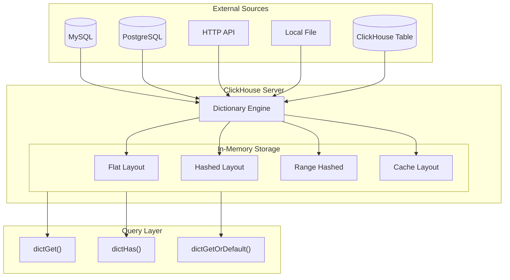
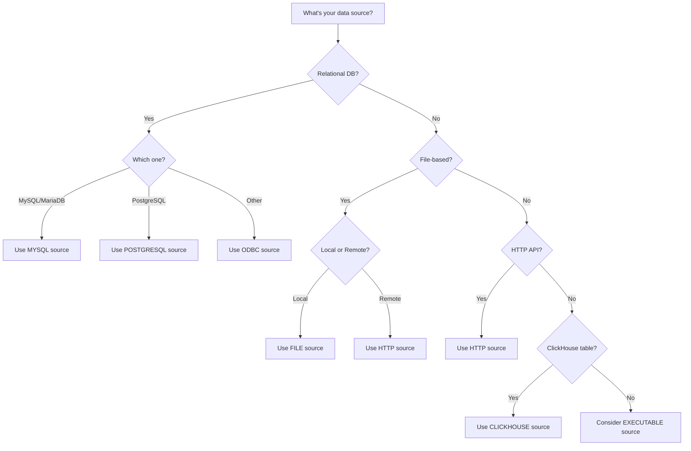
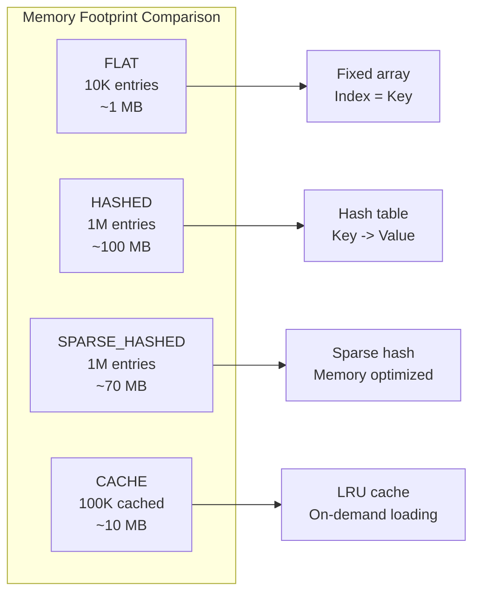
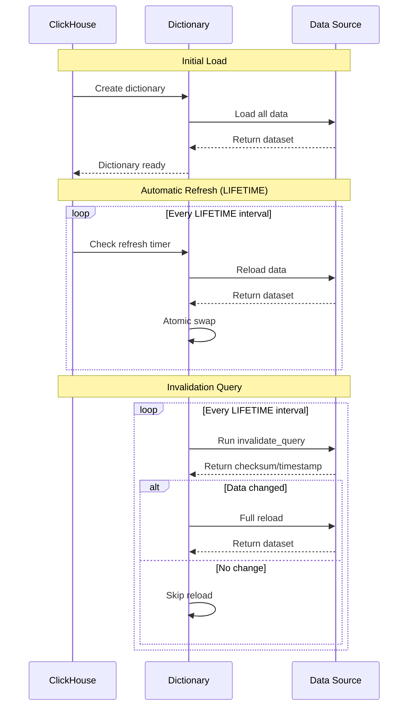
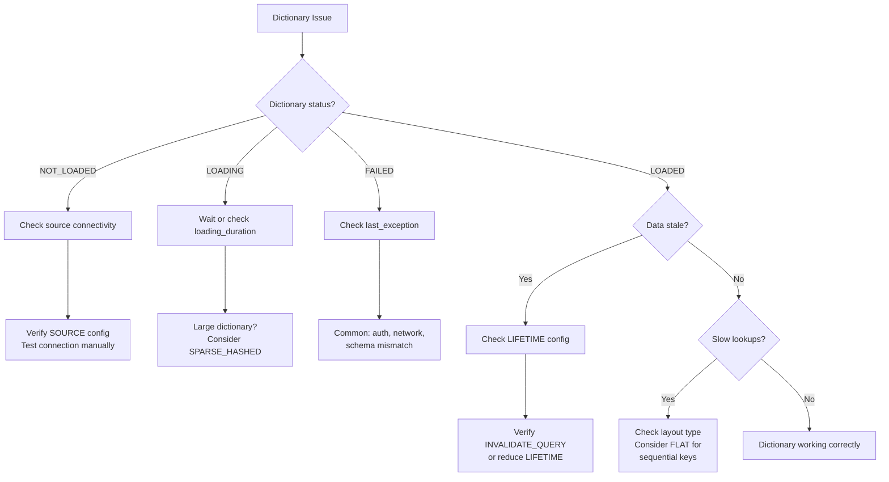
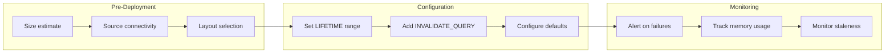

# How to Implement ClickHouse Dictionaries

Author: [nawazdhandala](https://www.github.com/nawazdhandala)

Tags: ClickHouse, Dictionaries, Database, Performance, SQL, Data Engineering, Analytics, Observability

Description: A comprehensive guide to implementing ClickHouse dictionaries for fast key-value lookups, covering external dictionary sources, memory layouts, refresh strategies, and real-world query optimization patterns.

---

> Dictionaries are ClickHouse's secret weapon for fast JOINs. Instead of expensive table lookups at query time, dictionaries load reference data into memory and transform O(n) JOINs into O(1) lookups.

ClickHouse dictionaries provide an in-memory key-value store that dramatically accelerates queries involving dimension tables, lookup data, and reference information. Whether you need to enrich log data with service metadata, resolve user IDs to names, or map error codes to descriptions, dictionaries eliminate the performance penalty of traditional JOINs.

This guide walks through dictionary architecture, source configurations, memory layouts, query patterns, and production best practices.

---

## Table of Contents

1. What Are ClickHouse Dictionaries?
2. Dictionary Architecture
3. Creating External Dictionaries
4. Dictionary Sources (MySQL, PostgreSQL, HTTP)
5. Dictionary Layouts and Memory
6. Using Dictionaries in Queries
7. Dictionary Refresh Strategies
8. Advanced Patterns
9. Monitoring and Troubleshooting
10. Best Practices Summary

---

## 1. What Are ClickHouse Dictionaries?

Dictionaries in ClickHouse are specialized data structures optimized for key-value lookups. They solve a common analytics problem: enriching fact tables with dimension data without expensive JOINs.

| Concept | Description |
|---------|-------------|
| Dictionary | An in-memory key-value store loaded from an external source |
| Key | The lookup column (single or composite) used to retrieve values |
| Attribute | The values returned when looking up a key |
| Source | Where dictionary data originates (database, file, HTTP endpoint) |
| Layout | How data is organized in memory (flat, hashed, range, etc.) |
| Lifetime | How often the dictionary refreshes from its source |

Traditional approach (slow):

```sql
-- This JOIN happens at query time for every row
-- Performance degrades as dimension tables grow
SELECT
    logs.timestamp,
    logs.service_id,
    services.name AS service_name,
    logs.message
FROM logs
LEFT JOIN services ON logs.service_id = services.id
WHERE logs.timestamp > now() - INTERVAL 1 HOUR;
```

Dictionary approach (fast):

```sql
-- Dictionary lookup is O(1) per row
-- No table scan required for dimension data
SELECT
    timestamp,
    service_id,
    dictGet('services_dict', 'name', service_id) AS service_name,
    message
FROM logs
WHERE timestamp > now() - INTERVAL 1 HOUR;
```

---

## 2. Dictionary Architecture

Understanding how dictionaries fit into ClickHouse helps you design efficient lookup systems.



Key characteristics:
- Dictionaries are loaded entirely into memory (except cache layout)
- Lookups bypass the query engine and access memory directly
- Updates are atomic: new data replaces old data completely
- Multiple dictionaries can share the same source with different refresh intervals

---

## 3. Creating External Dictionaries

Dictionaries can be defined via DDL (recommended) or XML configuration files.

### DDL Syntax (Recommended)

```sql
-- Create a simple dictionary from a ClickHouse table
-- This dictionary maps service IDs to service metadata
CREATE DICTIONARY services_dict
(
    -- Primary key for lookups
    id UInt64,

    -- Attributes returned by dictGet()
    name String,
    team String,
    tier String DEFAULT 'unknown',

    -- Numeric attributes can have defaults
    priority UInt8 DEFAULT 0
)
PRIMARY KEY id

-- Source: where to load data from
SOURCE(CLICKHOUSE(
    HOST 'localhost'
    PORT 9000
    USER 'default'
    PASSWORD ''
    DB 'default'
    TABLE 'services'
))

-- Layout: how to store data in memory
LAYOUT(HASHED())

-- Lifetime: how often to refresh (min/max range for jitter)
LIFETIME(MIN 300 MAX 360);
```

### Verifying Dictionary Creation

```sql
-- Check dictionary status
-- Shows loading time, memory usage, and error state
SELECT
    name,
    status,
    origin,
    type,
    key,
    element_count,
    bytes_allocated,
    loading_duration
FROM system.dictionaries
WHERE name = 'services_dict';

-- Reload a dictionary manually
SYSTEM RELOAD DICTIONARY services_dict;

-- Reload all dictionaries
SYSTEM RELOAD DICTIONARIES;
```

### Creating from XML (Legacy)

For complex configurations or version control, XML definitions work well.

```xml
<!-- /etc/clickhouse-server/config.d/dictionaries.xml -->
<clickhouse>
    <dictionary>
        <name>error_codes_dict</name>

        <structure>
            <!-- Primary key definition -->
            <id>
                <name>code</name>
            </id>
            <!-- Attribute definitions with defaults -->
            <attribute>
                <name>description</name>
                <type>String</type>
                <null_value></null_value>
            </attribute>
            <attribute>
                <name>severity</name>
                <type>String</type>
                <null_value>INFO</null_value>
            </attribute>
        </structure>

        <!-- File source for static data -->
        <source>
            <file>
                <path>/var/lib/clickhouse/dictionaries/error_codes.csv</path>
                <format>CSVWithNames</format>
            </file>
        </source>

        <layout>
            <flat/>
        </layout>

        <lifetime>
            <min>3600</min>
            <max>7200</max>
        </lifetime>
    </dictionary>
</clickhouse>
```

---

## 4. Dictionary Sources (MySQL, PostgreSQL, HTTP)

ClickHouse dictionaries can pull data from various external systems.

### MySQL Source

```sql
-- Dictionary pulling from MySQL database
-- Useful for enriching analytics with transactional data
CREATE DICTIONARY customers_dict
(
    customer_id UInt64,
    email String,
    company String,
    plan String DEFAULT 'free',
    created_at DateTime
)
PRIMARY KEY customer_id

SOURCE(MYSQL(
    -- Connection settings
    HOST 'mysql-primary.internal'
    PORT 3306
    USER 'clickhouse_reader'
    PASSWORD 'secure_password'

    -- Database and table
    DB 'production'
    TABLE 'customers'

    -- Optional: custom query instead of table
    -- Allows filtering, joins, or transformations at source
    -- QUERY 'SELECT customer_id, email, company, plan, created_at FROM customers WHERE active = 1'

    -- Connection pooling for performance
    CONNECTION_POOL_SIZE 5

    -- Retry settings for reliability
    FAIL_ON_CONNECTION_LOSS true
))

LAYOUT(HASHED())
LIFETIME(MIN 60 MAX 120);
```

### PostgreSQL Source

```sql
-- Dictionary from PostgreSQL
-- Great for loading dimension tables from OLTP systems
CREATE DICTIONARY products_dict
(
    product_id UInt64,
    sku String,
    name String,
    category String,
    price Decimal64(2),
    currency String DEFAULT 'USD'
)
PRIMARY KEY product_id

SOURCE(POSTGRESQL(
    -- Primary connection
    HOST 'postgres-replica.internal'
    PORT 5432
    USER 'analytics_reader'
    PASSWORD 'secure_password'
    DB 'inventory'
    SCHEMA 'public'
    TABLE 'products'

    -- Failover replica for high availability
    REPLICA(
        HOST 'postgres-replica-2.internal'
        PORT 5432
        PRIORITY 2
    )
))

LAYOUT(HASHED())
LIFETIME(MIN 300 MAX 600);
```

### HTTP Source

```sql
-- Dictionary from HTTP API endpoint
-- Perfect for dynamic configuration or external service data
CREATE DICTIONARY feature_flags_dict
(
    flag_name String,
    enabled UInt8 DEFAULT 0,
    rollout_percentage UInt8 DEFAULT 0,
    description String DEFAULT ''
)
PRIMARY KEY flag_name

SOURCE(HTTP(
    -- API endpoint returning JSON or other supported format
    URL 'https://config-service.internal/api/v1/feature-flags'
    FORMAT 'JSONEachRow'

    -- Authentication headers for secured APIs
    HEADERS(
        'Authorization' 'Bearer ${FEATURE_FLAGS_TOKEN}'
        'Accept' 'application/json'
    )
))

LAYOUT(COMPLEX_KEY_HASHED())
LIFETIME(MIN 30 MAX 60);
```

### ClickHouse Table Source

```sql
-- Dictionary from another ClickHouse table
-- Useful for pre-aggregated lookup tables
CREATE DICTIONARY ip_geo_dict
(
    ip_range_start UInt32,
    ip_range_end UInt32,
    country_code String,
    country_name String,
    city String DEFAULT 'Unknown',
    latitude Float64 DEFAULT 0,
    longitude Float64 DEFAULT 0
)
PRIMARY KEY ip_range_start

SOURCE(CLICKHOUSE(
    HOST 'localhost'
    PORT 9000
    USER 'default'
    DB 'geo'
    TABLE 'ip_ranges'

    -- For distributed setups with TLS
    -- SECURE 1
))

LAYOUT(RANGE_HASHED())
RANGE(MIN ip_range_start MAX ip_range_end)
LIFETIME(MIN 86400 MAX 90000);
```

### Source Selection Guide



---

## 5. Dictionary Layouts and Memory

The layout determines how dictionary data is organized in memory, affecting lookup speed and memory usage.

### Layout Comparison

| Layout | Key Type | Memory Usage | Lookup Speed | Best For |
|--------|----------|--------------|--------------|----------|
| FLAT | UInt64 (0 to N) | Fixed array | O(1) | Sequential IDs, small datasets |
| HASHED | Any single key | Hash table | O(1) avg | General purpose, sparse keys |
| SPARSE_HASHED | Any single key | Lower than hashed | O(1) avg | Large datasets, memory constrained |
| COMPLEX_KEY_HASHED | Composite keys | Hash table | O(1) avg | Multi-column lookups |
| RANGE_HASHED | Key + range | Hash + range tree | O(log n) | Time-versioned data, IP ranges |
| CACHE | Any | LRU cache | O(1) avg | Huge datasets, partial loading |
| DIRECT | Any | None (query source) | Varies | Real-time data, no caching |

### FLAT Layout

Best for small datasets with sequential numeric IDs.

```sql
-- FLAT layout: stores data in a simple array
-- Key must be UInt64 ranging from 0 to max_array_size
-- Fastest possible lookup: direct array index access
CREATE DICTIONARY status_codes_dict
(
    status_code UInt64,  -- Must be sequential: 0, 1, 2, ...
    name String,
    description String
)
PRIMARY KEY status_code

SOURCE(CLICKHOUSE(TABLE 'status_codes' DB 'reference'))

-- FLAT is fastest but requires sequential keys
-- Default max size is 500,000 elements
LAYOUT(FLAT(
    INITIAL_ARRAY_SIZE 1000
    MAX_ARRAY_SIZE 10000
))

LIFETIME(MIN 3600 MAX 7200);
```

### HASHED Layout

General-purpose layout for any key type.

```sql
-- HASHED layout: classic hash table implementation
-- Works with any key values, not just sequential
-- Most commonly used layout for general purpose
CREATE DICTIONARY users_dict
(
    user_id UInt64,
    username String,
    email String,
    role String DEFAULT 'user'
)
PRIMARY KEY user_id

SOURCE(CLICKHOUSE(TABLE 'users' DB 'auth'))

-- HASHED is the default and most flexible
LAYOUT(HASHED(
    -- Optional: pre-allocate for expected size
    -- Reduces rehashing during load
    PREALLOCATE 1
))

LIFETIME(MIN 60 MAX 120);
```

### SPARSE_HASHED Layout

Memory-efficient version for large datasets.

```sql
-- SPARSE_HASHED: lower memory footprint
-- Uses approximately 30% less memory than HASHED
-- Slight lookup overhead is usually negligible
CREATE DICTIONARY large_products_dict
(
    product_id UInt64,
    name String,
    category_id UInt32
)
PRIMARY KEY product_id

SOURCE(POSTGRESQL(
    HOST 'postgres.internal'
    PORT 5432
    USER 'reader'
    DB 'catalog'
    TABLE 'products'
))

-- Use SPARSE_HASHED for millions of entries
LAYOUT(SPARSE_HASHED())

LIFETIME(MIN 3600 MAX 7200);
```

### COMPLEX_KEY_HASHED Layout

For lookups requiring multiple columns as the key.

```sql
-- COMPLEX_KEY_HASHED: composite key support
-- Required when lookup key spans multiple columns
-- Lookup by (tenant_id, resource_id) together
CREATE DICTIONARY tenant_resources_dict
(
    tenant_id UInt64,
    resource_id String,
    resource_name String,
    quota_limit UInt64 DEFAULT 1000,
    tier String DEFAULT 'basic'
)
PRIMARY KEY (tenant_id, resource_id)

SOURCE(CLICKHOUSE(TABLE 'tenant_resources' DB 'multi_tenant'))

-- Required layout for composite keys
LAYOUT(COMPLEX_KEY_HASHED())

LIFETIME(MIN 300 MAX 600);
```

### RANGE_HASHED Layout

For time-versioned data or range-based lookups.

```sql
-- RANGE_HASHED: lookup by key within a range
-- Perfect for "what was the value at time X?" queries
-- Also great for IP range lookups
CREATE DICTIONARY pricing_history_dict
(
    product_id UInt64,
    valid_from Date,
    valid_to Date,
    price Decimal64(2),
    currency String
)
PRIMARY KEY product_id

SOURCE(CLICKHOUSE(TABLE 'pricing_history' DB 'pricing'))

-- RANGE_HASHED allows range-based lookups
-- Automatically finds matching range for given date
LAYOUT(RANGE_HASHED())
RANGE(MIN valid_from MAX valid_to)

LIFETIME(MIN 60 MAX 120);
```

### CACHE Layout

For huge datasets where loading everything is impractical.

```sql
-- CACHE layout: LRU cache, loads on demand
-- Only keeps frequently accessed entries in memory
-- Queries source on cache miss
CREATE DICTIONARY global_users_dict
(
    user_id UInt64,
    username String,
    region String
)
PRIMARY KEY user_id

SOURCE(MYSQL(
    HOST 'mysql.internal'
    PORT 3306
    USER 'reader'
    DB 'users'
    TABLE 'users'
))

-- CACHE only loads requested keys
-- Great for billions of potential keys with hot subset
LAYOUT(CACHE(
    SIZE_IN_CELLS 1000000  -- Max entries in cache
))

-- LIFETIME controls cache entry TTL, not reload
LIFETIME(MIN 300 MAX 600);
```

### Memory Usage Visualization



---

## 6. Using Dictionaries in Queries

ClickHouse provides several functions for dictionary lookups.

### Core Lookup Functions

```sql
-- dictGet: retrieve an attribute value by key
-- Returns the attribute value or default if key not found
SELECT
    order_id,
    customer_id,
    -- Look up customer name from dictionary
    dictGet('customers_dict', 'company', customer_id) AS company_name,
    -- Multiple attributes from same dictionary
    dictGet('customers_dict', 'plan', customer_id) AS plan_type,
    amount
FROM orders
WHERE date = today();

-- dictGetOrDefault: specify custom default value
-- Useful when dictionary default is not appropriate
SELECT
    log_id,
    error_code,
    dictGetOrDefault(
        'error_codes_dict',
        'description',
        error_code,
        'Unknown error code'  -- Custom default for missing keys
    ) AS error_description
FROM error_logs
WHERE timestamp > now() - INTERVAL 1 HOUR;

-- dictHas: check if key exists in dictionary
-- Returns 1 if key exists, 0 otherwise
-- Useful for filtering or conditional logic
SELECT
    event_id,
    user_id,
    dictHas('active_users_dict', user_id) AS is_active_user
FROM events
WHERE dictHas('active_users_dict', user_id) = 1;

-- dictGetHierarchy: for hierarchical dictionaries
-- Returns array of ancestor keys
SELECT
    category_id,
    dictGetHierarchy('categories_dict', category_id) AS category_path
FROM products;
```

### Composite Key Lookups

```sql
-- For COMPLEX_KEY_HASHED dictionaries
-- Use tuple for composite key lookups
SELECT
    tenant_id,
    resource_id,
    -- Composite key as tuple
    dictGet(
        'tenant_resources_dict',
        'quota_limit',
        (tenant_id, resource_id)
    ) AS quota,
    current_usage
FROM resource_usage
WHERE dictGet('tenant_resources_dict', 'quota_limit', (tenant_id, resource_id)) > 0;

-- Multiple attributes in single lookup (more efficient)
SELECT
    tenant_id,
    resource_id,
    dictGet(
        'tenant_resources_dict',
        ('quota_limit', 'tier'),
        (tenant_id, resource_id)
    ) AS (quota, tier)
FROM resource_usage;
```

### Range-Based Lookups

```sql
-- For RANGE_HASHED dictionaries
-- Automatically finds the matching range
SELECT
    order_id,
    product_id,
    order_date,
    quantity,
    -- Get historical price valid at order_date
    dictGet(
        'pricing_history_dict',
        'price',
        product_id,
        order_date  -- Range value automatically matched
    ) AS unit_price,
    -- Calculate total with historical price
    quantity * dictGet('pricing_history_dict', 'price', product_id, order_date) AS total
FROM orders
WHERE order_date BETWEEN '2024-01-01' AND '2024-12-31';
```

### Performance Comparison

```sql
-- Compare JOIN vs dictionary lookup performance
-- Test with EXPLAIN to see query plan differences

-- Traditional JOIN approach
EXPLAIN SYNTAX
SELECT
    l.timestamp,
    l.service_id,
    s.name AS service_name,
    l.level,
    l.message
FROM logs l
LEFT JOIN services s ON l.service_id = s.id
WHERE l.timestamp > now() - INTERVAL 1 HOUR;

-- Dictionary approach
EXPLAIN SYNTAX
SELECT
    timestamp,
    service_id,
    dictGet('services_dict', 'name', service_id) AS service_name,
    level,
    message
FROM logs
WHERE timestamp > now() - INTERVAL 1 HOUR;
```

### Enriching Observability Data

```sql
-- Real-world example: enriching logs with service metadata
-- Common pattern in observability platforms
SELECT
    timestamp,
    trace_id,
    span_id,
    service_id,

    -- Enrich with service metadata
    dictGet('services_dict', 'name', service_id) AS service_name,
    dictGet('services_dict', 'team', service_id) AS owning_team,
    dictGet('services_dict', 'tier', service_id) AS service_tier,

    -- Enrich with environment info
    dictGet('environments_dict', 'name', env_id) AS environment,

    -- Enrich error codes with human-readable descriptions
    dictGetOrDefault(
        'error_codes_dict',
        'description',
        error_code,
        concat('Error code: ', toString(error_code))
    ) AS error_description,

    level,
    message

FROM logs
WHERE
    timestamp > now() - INTERVAL 15 MINUTE
    AND level IN ('ERROR', 'WARN')
    -- Filter by enriched attribute
    AND dictGet('services_dict', 'tier', service_id) = 'critical'
ORDER BY timestamp DESC
LIMIT 100;
```

---

## 7. Dictionary Refresh Strategies

Managing dictionary freshness is critical for data accuracy.

### Automatic Refresh (LIFETIME)

```sql
-- LIFETIME with min/max range
-- ClickHouse picks random time in range to avoid thundering herd
CREATE DICTIONARY orders_summary_dict
(
    date Date,
    total_orders UInt64,
    total_revenue Decimal64(2)
)
PRIMARY KEY date

SOURCE(CLICKHOUSE(
    TABLE 'daily_orders_summary'
    DB 'analytics'
))

LAYOUT(HASHED())

-- Refresh between 5-10 minutes (300-600 seconds)
-- Random jitter prevents all dictionaries refreshing simultaneously
LIFETIME(MIN 300 MAX 600);
```

### Manual Refresh

```sql
-- Force immediate refresh of a specific dictionary
SYSTEM RELOAD DICTIONARY services_dict;

-- Reload all dictionaries
SYSTEM RELOAD DICTIONARIES;

-- Check when dictionary was last loaded
SELECT
    name,
    last_successful_update_time,
    last_exception,
    loading_duration
FROM system.dictionaries
WHERE name = 'services_dict';
```

### Invalidation Queries

```sql
-- Use invalidate_query to check if source data changed
-- Dictionary only reloads when query result changes
-- Reduces unnecessary reloads for stable data
CREATE DICTIONARY config_dict
(
    key String,
    value String,
    updated_at DateTime
)
PRIMARY KEY key

SOURCE(POSTGRESQL(
    HOST 'postgres.internal'
    PORT 5432
    USER 'reader'
    DB 'config'
    TABLE 'settings'

    -- Only reload if max(updated_at) changes
    -- Efficient for slowly-changing configuration
    INVALIDATE_QUERY 'SELECT max(updated_at) FROM settings'
))

LAYOUT(COMPLEX_KEY_HASHED())

-- Check invalidation query every 30-60 seconds
-- Full reload only if checksum/timestamp changed
LIFETIME(MIN 30 MAX 60);
```

### Refresh Strategy Diagram



---

## 8. Advanced Patterns

### Hierarchical Dictionaries

```sql
-- Dictionary with parent-child relationships
-- Useful for category trees, org charts, location hierarchies
CREATE DICTIONARY categories_dict
(
    id UInt64,
    name String,
    parent_id UInt64 HIERARCHICAL,  -- Marks hierarchy column
    level UInt8
)
PRIMARY KEY id

SOURCE(CLICKHOUSE(TABLE 'categories' DB 'catalog'))

LAYOUT(HASHED())
LIFETIME(MIN 3600 MAX 7200);

-- Query hierarchy functions
SELECT
    product_id,
    category_id,
    -- Get category name
    dictGet('categories_dict', 'name', category_id) AS category_name,

    -- Get all ancestors (returns array of IDs)
    dictGetHierarchy('categories_dict', category_id) AS ancestor_ids,

    -- Check if category is under Electronics (id=100)
    dictIsIn('categories_dict', category_id, 100) AS is_electronics

FROM products;
```

### Executable Source

```sql
-- Run external script to generate dictionary data
-- Useful for complex transformations or external APIs
CREATE DICTIONARY geoip_dict
(
    ip_start UInt32,
    ip_end UInt32,
    country String,
    region String,
    city String
)
PRIMARY KEY ip_start

SOURCE(EXECUTABLE(
    -- Script that outputs tab-separated data
    COMMAND 'python3 /opt/scripts/geoip_export.py'
    FORMAT 'TabSeparated'
    IMPLICIT_KEY false
))

LAYOUT(RANGE_HASHED())
RANGE(MIN ip_start MAX ip_end)
LIFETIME(MIN 86400 MAX 90000);
```

### Dictionary in Materialized Views

```sql
-- Use dictionaries in materialized views for pre-enriched data
-- Data is enriched at insert time, not query time
CREATE MATERIALIZED VIEW enriched_logs_mv
ENGINE = MergeTree()
ORDER BY (timestamp, service_name)
AS SELECT
    timestamp,
    trace_id,
    service_id,
    -- Enrich at insert time
    dictGet('services_dict', 'name', service_id) AS service_name,
    dictGet('services_dict', 'team', service_id) AS team,
    level,
    message
FROM logs;
```

### Chained Dictionary Lookups

```sql
-- Multi-level enrichment using multiple dictionaries
-- Build complete context from normalized data
SELECT
    event_id,
    user_id,

    -- First lookup: user -> team_id
    dictGet('users_dict', 'team_id', user_id) AS team_id,

    -- Second lookup: team_id -> team details
    dictGet('teams_dict', 'name',
        dictGet('users_dict', 'team_id', user_id)
    ) AS team_name,

    -- Third lookup: team -> department
    dictGet('departments_dict', 'name',
        dictGet('teams_dict', 'department_id',
            dictGet('users_dict', 'team_id', user_id)
        )
    ) AS department_name

FROM user_events
WHERE timestamp > now() - INTERVAL 1 HOUR;
```

---

## 9. Monitoring and Troubleshooting

### Dictionary Health Monitoring

```sql
-- Monitor all dictionaries
SELECT
    name,
    status,
    origin,
    type,
    key,
    element_count,
    bytes_allocated,
    hierarchical,
    is_injective,

    -- Refresh info
    loading_start_time,
    loading_duration,
    last_successful_update_time,

    -- Error tracking
    last_exception

FROM system.dictionaries
ORDER BY last_successful_update_time DESC;

-- Check dictionary performance metrics
SELECT
    name,
    element_count,
    formatReadableSize(bytes_allocated) AS memory_used,
    round(bytes_allocated / element_count, 2) AS bytes_per_element,
    loading_duration
FROM system.dictionaries
WHERE element_count > 0
ORDER BY bytes_allocated DESC;
```

### Common Issues and Solutions

```sql
-- Issue: Dictionary not loading
-- Check last_exception for details
SELECT name, status, last_exception
FROM system.dictionaries
WHERE status != 'LOADED';

-- Issue: High memory usage
-- Check bytes_allocated and consider SPARSE_HASHED
SELECT
    name,
    formatReadableSize(bytes_allocated) AS memory_used,
    element_count,
    type
FROM system.dictionaries
ORDER BY bytes_allocated DESC
LIMIT 10;

-- Issue: Stale data
-- Check last_successful_update_time
SELECT
    name,
    last_successful_update_time,
    now() - last_successful_update_time AS time_since_update
FROM system.dictionaries
WHERE now() - last_successful_update_time > INTERVAL 1 HOUR;
```

### Troubleshooting Flowchart



---

## 10. Best Practices Summary

### DO:

| Practice | Reason |
|----------|--------|
| Use HASHED for general purpose | Best balance of flexibility and performance |
| Use SPARSE_HASHED for large datasets | 30% memory reduction with minimal overhead |
| Use FLAT for sequential small datasets | Fastest possible lookups via array index |
| Use RANGE_HASHED for time-versioned data | Proper historical lookups with date matching |
| Set LIFETIME with min/max range | Prevents thundering herd problem |
| Use INVALIDATE_QUERY for large dicts | Avoids unnecessary reloads when data is stable |
| Monitor dictionary health | Catch loading failures and memory issues early |
| Use DDL over XML | Better version control and clarity |

### DON'T:

| Anti-pattern | Problem |
|--------------|---------|
| Loading huge datasets into HASHED | Memory exhaustion, OOM kills |
| Using CACHE for small datasets | Unnecessary complexity and cache misses |
| Setting LIFETIME too low | Source database overload |
| Ignoring last_exception | Silent failures lead to stale data |
| Complex keys without COMPLEX_KEY_HASHED | Query failures at runtime |
| Skipping defaults for attributes | NULL handling issues in queries |

### Memory Planning

```sql
-- Estimate memory before creating dictionary
-- Rule of thumb: 100 bytes per row for simple dictionaries
SELECT
    count() AS row_count,
    formatReadableSize(count() * 100) AS estimated_memory
FROM source_table;

-- For accurate sizing, check after creation
SELECT
    name,
    element_count,
    formatReadableSize(bytes_allocated) AS actual_memory,
    round(bytes_allocated / element_count, 2) AS bytes_per_element
FROM system.dictionaries
WHERE name = 'your_dict';
```

### Production Checklist



---

## Summary

ClickHouse dictionaries transform expensive JOIN operations into blazing-fast O(1) lookups by loading reference data into memory. Key takeaways:

- **Choose the right layout**: HASHED for general use, SPARSE_HASHED for memory efficiency, FLAT for sequential keys, RANGE_HASHED for versioned data
- **Configure sources carefully**: MySQL, PostgreSQL, HTTP, and ClickHouse tables all work; test connectivity before production
- **Manage freshness**: Use LIFETIME with min/max ranges and INVALIDATE_QUERY for efficient refresh
- **Monitor continuously**: Track dictionary health, memory usage, and update times via system.dictionaries

Dictionaries are essential for observability platforms where logs, metrics, and traces need enrichment with service metadata, user information, and error descriptions at query time.

---

*Looking to implement high-performance observability with efficient data lookups? [OneUptime](https://oneuptime.com) provides a complete open-source observability platform that leverages ClickHouse for fast log analysis, metrics storage, and trace exploration.*
