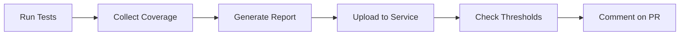

# How to Generate Code Coverage Reports with GitHub Actions

Author: [nawazdhandala](https://www.github.com/nawazdhandala)

Tags: GitHub Actions, Code Coverage, Testing, CI/CD, Quality Metrics, Codecov, Jest

Description: Learn how to generate, visualize, and enforce code coverage requirements in GitHub Actions workflows with tools like Codecov, Jest, and native coverage reporters.

---

Code coverage tells you which parts of your code are tested and which are not. Integrating coverage reporting into your CI pipeline helps maintain quality standards and catch untested code before it reaches production.

## Coverage Workflow Overview

A complete coverage pipeline includes collection, reporting, and enforcement:



## Basic Coverage with Jest

Generate coverage reports using Jest:

```yaml
# .github/workflows/coverage.yml
name: Code Coverage

on:
  push:
    branches: [main]
  pull_request:
    branches: [main]

jobs:
  coverage:
    runs-on: ubuntu-latest
    steps:
      - uses: actions/checkout@v4

      - name: Set up Node.js
        uses: actions/setup-node@v4
        with:
          node-version: '20'
          cache: 'npm'

      - name: Install dependencies
        run: npm ci

      - name: Run tests with coverage
        run: npm test -- --coverage --coverageReporters=json-summary --coverageReporters=lcov

      - name: Upload coverage artifact
        uses: actions/upload-artifact@v4
        with:
          name: coverage-report
          path: coverage/
```

Configure Jest for coverage:

```javascript
// jest.config.js
module.exports = {
  collectCoverageFrom: [
    'src/**/*.{js,jsx,ts,tsx}',
    '!src/**/*.d.ts',
    '!src/**/index.ts',  // Exclude barrel files
    '!src/**/*.stories.tsx',  // Exclude Storybook
  ],
  coverageThreshold: {
    global: {
      branches: 80,
      functions: 80,
      lines: 80,
      statements: 80
    }
  },
  coverageReporters: ['text', 'lcov', 'json-summary']
};
```

## Uploading to Codecov

Codecov provides coverage tracking, visualization, and PR comments:

```yaml
jobs:
  coverage:
    runs-on: ubuntu-latest
    steps:
      - uses: actions/checkout@v4

      - name: Set up Node.js
        uses: actions/setup-node@v4
        with:
          node-version: '20'
          cache: 'npm'

      - run: npm ci
      - run: npm test -- --coverage

      - name: Upload to Codecov
        uses: codecov/codecov-action@v4
        with:
          token: ${{ secrets.CODECOV_TOKEN }}
          files: ./coverage/lcov.info
          flags: unittests
          name: codecov-umbrella
          fail_ci_if_error: true
          verbose: true
```

Configure Codecov with a yaml file:

```yaml
# codecov.yml
coverage:
  precision: 2
  round: down
  range: "70...100"
  status:
    project:
      default:
        target: 80%
        threshold: 2%  # Allow 2% drop
    patch:
      default:
        target: 90%  # Higher bar for new code

comment:
  layout: "reach,diff,flags,files"
  behavior: default
  require_changes: true

flags:
  unittests:
    paths:
      - src/
    carryforward: true
```

## Python Coverage with pytest-cov

Generate coverage for Python projects:

```yaml
jobs:
  python-coverage:
    runs-on: ubuntu-latest
    steps:
      - uses: actions/checkout@v4

      - name: Set up Python
        uses: actions/setup-python@v5
        with:
          python-version: '3.11'
          cache: 'pip'

      - name: Install dependencies
        run: |
          pip install pytest pytest-cov
          pip install -r requirements.txt

      - name: Run tests with coverage
        run: |
          pytest \
            --cov=src \
            --cov-report=xml \
            --cov-report=html \
            --cov-report=term-missing \
            --cov-fail-under=80

      - name: Upload to Codecov
        uses: codecov/codecov-action@v4
        with:
          token: ${{ secrets.CODECOV_TOKEN }}
          files: coverage.xml

      - name: Upload HTML report
        uses: actions/upload-artifact@v4
        with:
          name: coverage-html
          path: htmlcov/
```

## Coverage Comments on Pull Requests

Add coverage reports directly to PR comments:

```yaml
jobs:
  coverage:
    runs-on: ubuntu-latest
    permissions:
      pull-requests: write
    steps:
      - uses: actions/checkout@v4

      - uses: actions/setup-node@v4
        with:
          node-version: '20'
          cache: 'npm'

      - run: npm ci
      - run: npm test -- --coverage --coverageReporters=json-summary

      - name: Coverage comment
        uses: MishaKav/jest-coverage-comment@main
        with:
          coverage-summary-path: ./coverage/coverage-summary.json
          title: Test Coverage
          summary-title: Coverage Summary
          badge-title: Coverage
          hide-comment: false
          create-new-comment: false
          hide-summary: false
```

## Multi-Project Coverage

Aggregate coverage from multiple packages in a monorepo:

```yaml
jobs:
  coverage:
    runs-on: ubuntu-latest
    strategy:
      matrix:
        package: [api, web, shared]
    steps:
      - uses: actions/checkout@v4

      - uses: actions/setup-node@v4
        with:
          node-version: '20'
          cache: 'npm'

      - run: npm ci

      - name: Run coverage for ${{ matrix.package }}
        run: npm test --workspace=${{ matrix.package }} -- --coverage

      - name: Upload coverage
        uses: codecov/codecov-action@v4
        with:
          token: ${{ secrets.CODECOV_TOKEN }}
          flags: ${{ matrix.package }}
          directory: packages/${{ matrix.package }}/coverage

  aggregate:
    needs: coverage
    runs-on: ubuntu-latest
    steps:
      - name: Check overall coverage
        uses: codecov/codecov-action@v4
        with:
          token: ${{ secrets.CODECOV_TOKEN }}
          fail_ci_if_error: true
```

## Coverage Badges

Generate and display coverage badges:

```yaml
jobs:
  coverage-badge:
    runs-on: ubuntu-latest
    steps:
      - uses: actions/checkout@v4

      - uses: actions/setup-node@v4
        with:
          node-version: '20'

      - run: npm ci
      - run: npm test -- --coverage --coverageReporters=json-summary

      - name: Generate badge
        uses: jaywcjlove/coverage-badges-cli@main
        with:
          source: coverage/coverage-summary.json
          output: coverage/badge.svg

      - name: Commit badge
        if: github.ref == 'refs/heads/main'
        run: |
          git config user.name "github-actions[bot]"
          git config user.email "github-actions[bot]@users.noreply.github.com"
          git add coverage/badge.svg
          git diff --staged --quiet || git commit -m "chore: update coverage badge"
          git push
```

## Enforcing Coverage Thresholds

Fail the build when coverage drops below acceptable levels:

```yaml
jobs:
  coverage:
    runs-on: ubuntu-latest
    steps:
      - uses: actions/checkout@v4

      - uses: actions/setup-node@v4
        with:
          node-version: '20'
          cache: 'npm'

      - run: npm ci

      # Jest will fail if coverage is below threshold
      - name: Run tests with coverage
        run: npm test -- --coverage

      # Alternative: Manual threshold check
      - name: Check coverage threshold
        run: |
          COVERAGE=$(cat coverage/coverage-summary.json | jq '.total.lines.pct')
          echo "Line coverage: $COVERAGE%"
          if (( $(echo "$COVERAGE < 80" | bc -l) )); then
            echo "Coverage is below 80%!"
            exit 1
          fi
```

## Coverage Diff on PRs

Show coverage changes between base and head:

```yaml
jobs:
  coverage-diff:
    runs-on: ubuntu-latest
    steps:
      - uses: actions/checkout@v4
        with:
          fetch-depth: 0

      - uses: actions/setup-node@v4
        with:
          node-version: '20'
          cache: 'npm'

      - run: npm ci

      # Get base coverage
      - name: Get base coverage
        run: |
          git checkout ${{ github.event.pull_request.base.sha }}
          npm ci
          npm test -- --coverage --coverageReporters=json-summary
          mv coverage/coverage-summary.json base-coverage.json

      # Get head coverage
      - name: Get head coverage
        run: |
          git checkout ${{ github.event.pull_request.head.sha }}
          npm ci
          npm test -- --coverage --coverageReporters=json-summary
          mv coverage/coverage-summary.json head-coverage.json

      # Compare
      - name: Compare coverage
        uses: actions/github-script@v7
        with:
          script: |
            const fs = require('fs');
            const base = JSON.parse(fs.readFileSync('base-coverage.json'));
            const head = JSON.parse(fs.readFileSync('head-coverage.json'));

            const diff = head.total.lines.pct - base.total.lines.pct;
            const emoji = diff >= 0 ? ':arrow_up:' : ':arrow_down:';

            await github.rest.issues.createComment({
              owner: context.repo.owner,
              repo: context.repo.repo,
              issue_number: context.issue.number,
              body: `## Coverage Report

              | Metric | Base | Head | Diff |
              |--------|------|------|------|
              | Lines | ${base.total.lines.pct}% | ${head.total.lines.pct}% | ${emoji} ${diff.toFixed(2)}% |
              | Branches | ${base.total.branches.pct}% | ${head.total.branches.pct}% | ${(head.total.branches.pct - base.total.branches.pct).toFixed(2)}% |
              | Functions | ${base.total.functions.pct}% | ${head.total.functions.pct}% | ${(head.total.functions.pct - base.total.functions.pct).toFixed(2)}% |
              `
            });
```

## Integration Test Coverage

Collect coverage from integration tests running against services:

```yaml
jobs:
  integration-coverage:
    runs-on: ubuntu-latest
    services:
      postgres:
        image: postgres:15
        env:
          POSTGRES_PASSWORD: postgres
        ports:
          - 5432:5432

    steps:
      - uses: actions/checkout@v4

      - uses: actions/setup-node@v4
        with:
          node-version: '20'

      - run: npm ci

      # Run app with coverage instrumentation
      - name: Start app with coverage
        run: |
          npx nyc --reporter=lcov node dist/server.js &
          sleep 5

      - name: Run integration tests
        run: npm run test:integration

      - name: Stop app and collect coverage
        run: |
          kill $(lsof -t -i:3000) || true
          # Coverage is written on process exit

      - name: Upload coverage
        uses: codecov/codecov-action@v4
        with:
          token: ${{ secrets.CODECOV_TOKEN }}
          flags: integration
```

## Best Practices

1. **Set realistic thresholds** - Start with your current coverage and gradually increase targets.

2. **Focus on critical paths** - High coverage on core business logic matters more than utility functions.

3. **Track trends** - Coverage should trend upward over time, not just meet a static threshold.

4. **Review uncovered lines** - Sometimes uncovered code reveals dead code that should be removed.

5. **Separate unit and integration coverage** - Track them separately with different expectations.

6. **Do not game the metrics** - Coverage is a guide, not a goal. Well-tested code matters more than high numbers.

Coverage reports give you visibility into your testing blind spots. Use them as a tool for improvement, not just a gate to pass.
