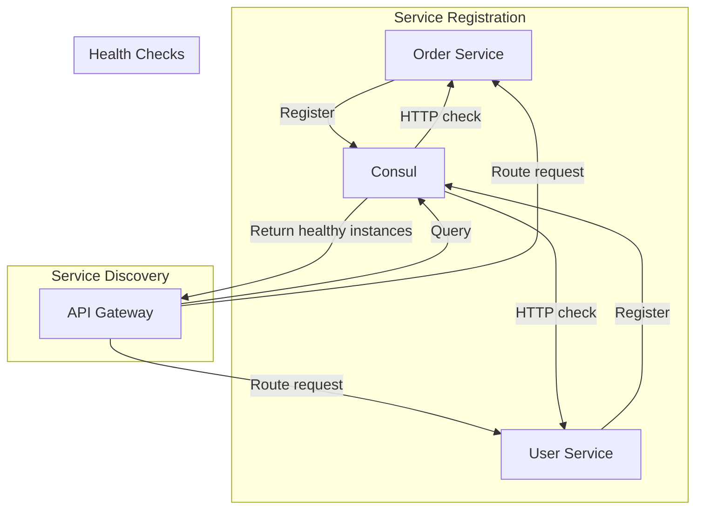

# How to Build a Consul Client in .NET

Author: [nawazdhandala](https://www.github.com/nawazdhandala)

Tags: .NET, C#, Consul, Service Discovery, Microservices

Description: Learn how to build a Consul client in .NET for service registration, discovery, health checks, and distributed configuration in microservices architectures.

---

HashiCorp Consul is a popular service mesh solution that provides service discovery, configuration management, and health checking. In microservices architectures, services need to find each other dynamically, and Consul solves this problem elegantly. This guide shows you how to integrate your .NET services with Consul.

## Why Consul?

In a microservices environment, services come and go. IP addresses change as containers are rescheduled. Hard-coding service locations breaks as soon as you scale. Consul maintains a registry of healthy service instances, letting your services discover each other at runtime.



## Setting Up the Consul Client

First, add the Consul NuGet package to your project.

```bash
dotnet add package Consul
```

Create a configuration class for Consul settings.

```csharp
// ConsulConfig.cs
public class ConsulConfig
{
    // Consul server address
    public string Address { get; set; } = "http://localhost:8500";

    // This service's registration details
    public string ServiceName { get; set; } = string.Empty;
    public string ServiceId { get; set; } = string.Empty;
    public string ServiceAddress { get; set; } = string.Empty;
    public int ServicePort { get; set; }

    // Health check configuration
    public string HealthCheckEndpoint { get; set; } = "/health";
    public int HealthCheckIntervalSeconds { get; set; } = 10;
    public int DeregisterCriticalServiceAfterMinutes { get; set; } = 1;

    // Tags for service filtering
    public string[] Tags { get; set; } = Array.Empty<string>();
}
```

## Service Registration

Register your service with Consul when it starts, and deregister when it stops.

```csharp
// ConsulServiceRegistration.cs
using Consul;

public class ConsulServiceRegistration : IHostedService
{
    private readonly IConsulClient _consulClient;
    private readonly ConsulConfig _config;
    private readonly ILogger<ConsulServiceRegistration> _logger;
    private string? _registrationId;

    public ConsulServiceRegistration(
        IConsulClient consulClient,
        IOptions<ConsulConfig> config,
        ILogger<ConsulServiceRegistration> logger)
    {
        _consulClient = consulClient;
        _config = config.Value;
        _logger = logger;
    }

    public async Task StartAsync(CancellationToken cancellationToken)
    {
        // Generate a unique ID for this service instance
        _registrationId = string.IsNullOrEmpty(_config.ServiceId)
            ? $"{_config.ServiceName}-{Guid.NewGuid():N}"
            : _config.ServiceId;

        // Build the health check URL
        var healthCheckUrl = $"http://{_config.ServiceAddress}:{_config.ServicePort}" +
                            $"{_config.HealthCheckEndpoint}";

        var registration = new AgentServiceRegistration
        {
            ID = _registrationId,
            Name = _config.ServiceName,
            Address = _config.ServiceAddress,
            Port = _config.ServicePort,
            Tags = _config.Tags,

            // Configure health check
            Check = new AgentServiceCheck
            {
                // Consul will call this endpoint periodically
                HTTP = healthCheckUrl,
                Interval = TimeSpan.FromSeconds(_config.HealthCheckIntervalSeconds),
                Timeout = TimeSpan.FromSeconds(5),

                // Remove unhealthy instances automatically
                DeregisterCriticalServiceAfter = TimeSpan.FromMinutes(
                    _config.DeregisterCriticalServiceAfterMinutes)
            },

            // Optional: Add metadata
            Meta = new Dictionary<string, string>
            {
                { "version", "1.0.0" },
                { "environment", Environment.GetEnvironmentVariable("ASPNETCORE_ENVIRONMENT") ?? "Production" }
            }
        };

        _logger.LogInformation(
            "Registering service {ServiceName} with Consul at {Address}",
            _config.ServiceName,
            _config.Address);

        try
        {
            // Register with Consul
            await _consulClient.Agent.ServiceRegister(registration, cancellationToken);

            _logger.LogInformation(
                "Successfully registered service {ServiceId} with Consul",
                _registrationId);
        }
        catch (Exception ex)
        {
            _logger.LogError(ex, "Failed to register service with Consul");
            // Don't throw - service should still start even if Consul is unavailable
        }
    }

    public async Task StopAsync(CancellationToken cancellationToken)
    {
        if (string.IsNullOrEmpty(_registrationId))
        {
            return;
        }

        _logger.LogInformation(
            "Deregistering service {ServiceId} from Consul",
            _registrationId);

        try
        {
            await _consulClient.Agent.ServiceDeregister(_registrationId, cancellationToken);
            _logger.LogInformation("Successfully deregistered from Consul");
        }
        catch (Exception ex)
        {
            _logger.LogError(ex, "Failed to deregister from Consul");
        }
    }
}
```

## Service Discovery

Create a service to discover other services by name.

```csharp
// IServiceDiscovery.cs
public interface IServiceDiscovery
{
    Task<Uri?> GetServiceUriAsync(string serviceName);
    Task<IReadOnlyList<ServiceInstance>> GetServiceInstancesAsync(string serviceName);
}

public class ServiceInstance
{
    public string Id { get; set; } = string.Empty;
    public string Name { get; set; } = string.Empty;
    public string Address { get; set; } = string.Empty;
    public int Port { get; set; }
    public string[] Tags { get; set; } = Array.Empty<string>();
    public Dictionary<string, string> Meta { get; set; } = new();

    public Uri Uri => new Uri($"http://{Address}:{Port}");
}

// ConsulServiceDiscovery.cs
public class ConsulServiceDiscovery : IServiceDiscovery
{
    private readonly IConsulClient _consulClient;
    private readonly ILogger<ConsulServiceDiscovery> _logger;

    // Simple round-robin counter for load balancing
    private int _roundRobinIndex;

    public ConsulServiceDiscovery(
        IConsulClient consulClient,
        ILogger<ConsulServiceDiscovery> logger)
    {
        _consulClient = consulClient;
        _logger = logger;
    }

    public async Task<Uri?> GetServiceUriAsync(string serviceName)
    {
        var instances = await GetServiceInstancesAsync(serviceName);

        if (instances.Count == 0)
        {
            _logger.LogWarning(
                "No healthy instances found for service: {ServiceName}",
                serviceName);
            return null;
        }

        // Simple round-robin load balancing
        var index = Interlocked.Increment(ref _roundRobinIndex) % instances.Count;
        var instance = instances[index];

        _logger.LogDebug(
            "Selected instance {InstanceId} for service {ServiceName}",
            instance.Id,
            serviceName);

        return instance.Uri;
    }

    public async Task<IReadOnlyList<ServiceInstance>> GetServiceInstancesAsync(
        string serviceName)
    {
        try
        {
            // Query only healthy service instances
            var queryResult = await _consulClient.Health.Service(
                serviceName,
                tag: string.Empty,  // No tag filter
                passingOnly: true); // Only healthy instances

            var services = queryResult.Response
                .Select(entry => new ServiceInstance
                {
                    Id = entry.Service.ID,
                    Name = entry.Service.Service,
                    Address = entry.Service.Address,
                    Port = entry.Service.Port,
                    Tags = entry.Service.Tags,
                    Meta = entry.Service.Meta ?? new Dictionary<string, string>()
                })
                .ToList();

            _logger.LogDebug(
                "Found {Count} healthy instances for service: {ServiceName}",
                services.Count,
                serviceName);

            return services;
        }
        catch (Exception ex)
        {
            _logger.LogError(
                ex,
                "Error discovering service: {ServiceName}",
                serviceName);

            return Array.Empty<ServiceInstance>();
        }
    }
}
```

## HTTP Client Integration

Create an HTTP client that automatically discovers service addresses.

```csharp
// ServiceDiscoveryHttpMessageHandler.cs
public class ServiceDiscoveryHttpMessageHandler : DelegatingHandler
{
    private readonly IServiceDiscovery _serviceDiscovery;
    private readonly ILogger<ServiceDiscoveryHttpMessageHandler> _logger;

    public ServiceDiscoveryHttpMessageHandler(
        IServiceDiscovery serviceDiscovery,
        ILogger<ServiceDiscoveryHttpMessageHandler> logger)
    {
        _serviceDiscovery = serviceDiscovery;
        _logger = logger;
    }

    protected override async Task<HttpResponseMessage> SendAsync(
        HttpRequestMessage request,
        CancellationToken cancellationToken)
    {
        var originalUri = request.RequestUri;

        if (originalUri == null)
        {
            throw new InvalidOperationException("Request URI is null");
        }

        // The host part of the URL is treated as the service name
        // Example: http://user-service/api/users -> discovers "user-service"
        var serviceName = originalUri.Host;

        // Discover the actual service address
        var serviceUri = await _serviceDiscovery.GetServiceUriAsync(serviceName);

        if (serviceUri == null)
        {
            throw new HttpRequestException(
                $"No healthy instances available for service: {serviceName}");
        }

        // Rebuild the URL with the discovered address
        var newUri = new UriBuilder(originalUri)
        {
            Scheme = serviceUri.Scheme,
            Host = serviceUri.Host,
            Port = serviceUri.Port
        }.Uri;

        request.RequestUri = newUri;

        _logger.LogDebug(
            "Resolved {ServiceName} to {ActualUri}",
            serviceName,
            newUri);

        try
        {
            return await base.SendAsync(request, cancellationToken);
        }
        catch (Exception ex)
        {
            _logger.LogError(
                ex,
                "Request to {ServiceName} failed. Resolved URI: {Uri}",
                serviceName,
                newUri);
            throw;
        }
    }
}

// Usage: Register a typed HTTP client with service discovery
// Program.cs
builder.Services.AddTransient<ServiceDiscoveryHttpMessageHandler>();

builder.Services.AddHttpClient<IUserServiceClient, UserServiceClient>(client =>
{
    // Use service name as the base address
    // The handler will resolve this to actual service instances
    client.BaseAddress = new Uri("http://user-service/");
})
.AddHttpMessageHandler<ServiceDiscoveryHttpMessageHandler>();
```

## Distributed Configuration with Consul KV

Consul includes a key-value store for distributed configuration.

```csharp
// ConsulConfigurationProvider.cs
using Microsoft.Extensions.Configuration;

public class ConsulConfigurationProvider : ConfigurationProvider
{
    private readonly IConsulClient _consulClient;
    private readonly string _basePath;
    private readonly ILogger _logger;

    public ConsulConfigurationProvider(
        IConsulClient consulClient,
        string basePath,
        ILogger logger)
    {
        _consulClient = consulClient;
        _basePath = basePath.TrimEnd('/');
        _logger = logger;
    }

    public override void Load()
    {
        LoadAsync().GetAwaiter().GetResult();
    }

    private async Task LoadAsync()
    {
        try
        {
            // Get all keys under the base path
            var queryResult = await _consulClient.KV.List(_basePath);

            if (queryResult.Response == null)
            {
                _logger.LogWarning(
                    "No configuration found in Consul at path: {Path}",
                    _basePath);
                return;
            }

            var data = new Dictionary<string, string?>(StringComparer.OrdinalIgnoreCase);

            foreach (var kvPair in queryResult.Response)
            {
                if (kvPair.Value == null)
                {
                    continue;
                }

                // Convert Consul path to configuration key
                // Example: "myapp/ConnectionStrings/Default" -> "ConnectionStrings:Default"
                var key = kvPair.Key
                    .Substring(_basePath.Length)
                    .TrimStart('/')
                    .Replace('/', ':');

                var value = Encoding.UTF8.GetString(kvPair.Value);
                data[key] = value;
            }

            Data = data;

            _logger.LogInformation(
                "Loaded {Count} configuration values from Consul",
                data.Count);
        }
        catch (Exception ex)
        {
            _logger.LogError(ex, "Failed to load configuration from Consul");
        }
    }
}

// ConsulConfigurationSource.cs
public class ConsulConfigurationSource : IConfigurationSource
{
    public string Address { get; set; } = "http://localhost:8500";
    public string BasePath { get; set; } = string.Empty;

    public IConfigurationProvider Build(IConfigurationBuilder builder)
    {
        var consulClient = new ConsulClient(config =>
        {
            config.Address = new Uri(Address);
        });

        var loggerFactory = LoggerFactory.Create(b => b.AddConsole());
        var logger = loggerFactory.CreateLogger<ConsulConfigurationProvider>();

        return new ConsulConfigurationProvider(consulClient, BasePath, logger);
    }
}

// Extension method
public static class ConsulConfigurationExtensions
{
    public static IConfigurationBuilder AddConsul(
        this IConfigurationBuilder builder,
        string address,
        string basePath)
    {
        return builder.Add(new ConsulConfigurationSource
        {
            Address = address,
            BasePath = basePath
        });
    }
}
```

## Watch for Configuration Changes

Consul supports watching for key changes, enabling dynamic configuration updates.

```csharp
// ConsulConfigurationWatcher.cs
public class ConsulConfigurationWatcher : BackgroundService
{
    private readonly IConsulClient _consulClient;
    private readonly string _watchPath;
    private readonly IConfiguration _configuration;
    private readonly ILogger<ConsulConfigurationWatcher> _logger;
    private ulong _lastIndex;

    public ConsulConfigurationWatcher(
        IConsulClient consulClient,
        IOptions<ConsulConfig> config,
        IConfiguration configuration,
        ILogger<ConsulConfigurationWatcher> logger)
    {
        _consulClient = consulClient;
        _watchPath = $"config/{config.Value.ServiceName}";
        _configuration = configuration;
        _logger = logger;
    }

    protected override async Task ExecuteAsync(CancellationToken stoppingToken)
    {
        _logger.LogInformation(
            "Starting Consul configuration watcher for path: {Path}",
            _watchPath);

        while (!stoppingToken.IsCancellationRequested)
        {
            try
            {
                // Long-poll for changes
                // Consul blocks until something changes or timeout
                var queryOptions = new QueryOptions
                {
                    WaitIndex = _lastIndex,
                    WaitTime = TimeSpan.FromMinutes(5)
                };

                var result = await _consulClient.KV.List(
                    _watchPath,
                    queryOptions,
                    stoppingToken);

                // Check if the index changed (indicating a change)
                if (result.LastIndex > _lastIndex)
                {
                    _lastIndex = result.LastIndex;

                    _logger.LogInformation(
                        "Configuration changed in Consul at path: {Path}",
                        _watchPath);

                    // Trigger configuration reload
                    if (_configuration is IConfigurationRoot configRoot)
                    {
                        configRoot.Reload();
                        _logger.LogInformation("Configuration reloaded");
                    }
                }
            }
            catch (OperationCanceledException) when (stoppingToken.IsCancellationRequested)
            {
                // Normal shutdown
                break;
            }
            catch (Exception ex)
            {
                _logger.LogError(ex, "Error watching Consul configuration");
                await Task.Delay(TimeSpan.FromSeconds(5), stoppingToken);
            }
        }
    }
}
```

## Registration and Configuration

Put everything together in Program.cs.

```csharp
// Program.cs
var builder = WebApplication.CreateBuilder(args);

// Load Consul configuration
builder.Services.Configure<ConsulConfig>(
    builder.Configuration.GetSection("Consul"));

// Create Consul client
builder.Services.AddSingleton<IConsulClient>(sp =>
{
    var config = sp.GetRequiredService<IOptions<ConsulConfig>>().Value;
    return new ConsulClient(consulConfig =>
    {
        consulConfig.Address = new Uri(config.Address);
    });
});

// Register service discovery
builder.Services.AddSingleton<IServiceDiscovery, ConsulServiceDiscovery>();

// Register service registration as hosted service
builder.Services.AddHostedService<ConsulServiceRegistration>();

// Optional: Configuration watcher
builder.Services.AddHostedService<ConsulConfigurationWatcher>();

// Health checks endpoint
builder.Services.AddHealthChecks();

var app = builder.Build();

// Map health check endpoint for Consul
app.MapHealthChecks("/health");

app.MapControllers();

app.Run();
```

Example appsettings.json:

```json
{
  "Consul": {
    "Address": "http://localhost:8500",
    "ServiceName": "order-service",
    "ServiceAddress": "localhost",
    "ServicePort": 5001,
    "HealthCheckEndpoint": "/health",
    "HealthCheckIntervalSeconds": 10,
    "Tags": ["api", "orders", "v1"]
  }
}
```

## Summary

Building a Consul client in .NET involves several components working together:

| Component | Purpose |
|-----------|---------|
| Service Registration | Register/deregister on startup/shutdown |
| Health Checks | Enable Consul to monitor service health |
| Service Discovery | Find healthy instances of other services |
| HTTP Integration | Automatic service resolution for HTTP calls |
| Configuration | Distributed key-value configuration |
| Watch | Dynamic configuration updates |

Consul provides the foundation for building resilient microservices that can discover each other dynamically, handle failures gracefully, and share configuration across a distributed system. With proper health checks and automatic deregistration, unhealthy instances are automatically removed from the pool, ensuring traffic only goes to healthy services.
