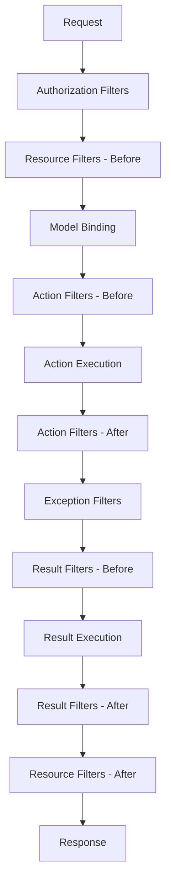

# How to Build Custom Filters in ASP.NET Core

Author: [nawazdhandala](https://www.github.com/nawazdhandala)

Tags: .NET, C#, ASP.NET Core, Filters, Middleware, Web API

Description: Learn how to build custom filters in ASP.NET Core for cross-cutting concerns like authorization, validation, caching, and logging. This guide covers all filter types with practical examples.

---

Filters in ASP.NET Core let you run code before or after specific stages in the request pipeline. Unlike middleware, which runs for every request, filters can be applied selectively to controllers or actions. This makes them perfect for cross-cutting concerns like authorization, validation, exception handling, and response caching.

## Filter Types and Execution Order

ASP.NET Core provides five filter types, each running at a different stage:



| Filter Type | Purpose |
|-------------|---------|
| **Authorization** | Check if user can access the resource |
| **Resource** | Run before/after everything else (caching) |
| **Action** | Run before/after action method |
| **Exception** | Handle unhandled exceptions |
| **Result** | Run before/after action result execution |

## Authorization Filters

Create custom authorization logic:

```csharp
// Filters/ApiKeyAuthorizationFilter.cs
using Microsoft.AspNetCore.Mvc;
using Microsoft.AspNetCore.Mvc.Filters;

public class ApiKeyAuthorizationFilter : IAuthorizationFilter
{
    private readonly IConfiguration _configuration;
    private readonly ILogger<ApiKeyAuthorizationFilter> _logger;

    public ApiKeyAuthorizationFilter(
        IConfiguration configuration,
        ILogger<ApiKeyAuthorizationFilter> logger)
    {
        _configuration = configuration;
        _logger = logger;
    }

    public void Authorize(AuthorizationFilterContext context)
    {
        // Check for API key header
        if (!context.HttpContext.Request.Headers.TryGetValue("X-Api-Key", out var providedKey))
        {
            _logger.LogWarning("API key missing from request to {Path}",
                context.HttpContext.Request.Path);

            context.Result = new UnauthorizedObjectResult(new
            {
                Error = "API key is required",
                Code = "MISSING_API_KEY"
            });
            return;
        }

        var validKey = _configuration["ApiKey"];
        if (providedKey != validKey)
        {
            _logger.LogWarning("Invalid API key provided for {Path}",
                context.HttpContext.Request.Path);

            context.Result = new UnauthorizedObjectResult(new
            {
                Error = "Invalid API key",
                Code = "INVALID_API_KEY"
            });
        }
    }
}

// Create an attribute for easy application
[AttributeUsage(AttributeTargets.Class | AttributeTargets.Method)]
public class ApiKeyRequiredAttribute : TypeFilterAttribute
{
    public ApiKeyRequiredAttribute() : base(typeof(ApiKeyAuthorizationFilter))
    {
    }
}

// Usage
[ApiController]
[Route("api/[controller]")]
[ApiKeyRequired]  // Apply to all actions in controller
public class WebhooksController : ControllerBase
{
    [HttpPost]
    public IActionResult ReceiveWebhook([FromBody] WebhookPayload payload)
    {
        // Process webhook
        return Ok();
    }
}
```

## Resource Filters

Resource filters run early in the pipeline and are ideal for caching:

```csharp
// Filters/ResponseCacheFilter.cs
using Microsoft.AspNetCore.Mvc;
using Microsoft.AspNetCore.Mvc.Filters;
using Microsoft.Extensions.Caching.Memory;

public class ResponseCacheFilter : IAsyncResourceFilter
{
    private readonly IMemoryCache _cache;
    private readonly int _durationSeconds;

    public ResponseCacheFilter(IMemoryCache cache, int durationSeconds = 60)
    {
        _cache = cache;
        _durationSeconds = durationSeconds;
    }

    public async Task OnResourceExecutionAsync(
        ResourceExecutingContext context,
        ResourceExecutionDelegate next)
    {
        // Only cache GET requests
        if (context.HttpContext.Request.Method != HttpMethod.Get.Method)
        {
            await next();
            return;
        }

        // Generate cache key from request path and query string
        var cacheKey = GenerateCacheKey(context.HttpContext.Request);

        // Try to get cached response
        if (_cache.TryGetValue(cacheKey, out CachedResponse? cachedResponse))
        {
            context.Result = new ContentResult
            {
                Content = cachedResponse!.Content,
                ContentType = cachedResponse.ContentType,
                StatusCode = cachedResponse.StatusCode
            };
            return;
        }

        // Execute the action
        var executedContext = await next();

        // Cache successful responses
        if (executedContext.Result is ObjectResult objectResult &&
            objectResult.StatusCode >= 200 &&
            objectResult.StatusCode < 300)
        {
            var content = System.Text.Json.JsonSerializer.Serialize(objectResult.Value);

            _cache.Set(cacheKey, new CachedResponse
            {
                Content = content,
                ContentType = "application/json",
                StatusCode = objectResult.StatusCode ?? 200
            }, TimeSpan.FromSeconds(_durationSeconds));
        }
    }

    private static string GenerateCacheKey(HttpRequest request)
    {
        return $"response:{request.Path}{request.QueryString}";
    }
}

public class CachedResponse
{
    public string Content { get; set; } = string.Empty;
    public string ContentType { get; set; } = string.Empty;
    public int StatusCode { get; set; }
}

// Attribute for easy use
[AttributeUsage(AttributeTargets.Class | AttributeTargets.Method)]
public class CacheResponseAttribute : TypeFilterAttribute
{
    public CacheResponseAttribute(int durationSeconds = 60)
        : base(typeof(ResponseCacheFilter))
    {
        Arguments = new object[] { durationSeconds };
    }
}

// Usage
[HttpGet("{id}")]
[CacheResponse(durationSeconds: 300)]  // Cache for 5 minutes
public async Task<ActionResult<Product>> GetProduct(int id)
{
    return await _productService.GetByIdAsync(id);
}
```

## Action Filters

Action filters run just before and after action execution. They are great for logging, validation, and request/response modification:

```csharp
// Filters/ValidateModelFilter.cs
public class ValidateModelFilter : IActionFilter
{
    public void OnActionExecuting(ActionExecutingContext context)
    {
        if (!context.ModelState.IsValid)
        {
            var errors = context.ModelState
                .Where(e => e.Value?.Errors.Count > 0)
                .ToDictionary(
                    e => e.Key,
                    e => e.Value!.Errors.Select(err => err.ErrorMessage).ToArray());

            context.Result = new BadRequestObjectResult(new
            {
                Success = false,
                Errors = errors
            });
        }
    }

    public void OnActionExecuted(ActionExecutedContext context)
    {
        // Nothing to do after action
    }
}

// Filters/LogActionFilter.cs
public class LogActionFilter : IAsyncActionFilter
{
    private readonly ILogger<LogActionFilter> _logger;

    public LogActionFilter(ILogger<LogActionFilter> logger)
    {
        _logger = logger;
    }

    public async Task OnActionExecutionAsync(
        ActionExecutingContext context,
        ActionExecutionDelegate next)
    {
        var actionName = context.ActionDescriptor.DisplayName;
        var stopwatch = Stopwatch.StartNew();

        _logger.LogInformation("Executing {Action} with arguments: {@Arguments}",
            actionName, context.ActionArguments);

        var executedContext = await next();

        stopwatch.Stop();

        if (executedContext.Exception != null)
        {
            _logger.LogError(executedContext.Exception,
                "{Action} failed after {Elapsed}ms",
                actionName, stopwatch.ElapsedMilliseconds);
        }
        else
        {
            _logger.LogInformation("{Action} completed in {Elapsed}ms",
                actionName, stopwatch.ElapsedMilliseconds);
        }
    }
}

// Filters/AuditLogFilter.cs - Track who did what
public class AuditLogFilter : IAsyncActionFilter
{
    private readonly IAuditLogService _auditLog;

    public AuditLogFilter(IAuditLogService auditLog)
    {
        _auditLog = auditLog;
    }

    public async Task OnActionExecutionAsync(
        ActionExecutingContext context,
        ActionExecutionDelegate next)
    {
        var executedContext = await next();

        // Only log successful mutations
        if (executedContext.Exception == null &&
            context.HttpContext.Request.Method != "GET")
        {
            await _auditLog.LogAsync(new AuditEntry
            {
                UserId = context.HttpContext.User.FindFirst("sub")?.Value,
                Action = context.ActionDescriptor.DisplayName,
                Method = context.HttpContext.Request.Method,
                Path = context.HttpContext.Request.Path,
                Timestamp = DateTime.UtcNow,
                IpAddress = context.HttpContext.Connection.RemoteIpAddress?.ToString()
            });
        }
    }
}
```

## Exception Filters

Handle exceptions globally or for specific controllers:

```csharp
// Filters/GlobalExceptionFilter.cs
public class GlobalExceptionFilter : IExceptionFilter
{
    private readonly ILogger<GlobalExceptionFilter> _logger;
    private readonly IHostEnvironment _environment;

    public GlobalExceptionFilter(
        ILogger<GlobalExceptionFilter> logger,
        IHostEnvironment environment)
    {
        _logger = logger;
        _environment = environment;
    }

    public void OnException(ExceptionContext context)
    {
        _logger.LogError(context.Exception,
            "Unhandled exception in {Action}",
            context.ActionDescriptor.DisplayName);

        var (statusCode, errorCode, message) = context.Exception switch
        {
            NotFoundException => (404, "NOT_FOUND", context.Exception.Message),
            ValidationException => (400, "VALIDATION_ERROR", context.Exception.Message),
            UnauthorizedAccessException => (401, "UNAUTHORIZED", "Access denied"),
            _ => (500, "INTERNAL_ERROR", "An unexpected error occurred")
        };

        var response = new
        {
            Success = false,
            Error = new
            {
                Code = errorCode,
                Message = message,
                // Only include details in development
                Details = _environment.IsDevelopment() ? context.Exception.ToString() : null
            }
        };

        context.Result = new ObjectResult(response)
        {
            StatusCode = statusCode
        };

        context.ExceptionHandled = true;
    }
}

// Custom exceptions
public class NotFoundException : Exception
{
    public NotFoundException(string message) : base(message) { }
}

public class ValidationException : Exception
{
    public ValidationException(string message) : base(message) { }
}
```

## Result Filters

Result filters run before and after the action result executes:

```csharp
// Filters/AddPaginationHeadersFilter.cs
public class AddPaginationHeadersFilter : IResultFilter
{
    public void OnResultExecuting(ResultExecutingContext context)
    {
        if (context.Result is ObjectResult objectResult &&
            objectResult.Value is IPagedResult pagedResult)
        {
            var response = context.HttpContext.Response;

            response.Headers.Append("X-Total-Count", pagedResult.TotalCount.ToString());
            response.Headers.Append("X-Page-Number", pagedResult.PageNumber.ToString());
            response.Headers.Append("X-Page-Size", pagedResult.PageSize.ToString());
            response.Headers.Append("X-Total-Pages", pagedResult.TotalPages.ToString());
        }
    }

    public void OnResultExecuted(ResultExecutedContext context)
    {
        // Nothing needed after result
    }
}

public interface IPagedResult
{
    int TotalCount { get; }
    int PageNumber { get; }
    int PageSize { get; }
    int TotalPages { get; }
}

// Filters/WrapResponseFilter.cs - Standardize API responses
public class WrapResponseFilter : IAsyncResultFilter
{
    public async Task OnResultExecutionAsync(
        ResultExecutingContext context,
        ResultExecutionDelegate next)
    {
        if (context.Result is ObjectResult objectResult)
        {
            // Don't wrap error responses
            if (objectResult.StatusCode >= 400)
            {
                await next();
                return;
            }

            // Wrap successful responses
            objectResult.Value = new
            {
                Success = true,
                Data = objectResult.Value,
                Timestamp = DateTime.UtcNow
            };
        }

        await next();
    }
}
```

## Applying Filters

Register filters globally, on controllers, or on individual actions:

```csharp
// Program.cs - Global filters
builder.Services.AddControllers(options =>
{
    // These run for every request
    options.Filters.Add<GlobalExceptionFilter>();
    options.Filters.Add<ValidateModelFilter>();
    options.Filters.Add<LogActionFilter>();
});

// Register filters that need DI
builder.Services.AddScoped<AuditLogFilter>();
builder.Services.AddScoped<ApiKeyAuthorizationFilter>();

// Controller-level filter
[ApiController]
[Route("api/[controller]")]
[ServiceFilter(typeof(AuditLogFilter))]  // Uses DI to resolve filter
public class OrdersController : ControllerBase
{
    // All actions in this controller will be audited
}

// Action-level filter
[ApiController]
[Route("api/[controller]")]
public class ProductsController : ControllerBase
{
    [HttpGet]
    [CacheResponse(300)]  // Only this action is cached
    public async Task<ActionResult<IEnumerable<Product>>> GetProducts()
    {
        // ...
    }

    [HttpPost]
    [ServiceFilter(typeof(AuditLogFilter))]  // Only POST is audited
    public async Task<ActionResult<Product>> CreateProduct([FromBody] CreateProductRequest request)
    {
        // ...
    }
}
```

## Filter with Dependencies

When filters need injected services, use `TypeFilterAttribute` or `ServiceFilterAttribute`:

```csharp
// TypeFilterAttribute - Creates new instance each time
[AttributeUsage(AttributeTargets.Class | AttributeTargets.Method)]
public class RateLimitAttribute : TypeFilterAttribute
{
    public RateLimitAttribute(int requestsPerMinute = 60)
        : base(typeof(RateLimitFilter))
    {
        Arguments = new object[] { requestsPerMinute };
    }
}

public class RateLimitFilter : IAsyncActionFilter
{
    private readonly IDistributedCache _cache;
    private readonly int _requestsPerMinute;

    public RateLimitFilter(IDistributedCache cache, int requestsPerMinute)
    {
        _cache = cache;
        _requestsPerMinute = requestsPerMinute;
    }

    public async Task OnActionExecutionAsync(
        ActionExecutingContext context,
        ActionExecutionDelegate next)
    {
        var clientIp = context.HttpContext.Connection.RemoteIpAddress?.ToString() ?? "unknown";
        var key = $"rate-limit:{clientIp}:{context.ActionDescriptor.DisplayName}";

        var currentCount = await _cache.GetStringAsync(key);
        var count = int.TryParse(currentCount, out var c) ? c : 0;

        if (count >= _requestsPerMinute)
        {
            context.Result = new ObjectResult(new
            {
                Error = "Rate limit exceeded",
                RetryAfter = 60
            })
            {
                StatusCode = 429
            };
            return;
        }

        await _cache.SetStringAsync(key, (count + 1).ToString(),
            new DistributedCacheEntryOptions
            {
                AbsoluteExpirationRelativeToNow = TimeSpan.FromMinutes(1)
            });

        await next();
    }
}

// Usage
[HttpPost("send")]
[RateLimit(requestsPerMinute: 10)]  // Strict limit for this endpoint
public async Task<IActionResult> SendEmail([FromBody] SendEmailRequest request)
{
    // ...
}
```

## Filter Order

Control execution order with the `Order` property:

```csharp
[ApiController]
[Route("api/[controller]")]
[ServiceFilter(typeof(LogActionFilter), Order = 1)]      // Runs first
[ServiceFilter(typeof(ValidateModelFilter), Order = 2)]   // Runs second
[ServiceFilter(typeof(AuditLogFilter), Order = 3)]        // Runs third
public class UsersController : ControllerBase
{
    // Filters execute in order: Log -> Validate -> Audit
    // On the way out: Audit -> Validate -> Log
}
```

## Summary

Filters provide a clean way to handle cross-cutting concerns in ASP.NET Core:

| Filter Type | When It Runs | Common Uses |
|-------------|--------------|-------------|
| **Authorization** | First, before everything | API keys, permissions |
| **Resource** | Before/after model binding | Response caching |
| **Action** | Before/after action | Logging, validation |
| **Exception** | When exceptions occur | Error handling |
| **Result** | Before/after result | Response wrapping |

Key points to remember:
- Filters run in a specific order that you can customize
- Use `TypeFilterAttribute` for filters with constructor arguments
- Use `ServiceFilterAttribute` when the filter is registered in DI
- Global filters apply to all requests; controller/action filters are selective
- Exception filters are great for consistent error responses

Filters keep your controllers focused on business logic while handling infrastructure concerns elsewhere.
