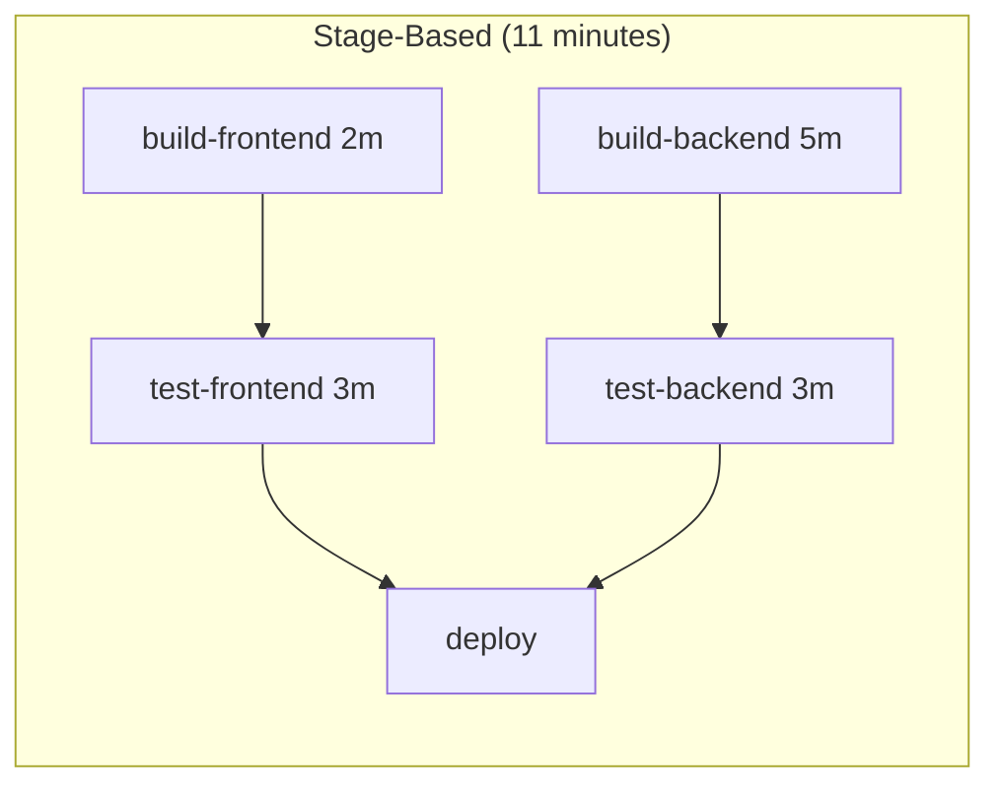
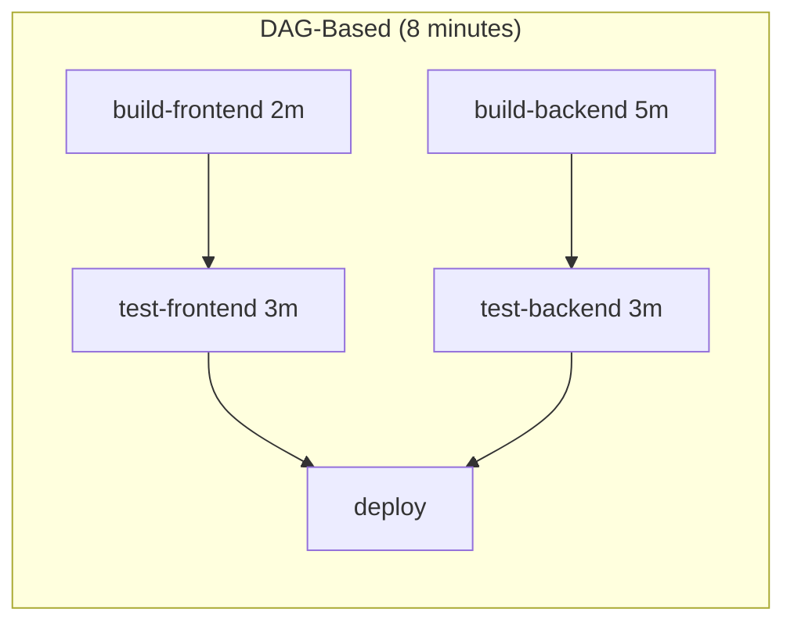
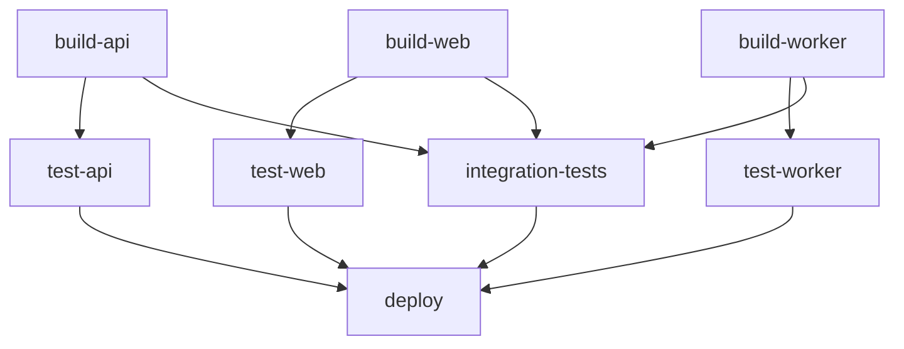

# How to Implement DAG Pipelines in GitLab CI

Author: [nawazdhandala](https://www.github.com/nawazdhandala)

Tags: GitLab CI, DAG, Directed Acyclic Graph, Pipeline Optimization, CI/CD

Description: Learn how to implement DAG (Directed Acyclic Graph) pipelines in GitLab CI to run jobs as soon as their dependencies complete, reducing pipeline duration significantly.

---

Traditional GitLab pipelines wait for entire stages to complete before starting the next one. This means fast jobs wait for slow jobs in the same stage. DAG pipelines break this pattern by letting jobs start as soon as their specific dependencies finish. This guide shows you how to use the `needs` keyword to build faster, more efficient pipelines.

## Understanding DAG vs Stage-Based Pipelines

In stage-based execution, all jobs in stage 2 wait for all jobs in stage 1 to complete, even if there's no actual dependency.

In DAG execution, jobs specify their dependencies explicitly. A job starts as soon as its dependencies complete, regardless of stage.

## Stage-Based Example

Consider this traditional pipeline:

```yaml
stages:
  - build
  - test
  - deploy

build-frontend:
  stage: build
  script:
    - npm run build:frontend
  # Takes 2 minutes

build-backend:
  stage: build
  script:
    - npm run build:backend
  # Takes 5 minutes

test-frontend:
  stage: test
  script:
    - npm run test:frontend
  # Waits for BOTH builds to complete

test-backend:
  stage: test
  script:
    - npm run test:backend
  # Waits for BOTH builds to complete
```

The frontend tests wait 5 minutes for the backend build, even though they only need the frontend build.

## DAG Example

The same pipeline with DAG optimization:

```yaml
stages:
  - build
  - test
  - deploy

build-frontend:
  stage: build
  script:
    - npm run build:frontend
  artifacts:
    paths:
      - frontend/dist/

build-backend:
  stage: build
  script:
    - npm run build:backend
  artifacts:
    paths:
      - backend/dist/

test-frontend:
  stage: test
  script:
    - npm run test:frontend
  needs:
    - build-frontend  # Only waits for frontend build
  dependencies:
    - build-frontend  # Only downloads frontend artifacts

test-backend:
  stage: test
  script:
    - npm run test:backend
  needs:
    - build-backend  # Only waits for backend build
  dependencies:
    - build-backend  # Only downloads backend artifacts
```

Now frontend tests start as soon as frontend build completes, saving 3 minutes.

## Pipeline Execution Comparison

Here's how the execution differs:





The DAG version allows frontend tests to start immediately after frontend build, overlapping with the slower backend build.

## The needs Keyword

The `needs` keyword defines job dependencies.

```yaml
deploy:
  stage: deploy
  script:
    - ./deploy.sh
  needs:
    - build-frontend
    - build-backend
    - test-integration
```

Jobs in `needs` must complete successfully before this job runs.

## needs with Artifacts

By default, `needs` also downloads artifacts from the listed jobs. Control this explicitly:

```yaml
lint:
  stage: test
  script:
    - npm run lint
  needs:
    - job: build
      artifacts: false  # Don't need build artifacts for linting
```

Or specify to only download artifacts without waiting:

```yaml
report:
  stage: report
  script:
    - ./generate-report.sh
  dependencies:
    - test-unit
    - test-integration
  needs: []  # Start immediately, just need artifacts
```

## Empty needs Array

Use `needs: []` to start a job immediately without waiting for any previous stage.

```yaml
stages:
  - prepare
  - build
  - test

lint:
  stage: test
  script:
    - npm run lint
  needs: []  # Starts immediately, doesn't wait for build

test-unit:
  stage: test
  script:
    - npm test
  needs:
    - build  # Waits for build
```

Lint runs in parallel with build, while unit tests wait for build.

## Complex DAG Example

Here's a realistic microservices pipeline:

```yaml
stages:
  - build
  - test
  - integration
  - deploy

# Build jobs run in parallel
build-api:
  stage: build
  script:
    - docker build -t api:${CI_COMMIT_SHA} ./api
  artifacts:
    paths:
      - api/image-id.txt

build-web:
  stage: build
  script:
    - docker build -t web:${CI_COMMIT_SHA} ./web
  artifacts:
    paths:
      - web/image-id.txt

build-worker:
  stage: build
  script:
    - docker build -t worker:${CI_COMMIT_SHA} ./worker
  artifacts:
    paths:
      - worker/image-id.txt

# Unit tests start as soon as their service builds
test-api:
  stage: test
  script:
    - docker run api:${CI_COMMIT_SHA} npm test
  needs:
    - build-api

test-web:
  stage: test
  script:
    - docker run web:${CI_COMMIT_SHA} npm test
  needs:
    - build-web

test-worker:
  stage: test
  script:
    - docker run worker:${CI_COMMIT_SHA} npm test
  needs:
    - build-worker

# Integration tests need all services built
integration-tests:
  stage: integration
  script:
    - docker-compose up -d
    - npm run test:integration
  needs:
    - build-api
    - build-web
    - build-worker
    # Note: doesn't wait for unit tests

# Deploy waits for all tests
deploy-staging:
  stage: deploy
  script:
    - ./deploy.sh staging
  needs:
    - test-api
    - test-web
    - test-worker
    - integration-tests
```

## Visualizing DAG Dependencies

GitLab shows DAG dependencies in the pipeline graph. Jobs with `needs` display connecting lines to their dependencies.



## Optional Dependencies

Allow jobs to run even if optional dependencies fail.

```yaml
deploy:
  stage: deploy
  script:
    - ./deploy.sh
  needs:
    - job: test-unit
      optional: false  # Required
    - job: test-e2e
      optional: true   # Continue even if e2e fails
```

## Cross-Stage Dependencies

DAG jobs can depend on any previous job, not just the immediately preceding stage.

```yaml
stages:
  - build
  - test
  - analyze
  - deploy

build:
  stage: build
  script:
    - npm run build

test:
  stage: test
  needs:
    - build

security-scan:
  stage: analyze
  needs:
    - build  # Skips test stage, depends only on build

deploy:
  stage: deploy
  needs:
    - test
    - security-scan
```

Security scanning runs in parallel with tests, both depending on build.

## Limiting Parallel Jobs

Control pipeline resource usage with DAG.

```yaml
variables:
  # GitLab-wide setting for needs
  CI_DEBUG_SERVICES: "true"

test-1:
  needs: [build]

test-2:
  needs: [build]

test-3:
  needs: [build]
  # All three tests run in parallel after build
```

If too many parallel jobs overwhelm runners, add artificial dependencies:

```yaml
test-2:
  needs:
    - build
    - test-1  # Forces sequential execution
```

## DAG with Matrix Jobs

Combine DAG with parallel matrix execution.

```yaml
build:
  stage: build
  parallel:
    matrix:
      - PLATFORM: [linux, macos, windows]
  script:
    - ./build.sh ${PLATFORM}

test:
  stage: test
  parallel:
    matrix:
      - PLATFORM: [linux, macos, windows]
  needs:
    - job: build
      parallel:
        matrix:
          - PLATFORM: $PLATFORM  # Match platform
  script:
    - ./test.sh ${PLATFORM}
```

Each platform's test runs as soon as that platform's build completes.

## Debugging DAG Issues

When DAG pipelines behave unexpectedly:

```yaml
debug-job:
  script:
    - echo "Dependencies downloaded:"
    - ls -la
    - echo "Timing:"
    - echo "Job started at: $(date)"
  needs:
    - job: upstream-job
      artifacts: true
```

Check the pipeline graph in GitLab UI to see the actual dependency structure.

Common issues:
- **Job never starts**: Check that all jobs in `needs` exist and succeed
- **Missing artifacts**: Ensure `artifacts` isn't set to false in `needs`
- **Unexpected ordering**: Verify the `needs` array includes all required jobs

## Best Practices

Keep these guidelines in mind when designing DAG pipelines:

1. **Start with stages, add needs gradually**: Convert stage-based pipelines incrementally
2. **Minimize needs arrays**: Each dependency adds complexity
3. **Use artifacts wisely**: Download only what you need
4. **Test pipeline structure**: Use CI Lint before merging changes
5. **Document complex dependencies**: Add comments explaining non-obvious relationships

```yaml
# Example with documentation
deploy:
  stage: deploy
  script:
    - ./deploy.sh
  needs:
    - test-unit          # Required for code quality
    - test-integration   # Required for system stability
    - security-scan      # Required for compliance
    # Note: Does NOT wait for test-e2e (runs post-deploy)
```

---

DAG pipelines unlock significant time savings by parallelizing work that stages force to be sequential. Start by identifying independent job chains in your pipeline, then add `needs` to express their true dependencies. The result is faster feedback and more efficient runner utilization.
