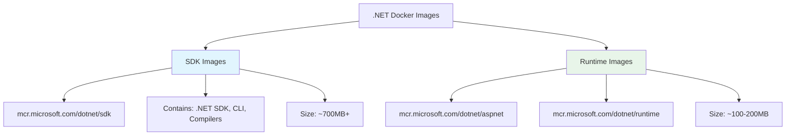
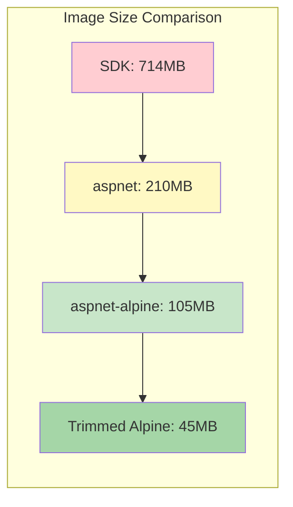
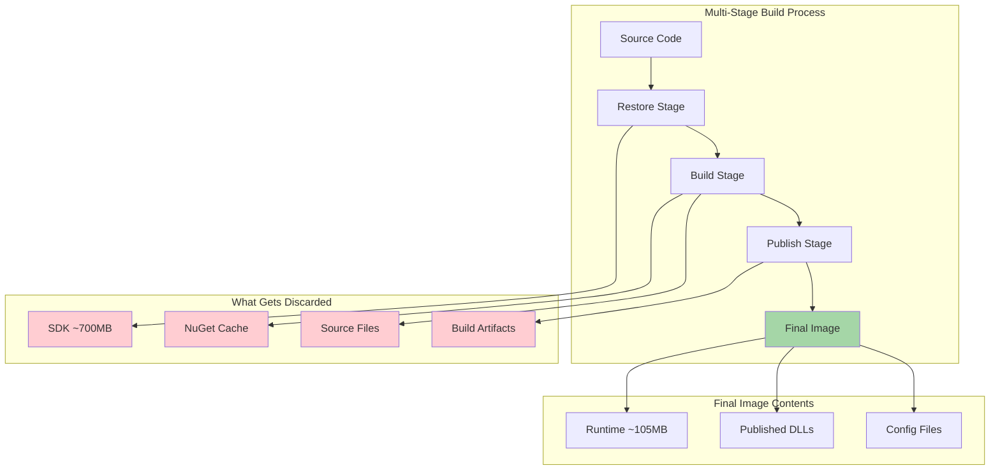

# How to Use Docker with .NET Applications

Author: [Nawaz Dhandala](https://github.com/nawazdhandala)

Tags: .NET, Docker, DevOps, Containers, C#, ASP.NET Core, Microservices

Description: A comprehensive guide to containerizing .NET applications with Docker, covering multi-stage builds, image optimization, SDK vs runtime images, Docker Compose, and health checks for production deployments.

---

> "Containers are the standard unit of software deployment. Mastering Docker with .NET means your applications run consistently from your laptop to production." - Microsoft DevOps Team

Docker and .NET are a powerful combination for building, shipping, and running applications. Whether you are deploying ASP.NET Core APIs, background workers, or microservices, understanding how to containerize .NET applications properly can reduce image sizes by 90%, improve security, and streamline your CI/CD pipelines.

## Understanding .NET Docker Images

Microsoft provides official .NET Docker images in two main variants: SDK and Runtime. Choosing the right image for each stage of your build is crucial for creating optimized containers.



### SDK vs Runtime Images

| Image Type | Purpose | Size | Use Case |
|-----------|---------|------|----------|
| `sdk` | Build and compile | ~700MB | CI/CD build stage |
| `aspnet` | Run ASP.NET Core apps | ~210MB | Web APIs, MVC apps |
| `runtime` | Run console apps | ~190MB | Workers, daemons |
| `runtime-deps` | Self-contained apps | ~110MB | AOT compiled apps |

## Multi-Stage Builds for .NET

Multi-stage builds are essential for .NET applications. You use the SDK image to compile your code, then copy only the published output to a minimal runtime image. This drastically reduces the final image size.

```dockerfile
# Stage 1: Build stage - uses full SDK for compilation
# This stage is only used during build and discarded afterward
FROM mcr.microsoft.com/dotnet/sdk:8.0 AS build

# Set working directory for build context
WORKDIR /src

# Copy project files first (enables layer caching)
# When these files don't change, Docker reuses the cached restore layer
COPY ["MyApp/MyApp.csproj", "MyApp/"]
COPY ["MyApp.Core/MyApp.Core.csproj", "MyApp.Core/"]

# Restore NuGet packages (cached unless .csproj changes)
RUN dotnet restore "MyApp/MyApp.csproj"

# Copy remaining source code
COPY . .

# Build in Release mode
WORKDIR "/src/MyApp"
RUN dotnet build "MyApp.csproj" -c Release -o /app/build

# Stage 2: Publish stage - creates optimized output
FROM build AS publish

# Publish creates a self-contained deployment package
# /p:UseAppHost=false omits the native executable wrapper (smaller size)
RUN dotnet publish "MyApp.csproj" -c Release -o /app/publish /p:UseAppHost=false

# Stage 3: Runtime stage - minimal production image
# Only contains the .NET runtime, not the SDK
FROM mcr.microsoft.com/dotnet/aspnet:8.0 AS final

# Create non-root user for security
# Running as root in containers is a security risk
RUN adduser --disabled-password --gecos "" appuser

WORKDIR /app

# Copy only the published output from the build stage
# No source code, no SDK, no build artifacts
COPY --from=publish /app/publish .

# Set ownership and switch to non-root user
RUN chown -R appuser:appuser /app
USER appuser

# Expose the port your application listens on
EXPOSE 8080

# Set the entry point for the container
ENTRYPOINT ["dotnet", "MyApp.dll"]
```

## Optimizing Image Size

Several techniques can significantly reduce your .NET Docker image size:

### 1. Use Alpine-Based Images

Alpine Linux images are much smaller than Debian-based alternatives:

```dockerfile
# Debian-based (larger, ~210MB)
FROM mcr.microsoft.com/dotnet/aspnet:8.0

# Alpine-based (smaller, ~105MB)
FROM mcr.microsoft.com/dotnet/aspnet:8.0-alpine
```

### 2. Enable Trimming and AOT

.NET 8 supports trimming unused code and Ahead-of-Time compilation for even smaller images:

```dockerfile
FROM mcr.microsoft.com/dotnet/sdk:8.0-alpine AS build
WORKDIR /src

COPY ["MyApp.csproj", "."]
RUN dotnet restore

COPY . .

# Publish with trimming enabled
# PublishTrimmed removes unused code from the final output
# PublishSingleFile creates a single executable
RUN dotnet publish -c Release -o /app/publish \
    /p:PublishTrimmed=true \
    /p:PublishSingleFile=true

# Use runtime-deps for self-contained apps (smallest possible)
FROM mcr.microsoft.com/dotnet/runtime-deps:8.0-alpine AS final

# Install ICU libraries for globalization (required for some apps)
RUN apk add --no-cache icu-libs

# Set globalization mode for Alpine
ENV DOTNET_SYSTEM_GLOBALIZATION_INVARIANT=false

WORKDIR /app
COPY --from=build /app/publish .

# For single-file apps, the entry point is the executable name
ENTRYPOINT ["./MyApp"]
```

### 3. Image Size Comparison



## Adding Health Checks

Health checks allow orchestrators like Kubernetes and Docker Swarm to monitor container health and restart unhealthy containers automatically.

### Dockerfile Health Check

```dockerfile
FROM mcr.microsoft.com/dotnet/aspnet:8.0-alpine AS final

WORKDIR /app
COPY --from=publish /app/publish .

# Configure health check at the Docker level
# --interval: How often to run the check
# --timeout: How long to wait for a response
# --start-period: Grace period before checking starts
# --retries: Failures needed to mark unhealthy
HEALTHCHECK --interval=30s --timeout=10s --start-period=5s --retries=3 \
    CMD wget --no-verbose --tries=1 --spider http://localhost:8080/health || exit 1

EXPOSE 8080
ENTRYPOINT ["dotnet", "MyApp.dll"]
```

### ASP.NET Core Health Endpoint

Configure the health endpoint in your application:

```csharp
// Program.cs - Configure health checks

var builder = WebApplication.CreateBuilder(args);

// Add health check services with custom checks
builder.Services.AddHealthChecks()
    // Check database connectivity
    .AddNpgSql(
        builder.Configuration.GetConnectionString("DefaultConnection")!,
        name: "postgres",
        tags: new[] { "db", "sql" })
    // Check Redis connectivity
    .AddRedis(
        builder.Configuration.GetConnectionString("Redis")!,
        name: "redis",
        tags: new[] { "cache" })
    // Custom health check for external dependencies
    .AddCheck<ExternalApiHealthCheck>("external-api");

var app = builder.Build();

// Map health endpoints
// /health - Basic health check (for load balancers)
app.MapHealthChecks("/health", new HealthCheckOptions
{
    // Return simple status for load balancers
    Predicate = _ => false,
    ResponseWriter = async (context, report) =>
    {
        context.Response.ContentType = "text/plain";
        await context.Response.WriteAsync(report.Status.ToString());
    }
});

// /health/ready - Readiness check (includes all dependencies)
app.MapHealthChecks("/health/ready", new HealthCheckOptions
{
    // Include all health checks
    ResponseWriter = WriteHealthCheckResponse
});

// /health/live - Liveness check (is the app running?)
app.MapHealthChecks("/health/live", new HealthCheckOptions
{
    // Exclude dependency checks - just verify the app responds
    Predicate = _ => false
});

app.Run();

// Helper method to write detailed health check response
static async Task WriteHealthCheckResponse(HttpContext context, HealthReport report)
{
    context.Response.ContentType = "application/json";

    var result = new
    {
        status = report.Status.ToString(),
        checks = report.Entries.Select(e => new
        {
            name = e.Key,
            status = e.Value.Status.ToString(),
            description = e.Value.Description,
            duration = e.Value.Duration.TotalMilliseconds
        })
    };

    await context.Response.WriteAsJsonAsync(result);
}
```

## Docker Compose for .NET

Docker Compose simplifies running multi-container .NET applications with databases, caches, and other dependencies.

### Basic Compose File

```yaml
# docker-compose.yml
# Defines the complete application stack

services:
  # ASP.NET Core Web API
  api:
    build:
      context: .
      dockerfile: src/MyApp.Api/Dockerfile
    ports:
      - "5000:8080"           # Map host port 5000 to container port 8080
    environment:
      - ASPNETCORE_ENVIRONMENT=Production
      - ConnectionStrings__DefaultConnection=Host=postgres;Database=myapp;Username=postgres;Password=secret
      - ConnectionStrings__Redis=redis:6379
    depends_on:
      postgres:
        condition: service_healthy  # Wait for database to be healthy
      redis:
        condition: service_started
    healthcheck:
      test: ["CMD", "wget", "--spider", "-q", "http://localhost:8080/health"]
      interval: 30s
      timeout: 10s
      retries: 3
      start_period: 10s
    networks:
      - app-network
    restart: unless-stopped

  # Background worker service
  worker:
    build:
      context: .
      dockerfile: src/MyApp.Worker/Dockerfile
    environment:
      - DOTNET_ENVIRONMENT=Production
      - ConnectionStrings__DefaultConnection=Host=postgres;Database=myapp;Username=postgres;Password=secret
      - ConnectionStrings__Redis=redis:6379
    depends_on:
      postgres:
        condition: service_healthy
      redis:
        condition: service_started
    networks:
      - app-network
    restart: unless-stopped

  # PostgreSQL database
  postgres:
    image: postgres:16-alpine
    environment:
      - POSTGRES_USER=postgres
      - POSTGRES_PASSWORD=secret
      - POSTGRES_DB=myapp
    volumes:
      - postgres-data:/var/lib/postgresql/data  # Persist database data
    healthcheck:
      test: ["CMD-SHELL", "pg_isready -U postgres"]
      interval: 10s
      timeout: 5s
      retries: 5
    networks:
      - app-network

  # Redis cache
  redis:
    image: redis:7-alpine
    command: redis-server --appendonly yes  # Enable persistence
    volumes:
      - redis-data:/data
    networks:
      - app-network

# Named volumes for data persistence
volumes:
  postgres-data:
  redis-data:

# Custom network for service communication
networks:
  app-network:
    driver: bridge
```

### Development Override

Create a development-specific override file for local development:

```yaml
# docker-compose.override.yml
# Development-specific configuration (auto-merged with docker-compose.yml)

services:
  api:
    build:
      target: build              # Stop at build stage for debugging
    ports:
      - "5000:8080"
      - "5001:8081"              # HTTPS port for development
    environment:
      - ASPNETCORE_ENVIRONMENT=Development
      - ASPNETCORE_URLS=http://+:8080;https://+:8081
    volumes:
      # Mount source code for hot reload during development
      - ./src/MyApp.Api:/src/MyApp.Api:ro
      # Mount user secrets
      - ~/.microsoft/usersecrets:/root/.microsoft/usersecrets:ro
    # Enable hot reload with dotnet watch
    command: dotnet watch run --project /src/MyApp.Api/MyApp.Api.csproj

  postgres:
    ports:
      - "5432:5432"              # Expose database for local tools
```

### Production Override

```yaml
# docker-compose.prod.yml
# Production-specific configuration

services:
  api:
    image: ghcr.io/myorg/myapp-api:${TAG:-latest}
    deploy:
      replicas: 3                # Run 3 instances for high availability
      resources:
        limits:
          cpus: '1'
          memory: 512M
        reservations:
          cpus: '0.5'
          memory: 256M
    logging:
      driver: "json-file"
      options:
        max-size: "10m"
        max-file: "3"

  worker:
    image: ghcr.io/myorg/myapp-worker:${TAG:-latest}
    deploy:
      replicas: 2
      resources:
        limits:
          cpus: '0.5'
          memory: 256M
```

## Complete Multi-Stage Dockerfile

Here is a production-ready Dockerfile incorporating all best practices:

```dockerfile
# syntax=docker/dockerfile:1
# Enable BuildKit features like cache mounts

# ============================================
# Stage 1: Base image with common configuration
# ============================================
FROM mcr.microsoft.com/dotnet/aspnet:8.0-alpine AS base

# Install security updates and required packages
RUN apk update && apk upgrade --no-cache && \
    apk add --no-cache wget icu-libs

# Configure .NET for Alpine
ENV DOTNET_SYSTEM_GLOBALIZATION_INVARIANT=false

# Create non-root user for security
RUN adduser --disabled-password --gecos "" --uid 1001 appuser

WORKDIR /app
EXPOSE 8080

# ============================================
# Stage 2: Restore dependencies (cached layer)
# ============================================
FROM mcr.microsoft.com/dotnet/sdk:8.0-alpine AS restore
WORKDIR /src

# Copy only project files for dependency restoration
# This layer is cached until project files change
COPY ["src/MyApp.Api/MyApp.Api.csproj", "src/MyApp.Api/"]
COPY ["src/MyApp.Core/MyApp.Core.csproj", "src/MyApp.Core/"]
COPY ["src/MyApp.Infrastructure/MyApp.Infrastructure.csproj", "src/MyApp.Infrastructure/"]

# Restore with cache mount for faster builds
RUN --mount=type=cache,target=/root/.nuget/packages \
    dotnet restore "src/MyApp.Api/MyApp.Api.csproj"

# ============================================
# Stage 3: Build the application
# ============================================
FROM restore AS build
ARG BUILD_CONFIGURATION=Release

# Copy all source code
COPY . .

# Build the application
WORKDIR /src/src/MyApp.Api
RUN --mount=type=cache,target=/root/.nuget/packages \
    dotnet build "MyApp.Api.csproj" \
    -c $BUILD_CONFIGURATION \
    -o /app/build \
    --no-restore

# ============================================
# Stage 4: Publish optimized output
# ============================================
FROM build AS publish
ARG BUILD_CONFIGURATION=Release

# Publish with optimizations
RUN dotnet publish "MyApp.Api.csproj" \
    -c $BUILD_CONFIGURATION \
    -o /app/publish \
    --no-build \
    /p:UseAppHost=false

# ============================================
# Stage 5: Final production image
# ============================================
FROM base AS final

# Copy published application
COPY --from=publish --chown=appuser:appuser /app/publish .

# Switch to non-root user
USER appuser

# Configure health check
HEALTHCHECK --interval=30s --timeout=10s --start-period=5s --retries=3 \
    CMD wget --no-verbose --tries=1 --spider http://localhost:8080/health || exit 1

# Start the application
ENTRYPOINT ["dotnet", "MyApp.Api.dll"]
```

## Build Process Flow



## Security Best Practices

### 1. Non-Root User

Always run containers as a non-root user:

```dockerfile
# Create user during build
RUN adduser --disabled-password --gecos "" --uid 1001 appuser

# Set file ownership
COPY --chown=appuser:appuser --from=publish /app/publish .

# Switch to non-root user before running
USER appuser
```

### 2. Read-Only Root Filesystem

Configure containers to use a read-only filesystem:

```yaml
# docker-compose.yml
services:
  api:
    read_only: true              # Root filesystem is read-only
    tmpfs:
      - /tmp                     # Writable temp directory if needed
    security_opt:
      - no-new-privileges:true   # Prevent privilege escalation
```

### 3. Scan Images for Vulnerabilities

```bash
# Scan image with Trivy
trivy image myapp:latest

# Scan and fail on HIGH/CRITICAL vulnerabilities
trivy image --exit-code 1 --severity HIGH,CRITICAL myapp:latest
```

## Monitoring .NET Containers

For production deployments, integrate your .NET containers with [OneUptime](https://oneuptime.com) for comprehensive monitoring:

- **Health Check Monitoring**: Track health endpoint responses and alert on failures
- **Container Metrics**: Monitor CPU, memory, and network usage
- **Log Aggregation**: Centralize container logs for debugging
- **Distributed Tracing**: Trace requests across microservices
- **Uptime Monitoring**: Ensure your containerized applications are always available

## Summary

| Technique | Benefit |
|-----------|---------|
| **Multi-stage builds** | Smaller images, no SDK in production |
| **Alpine images** | 50% smaller than Debian |
| **Trimming/AOT** | Further size reduction |
| **Health checks** | Automatic recovery from failures |
| **Non-root user** | Security hardening |
| **Docker Compose** | Simplified multi-container management |
| **Layer caching** | Faster CI/CD builds |

Containerizing .NET applications with Docker provides consistency across environments, simplified deployments, and production-ready infrastructure. By following these practices, you can create minimal, secure, and efficient container images that are ready for any orchestration platform.
