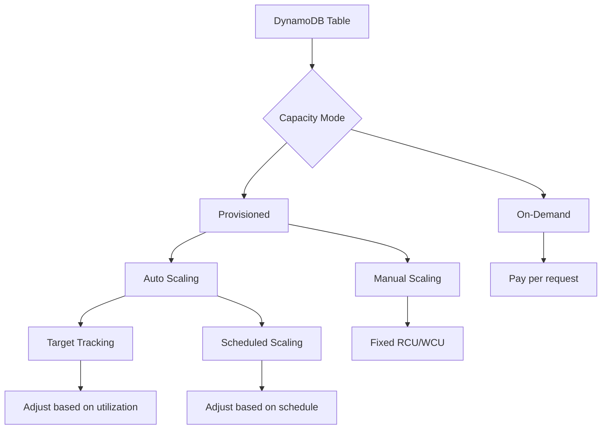
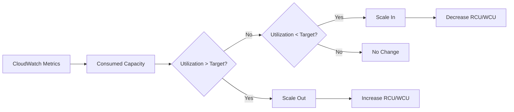
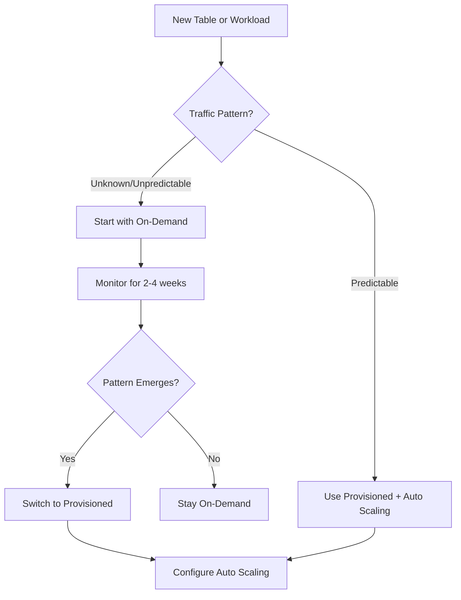
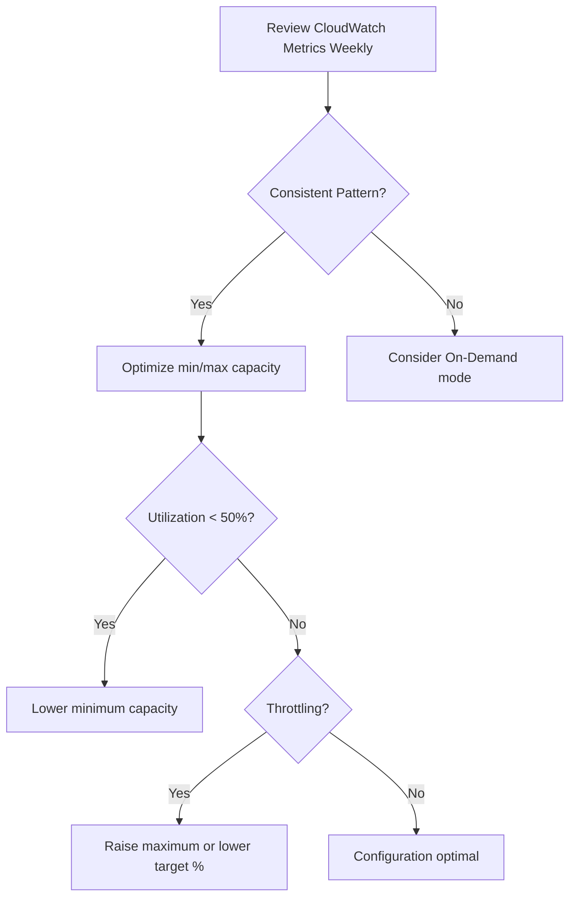

# How to Configure DynamoDB Auto Scaling

Author: [nawazdhandala](https://github.com/nawazdhandala)

Tags: AWS, DynamoDB, Auto Scaling, Database, NoSQL, Performance, Cost Optimization, CloudWatch

Description: A comprehensive guide to configuring DynamoDB auto scaling for optimal performance and cost efficiency. Learn target tracking, scheduled scaling, and best practices for production workloads.

---

> Auto scaling is not about handling peak load - it is about right-sizing capacity continuously so you pay only for what you use while maintaining consistent performance.

DynamoDB auto scaling automatically adjusts provisioned throughput capacity in response to actual traffic patterns. This guide covers everything from basic setup to advanced scaling strategies, helping you optimize both performance and cost.

---

## Table of Contents

1. Understanding DynamoDB Capacity Modes
2. Setting Up Auto Scaling Policies
3. Target Tracking Scaling
4. Scheduled Scaling
5. On-Demand vs Provisioned Capacity
6. Monitoring Scaling Events
7. Best Practices Summary

---

## 1. Understanding DynamoDB Capacity Modes

Before configuring auto scaling, understand the two capacity modes DynamoDB offers:



| Mode | Best For | Billing |
|------|----------|---------|
| On-Demand | Unpredictable workloads, new tables | Per request |
| Provisioned | Predictable workloads, cost optimization | Per hour (RCU/WCU) |
| Provisioned + Auto Scaling | Variable but somewhat predictable traffic | Per hour with dynamic adjustment |

---

## 2. Setting Up Auto Scaling Policies

### Prerequisites

Ensure you have the necessary IAM permissions:

```json
{
  "Version": "2012-10-17",
  "Statement": [
    {
      "Effect": "Allow",
      "Action": [
        "dynamodb:DescribeTable",
        "dynamodb:UpdateTable",
        "application-autoscaling:*",
        "cloudwatch:PutMetricAlarm",
        "cloudwatch:DescribeAlarms",
        "cloudwatch:DeleteAlarms"
      ],
      "Resource": "*"
    }
  ]
}
```

### Using AWS CLI

Register scalable targets for both read and write capacity:

```bash
# Register read capacity as a scalable target
# This tells Application Auto Scaling to manage the table's read capacity
aws application-autoscaling register-scalable-target \
  --service-namespace dynamodb \
  --resource-id "table/MyTable" \
  --scalable-dimension "dynamodb:table:ReadCapacityUnits" \
  --min-capacity 5 \
  --max-capacity 1000

# Register write capacity as a scalable target
# Write capacity often needs different limits than read capacity
aws application-autoscaling register-scalable-target \
  --service-namespace dynamodb \
  --resource-id "table/MyTable" \
  --scalable-dimension "dynamodb:table:WriteCapacityUnits" \
  --min-capacity 5 \
  --max-capacity 500
```

### Using Terraform

```hcl
# terraform/dynamodb-autoscaling.tf

# Define the DynamoDB table with provisioned capacity
resource "aws_dynamodb_table" "orders" {
  name           = "orders"
  billing_mode   = "PROVISIONED"
  read_capacity  = 10   # Initial read capacity units
  write_capacity = 10   # Initial write capacity units
  hash_key       = "order_id"

  attribute {
    name = "order_id"
    type = "S"
  }

  # Tags help identify resources for cost allocation
  tags = {
    Environment = "production"
    Service     = "order-service"
  }
}

# Register the table for read capacity auto scaling
resource "aws_appautoscaling_target" "dynamodb_table_read_target" {
  max_capacity       = 1000  # Maximum RCU during peak
  min_capacity       = 5     # Minimum RCU during low traffic
  resource_id        = "table/${aws_dynamodb_table.orders.name}"
  scalable_dimension = "dynamodb:table:ReadCapacityUnits"
  service_namespace  = "dynamodb"
}

# Register the table for write capacity auto scaling
resource "aws_appautoscaling_target" "dynamodb_table_write_target" {
  max_capacity       = 500
  min_capacity       = 5
  resource_id        = "table/${aws_dynamodb_table.orders.name}"
  scalable_dimension = "dynamodb:table:WriteCapacityUnits"
  service_namespace  = "dynamodb"
}
```

### Using AWS CDK (TypeScript)

```typescript
// cdk/lib/dynamodb-autoscaling-stack.ts
import * as cdk from 'aws-cdk-lib';
import * as dynamodb from 'aws-cdk-lib/aws-dynamodb';
import { Construct } from 'constructs';

export class DynamoDBAutoScalingStack extends cdk.Stack {
  constructor(scope: Construct, id: string, props?: cdk.StackProps) {
    super(scope, id, props);

    // Create DynamoDB table with provisioned capacity
    const ordersTable = new dynamodb.Table(this, 'OrdersTable', {
      tableName: 'orders',
      partitionKey: { name: 'order_id', type: dynamodb.AttributeType.STRING },
      // Use PROVISIONED mode to enable auto scaling
      billingMode: dynamodb.BillingMode.PROVISIONED,
      readCapacity: 10,
      writeCapacity: 10,
      // Enable point-in-time recovery for production tables
      pointInTimeRecovery: true,
    });

    // Configure read capacity auto scaling
    // Target 70% utilization for balanced cost/performance
    const readScaling = ordersTable.autoScaleReadCapacity({
      minCapacity: 5,
      maxCapacity: 1000,
    });

    readScaling.scaleOnUtilization({
      targetUtilizationPercent: 70,
      // Scale out quickly (3 min), scale in slowly (15 min)
      scaleInCooldown: cdk.Duration.minutes(15),
      scaleOutCooldown: cdk.Duration.minutes(3),
    });

    // Configure write capacity auto scaling
    const writeScaling = ordersTable.autoScaleWriteCapacity({
      minCapacity: 5,
      maxCapacity: 500,
    });

    writeScaling.scaleOnUtilization({
      targetUtilizationPercent: 70,
      scaleInCooldown: cdk.Duration.minutes(15),
      scaleOutCooldown: cdk.Duration.minutes(3),
    });
  }
}
```

---

## 3. Target Tracking Scaling

Target tracking is the recommended scaling strategy. It automatically adjusts capacity to maintain a target utilization percentage.



### AWS CLI Configuration

```bash
# Create target tracking policy for read capacity
# Target 70% utilization - this provides headroom for traffic spikes
aws application-autoscaling put-scaling-policy \
  --service-namespace dynamodb \
  --resource-id "table/MyTable" \
  --scalable-dimension "dynamodb:table:ReadCapacityUnits" \
  --policy-name "MyTable-ReadScalingPolicy" \
  --policy-type TargetTrackingScaling \
  --target-tracking-scaling-policy-configuration '{
    "TargetValue": 70.0,
    "PredefinedMetricSpecification": {
      "PredefinedMetricType": "DynamoDBReadCapacityUtilization"
    },
    "ScaleInCooldown": 900,
    "ScaleOutCooldown": 180
  }'

# Create target tracking policy for write capacity
aws application-autoscaling put-scaling-policy \
  --service-namespace dynamodb \
  --resource-id "table/MyTable" \
  --scalable-dimension "dynamodb:table:WriteCapacityUnits" \
  --policy-name "MyTable-WriteScalingPolicy" \
  --policy-type TargetTrackingScaling \
  --target-tracking-scaling-policy-configuration '{
    "TargetValue": 70.0,
    "PredefinedMetricSpecification": {
      "PredefinedMetricType": "DynamoDBWriteCapacityUtilization"
    },
    "ScaleInCooldown": 900,
    "ScaleOutCooldown": 180
  }'
```

### Terraform Configuration

```hcl
# terraform/target-tracking.tf

# Target tracking policy for read capacity
# Maintains 70% utilization target automatically
resource "aws_appautoscaling_policy" "dynamodb_table_read_policy" {
  name               = "DynamoDBReadCapacityUtilization:${aws_appautoscaling_target.dynamodb_table_read_target.resource_id}"
  policy_type        = "TargetTrackingScaling"
  resource_id        = aws_appautoscaling_target.dynamodb_table_read_target.resource_id
  scalable_dimension = aws_appautoscaling_target.dynamodb_table_read_target.scalable_dimension
  service_namespace  = aws_appautoscaling_target.dynamodb_table_read_target.service_namespace

  target_tracking_scaling_policy_configuration {
    # Target 70% utilization - lower values provide more headroom
    # but cost more; higher values save money but risk throttling
    target_value = 70.0

    predefined_metric_specification {
      predefined_metric_type = "DynamoDBReadCapacityUtilization"
    }

    # Scale in slowly to avoid thrashing during traffic fluctuations
    scale_in_cooldown  = 900  # 15 minutes

    # Scale out quickly to handle traffic spikes
    scale_out_cooldown = 180  # 3 minutes
  }
}

# Target tracking policy for write capacity
resource "aws_appautoscaling_policy" "dynamodb_table_write_policy" {
  name               = "DynamoDBWriteCapacityUtilization:${aws_appautoscaling_target.dynamodb_table_write_target.resource_id}"
  policy_type        = "TargetTrackingScaling"
  resource_id        = aws_appautoscaling_target.dynamodb_table_write_target.resource_id
  scalable_dimension = aws_appautoscaling_target.dynamodb_table_write_target.scalable_dimension
  service_namespace  = aws_appautoscaling_target.dynamodb_table_write_target.service_namespace

  target_tracking_scaling_policy_configuration {
    target_value = 70.0

    predefined_metric_specification {
      predefined_metric_type = "DynamoDBWriteCapacityUtilization"
    }

    scale_in_cooldown  = 900
    scale_out_cooldown = 180
  }
}
```

### Understanding Cooldown Periods

| Parameter | Recommended Value | Purpose |
|-----------|-------------------|---------|
| scale_out_cooldown | 180 seconds (3 min) | Fast response to traffic spikes |
| scale_in_cooldown | 900 seconds (15 min) | Prevent thrashing during normal fluctuations |

---

## 4. Scheduled Scaling

Use scheduled scaling for predictable traffic patterns like daily peaks, weekly batch jobs, or seasonal events.

```mermaid
gantt
    title Daily Traffic Pattern with Scheduled Scaling
    dateFormat HH:mm
    axisFormat %H:%M

    section Capacity
    Low (50 RCU)      :done, 00:00, 06:00
    Ramp Up (200 RCU) :active, 06:00, 09:00
    Peak (500 RCU)    :crit, 09:00, 18:00
    Ramp Down         :active, 18:00, 21:00
    Low (50 RCU)      :done, 21:00, 24:00
```



### AWS CLI Scheduled Actions

```bash
# Scale up before morning peak (weekdays at 8 AM UTC)
# This preemptively increases capacity before traffic arrives
aws application-autoscaling put-scheduled-action \
  --service-namespace dynamodb \
  --resource-id "table/MyTable" \
  --scalable-dimension "dynamodb:table:ReadCapacityUnits" \
  --scheduled-action-name "scale-up-morning" \
  --schedule "cron(0 8 ? * MON-FRI *)" \
  --scalable-target-action "MinCapacity=200,MaxCapacity=1000"

# Scale down after evening (weekdays at 8 PM UTC)
# Reduces minimum capacity when traffic is expected to be low
aws application-autoscaling put-scheduled-action \
  --service-namespace dynamodb \
  --resource-id "table/MyTable" \
  --scalable-dimension "dynamodb:table:ReadCapacityUnits" \
  --scheduled-action-name "scale-down-evening" \
  --schedule "cron(0 20 ? * MON-FRI *)" \
  --scalable-target-action "MinCapacity=20,MaxCapacity=500"

# Weekend schedule - lower capacity all day
aws application-autoscaling put-scheduled-action \
  --service-namespace dynamodb \
  --resource-id "table/MyTable" \
  --scalable-dimension "dynamodb:table:ReadCapacityUnits" \
  --scheduled-action-name "weekend-low" \
  --schedule "cron(0 0 ? * SAT-SUN *)" \
  --scalable-target-action "MinCapacity=10,MaxCapacity=200"
```

### Terraform Scheduled Scaling

```hcl
# terraform/scheduled-scaling.tf

# Scale up before business hours
resource "aws_appautoscaling_scheduled_action" "scale_up_morning" {
  name               = "scale-up-morning"
  service_namespace  = aws_appautoscaling_target.dynamodb_table_read_target.service_namespace
  resource_id        = aws_appautoscaling_target.dynamodb_table_read_target.resource_id
  scalable_dimension = aws_appautoscaling_target.dynamodb_table_read_target.scalable_dimension

  # Cron: At 8:00 AM UTC, Monday through Friday
  schedule           = "cron(0 8 ? * MON-FRI *)"

  scalable_target_action {
    min_capacity = 200  # Ensure at least 200 RCU available
    max_capacity = 1000 # Allow scaling up to 1000 RCU
  }
}

# Scale down after business hours
resource "aws_appautoscaling_scheduled_action" "scale_down_evening" {
  name               = "scale-down-evening"
  service_namespace  = aws_appautoscaling_target.dynamodb_table_read_target.service_namespace
  resource_id        = aws_appautoscaling_target.dynamodb_table_read_target.resource_id
  scalable_dimension = aws_appautoscaling_target.dynamodb_table_read_target.scalable_dimension

  # Cron: At 8:00 PM UTC, Monday through Friday
  schedule           = "cron(0 20 ? * MON-FRI *)"

  scalable_target_action {
    min_capacity = 20   # Allow scaling down to 20 RCU
    max_capacity = 500  # Cap maximum at 500 RCU
  }
}

# Special handling for known high-traffic events (e.g., Black Friday)
resource "aws_appautoscaling_scheduled_action" "black_friday_scale_up" {
  name               = "black-friday-scale-up"
  service_namespace  = aws_appautoscaling_target.dynamodb_table_read_target.service_namespace
  resource_id        = aws_appautoscaling_target.dynamodb_table_read_target.resource_id
  scalable_dimension = aws_appautoscaling_target.dynamodb_table_read_target.scalable_dimension

  # One-time schedule for Black Friday 2026
  schedule           = "at(2026-11-27T00:00:00)"

  scalable_target_action {
    min_capacity = 5000  # Ensure high capacity for peak event
    max_capacity = 10000
  }
}
```

---

## 5. On-Demand vs Provisioned Capacity

Choosing the right capacity mode impacts both cost and performance.



### Cost Comparison

```python
# cost_calculator.py
# Simple cost comparison between On-Demand and Provisioned capacity

def calculate_on_demand_cost(
    read_requests_per_month: int,
    write_requests_per_month: int,
    region: str = "us-east-1"
) -> float:
    """
    Calculate monthly cost for On-Demand capacity mode.

    On-Demand pricing (us-east-1):
    - Read: $0.25 per million read request units
    - Write: $1.25 per million write request units
    """
    read_cost_per_million = 0.25
    write_cost_per_million = 1.25

    read_cost = (read_requests_per_month / 1_000_000) * read_cost_per_million
    write_cost = (write_requests_per_month / 1_000_000) * write_cost_per_million

    return read_cost + write_cost


def calculate_provisioned_cost(
    avg_rcu: int,
    avg_wcu: int,
    hours_per_month: int = 730,
    region: str = "us-east-1"
) -> float:
    """
    Calculate monthly cost for Provisioned capacity mode.

    Provisioned pricing (us-east-1):
    - Read: $0.00013 per RCU per hour
    - Write: $0.00065 per WCU per hour
    """
    rcu_cost_per_hour = 0.00013
    wcu_cost_per_hour = 0.00065

    read_cost = avg_rcu * rcu_cost_per_hour * hours_per_month
    write_cost = avg_wcu * wcu_cost_per_hour * hours_per_month

    return read_cost + write_cost


# Example: Compare costs for a typical workload
# Workload: 100M reads/month, 20M writes/month
# Average utilization: 150 RCU, 30 WCU

on_demand = calculate_on_demand_cost(100_000_000, 20_000_000)
provisioned = calculate_provisioned_cost(150, 30)

print(f"On-Demand monthly cost: ${on_demand:.2f}")
print(f"Provisioned monthly cost: ${provisioned:.2f}")
print(f"Savings with Provisioned: ${on_demand - provisioned:.2f} ({((on_demand - provisioned) / on_demand * 100):.1f}%)")

# Output:
# On-Demand monthly cost: $50.00
# Provisioned monthly cost: $28.69
# Savings with Provisioned: $21.31 (42.6%)
```

### Switching Capacity Modes

```bash
# Switch from On-Demand to Provisioned
# Note: This operation may take a few minutes
aws dynamodb update-table \
  --table-name MyTable \
  --billing-mode PROVISIONED \
  --provisioned-throughput ReadCapacityUnits=100,WriteCapacityUnits=50

# Switch from Provisioned to On-Demand
# Useful for handling unexpected traffic spikes
aws dynamodb update-table \
  --table-name MyTable \
  --billing-mode PAY_PER_REQUEST
```

### Terraform Mode Configuration

```hcl
# terraform/capacity-modes.tf

# On-Demand table - best for unpredictable workloads
resource "aws_dynamodb_table" "on_demand_table" {
  name         = "unpredictable-workload"
  billing_mode = "PAY_PER_REQUEST"  # On-Demand mode
  hash_key     = "id"

  attribute {
    name = "id"
    type = "S"
  }
}

# Provisioned table with auto scaling - best for predictable workloads
resource "aws_dynamodb_table" "provisioned_table" {
  name           = "predictable-workload"
  billing_mode   = "PROVISIONED"
  read_capacity  = 100
  write_capacity = 50
  hash_key       = "id"

  attribute {
    name = "id"
    type = "S"
  }

  # Lifecycle rule to prevent Terraform from reverting
  # capacity changes made by auto scaling
  lifecycle {
    ignore_changes = [read_capacity, write_capacity]
  }
}
```

---

## 6. Monitoring Scaling Events

Effective monitoring helps you tune scaling policies and catch issues early.

### CloudWatch Alarms

```hcl
# terraform/monitoring.tf

# Alert when read capacity utilization is too high
# This indicates scaling may not be keeping up with demand
resource "aws_cloudwatch_metric_alarm" "high_read_utilization" {
  alarm_name          = "dynamodb-high-read-utilization"
  comparison_operator = "GreaterThanThreshold"
  evaluation_periods  = 3
  metric_name         = "ConsumedReadCapacityUnits"
  namespace           = "AWS/DynamoDB"
  period              = 300  # 5 minutes
  statistic           = "Sum"
  threshold           = 80   # 80% of provisioned capacity
  alarm_description   = "Read capacity utilization exceeds 80%"

  dimensions = {
    TableName = aws_dynamodb_table.orders.name
  }

  alarm_actions = [aws_sns_topic.alerts.arn]
  ok_actions    = [aws_sns_topic.alerts.arn]
}

# Alert when throttling occurs
# Throttling means requests are being rejected
resource "aws_cloudwatch_metric_alarm" "read_throttle" {
  alarm_name          = "dynamodb-read-throttle"
  comparison_operator = "GreaterThanThreshold"
  evaluation_periods  = 1
  metric_name         = "ReadThrottleEvents"
  namespace           = "AWS/DynamoDB"
  period              = 60   # 1 minute - quick detection
  statistic           = "Sum"
  threshold           = 0    # Alert on any throttling
  alarm_description   = "DynamoDB read requests are being throttled"

  dimensions = {
    TableName = aws_dynamodb_table.orders.name
  }

  alarm_actions = [aws_sns_topic.alerts.arn]
}

# Alert when write throttling occurs
resource "aws_cloudwatch_metric_alarm" "write_throttle" {
  alarm_name          = "dynamodb-write-throttle"
  comparison_operator = "GreaterThanThreshold"
  evaluation_periods  = 1
  metric_name         = "WriteThrottleEvents"
  namespace           = "AWS/DynamoDB"
  period              = 60
  statistic           = "Sum"
  threshold           = 0
  alarm_description   = "DynamoDB write requests are being throttled"

  dimensions = {
    TableName = aws_dynamodb_table.orders.name
  }

  alarm_actions = [aws_sns_topic.alerts.arn]
}

# SNS topic for alerts
resource "aws_sns_topic" "alerts" {
  name = "dynamodb-scaling-alerts"
}
```

### CloudWatch Dashboard

```json
{
  "widgets": [
    {
      "type": "metric",
      "properties": {
        "title": "Read Capacity - Provisioned vs Consumed",
        "metrics": [
          ["AWS/DynamoDB", "ProvisionedReadCapacityUnits", "TableName", "orders"],
          [".", "ConsumedReadCapacityUnits", ".", "."]
        ],
        "period": 60,
        "stat": "Average"
      }
    },
    {
      "type": "metric",
      "properties": {
        "title": "Write Capacity - Provisioned vs Consumed",
        "metrics": [
          ["AWS/DynamoDB", "ProvisionedWriteCapacityUnits", "TableName", "orders"],
          [".", "ConsumedWriteCapacityUnits", ".", "."]
        ],
        "period": 60,
        "stat": "Average"
      }
    },
    {
      "type": "metric",
      "properties": {
        "title": "Throttled Requests",
        "metrics": [
          ["AWS/DynamoDB", "ReadThrottleEvents", "TableName", "orders"],
          [".", "WriteThrottleEvents", ".", "."]
        ],
        "period": 60,
        "stat": "Sum"
      }
    },
    {
      "type": "metric",
      "properties": {
        "title": "Scaling Activities",
        "metrics": [
          ["AWS/ApplicationAutoScaling", "ScalingActivity", "ServiceNamespace", "dynamodb"]
        ],
        "period": 300,
        "stat": "Sum"
      }
    }
  ]
}
```

### Querying Scaling History

```bash
# View recent scaling activities
aws application-autoscaling describe-scaling-activities \
  --service-namespace dynamodb \
  --resource-id "table/MyTable" \
  --max-results 10

# Get current scaling policies
aws application-autoscaling describe-scaling-policies \
  --service-namespace dynamodb \
  --resource-id "table/MyTable"

# Check current capacity
aws dynamodb describe-table \
  --table-name MyTable \
  --query 'Table.{ReadCapacity:ProvisionedThroughput.ReadCapacityUnits,WriteCapacity:ProvisionedThroughput.WriteCapacityUnits}'
```

### Python Monitoring Script

```python
# monitor_scaling.py
"""
Monitor DynamoDB auto scaling events and capacity utilization.
Run periodically to track scaling behavior and identify optimization opportunities.
"""

import boto3
from datetime import datetime, timedelta

def get_scaling_activities(table_name: str, hours: int = 24):
    """Retrieve recent scaling activities for a DynamoDB table."""
    client = boto3.client('application-autoscaling')

    activities = []
    for dimension in ['dynamodb:table:ReadCapacityUnits', 'dynamodb:table:WriteCapacityUnits']:
        response = client.describe_scaling_activities(
            ServiceNamespace='dynamodb',
            ResourceId=f'table/{table_name}',
            ScalableDimension=dimension,
            MaxResults=50
        )
        activities.extend(response.get('ScalingActivities', []))

    # Filter to recent activities
    cutoff = datetime.now(activities[0]['StartTime'].tzinfo) - timedelta(hours=hours)
    recent = [a for a in activities if a['StartTime'] > cutoff]

    return sorted(recent, key=lambda x: x['StartTime'], reverse=True)


def get_capacity_metrics(table_name: str, hours: int = 24):
    """Get capacity utilization metrics from CloudWatch."""
    cloudwatch = boto3.client('cloudwatch')
    end_time = datetime.utcnow()
    start_time = end_time - timedelta(hours=hours)

    metrics = {}
    for metric_name in ['ConsumedReadCapacityUnits', 'ConsumedWriteCapacityUnits',
                        'ProvisionedReadCapacityUnits', 'ProvisionedWriteCapacityUnits']:
        response = cloudwatch.get_metric_statistics(
            Namespace='AWS/DynamoDB',
            MetricName=metric_name,
            Dimensions=[{'Name': 'TableName', 'Value': table_name}],
            StartTime=start_time,
            EndTime=end_time,
            Period=3600,  # 1 hour intervals
            Statistics=['Average', 'Maximum']
        )
        metrics[metric_name] = response['Datapoints']

    return metrics


def analyze_scaling_efficiency(table_name: str):
    """Analyze scaling efficiency and provide recommendations."""
    activities = get_scaling_activities(table_name)
    metrics = get_capacity_metrics(table_name)

    print(f"\n=== Scaling Analysis for {table_name} ===\n")

    # Count scale in/out events
    scale_outs = len([a for a in activities if 'increasing' in a.get('Description', '').lower()])
    scale_ins = len([a for a in activities if 'decreasing' in a.get('Description', '').lower()])

    print(f"Scaling events (last 24h): {len(activities)}")
    print(f"  Scale out events: {scale_outs}")
    print(f"  Scale in events: {scale_ins}")

    # Check for throttling
    dynamodb = boto3.client('dynamodb')
    table_info = dynamodb.describe_table(TableName=table_name)['Table']

    print(f"\nCurrent capacity:")
    print(f"  Read: {table_info['ProvisionedThroughput']['ReadCapacityUnits']} RCU")
    print(f"  Write: {table_info['ProvisionedThroughput']['WriteCapacityUnits']} WCU")

    # Recommendations
    print("\nRecommendations:")
    if scale_outs > 10:
        print("  - Consider increasing minimum capacity to reduce frequent scale-outs")
    if scale_ins > scale_outs * 2:
        print("  - Consider lowering maximum capacity if scale-ins are frequent")
    if len(activities) == 0:
        print("  - No scaling events detected - verify auto scaling is configured")


if __name__ == "__main__":
    analyze_scaling_efficiency("orders")
```

---

## 7. Best Practices Summary

### Capacity Planning

| Practice | Recommendation |
|----------|----------------|
| Initial minimum | Set to average baseline traffic, not zero |
| Maximum capacity | Set 3-5x expected peak to handle unexpected spikes |
| Target utilization | 70% for most workloads; lower for latency-sensitive apps |
| Cooldown periods | Scale out: 3 min, Scale in: 15 min |

### Scaling Strategy

1. **Start with target tracking** - It handles most scenarios automatically
2. **Add scheduled scaling** - For predictable patterns (business hours, batch jobs)
3. **Monitor throttling** - Zero tolerance for throttled requests
4. **Use GSI auto scaling** - Do not forget to scale Global Secondary Indexes

### Cost Optimization



### Common Pitfalls to Avoid

1. **Setting minimum too low** - Causes scaling lag during traffic spikes
2. **Forgetting GSI scaling** - GSIs have separate capacity from base table
3. **Ignoring cooldown periods** - Too short causes thrashing, too long causes throttling
4. **Not monitoring throttle events** - Silent failures impact user experience
5. **Over-provisioning maximum** - Wastes money during runaway scenarios

### Quick Reference: Terraform Module

```hcl
# modules/dynamodb-autoscaling/main.tf

variable "table_name" {
  type = string
}

variable "min_read_capacity" {
  type    = number
  default = 5
}

variable "max_read_capacity" {
  type    = number
  default = 1000
}

variable "min_write_capacity" {
  type    = number
  default = 5
}

variable "max_write_capacity" {
  type    = number
  default = 500
}

variable "target_utilization" {
  type    = number
  default = 70
}

# Read capacity target
resource "aws_appautoscaling_target" "read" {
  max_capacity       = var.max_read_capacity
  min_capacity       = var.min_read_capacity
  resource_id        = "table/${var.table_name}"
  scalable_dimension = "dynamodb:table:ReadCapacityUnits"
  service_namespace  = "dynamodb"
}

# Write capacity target
resource "aws_appautoscaling_target" "write" {
  max_capacity       = var.max_write_capacity
  min_capacity       = var.min_write_capacity
  resource_id        = "table/${var.table_name}"
  scalable_dimension = "dynamodb:table:WriteCapacityUnits"
  service_namespace  = "dynamodb"
}

# Read scaling policy
resource "aws_appautoscaling_policy" "read" {
  name               = "${var.table_name}-read-scaling"
  policy_type        = "TargetTrackingScaling"
  resource_id        = aws_appautoscaling_target.read.resource_id
  scalable_dimension = aws_appautoscaling_target.read.scalable_dimension
  service_namespace  = aws_appautoscaling_target.read.service_namespace

  target_tracking_scaling_policy_configuration {
    target_value       = var.target_utilization
    scale_in_cooldown  = 900
    scale_out_cooldown = 180

    predefined_metric_specification {
      predefined_metric_type = "DynamoDBReadCapacityUtilization"
    }
  }
}

# Write scaling policy
resource "aws_appautoscaling_policy" "write" {
  name               = "${var.table_name}-write-scaling"
  policy_type        = "TargetTrackingScaling"
  resource_id        = aws_appautoscaling_target.write.resource_id
  scalable_dimension = aws_appautoscaling_target.write.scalable_dimension
  service_namespace  = aws_appautoscaling_target.write.service_namespace

  target_tracking_scaling_policy_configuration {
    target_value       = var.target_utilization
    scale_in_cooldown  = 900
    scale_out_cooldown = 180

    predefined_metric_specification {
      predefined_metric_type = "DynamoDBWriteCapacityUtilization"
    }
  }
}
```

---

## Conclusion

DynamoDB auto scaling is essential for production workloads. It balances cost efficiency with performance by automatically adjusting capacity based on actual traffic patterns. Start with target tracking at 70% utilization, add scheduled scaling for predictable patterns, and monitor throttle events to catch issues early.

For comprehensive monitoring of your DynamoDB auto scaling alongside your entire infrastructure, consider [OneUptime](https://oneuptime.com). OneUptime provides unified observability for databases, applications, and infrastructure with alerting, dashboards, and incident management built in.

---

## Related Resources

- [AWS DynamoDB Auto Scaling Documentation](https://docs.aws.amazon.com/amazondynamodb/latest/developerguide/AutoScaling.html)
- [DynamoDB Pricing Calculator](https://calculator.aws/)
- [OneUptime - Infrastructure Monitoring](https://oneuptime.com)
