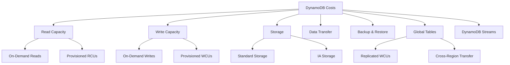
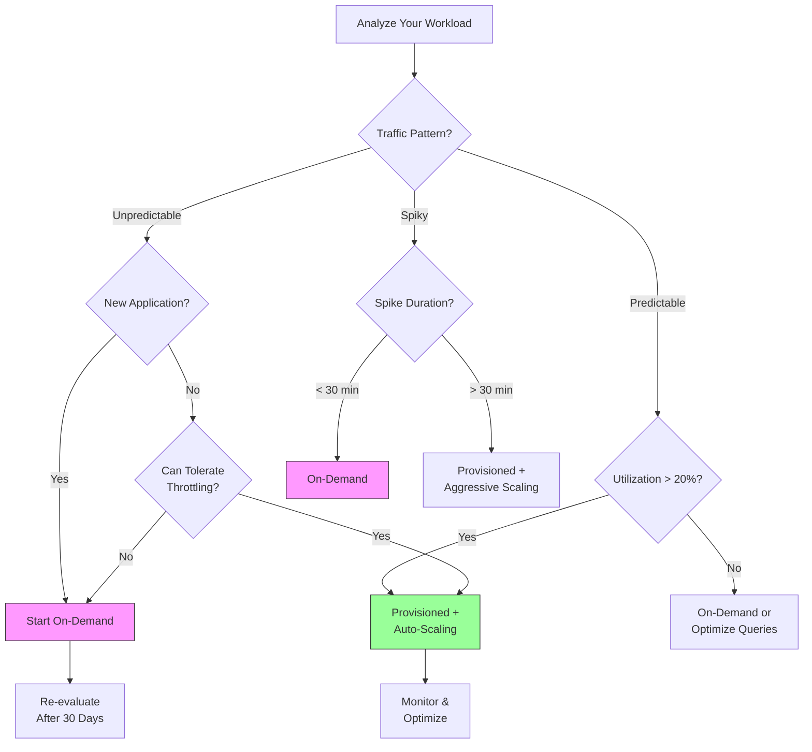
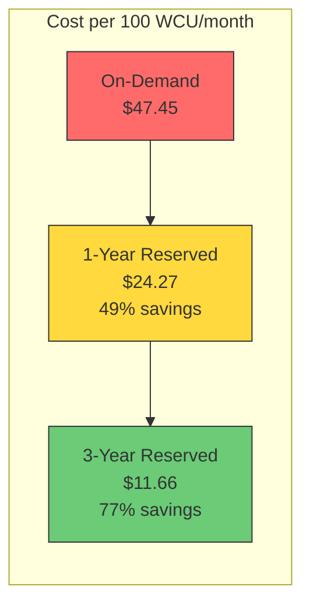
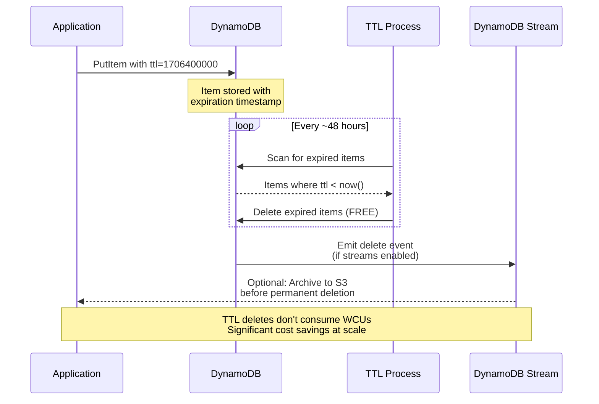
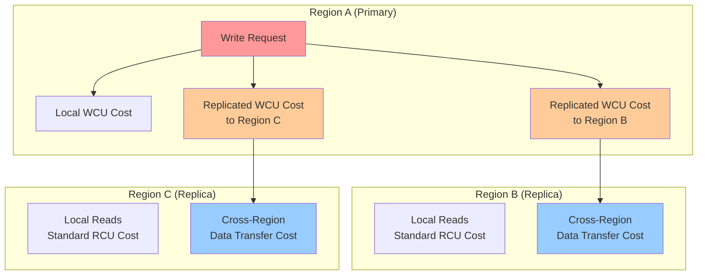
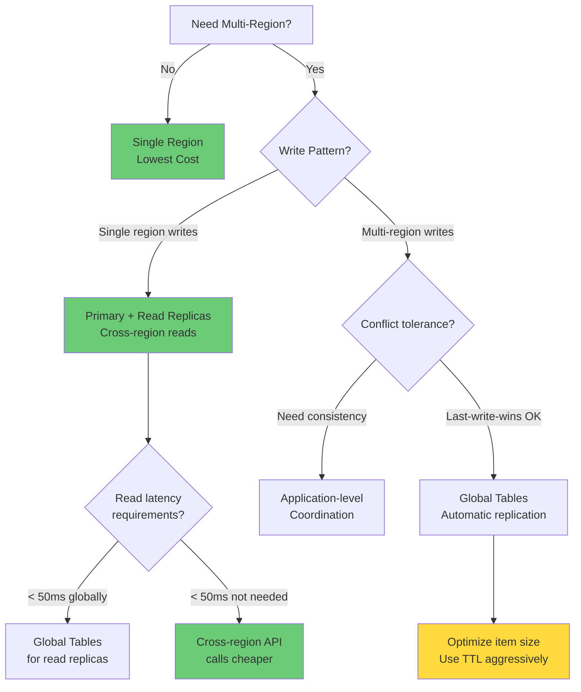

# How to Optimize DynamoDB Costs

Author: [nawazdhandala](https://github.com/nawazdhandala)

Tags: AWS, DynamoDB, Cost Optimization, NoSQL, Cloud Infrastructure, Database

Description: A comprehensive guide to reducing AWS DynamoDB costs through capacity mode selection, reserved capacity planning, efficient data modeling, TTL configuration, and global table optimization strategies.

---

> "The most expensive database query is one that reads data you don't need, stores data you'll never use, or provisions capacity that sits idle." - Every DynamoDB bill ever

DynamoDB is a powerful, fully managed NoSQL database that scales seamlessly, but that scalability comes with a price tag that can spiral out of control if you're not careful. Teams often adopt DynamoDB for its performance guarantees, only to discover months later that their monthly bill has grown far beyond expectations. The good news is that with the right strategies, you can reduce DynamoDB costs by 40-80% without sacrificing performance.

This guide covers practical techniques for optimizing your DynamoDB spending across capacity planning, data modeling, automatic cleanup, and global deployments.

---

## Understanding DynamoDB Pricing Components

Before optimizing, you need to understand what you're paying for. DynamoDB pricing consists of several components that interact in complex ways.



The primary cost drivers are:

- **Read Capacity Units (RCUs)**: 1 RCU = one strongly consistent read per second for items up to 4KB
- **Write Capacity Units (WCUs)**: 1 WCU = one write per second for items up to 1KB
- **Storage**: Charged per GB-month
- **Data Transfer**: Cross-region and internet egress charges
- **Global Tables**: Replicated write capacity for multi-region deployments

---

## Capacity Mode Selection: On-Demand vs Provisioned

The choice between on-demand and provisioned capacity is the single biggest factor in your DynamoDB bill. Making the wrong choice can easily double or triple your costs.

### When to Use On-Demand Mode

On-demand is ideal for unpredictable workloads, new applications, or traffic with extreme spikes.

```python
# AWS SDK (boto3) example: Creating a table with on-demand capacity
# On-demand mode automatically scales to handle any traffic level
# You pay per request rather than for pre-allocated capacity

import boto3

dynamodb = boto3.client('dynamodb')

# Create table with on-demand (PAY_PER_REQUEST) billing mode
# This eliminates capacity planning but costs ~6.5x more per unit
# than well-utilized provisioned capacity
response = dynamodb.create_table(
    TableName='UserSessions',
    KeySchema=[
        {'AttributeName': 'user_id', 'KeyType': 'HASH'},    # Partition key
        {'AttributeName': 'session_id', 'KeyType': 'RANGE'}  # Sort key
    ],
    AttributeDefinitions=[
        {'AttributeName': 'user_id', 'AttributeType': 'S'},
        {'AttributeName': 'session_id', 'AttributeType': 'S'}
    ],
    # PAY_PER_REQUEST = On-demand mode
    # No need to specify ReadCapacityUnits or WriteCapacityUnits
    BillingMode='PAY_PER_REQUEST'
)

print(f"Table status: {response['TableDescription']['TableStatus']}")
```

### When to Use Provisioned Mode

Provisioned capacity with auto-scaling is typically 60-70% cheaper for predictable workloads.

```python
# AWS SDK (boto3) example: Creating a table with provisioned capacity
# Provisioned mode requires you to specify capacity units upfront
# Combined with auto-scaling, this offers the best cost efficiency

import boto3

dynamodb = boto3.client('dynamodb')
application_autoscaling = boto3.client('application-autoscaling')

# Create table with provisioned capacity
# Start with baseline capacity; auto-scaling will adjust as needed
response = dynamodb.create_table(
    TableName='OrderHistory',
    KeySchema=[
        {'AttributeName': 'customer_id', 'KeyType': 'HASH'},
        {'AttributeName': 'order_date', 'KeyType': 'RANGE'}
    ],
    AttributeDefinitions=[
        {'AttributeName': 'customer_id', 'AttributeType': 'S'},
        {'AttributeName': 'order_date', 'AttributeType': 'S'}
    ],
    # PROVISIONED = Provisioned capacity mode
    BillingMode='PROVISIONED',
    # Set baseline capacity - auto-scaling will adjust these values
    # Start conservative; you can always scale up
    ProvisionedThroughput={
        'ReadCapacityUnits': 10,   # Baseline: 10 RCUs
        'WriteCapacityUnits': 5    # Baseline: 5 WCUs
    }
)

# Wait for table to become active before configuring auto-scaling
waiter = dynamodb.get_waiter('table_exists')
waiter.wait(TableName='OrderHistory')

# Register the table as a scalable target for read capacity
# This enables Application Auto Scaling to manage RCUs
application_autoscaling.register_scalable_target(
    ServiceNamespace='dynamodb',
    ResourceId='table/OrderHistory',
    ScalableDimension='dynamodb:table:ReadCapacityUnits',
    MinCapacity=5,      # Never scale below 5 RCUs (cost floor)
    MaxCapacity=1000    # Never scale above 1000 RCUs (cost ceiling)
)

# Configure scaling policy for read capacity
# Target tracking maintains 70% utilization - sweet spot for cost/performance
application_autoscaling.put_scaling_policy(
    PolicyName='OrderHistoryReadScaling',
    ServiceNamespace='dynamodb',
    ResourceId='table/OrderHistory',
    ScalableDimension='dynamodb:table:ReadCapacityUnits',
    PolicyType='TargetTrackingScaling',
    TargetTrackingScalingPolicyConfiguration={
        'TargetValue': 70.0,  # Target 70% utilization
        'PredefinedMetricSpecification': {
            'PredefinedMetricType': 'DynamoDBReadCapacityUtilization'
        },
        # Scale out quickly (2 min) to handle traffic spikes
        'ScaleOutCooldown': 120,
        # Scale in slowly (10 min) to avoid thrashing
        'ScaleInCooldown': 600
    }
)

print("Table created with auto-scaling configured")
```

### Capacity Mode Decision Matrix



---

## Reserved Capacity Planning

For stable, predictable workloads, reserved capacity offers the deepest discounts - up to 77% off on-demand pricing.

### Analyzing Usage for Reserved Capacity

```python
# Script to analyze DynamoDB usage and recommend reserved capacity
# Run this against CloudWatch metrics to identify reservation opportunities

import boto3
from datetime import datetime, timedelta
import statistics

cloudwatch = boto3.client('cloudwatch')

def analyze_table_usage(table_name: str, days: int = 30) -> dict:
    """
    Analyze DynamoDB table usage over the past N days.
    Returns statistics to help decide on reserved capacity purchases.

    Args:
        table_name: Name of the DynamoDB table to analyze
        days: Number of days of historical data to analyze

    Returns:
        Dictionary with usage statistics and recommendations
    """
    end_time = datetime.utcnow()
    start_time = end_time - timedelta(days=days)

    # Fetch consumed read capacity metrics
    # Using 1-hour periods balances granularity with API limits
    read_response = cloudwatch.get_metric_statistics(
        Namespace='AWS/DynamoDB',
        MetricName='ConsumedReadCapacityUnits',
        Dimensions=[{'Name': 'TableName', 'Value': table_name}],
        StartTime=start_time,
        EndTime=end_time,
        Period=3600,  # 1-hour granularity
        Statistics=['Sum', 'Maximum']
    )

    # Fetch consumed write capacity metrics
    write_response = cloudwatch.get_metric_statistics(
        Namespace='AWS/DynamoDB',
        MetricName='ConsumedWriteCapacityUnits',
        Dimensions=[{'Name': 'TableName', 'Value': table_name}],
        StartTime=start_time,
        EndTime=end_time,
        Period=3600,
        Statistics=['Sum', 'Maximum']
    )

    # Calculate hourly averages (Sum / 3600 seconds = average per second)
    read_hourly = [dp['Sum'] / 3600 for dp in read_response['Datapoints']]
    write_hourly = [dp['Sum'] / 3600 for dp in write_response['Datapoints']]

    # Skip analysis if insufficient data
    if not read_hourly or not write_hourly:
        return {'error': 'Insufficient data for analysis'}

    # Calculate key statistics for reservation planning
    analysis = {
        'table_name': table_name,
        'analysis_period_days': days,
        'read_capacity': {
            # Minimum usage = safe baseline for reservations
            'min_rcu': round(min(read_hourly), 2),
            # Average usage = typical steady-state
            'avg_rcu': round(statistics.mean(read_hourly), 2),
            # P50 = median, good for conservative reservations
            'p50_rcu': round(statistics.median(read_hourly), 2),
            # P90 = covers 90% of usage, aggressive reservation target
            'p90_rcu': round(sorted(read_hourly)[int(len(read_hourly) * 0.9)], 2),
            # Maximum = peak usage, don't reserve this much
            'max_rcu': round(max(read_hourly), 2)
        },
        'write_capacity': {
            'min_wcu': round(min(write_hourly), 2),
            'avg_wcu': round(statistics.mean(write_hourly), 2),
            'p50_wcu': round(statistics.median(write_hourly), 2),
            'p90_wcu': round(sorted(write_hourly)[int(len(write_hourly) * 0.9)], 2),
            'max_wcu': round(max(write_hourly), 2)
        }
    }

    # Generate reservation recommendations
    # Reserve at P50 for conservative savings, P90 for aggressive savings
    analysis['recommendations'] = {
        # Conservative: Reserve at median, covers 50% of usage
        'conservative_read_reservation': analysis['read_capacity']['p50_rcu'],
        'conservative_write_reservation': analysis['write_capacity']['p50_wcu'],
        # Aggressive: Reserve at P90, covers 90% of usage
        'aggressive_read_reservation': analysis['read_capacity']['p90_rcu'],
        'aggressive_write_reservation': analysis['write_capacity']['p90_wcu'],
        # Savings estimate (reserved is ~77% cheaper than on-demand)
        'estimated_monthly_savings_conservative': calculate_savings(
            analysis['read_capacity']['avg_rcu'],
            analysis['write_capacity']['avg_wcu'],
            analysis['read_capacity']['p50_rcu'],
            analysis['write_capacity']['p50_wcu']
        )
    }

    return analysis


def calculate_savings(avg_rcu: float, avg_wcu: float,
                      reserved_rcu: float, reserved_wcu: float) -> float:
    """
    Estimate monthly savings from reserved capacity.

    Pricing assumptions (us-east-1):
    - On-demand: $0.25 per RCU-hour, $1.25 per WCU-hour
    - Reserved: $0.06 per RCU-hour, $0.30 per WCU-hour (3-year)
    """
    hours_per_month = 730

    # On-demand cost for average usage
    on_demand_read = avg_rcu * 0.00013 * hours_per_month
    on_demand_write = avg_wcu * 0.00065 * hours_per_month
    on_demand_total = on_demand_read + on_demand_write

    # Reserved cost (portion covered by reservation)
    reserved_read = reserved_rcu * 0.00003 * hours_per_month
    reserved_write = reserved_wcu * 0.00016 * hours_per_month

    # On-demand cost for capacity above reservation
    excess_read = max(0, avg_rcu - reserved_rcu) * 0.00013 * hours_per_month
    excess_write = max(0, avg_wcu - reserved_wcu) * 0.00065 * hours_per_month

    mixed_total = reserved_read + reserved_write + excess_read + excess_write

    return round(on_demand_total - mixed_total, 2)


# Example usage
if __name__ == '__main__':
    analysis = analyze_table_usage('ProductCatalog', days=30)
    print(f"Table: {analysis['table_name']}")
    print(f"Read Capacity - Avg: {analysis['read_capacity']['avg_rcu']} RCU")
    print(f"Recommended Reservation: {analysis['recommendations']['conservative_read_reservation']} RCU")
    print(f"Estimated Monthly Savings: ${analysis['recommendations']['estimated_monthly_savings_conservative']}")
```

### Reserved Capacity Cost Comparison



---

## Efficient Data Modeling for Cost

Poor data modeling is a hidden cost multiplier. Each unnecessary attribute, oversized item, or inefficient access pattern increases your bill.

### Single-Table Design for Cost Efficiency

```python
# Single-table design example for an e-commerce application
# This pattern reduces costs by minimizing table count and enabling
# efficient queries that retrieve related data in a single request

import boto3
from decimal import Decimal
from datetime import datetime
import json

dynamodb = boto3.resource('dynamodb')
table = dynamodb.Table('ECommerceApp')

class ECommerceDataModel:
    """
    Single-table design for e-commerce data.

    Key design principles for cost optimization:
    1. Use composite keys (PK/SK) to store related items together
    2. Minimize item size by avoiding redundant data
    3. Use sparse indexes to reduce index storage costs
    4. Design for your access patterns, not your entities
    """

    @staticmethod
    def create_customer(customer_id: str, email: str, name: str) -> dict:
        """
        Create a customer record.

        PK pattern: CUSTOMER#<id> - enables direct customer lookup
        SK pattern: PROFILE - identifies this as the profile record

        Cost optimization: Store only essential attributes.
        Secondary data can be fetched on-demand.
        """
        item = {
            'PK': f'CUSTOMER#{customer_id}',
            'SK': 'PROFILE',
            'entity_type': 'Customer',          # For filtering by type
            'customer_id': customer_id,
            'email': email,
            'name': name,
            'created_at': datetime.utcnow().isoformat(),
            # GSI1 for email lookups (sparse - only on customer profiles)
            'GSI1PK': f'EMAIL#{email}',
            'GSI1SK': f'CUSTOMER#{customer_id}'
        }

        table.put_item(Item=item)
        return item

    @staticmethod
    def create_order(customer_id: str, order_id: str,
                     items: list, total: float) -> dict:
        """
        Create an order record.

        PK pattern: CUSTOMER#<id> - groups orders with customer
        SK pattern: ORDER#<date>#<id> - enables date-range queries

        Cost optimization: Store order items inline for small orders.
        For large orders (>10 items), store items separately and
        reference them to keep item size under 4KB (1 RCU threshold).
        """
        order_date = datetime.utcnow().strftime('%Y-%m-%d')

        # Calculate item size to determine storage strategy
        # Items under 4KB use 1 RCU for reads; larger items cost more
        estimated_size = len(json.dumps(items))

        if estimated_size < 3000:  # Leave headroom for other attributes
            # Inline storage - single item, efficient for reads
            item = {
                'PK': f'CUSTOMER#{customer_id}',
                'SK': f'ORDER#{order_date}#{order_id}',
                'entity_type': 'Order',
                'order_id': order_id,
                'customer_id': customer_id,
                'order_date': order_date,
                'items': items,  # Stored inline
                'item_count': len(items),
                'total': Decimal(str(total)),
                'status': 'pending',
                # GSI for order status queries (sparse index)
                'GSI1PK': 'ORDER#pending',
                'GSI1SK': f'{order_date}#{order_id}'
            }
            table.put_item(Item=item)
        else:
            # Separate storage - order header + item records
            # Costs more WCUs to write but optimizes read costs
            item = {
                'PK': f'CUSTOMER#{customer_id}',
                'SK': f'ORDER#{order_date}#{order_id}',
                'entity_type': 'Order',
                'order_id': order_id,
                'customer_id': customer_id,
                'order_date': order_date,
                'item_count': len(items),
                'total': Decimal(str(total)),
                'status': 'pending',
                'items_stored_separately': True,  # Flag for retrieval logic
                'GSI1PK': 'ORDER#pending',
                'GSI1SK': f'{order_date}#{order_id}'
            }

            # Batch write order + items (more efficient than individual puts)
            with table.batch_writer() as batch:
                batch.put_item(Item=item)
                for idx, order_item in enumerate(items):
                    batch.put_item(Item={
                        'PK': f'ORDER#{order_id}',
                        'SK': f'ITEM#{idx:04d}',
                        'entity_type': 'OrderItem',
                        **order_item
                    })

        return item

    @staticmethod
    def get_customer_with_orders(customer_id: str, limit: int = 10) -> dict:
        """
        Retrieve customer profile and recent orders in a single query.

        Cost optimization: Single query returns multiple entity types.
        This is much cheaper than separate queries for customer + orders.

        Without single-table design: 2 queries = 2+ RCUs minimum
        With single-table design: 1 query = 1 RCU (if under 4KB total)
        """
        response = table.query(
            KeyConditionExpression='PK = :pk',
            ExpressionAttributeValues={
                ':pk': f'CUSTOMER#{customer_id}'
            },
            # Return newest orders first
            ScanIndexForward=False,
            Limit=limit + 1  # +1 for customer profile
        )

        # Separate customer profile from orders
        customer = None
        orders = []

        for item in response['Items']:
            if item['entity_type'] == 'Customer':
                customer = item
            elif item['entity_type'] == 'Order':
                orders.append(item)

        return {
            'customer': customer,
            'orders': orders,
            # Track consumed capacity for cost monitoring
            'consumed_capacity': response.get('ConsumedCapacity')
        }


# Enable consumed capacity tracking for cost monitoring
# Add this when creating queries to understand actual costs
def query_with_cost_tracking(table, **kwargs):
    """
    Wrapper to track consumed capacity on all queries.
    Essential for identifying expensive access patterns.
    """
    kwargs['ReturnConsumedCapacity'] = 'TOTAL'
    response = table.query(**kwargs)

    consumed = response.get('ConsumedCapacity', {})
    print(f"Query consumed {consumed.get('CapacityUnits', 0)} capacity units")

    return response
```

### Attribute Compression for Large Items

```python
# Compress large attributes to reduce storage and throughput costs
# Each KB of item size consumes additional RCUs/WCUs

import boto3
import gzip
import base64
import json
from typing import Any

dynamodb = boto3.resource('dynamodb')
table = dynamodb.Table('EventLogs')

class CompressedAttribute:
    """
    Utilities for compressing large attributes in DynamoDB items.

    Cost impact:
    - Uncompressed 10KB item = 3 RCUs per read, 10 WCUs per write
    - Compressed to 2KB = 1 RCU per read, 2 WCUs per write
    - Savings: 67% on reads, 80% on writes

    Best for: JSON blobs, log data, audit trails, event payloads
    """

    @staticmethod
    def compress(data: Any) -> str:
        """
        Compress data and encode as base64 string for DynamoDB storage.

        Args:
            data: Any JSON-serializable data structure

        Returns:
            Base64-encoded compressed string
        """
        # Serialize to JSON bytes
        json_bytes = json.dumps(data, separators=(',', ':')).encode('utf-8')

        # Compress using gzip (typically 60-90% reduction for JSON)
        compressed = gzip.compress(json_bytes, compresslevel=9)

        # Encode as base64 for safe storage in DynamoDB string attribute
        encoded = base64.b64encode(compressed).decode('utf-8')

        # Log compression ratio for monitoring
        ratio = len(encoded) / len(json_bytes) * 100
        print(f"Compression ratio: {ratio:.1f}% of original size")

        return encoded

    @staticmethod
    def decompress(encoded: str) -> Any:
        """
        Decompress base64-encoded gzipped data.

        Args:
            encoded: Base64-encoded compressed string from DynamoDB

        Returns:
            Original data structure
        """
        compressed = base64.b64decode(encoded)
        json_bytes = gzip.decompress(compressed)
        return json.loads(json_bytes.decode('utf-8'))


def store_event_log(event_id: str, event_type: str, payload: dict):
    """
    Store an event log with compressed payload.

    Example: An API audit log with request/response bodies.
    Without compression: 15KB item = 15 WCUs
    With compression: 3KB item = 3 WCUs (80% savings)
    """
    # Compress the large payload attribute
    compressed_payload = CompressedAttribute.compress(payload)

    item = {
        'PK': f'EVENT#{event_type}',
        'SK': f'{event_id}',
        'event_id': event_id,
        'event_type': event_type,
        'timestamp': datetime.utcnow().isoformat(),
        # Store compressed payload (marked with _compressed suffix)
        'payload_compressed': compressed_payload,
        # Store payload size for monitoring
        'original_size_bytes': len(json.dumps(payload)),
        'compressed_size_bytes': len(compressed_payload)
    }

    table.put_item(Item=item)
    return item


def retrieve_event_log(event_type: str, event_id: str) -> dict:
    """
    Retrieve and decompress an event log.
    """
    response = table.get_item(
        Key={
            'PK': f'EVENT#{event_type}',
            'SK': event_id
        }
    )

    item = response.get('Item')
    if item and 'payload_compressed' in item:
        # Decompress the payload
        item['payload'] = CompressedAttribute.decompress(item['payload_compressed'])
        del item['payload_compressed']  # Remove compressed version from response

    return item
```

---

## TTL for Automatic Data Cleanup

Time To Live (TTL) is a free feature that automatically deletes expired items, reducing storage costs without consuming write capacity.

```python
# TTL configuration and usage patterns for cost optimization
# TTL deletes are FREE - they don't consume WCUs

import boto3
from datetime import datetime, timedelta
from typing import Optional

dynamodb = boto3.client('dynamodb')
dynamodb_resource = boto3.resource('dynamodb')

def enable_ttl(table_name: str, ttl_attribute: str = 'ttl'):
    """
    Enable TTL on a DynamoDB table.

    TTL Benefits:
    1. Automatic deletion of expired items (no cron jobs needed)
    2. FREE - TTL deletes don't consume write capacity
    3. Reduces storage costs by removing old data
    4. Items deleted within 48 hours of expiration

    Args:
        table_name: Name of the DynamoDB table
        ttl_attribute: Attribute name containing Unix timestamp
    """
    response = dynamodb.update_time_to_live(
        TableName=table_name,
        TimeToLiveSpecification={
            'Enabled': True,
            'AttributeName': ttl_attribute
        }
    )

    print(f"TTL enabled on {table_name} using attribute '{ttl_attribute}'")
    return response


class SessionManager:
    """
    Session management with automatic TTL-based cleanup.

    Cost comparison for 1M sessions/month with 24-hour retention:

    Without TTL (manual cleanup):
    - DeleteItem calls: 1M * 1 WCU = 1M WCUs
    - Cost: ~$1,250/month (on-demand)

    With TTL:
    - TTL deletes: FREE
    - Cost: $0/month

    Savings: $1,250/month = $15,000/year
    """

    def __init__(self, table_name: str):
        self.table = dynamodb_resource.Table(table_name)
        self.default_session_hours = 24

    def create_session(self, user_id: str, session_id: str,
                       session_data: dict,
                       ttl_hours: Optional[int] = None) -> dict:
        """
        Create a user session with automatic expiration.

        The TTL attribute must be a Unix timestamp (seconds since epoch).
        DynamoDB compares this value against current time and deletes
        items within 48 hours after expiration.

        Args:
            user_id: User identifier
            session_id: Unique session ID
            session_data: Session payload
            ttl_hours: Hours until session expires (default: 24)
        """
        hours = ttl_hours or self.default_session_hours
        expiration_time = datetime.utcnow() + timedelta(hours=hours)

        # TTL must be Unix timestamp (integer seconds)
        ttl_timestamp = int(expiration_time.timestamp())

        item = {
            'PK': f'USER#{user_id}',
            'SK': f'SESSION#{session_id}',
            'user_id': user_id,
            'session_id': session_id,
            'session_data': session_data,
            'created_at': datetime.utcnow().isoformat(),
            'expires_at': expiration_time.isoformat(),
            # TTL attribute - DynamoDB will auto-delete after this time
            'ttl': ttl_timestamp
        }

        self.table.put_item(Item=item)
        return item

    def extend_session(self, user_id: str, session_id: str,
                       additional_hours: int = 24) -> dict:
        """
        Extend session expiration time.

        Cost-efficient way to keep sessions alive for active users.
        Only updates the TTL attribute, minimizing WCU consumption.
        """
        new_expiration = datetime.utcnow() + timedelta(hours=additional_hours)
        new_ttl = int(new_expiration.timestamp())

        response = self.table.update_item(
            Key={
                'PK': f'USER#{user_id}',
                'SK': f'SESSION#{session_id}'
            },
            UpdateExpression='SET #ttl = :ttl, expires_at = :expires',
            ExpressionAttributeNames={
                '#ttl': 'ttl'  # 'ttl' is not reserved, but good practice
            },
            ExpressionAttributeValues={
                ':ttl': new_ttl,
                ':expires': new_expiration.isoformat()
            },
            ReturnValues='ALL_NEW'
        )

        return response['Attributes']


class AuditLogManager:
    """
    Audit log management with tiered TTL strategy.

    Different data has different retention requirements.
    Using TTL to enforce retention policies automatically.
    """

    # Retention periods by log severity
    RETENTION_DAYS = {
        'debug': 1,       # Debug logs: 1 day
        'info': 7,        # Info logs: 1 week
        'warning': 30,    # Warnings: 1 month
        'error': 90,      # Errors: 3 months
        'critical': 365,  # Critical: 1 year
        'compliance': None  # Compliance logs: never expire (no TTL)
    }

    def __init__(self, table_name: str):
        self.table = dynamodb_resource.Table(table_name)

    def log_event(self, event_type: str, severity: str,
                  message: str, details: dict) -> dict:
        """
        Create an audit log entry with severity-based TTL.

        Cost optimization: Short-lived logs (debug, info) automatically
        clean up, while important logs (error, critical) are retained.

        Args:
            event_type: Category of event (auth, api, security, etc.)
            severity: Log level (debug, info, warning, error, critical)
            message: Human-readable message
            details: Additional structured data
        """
        timestamp = datetime.utcnow()
        event_id = f"{timestamp.strftime('%Y%m%d%H%M%S')}-{hash(message) % 10000:04d}"

        item = {
            'PK': f'LOG#{event_type}',
            'SK': f'{timestamp.isoformat()}#{event_id}',
            'event_type': event_type,
            'severity': severity,
            'message': message,
            'details': details,
            'timestamp': timestamp.isoformat()
        }

        # Apply TTL based on severity
        retention_days = self.RETENTION_DAYS.get(severity)
        if retention_days is not None:
            expiration = timestamp + timedelta(days=retention_days)
            item['ttl'] = int(expiration.timestamp())
            item['expires_at'] = expiration.isoformat()
        # If retention_days is None (compliance), no TTL is set
        # Item will never be automatically deleted

        self.table.put_item(Item=item)
        return item
```

### TTL Data Flow



---

## Global Table Cost Considerations

Global Tables provide multi-region replication but come with significant cost implications. Understanding these costs is essential for cost-effective global deployments.

### Global Table Cost Structure



### Cost-Optimized Global Table Patterns

```python
# Strategies for minimizing Global Table costs
# Global Tables can be 2-3x more expensive if not optimized

import boto3
from datetime import datetime
from typing import Optional

dynamodb = boto3.resource('dynamodb')

class GlobalTableCostOptimizer:
    """
    Patterns for cost-effective Global Table usage.

    Cost breakdown for Global Tables:
    1. Replicated WCUs: Each write costs WCUs in EVERY region
    2. Cross-region data transfer: $0.02/GB between regions
    3. Storage: Charged in each region independently

    A 3-region Global Table with 100 WCUs effectively costs 300 WCUs!
    """

    def __init__(self, table_name: str):
        self.table = dynamodb.Table(table_name)

    def write_with_region_awareness(self, item: dict,
                                     regions_needed: list[str]) -> dict:
        """
        Pattern 1: Selective replication using attribute-based filtering.

        Not all data needs to exist in all regions. Use DynamoDB Streams
        with Lambda to selectively replicate only necessary items.

        Cost savings: If only 30% of data needs global replication,
        you save 70% on replicated WCUs and storage.

        Args:
            item: The item to write
            regions_needed: List of regions where this item should exist
        """
        # Add metadata for selective replication
        item['_replication_regions'] = regions_needed
        item['_write_region'] = boto3.session.Session().region_name
        item['_write_timestamp'] = datetime.utcnow().isoformat()

        self.table.put_item(Item=item)
        return item

    def write_summary_only(self, entity_id: str,
                           full_data: dict,
                           summary_data: dict) -> tuple[dict, dict]:
        """
        Pattern 2: Replicate summaries, keep details regional.

        Store full data locally, replicate only lightweight summaries.
        Users in other regions see summary; details fetched on-demand.

        Example: Product catalog
        - Summary (replicated): name, price, availability
        - Details (regional): full description, images, reviews

        Cost savings:
        - Full item: 5KB = 5 WCUs * 3 regions = 15 WCUs per write
        - Summary only: 500B = 1 WCU * 3 regions = 3 WCUs per write
        - Savings: 80% reduction in replicated WCUs
        """
        # Write full data to regional table (not global)
        regional_item = {
            'PK': f'DETAIL#{entity_id}',
            'SK': 'FULL',
            **full_data,
            '_global_replicate': False  # Flag for stream processor
        }

        # Write summary to global table
        global_item = {
            'PK': f'ENTITY#{entity_id}',
            'SK': 'SUMMARY',
            **summary_data,
            '_global_replicate': True,
            '_detail_region': boto3.session.Session().region_name
        }

        self.table.put_item(Item=regional_item)
        self.table.put_item(Item=global_item)

        return regional_item, global_item

    def batch_writes_for_efficiency(self, items: list[dict]) -> dict:
        """
        Pattern 3: Batch writes to reduce per-request overhead.

        Global Tables still support BatchWriteItem. Batching reduces
        the number of round trips and can improve throughput efficiency.

        Note: Each item in the batch still incurs replicated WCU costs.
        Batching helps with latency and request overhead, not WCU costs.
        """
        # DynamoDB batch limit is 25 items
        batch_size = 25
        total_items = len(items)
        processed = 0

        with self.table.batch_writer() as batch:
            for item in items:
                # Add write timestamp for conflict resolution
                item['_last_modified'] = datetime.utcnow().isoformat()
                batch.put_item(Item=item)
                processed += 1

        return {
            'processed': processed,
            'batches': (total_items + batch_size - 1) // batch_size
        }


def estimate_global_table_cost(writes_per_second: float,
                                item_size_kb: float,
                                num_regions: int,
                                storage_gb: float) -> dict:
    """
    Estimate monthly cost for a Global Table deployment.

    This helps determine if Global Tables are cost-effective
    for your use case vs. application-level replication.

    Args:
        writes_per_second: Average writes per second
        item_size_kb: Average item size in KB
        num_regions: Number of regions in Global Table
        storage_gb: Total data size in GB

    Returns:
        Cost breakdown by component
    """
    # Pricing assumptions (us-east-1, on-demand)
    wcu_price_per_million = 1.25  # $1.25 per million WCUs
    rcu_price_per_million = 0.25  # $0.25 per million RCUs
    storage_price_per_gb = 0.25   # $0.25 per GB-month
    transfer_price_per_gb = 0.02  # $0.02 per GB cross-region

    hours_per_month = 730
    seconds_per_month = hours_per_month * 3600

    # Calculate WCUs needed (1 WCU = 1KB write)
    wcus_per_write = max(1, int(item_size_kb))

    # Local writes
    local_wcus = writes_per_second * wcus_per_write * seconds_per_month

    # Replicated writes (to each other region)
    replicated_wcus = local_wcus * (num_regions - 1)

    # Total WCU cost
    total_wcus = local_wcus + replicated_wcus
    wcu_cost = (total_wcus / 1_000_000) * wcu_price_per_million * num_regions

    # Storage cost (replicated in each region)
    storage_cost = storage_gb * storage_price_per_gb * num_regions

    # Cross-region data transfer
    writes_per_month = writes_per_second * seconds_per_month
    data_transferred_gb = (writes_per_month * item_size_kb / 1024 / 1024) * (num_regions - 1)
    transfer_cost = data_transferred_gb * transfer_price_per_gb

    total_cost = wcu_cost + storage_cost + transfer_cost

    return {
        'monthly_estimate': {
            'wcu_cost': round(wcu_cost, 2),
            'storage_cost': round(storage_cost, 2),
            'transfer_cost': round(transfer_cost, 2),
            'total': round(total_cost, 2)
        },
        'details': {
            'total_wcus_per_month': int(total_wcus),
            'local_wcus': int(local_wcus),
            'replicated_wcus': int(replicated_wcus),
            'data_transferred_gb': round(data_transferred_gb, 2)
        },
        'optimization_tips': [
            'Consider reducing item size to minimize replicated WCUs',
            'Use TTL to automatically clean up old data in all regions',
            'Evaluate if all regions need write capability (read replicas are cheaper)',
            f'At {num_regions} regions, each write costs {num_regions}x WCUs'
        ]
    }


# Example usage
if __name__ == '__main__':
    estimate = estimate_global_table_cost(
        writes_per_second=100,
        item_size_kb=2,
        num_regions=3,
        storage_gb=500
    )

    print("Global Table Cost Estimate (Monthly)")
    print(f"WCU Cost: ${estimate['monthly_estimate']['wcu_cost']}")
    print(f"Storage Cost: ${estimate['monthly_estimate']['storage_cost']}")
    print(f"Transfer Cost: ${estimate['monthly_estimate']['transfer_cost']}")
    print(f"TOTAL: ${estimate['monthly_estimate']['total']}")
```

### Global vs Regional Decision Matrix



---

## Best Practices Summary

### Capacity Optimization

1. **Start with on-demand** for new tables, switch to provisioned after 30 days of metrics
2. **Set auto-scaling targets** to 70% utilization for the best cost/performance balance
3. **Purchase reserved capacity** for baseline load (use P50 for conservative, P90 for aggressive savings)
4. **Monitor consumed capacity** religiously - unused provisioned capacity is wasted money

### Data Modeling for Cost

5. **Use single-table design** to reduce query count and enable efficient access patterns
6. **Keep items under 4KB** to minimize RCU consumption (1 RCU = 4KB strongly consistent read)
7. **Compress large attributes** - gzip can reduce JSON payloads by 60-90%
8. **Use sparse GSIs** - only project attributes that actually need indexing

### Automatic Cleanup

9. **Enable TTL on all tables** - it's free and reduces storage costs automatically
10. **Implement tiered TTL** based on data importance and compliance requirements
11. **Archive to S3** via DynamoDB Streams before TTL deletion for audit trails

### Global Table Efficiency

12. **Calculate true cost** before enabling Global Tables - writes cost N x WCUs for N regions
13. **Replicate summaries, not details** - keep large items regional
14. **Consider read replicas** instead of Global Tables if writes are centralized

### Monitoring and Governance

15. **Tag tables** for cost allocation and use AWS Cost Explorer DynamoDB lens
16. **Set billing alarms** at 80% of budget to catch runaway costs early
17. **Review unused tables** quarterly - empty tables still incur minimum charges
18. **Use AWS Compute Optimizer** recommendations for provisioned capacity

---

## Conclusion

DynamoDB cost optimization is not a one-time exercise but an ongoing practice. The strategies in this guide can reduce your DynamoDB bill by 40-80% depending on your starting point. Start with the highest-impact changes - capacity mode selection and reserved capacity for stable workloads - then progressively optimize data modeling and implement TTL policies.

Remember that the cheapest database operation is the one you don't need to perform. Design your access patterns carefully, keep items small, and let TTL clean up data you no longer need.

For monitoring your DynamoDB costs alongside application performance, consider using [OneUptime](https://oneuptime.com) for comprehensive observability across your AWS infrastructure.

---

**Related Reading:**

- [Why diversify away from AWS us-east-1](https://oneuptime.com/blog/post/2025-10-21-aws-us-east-1-region-of-last-resort/view)
- [How moving from AWS to Bare-Metal saved us $230,000/yr](https://oneuptime.com/blog/post/2023-10-30-moving-from-aws-to-bare-metal/view)
- [Datadog Dollars: Why Your Monitoring Bill Is Breaking the Bank](https://oneuptime.com/blog/post/2025-02-01-datadog-dollars-why-monitoring-is-breaking-the-bank/view)
