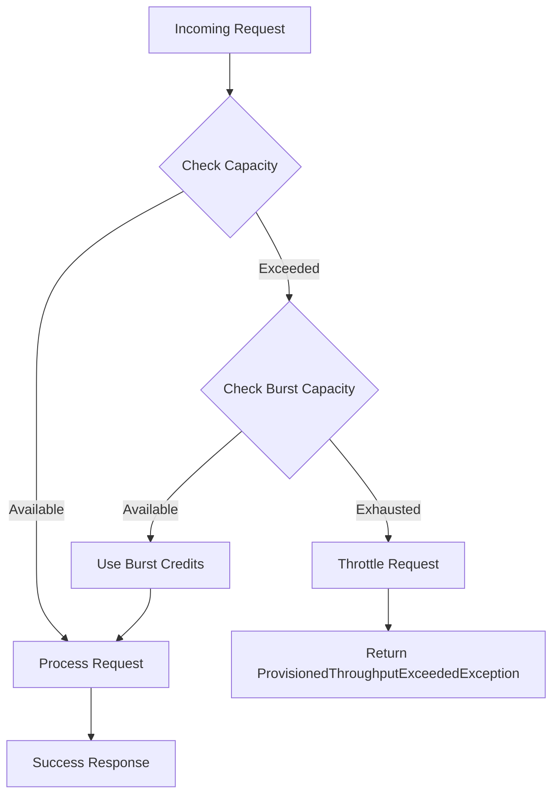
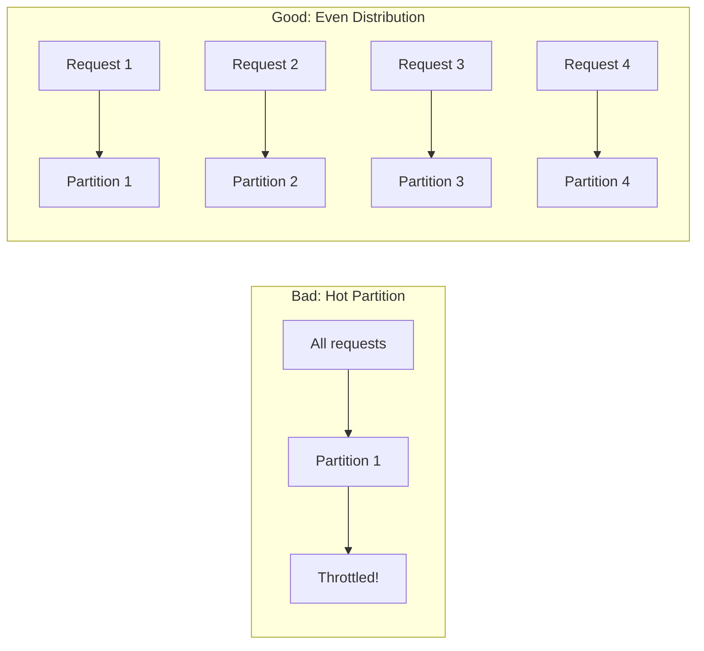
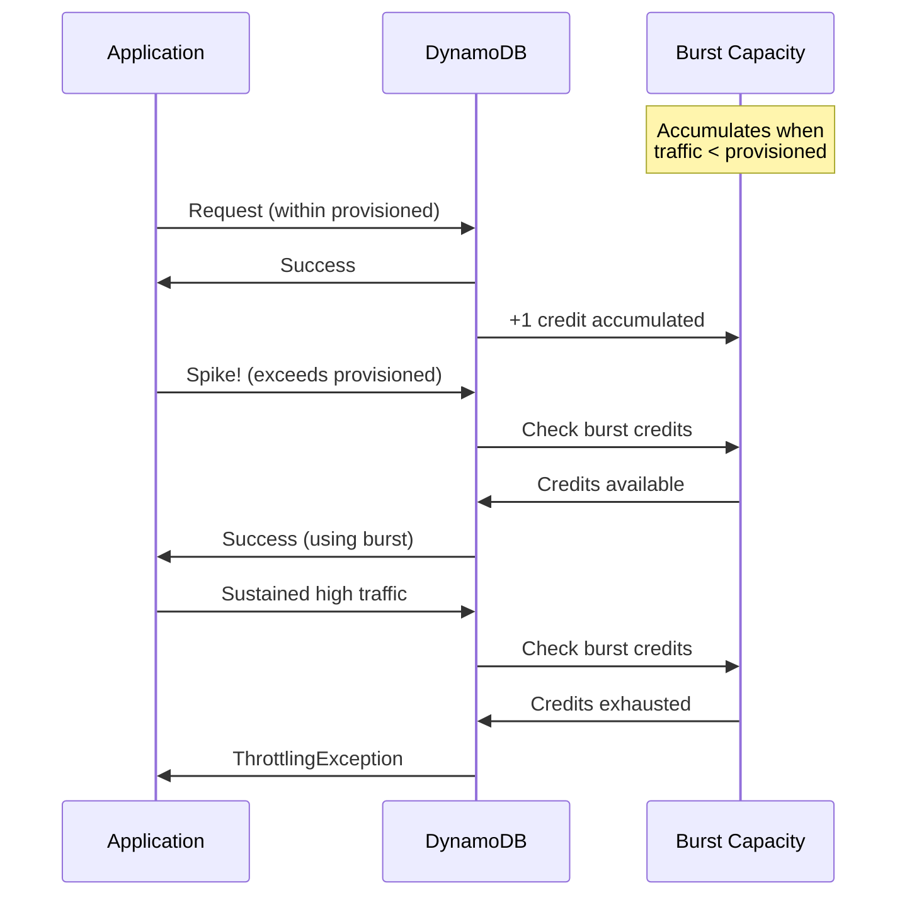

# How to Handle DynamoDB Throttling

Author: [nawazdhandala](https://www.github.com/nawazdhandala)

Tags: AWS, DynamoDB, Throttling, Performance, Scalability, NoSQL, Observability

Description: A comprehensive guide to understanding, preventing, and handling DynamoDB throttling. Learn about partition key design, exponential backoff, burst capacity, and monitoring strategies to keep your applications running smoothly.

---

> "Throttling in DynamoDB is not a failure of the service—it's feedback. Your job is to listen to that feedback and design systems that respond gracefully."

DynamoDB is one of the most powerful managed NoSQL databases available, but its pricing model and architecture mean that throttling is a reality you must plan for. When your application exceeds provisioned capacity or hits partition-level limits, DynamoDB responds with `ProvisionedThroughputExceededException`. How you handle this determines whether your users experience seamless performance or cascading failures.

This guide covers everything from understanding why throttling happens to implementing robust solutions that keep your applications resilient.

---

## Understanding DynamoDB Throttling

Before solving throttling, you need to understand why it occurs. DynamoDB distributes your data across partitions, and each partition has hard limits regardless of your table's total provisioned capacity.

### Key Throttling Causes

1. **Hot Partitions**: Uneven access patterns concentrate requests on specific partitions
2. **Burst Capacity Exhaustion**: Sustained traffic above provisioned capacity depletes burst credits
3. **Partition-Level Limits**: Single partition limit of 3,000 RCU or 1,000 WCU
4. **Sudden Traffic Spikes**: Traffic increases faster than auto-scaling can respond



### Partition Capacity Distribution

DynamoDB allocates capacity evenly across partitions. If you provision 10,000 RCU and have 10 partitions, each partition receives only 1,000 RCU—regardless of actual traffic distribution.

```python
# Understanding partition capacity allocation
# This is conceptual - DynamoDB handles this internally

def calculate_partition_capacity(
    total_provisioned_rcu: int,
    total_provisioned_wcu: int,
    partition_count: int
) -> dict:
    """
    Calculate per-partition capacity limits.

    Each partition receives an equal share of provisioned capacity,
    but is also subject to hard limits:
    - Max 3,000 RCU per partition
    - Max 1,000 WCU per partition
    """
    # Calculate allocated capacity per partition
    allocated_rcu_per_partition = total_provisioned_rcu // partition_count
    allocated_wcu_per_partition = total_provisioned_wcu // partition_count

    # Apply hard partition limits
    effective_rcu_per_partition = min(allocated_rcu_per_partition, 3000)
    effective_wcu_per_partition = min(allocated_wcu_per_partition, 1000)

    return {
        "partitions": partition_count,
        "allocated_rcu_per_partition": allocated_rcu_per_partition,
        "allocated_wcu_per_partition": allocated_wcu_per_partition,
        "effective_rcu_per_partition": effective_rcu_per_partition,
        "effective_wcu_per_partition": effective_wcu_per_partition,
        "potential_rcu_waste": max(0, allocated_rcu_per_partition - 3000) * partition_count,
        "potential_wcu_waste": max(0, allocated_wcu_per_partition - 1000) * partition_count
    }

# Example: 50,000 RCU across 10 partitions
# Each partition gets 5,000 RCU allocated but can only use 3,000
# Result: 20,000 RCU potentially wasted if traffic is uneven
```

---

## Implementing Exponential Backoff

When throttling occurs, retrying immediately makes things worse. Exponential backoff with jitter is the standard approach for handling transient failures gracefully.

### Basic Exponential Backoff

```python
import time
import random
from typing import TypeVar, Callable, Any
from botocore.exceptions import ClientError

T = TypeVar('T')

def exponential_backoff_retry(
    operation: Callable[[], T],
    max_retries: int = 5,
    base_delay: float = 0.1,
    max_delay: float = 30.0,
    jitter: bool = True
) -> T:
    """
    Execute an operation with exponential backoff retry logic.

    Args:
        operation: The callable to execute
        max_retries: Maximum number of retry attempts
        base_delay: Initial delay in seconds (doubles each retry)
        max_delay: Maximum delay cap in seconds
        jitter: Whether to add randomness to prevent thundering herd

    Returns:
        The result of the successful operation

    Raises:
        ClientError: If all retries are exhausted
    """
    last_exception = None

    for attempt in range(max_retries + 1):
        try:
            # Attempt the operation
            return operation()

        except ClientError as e:
            error_code = e.response['Error']['Code']

            # Only retry on throttling errors
            if error_code not in [
                'ProvisionedThroughputExceededException',
                'ThrottlingException',
                'RequestLimitExceeded'
            ]:
                raise

            last_exception = e

            if attempt == max_retries:
                # Exhausted all retries
                raise

            # Calculate delay with exponential backoff
            delay = min(base_delay * (2 ** attempt), max_delay)

            # Add jitter to prevent synchronized retries (thundering herd)
            if jitter:
                # Full jitter: random value between 0 and calculated delay
                delay = random.uniform(0, delay)

            print(f"Throttled on attempt {attempt + 1}. "
                  f"Retrying in {delay:.2f}s...")

            time.sleep(delay)

    # Should never reach here, but satisfy type checker
    raise last_exception


# Usage example with DynamoDB
import boto3

dynamodb = boto3.resource('dynamodb')
table = dynamodb.Table('MyTable')

def get_item_with_retry(key: dict) -> dict:
    """
    Retrieve an item from DynamoDB with automatic retry on throttling.
    """
    def _get_item():
        response = table.get_item(Key=key)
        return response.get('Item')

    return exponential_backoff_retry(_get_item)

# Retrieve an item - automatically handles throttling
item = get_item_with_retry({'pk': 'USER#123', 'sk': 'PROFILE'})
```

### Advanced Retry with Circuit Breaker

For production systems, combine exponential backoff with a circuit breaker to prevent cascading failures.

```python
import time
import random
import threading
from enum import Enum
from typing import TypeVar, Callable, Optional
from dataclasses import dataclass, field
from botocore.exceptions import ClientError

T = TypeVar('T')

class CircuitState(Enum):
    """Circuit breaker states"""
    CLOSED = "closed"      # Normal operation, requests pass through
    OPEN = "open"          # Failing, reject requests immediately
    HALF_OPEN = "half_open"  # Testing if service recovered


@dataclass
class CircuitBreaker:
    """
    Circuit breaker pattern implementation for DynamoDB operations.

    Prevents cascading failures by failing fast when a service
    is experiencing sustained issues.
    """
    failure_threshold: int = 5      # Failures before opening circuit
    recovery_timeout: float = 30.0  # Seconds before attempting recovery
    success_threshold: int = 3      # Successes needed to close circuit

    # Internal state (not constructor parameters)
    _state: CircuitState = field(default=CircuitState.CLOSED, init=False)
    _failure_count: int = field(default=0, init=False)
    _success_count: int = field(default=0, init=False)
    _last_failure_time: Optional[float] = field(default=None, init=False)
    _lock: threading.Lock = field(default_factory=threading.Lock, init=False)

    @property
    def state(self) -> CircuitState:
        """Get current circuit state, checking for recovery timeout."""
        with self._lock:
            if self._state == CircuitState.OPEN:
                # Check if recovery timeout has elapsed
                if (self._last_failure_time and
                    time.time() - self._last_failure_time >= self.recovery_timeout):
                    self._state = CircuitState.HALF_OPEN
                    self._success_count = 0
            return self._state

    def record_success(self) -> None:
        """Record a successful operation."""
        with self._lock:
            if self._state == CircuitState.HALF_OPEN:
                self._success_count += 1
                if self._success_count >= self.success_threshold:
                    # Service recovered, close the circuit
                    self._state = CircuitState.CLOSED
                    self._failure_count = 0
            elif self._state == CircuitState.CLOSED:
                # Reset failure count on success
                self._failure_count = 0

    def record_failure(self) -> None:
        """Record a failed operation."""
        with self._lock:
            self._last_failure_time = time.time()

            if self._state == CircuitState.HALF_OPEN:
                # Failed during recovery test, reopen circuit
                self._state = CircuitState.OPEN
                self._success_count = 0
            elif self._state == CircuitState.CLOSED:
                self._failure_count += 1
                if self._failure_count >= self.failure_threshold:
                    # Too many failures, open the circuit
                    self._state = CircuitState.OPEN

    def can_execute(self) -> bool:
        """Check if an operation can be executed."""
        current_state = self.state  # Property handles timeout check
        return current_state in (CircuitState.CLOSED, CircuitState.HALF_OPEN)


class CircuitOpenError(Exception):
    """Raised when circuit breaker is open and rejecting requests."""
    pass


def resilient_dynamodb_operation(
    operation: Callable[[], T],
    circuit_breaker: CircuitBreaker,
    max_retries: int = 3,
    base_delay: float = 0.1
) -> T:
    """
    Execute a DynamoDB operation with circuit breaker and exponential backoff.

    This combines two resilience patterns:
    1. Circuit breaker - fails fast when service is down
    2. Exponential backoff - handles transient throttling
    """
    # Check circuit breaker first
    if not circuit_breaker.can_execute():
        raise CircuitOpenError(
            f"Circuit breaker is open. Service may be unavailable. "
            f"Will retry after {circuit_breaker.recovery_timeout}s"
        )

    last_exception = None

    for attempt in range(max_retries + 1):
        try:
            result = operation()
            circuit_breaker.record_success()
            return result

        except ClientError as e:
            error_code = e.response['Error']['Code']

            if error_code in [
                'ProvisionedThroughputExceededException',
                'ThrottlingException'
            ]:
                circuit_breaker.record_failure()
                last_exception = e

                if attempt < max_retries:
                    delay = base_delay * (2 ** attempt)
                    delay = random.uniform(0, delay)
                    time.sleep(delay)
                    continue

            # Non-throttling error, don't retry
            raise

    raise last_exception


# Usage example
circuit = CircuitBreaker(
    failure_threshold=5,
    recovery_timeout=30.0,
    success_threshold=3
)

def batch_write_with_resilience(items: list) -> None:
    """
    Write items to DynamoDB with full resilience patterns.
    """
    def _write():
        with table.batch_writer() as batch:
            for item in items:
                batch.put_item(Item=item)

    try:
        resilient_dynamodb_operation(_write, circuit)
    except CircuitOpenError:
        # Fallback: queue items for later processing
        queue_for_retry(items)
```

---

## Partition Key Design to Avoid Hot Partitions

The best way to handle throttling is to prevent it. Good partition key design distributes load evenly across partitions.

### Anti-Patterns and Solutions



```python
import hashlib
from datetime import datetime
from typing import Optional
import uuid

# ANTI-PATTERN: Using date as partition key
# All writes for a day go to the same partition
def bad_partition_key_design() -> dict:
    """
    DON'T DO THIS: Date-based partition keys create hot partitions.
    All writes for today hit the same partition.
    """
    return {
        'pk': datetime.now().strftime('%Y-%m-%d'),  # Hot partition!
        'sk': str(uuid.uuid4()),
        'data': 'some event data'
    }


# PATTERN 1: Write Sharding
# Distribute writes across multiple logical partitions
def write_sharded_partition_key(
    base_key: str,
    shard_count: int = 10
) -> str:
    """
    Distribute a single logical partition across multiple physical partitions.

    Use case: High-velocity writes to a single logical entity (e.g., daily events)

    Args:
        base_key: The logical partition key (e.g., "EVENTS#2026-01-27")
        shard_count: Number of shards to distribute across

    Returns:
        Sharded partition key (e.g., "EVENTS#2026-01-27#SHARD#7")
    """
    # Use random shard for writes
    shard = hash(str(uuid.uuid4())) % shard_count
    return f"{base_key}#SHARD#{shard}"


def read_all_shards(
    table,
    base_key: str,
    shard_count: int = 10
) -> list:
    """
    Read from all shards of a write-sharded partition.

    Note: Requires querying all shards and merging results.
    Trade-off: Better write throughput vs. more complex reads.
    """
    all_items = []

    for shard in range(shard_count):
        sharded_key = f"{base_key}#SHARD#{shard}"
        response = table.query(
            KeyConditionExpression='pk = :pk',
            ExpressionAttributeValues={':pk': sharded_key}
        )
        all_items.extend(response.get('Items', []))

    return all_items


# PATTERN 2: Composite Keys with High Cardinality
# Combine multiple attributes for natural distribution
def composite_partition_key(
    tenant_id: str,
    entity_type: str,
    entity_id: str
) -> str:
    """
    Create a composite partition key with high cardinality.

    Good for multi-tenant applications where each tenant
    has moderate traffic but aggregate traffic is high.
    """
    return f"TENANT#{tenant_id}#{entity_type}#{entity_id}"


# PATTERN 3: Calculated Suffix for Even Distribution
# Add a suffix based on content to spread related items
def calculated_partition_key(
    user_id: str,
    partition_count: int = 10
) -> str:
    """
    Calculate a consistent partition suffix based on user_id.

    Unlike random sharding, this ensures the same user
    always maps to the same partition (important for queries).
    """
    # Use hash for consistent distribution
    hash_value = int(hashlib.md5(user_id.encode()).hexdigest(), 16)
    partition = hash_value % partition_count
    return f"USER#{user_id}#P{partition}"


# PATTERN 4: Time-Based with Scatter
# For time-series data, add entropy to the partition key
def time_series_partition_key(
    sensor_id: str,
    timestamp: datetime,
    scatter_factor: int = 100
) -> dict:
    """
    Design for high-velocity time-series data.

    Combines sensor ID with time bucketing and scatter
    to prevent hot partitions while maintaining query patterns.
    """
    # Bucket time into hours for reasonable partition sizes
    time_bucket = timestamp.strftime('%Y-%m-%d-%H')

    # Add scatter based on minute for sub-hour distribution
    scatter = timestamp.minute % scatter_factor

    return {
        # Partition key combines sensor, time bucket, and scatter
        'pk': f"SENSOR#{sensor_id}#HOUR#{time_bucket}#S{scatter:02d}",
        # Sort key is the precise timestamp for ordering
        'sk': timestamp.isoformat(),
        'sensor_id': sensor_id,
        'timestamp': timestamp.isoformat()
    }


# Example: Querying time-series data
def query_sensor_data(
    table,
    sensor_id: str,
    start_time: datetime,
    end_time: datetime,
    scatter_factor: int = 100
) -> list:
    """
    Query scattered time-series partitions.

    Must query all scatter partitions within the time range.
    Use ParallelScan or parallel queries for performance.
    """
    import concurrent.futures

    all_items = []
    queries = []

    # Generate all partition keys to query
    current = start_time
    while current <= end_time:
        time_bucket = current.strftime('%Y-%m-%d-%H')
        for scatter in range(scatter_factor):
            pk = f"SENSOR#{sensor_id}#HOUR#{time_bucket}#S{scatter:02d}"
            queries.append(pk)
        # Move to next hour
        current = current.replace(minute=0, second=0, microsecond=0)
        current = current + timedelta(hours=1)

    # Execute queries in parallel
    def query_partition(pk: str) -> list:
        response = table.query(
            KeyConditionExpression='pk = :pk',
            ExpressionAttributeValues={':pk': pk}
        )
        return response.get('Items', [])

    with concurrent.futures.ThreadPoolExecutor(max_workers=10) as executor:
        results = executor.map(query_partition, queries)
        for items in results:
            all_items.extend(items)

    # Filter and sort results
    all_items = [
        item for item in all_items
        if start_time.isoformat() <= item['sk'] <= end_time.isoformat()
    ]
    return sorted(all_items, key=lambda x: x['sk'])
```

---

## Leveraging Burst Capacity

DynamoDB provides burst capacity to handle short traffic spikes. Understanding and leveraging this feature helps smooth out transient throttling.



### Burst Capacity Strategy

```python
from dataclasses import dataclass
from datetime import datetime, timedelta
from typing import Optional
import threading


@dataclass
class BurstCapacityTracker:
    """
    Track and predict burst capacity availability.

    DynamoDB accumulates up to 300 seconds of unused capacity
    per partition. This tracker helps predict when burst
    credits are available to handle traffic spikes.

    Note: This is an approximation - DynamoDB's actual tracking
    is internal and not exposed via API.
    """
    provisioned_rcu: int
    provisioned_wcu: int
    max_burst_seconds: int = 300  # 5 minutes of unused capacity

    _consumed_rcu: float = 0.0
    _consumed_wcu: float = 0.0
    _last_update: Optional[datetime] = None
    _lock: threading.Lock = None

    def __post_init__(self):
        self._lock = threading.Lock()
        self._last_update = datetime.now()

    @property
    def max_burst_rcu(self) -> int:
        """Maximum RCU burst capacity available."""
        return self.provisioned_rcu * self.max_burst_seconds

    @property
    def max_burst_wcu(self) -> int:
        """Maximum WCU burst capacity available."""
        return self.provisioned_wcu * self.max_burst_seconds

    def record_consumption(self, rcu: float, wcu: float) -> None:
        """Record capacity consumption."""
        with self._lock:
            now = datetime.now()

            # Accumulate unused capacity since last update
            if self._last_update:
                elapsed = (now - self._last_update).total_seconds()

                # Add accumulated burst (up to max)
                accumulated_rcu = self.provisioned_rcu * elapsed
                accumulated_wcu = self.provisioned_wcu * elapsed

                self._consumed_rcu = max(
                    0,
                    self._consumed_rcu - accumulated_rcu
                )
                self._consumed_wcu = max(
                    0,
                    self._consumed_wcu - accumulated_wcu
                )

            # Record new consumption
            self._consumed_rcu = min(
                self.max_burst_rcu,
                self._consumed_rcu + rcu
            )
            self._consumed_wcu = min(
                self.max_burst_wcu,
                self._consumed_wcu + wcu
            )

            self._last_update = now

    def get_available_burst(self) -> dict:
        """
        Estimate available burst capacity.

        Returns percentage of burst capacity remaining
        for both reads and writes.
        """
        with self._lock:
            # Account for time since last update
            if self._last_update:
                elapsed = (datetime.now() - self._last_update).total_seconds()
                effective_consumed_rcu = max(
                    0,
                    self._consumed_rcu - (self.provisioned_rcu * elapsed)
                )
                effective_consumed_wcu = max(
                    0,
                    self._consumed_wcu - (self.provisioned_wcu * elapsed)
                )
            else:
                effective_consumed_rcu = self._consumed_rcu
                effective_consumed_wcu = self._consumed_wcu

            return {
                "available_burst_rcu": self.max_burst_rcu - effective_consumed_rcu,
                "available_burst_wcu": self.max_burst_wcu - effective_consumed_wcu,
                "burst_rcu_percentage": 100 * (1 - effective_consumed_rcu / self.max_burst_rcu),
                "burst_wcu_percentage": 100 * (1 - effective_consumed_wcu / self.max_burst_wcu)
            }

    def can_handle_spike(
        self,
        expected_rcu: int,
        expected_wcu: int,
        duration_seconds: int
    ) -> dict:
        """
        Predict if a traffic spike can be handled with available burst.

        Args:
            expected_rcu: Expected RCU per second during spike
            expected_wcu: Expected WCU per second during spike
            duration_seconds: Expected duration of the spike

        Returns:
            Analysis of whether burst capacity can handle the spike
        """
        available = self.get_available_burst()

        # Calculate excess capacity needed beyond provisioned
        excess_rcu_per_second = max(0, expected_rcu - self.provisioned_rcu)
        excess_wcu_per_second = max(0, expected_wcu - self.provisioned_wcu)

        total_burst_rcu_needed = excess_rcu_per_second * duration_seconds
        total_burst_wcu_needed = excess_wcu_per_second * duration_seconds

        return {
            "can_handle_read_spike": available["available_burst_rcu"] >= total_burst_rcu_needed,
            "can_handle_write_spike": available["available_burst_wcu"] >= total_burst_wcu_needed,
            "burst_rcu_needed": total_burst_rcu_needed,
            "burst_rcu_available": available["available_burst_rcu"],
            "burst_wcu_needed": total_burst_wcu_needed,
            "burst_wcu_available": available["available_burst_wcu"],
            "recommendation": (
                "Safe to proceed"
                if (available["available_burst_rcu"] >= total_burst_rcu_needed and
                    available["available_burst_wcu"] >= total_burst_wcu_needed)
                else "Consider rate limiting or increasing provisioned capacity"
            )
        }


# Usage example: Pre-spike analysis
tracker = BurstCapacityTracker(
    provisioned_rcu=1000,
    provisioned_wcu=500
)

# Before a marketing campaign, check if we can handle the expected spike
spike_analysis = tracker.can_handle_spike(
    expected_rcu=3000,  # 3x normal traffic
    expected_wcu=1500,  # 3x normal writes
    duration_seconds=60  # 1-minute spike
)

print(f"Can handle spike: {spike_analysis['recommendation']}")
```

---

## Monitoring and Alerting for Throttling

Proactive monitoring prevents throttling from impacting users. Set up CloudWatch alarms and dashboards to catch issues before they escalate.

### CloudWatch Metrics to Monitor

```python
import boto3
from datetime import datetime, timedelta
from typing import List, Dict, Any

cloudwatch = boto3.client('cloudwatch')


def create_throttling_alarms(
    table_name: str,
    sns_topic_arn: str,
    read_throttle_threshold: int = 10,
    write_throttle_threshold: int = 10
) -> List[str]:
    """
    Create CloudWatch alarms for DynamoDB throttling.

    Args:
        table_name: The DynamoDB table to monitor
        sns_topic_arn: SNS topic for alarm notifications
        read_throttle_threshold: Number of throttled reads to trigger alarm
        write_throttle_threshold: Number of throttled writes to trigger alarm

    Returns:
        List of created alarm names
    """
    alarms_created = []

    # Alarm for read throttling
    cloudwatch.put_metric_alarm(
        AlarmName=f'{table_name}-ReadThrottling',
        AlarmDescription=f'Read throttling detected on {table_name}',
        MetricName='ReadThrottledRequests',
        Namespace='AWS/DynamoDB',
        Dimensions=[
            {'Name': 'TableName', 'Value': table_name}
        ],
        Statistic='Sum',
        Period=60,  # 1 minute
        EvaluationPeriods=2,  # 2 consecutive periods
        Threshold=read_throttle_threshold,
        ComparisonOperator='GreaterThanThreshold',
        AlarmActions=[sns_topic_arn],
        OKActions=[sns_topic_arn],
        TreatMissingData='notBreaching'
    )
    alarms_created.append(f'{table_name}-ReadThrottling')

    # Alarm for write throttling
    cloudwatch.put_metric_alarm(
        AlarmName=f'{table_name}-WriteThrottling',
        AlarmDescription=f'Write throttling detected on {table_name}',
        MetricName='WriteThrottledRequests',
        Namespace='AWS/DynamoDB',
        Dimensions=[
            {'Name': 'TableName', 'Value': table_name}
        ],
        Statistic='Sum',
        Period=60,
        EvaluationPeriods=2,
        Threshold=write_throttle_threshold,
        ComparisonOperator='GreaterThanThreshold',
        AlarmActions=[sns_topic_arn],
        OKActions=[sns_topic_arn],
        TreatMissingData='notBreaching'
    )
    alarms_created.append(f'{table_name}-WriteThrottling')

    # Alarm for high consumed capacity (proactive alert)
    # Triggers when consumption exceeds 80% of provisioned
    cloudwatch.put_metric_alarm(
        AlarmName=f'{table_name}-HighReadCapacity',
        AlarmDescription=f'Read capacity consumption high on {table_name}',
        MetricName='ConsumedReadCapacityUnits',
        Namespace='AWS/DynamoDB',
        Dimensions=[
            {'Name': 'TableName', 'Value': table_name}
        ],
        Statistic='Sum',
        Period=300,  # 5 minutes
        EvaluationPeriods=2,
        # This threshold should be 80% of your provisioned capacity * 300 seconds
        Threshold=0,  # Set this based on your provisioned capacity
        ComparisonOperator='GreaterThanThreshold',
        AlarmActions=[sns_topic_arn],
        TreatMissingData='notBreaching'
    )
    alarms_created.append(f'{table_name}-HighReadCapacity')

    return alarms_created


def get_throttling_metrics(
    table_name: str,
    hours: int = 24
) -> Dict[str, Any]:
    """
    Retrieve throttling metrics for analysis.

    Returns detailed throttling data to identify patterns
    and hot partition issues.
    """
    end_time = datetime.utcnow()
    start_time = end_time - timedelta(hours=hours)

    metrics = {}

    # Get read throttling events
    read_response = cloudwatch.get_metric_statistics(
        Namespace='AWS/DynamoDB',
        MetricName='ReadThrottledRequests',
        Dimensions=[
            {'Name': 'TableName', 'Value': table_name}
        ],
        StartTime=start_time,
        EndTime=end_time,
        Period=3600,  # Hourly buckets
        Statistics=['Sum', 'Maximum']
    )
    metrics['read_throttled'] = read_response['Datapoints']

    # Get write throttling events
    write_response = cloudwatch.get_metric_statistics(
        Namespace='AWS/DynamoDB',
        MetricName='WriteThrottledRequests',
        Dimensions=[
            {'Name': 'TableName', 'Value': table_name}
        ],
        StartTime=start_time,
        EndTime=end_time,
        Period=3600,
        Statistics=['Sum', 'Maximum']
    )
    metrics['write_throttled'] = write_response['Datapoints']

    # Get consumed vs provisioned capacity
    consumed_response = cloudwatch.get_metric_statistics(
        Namespace='AWS/DynamoDB',
        MetricName='ConsumedReadCapacityUnits',
        Dimensions=[
            {'Name': 'TableName', 'Value': table_name}
        ],
        StartTime=start_time,
        EndTime=end_time,
        Period=3600,
        Statistics=['Sum', 'Average', 'Maximum']
    )
    metrics['consumed_read'] = consumed_response['Datapoints']

    # Calculate summary statistics
    total_read_throttled = sum(
        dp.get('Sum', 0) for dp in metrics['read_throttled']
    )
    total_write_throttled = sum(
        dp.get('Sum', 0) for dp in metrics['write_throttled']
    )

    metrics['summary'] = {
        'total_read_throttled': total_read_throttled,
        'total_write_throttled': total_write_throttled,
        'analysis_period_hours': hours,
        'has_throttling_issues': total_read_throttled > 0 or total_write_throttled > 0
    }

    return metrics


def identify_hot_partitions(
    table_name: str,
    minutes: int = 60
) -> Dict[str, Any]:
    """
    Use Contributor Insights to identify hot partition keys.

    Requires Contributor Insights to be enabled on the table.
    This is essential for diagnosing throttling caused by
    uneven access patterns.
    """
    end_time = datetime.utcnow()
    start_time = end_time - timedelta(minutes=minutes)

    try:
        # Get top partition keys by throttled requests
        response = cloudwatch.get_insight_rule_report(
            RuleName=f'DynamoDBContributorInsights-PKC-{table_name}',
            StartTime=start_time,
            EndTime=end_time,
            Period=60,
            MaxContributorCount=10
        )

        hot_keys = []
        for contributor in response.get('Contributors', []):
            hot_keys.append({
                'partition_key': contributor['Keys'][0],
                'throttled_count': contributor['ApproximateAggregateValue']
            })

        return {
            'hot_partition_keys': hot_keys,
            'analysis_period_minutes': minutes,
            'recommendation': (
                'Consider redesigning partition key or implementing write sharding'
                if hot_keys else 'No hot partitions detected'
            )
        }

    except cloudwatch.exceptions.ResourceNotFoundException:
        return {
            'error': 'Contributor Insights not enabled for this table',
            'recommendation': 'Enable Contributor Insights to identify hot partitions'
        }


# Example: Set up monitoring for a production table
table_name = 'ProductionTable'
sns_topic = 'arn:aws:sns:us-east-1:123456789:DynamoDBAlerts'

# Create alarms
alarms = create_throttling_alarms(
    table_name=table_name,
    sns_topic_arn=sns_topic,
    read_throttle_threshold=5,  # Alert on 5+ throttled reads
    write_throttle_threshold=5   # Alert on 5+ throttled writes
)

print(f"Created alarms: {alarms}")

# Analyze recent throttling
metrics = get_throttling_metrics(table_name, hours=24)
print(f"Throttling summary: {metrics['summary']}")

# Identify hot partitions
hot_partitions = identify_hot_partitions(table_name, minutes=60)
print(f"Hot partition analysis: {hot_partitions}")
```

### Custom Metrics with OpenTelemetry

For deeper observability, instrument your application to emit custom metrics.

```python
from opentelemetry import metrics
from opentelemetry.sdk.metrics import MeterProvider
from opentelemetry.sdk.metrics.export import PeriodicExportingMetricReader
from opentelemetry.exporter.otlp.proto.grpc.metric_exporter import OTLPMetricExporter
import functools
import time
from typing import Callable, TypeVar

# Initialize OpenTelemetry metrics
exporter = OTLPMetricExporter(
    endpoint="your-otlp-endpoint:4317"  # Replace with your endpoint
)
reader = PeriodicExportingMetricReader(exporter, export_interval_millis=60000)
provider = MeterProvider(metric_readers=[reader])
metrics.set_meter_provider(provider)

meter = metrics.get_meter("dynamodb.client")

# Create metrics
throttle_counter = meter.create_counter(
    name="dynamodb.throttled_requests",
    description="Number of throttled DynamoDB requests",
    unit="1"
)

latency_histogram = meter.create_histogram(
    name="dynamodb.request.duration",
    description="DynamoDB request duration",
    unit="ms"
)

retry_counter = meter.create_counter(
    name="dynamodb.retries",
    description="Number of DynamoDB request retries",
    unit="1"
)

T = TypeVar('T')


def instrumented_dynamodb_operation(
    table_name: str,
    operation: str
) -> Callable[[Callable[[], T]], Callable[[], T]]:
    """
    Decorator to instrument DynamoDB operations with metrics.

    Captures:
    - Request latency
    - Throttling events
    - Retry attempts
    """
    def decorator(func: Callable[[], T]) -> Callable[[], T]:
        @functools.wraps(func)
        def wrapper(*args, **kwargs) -> T:
            start_time = time.time()
            retries = 0
            throttled = False

            try:
                result = func(*args, **kwargs)
                return result

            except Exception as e:
                if 'ProvisionedThroughputExceededException' in str(e):
                    throttled = True
                    throttle_counter.add(
                        1,
                        attributes={
                            "table": table_name,
                            "operation": operation
                        }
                    )
                raise

            finally:
                duration_ms = (time.time() - start_time) * 1000
                latency_histogram.record(
                    duration_ms,
                    attributes={
                        "table": table_name,
                        "operation": operation,
                        "throttled": str(throttled)
                    }
                )

        return wrapper
    return decorator


# Usage example
@instrumented_dynamodb_operation(table_name="Users", operation="GetItem")
def get_user(user_id: str) -> dict:
    """Get user with automatic instrumentation."""
    response = table.get_item(Key={'pk': f'USER#{user_id}'})
    return response.get('Item')

# The metrics will automatically be exported to your observability platform
user = get_user("12345")
```

---

## Best Practices Summary

Effective DynamoDB throttling management requires a multi-layered approach combining good design, resilient code, and proactive monitoring.

### Design Phase

1. **Choose high-cardinality partition keys** - Avoid dates, status codes, or any attribute with limited unique values
2. **Implement write sharding** for high-velocity writes to single logical entities
3. **Calculate partition capacity** before provisioning - remember the 3,000 RCU / 1,000 WCU per partition limit
4. **Use on-demand mode** for unpredictable workloads where you cannot forecast capacity needs

### Implementation Phase

5. **Always implement exponential backoff** with jitter for all DynamoDB operations
6. **Add circuit breakers** to prevent cascading failures during sustained throttling
7. **Use batch operations** to reduce request count and improve throughput efficiency
8. **Implement request rate limiting** at the application layer to stay within capacity

### Operations Phase

9. **Enable Contributor Insights** to identify hot partitions before they cause outages
10. **Set up CloudWatch alarms** for throttling events with appropriate thresholds
11. **Monitor consumed vs. provisioned capacity** to catch capacity drift
12. **Review auto-scaling settings** - ensure target utilization and scale-up cooldowns are appropriate

### Testing Phase

13. **Load test with realistic access patterns** - synthetic even distribution does not reflect production
14. **Test failover and retry logic** by injecting throttling errors
15. **Validate circuit breaker behavior** under sustained failure conditions

---

## Conclusion

DynamoDB throttling is not a bug to be avoided but a feature to be managed. By understanding partition behavior, implementing robust retry mechanisms, designing for even distribution, and monitoring proactively, you can build applications that handle throttling gracefully.

The key insight is that throttling tells you something important about your access patterns. Instead of simply adding more capacity (which often does not help with hot partitions), listen to what your metrics are telling you and address the root cause.

For comprehensive monitoring of your DynamoDB tables and other infrastructure, check out [OneUptime](https://oneuptime.com) - an open-source observability platform that helps you detect and respond to throttling events before they impact your users.

---

**Related Reading:**

- [Why diversify away from AWS us-east-1](https://oneuptime.com/blog/post/2025-10-21-aws-us-east-1-region-of-last-resort/view)
- [The Five Stages of SRE Maturity](https://oneuptime.com/blog/post/2025-09-01-the-five-stages-of-sre-maturity/view)
- [SRE Best Practices](https://oneuptime.com/blog/post/2025-11-28-sre-best-practices/view)
