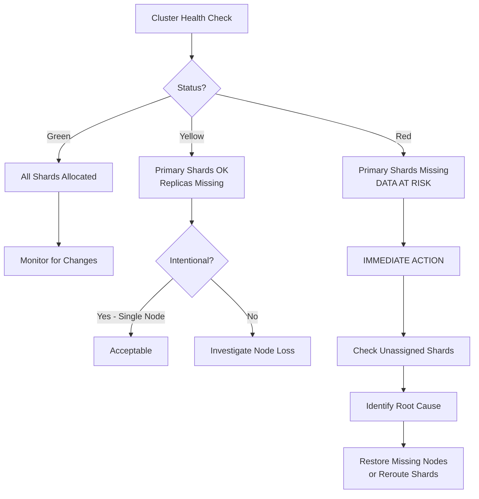
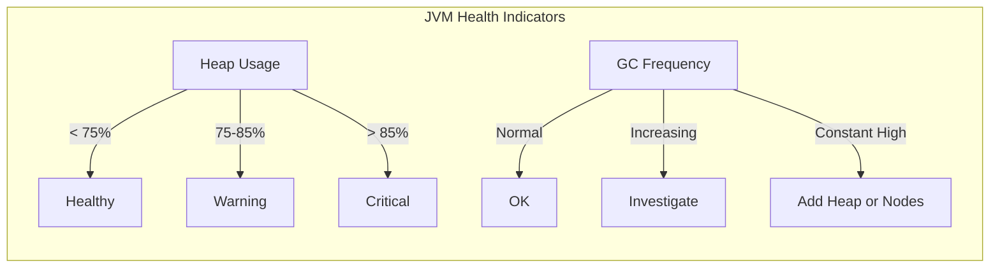
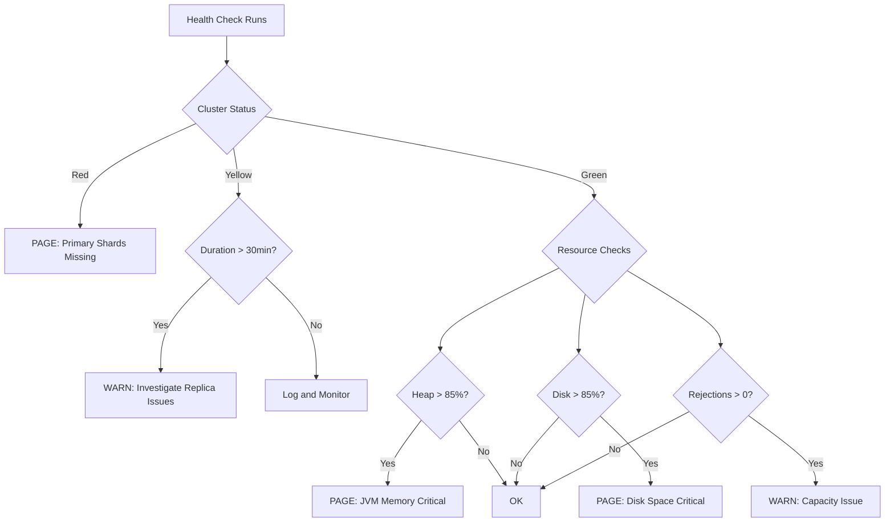

# How to Monitor Elasticsearch Cluster Health

Author: [nawazdhandala](https://github.com/nawazdhandala)

Tags: Elasticsearch, Monitoring, Cluster Health, DevOps, SRE, Observability, Search, Database

Description: A comprehensive guide to monitoring Elasticsearch cluster health, understanding status colors, tracking node statistics, and setting up effective alerting to prevent data loss and downtime.

---

> **Key Insight:** Elasticsearch cluster health is more than just a color indicator. A green status does not mean your cluster is optimized, and a yellow status does not always require immediate action. Understanding the nuances of cluster health helps you make informed decisions about when to act and when to wait.

---

## Why Cluster Health Monitoring Matters

Elasticsearch powers search and analytics for applications ranging from log aggregation to e-commerce product search. When your cluster becomes unhealthy, the consequences can be severe:

- **Data loss** from unallocated primary shards
- **Search degradation** from overloaded nodes
- **Complete unavailability** during split-brain scenarios
- **Slow indexing** when the cluster is under resource pressure

Proactive monitoring transforms reactive firefighting into predictable operations. Let us explore how to monitor effectively.

---

## Understanding the Cluster Health API

The cluster health API is your first stop for assessing cluster status. It provides a quick overview of the overall health and shard allocation state.

```bash
# Basic cluster health check
# Returns: status (green/yellow/red), node count, shard counts
curl -X GET "localhost:9200/_cluster/health?pretty"
```

Example response:

```json
{
  "cluster_name": "production-search",
  "status": "green",
  "timed_out": false,
  "number_of_nodes": 5,
  "number_of_data_nodes": 3,
  "active_primary_shards": 150,
  "active_shards": 300,
  "relocating_shards": 0,
  "initializing_shards": 0,
  "unassigned_shards": 0,
  "delayed_unassigned_shards": 0,
  "number_of_pending_tasks": 0,
  "number_of_in_flight_fetch": 0,
  "task_max_waiting_in_queue_millis": 0,
  "active_shards_percent_as_number": 100.0
}
```

### Adding Wait Conditions

For scripting and automation, you can wait for specific health conditions:

```bash
# Wait for yellow status with 30 second timeout
# Useful in deployment scripts to verify cluster readiness
curl -X GET "localhost:9200/_cluster/health?wait_for_status=yellow&timeout=30s&pretty"

# Wait for no relocating shards (cluster is stable)
# Essential before performing rolling restarts
curl -X GET "localhost:9200/_cluster/health?wait_for_no_relocating_shards=true&timeout=60s&pretty"

# Wait for specific number of nodes
# Validates all expected nodes have joined
curl -X GET "localhost:9200/_cluster/health?wait_for_nodes=>=5&timeout=30s&pretty"
```

---

## Understanding Health Status Colors

The health status is a traffic light system, but the implications vary based on your use case.



### Green Status

All primary and replica shards are allocated. This is the ideal state for production clusters.

```bash
# Verify green status programmatically
# Returns exit code 0 if green, non-zero otherwise
STATUS=$(curl -s localhost:9200/_cluster/health | jq -r '.status')
if [ "$STATUS" = "green" ]; then
    echo "Cluster is healthy"
else
    echo "Cluster status: $STATUS - investigation needed"
    exit 1
fi
```

### Yellow Status

All primary shards are allocated, but some replica shards are not. Common causes:

```bash
# Find which indices have unassigned replicas
# Shows indices contributing to yellow status
curl -X GET "localhost:9200/_cat/indices?v&health=yellow"

# Get detailed explanation for unassigned shards
# Critical for understanding WHY shards cannot be allocated
curl -X GET "localhost:9200/_cluster/allocation/explain?pretty"
```

Example allocation explanation response:

```json
{
  "index": "logs-2026.01.27",
  "shard": 2,
  "primary": false,
  "current_state": "unassigned",
  "unassigned_info": {
    "reason": "NODE_LEFT",
    "at": "2026-01-27T10:30:00.000Z"
  },
  "can_allocate": "no",
  "allocate_explanation": "cannot allocate because allocation is not permitted to any of the nodes",
  "node_allocation_decisions": [
    {
      "node_name": "data-node-1",
      "deciders": [
        {
          "decider": "same_shard",
          "decision": "NO",
          "explanation": "a copy of this shard is already allocated to this node"
        }
      ]
    }
  ]
}
```

### Red Status

One or more primary shards are unassigned. This means **data may be unavailable or lost**.

```bash
# URGENT: Find red indices immediately
# These indices have missing primary shards
curl -X GET "localhost:9200/_cat/indices?v&health=red"

# List all unassigned shards with details
# Shows both primary and replica unassigned shards
curl -X GET "localhost:9200/_cat/shards?v&h=index,shard,prirep,state,unassigned.reason&s=state"

# Force allocation of unassigned primary (DANGEROUS - may cause data loss)
# Only use when you understand the shard contains stale data
curl -X POST "localhost:9200/_cluster/reroute?pretty" -H 'Content-Type: application/json' -d'
{
  "commands": [
    {
      "allocate_stale_primary": {
        "index": "critical-index",
        "shard": 0,
        "node": "data-node-2",
        "accept_data_loss": true
      }
    }
  ]
}'
```

---

## Node Statistics and Monitoring

Individual node health is just as important as cluster-level health. A cluster can be green while individual nodes are struggling.

### Essential Node Stats

```bash
# Comprehensive node statistics
# Returns CPU, memory, disk, JVM, and thread pool metrics
curl -X GET "localhost:9200/_nodes/stats?pretty"

# Focused view: just the essential metrics
# Reduces response size for monitoring scripts
curl -X GET "localhost:9200/_nodes/stats/jvm,os,fs,thread_pool?pretty"

# Human-readable node overview
# Quick visual scan of node health
curl -X GET "localhost:9200/_cat/nodes?v&h=name,heap.percent,ram.percent,cpu,load_1m,disk.used_percent,node.role"
```

Example output:

```
name         heap.percent ram.percent cpu load_1m disk.used_percent node.role
data-node-1            65          82  12    1.24                45 cdfhilmrstw
data-node-2            58          78   8    0.89                43 cdfhilmrstw
data-node-3            71          85  15    1.67                48 cdfhilmrstw
master-1               23          45   2    0.12                12 m
master-2               21          42   1    0.08                11 m
```

### JVM and Memory Monitoring

Elasticsearch runs on the JVM, making heap monitoring critical:

```bash
# JVM heap usage per node
# Watch for nodes consistently above 75% heap
curl -X GET "localhost:9200/_nodes/stats/jvm?pretty" | jq '.nodes | to_entries[] | {
  name: .value.name,
  heap_used_percent: .value.jvm.mem.heap_used_percent,
  heap_used: .value.jvm.mem.heap_used_in_bytes,
  heap_max: .value.jvm.mem.heap_max_in_bytes,
  gc_old_count: .value.jvm.gc.collectors.old.collection_count,
  gc_old_time_ms: .value.jvm.gc.collectors.old.collection_time_in_millis
}'
```



### Thread Pool Monitoring

Thread pool saturation causes request rejections:

```bash
# Monitor thread pool rejections
# Non-zero rejections indicate capacity issues
curl -X GET "localhost:9200/_cat/thread_pool?v&h=node_name,name,active,queue,rejected&s=rejected:desc"

# Detailed thread pool stats
# Shows queue size, completed tasks, and rejections
curl -X GET "localhost:9200/_nodes/stats/thread_pool?pretty" | jq '.nodes | to_entries[] | {
  name: .value.name,
  search_rejected: .value.thread_pool.search.rejected,
  write_rejected: .value.thread_pool.write.rejected,
  bulk_rejected: .value.thread_pool.bulk.rejected
}'
```

---

## Index-Level Health Checks

Monitoring at the index level helps identify problematic indices before they affect the entire cluster.

### Index Health Overview

```bash
# List all indices with health, document count, and size
# Sort by health to see problematic indices first
curl -X GET "localhost:9200/_cat/indices?v&s=health:asc,index"

# Get detailed index stats
# Shows indexing rate, search rate, and segment info
curl -X GET "localhost:9200/my-index/_stats?pretty"

# Check index settings that affect health
# Verify replica count matches your availability requirements
curl -X GET "localhost:9200/my-index/_settings?pretty&include_defaults=true" | jq '.["my-index"].settings.index | {
  number_of_shards: .number_of_shards,
  number_of_replicas: .number_of_replicas,
  refresh_interval: .refresh_interval
}'
```

### Shard Distribution Analysis

Uneven shard distribution causes hot spots:

```bash
# Shard distribution across nodes
# Look for nodes with significantly more shards
curl -X GET "localhost:9200/_cat/allocation?v"

# Detailed shard placement
# Identify which indices are concentrated on specific nodes
curl -X GET "localhost:9200/_cat/shards?v&s=node,index"
```

Example balanced output:

```
shards disk.indices disk.used disk.avail disk.total disk.percent host        node
   100       45.2gb    89.1gb    410.9gb      500gb           17 10.0.0.1   data-node-1
    98       44.8gb    88.5gb    411.5gb      500gb           17 10.0.0.2   data-node-2
   102       46.1gb    90.2gb    409.8gb      500gb           18 10.0.0.3   data-node-3
```

### Segment Health

Too many segments hurt search performance:

```bash
# Check segment count per index
# High segment counts indicate need for force merge
curl -X GET "localhost:9200/_cat/segments?v&h=index,shard,segment,size,docs.count&s=index"

# Index-level segment summary
# Look for indices with many small segments
curl -X GET "localhost:9200/_cat/indices?v&h=index,pri,rep,docs.count,store.size,pri.segments.count&s=pri.segments.count:desc"
```

---

## Alerting on Cluster Issues

Effective alerting requires understanding what truly requires human intervention versus what resolves automatically.

### Critical Alerts (Page Immediately)

```bash
#!/bin/bash
# critical_health_check.sh
# Run every minute - pages on-call if triggered

ES_HOST="localhost:9200"
ALERT_WEBHOOK="https://oneuptime.com/api/webhook/your-webhook-id"

# Check for red status
STATUS=$(curl -s "$ES_HOST/_cluster/health" | jq -r '.status')
if [ "$STATUS" = "red" ]; then
    # Get details about the problem
    RED_INDICES=$(curl -s "$ES_HOST/_cat/indices?health=red&format=json" | jq -r '.[].index')

    curl -X POST "$ALERT_WEBHOOK" \
        -H "Content-Type: application/json" \
        -d "{
            \"alertType\": \"critical\",
            \"service\": \"elasticsearch\",
            \"message\": \"Cluster status RED - Primary shards missing\",
            \"details\": \"Affected indices: $RED_INDICES\"
        }"
fi

# Check for unassigned primary shards specifically
UNASSIGNED_PRIMARIES=$(curl -s "$ES_HOST/_cat/shards?format=json" | \
    jq '[.[] | select(.state == "UNASSIGNED" and .prirep == "p")] | length')

if [ "$UNASSIGNED_PRIMARIES" -gt 0 ]; then
    curl -X POST "$ALERT_WEBHOOK" \
        -H "Content-Type: application/json" \
        -d "{
            \"alertType\": \"critical\",
            \"service\": \"elasticsearch\",
            \"message\": \"$UNASSIGNED_PRIMARIES unassigned primary shards detected\",
            \"details\": \"Data may be unavailable or at risk of loss\"
        }"
fi
```

### Warning Alerts (Investigate Soon)

```bash
#!/bin/bash
# warning_health_check.sh
# Run every 5 minutes - creates tickets, does not page

ES_HOST="localhost:9200"
ALERT_WEBHOOK="https://oneuptime.com/api/webhook/your-webhook-id"

# High heap usage warning
curl -s "$ES_HOST/_nodes/stats/jvm" | jq -r '.nodes | to_entries[] |
    select(.value.jvm.mem.heap_used_percent > 80) |
    "\(.value.name): \(.value.jvm.mem.heap_used_percent)% heap"' | \
while read -r line; do
    if [ -n "$line" ]; then
        curl -X POST "$ALERT_WEBHOOK" \
            -H "Content-Type: application/json" \
            -d "{
                \"alertType\": \"warning\",
                \"service\": \"elasticsearch\",
                \"message\": \"High heap usage detected\",
                \"details\": \"$line\"
            }"
    fi
done

# Disk space warning (>80% used)
curl -s "$ES_HOST/_cat/allocation?format=json" | jq -r '.[] |
    select(.["disk.percent"] != null and (.["disk.percent"] | tonumber) > 80) |
    "\(.node): \(.["disk.percent"])% disk used"' | \
while read -r line; do
    if [ -n "$line" ]; then
        curl -X POST "$ALERT_WEBHOOK" \
            -H "Content-Type: application/json" \
            -d "{
                \"alertType\": \"warning\",
                \"service\": \"elasticsearch\",
                \"message\": \"High disk usage detected\",
                \"details\": \"$line\"
            }"
    fi
done

# Thread pool rejections
TOTAL_REJECTIONS=$(curl -s "$ES_HOST/_nodes/stats/thread_pool" | \
    jq '[.nodes[].thread_pool | .search.rejected, .write.rejected, .bulk.rejected] | add')

if [ "$TOTAL_REJECTIONS" -gt 100 ]; then
    curl -X POST "$ALERT_WEBHOOK" \
        -H "Content-Type: application/json" \
        -d "{
            \"alertType\": \"warning\",
            \"service\": \"elasticsearch\",
            \"message\": \"Thread pool rejections detected\",
            \"details\": \"Total rejections: $TOTAL_REJECTIONS\"
        }"
fi
```

### Alert Decision Flow



---

## Comprehensive Monitoring Script

Here is a complete monitoring script that covers all essential health checks:

```python
#!/usr/bin/env python3
"""
elasticsearch_health_monitor.py

Comprehensive Elasticsearch cluster health monitoring script.
Integrates with OneUptime for alerting and incident management.

Usage:
    python elasticsearch_health_monitor.py --host localhost:9200 --webhook YOUR_WEBHOOK_URL
"""

import argparse
import json
import sys
from datetime import datetime
from typing import Dict, List, Any
from urllib.request import urlopen, Request
from urllib.error import URLError

class ElasticsearchHealthMonitor:
    """
    Monitor Elasticsearch cluster health and report issues.

    Thresholds are configurable but defaults are:
    - Heap warning: 75%, critical: 85%
    - Disk warning: 80%, critical: 90%
    - Unassigned shard timeout: 30 minutes for warnings
    """

    def __init__(self, es_host: str, webhook_url: str = None):
        self.es_host = es_host.rstrip('/')
        self.webhook_url = webhook_url
        self.issues: List[Dict[str, Any]] = []

    def _get(self, endpoint: str) -> Dict:
        """Make GET request to Elasticsearch."""
        url = f"http://{self.es_host}{endpoint}"
        try:
            with urlopen(url, timeout=30) as response:
                return json.loads(response.read().decode())
        except URLError as e:
            self.issues.append({
                'severity': 'critical',
                'component': 'connectivity',
                'message': f'Cannot connect to Elasticsearch: {e}'
            })
            return {}

    def check_cluster_health(self) -> Dict:
        """
        Check overall cluster health status.

        Returns cluster health data and records issues for:
        - Red status (critical)
        - Yellow status lasting > 30 minutes (warning)
        - High pending tasks (warning)
        """
        health = self._get('/_cluster/health')
        if not health:
            return {}

        status = health.get('status', 'unknown')

        if status == 'red':
            self.issues.append({
                'severity': 'critical',
                'component': 'cluster_health',
                'message': 'Cluster status is RED - primary shards missing',
                'details': {
                    'unassigned_shards': health.get('unassigned_shards', 0),
                    'active_shards_percent': health.get('active_shards_percent_as_number', 0)
                }
            })
        elif status == 'yellow':
            # Yellow is only concerning if it persists
            unassigned = health.get('unassigned_shards', 0)
            delayed = health.get('delayed_unassigned_shards', 0)

            if unassigned > 0 and delayed == 0:
                self.issues.append({
                    'severity': 'warning',
                    'component': 'cluster_health',
                    'message': f'Cluster status is YELLOW - {unassigned} replica shards unassigned',
                    'details': health
                })

        # Check pending tasks
        pending = health.get('number_of_pending_tasks', 0)
        if pending > 10:
            self.issues.append({
                'severity': 'warning',
                'component': 'cluster_tasks',
                'message': f'{pending} pending cluster tasks - possible bottleneck',
                'details': {'pending_tasks': pending}
            })

        return health

    def check_node_health(self) -> List[Dict]:
        """
        Check individual node health metrics.

        Monitors:
        - JVM heap usage (warn >75%, critical >85%)
        - Disk usage (warn >80%, critical >90%)
        - GC pressure (old gen collections)
        """
        stats = self._get('/_nodes/stats/jvm,os,fs')
        if not stats:
            return []

        node_issues = []

        for node_id, node_data in stats.get('nodes', {}).items():
            node_name = node_data.get('name', node_id)

            # Check JVM heap
            jvm = node_data.get('jvm', {}).get('mem', {})
            heap_percent = jvm.get('heap_used_percent', 0)

            if heap_percent > 85:
                self.issues.append({
                    'severity': 'critical',
                    'component': 'node_jvm',
                    'message': f'Node {node_name}: Critical heap usage at {heap_percent}%',
                    'details': {'node': node_name, 'heap_percent': heap_percent}
                })
            elif heap_percent > 75:
                self.issues.append({
                    'severity': 'warning',
                    'component': 'node_jvm',
                    'message': f'Node {node_name}: High heap usage at {heap_percent}%',
                    'details': {'node': node_name, 'heap_percent': heap_percent}
                })

            # Check disk usage
            fs = node_data.get('fs', {}).get('total', {})
            total_bytes = fs.get('total_in_bytes', 1)
            free_bytes = fs.get('free_in_bytes', 0)
            disk_percent = int((1 - free_bytes / total_bytes) * 100)

            if disk_percent > 90:
                self.issues.append({
                    'severity': 'critical',
                    'component': 'node_disk',
                    'message': f'Node {node_name}: Critical disk usage at {disk_percent}%',
                    'details': {'node': node_name, 'disk_percent': disk_percent}
                })
            elif disk_percent > 80:
                self.issues.append({
                    'severity': 'warning',
                    'component': 'node_disk',
                    'message': f'Node {node_name}: High disk usage at {disk_percent}%',
                    'details': {'node': node_name, 'disk_percent': disk_percent}
                })

        return node_issues

    def check_thread_pools(self) -> None:
        """
        Check thread pool rejections.

        Rejections indicate the cluster cannot keep up with load.
        Any rejections warrant investigation.
        """
        stats = self._get('/_nodes/stats/thread_pool')
        if not stats:
            return

        for node_id, node_data in stats.get('nodes', {}).items():
            node_name = node_data.get('name', node_id)
            thread_pools = node_data.get('thread_pool', {})

            for pool_name in ['search', 'write', 'bulk', 'get']:
                pool = thread_pools.get(pool_name, {})
                rejected = pool.get('rejected', 0)

                if rejected > 0:
                    self.issues.append({
                        'severity': 'warning',
                        'component': 'thread_pool',
                        'message': f'Node {node_name}: {rejected} rejections in {pool_name} pool',
                        'details': {
                            'node': node_name,
                            'pool': pool_name,
                            'rejected': rejected,
                            'completed': pool.get('completed', 0)
                        }
                    })

    def check_unassigned_shards(self) -> None:
        """
        Detailed check of unassigned shards.

        Gets allocation explanation for each unassigned shard
        to help with troubleshooting.
        """
        shards = self._get('/_cat/shards?format=json')
        if not shards:
            return

        unassigned = [s for s in shards if s.get('state') == 'UNASSIGNED']

        for shard in unassigned[:5]:  # Limit to first 5 to avoid API spam
            is_primary = shard.get('prirep') == 'p'
            index = shard.get('index', 'unknown')
            shard_num = shard.get('shard', '?')

            if is_primary:
                self.issues.append({
                    'severity': 'critical',
                    'component': 'shard_allocation',
                    'message': f'Unassigned PRIMARY shard: {index}[{shard_num}]',
                    'details': shard
                })

    def send_alerts(self) -> None:
        """Send collected issues to OneUptime webhook."""
        if not self.webhook_url or not self.issues:
            return

        # Group issues by severity
        critical = [i for i in self.issues if i['severity'] == 'critical']
        warnings = [i for i in self.issues if i['severity'] == 'warning']

        payload = {
            'timestamp': datetime.utcnow().isoformat(),
            'service': 'elasticsearch',
            'summary': f'{len(critical)} critical, {len(warnings)} warnings',
            'critical_issues': critical,
            'warning_issues': warnings
        }

        try:
            req = Request(
                self.webhook_url,
                data=json.dumps(payload).encode(),
                headers={'Content-Type': 'application/json'}
            )
            with urlopen(req, timeout=10) as response:
                print(f"Alert sent successfully: {response.status}")
        except URLError as e:
            print(f"Failed to send alert: {e}", file=sys.stderr)

    def run_all_checks(self) -> Dict:
        """
        Run all health checks and return summary.

        Returns:
            Dictionary with health summary and all issues found
        """
        print(f"[{datetime.now().isoformat()}] Starting health checks...")

        cluster_health = self.check_cluster_health()
        self.check_node_health()
        self.check_thread_pools()
        self.check_unassigned_shards()

        summary = {
            'timestamp': datetime.utcnow().isoformat(),
            'cluster_status': cluster_health.get('status', 'unknown'),
            'total_issues': len(self.issues),
            'critical_count': len([i for i in self.issues if i['severity'] == 'critical']),
            'warning_count': len([i for i in self.issues if i['severity'] == 'warning']),
            'issues': self.issues
        }

        # Send alerts if webhook configured
        self.send_alerts()

        return summary


def main():
    parser = argparse.ArgumentParser(description='Monitor Elasticsearch cluster health')
    parser.add_argument('--host', default='localhost:9200', help='Elasticsearch host:port')
    parser.add_argument('--webhook', help='OneUptime webhook URL for alerts')
    parser.add_argument('--json', action='store_true', help='Output as JSON')

    args = parser.parse_args()

    monitor = ElasticsearchHealthMonitor(args.host, args.webhook)
    summary = monitor.run_all_checks()

    if args.json:
        print(json.dumps(summary, indent=2))
    else:
        print(f"\nCluster Status: {summary['cluster_status'].upper()}")
        print(f"Issues Found: {summary['total_issues']} ({summary['critical_count']} critical, {summary['warning_count']} warnings)")

        if summary['issues']:
            print("\nIssues:")
            for issue in summary['issues']:
                severity = issue['severity'].upper()
                print(f"  [{severity}] {issue['message']}")

    # Exit with error code if critical issues found
    sys.exit(1 if summary['critical_count'] > 0 else 0)


if __name__ == '__main__':
    main()
```

---

## Best Practices Summary

### Monitoring Essentials

1. **Check cluster health every 30-60 seconds** for critical alerts
2. **Monitor node-level metrics** - a green cluster can have struggling nodes
3. **Track thread pool rejections** as early indicators of capacity issues
4. **Set up tiered alerting** - not everything needs to page

### Capacity Planning

1. **Keep heap usage below 75%** for stable garbage collection
2. **Maintain at least 15% free disk space** per node
3. **Plan for N+1 capacity** - you should survive losing one node
4. **Monitor shard counts** - aim for 20-40 shards per GB of heap

### Operational Hygiene

1. **Use allocation explain API** before escalating shard issues
2. **Document expected yellow states** (e.g., single-node dev clusters)
3. **Automate rolling restart validation** with health wait conditions
4. **Review and tune alerts quarterly** to reduce noise

### Alerting Thresholds

| Metric | Warning | Critical |
|--------|---------|----------|
| Cluster Status | Yellow > 30min | Red |
| Heap Usage | > 75% | > 85% |
| Disk Usage | > 80% | > 90% |
| Thread Pool Rejections | Any | Sustained |
| Unassigned Primaries | - | Any |
| Pending Tasks | > 10 | > 50 |

---

## Integrating with OneUptime

[OneUptime](https://oneuptime.com) provides comprehensive monitoring capabilities that complement Elasticsearch health monitoring:

- **Uptime Monitoring**: Monitor your Elasticsearch HTTP endpoint availability
- **Custom Metrics**: Ingest cluster health metrics via OpenTelemetry
- **Alerting**: Route Elasticsearch alerts through OneUptime's incident management
- **Status Pages**: Communicate Elasticsearch health to stakeholders
- **On-Call Scheduling**: Ensure the right team member responds to cluster issues

To integrate your Elasticsearch monitoring with OneUptime:

1. Create an incoming webhook in OneUptime for Elasticsearch alerts
2. Configure the monitoring scripts to send alerts to the webhook
3. Set up escalation policies for critical vs. warning issues
4. Add Elasticsearch cluster endpoints to uptime monitoring

By centralizing your Elasticsearch monitoring in OneUptime alongside your other infrastructure, you get a unified view of system health and streamlined incident response.

---

## Conclusion

Elasticsearch cluster health monitoring is not just about watching a color change from green to yellow to red. Effective monitoring requires understanding the nuances of shard allocation, tracking resource utilization at the node level, and implementing alerting that distinguishes between issues requiring immediate attention and those that resolve naturally.

Start with the basics - cluster health API and node stats - then build out more sophisticated monitoring as your cluster grows. The investment in proper monitoring pays dividends when you catch issues before they impact users.

**Related Resources:**

- [Elasticsearch Official Documentation - Cluster Health](https://www.elastic.co/guide/en/elasticsearch/reference/current/cluster-health.html)
- [OneUptime Documentation](https://oneuptime.com/docs)
- [OpenTelemetry for Elasticsearch](https://opentelemetry.io/docs/)
