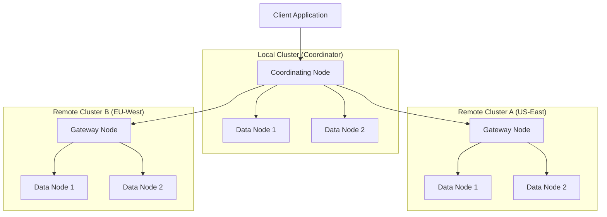
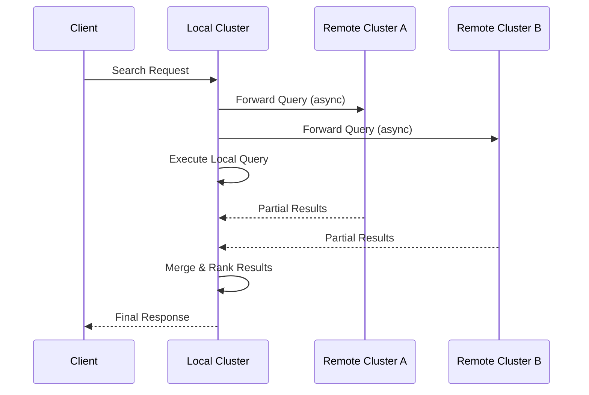
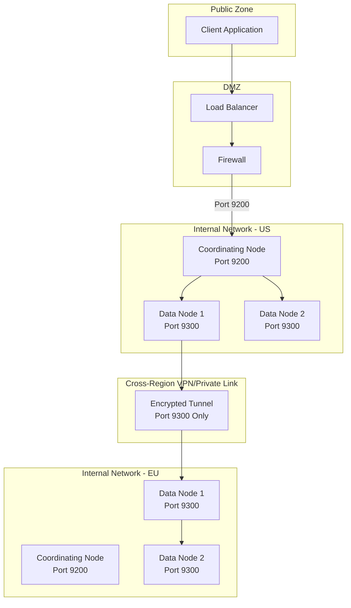
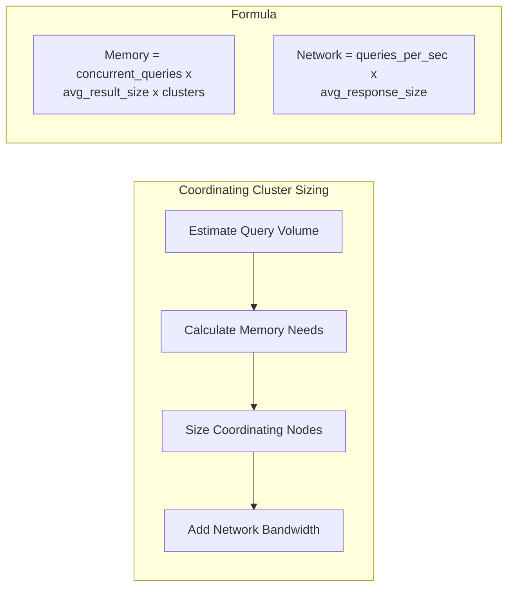
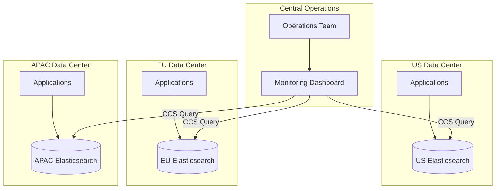

# How to Implement Elasticsearch Cross-Cluster Search

By [Nawaz Dhandala](https://github.com/nawazdhandala)

Tags: Elasticsearch, Cross-Cluster Search, Distributed Systems, Search, Observability, DevOps

Description: A comprehensive guide to implementing Elasticsearch Cross-Cluster Search (CCS) for querying data across multiple clusters. Learn how to configure remote clusters, write cross-cluster queries, handle security, and optimize performance for distributed search workloads.

---

> "The ability to search across multiple clusters as if they were one is what transforms Elasticsearch from a search engine into a globally distributed data platform." - Elastic Engineering Team

Cross-Cluster Search (CCS) is one of Elasticsearch's most powerful features for organizations operating at scale. Whether you're dealing with geographically distributed data, multi-tenant architectures, or compliance requirements that mandate data locality, CCS enables you to query across cluster boundaries seamlessly. This guide walks you through everything from basic configuration to advanced optimization techniques.

---

## Table of Contents

1. Understanding Cross-Cluster Search
2. Architecture Overview
3. Configuring Remote Clusters
4. Writing Cross-Cluster Queries
5. Security Considerations
6. Performance Optimization
7. Monitoring and Troubleshooting
8. Best Practices
9. Real-World Use Cases

---

## 1. Understanding Cross-Cluster Search

Cross-Cluster Search allows you to execute a single search request against indices in multiple Elasticsearch clusters. Instead of maintaining one massive cluster or manually aggregating results from separate queries, CCS handles the distributed nature transparently.

### Key Benefits

| Benefit | Description |
|---------|-------------|
| Data Locality | Keep data in specific regions for compliance (GDPR, data sovereignty) |
| Fault Isolation | Cluster failures are isolated; other clusters remain searchable |
| Scalability | Scale clusters independently based on regional or functional needs |
| Cost Optimization | Use different hardware tiers for hot/warm/cold data across clusters |
| Multi-Tenancy | Isolate tenant data while enabling cross-tenant analytics |

### When to Use CCS

- **Global Applications**: Search across regional clusters (US, EU, APAC)
- **Log Aggregation**: Query logs from multiple environments (production, staging)
- **Multi-Tenant SaaS**: Enable cross-tenant reporting while maintaining isolation
- **Disaster Recovery**: Query backup clusters during failover scenarios
- **Data Migration**: Gradually migrate data while maintaining search continuity

---

## 2. Architecture Overview

Before diving into configuration, it's essential to understand how CCS works at an architectural level.



### How CCS Executes Queries

1. **Query Reception**: The local cluster receives the search request
2. **Query Distribution**: The coordinating node forwards the query to relevant remote clusters
3. **Local Execution**: Each cluster executes the query on its local indices
4. **Result Aggregation**: The coordinating node collects and merges results
5. **Response**: Final results are returned to the client



---

## 3. Configuring Remote Clusters

Remote cluster configuration can be done via the Cluster Settings API or in the `elasticsearch.yml` configuration file.

### Method 1: Using the Cluster Settings API (Recommended)

This is the preferred method as it allows dynamic configuration without cluster restarts.

```bash
# Configure a remote cluster named "cluster_us_east"
# This connects your local cluster to a remote Elasticsearch cluster
# using seed nodes for initial connection discovery
curl -X PUT "localhost:9200/_cluster/settings?pretty" \
  -H 'Content-Type: application/json' \
  -d '{
    "persistent": {
      "cluster": {
        "remote": {
          "cluster_us_east": {
            "seeds": [
              "us-east-node1.example.com:9300",
              "us-east-node2.example.com:9300",
              "us-east-node3.example.com:9300"
            ],
            "transport.compress": true,
            "skip_unavailable": true
          }
        }
      }
    }
  }'
```

```bash
# Add another remote cluster for the EU region
# Multiple remote clusters can be configured for global search
curl -X PUT "localhost:9200/_cluster/settings?pretty" \
  -H 'Content-Type: application/json' \
  -d '{
    "persistent": {
      "cluster": {
        "remote": {
          "cluster_eu_west": {
            "seeds": [
              "eu-west-node1.example.com:9300",
              "eu-west-node2.example.com:9300"
            ],
            "transport.compress": true,
            "skip_unavailable": true
          }
        }
      }
    }
  }'
```

### Method 2: Using elasticsearch.yml

For static configuration at cluster startup:

```yaml
# elasticsearch.yml - Remote cluster configuration
# Note: Requires cluster restart to apply changes

cluster.remote:
  # US East remote cluster configuration
  cluster_us_east:
    seeds:
      - us-east-node1.example.com:9300
      - us-east-node2.example.com:9300
      - us-east-node3.example.com:9300
    transport.compress: true
    skip_unavailable: true

  # EU West remote cluster configuration
  cluster_eu_west:
    seeds:
      - eu-west-node1.example.com:9300
      - eu-west-node2.example.com:9300
    transport.compress: true
    skip_unavailable: true
```

### Configuration Options Explained

| Option | Description | Default |
|--------|-------------|---------|
| `seeds` | Initial nodes for cluster discovery (transport port 9300) | Required |
| `skip_unavailable` | If `true`, skip cluster if unavailable; if `false`, fail entire query | `false` |
| `transport.compress` | Enable compression for cross-cluster communication | `false` |
| `transport.ping_schedule` | How often to send keepalive pings | `30s` |
| `mode` | Connection mode: `sniff` or `proxy` | `sniff` |

### Proxy Mode Configuration

For clusters behind load balancers or in restricted network environments:

```bash
# Proxy mode: Route all traffic through a single address
# Useful when direct node access is not possible
curl -X PUT "localhost:9200/_cluster/settings?pretty" \
  -H 'Content-Type: application/json' \
  -d '{
    "persistent": {
      "cluster": {
        "remote": {
          "cluster_us_east": {
            "mode": "proxy",
            "proxy_address": "us-east-proxy.example.com:9400",
            "proxy_socket_connections": 18,
            "server_name": "us-east.elasticsearch.example.com"
          }
        }
      }
    }
  }'
```

### Verifying Remote Cluster Configuration

```bash
# Check all configured remote clusters and their connection status
curl -X GET "localhost:9200/_remote/info?pretty"
```

Expected response:

```json
{
  "cluster_us_east": {
    "connected": true,
    "mode": "sniff",
    "seeds": ["us-east-node1.example.com:9300"],
    "num_nodes_connected": 3,
    "max_connections_per_cluster": 3,
    "initial_connect_timeout": "30s",
    "skip_unavailable": true
  },
  "cluster_eu_west": {
    "connected": true,
    "mode": "sniff",
    "seeds": ["eu-west-node1.example.com:9300"],
    "num_nodes_connected": 2,
    "max_connections_per_cluster": 3,
    "initial_connect_timeout": "30s",
    "skip_unavailable": true
  }
}
```

---

## 4. Writing Cross-Cluster Queries

Cross-cluster queries use a special index notation: `<cluster_name>:<index_pattern>`.

### Basic Cross-Cluster Search

```bash
# Search a single remote cluster
# Syntax: <remote_cluster_name>:<index_name>
curl -X GET "localhost:9200/cluster_us_east:logs-*/_search?pretty" \
  -H 'Content-Type: application/json' \
  -d '{
    "query": {
      "match": {
        "message": "error"
      }
    }
  }'
```

### Multi-Cluster Search

```bash
# Search across multiple clusters simultaneously
# Comma-separate indices from different clusters
curl -X GET "localhost:9200/cluster_us_east:logs-*,cluster_eu_west:logs-*,logs-*/_search?pretty" \
  -H 'Content-Type: application/json' \
  -d '{
    "size": 100,
    "query": {
      "bool": {
        "must": [
          {
            "range": {
              "@timestamp": {
                "gte": "now-1h",
                "lte": "now"
              }
            }
          },
          {
            "match": {
              "level": "ERROR"
            }
          }
        ]
      }
    },
    "sort": [
      { "@timestamp": { "order": "desc" } }
    ]
  }'
```

### Wildcard Cluster Names

```bash
# Search all clusters matching a pattern
# Useful when cluster names follow a convention
curl -X GET "localhost:9200/cluster_*:logs-*/_search?pretty" \
  -H 'Content-Type: application/json' \
  -d '{
    "query": {
      "match_all": {}
    }
  }'
```

### Aggregations Across Clusters

```bash
# Aggregations work seamlessly across clusters
# Results are merged by the coordinating node
curl -X GET "localhost:9200/cluster_us_east:logs-*,cluster_eu_west:logs-*/_search?pretty" \
  -H 'Content-Type: application/json' \
  -d '{
    "size": 0,
    "query": {
      "range": {
        "@timestamp": {
          "gte": "now-24h"
        }
      }
    },
    "aggs": {
      "errors_by_cluster": {
        "terms": {
          "field": "_index",
          "size": 20
        }
      },
      "errors_over_time": {
        "date_histogram": {
          "field": "@timestamp",
          "calendar_interval": "hour"
        }
      },
      "error_types": {
        "terms": {
          "field": "error.type.keyword",
          "size": 10
        }
      }
    }
  }'
```

### Using Cross-Cluster Search in Application Code

```javascript
// Node.js example using the official Elasticsearch client
// Demonstrates programmatic cross-cluster search

const { Client } = require('@elastic/elasticsearch');

// Initialize client pointing to local cluster
const client = new Client({
  node: 'https://localhost:9200',
  auth: {
    username: 'elastic',
    password: process.env.ELASTIC_PASSWORD
  }
});

async function searchAcrossClusters(query, timeRange = '1h') {
  try {
    // Define indices from multiple clusters
    // Local cluster indices don't need a prefix
    const indices = [
      'cluster_us_east:logs-*',    // Remote: US East
      'cluster_eu_west:logs-*',    // Remote: EU West
      'logs-*'                      // Local cluster
    ].join(',');

    const response = await client.search({
      index: indices,
      body: {
        size: 100,
        query: {
          bool: {
            must: [
              { match: { message: query } },
              { range: { '@timestamp': { gte: `now-${timeRange}` } } }
            ]
          }
        },
        sort: [{ '@timestamp': 'desc' }],
        // Include cluster information in response
        _source: ['@timestamp', 'message', 'level', 'service']
      },
      // CCS-specific options
      ccs_minimize_roundtrips: true,  // Optimize network calls
      allow_partial_search_results: true  // Return results even if some clusters fail
    });

    // Process results, noting which cluster each hit came from
    return response.hits.hits.map(hit => ({
      cluster: hit._index.includes(':')
        ? hit._index.split(':')[0]
        : 'local',
      index: hit._index.includes(':')
        ? hit._index.split(':')[1]
        : hit._index,
      source: hit._source
    }));
  } catch (error) {
    console.error('Cross-cluster search failed:', error);
    throw error;
  }
}

// Usage example
searchAcrossClusters('connection timeout', '6h')
  .then(results => {
    console.log(`Found ${results.length} matching documents`);
    results.forEach(r => {
      console.log(`[${r.cluster}] ${r.source['@timestamp']}: ${r.source.message}`);
    });
  });
```

```python
# Python example using elasticsearch-py
# Demonstrates cross-cluster search with error handling

from elasticsearch import Elasticsearch
from datetime import datetime, timedelta
import os

# Initialize client
es = Elasticsearch(
    ['https://localhost:9200'],
    basic_auth=('elastic', os.environ.get('ELASTIC_PASSWORD')),
    verify_certs=True
)

def cross_cluster_search(
    query_text: str,
    clusters: list = ['cluster_us_east', 'cluster_eu_west'],
    index_pattern: str = 'logs-*',
    hours_back: int = 24
) -> dict:
    """
    Execute a search across multiple Elasticsearch clusters.

    Args:
        query_text: The search query string
        clusters: List of remote cluster names to search
        index_pattern: Index pattern to search in each cluster
        hours_back: How far back to search

    Returns:
        Dictionary containing hits and aggregations
    """
    # Build the index string with cluster prefixes
    # Include local cluster (no prefix) and remote clusters
    indices = [f"{cluster}:{index_pattern}" for cluster in clusters]
    indices.append(index_pattern)  # Add local cluster
    index_string = ','.join(indices)

    # Execute the search
    response = es.search(
        index=index_string,
        body={
            "size": 200,
            "query": {
                "bool": {
                    "must": [
                        {"query_string": {"query": query_text}},
                        {
                            "range": {
                                "@timestamp": {
                                    "gte": f"now-{hours_back}h",
                                    "lte": "now"
                                }
                            }
                        }
                    ]
                }
            },
            "aggs": {
                "by_cluster": {
                    "terms": {"field": "_index", "size": 50}
                },
                "by_level": {
                    "terms": {"field": "level.keyword", "size": 10}
                }
            },
            "sort": [{"@timestamp": {"order": "desc"}}],
            "highlight": {
                "fields": {"message": {}}
            }
        },
        # CCS optimization flags
        ccs_minimize_roundtrips=True,
        allow_partial_search_results=True,
        request_timeout=30
    )

    return {
        'total': response['hits']['total']['value'],
        'hits': response['hits']['hits'],
        'aggregations': response.get('aggregations', {})
    }

# Example usage
if __name__ == '__main__':
    results = cross_cluster_search(
        query_text='error AND (timeout OR connection)',
        hours_back=6
    )
    print(f"Found {results['total']} documents across all clusters")
```

---

## 5. Security Considerations

Security is critical when connecting clusters, especially across network boundaries.

### TLS Configuration

```yaml
# elasticsearch.yml - TLS settings for cross-cluster communication
# All inter-cluster traffic should be encrypted

# Enable TLS on the transport layer (required for CCS)
xpack.security.transport.ssl.enabled: true
xpack.security.transport.ssl.verification_mode: certificate

# Certificate configuration
xpack.security.transport.ssl.keystore.path: certs/elastic-certificates.p12
xpack.security.transport.ssl.truststore.path: certs/elastic-certificates.p12

# For cross-cluster search, both clusters must trust each other's certificates
# Option 1: Use the same CA for all clusters (recommended)
# Option 2: Import each cluster's CA into the truststore

# Remote cluster specific TLS (if using different certs per cluster)
cluster.remote.cluster_us_east.transport.ssl.enabled: true
cluster.remote.cluster_us_east.transport.ssl.verification_mode: certificate
```

### API Key Authentication

```bash
# Create a cross-cluster API key for CCS
# This key grants search access to remote cluster indices

curl -X POST "localhost:9200/_security/api_key?pretty" \
  -H 'Content-Type: application/json' \
  -d '{
    "name": "ccs-api-key",
    "expiration": "30d",
    "role_descriptors": {
      "cross_cluster_search": {
        "cluster": ["cross_cluster_search"],
        "indices": [
          {
            "names": ["logs-*", "metrics-*"],
            "privileges": ["read", "view_index_metadata"]
          }
        ]
      }
    }
  }'
```

### Role-Based Access Control

```bash
# Create a role for cross-cluster search users
# This role allows searching specific indices on remote clusters

curl -X PUT "localhost:9200/_security/role/ccs_reader?pretty" \
  -H 'Content-Type: application/json' \
  -d '{
    "cluster": [
      "cross_cluster_search"
    ],
    "indices": [
      {
        "names": [
          "logs-*",
          "cluster_us_east:logs-*",
          "cluster_eu_west:logs-*"
        ],
        "privileges": [
          "read",
          "view_index_metadata"
        ],
        "field_security": {
          "grant": ["*"],
          "except": ["password", "credit_card", "ssn"]
        }
      }
    ],
    "remote_indices": [
      {
        "clusters": ["cluster_us_east", "cluster_eu_west"],
        "names": ["logs-*"],
        "privileges": ["read", "view_index_metadata"]
      }
    ]
  }'
```

```bash
# Assign the role to a user
curl -X PUT "localhost:9200/_security/user/ccs_analyst?pretty" \
  -H 'Content-Type: application/json' \
  -d '{
    "password": "secure_password_here",
    "roles": ["ccs_reader"],
    "full_name": "CCS Analyst",
    "email": "analyst@example.com"
  }'
```

### Network Security Architecture



### Security Checklist

- [ ] Enable TLS on transport layer for all clusters
- [ ] Use certificate-based authentication between clusters
- [ ] Configure firewall rules to allow only port 9300 between clusters
- [ ] Implement RBAC to control who can perform CCS
- [ ] Use field-level security to protect sensitive data
- [ ] Audit log all cross-cluster queries
- [ ] Rotate API keys and certificates regularly
- [ ] Use VPN or private links for cross-region communication

---

## 6. Performance Optimization

Cross-cluster search introduces network latency. Here are strategies to optimize performance.

### Minimize Round Trips

```bash
# Enable round-trip minimization (default in ES 7.x+)
# This reduces the number of network calls between clusters

curl -X GET "localhost:9200/cluster_*:logs-*/_search?pretty" \
  -H 'Content-Type: application/json' \
  -d '{
    "ccs_minimize_roundtrips": true,
    "query": {
      "match": {
        "message": "error"
      }
    }
  }'
```

### Query Optimization

```bash
# Use filters instead of queries for better caching
# Filters are cached and don't calculate scores

curl -X GET "localhost:9200/cluster_*:logs-*/_search?pretty" \
  -H 'Content-Type: application/json' \
  -d '{
    "query": {
      "bool": {
        "filter": [
          { "term": { "level.keyword": "ERROR" } },
          { "range": { "@timestamp": { "gte": "now-1h" } } }
        ],
        "must": [
          { "match": { "message": "database connection" } }
        ]
      }
    },
    "_source": ["@timestamp", "message", "level"],
    "size": 50
  }'
```

### Connection Pool Tuning

```yaml
# elasticsearch.yml - Connection pool settings

# Number of connections per remote cluster (default: 3)
# Increase for high-throughput scenarios
cluster.remote.cluster_us_east.transport.connections_per_cluster: 10

# Socket timeout for remote connections
cluster.remote.cluster_us_east.transport.socket_timeout: 30s

# Connection timeout
cluster.remote.cluster_us_east.transport.connect_timeout: 10s
```

### Shard Allocation Strategy

```bash
# Optimize shard count for CCS workloads
# Fewer, larger shards reduce coordination overhead

curl -X PUT "localhost:9200/logs-2024.01.27?pretty" \
  -H 'Content-Type: application/json' \
  -d '{
    "settings": {
      "number_of_shards": 3,
      "number_of_replicas": 1,
      "routing.allocation.total_shards_per_node": 2
    }
  }'
```

### Performance Comparison Table

| Optimization | Impact | Trade-off |
|--------------|--------|-----------|
| `ccs_minimize_roundtrips: true` | 2-5x faster for large result sets | May use more memory on coordinating node |
| Reduce `size` parameter | Proportional reduction in transfer time | May miss relevant results |
| Use `_source` filtering | Reduces payload size | Must know needed fields upfront |
| Index data closer to users | Reduces latency significantly | Increases operational complexity |
| Increase connection pool | Better throughput | More resource usage |
| Use filters over queries | Better cache utilization | No relevance scoring |

### Caching Strategies

```bash
# Enable request cache for repeated queries
# Useful for dashboards with fixed time ranges

curl -X GET "localhost:9200/cluster_*:logs-*/_search?pretty&request_cache=true" \
  -H 'Content-Type: application/json' \
  -d '{
    "size": 0,
    "query": {
      "range": {
        "@timestamp": {
          "gte": "now/d",
          "lt": "now/d+1d"
        }
      }
    },
    "aggs": {
      "errors_per_hour": {
        "date_histogram": {
          "field": "@timestamp",
          "calendar_interval": "hour"
        }
      }
    }
  }'
```

---

## 7. Monitoring and Troubleshooting

### Check Remote Cluster Health

```bash
# Get detailed information about remote cluster connections
curl -X GET "localhost:9200/_remote/info?pretty"

# Check cluster health including remote clusters
curl -X GET "localhost:9200/_cluster/health?pretty"
```

### Monitor CCS Performance

```bash
# Get slow search logs for cross-cluster queries
# Configure slow log thresholds in elasticsearch.yml

# elasticsearch.yml
# index.search.slowlog.threshold.query.warn: 10s
# index.search.slowlog.threshold.query.info: 5s
# index.search.slowlog.threshold.fetch.warn: 1s

# Check node stats for remote cluster activity
curl -X GET "localhost:9200/_nodes/stats/transport?pretty"
```

### Common Issues and Solutions

| Issue | Symptoms | Solution |
|-------|----------|----------|
| Connection refused | `NoSeedNodeLeftException` | Check firewall rules, verify port 9300 is open |
| TLS handshake failed | `SSLHandshakeException` | Verify certificates, check trust store configuration |
| Timeout on large queries | Query takes > 30s | Reduce result size, add time range filter, enable `ccs_minimize_roundtrips` |
| Inconsistent results | Missing documents | Check `skip_unavailable` setting, verify cluster health |
| Authentication failed | `401 Unauthorized` | Check API key permissions, verify role mappings |

### Debug Logging

```bash
# Enable debug logging for remote cluster connections
curl -X PUT "localhost:9200/_cluster/settings?pretty" \
  -H 'Content-Type: application/json' \
  -d '{
    "transient": {
      "logger.org.elasticsearch.transport": "DEBUG",
      "logger.org.elasticsearch.action.search": "DEBUG"
    }
  }'
```

### Health Check Script

```bash
#!/bin/bash
# ccs_health_check.sh - Monitor cross-cluster search health
# Run this periodically to ensure CCS is functioning

ES_HOST="${ES_HOST:-localhost:9200}"
ES_USER="${ES_USER:-elastic}"
ES_PASS="${ES_PASS}"

echo "=== Cross-Cluster Search Health Check ==="
echo "Timestamp: $(date -u +"%Y-%m-%dT%H:%M:%SZ")"
echo ""

# Check remote cluster connectivity
echo "Remote Cluster Status:"
curl -s -u "${ES_USER}:${ES_PASS}" \
  "${ES_HOST}/_remote/info" | \
  jq -r 'to_entries[] | "\(.key): connected=\(.value.connected), nodes=\(.value.num_nodes_connected)"'

echo ""

# Test a simple CCS query
echo "Testing CCS Query:"
QUERY_START=$(date +%s%N)
RESULT=$(curl -s -u "${ES_USER}:${ES_PASS}" \
  "${ES_HOST}/cluster_*:logs-*/_search?size=1" \
  -H 'Content-Type: application/json' \
  -d '{"query":{"match_all":{}}}')
QUERY_END=$(date +%s%N)

QUERY_TIME=$(( (QUERY_END - QUERY_START) / 1000000 ))
TOTAL_HITS=$(echo "$RESULT" | jq -r '.hits.total.value // 0')

echo "Query Time: ${QUERY_TIME}ms"
echo "Total Hits: ${TOTAL_HITS}"

# Check for errors
ERRORS=$(echo "$RESULT" | jq -r '.error // empty')
if [ -n "$ERRORS" ]; then
  echo "ERROR: $ERRORS"
  exit 1
fi

echo ""
echo "=== Health Check Complete ==="
```

---

## 8. Best Practices

### Cluster Naming Convention

Use consistent, descriptive cluster names:

```
<environment>_<region>_<purpose>

Examples:
- prod_us_east_logs
- prod_eu_west_logs
- staging_us_east_all
```

### Index Naming Strategy

```bash
# Use consistent index patterns across clusters
# This simplifies cross-cluster queries

# Good: logs-<service>-<date>
logs-api-2024.01.27
logs-web-2024.01.27

# Cross-cluster query becomes intuitive:
# cluster_*:logs-*-2024.01.*
```

### Graceful Degradation

```javascript
// Handle partial failures gracefully
// Set skip_unavailable and handle partial results

async function resilientCrossClusterSearch(query) {
  const response = await client.search({
    index: 'cluster_us_east:logs-*,cluster_eu_west:logs-*,logs-*',
    body: { query },
    allow_partial_search_results: true,  // Don't fail if some clusters are down
    request_timeout: '30s'
  });

  // Check for partial results
  if (response._shards.failed > 0) {
    console.warn(`Partial results: ${response._shards.successful}/${response._shards.total} shards succeeded`);

    // Log which clusters/shards failed
    response._shards.failures?.forEach(failure => {
      console.warn(`Shard failure: ${failure.index} - ${failure.reason.type}: ${failure.reason.reason}`);
    });
  }

  // Check for cluster-level failures via _clusters response
  if (response._clusters) {
    const { total, successful, skipped } = response._clusters;
    if (skipped > 0) {
      console.warn(`${skipped}/${total} clusters were skipped (unavailable)`);
    }
  }

  return response;
}
```

### Capacity Planning



**Sizing Guidelines:**

| Concurrent CCS Queries | Recommended Coordinating Node RAM | Network Bandwidth |
|------------------------|-----------------------------------|-------------------|
| < 10 | 8 GB | 1 Gbps |
| 10-50 | 16 GB | 5 Gbps |
| 50-200 | 32 GB | 10 Gbps |
| > 200 | 64+ GB | 25+ Gbps |

---

## 9. Real-World Use Cases

### Use Case 1: Global Log Aggregation



```bash
# Query for global error rates
curl -X GET "localhost:9200/us_prod:logs-*,eu_prod:logs-*,apac_prod:logs-*/_search?pretty" \
  -H 'Content-Type: application/json' \
  -d '{
    "size": 0,
    "query": {
      "bool": {
        "filter": [
          { "term": { "level.keyword": "ERROR" } },
          { "range": { "@timestamp": { "gte": "now-1h" } } }
        ]
      }
    },
    "aggs": {
      "by_region": {
        "terms": {
          "field": "_index",
          "size": 10
        },
        "aggs": {
          "by_service": {
            "terms": {
              "field": "service.name.keyword",
              "size": 20
            }
          }
        }
      },
      "error_timeline": {
        "date_histogram": {
          "field": "@timestamp",
          "fixed_interval": "5m"
        }
      }
    }
  }'
```

### Use Case 2: Multi-Tenant SaaS Analytics

```bash
# Each tenant has isolated data, but admins can query across all
# Tenant clusters: tenant_acme, tenant_globex, tenant_initech

curl -X GET "localhost:9200/tenant_*:events-*/_search?pretty" \
  -H 'Content-Type: application/json' \
  -d '{
    "size": 0,
    "query": {
      "range": {
        "timestamp": {
          "gte": "now-30d"
        }
      }
    },
    "aggs": {
      "by_tenant": {
        "terms": {
          "field": "_index",
          "size": 100
        },
        "aggs": {
          "total_events": {
            "value_count": {
              "field": "event_id"
            }
          },
          "unique_users": {
            "cardinality": {
              "field": "user_id"
            }
          }
        }
      }
    }
  }'
```

### Use Case 3: Disaster Recovery Validation

```bash
# Verify DR cluster has recent data by comparing with production

#!/bin/bash
# dr_validation.sh - Compare document counts between prod and DR

PROD_COUNT=$(curl -s "localhost:9200/prod_cluster:logs-*/_count" | jq '.count')
DR_COUNT=$(curl -s "localhost:9200/dr_cluster:logs-*/_count" | jq '.count')

DIFF=$((PROD_COUNT - DR_COUNT))
PERCENT_DIFF=$(echo "scale=2; ($DIFF / $PROD_COUNT) * 100" | bc)

echo "Production count: $PROD_COUNT"
echo "DR count: $DR_COUNT"
echo "Difference: $DIFF ($PERCENT_DIFF%)"

if (( $(echo "$PERCENT_DIFF > 5" | bc -l) )); then
  echo "WARNING: DR cluster is more than 5% behind production"
  exit 1
fi
```

---

## Summary

Cross-Cluster Search transforms Elasticsearch from a single-cluster search engine into a distributed data platform capable of handling global workloads. Key takeaways:

1. **Configuration**: Use the Cluster Settings API for dynamic remote cluster management
2. **Query Syntax**: Use `<cluster>:<index>` notation; wildcards work for both
3. **Security**: Enable TLS, implement RBAC, and use API keys for authentication
4. **Performance**: Enable `ccs_minimize_roundtrips`, use filters, and tune connection pools
5. **Monitoring**: Regularly check `/_remote/info` and monitor slow logs

By following the patterns in this guide, you can build robust, secure, and performant cross-cluster search implementations that scale with your organization's needs.

---

## Monitoring Your Elasticsearch Clusters

Implementing cross-cluster search is just the beginning. To ensure your distributed Elasticsearch infrastructure remains healthy and performant, you need comprehensive monitoring across all clusters.

[OneUptime](https://oneuptime.com) provides unified observability for your Elasticsearch deployments:

- **Real-time cluster health monitoring** across all your CCS-connected clusters
- **Query performance tracking** with detailed latency breakdowns
- **Alerting** when cross-cluster connectivity degrades
- **Log aggregation** from multiple Elasticsearch clusters in one place
- **Custom dashboards** for visualizing cross-cluster metrics

Start monitoring your Elasticsearch infrastructure with [OneUptime](https://oneuptime.com) today and gain visibility into your entire distributed search ecosystem.

---

### Related Reading

- [What is OpenTelemetry Collector and Why Use One](/blog/post/2025-09-18-what-is-opentelemetry-collector-and-why-use-one)
- [The Three Pillars of Observability: Logs, Metrics, Traces](/blog/post/2025-08-20-three-pillars-of-observability-logs-metrics-traces)
- [SRE Best Practices](/blog/post/2025-11-28-sre-best-practices)
