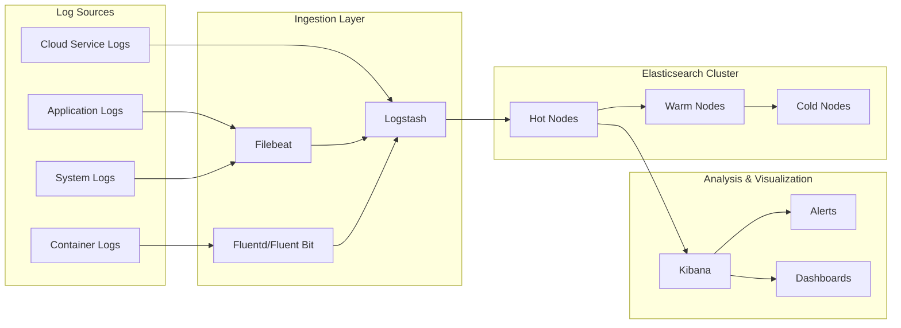
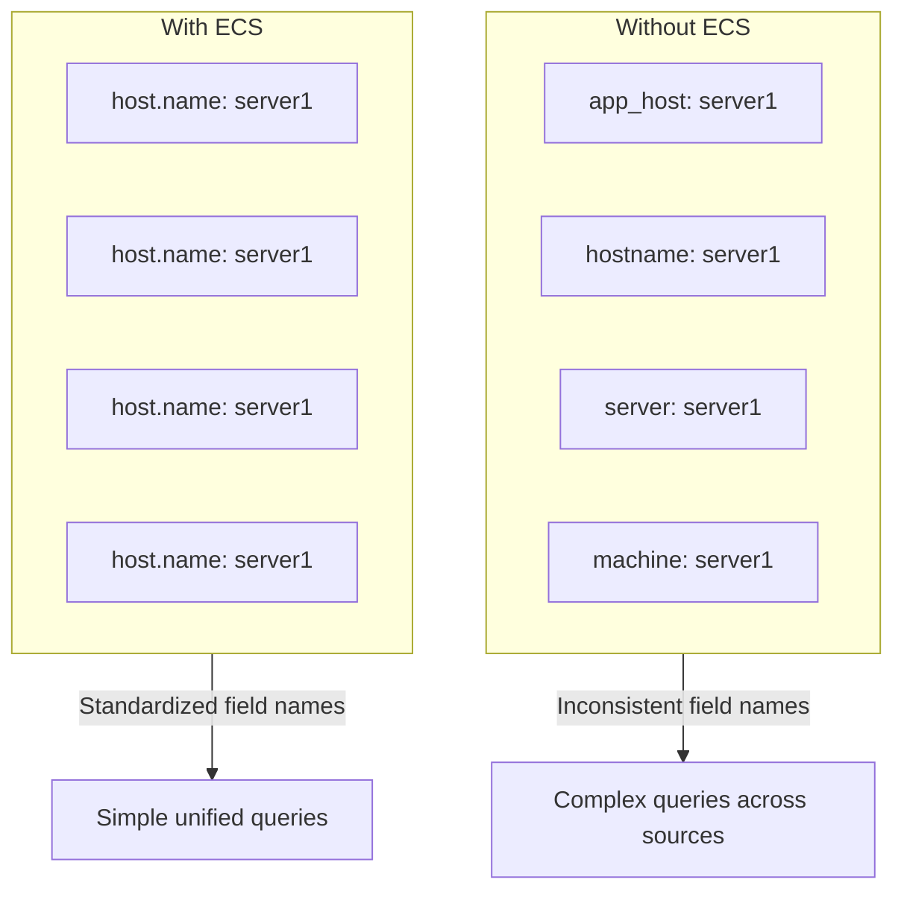
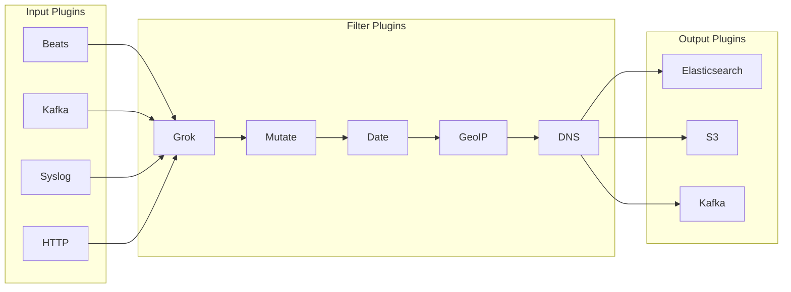
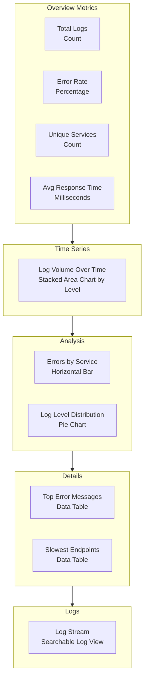
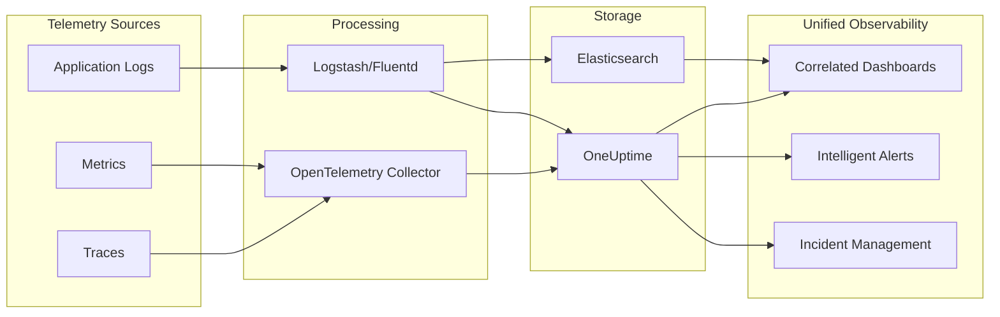

# How to Use Elasticsearch for Log Analysis

By [Nawaz Dhandala](https://github.com/nawazdhandala)

Tags: Elasticsearch, Log Analysis, ECS, Logstash, Kibana, Observability, DevOps, Logging

Description: A comprehensive guide to using Elasticsearch for log analysis, covering index patterns, Elastic Common Schema (ECS), log parsing with Logstash, Kibana visualizations, and best practices for building a scalable logging infrastructure.

---

> "The goal is to turn data into information, and information into insight." - Carly Fiorina

Logs are the lifeblood of system observability. They capture the detailed narrative of what happens inside your applications, infrastructure, and services. Elasticsearch, combined with the Elastic Stack (ELK), provides a powerful platform for ingesting, storing, searching, and visualizing logs at scale. This guide walks you through building an effective log analysis pipeline with Elasticsearch.

---

## Architecture Overview

Before diving into configuration, let's understand how the components work together in a typical Elasticsearch logging pipeline.



The architecture follows a data flow pattern: logs are collected from various sources, processed and enriched in the ingestion layer, stored in Elasticsearch with tiered storage, and finally analyzed through Kibana.

---

## Setting Up Index Patterns for Logs

Index patterns determine how Elasticsearch stores and retrieves your log data. A well-designed index pattern enables efficient querying and data lifecycle management.

### Time-Based Index Pattern

Time-based indices are the standard approach for log data. They allow for efficient time-range queries and simplified data retention management.

```json
// Create an index template for application logs
// This template automatically applies to any index matching the pattern
PUT _index_template/application-logs
{
  "index_patterns": ["logs-application-*"],
  "template": {
    "settings": {
      "number_of_shards": 3,
      "number_of_replicas": 1,
      "index.lifecycle.name": "logs-policy",
      "index.lifecycle.rollover_alias": "logs-application",
      "index.mapping.total_fields.limit": 2000,
      "index.refresh_interval": "5s"
    },
    "mappings": {
      "properties": {
        "@timestamp": {
          "type": "date",
          "format": "strict_date_optional_time||epoch_millis"
        },
        "message": {
          "type": "text",
          "fields": {
            "keyword": {
              "type": "keyword",
              "ignore_above": 2048
            }
          }
        },
        "log.level": {
          "type": "keyword"
        },
        "service.name": {
          "type": "keyword"
        },
        "service.environment": {
          "type": "keyword"
        },
        "host.name": {
          "type": "keyword"
        },
        "trace.id": {
          "type": "keyword"
        },
        "span.id": {
          "type": "keyword"
        }
      }
    }
  },
  "priority": 200,
  "composed_of": ["logs-mappings", "logs-settings"],
  "version": 1,
  "_meta": {
    "description": "Template for application log indices"
  }
}
```

### Data Stream for Append-Only Logs

Data streams provide a simpler abstraction for time-series data like logs. They automatically manage backing indices and rollovers.

```json
// Create a data stream for application logs
// Data streams are ideal for append-only time-series data
PUT _data_stream/logs-application-production

// Query the data stream like a regular index
GET logs-application-production/_search
{
  "query": {
    "bool": {
      "filter": [
        {
          "range": {
            "@timestamp": {
              "gte": "now-1h",
              "lte": "now"
            }
          }
        },
        {
          "term": {
            "log.level": "ERROR"
          }
        }
      ]
    }
  },
  "sort": [
    { "@timestamp": "desc" }
  ],
  "size": 100
}
```

### Index Lifecycle Management (ILM)

ILM policies automate the management of indices through their lifecycle: hot, warm, cold, and delete phases.

```json
// Define an ILM policy for log retention
// This policy moves data through tiers based on age and size
PUT _ilm/policy/logs-policy
{
  "policy": {
    "phases": {
      "hot": {
        "min_age": "0ms",
        "actions": {
          "rollover": {
            "max_age": "1d",
            "max_primary_shard_size": "50gb"
          },
          "set_priority": {
            "priority": 100
          }
        }
      },
      "warm": {
        "min_age": "3d",
        "actions": {
          "shrink": {
            "number_of_shards": 1
          },
          "forcemerge": {
            "max_num_segments": 1
          },
          "set_priority": {
            "priority": 50
          },
          "allocate": {
            "require": {
              "data": "warm"
            }
          }
        }
      },
      "cold": {
        "min_age": "30d",
        "actions": {
          "set_priority": {
            "priority": 0
          },
          "allocate": {
            "require": {
              "data": "cold"
            }
          }
        }
      },
      "delete": {
        "min_age": "90d",
        "actions": {
          "delete": {}
        }
      }
    }
  }
}
```

---

## Elastic Common Schema (ECS)

ECS is a specification that defines a common set of fields for ingesting data into Elasticsearch. Using ECS ensures consistency across different log sources and enables correlation between data types.

### Why Use ECS?



### Core ECS Field Groups

ECS organizes fields into logical groups. Here are the most important ones for log analysis.

```json
// Example log document following ECS conventions
// Each field group serves a specific purpose in the schema
{
  "@timestamp": "2026-01-27T10:30:00.000Z",

  // Base fields - present in all events
  "message": "User authentication successful",
  "tags": ["authentication", "security"],
  "labels": {
    "team": "platform",
    "cost_center": "engineering"
  },

  // ECS version tracking
  "ecs": {
    "version": "8.11.0"
  },

  // Event categorization - what happened
  "event": {
    "kind": "event",
    "category": ["authentication"],
    "type": ["start"],
    "outcome": "success",
    "action": "user-login",
    "duration": 145000000,
    "created": "2026-01-27T10:30:00.000Z",
    "ingested": "2026-01-27T10:30:01.000Z"
  },

  // Log metadata - source information
  "log": {
    "level": "INFO",
    "logger": "com.example.auth.AuthService",
    "file": {
      "path": "/var/log/application/auth.log",
      "line": 1542
    }
  },

  // Service information - which service generated this
  "service": {
    "name": "auth-service",
    "version": "2.4.1",
    "environment": "production",
    "node": {
      "name": "auth-service-pod-abc123"
    }
  },

  // Host information - where it ran
  "host": {
    "name": "k8s-worker-01",
    "hostname": "k8s-worker-01.example.com",
    "ip": ["10.0.1.15"],
    "os": {
      "type": "linux",
      "name": "Ubuntu",
      "version": "22.04"
    }
  },

  // User information - who triggered it
  "user": {
    "id": "user-12345",
    "name": "john.doe",
    "email": "john.doe@example.com",
    "roles": ["developer", "team-lead"]
  },

  // Source information - where the request came from
  "source": {
    "ip": "192.168.1.100",
    "port": 52431,
    "geo": {
      "country_iso_code": "US",
      "region_name": "California",
      "city_name": "San Francisco"
    }
  },

  // Tracing correlation - link to distributed traces
  "trace": {
    "id": "0af7651916cd43dd8448eb211c80319c"
  },
  "span": {
    "id": "b7ad6b7169203331"
  },
  "transaction": {
    "id": "00f067aa0ba902b7"
  }
}
```

### Custom Fields with ECS

When you need custom fields, extend ECS properly by using namespaced custom fields that don't conflict with the standard schema.

```json
// Extend ECS with custom fields using proper namespacing
// Place custom fields under a namespace that identifies your organization
{
  "@timestamp": "2026-01-27T10:30:00.000Z",
  "message": "Payment processed successfully",
  "event": {
    "category": ["web"],
    "type": ["info"],
    "outcome": "success"
  },
  "service": {
    "name": "payment-service"
  },

  // Custom fields namespaced under your organization
  "mycompany": {
    "payment": {
      "id": "pay_abc123",
      "amount": 99.99,
      "currency": "USD",
      "method": "credit_card",
      "processor": "stripe",
      "customer_id": "cus_xyz789"
    },
    "order": {
      "id": "ord_def456",
      "item_count": 3
    }
  }
}
```

---

## Log Parsing with Logstash

Logstash is the data processing pipeline that transforms and enriches logs before sending them to Elasticsearch. Here's how to configure it for common log parsing scenarios.

### Logstash Pipeline Architecture



### Complete Logstash Configuration

```ruby
# /etc/logstash/conf.d/application-logs.conf
# This pipeline processes application logs from Filebeat

input {
  # Receive logs from Filebeat agents
  beats {
    port => 5044
    ssl => true
    ssl_certificate => "/etc/logstash/certs/logstash.crt"
    ssl_key => "/etc/logstash/certs/logstash.key"
  }

  # Alternative: receive logs via HTTP
  http {
    port => 8080
    codec => json
    type => "http_input"
  }
}

filter {
  # Parse JSON logs if the message is JSON formatted
  if [message] =~ /^\{.*\}$/ {
    json {
      source => "message"
      target => "parsed"
      skip_on_invalid_json => true
    }

    # Flatten parsed JSON into root if successful
    if [parsed] {
      mutate {
        rename => {
          "[parsed][level]" => "[log][level]"
          "[parsed][logger]" => "[log][logger]"
          "[parsed][message]" => "message"
          "[parsed][trace_id]" => "[trace][id]"
          "[parsed][span_id]" => "[span][id]"
          "[parsed][service]" => "[service][name]"
          "[parsed][timestamp]" => "@timestamp"
        }
        remove_field => ["parsed"]
      }
    }
  }

  # Parse unstructured logs with grok patterns
  if ![log][level] {
    grok {
      match => {
        "message" => [
          # Standard log format: timestamp level logger - message
          "%{TIMESTAMP_ISO8601:timestamp} %{LOGLEVEL:[log][level]} %{JAVACLASS:[log][logger]} - %{GREEDYDATA:log_message}",
          # Apache/Nginx combined log format
          "%{IPORHOST:[source][ip]} - %{DATA:[user][name]} \[%{HTTPDATE:timestamp}\] \"%{WORD:[http][request][method]} %{URIPATHPARAM:[url][path]} HTTP/%{NUMBER:[http][version]}\" %{NUMBER:[http][response][status_code]} %{NUMBER:[http][response][body][bytes]}",
          # Fallback pattern for unstructured logs
          "%{GREEDYDATA:log_message}"
        ]
      }
      tag_on_failure => ["_grokparsefailure"]
    }

    # Update message if we extracted a log_message
    if [log_message] {
      mutate {
        replace => { "message" => "%{log_message}" }
        remove_field => ["log_message"]
      }
    }
  }

  # Parse and normalize timestamps
  if [timestamp] {
    date {
      match => [
        "timestamp",
        "ISO8601",
        "yyyy-MM-dd HH:mm:ss,SSS",
        "yyyy-MM-dd HH:mm:ss.SSS",
        "dd/MMM/yyyy:HH:mm:ss Z"
      ]
      target => "@timestamp"
      remove_field => ["timestamp"]
    }
  }

  # Normalize log levels to uppercase
  if [log][level] {
    mutate {
      uppercase => ["[log][level]"]
    }

    # Map various level names to standard values
    translate {
      field => "[log][level]"
      destination => "[log][level]"
      dictionary => {
        "TRACE" => "TRACE"
        "DEBUG" => "DEBUG"
        "INFO" => "INFO"
        "WARN" => "WARN"
        "WARNING" => "WARN"
        "ERROR" => "ERROR"
        "ERR" => "ERROR"
        "FATAL" => "FATAL"
        "CRITICAL" => "FATAL"
      }
      fallback => "INFO"
      override => true
    }
  }

  # Enrich with GeoIP data if source IP is present
  if [source][ip] {
    geoip {
      source => "[source][ip]"
      target => "[source][geo]"
      database => "/etc/logstash/GeoLite2-City.mmdb"
      tag_on_failure => ["_geoip_lookup_failure"]
    }
  }

  # Add user agent parsing for HTTP logs
  if [http][request][headers][user-agent] {
    useragent {
      source => "[http][request][headers][user-agent]"
      target => "[user_agent]"
    }
  }

  # Extract error details from stack traces
  if [log][level] == "ERROR" and [message] =~ /Exception|Error/ {
    grok {
      match => {
        "message" => "%{JAVACLASS:[error][type]}: %{GREEDYDATA:[error][message]}"
      }
      tag_on_failure => []
    }
  }

  # Add ECS version and ingestion timestamp
  mutate {
    add_field => {
      "[ecs][version]" => "8.11.0"
      "[event][ingested]" => "%{+ISO8601}"
    }
  }

  # Remove temporary fields and metadata
  mutate {
    remove_field => ["@version", "agent", "input", "host.name"]
  }
}

output {
  # Send to Elasticsearch with index based on service name
  elasticsearch {
    hosts => ["https://elasticsearch:9200"]
    user => "${ES_USER}"
    password => "${ES_PASSWORD}"
    ssl => true
    ssl_certificate_verification => true
    cacert => "/etc/logstash/certs/ca.crt"

    # Dynamic index based on service and date
    index => "logs-%{[service][name]}-%{+YYYY.MM.dd}"

    # Use data streams for better lifecycle management
    data_stream => true
    data_stream_type => "logs"
    data_stream_dataset => "%{[service][name]}"
    data_stream_namespace => "production"
  }

  # Send errors to a dead letter queue for debugging
  if "_grokparsefailure" in [tags] or "_jsonparsefailure" in [tags] {
    elasticsearch {
      hosts => ["https://elasticsearch:9200"]
      user => "${ES_USER}"
      password => "${ES_PASSWORD}"
      ssl => true
      index => "logs-parse-failures-%{+YYYY.MM.dd}"
    }
  }

  # Debug output (disable in production)
  # stdout { codec => rubydebug }
}
```

### Custom Grok Patterns

Create reusable patterns for your specific log formats.

```ruby
# /etc/logstash/patterns/custom_patterns
# Custom grok patterns for application-specific log formats

# Service identifier pattern
SERVICE_NAME [a-zA-Z][a-zA-Z0-9_-]*

# Trace ID patterns (various formats)
TRACE_ID_HEX [a-fA-F0-9]{32}
TRACE_ID_UUID [a-fA-F0-9]{8}-[a-fA-F0-9]{4}-[a-fA-F0-9]{4}-[a-fA-F0-9]{4}-[a-fA-F0-9]{12}
SPAN_ID_HEX [a-fA-F0-9]{16}

# Custom application log format
APP_LOG %{TIMESTAMP_ISO8601:timestamp} \[%{SERVICE_NAME:service}\] %{LOGLEVEL:level} \[trace=%{TRACE_ID_HEX:trace_id}(?:,span=%{SPAN_ID_HEX:span_id})?\] %{JAVACLASS:logger} - %{GREEDYDATA:message}

# Kubernetes pod log format
K8S_LOG %{TIMESTAMP_ISO8601:timestamp} %{LOGLEVEL:level} %{NOTSPACE:source} %{GREEDYDATA:message}
```

---

## Kibana Visualizations and Dashboards

Kibana transforms your Elasticsearch log data into actionable insights through visualizations and dashboards.

### Setting Up the Data View

Before creating visualizations, configure a data view (formerly index pattern) in Kibana.

```json
// Create a data view via Kibana API
POST kbn:/api/data_views/data_view
{
  "data_view": {
    "title": "logs-*",
    "name": "Application Logs",
    "timeFieldName": "@timestamp",
    "runtimeFieldMap": {
      "log.level.category": {
        "type": "keyword",
        "script": {
          "source": "if (doc['log.level'].size() > 0) { def level = doc['log.level'].value; if (level == 'ERROR' || level == 'FATAL') { emit('error'); } else if (level == 'WARN') { emit('warning'); } else { emit('info'); } }"
        }
      },
      "response_time_category": {
        "type": "keyword",
        "script": {
          "source": "if (doc['http.response.time'].size() > 0) { def time = doc['http.response.time'].value; if (time < 100) { emit('fast'); } else if (time < 500) { emit('normal'); } else if (time < 1000) { emit('slow'); } else { emit('very_slow'); } }"
        }
      }
    }
  }
}
```

### Log Analysis Dashboard Queries

Here are essential queries for log analysis in Kibana.

```json
// Query 1: Error rate over time
// Use this in a line chart visualization
GET logs-*/_search
{
  "size": 0,
  "query": {
    "range": {
      "@timestamp": {
        "gte": "now-24h",
        "lte": "now"
      }
    }
  },
  "aggs": {
    "logs_over_time": {
      "date_histogram": {
        "field": "@timestamp",
        "fixed_interval": "5m"
      },
      "aggs": {
        "error_count": {
          "filter": {
            "term": {
              "log.level": "ERROR"
            }
          }
        },
        "total_count": {
          "value_count": {
            "field": "@timestamp"
          }
        },
        "error_rate": {
          "bucket_script": {
            "buckets_path": {
              "errors": "error_count._count",
              "total": "total_count"
            },
            "script": "params.total > 0 ? (params.errors / params.total) * 100 : 0"
          }
        }
      }
    }
  }
}

// Query 2: Top errors by service
// Use this in a horizontal bar chart
GET logs-*/_search
{
  "size": 0,
  "query": {
    "bool": {
      "filter": [
        {
          "range": {
            "@timestamp": {
              "gte": "now-1h"
            }
          }
        },
        {
          "term": {
            "log.level": "ERROR"
          }
        }
      ]
    }
  },
  "aggs": {
    "by_service": {
      "terms": {
        "field": "service.name",
        "size": 10
      },
      "aggs": {
        "by_error_type": {
          "terms": {
            "field": "error.type",
            "size": 5
          }
        }
      }
    }
  }
}

// Query 3: Latency percentiles by endpoint
// Use this in a heat map visualization
GET logs-*/_search
{
  "size": 0,
  "query": {
    "bool": {
      "filter": [
        {
          "range": {
            "@timestamp": {
              "gte": "now-1h"
            }
          }
        },
        {
          "exists": {
            "field": "http.response.time"
          }
        }
      ]
    }
  },
  "aggs": {
    "by_endpoint": {
      "terms": {
        "field": "url.path",
        "size": 20
      },
      "aggs": {
        "latency_percentiles": {
          "percentiles": {
            "field": "http.response.time",
            "percents": [50, 90, 95, 99]
          }
        },
        "avg_latency": {
          "avg": {
            "field": "http.response.time"
          }
        }
      }
    }
  }
}

// Query 4: Trace correlation - find logs for a specific trace
GET logs-*/_search
{
  "query": {
    "term": {
      "trace.id": "0af7651916cd43dd8448eb211c80319c"
    }
  },
  "sort": [
    { "@timestamp": "asc" }
  ],
  "size": 1000,
  "_source": ["@timestamp", "message", "log.level", "service.name", "span.id"]
}
```

### Dashboard Layout



### Kibana Saved Search for Quick Analysis

```json
// Create a saved search for error investigation
POST kbn:/api/saved_objects/search
{
  "attributes": {
    "title": "Error Investigation View",
    "description": "Pre-filtered view for investigating errors",
    "columns": [
      "@timestamp",
      "service.name",
      "log.level",
      "message",
      "trace.id",
      "error.type"
    ],
    "sort": [
      ["@timestamp", "desc"]
    ],
    "kibanaSavedObjectMeta": {
      "searchSourceJSON": "{\"query\":{\"bool\":{\"filter\":[{\"terms\":{\"log.level\":[\"ERROR\",\"FATAL\"]}}]}},\"filter\":[],\"indexRefName\":\"kibanaSavedObjectMeta.searchSourceJSON.index\"}"
    }
  },
  "references": [
    {
      "id": "logs-*",
      "name": "kibanaSavedObjectMeta.searchSourceJSON.index",
      "type": "index-pattern"
    }
  ]
}
```

---

## Alerting on Log Patterns

Configure alerts to detect anomalies and critical issues in your logs.

```json
// Create an alert rule for high error rates
POST kbn:/api/alerting/rule
{
  "name": "High Error Rate Alert",
  "consumer": "logs",
  "rule_type_id": ".es-query",
  "schedule": {
    "interval": "5m"
  },
  "params": {
    "index": ["logs-*"],
    "timeField": "@timestamp",
    "esQuery": {
      "bool": {
        "filter": [
          {
            "range": {
              "@timestamp": {
                "gte": "now-5m"
              }
            }
          },
          {
            "term": {
              "log.level": "ERROR"
            }
          }
        ]
      }
    },
    "threshold": [100],
    "thresholdComparator": ">",
    "timeWindowSize": 5,
    "timeWindowUnit": "m"
  },
  "actions": [
    {
      "group": "threshold met",
      "id": "slack-connector-id",
      "params": {
        "message": "High error rate detected: {{context.value}} errors in the last 5 minutes.\n\nTop services affected:\n{{#context.hits}}\n- {{_source.service.name}}: {{_source.message}}\n{{/context.hits}}"
      }
    }
  ]
}
```

---

## Performance Optimization

Optimize your Elasticsearch cluster for log analysis workloads.

### Index Settings for High-Volume Logs

```json
// Optimized index settings for log ingestion
PUT _template/logs-optimized
{
  "index_patterns": ["logs-*"],
  "settings": {
    "index": {
      "number_of_shards": 3,
      "number_of_replicas": 1,
      "refresh_interval": "30s",
      "translog": {
        "durability": "async",
        "sync_interval": "30s",
        "flush_threshold_size": "1gb"
      },
      "merge": {
        "scheduler": {
          "max_thread_count": 1
        }
      },
      "codec": "best_compression",
      "mapping": {
        "total_fields": {
          "limit": 2000
        },
        "depth": {
          "limit": 20
        }
      }
    }
  }
}
```

### Query Optimization Tips

```json
// Efficient query patterns for log analysis

// Use filter context for non-scoring queries (faster)
GET logs-*/_search
{
  "query": {
    "bool": {
      "filter": [
        { "term": { "service.name": "api-gateway" } },
        { "term": { "log.level": "ERROR" } },
        { "range": { "@timestamp": { "gte": "now-1h" } } }
      ]
    }
  }
}

// Use doc_values for aggregations
// Avoid aggregating on text fields - use keyword instead
GET logs-*/_search
{
  "size": 0,
  "aggs": {
    "by_service": {
      "terms": {
        "field": "service.name",
        "size": 100,
        "execution_hint": "map"
      }
    }
  }
}

// Use source filtering to reduce network transfer
GET logs-*/_search
{
  "_source": ["@timestamp", "message", "log.level"],
  "query": {
    "match": {
      "message": "connection timeout"
    }
  }
}
```

---

## Security Best Practices

### Role-Based Access Control

```json
// Create a role for log analysts with read-only access
PUT _security/role/log_analyst
{
  "cluster": ["monitor"],
  "indices": [
    {
      "names": ["logs-*"],
      "privileges": ["read", "view_index_metadata"],
      "field_security": {
        "except": ["user.password", "http.request.headers.authorization"]
      }
    }
  ],
  "applications": [
    {
      "application": "kibana-.kibana",
      "privileges": ["feature_discover.read", "feature_dashboard.read"],
      "resources": ["*"]
    }
  ]
}

// Create a role for log administrators
PUT _security/role/log_admin
{
  "cluster": ["manage_index_templates", "manage_ilm", "monitor"],
  "indices": [
    {
      "names": ["logs-*"],
      "privileges": ["all"]
    }
  ]
}
```

### Field-Level Security for Sensitive Data

```json
// Redact sensitive fields from certain users
PUT _security/role/log_viewer_restricted
{
  "indices": [
    {
      "names": ["logs-*"],
      "privileges": ["read"],
      "field_security": {
        "grant": ["*"],
        "except": [
          "user.email",
          "source.ip",
          "http.request.headers.*",
          "mycompany.payment.*"
        ]
      }
    }
  ]
}
```

---

## Integration with OneUptime

While Elasticsearch provides powerful log storage and analysis capabilities, integrating with a comprehensive observability platform like [OneUptime](https://oneuptime.com) gives you the complete picture. OneUptime connects your logs with metrics, traces, and incidents for end-to-end visibility.



OneUptime provides:

- **Native OpenTelemetry support** for logs, metrics, and traces
- **Automatic correlation** between logs and distributed traces
- **Intelligent alerting** that reduces noise and surfaces real issues
- **Incident management** that connects alerts to actionable workflows
- **Status pages** to communicate with your users during outages

---

## Summary

Building an effective log analysis pipeline with Elasticsearch involves:

1. **Index Patterns**: Design time-based indices with appropriate sharding and lifecycle policies
2. **ECS Compliance**: Use Elastic Common Schema for consistent, queryable log data
3. **Logstash Pipelines**: Parse, enrich, and transform logs before indexing
4. **Kibana Dashboards**: Create visualizations that surface insights and enable investigation
5. **Alerting**: Configure alerts to detect anomalies before they become incidents
6. **Security**: Implement RBAC and field-level security to protect sensitive data

Remember that logs are just one pillar of observability. Correlating logs with metrics and traces provides the complete picture you need to understand and troubleshoot your systems effectively.

---

**Related Reading:**

- [How to Structure Logs Properly in OpenTelemetry](https://oneuptime.com/blog/post/2025-08-28-how-to-structure-logs-properly-in-opentelemetry/view)
- [Logs, Metrics and Traces: Turning Three Noisy Streams into One Story](https://oneuptime.com/blog/post/2025-08-20-three-pillars-of-observability-logs-metrics-traces/view)
- [What is OpenTelemetry Collector and Why Use One?](https://oneuptime.com/blog/post/2025-09-18-what-is-opentelemetry-collector-and-why-use-one/view)
