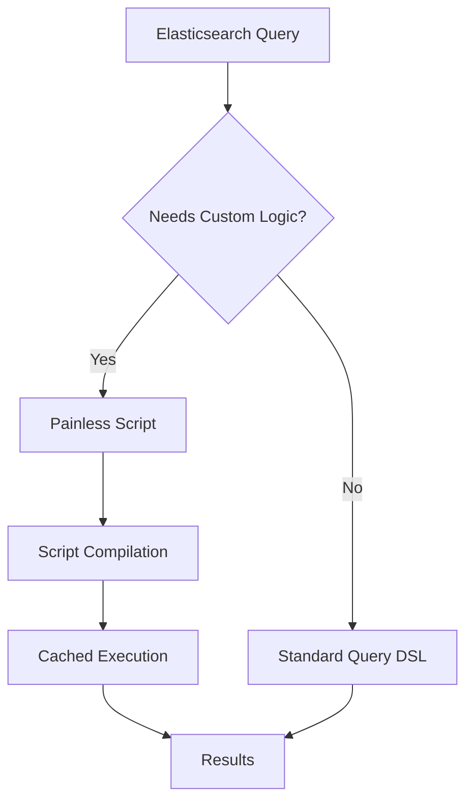
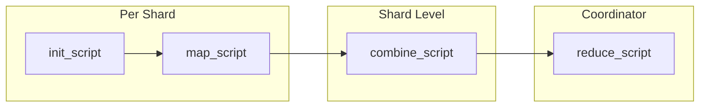
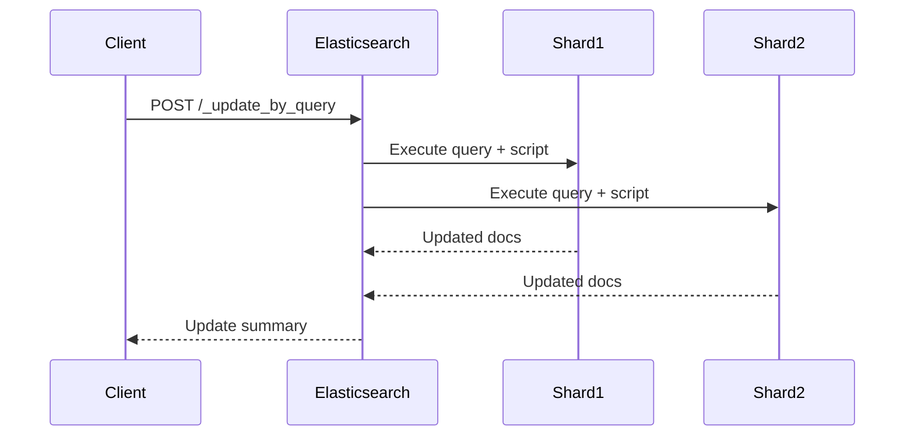
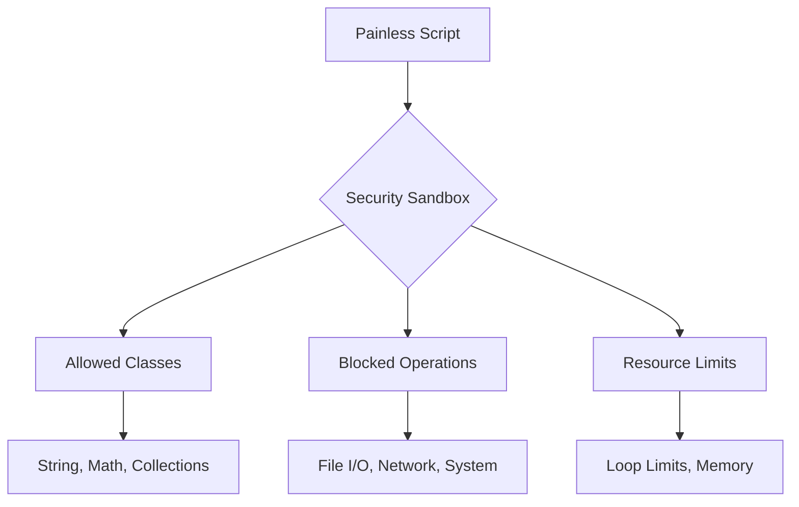

# How to Build Elasticsearch Painless Scripts

Author: [nawazdhandala](https://www.github.com/nawazdhandala)

Tags: Elasticsearch, Painless, Scripting, Search, Data Transformation, Update By Query, Aggregations

Description: A comprehensive guide to writing Elasticsearch Painless scripts for search transformations, scripted metrics, update operations, and real-world data manipulation with security best practices.

---

> "The art of scripting in Elasticsearch is knowing when a simple query won't suffice and a Painless script becomes necessary."

Elasticsearch's Painless scripting language is a powerful tool for performing complex data transformations, custom scoring, and bulk updates that go beyond standard query capabilities. Despite its name, Painless can be challenging to master without proper guidance. This guide walks you through the fundamentals, practical patterns, and security considerations for building production-ready Painless scripts.

---

## Table of Contents

1. What is Painless?
2. Painless Language Syntax
3. Script Fields and Runtime Fields
4. Scripted Metrics and Aggregations
5. Update By Query Scripts
6. Ingest Pipeline Scripts
7. Security Considerations
8. Performance Best Practices
9. Debugging Painless Scripts
10. Real-World Examples

---

## 1. What is Painless?

Painless is Elasticsearch's default scripting language, designed specifically for security and performance. It's a statically-typed language with Java-like syntax that runs in a sandboxed environment.



Key characteristics:
- **Secure by default**: Runs in a sandbox with restricted access
- **Fast**: Compiled to bytecode, cached for reuse
- **Familiar syntax**: Similar to Java and Groovy
- **Built-in functions**: Rich standard library for common operations

---

## 2. Painless Language Syntax

### Basic Types and Variables

```java
// Painless supports standard primitive types
// Integer types
int count = 10;
long bigNumber = 1000000L;

// Floating point types
double price = 99.99;
float rate = 0.5f;

// Boolean type
boolean isActive = true;

// String type
String name = "elasticsearch";

// Dynamic type (def) - infers type at runtime
def value = doc['field_name'].value;
```

### Collections and Data Structures

```java
// Lists - ordered, mutable collections
List myList = new ArrayList();
myList.add("item1");
myList.add("item2");

// Alternative list initialization
def items = ["apple", "banana", "cherry"];

// Maps - key-value pairs
Map myMap = new HashMap();
myMap.put("key", "value");

// Alternative map initialization
def config = ["timeout": 30, "retries": 3];

// Accessing map values
def timeout = config["timeout"];
// Or using dot notation for string keys
def retries = config.retries;
```

### Control Flow

```java
// If-else statements
if (doc['status'].value == "active") {
    return 1.0;
} else if (doc['status'].value == "pending") {
    return 0.5;
} else {
    return 0.0;
}

// Ternary operator for simple conditions
def result = doc['score'].value > 50 ? "pass" : "fail";

// For loops - iterate over collections
int sum = 0;
for (int i = 0; i < 10; i++) {
    sum += i;
}

// Enhanced for loop
def total = 0;
for (def item : doc['prices']) {
    total += item;
}

// While loops
int counter = 0;
while (counter < doc['items'].size()) {
    // Process each item
    counter++;
}
```

### Functions and Methods

```java
// Built-in string methods
String text = "Hello World";
text.toLowerCase();          // "hello world"
text.toUpperCase();          // "HELLO WORLD"
text.substring(0, 5);        // "Hello"
text.contains("World");      // true
text.replace("World", "ES"); // "Hello ES"
text.split(" ");             // ["Hello", "World"]

// Math operations
Math.abs(-5);                // 5
Math.max(10, 20);            // 20
Math.min(10, 20);            // 10
Math.pow(2, 3);              // 8.0
Math.sqrt(16);               // 4.0
Math.round(3.7);             // 4

// Date/time operations
def now = Instant.now();
def timestamp = doc['created_at'].value;
def daysDiff = ChronoUnit.DAYS.between(timestamp, now);
```

---

## 3. Script Fields and Runtime Fields

Script fields allow you to compute values at query time, creating derived fields without modifying your index.

### Basic Script Field

```json
{
  "query": {
    "match_all": {}
  },
  "script_fields": {
    "full_name": {
      "script": {
        "lang": "painless",
        "source": """
          // Concatenate first and last name with null safety
          def firstName = doc['first_name'].size() > 0
            ? doc['first_name'].value
            : '';
          def lastName = doc['last_name'].size() > 0
            ? doc['last_name'].value
            : '';
          return firstName + ' ' + lastName;
        """
      }
    }
  }
}
```

### Runtime Fields (Elasticsearch 7.11+)

Runtime fields are computed at query time and can be used like regular fields.

```json
{
  "runtime_mappings": {
    "day_of_week": {
      "type": "keyword",
      "script": {
        "source": """
          // Extract day of week from timestamp
          // Returns: MONDAY, TUESDAY, etc.
          emit(doc['timestamp'].value.dayOfWeekEnum.getDisplayName(
            TextStyle.FULL,
            Locale.ROOT
          ));
        """
      }
    },
    "price_with_tax": {
      "type": "double",
      "script": {
        "source": """
          // Calculate price with 20% tax
          double basePrice = doc['price'].value;
          double taxRate = 0.20;
          emit(basePrice * (1 + taxRate));
        """
      }
    }
  },
  "query": {
    "bool": {
      "filter": [
        { "term": { "day_of_week": "MONDAY" } }
      ]
    }
  },
  "aggs": {
    "avg_price_with_tax": {
      "avg": { "field": "price_with_tax" }
    }
  }
}
```

### Script Field with Parameters

```json
{
  "query": {
    "match_all": {}
  },
  "script_fields": {
    "discounted_price": {
      "script": {
        "lang": "painless",
        "source": """
          // Apply discount percentage from params
          // Params keep scripts cacheable
          double price = doc['price'].value;
          double discount = params.discount_percent / 100.0;
          return price * (1 - discount);
        """,
        "params": {
          "discount_percent": 15
        }
      }
    }
  }
}
```

---

## 4. Scripted Metrics and Aggregations

Scripted metrics provide complete control over aggregation logic through four phases.



### Complete Scripted Metric Example

```json
{
  "size": 0,
  "aggs": {
    "profit_stats": {
      "scripted_metric": {
        "init_script": """
          // Initialize state object on each shard
          // This runs once per shard before processing documents
          state.profits = [];
          state.losses = [];
          state.transactions = 0;
        """,

        "map_script": """
          // Process each document
          // This runs for every document matching the query
          double revenue = doc['revenue'].value;
          double cost = doc['cost'].value;
          double profit = revenue - cost;

          state.transactions++;

          if (profit >= 0) {
            state.profits.add(profit);
          } else {
            state.losses.add(profit);
          }
        """,

        "combine_script": """
          // Combine results within each shard
          // Summarize shard-local state for the reduce phase
          Map result = new HashMap();
          result.put('profits', state.profits);
          result.put('losses', state.losses);
          result.put('transactions', state.transactions);
          return result;
        """,

        "reduce_script": """
          // Final aggregation across all shards
          // Receives array of combine_script results from each shard
          double totalProfit = 0;
          double totalLoss = 0;
          int totalTransactions = 0;
          int profitableCount = 0;
          int lossCount = 0;

          for (state in states) {
            for (p in state.profits) {
              totalProfit += p;
              profitableCount++;
            }
            for (l in state.losses) {
              totalLoss += l;
              lossCount++;
            }
            totalTransactions += state.transactions;
          }

          // Return final computed result
          Map result = new HashMap();
          result.put('total_profit', totalProfit);
          result.put('total_loss', totalLoss);
          result.put('net_profit', totalProfit + totalLoss);
          result.put('profitable_transactions', profitableCount);
          result.put('loss_transactions', lossCount);
          result.put('total_transactions', totalTransactions);
          result.put('profit_ratio', profitableCount / (double) totalTransactions);
          return result;
        """
      }
    }
  }
}
```

### Bucket Script Aggregation

```json
{
  "size": 0,
  "aggs": {
    "sales_by_month": {
      "date_histogram": {
        "field": "date",
        "calendar_interval": "month"
      },
      "aggs": {
        "total_revenue": {
          "sum": { "field": "revenue" }
        },
        "total_cost": {
          "sum": { "field": "cost" }
        },
        "profit_margin": {
          "bucket_script": {
            "buckets_path": {
              "revenue": "total_revenue",
              "cost": "total_cost"
            },
            "script": """
              // Calculate profit margin percentage
              // buckets_path variables are available directly
              if (params.revenue == 0) {
                return 0;
              }
              double profit = params.revenue - params.cost;
              return (profit / params.revenue) * 100;
            """
          }
        }
      }
    }
  }
}
```

---

## 5. Update By Query Scripts

Update by query allows bulk modifications using Painless scripts. This is powerful for data migrations and bulk transformations.



### Basic Update By Query

```json
POST /products/_update_by_query
{
  "query": {
    "range": {
      "price": { "lt": 10 }
    }
  },
  "script": {
    "lang": "painless",
    "source": """
      // Increase price by 10% for low-priced items
      ctx._source.price = ctx._source.price * 1.10;

      // Add a timestamp for when the update occurred
      ctx._source.last_price_update = params.update_time;
    """,
    "params": {
      "update_time": "2026-01-27T00:00:00Z"
    }
  }
}
```

### Conditional Updates with ctx.op

```json
POST /orders/_update_by_query
{
  "query": {
    "term": { "status": "pending" }
  },
  "script": {
    "lang": "painless",
    "source": """
      // ctx.op controls what happens to the document
      // 'index' - update the document (default)
      // 'noop' - skip, don't modify
      // 'delete' - remove the document

      def orderDate = ZonedDateTime.parse(ctx._source.order_date);
      def now = ZonedDateTime.now();
      def daysSinceOrder = ChronoUnit.DAYS.between(orderDate, now);

      if (daysSinceOrder > 30) {
        // Cancel old pending orders
        ctx._source.status = 'cancelled';
        ctx._source.cancellation_reason = 'auto_expired';
        ctx._source.cancelled_at = now.toString();
      } else if (daysSinceOrder > 7) {
        // Mark as stale but keep pending
        ctx._source.is_stale = true;
      } else {
        // Skip recent orders - no modification needed
        ctx.op = 'noop';
      }
    """
  }
}
```

### Complex Data Transformation

```json
POST /logs/_update_by_query
{
  "query": {
    "exists": { "field": "raw_message" }
  },
  "script": {
    "lang": "painless",
    "source": """
      // Parse structured data from raw log message
      String raw = ctx._source.raw_message;

      // Extract key-value pairs from log format
      // Example: "user=john action=login ip=192.168.1.1"
      Map parsed = new HashMap();

      for (String part : raw.split(' ')) {
        if (part.contains('=')) {
          String[] kv = part.split('=', 2);
          if (kv.length == 2) {
            parsed.put(kv[0], kv[1]);
          }
        }
      }

      // Add parsed fields to document
      ctx._source.parsed = parsed;

      // Extract specific fields to top level
      if (parsed.containsKey('user')) {
        ctx._source.username = parsed.get('user');
      }
      if (parsed.containsKey('ip')) {
        ctx._source.client_ip = parsed.get('ip');
      }

      // Mark as processed
      ctx._source.is_parsed = true;
    """
  }
}
```

### Adding and Removing Fields

```json
POST /users/_update_by_query
{
  "query": {
    "match_all": {}
  },
  "script": {
    "lang": "painless",
    "source": """
      // Rename a field
      if (ctx._source.containsKey('old_field_name')) {
        ctx._source.new_field_name = ctx._source.old_field_name;
        ctx._source.remove('old_field_name');
      }

      // Add new computed field
      if (ctx._source.containsKey('first_name') &&
          ctx._source.containsKey('last_name')) {
        ctx._source.full_name =
          ctx._source.first_name + ' ' + ctx._source.last_name;
      }

      // Remove deprecated fields
      ctx._source.remove('deprecated_field');
      ctx._source.remove('unused_field');

      // Add metadata
      ctx._source.schema_version = params.target_version;
    """,
    "params": {
      "target_version": 2
    }
  }
}
```

---

## 6. Ingest Pipeline Scripts

Painless scripts in ingest pipelines transform documents before indexing.

```json
PUT _ingest/pipeline/enrich-logs
{
  "description": "Enrich log documents with computed fields",
  "processors": [
    {
      "script": {
        "lang": "painless",
        "source": """
          // Access document via ctx
          // Note: ingest uses ctx directly, not ctx._source

          // Parse timestamp and extract components
          if (ctx.containsKey('timestamp')) {
            def ts = ZonedDateTime.parse(ctx.timestamp);
            ctx.hour_of_day = ts.getHour();
            ctx.day_of_week = ts.getDayOfWeek().toString();
            ctx.is_weekend = ts.getDayOfWeek().getValue() >= 6;
          }

          // Categorize log level
          if (ctx.containsKey('level')) {
            def level = ctx.level.toUpperCase();
            if (level == 'ERROR' || level == 'FATAL') {
              ctx.severity = 'high';
              ctx.alert_required = true;
            } else if (level == 'WARN') {
              ctx.severity = 'medium';
              ctx.alert_required = false;
            } else {
              ctx.severity = 'low';
              ctx.alert_required = false;
            }
          }

          // Extract service name from host pattern
          // Example: "web-server-prod-01" -> "web-server"
          if (ctx.containsKey('host')) {
            def parts = ctx.host.split('-');
            if (parts.length >= 2) {
              ctx.service = parts[0] + '-' + parts[1];
            }
          }

          // Compute message hash for deduplication
          if (ctx.containsKey('message')) {
            ctx.message_hash = ctx.message.hashCode();
          }
        """
      }
    }
  ]
}
```

---

## 7. Security Considerations

Painless runs in a sandbox, but proper security practices are essential.



### Security Best Practices

```java
// DO: Use parameters for external values
// This prevents script injection and improves caching
{
  "script": {
    "source": "doc['price'].value * params.multiplier",
    "params": {
      "multiplier": 1.5
    }
  }
}

// DON'T: Concatenate user input into scripts
// DANGEROUS - allows script injection
// String userInput = "1.5; malicious_code()";
// "doc['price'].value * " + userInput  // NEVER DO THIS
```

### Safe Pattern: Whitelist Allowed Values

```json
{
  "script": {
    "lang": "painless",
    "source": """
      // Validate input against whitelist
      def allowedStatuses = ['active', 'pending', 'completed'];
      def requestedStatus = params.status;

      if (!allowedStatuses.contains(requestedStatus)) {
        // Reject invalid status - don't process
        return null;
      }

      // Safe to use validated input
      ctx._source.status = requestedStatus;
    """,
    "params": {
      "status": "active"
    }
  }
}
```

### Limit Script Complexity

```java
// Elasticsearch has built-in protections against infinite loops
// But you should still write bounded code

// DO: Use bounded loops
int maxIterations = Math.min(doc['items'].size(), 100);
for (int i = 0; i < maxIterations; i++) {
    // Process item
}

// DO: Check array bounds
if (index >= 0 && index < items.size()) {
    def item = items.get(index);
}

// DO: Handle null/missing fields
def value = doc.containsKey('field') && doc['field'].size() > 0
    ? doc['field'].value
    : params.default_value;
```

### Cluster Settings for Script Security

```json
// Disable dynamic scripting if not needed (elasticsearch.yml)
// script.allowed_types: none

// Or restrict to specific contexts
// script.allowed_contexts: search, update

// Limit compilation rate to prevent DoS
PUT _cluster/settings
{
  "persistent": {
    "script.max_compilations_rate": "100/5m"
  }
}
```

---

## 8. Performance Best Practices

### Use Stored Scripts

```json
// Store frequently used scripts
PUT _scripts/calculate-discount
{
  "script": {
    "lang": "painless",
    "source": """
      double price = doc['price'].value;
      double discount = params.discount_percent / 100.0;
      double minPrice = params.min_price;
      return Math.max(price * (1 - discount), minPrice);
    """
  }
}

// Use stored script in queries
{
  "script_fields": {
    "discounted_price": {
      "script": {
        "id": "calculate-discount",
        "params": {
          "discount_percent": 20,
          "min_price": 5.0
        }
      }
    }
  }
}
```

### Avoid These Anti-Patterns

```java
// SLOW: Regex on every document
// Pattern compilation is expensive
if (doc['field'].value =~ /complex.*pattern/) {
    // ...
}

// BETTER: Use query DSL for filtering first
// Then apply script only to matched documents

// SLOW: String concatenation in loops
String result = "";
for (item in items) {
    result += item;  // Creates new String each time
}

// BETTER: Use StringBuilder or List
def parts = [];
for (item in items) {
    parts.add(item);
}
return String.join(',', parts);

// SLOW: Accessing same field multiple times
if (doc['field'].value > 10) {
    return doc['field'].value * 2;  // Accessed twice
}

// BETTER: Cache field access
def value = doc['field'].value;
if (value > 10) {
    return value * 2;
}
```

### Profile Your Scripts

```json
// Enable script profiling
{
  "profile": true,
  "query": {
    "script_score": {
      "query": { "match_all": {} },
      "script": {
        "source": "doc['score'].value * params.boost",
        "params": { "boost": 2.0 }
      }
    }
  }
}
```

---

## 9. Debugging Painless Scripts

### Use Debug.explain()

```json
{
  "query": {
    "match_all": {}
  },
  "script_fields": {
    "debug_output": {
      "script": {
        "source": """
          // Debug.explain() returns detailed info about a value
          // Useful for understanding types and content
          def value = doc['complex_field'];
          Debug.explain(value);
        """
      }
    }
  }
}
```

### Log to a Field for Inspection

```json
POST /test/_update_by_query
{
  "script": {
    "source": """
      // Create debug log for troubleshooting
      def debugLog = [];

      debugLog.add('Processing doc: ' + ctx._id);
      debugLog.add('Original price: ' + ctx._source.price);

      if (ctx._source.price > 100) {
        ctx._source.price = ctx._source.price * 0.9;
        debugLog.add('Applied 10% discount');
      }

      debugLog.add('Final price: ' + ctx._source.price);

      // Store debug info temporarily
      ctx._source._debug = debugLog;
    """
  }
}
```

### Common Errors and Solutions

```java
// Error: "cannot resolve symbol [field]"
// Solution: Check field exists
if (doc.containsKey('field') && doc['field'].size() > 0) {
    def value = doc['field'].value;
}

// Error: "cannot cast String to Integer"
// Solution: Explicit type conversion
int count = Integer.parseInt(doc['count_string'].value);

// Error: "array index out of bounds"
// Solution: Bounds checking
if (index < doc['items'].size()) {
    def item = doc['items'].get(index);
}

// Error: "null pointer exception"
// Solution: Null checking
def value = ctx._source.field;
if (value != null) {
    // Safe to use value
}
```

---

## 10. Real-World Examples

### E-commerce: Dynamic Pricing

```json
POST /products/_search
{
  "query": {
    "bool": {
      "must": [
        { "term": { "category": "electronics" } }
      ]
    }
  },
  "script_fields": {
    "dynamic_price": {
      "script": {
        "source": """
          // Dynamic pricing based on inventory and demand
          double basePrice = doc['price'].value;
          int inventory = doc['stock_count'].value;
          double demandScore = doc['demand_score'].value;

          // Low inventory premium (up to 15%)
          double inventoryMultiplier = 1.0;
          if (inventory < 10) {
            inventoryMultiplier = 1.15;
          } else if (inventory < 50) {
            inventoryMultiplier = 1.05;
          }

          // Demand-based adjustment (-10% to +10%)
          double demandAdjustment = (demandScore - 0.5) * 0.2;

          // Calculate final price
          double finalPrice = basePrice * inventoryMultiplier * (1 + demandAdjustment);

          // Round to 2 decimal places
          return Math.round(finalPrice * 100) / 100.0;
        """
      }
    }
  }
}
```

### Log Analysis: Session Duration

```json
POST /events/_search
{
  "size": 0,
  "aggs": {
    "by_session": {
      "terms": {
        "field": "session_id",
        "size": 1000
      },
      "aggs": {
        "session_stats": {
          "scripted_metric": {
            "init_script": """
              state.timestamps = [];
              state.events = [];
            """,
            "map_script": """
              state.timestamps.add(doc['timestamp'].value.toInstant().toEpochMilli());
              state.events.add(doc['event_type'].value);
            """,
            "combine_script": """
              return [
                'timestamps': state.timestamps,
                'events': state.events
              ];
            """,
            "reduce_script": """
              long minTime = Long.MAX_VALUE;
              long maxTime = Long.MIN_VALUE;
              int totalEvents = 0;
              Set uniqueEvents = new HashSet();

              for (state in states) {
                for (ts in state.timestamps) {
                  if (ts < minTime) minTime = ts;
                  if (ts > maxTime) maxTime = ts;
                }
                totalEvents += state.events.size();
                uniqueEvents.addAll(state.events);
              }

              long durationMs = maxTime - minTime;
              double durationMinutes = durationMs / 60000.0;

              return [
                'duration_minutes': Math.round(durationMinutes * 100) / 100.0,
                'total_events': totalEvents,
                'unique_event_types': uniqueEvents.size()
              ];
            """
          }
        }
      }
    }
  }
}
```

### Data Migration: Schema Evolution

```json
POST /users/_update_by_query
{
  "query": {
    "bool": {
      "must_not": [
        { "exists": { "field": "schema_version" } }
      ]
    }
  },
  "script": {
    "source": """
      // Migrate from schema v1 to v2

      // 1. Normalize name fields
      if (ctx._source.containsKey('name')) {
        def nameParts = ctx._source.name.split(' ', 2);
        ctx._source.first_name = nameParts[0];
        ctx._source.last_name = nameParts.length > 1 ? nameParts[1] : '';
        ctx._source.remove('name');
      }

      // 2. Convert string dates to proper format
      if (ctx._source.containsKey('created')) {
        // Handle various date formats
        def dateStr = ctx._source.created;
        if (dateStr.length() == 10) {
          // YYYY-MM-DD format
          ctx._source.created_at = dateStr + 'T00:00:00Z';
        } else {
          ctx._source.created_at = dateStr;
        }
        ctx._source.remove('created');
      }

      // 3. Add default values for new required fields
      if (!ctx._source.containsKey('preferences')) {
        ctx._source.preferences = [
          'notifications': true,
          'theme': 'light',
          'language': 'en'
        ];
      }

      // 4. Mark migration complete
      ctx._source.schema_version = 2;
      ctx._source.migrated_at = params.migration_time;
    """,
    "params": {
      "migration_time": "2026-01-27T00:00:00Z"
    }
  }
}
```

---

## Summary

| Use Case | Script Context | Key Points |
|----------|----------------|------------|
| Computed fields at query time | Script Fields / Runtime Fields | Use `doc['field']`, `emit()` for runtime |
| Custom aggregations | Scripted Metrics | Four phases: init, map, combine, reduce |
| Bulk data updates | Update By Query | Use `ctx._source`, `ctx.op` |
| Pre-index transformation | Ingest Pipeline | Use `ctx` directly |
| Custom scoring | Script Score Query | Access via `doc['field']` |

Painless scripts unlock powerful capabilities in Elasticsearch, but remember:
- **Prefer query DSL** when possible - it's faster
- **Use parameters** for external values - improves security and caching
- **Test thoroughly** - script errors can affect query performance
- **Monitor performance** - profile and optimize critical scripts

---

*Need to monitor your Elasticsearch cluster health and script performance? [OneUptime](https://oneuptime.com) provides comprehensive observability for your entire stack, including Elasticsearch metrics, logs, and alerting. Track query latencies, monitor cluster health, and get notified before issues impact your users.*

---

### Related Reading

- [Elasticsearch Official Painless Documentation](https://www.elastic.co/guide/en/elasticsearch/painless/current/index.html)
- [Three Pillars of Observability: Logs, Metrics, Traces](/blog/post/2025-08-20-three-pillars-of-observability-logs-metrics-traces)
- [How to Structure Logs Properly in OpenTelemetry](/blog/post/2025-08-28-how-to-structure-logs-properly-in-opentelemetry)
