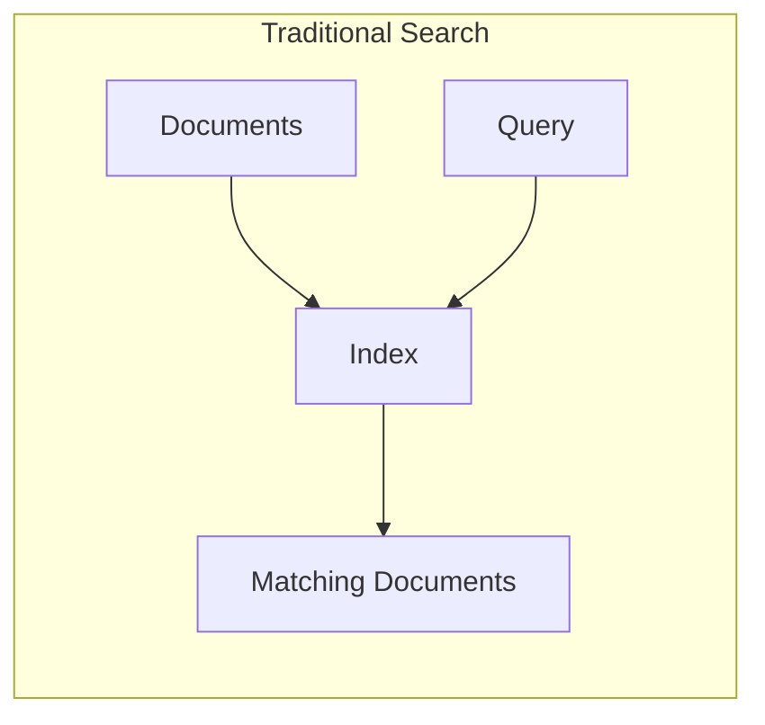
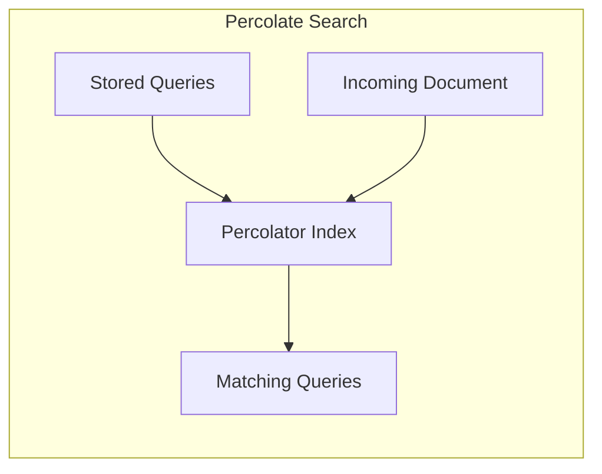
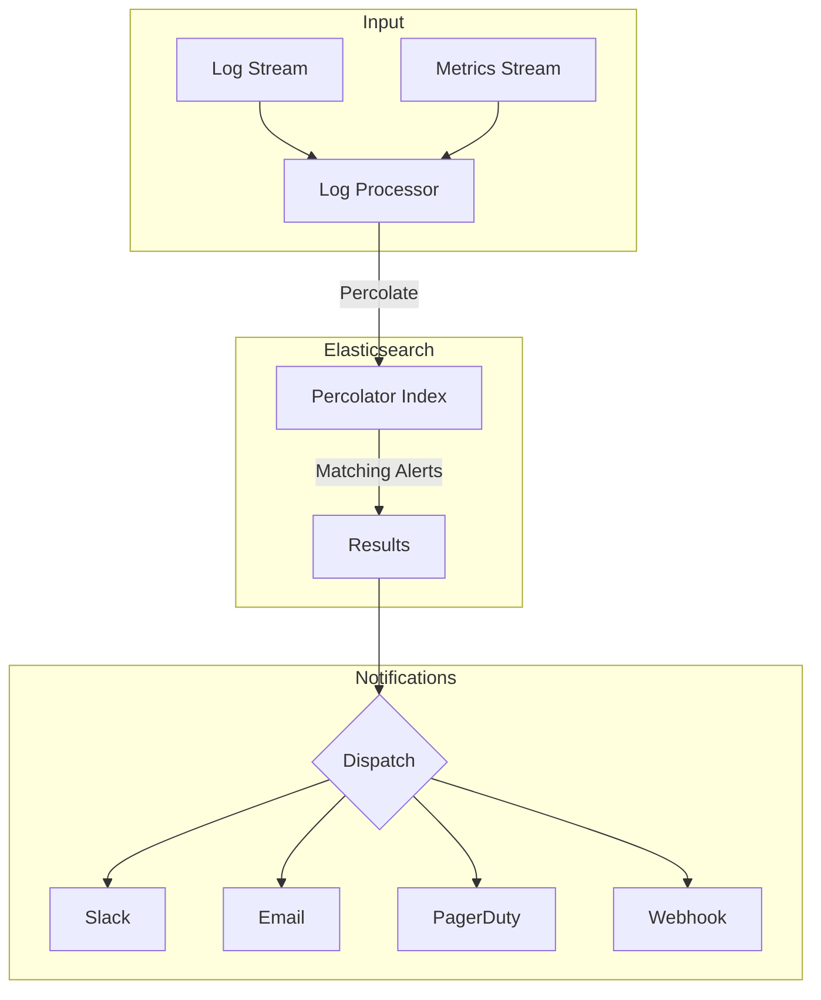
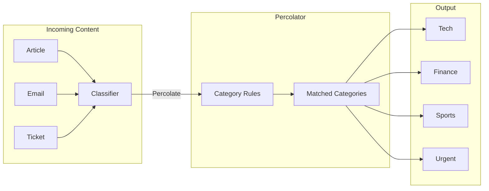

# How to Implement Elasticsearch Percolate Queries

By [Nawaz Dhandala](https://github.com/nawazdhandala)

Tags: Elasticsearch, Percolate Queries, Search, Alerting, Content Matching, Real-Time Monitoring

Description: A comprehensive guide to implementing Elasticsearch percolate queries for reverse search operations. Learn how to set up percolator indices, register queries, match documents against stored queries, and build real-time alerting and content classification systems.

---

> **Percolate queries flip the search paradigm: instead of searching documents with a query, you search queries with a document.** This "reverse search" pattern is the foundation for real-time alerting, content matching, and classification systems.

Traditional search answers: "Which documents match this query?"
Percolate queries answer: "Which stored queries match this document?"

This guide walks through the complete implementation of Elasticsearch percolate queries, from index setup to production-ready alerting systems.

---

## Table of Contents

1. Understanding Percolate Queries
2. Setting Up a Percolator Index
3. Registering Percolate Queries
4. Percolating Documents
5. Use Case: Real-Time Alerting System
6. Use Case: Content Classification
7. Performance Considerations
8. Best Practices Summary

---

## 1. Understanding Percolate Queries

The percolate query is Elasticsearch's implementation of reverse search. Instead of indexing documents and searching them with queries, you:

1. **Store queries** in a special percolator field
2. **Send documents** to be matched against those stored queries
3. **Get back** which queries matched the document





This pattern is essential for:
- **Alerting systems**: Notify users when new content matches their saved searches
- **Content routing**: Route documents to appropriate queues based on content
- **Classification**: Automatically tag or categorize incoming data
- **Prospective search**: "Watch" for specific content patterns

---

## 2. Setting Up a Percolator Index

To use percolate queries, you need an index with a field of type `percolator`. This field stores the queries that will be matched against incoming documents.

### Basic Percolator Index Mapping

```javascript
// Create a percolator index for monitoring alerts
// The 'query' field stores the percolate queries
// Other fields define the document structure that queries will match against

const createPercolatorIndex = async (client) => {
  await client.indices.create({
    index: 'alert-queries',
    body: {
      mappings: {
        properties: {
          // The percolator field - stores the actual queries
          query: {
            type: 'percolator'
          },
          // Metadata about who created this alert
          user_id: {
            type: 'keyword'
          },
          // Human-readable name for the alert
          alert_name: {
            type: 'text'
          },
          // Priority level for routing
          priority: {
            type: 'keyword'
          },
          // When this alert was created
          created_at: {
            type: 'date'
          },
          // Fields that documents will be matched against
          // These must match the structure of documents you'll percolate
          message: {
            type: 'text',
            analyzer: 'standard'
          },
          severity: {
            type: 'keyword'
          },
          service: {
            type: 'keyword'
          },
          status_code: {
            type: 'integer'
          },
          response_time_ms: {
            type: 'integer'
          }
        }
      }
    }
  });

  console.log('Percolator index created successfully');
};
```

### Index Settings for Performance

```javascript
// Production-ready percolator index with optimized settings
// Includes analysis configuration for better text matching

const createOptimizedPercolatorIndex = async (client) => {
  await client.indices.create({
    index: 'monitoring-alerts',
    body: {
      settings: {
        // Optimize for percolate query performance
        number_of_shards: 3,
        number_of_replicas: 1,
        // Refresh interval affects how quickly new queries become available
        refresh_interval: '1s',
        // Analysis settings for consistent text processing
        analysis: {
          analyzer: {
            // Custom analyzer for log messages
            log_analyzer: {
              type: 'custom',
              tokenizer: 'standard',
              filter: ['lowercase', 'stop', 'snowball']
            }
          }
        }
      },
      mappings: {
        properties: {
          // Percolator field for storing queries
          query: {
            type: 'percolator'
          },
          // Alert metadata
          alert_id: { type: 'keyword' },
          user_id: { type: 'keyword' },
          alert_name: { type: 'keyword' },
          notification_channel: { type: 'keyword' },
          enabled: { type: 'boolean' },
          created_at: { type: 'date' },

          // Document fields (must match percolated document structure)
          log_level: { type: 'keyword' },
          message: {
            type: 'text',
            analyzer: 'log_analyzer'
          },
          service_name: { type: 'keyword' },
          environment: { type: 'keyword' },
          error_code: { type: 'keyword' },
          latency_ms: { type: 'long' },
          cpu_percent: { type: 'float' },
          memory_percent: { type: 'float' }
        }
      }
    }
  });
};
```

---

## 3. Registering Percolate Queries

Once your index is set up, you can register queries. Each registered query is stored as a document with its matching criteria in the `query` field.

### Basic Query Registration

```javascript
// Register a simple percolate query that matches error logs
// This query will trigger when any document with log_level: "error" is percolated

const registerErrorAlert = async (client) => {
  await client.index({
    index: 'monitoring-alerts',
    id: 'alert-001',
    body: {
      // The query to match against incoming documents
      query: {
        bool: {
          must: [
            { term: { log_level: 'error' } }
          ]
        }
      },
      // Metadata for this alert
      alert_id: 'alert-001',
      user_id: 'user-123',
      alert_name: 'All Errors',
      notification_channel: 'slack',
      enabled: true,
      created_at: new Date().toISOString()
    },
    refresh: true  // Make immediately available for percolation
  });

  console.log('Error alert registered');
};
```

### Complex Query Registration

```javascript
// Register multiple sophisticated percolate queries
// These demonstrate various query types supported by the percolator

const registerAdvancedAlerts = async (client) => {
  const alerts = [
    {
      // Alert for high latency in production payment service
      id: 'alert-high-latency-payments',
      body: {
        query: {
          bool: {
            must: [
              { term: { service_name: 'payment-service' } },
              { term: { environment: 'production' } },
              { range: { latency_ms: { gte: 5000 } } }  // Over 5 seconds
            ]
          }
        },
        alert_id: 'alert-high-latency-payments',
        user_id: 'ops-team',
        alert_name: 'Payment Service High Latency',
        notification_channel: 'pagerduty',
        enabled: true,
        created_at: new Date().toISOString()
      }
    },
    {
      // Alert for specific error patterns using full-text search
      id: 'alert-database-connection',
      body: {
        query: {
          bool: {
            must: [
              { match: { message: 'database connection failed' } }
            ],
            should: [
              { term: { log_level: 'error' } },
              { term: { log_level: 'fatal' } }
            ],
            minimum_should_match: 1
          }
        },
        alert_id: 'alert-database-connection',
        user_id: 'dba-team',
        alert_name: 'Database Connection Failures',
        notification_channel: 'email',
        enabled: true,
        created_at: new Date().toISOString()
      }
    },
    {
      // Alert for resource exhaustion using range queries
      id: 'alert-resource-exhaustion',
      body: {
        query: {
          bool: {
            should: [
              { range: { cpu_percent: { gte: 90 } } },
              { range: { memory_percent: { gte: 95 } } }
            ],
            minimum_should_match: 1
          }
        },
        alert_id: 'alert-resource-exhaustion',
        user_id: 'infra-team',
        alert_name: 'Resource Exhaustion Warning',
        notification_channel: 'slack',
        enabled: true,
        created_at: new Date().toISOString()
      }
    },
    {
      // Alert using wildcard and regex patterns
      id: 'alert-auth-failures',
      body: {
        query: {
          bool: {
            must: [
              { wildcard: { service_name: 'auth-*' } },
              { regexp: { error_code: 'AUTH_[0-9]{3}' } }
            ]
          }
        },
        alert_id: 'alert-auth-failures',
        user_id: 'security-team',
        alert_name: 'Authentication Failures',
        notification_channel: 'security-ops',
        enabled: true,
        created_at: new Date().toISOString()
      }
    }
  ];

  // Bulk register all alerts
  const operations = alerts.flatMap(alert => [
    { index: { _index: 'monitoring-alerts', _id: alert.id } },
    alert.body
  ]);

  const result = await client.bulk({
    refresh: true,
    operations
  });

  console.log(`Registered ${alerts.length} alerts`);
  return result;
};
```

---

## 4. Percolating Documents

With queries registered, you can now percolate documents to find which queries match.

### Basic Document Percolation

```javascript
// Percolate a single document against all registered queries
// Returns the list of queries that match this document

const percolateDocument = async (client, document) => {
  const response = await client.search({
    index: 'monitoring-alerts',
    body: {
      query: {
        percolate: {
          // The field containing percolator queries
          field: 'query',
          // The document to match against stored queries
          document: document
        }
      }
    }
  });

  // Extract matching alert information
  const matchingAlerts = response.hits.hits.map(hit => ({
    alertId: hit._source.alert_id,
    alertName: hit._source.alert_name,
    channel: hit._source.notification_channel,
    score: hit._score
  }));

  return matchingAlerts;
};

// Example usage
const testDocument = {
  log_level: 'error',
  message: 'database connection failed after 3 retries',
  service_name: 'payment-service',
  environment: 'production',
  latency_ms: 8500,
  cpu_percent: 45.2,
  memory_percent: 72.1
};

const matches = await percolateDocument(client, testDocument);
console.log('Matching alerts:', matches);
// Output: Matching alerts: [
//   { alertId: 'alert-high-latency-payments', alertName: 'Payment Service High Latency', ... },
//   { alertId: 'alert-database-connection', alertName: 'Database Connection Failures', ... }
// ]
```

### Percolating Multiple Documents

```javascript
// Percolate multiple documents in a single request for efficiency
// Useful for batch processing log streams

const percolateMultipleDocuments = async (client, documents) => {
  const response = await client.search({
    index: 'monitoring-alerts',
    body: {
      query: {
        percolate: {
          field: 'query',
          // Pass array of documents for batch percolation
          documents: documents
        }
      }
    }
  });

  // Group matches by document index
  const matchesByDocument = {};

  response.hits.hits.forEach(hit => {
    // _percolator_document_slot indicates which document matched
    const docIndex = hit.fields._percolator_document_slot[0];
    if (!matchesByDocument[docIndex]) {
      matchesByDocument[docIndex] = [];
    }
    matchesByDocument[docIndex].push({
      alertId: hit._source.alert_id,
      alertName: hit._source.alert_name
    });
  });

  return matchesByDocument;
};

// Example: Process a batch of log entries
const logBatch = [
  { log_level: 'info', message: 'Request processed', service_name: 'api', latency_ms: 120 },
  { log_level: 'error', message: 'Timeout occurred', service_name: 'payment-service', latency_ms: 30000 },
  { log_level: 'warn', message: 'High memory usage', service_name: 'cache', memory_percent: 96 }
];

const batchMatches = await percolateMultipleDocuments(client, logBatch);
```

### Filtering Percolate Results

```javascript
// Combine percolate with additional filters
// Only check alerts for specific users or enabled alerts

const percolateWithFilters = async (client, document, userId) => {
  const response = await client.search({
    index: 'monitoring-alerts',
    body: {
      query: {
        bool: {
          must: [
            {
              percolate: {
                field: 'query',
                document: document
              }
            }
          ],
          filter: [
            // Only match enabled alerts
            { term: { enabled: true } },
            // Only match alerts for specific user
            { term: { user_id: userId } }
          ]
        }
      }
    }
  });

  return response.hits.hits;
};
```

### Getting Highlighted Matches

```javascript
// Get highlighting to understand why a query matched
// Useful for debugging and showing users what triggered their alert

const percolateWithHighlighting = async (client, document) => {
  const response = await client.search({
    index: 'monitoring-alerts',
    body: {
      query: {
        percolate: {
          field: 'query',
          document: document
        }
      },
      highlight: {
        fields: {
          // Highlight matches in the message field
          message: {}
        }
      }
    }
  });

  return response.hits.hits.map(hit => ({
    alertId: hit._source.alert_id,
    alertName: hit._source.alert_name,
    highlights: hit.highlight
  }));
};
```

---

## 5. Use Case: Real-Time Alerting System

Here is a complete implementation of a real-time alerting system using percolate queries.



### Complete Alerting System Implementation

```javascript
// alerting-system.js
// A production-ready alerting system using Elasticsearch percolate queries

const { Client } = require('@elastic/elasticsearch');

class AlertingSystem {
  constructor(elasticsearchUrl) {
    // Initialize Elasticsearch client
    this.client = new Client({ node: elasticsearchUrl });
    this.indexName = 'alerting-rules';
    this.notificationHandlers = new Map();
  }

  // Initialize the percolator index
  async initialize() {
    const indexExists = await this.client.indices.exists({
      index: this.indexName
    });

    if (!indexExists) {
      await this.client.indices.create({
        index: this.indexName,
        body: {
          settings: {
            number_of_shards: 3,
            number_of_replicas: 1,
            refresh_interval: '1s'
          },
          mappings: {
            properties: {
              // Percolator field
              query: { type: 'percolator' },

              // Alert metadata
              alert_id: { type: 'keyword' },
              alert_name: { type: 'keyword' },
              user_id: { type: 'keyword' },
              team_id: { type: 'keyword' },
              severity: { type: 'keyword' },
              notification_channels: { type: 'keyword' },
              cooldown_minutes: { type: 'integer' },
              enabled: { type: 'boolean' },
              created_at: { type: 'date' },
              last_triggered: { type: 'date' },

              // Document fields for matching
              event_type: { type: 'keyword' },
              service: { type: 'keyword' },
              environment: { type: 'keyword' },
              region: { type: 'keyword' },
              log_level: { type: 'keyword' },
              message: { type: 'text' },
              error_type: { type: 'keyword' },
              http_status: { type: 'integer' },
              latency_ms: { type: 'long' },
              error_rate: { type: 'float' },
              request_count: { type: 'long' }
            }
          }
        }
      });
      console.log('Alerting index created');
    }
  }

  // Register a notification handler for a channel
  registerNotificationHandler(channel, handler) {
    this.notificationHandlers.set(channel, handler);
  }

  // Create a new alert rule
  async createAlert(alertConfig) {
    const {
      alertId,
      alertName,
      userId,
      teamId,
      severity = 'medium',
      notificationChannels = ['email'],
      cooldownMinutes = 5,
      enabled = true,
      conditions
    } = alertConfig;

    // Convert conditions to Elasticsearch query
    const esQuery = this.buildQuery(conditions);

    await this.client.index({
      index: this.indexName,
      id: alertId,
      body: {
        query: esQuery,
        alert_id: alertId,
        alert_name: alertName,
        user_id: userId,
        team_id: teamId,
        severity,
        notification_channels: notificationChannels,
        cooldown_minutes: cooldownMinutes,
        enabled,
        created_at: new Date().toISOString(),
        last_triggered: null
      },
      refresh: true
    });

    return { alertId, status: 'created' };
  }

  // Build Elasticsearch query from conditions
  buildQuery(conditions) {
    const must = [];
    const should = [];
    const filter = [];

    for (const condition of conditions) {
      switch (condition.type) {
        case 'equals':
          filter.push({ term: { [condition.field]: condition.value } });
          break;
        case 'contains':
          must.push({ match: { [condition.field]: condition.value } });
          break;
        case 'greaterThan':
          filter.push({ range: { [condition.field]: { gt: condition.value } } });
          break;
        case 'lessThan':
          filter.push({ range: { [condition.field]: { lt: condition.value } } });
          break;
        case 'between':
          filter.push({
            range: {
              [condition.field]: {
                gte: condition.min,
                lte: condition.max
              }
            }
          });
          break;
        case 'regex':
          must.push({ regexp: { [condition.field]: condition.pattern } });
          break;
        case 'exists':
          filter.push({ exists: { field: condition.field } });
          break;
      }
    }

    return {
      bool: {
        must: must.length > 0 ? must : undefined,
        should: should.length > 0 ? should : undefined,
        filter: filter.length > 0 ? filter : undefined
      }
    };
  }

  // Process an incoming event and trigger matching alerts
  async processEvent(event) {
    // Add timestamp if not present
    if (!event.timestamp) {
      event.timestamp = new Date().toISOString();
    }

    // Percolate the event against all alerts
    const response = await this.client.search({
      index: this.indexName,
      body: {
        query: {
          bool: {
            must: [
              {
                percolate: {
                  field: 'query',
                  document: event
                }
              }
            ],
            filter: [
              { term: { enabled: true } }
            ]
          }
        },
        size: 100  // Limit number of matching alerts
      }
    });

    const matchingAlerts = response.hits.hits;
    const triggeredAlerts = [];

    for (const hit of matchingAlerts) {
      const alert = hit._source;

      // Check cooldown period
      if (await this.isInCooldown(alert)) {
        continue;
      }

      // Trigger the alert
      await this.triggerAlert(alert, event);
      triggeredAlerts.push(alert.alert_id);
    }

    return {
      eventId: event.event_id,
      matchingAlerts: matchingAlerts.length,
      triggeredAlerts: triggeredAlerts.length,
      alertIds: triggeredAlerts
    };
  }

  // Check if alert is in cooldown period
  async isInCooldown(alert) {
    if (!alert.last_triggered) {
      return false;
    }

    const lastTriggered = new Date(alert.last_triggered);
    const cooldownEnd = new Date(
      lastTriggered.getTime() + alert.cooldown_minutes * 60 * 1000
    );

    return new Date() < cooldownEnd;
  }

  // Trigger alert and send notifications
  async triggerAlert(alert, event) {
    // Update last triggered time
    await this.client.update({
      index: this.indexName,
      id: alert.alert_id,
      body: {
        doc: {
          last_triggered: new Date().toISOString()
        }
      }
    });

    // Send notifications to all configured channels
    for (const channel of alert.notification_channels) {
      const handler = this.notificationHandlers.get(channel);
      if (handler) {
        await handler({
          alert,
          event,
          triggeredAt: new Date().toISOString()
        });
      }
    }
  }

  // Process a batch of events efficiently
  async processBatch(events) {
    if (events.length === 0) return [];

    const response = await this.client.search({
      index: this.indexName,
      body: {
        query: {
          bool: {
            must: [
              {
                percolate: {
                  field: 'query',
                  documents: events
                }
              }
            ],
            filter: [
              { term: { enabled: true } }
            ]
          }
        },
        size: 1000
      }
    });

    // Group results by document
    const results = new Map();

    for (const hit of response.hits.hits) {
      const docSlot = hit.fields._percolator_document_slot?.[0] ?? 0;
      if (!results.has(docSlot)) {
        results.set(docSlot, []);
      }
      results.get(docSlot).push(hit._source);
    }

    // Process each event's matching alerts
    const allTriggered = [];
    for (const [docIndex, alerts] of results) {
      for (const alert of alerts) {
        if (!await this.isInCooldown(alert)) {
          await this.triggerAlert(alert, events[docIndex]);
          allTriggered.push(alert.alert_id);
        }
      }
    }

    return allTriggered;
  }
}

// Example usage
async function main() {
  const alerting = new AlertingSystem('http://localhost:9200');
  await alerting.initialize();

  // Register notification handlers
  alerting.registerNotificationHandler('slack', async (data) => {
    console.log(`[Slack] Alert: ${data.alert.alert_name}`);
    // Send to Slack webhook
  });

  alerting.registerNotificationHandler('pagerduty', async (data) => {
    console.log(`[PagerDuty] Alert: ${data.alert.alert_name}`);
    // Create PagerDuty incident
  });

  // Create alert rules
  await alerting.createAlert({
    alertId: 'high-error-rate',
    alertName: 'High Error Rate',
    userId: 'admin',
    teamId: 'platform',
    severity: 'critical',
    notificationChannels: ['slack', 'pagerduty'],
    cooldownMinutes: 10,
    conditions: [
      { type: 'equals', field: 'event_type', value: 'metric' },
      { type: 'greaterThan', field: 'error_rate', value: 5.0 }
    ]
  });

  await alerting.createAlert({
    alertId: 'slow-api-response',
    alertName: 'Slow API Response',
    userId: 'admin',
    teamId: 'backend',
    severity: 'warning',
    notificationChannels: ['slack'],
    cooldownMinutes: 5,
    conditions: [
      { type: 'equals', field: 'service', value: 'api-gateway' },
      { type: 'greaterThan', field: 'latency_ms', value: 2000 }
    ]
  });

  // Process incoming events
  const event = {
    event_id: 'evt-001',
    event_type: 'metric',
    service: 'api-gateway',
    environment: 'production',
    error_rate: 7.5,
    latency_ms: 3500,
    request_count: 1000
  };

  const result = await alerting.processEvent(event);
  console.log('Processing result:', result);
}

module.exports = { AlertingSystem };
```

---

## 6. Use Case: Content Classification

Percolate queries excel at automatically categorizing content as it arrives.



### Content Classification System

```javascript
// content-classifier.js
// Automatic content classification using percolate queries

class ContentClassifier {
  constructor(client) {
    this.client = client;
    this.indexName = 'content-categories';
  }

  async initialize() {
    await this.client.indices.create({
      index: this.indexName,
      body: {
        mappings: {
          properties: {
            // Percolator field for category rules
            query: { type: 'percolator' },

            // Category metadata
            category_id: { type: 'keyword' },
            category_name: { type: 'keyword' },
            parent_category: { type: 'keyword' },
            priority: { type: 'integer' },
            auto_tag: { type: 'boolean' },

            // Document fields for classification
            title: { type: 'text', analyzer: 'english' },
            body: { type: 'text', analyzer: 'english' },
            tags: { type: 'keyword' },
            source: { type: 'keyword' },
            language: { type: 'keyword' }
          }
        }
      }
    });
  }

  // Register a category with its matching rules
  async registerCategory(categoryConfig) {
    const {
      categoryId,
      categoryName,
      parentCategory,
      priority = 0,
      autoTag = true,
      keywords = [],
      phrases = [],
      excludeKeywords = [],
      requiredTags = [],
      sourceFilter = null
    } = categoryConfig;

    // Build the classification query
    const must = [];
    const should = [];
    const mustNot = [];
    const filter = [];

    // Add keyword matches (any keyword should match)
    if (keywords.length > 0) {
      should.push({
        multi_match: {
          query: keywords.join(' '),
          fields: ['title^2', 'body'],
          type: 'best_fields',
          operator: 'or'
        }
      });
    }

    // Add phrase matches (exact phrases)
    for (const phrase of phrases) {
      should.push({
        multi_match: {
          query: phrase,
          fields: ['title^2', 'body'],
          type: 'phrase'
        }
      });
    }

    // Exclude content with certain keywords
    if (excludeKeywords.length > 0) {
      mustNot.push({
        multi_match: {
          query: excludeKeywords.join(' '),
          fields: ['title', 'body']
        }
      });
    }

    // Require specific tags
    if (requiredTags.length > 0) {
      filter.push({
        terms: { tags: requiredTags }
      });
    }

    // Filter by source
    if (sourceFilter) {
      filter.push({
        term: { source: sourceFilter }
      });
    }

    const query = {
      bool: {
        must: must.length > 0 ? must : undefined,
        should: should.length > 0 ? should : undefined,
        must_not: mustNot.length > 0 ? mustNot : undefined,
        filter: filter.length > 0 ? filter : undefined,
        minimum_should_match: should.length > 0 ? 1 : undefined
      }
    };

    await this.client.index({
      index: this.indexName,
      id: categoryId,
      body: {
        query,
        category_id: categoryId,
        category_name: categoryName,
        parent_category: parentCategory,
        priority,
        auto_tag: autoTag
      },
      refresh: true
    });

    return { categoryId, status: 'registered' };
  }

  // Classify a piece of content
  async classify(content) {
    const response = await this.client.search({
      index: this.indexName,
      body: {
        query: {
          percolate: {
            field: 'query',
            document: content
          }
        },
        sort: [
          { priority: 'desc' },
          { _score: 'desc' }
        ]
      }
    });

    // Extract categories sorted by priority and relevance
    const categories = response.hits.hits.map(hit => ({
      categoryId: hit._source.category_id,
      categoryName: hit._source.category_name,
      parentCategory: hit._source.parent_category,
      confidence: hit._score,
      autoTag: hit._source.auto_tag
    }));

    // Get primary category (highest priority/score)
    const primaryCategory = categories[0] || null;

    // Get all categories for tagging
    const allCategories = categories.filter(c => c.autoTag);

    return {
      primaryCategory,
      allCategories,
      categoryIds: allCategories.map(c => c.categoryId)
    };
  }

  // Classify multiple documents in batch
  async classifyBatch(documents) {
    const response = await this.client.search({
      index: this.indexName,
      body: {
        query: {
          percolate: {
            field: 'query',
            documents: documents
          }
        },
        size: documents.length * 10  // Allow multiple categories per doc
      }
    });

    // Group by document
    const results = documents.map(() => ({ categories: [] }));

    for (const hit of response.hits.hits) {
      const docIndex = hit.fields._percolator_document_slot?.[0] ?? 0;
      results[docIndex].categories.push({
        categoryId: hit._source.category_id,
        categoryName: hit._source.category_name,
        confidence: hit._score
      });
    }

    // Sort categories by confidence for each document
    results.forEach(r => {
      r.categories.sort((a, b) => b.confidence - a.confidence);
      r.primaryCategory = r.categories[0] || null;
    });

    return results;
  }
}

// Example: Set up a news classification system
async function setupNewsClassifier() {
  const classifier = new ContentClassifier(client);
  await classifier.initialize();

  // Register categories
  await classifier.registerCategory({
    categoryId: 'tech',
    categoryName: 'Technology',
    priority: 10,
    keywords: ['software', 'hardware', 'AI', 'machine learning', 'startup',
               'programming', 'cloud', 'cybersecurity', 'blockchain'],
    phrases: ['artificial intelligence', 'venture capital', 'tech industry'],
    excludeKeywords: ['sports tech']
  });

  await classifier.registerCategory({
    categoryId: 'finance',
    categoryName: 'Finance',
    priority: 10,
    keywords: ['stock', 'market', 'investment', 'banking', 'crypto',
               'trading', 'economy', 'inflation', 'interest rate'],
    phrases: ['stock market', 'federal reserve', 'wall street']
  });

  await classifier.registerCategory({
    categoryId: 'breaking',
    categoryName: 'Breaking News',
    priority: 100,  // High priority
    keywords: ['breaking', 'urgent', 'just in', 'developing'],
    phrases: ['breaking news', 'this just in']
  });

  // Classify incoming content
  const article = {
    title: 'Breaking: Tech Giant Announces Revolutionary AI Platform',
    body: 'In a surprise announcement today, the company revealed its new artificial intelligence platform that promises to transform the software industry...',
    source: 'news-feed',
    language: 'en'
  };

  const result = await classifier.classify(article);
  console.log('Classification result:', result);
  // Output: { primaryCategory: { categoryId: 'breaking', ... },
  //           allCategories: [{ categoryId: 'breaking', ... }, { categoryId: 'tech', ... }] }
}
```

---

## 7. Performance Considerations

Percolate queries can be resource-intensive. Here are key strategies to optimize performance.

### Query Complexity Management

```javascript
// Analyze and optimize percolate query performance

class PercolatorOptimizer {
  constructor(client, indexName) {
    this.client = client;
    this.indexName = indexName;
  }

  // Analyze query complexity before registration
  analyzeQueryComplexity(query) {
    let complexityScore = 0;
    const issues = [];

    const analyzeClause = (clause, depth = 0) => {
      if (!clause) return;

      // Penalize deep nesting
      if (depth > 3) {
        complexityScore += depth * 2;
        issues.push(`Deep nesting at level ${depth}`);
      }

      // Check for expensive operations
      if (clause.wildcard) {
        complexityScore += 10;
        const field = Object.keys(clause.wildcard)[0];
        if (clause.wildcard[field].startsWith('*')) {
          complexityScore += 20;
          issues.push('Leading wildcard is very expensive');
        }
      }

      if (clause.regexp) {
        complexityScore += 15;
        issues.push('Regex queries are expensive');
      }

      if (clause.script) {
        complexityScore += 25;
        issues.push('Script queries are very expensive');
      }

      // Recurse into bool clauses
      if (clause.bool) {
        ['must', 'should', 'must_not', 'filter'].forEach(type => {
          if (clause.bool[type]) {
            const clauses = Array.isArray(clause.bool[type])
              ? clause.bool[type]
              : [clause.bool[type]];
            clauses.forEach(c => analyzeClause(c, depth + 1));
          }
        });
      }
    };

    analyzeClause(query);

    return {
      complexityScore,
      issues,
      recommendation: complexityScore > 30
        ? 'Consider simplifying this query'
        : 'Query complexity is acceptable'
    };
  }

  // Get statistics on percolator index
  async getIndexStats() {
    const stats = await this.client.indices.stats({
      index: this.indexName
    });

    const indexStats = stats.indices[this.indexName];

    return {
      totalQueries: indexStats.primaries.docs.count,
      indexSizeBytes: indexStats.primaries.store.size_in_bytes,
      indexSizeMB: (indexStats.primaries.store.size_in_bytes / 1024 / 1024).toFixed(2),
      searchCount: indexStats.primaries.search.query_total,
      avgSearchTimeMs: indexStats.primaries.search.query_time_in_millis /
                       (indexStats.primaries.search.query_total || 1)
    };
  }

  // Benchmark percolation performance
  async benchmark(documents, iterations = 100) {
    const times = [];

    for (let i = 0; i < iterations; i++) {
      const start = process.hrtime.bigint();

      await this.client.search({
        index: this.indexName,
        body: {
          query: {
            percolate: {
              field: 'query',
              documents: documents
            }
          }
        }
      });

      const end = process.hrtime.bigint();
      times.push(Number(end - start) / 1e6);  // Convert to ms
    }

    times.sort((a, b) => a - b);

    return {
      iterations,
      documentsPerRequest: documents.length,
      avgMs: (times.reduce((a, b) => a + b) / times.length).toFixed(2),
      p50Ms: times[Math.floor(times.length * 0.5)].toFixed(2),
      p95Ms: times[Math.floor(times.length * 0.95)].toFixed(2),
      p99Ms: times[Math.floor(times.length * 0.99)].toFixed(2),
      minMs: times[0].toFixed(2),
      maxMs: times[times.length - 1].toFixed(2)
    };
  }
}
```

### Optimization Strategies

```javascript
// Strategies for optimizing percolate query performance

// 1. Use filters instead of queries where possible
// Filters are cached and faster for exact matches
const optimizedQuery = {
  bool: {
    // Use filter for exact matches (cached)
    filter: [
      { term: { environment: 'production' } },
      { term: { service: 'api' } },
      { range: { latency_ms: { gte: 1000 } } }
    ],
    // Use must only for full-text search
    must: [
      { match: { message: 'timeout error' } }
    ]
  }
};

// 2. Batch document percolation
// Process documents in batches rather than one at a time
async function efficientBatchProcessing(client, documents, batchSize = 100) {
  const results = [];

  for (let i = 0; i < documents.length; i += batchSize) {
    const batch = documents.slice(i, i + batchSize);

    const response = await client.search({
      index: 'alert-queries',
      body: {
        query: {
          percolate: {
            field: 'query',
            documents: batch
          }
        }
      }
    });

    results.push(...response.hits.hits);
  }

  return results;
}

// 3. Pre-filter queries using metadata
// Reduce the number of queries that need to be checked
async function preFilteredPercolation(client, document) {
  // Only check queries relevant to this document's service
  const response = await client.search({
    index: 'alert-queries',
    body: {
      query: {
        bool: {
          must: [
            {
              percolate: {
                field: 'query',
                document: document
              }
            }
          ],
          // Pre-filter to relevant queries only
          filter: [
            { term: { enabled: true } },
            {
              bool: {
                should: [
                  { term: { target_service: document.service } },
                  { term: { target_service: '_all' } }
                ]
              }
            }
          ]
        }
      }
    }
  });

  return response;
}

// 4. Use index-time preprocessing
// Normalize document fields for more efficient matching
function preprocessDocument(rawDocument) {
  return {
    ...rawDocument,
    // Normalize log level to lowercase
    log_level: rawDocument.log_level?.toLowerCase(),
    // Extract error code pattern
    error_code_prefix: rawDocument.error_code?.split('_')[0],
    // Bucket latency for range queries
    latency_bucket: Math.floor(rawDocument.latency_ms / 100) * 100,
    // Add computed fields
    is_error: ['error', 'fatal', 'critical'].includes(
      rawDocument.log_level?.toLowerCase()
    )
  };
}

// 5. Shard-aware routing for large-scale deployments
async function shardAwarePercolation(client, document, routingKey) {
  // Route to specific shard based on document characteristics
  const response = await client.search({
    index: 'alert-queries',
    routing: routingKey,  // Route to specific shard
    body: {
      query: {
        percolate: {
          field: 'query',
          document: document
        }
      }
    }
  });

  return response;
}
```

---

## 8. Best Practices Summary

### Index Design

| Practice | Description |
|----------|-------------|
| Separate percolator indices | Keep percolate queries in dedicated indices, not mixed with document data |
| Appropriate shard count | Use 1-5 shards for most use cases; scale based on query count |
| Refresh interval | Use 1s or higher; avoid real-time refresh unless necessary |
| Field mapping consistency | Ensure percolated document fields exactly match index mapping |

### Query Design

| Practice | Description |
|----------|-------------|
| Prefer filters over queries | Use `filter` for exact matches; `must` for full-text search |
| Avoid leading wildcards | `*error` is much slower than `error*` |
| Limit query complexity | Keep bool nesting under 3-4 levels |
| Use keyword fields | For exact matches, use keyword type not text |

### Operational Practices

| Practice | Description |
|----------|-------------|
| Batch percolation | Process documents in batches of 50-100 for efficiency |
| Pre-filter when possible | Use metadata filters to reduce query search space |
| Monitor performance | Track percolation latency percentiles (p50, p95, p99) |
| Implement cooldowns | Prevent alert fatigue with cooldown periods |
| Version your queries | Track query changes for debugging and rollback |

### Code Example: Production Configuration

```javascript
// Production-ready percolator configuration

const productionConfig = {
  index: {
    settings: {
      number_of_shards: 3,
      number_of_replicas: 2,
      refresh_interval: '5s',
      // Optimize for percolate performance
      'index.percolator.map_unmapped_fields_as_text': true
    }
  },

  percolation: {
    batchSize: 100,
    maxConcurrentBatches: 4,
    timeoutMs: 5000,
    retryAttempts: 3,
    retryDelayMs: 100
  },

  alerting: {
    defaultCooldownMinutes: 5,
    maxAlertsPerMinute: 100,
    deadLetterQueue: 'failed-alerts'
  },

  monitoring: {
    metricsEnabled: true,
    slowQueryThresholdMs: 100,
    logSlowQueries: true
  }
};
```

---

## Conclusion

Elasticsearch percolate queries provide a powerful mechanism for reverse search operations. Key takeaways:

1. **Percolate queries flip the search paradigm** - store queries, match documents
2. **Ideal for alerting and classification** - real-time matching as data arrives
3. **Performance requires careful design** - use filters, batch operations, and pre-filtering
4. **Monitor and optimize** - track latency metrics and query complexity

With proper implementation, percolate queries can power sophisticated alerting systems, content routing, and classification pipelines that scale to millions of queries and events.

---

*Looking for a complete observability platform with built-in alerting? [OneUptime](https://oneuptime.com) provides real-time monitoring, alerting, and incident management with powerful query capabilities. Set up alerts in minutes without managing Elasticsearch infrastructure.*
