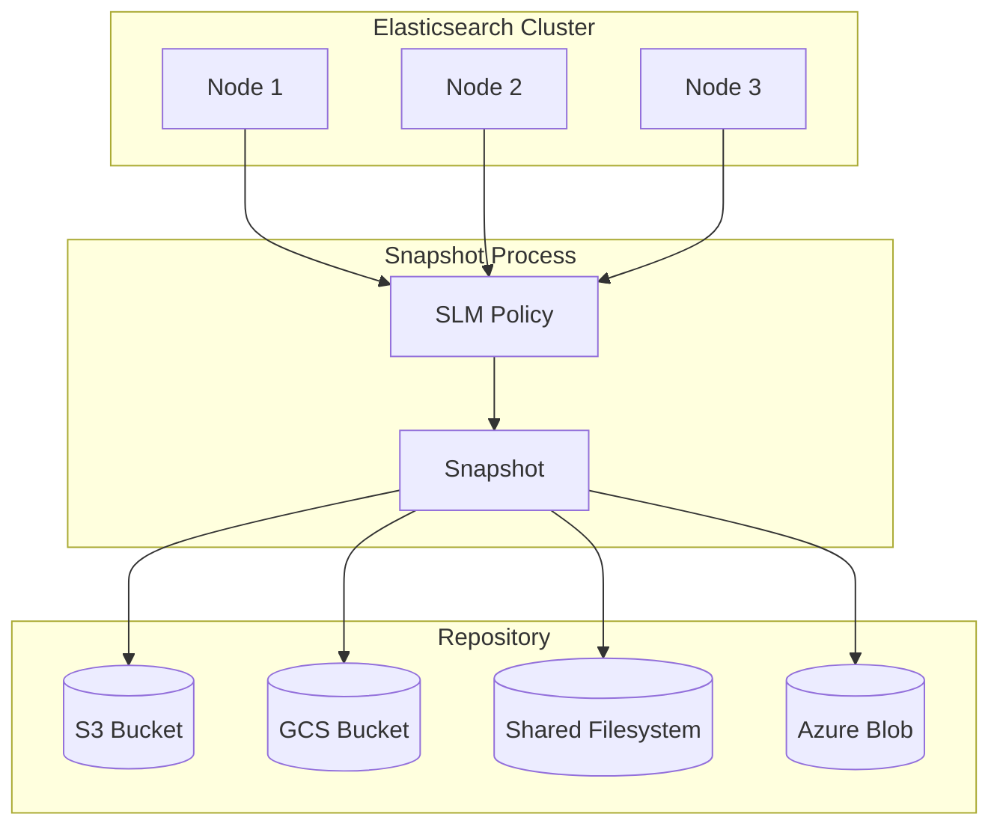
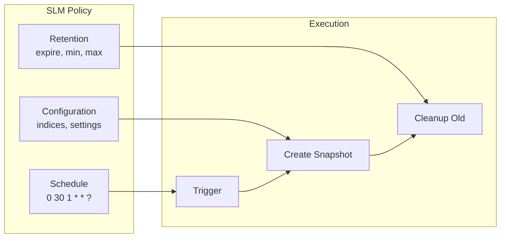
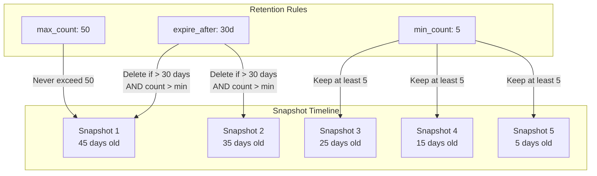
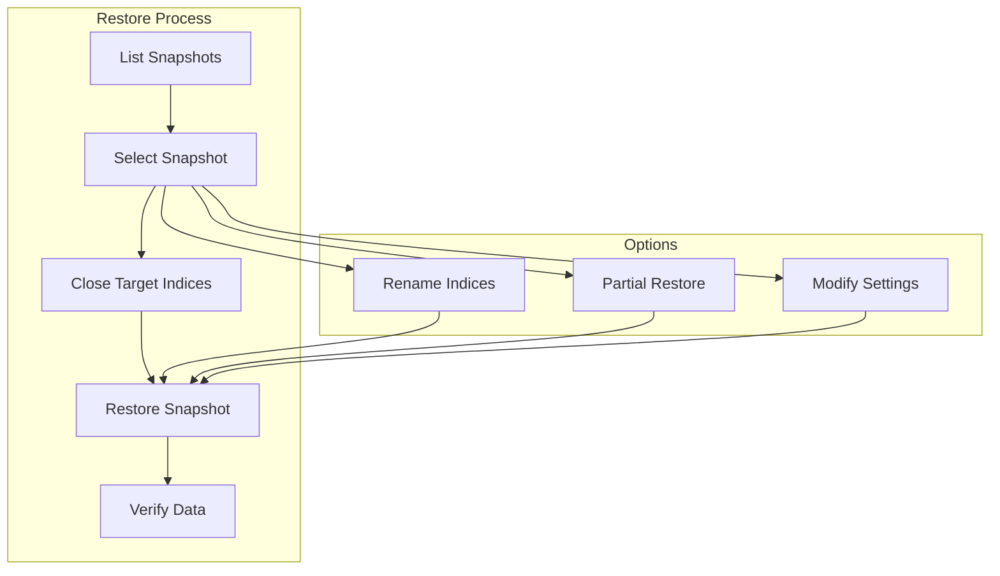
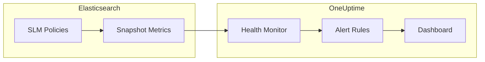

# How to Implement Elasticsearch Snapshot Lifecycle Management

Author: [nawazdhandala](https://www.github.com/nawazdhandala)

Tags: Elasticsearch, Snapshots, SLM, Backup, Disaster Recovery, Data Management, DevOps

Description: A comprehensive guide to implementing Elasticsearch Snapshot Lifecycle Management (SLM), covering snapshot repositories, automated policies, retention rules, and restore procedures for reliable data protection.

---

> "The question is not whether you will lose data, but when. The only defense is a well-tested backup strategy." - Unknown

Elasticsearch stores critical data that powers search, analytics, and observability systems. Losing this data can be catastrophic. Snapshot Lifecycle Management (SLM) automates the backup process, ensuring your indices are protected without manual intervention. This guide walks you through setting up a complete SLM strategy.

## Understanding Elasticsearch Snapshots

Snapshots are point-in-time copies of your Elasticsearch indices. They capture the state of your data and can be used for disaster recovery, data migration, or creating test environments.



Key benefits of SLM:

- **Automated snapshots** on a schedule you define
- **Retention policies** that automatically delete old snapshots
- **Centralized management** through Kibana or the REST API
- **Consistency** across your cluster without manual intervention

## Setting Up Snapshot Repositories

Before creating snapshots, you need to configure a repository where Elasticsearch will store them. Repositories can be on shared file systems, cloud storage (S3, GCS, Azure Blob), or HDFS.

### S3 Repository (AWS)

```bash
# First, install the S3 repository plugin on all nodes
# This step requires a cluster restart
bin/elasticsearch-plugin install repository-s3

# Add AWS credentials to the Elasticsearch keystore
# Run on each node in the cluster
bin/elasticsearch-keystore add s3.client.default.access_key
bin/elasticsearch-keystore add s3.client.default.secret_key
```

```json
// Register the S3 repository via the API
// PUT _snapshot/my-s3-repository
{
  "type": "s3",
  "settings": {
    "bucket": "my-elasticsearch-snapshots",
    "region": "us-east-1",
    "base_path": "production-cluster",
    "compress": true,
    "server_side_encryption": true,
    "storage_class": "standard_ia",
    "max_snapshot_bytes_per_sec": "100mb",
    "max_restore_bytes_per_sec": "100mb"
  }
}
```

### Google Cloud Storage Repository

```bash
# Install the GCS repository plugin on all nodes
bin/elasticsearch-plugin install repository-gcs

# Add service account credentials
bin/elasticsearch-keystore add-file gcs.client.default.credentials_file /path/to/service-account.json
```

```json
// Register the GCS repository
// PUT _snapshot/my-gcs-repository
{
  "type": "gcs",
  "settings": {
    "bucket": "my-elasticsearch-snapshots",
    "base_path": "production-cluster",
    "compress": true,
    "chunk_size": "100mb"
  }
}
```

### Azure Blob Storage Repository

```bash
# Install the Azure repository plugin on all nodes
bin/elasticsearch-plugin install repository-azure

# Add Azure credentials to keystore
bin/elasticsearch-keystore add azure.client.default.account
bin/elasticsearch-keystore add azure.client.default.key
```

```json
// Register the Azure repository
// PUT _snapshot/my-azure-repository
{
  "type": "azure",
  "settings": {
    "container": "elasticsearch-snapshots",
    "base_path": "production-cluster",
    "compress": true,
    "chunk_size": "100mb"
  }
}
```

### Shared Filesystem Repository

For on-premises deployments, use a shared filesystem mounted on all nodes. First, configure the `path.repo` setting in `elasticsearch.yml`:

```yaml
# elasticsearch.yml
# Define the base path for snapshot repositories
# This must be accessible by all nodes in the cluster
path.repo: ["/mnt/elasticsearch-backups"]
```

```json
// Register filesystem repository
// PUT _snapshot/my-fs-repository
{
  "type": "fs",
  "settings": {
    "location": "/mnt/elasticsearch-backups/snapshots",
    "compress": true,
    "chunk_size": "100mb",
    "max_snapshot_bytes_per_sec": "200mb",
    "max_restore_bytes_per_sec": "200mb"
  }
}
```

### Verifying Repository Configuration

```bash
# Verify the repository is accessible from all nodes
# POST _snapshot/my-s3-repository/_verify

# Expected response shows all nodes can access the repository
{
  "nodes": {
    "node-1": { "name": "es-node-1" },
    "node-2": { "name": "es-node-2" },
    "node-3": { "name": "es-node-3" }
  }
}
```

## Creating SLM Policies

SLM policies define when snapshots are taken, what indices to include, and how long to retain them.



### Daily Snapshot Policy

```json
// Create a daily snapshot policy
// PUT _slm/policy/daily-snapshots
{
  "schedule": "0 30 1 * * ?",
  "name": "<daily-snap-{now/d}>",
  "repository": "my-s3-repository",
  "config": {
    "indices": ["*"],
    "ignore_unavailable": true,
    "include_global_state": true,
    "partial": false,
    "metadata": {
      "taken_by": "slm",
      "policy": "daily-snapshots",
      "cluster": "production"
    }
  },
  "retention": {
    "expire_after": "30d",
    "min_count": 5,
    "max_count": 50
  }
}
```

The schedule uses cron syntax:
- `0 30 1 * * ?` - Run at 1:30 AM every day
- `0 0 2 ? * SUN` - Run at 2:00 AM every Sunday
- `0 0 */6 * * ?` - Run every 6 hours

### Hourly Snapshot Policy for Critical Indices

```json
// Create an hourly policy for critical indices
// PUT _slm/policy/hourly-critical
{
  "schedule": "0 0 * * * ?",
  "name": "<hourly-critical-{now/H}>",
  "repository": "my-s3-repository",
  "config": {
    "indices": [
      "transactions-*",
      "orders-*",
      "users"
    ],
    "ignore_unavailable": true,
    "include_global_state": false,
    "partial": false,
    "metadata": {
      "taken_by": "slm",
      "policy": "hourly-critical",
      "priority": "high"
    }
  },
  "retention": {
    "expire_after": "7d",
    "min_count": 24,
    "max_count": 168
  }
}
```

### Weekly Full Backup Policy

```json
// Create a weekly full backup policy
// PUT _slm/policy/weekly-full
{
  "schedule": "0 0 3 ? * SUN",
  "name": "<weekly-full-{now/w}>",
  "repository": "my-s3-repository",
  "config": {
    "indices": ["*"],
    "ignore_unavailable": true,
    "include_global_state": true,
    "partial": false,
    "feature_states": ["*"],
    "metadata": {
      "taken_by": "slm",
      "policy": "weekly-full",
      "type": "full-backup"
    }
  },
  "retention": {
    "expire_after": "365d",
    "min_count": 4,
    "max_count": 52
  }
}
```

### Cron Expression Reference

| Pattern | Cron Expression | Description |
|---------|-----------------|-------------|
| Every hour | `0 0 * * * ?` | Top of every hour |
| Every 6 hours | `0 0 */6 * * ?` | At 00:00, 06:00, 12:00, 18:00 |
| Daily at midnight | `0 0 0 * * ?` | Every day at 00:00 UTC |
| Daily at 2 AM | `0 0 2 * * ?` | Every day at 02:00 UTC |
| Weekly on Sunday | `0 0 2 ? * SUN` | Sundays at 02:00 UTC |
| Monthly | `0 0 2 1 * ?` | First day of month at 02:00 UTC |

## Understanding Retention Rules

Retention rules determine how long snapshots are kept and ensure you maintain the right balance between storage costs and recovery options.



### Retention Configuration Options

```json
// Retention with all options explained
{
  "retention": {
    // Delete snapshots older than this duration
    // Supports: d (days), h (hours), m (minutes), s (seconds)
    "expire_after": "30d",

    // Always keep at least this many snapshots
    // Prevents accidental deletion of all backups
    "min_count": 5,

    // Never keep more than this many snapshots
    // Controls storage costs
    "max_count": 50
  }
}
```

### How Retention Works

The retention process evaluates snapshots in this order:

1. If snapshot count exceeds `max_count`, delete oldest until at `max_count`
2. If snapshot is older than `expire_after` AND count is above `min_count`, delete it
3. Never delete below `min_count`, regardless of age

### Tiered Retention Strategy

```json
// Hourly snapshots - keep 24 hours
// PUT _slm/policy/tier-hourly
{
  "schedule": "0 0 * * * ?",
  "name": "<hourly-{now/H}>",
  "repository": "my-s3-repository",
  "config": {
    "indices": ["critical-*"],
    "ignore_unavailable": true,
    "include_global_state": false
  },
  "retention": {
    "expire_after": "24h",
    "min_count": 12,
    "max_count": 24
  }
}

// Daily snapshots - keep 30 days
// PUT _slm/policy/tier-daily
{
  "schedule": "0 0 2 * * ?",
  "name": "<daily-{now/d}>",
  "repository": "my-s3-repository",
  "config": {
    "indices": ["*"],
    "ignore_unavailable": true,
    "include_global_state": true
  },
  "retention": {
    "expire_after": "30d",
    "min_count": 7,
    "max_count": 30
  }
}

// Monthly snapshots - keep 1 year
// PUT _slm/policy/tier-monthly
{
  "schedule": "0 0 3 1 * ?",
  "name": "<monthly-{now/M}>",
  "repository": "my-archive-repository",
  "config": {
    "indices": ["*"],
    "ignore_unavailable": true,
    "include_global_state": true
  },
  "retention": {
    "expire_after": "365d",
    "min_count": 3,
    "max_count": 12
  }
}
```

### Manually Trigger Retention

```bash
# Execute retention for all policies immediately
# Useful after changing retention rules
# POST _slm/_execute_retention
```

## Managing SLM Policies

### Listing and Inspecting Policies

```bash
# List all SLM policies
# GET _slm/policy

# Get a specific policy
# GET _slm/policy/daily-snapshots

# Check policy execution status
# GET _slm/policy/daily-snapshots?human
```

```json
// Response shows policy details and execution history
{
  "daily-snapshots": {
    "version": 1,
    "modified_date_millis": 1706400000000,
    "policy": {
      "schedule": "0 30 1 * * ?",
      "name": "<daily-snap-{now/d}>",
      "repository": "my-s3-repository"
    },
    "last_success": {
      "snapshot_name": "daily-snap-2026.01.26",
      "time": 1706324400000
    },
    "last_failure": null,
    "next_execution_millis": 1706410200000,
    "stats": {
      "snapshots_taken": 30,
      "snapshots_failed": 0,
      "snapshots_deleted": 15,
      "snapshot_deletion_failures": 0
    }
  }
}
```

### Executing Policies Manually

```bash
# Trigger a policy manually (useful for testing)
# POST _slm/policy/daily-snapshots/_execute

# Response includes the snapshot name
{
  "snapshot_name": "daily-snap-2026.01.27-manual"
}
```

### Modifying Policies

```json
// Update an existing policy
// PUT _slm/policy/daily-snapshots
{
  "schedule": "0 0 2 * * ?",
  "name": "<daily-snap-{now/d}>",
  "repository": "my-s3-repository",
  "config": {
    "indices": ["*", "-.internal-*"],
    "ignore_unavailable": true,
    "include_global_state": true
  },
  "retention": {
    "expire_after": "45d",
    "min_count": 7,
    "max_count": 60
  }
}
```

### Deleting Policies

```bash
# Delete a policy (does not delete existing snapshots)
# DELETE _slm/policy/old-policy
```

## Restore Procedures

Restoring from snapshots is critical for disaster recovery. Practice these procedures regularly.



### Listing Available Snapshots

```bash
# List all snapshots in a repository
# GET _snapshot/my-s3-repository/*?verbose=false

# List snapshots matching a pattern
# GET _snapshot/my-s3-repository/daily-*

# Get detailed snapshot information
# GET _snapshot/my-s3-repository/daily-snap-2026.01.26
```

```json
// Detailed snapshot response
{
  "snapshots": [
    {
      "snapshot": "daily-snap-2026.01.26",
      "uuid": "abc123...",
      "version_id": 8090099,
      "version": "8.9.0",
      "indices": [
        "logs-2026.01.26",
        "metrics-2026.01.26",
        "users"
      ],
      "data_streams": [],
      "include_global_state": true,
      "state": "SUCCESS",
      "start_time": "2026-01-26T01:30:00.000Z",
      "end_time": "2026-01-26T01:45:00.000Z",
      "duration_in_millis": 900000,
      "failures": [],
      "shards": {
        "total": 15,
        "failed": 0,
        "successful": 15
      }
    }
  ]
}
```

### Full Restore

```json
// Restore all indices from a snapshot
// POST _snapshot/my-s3-repository/daily-snap-2026.01.26/_restore
{
  "indices": "*",
  "ignore_unavailable": true,
  "include_global_state": true,
  "include_aliases": true
}
```

### Partial Restore (Specific Indices)

```json
// Restore only specific indices
// POST _snapshot/my-s3-repository/daily-snap-2026.01.26/_restore
{
  "indices": [
    "users",
    "orders-2026.01.*"
  ],
  "ignore_unavailable": true,
  "include_global_state": false,
  "include_aliases": true
}
```

### Restore with Rename

```json
// Restore indices with new names (useful for testing)
// POST _snapshot/my-s3-repository/daily-snap-2026.01.26/_restore
{
  "indices": "users",
  "ignore_unavailable": true,
  "include_global_state": false,
  "rename_pattern": "(.+)",
  "rename_replacement": "restored_$1",
  "include_aliases": false
}
```

### Restore with Modified Settings

```json
// Restore with different replica count or other settings
// POST _snapshot/my-s3-repository/daily-snap-2026.01.26/_restore
{
  "indices": "logs-*",
  "ignore_unavailable": true,
  "include_global_state": false,
  "index_settings": {
    "index.number_of_replicas": 0
  },
  "ignore_index_settings": [
    "index.refresh_interval"
  ]
}
```

### Restore to Different Cluster

For disaster recovery to a new cluster:

```bash
# On the new cluster, register the same repository (read-only recommended)
# PUT _snapshot/recovery_repo
{
  "type": "s3",
  "settings": {
    "bucket": "my-elasticsearch-backups",
    "region": "us-east-1",
    "base_path": "production-cluster",
    "readonly": true
  }
}

# List available snapshots
# GET _snapshot/recovery_repo/_all

# Restore the desired snapshot
# POST _snapshot/recovery_repo/daily-snap-2026.01.26/_restore
```

### Monitoring Restore Progress

```bash
# Check restore status
# GET _recovery

# Filter by specific index
# GET logs-2026.01.26/_recovery
```

```json
// Recovery response shows progress
{
  "logs-2026.01.26": {
    "shards": [
      {
        "id": 0,
        "type": "SNAPSHOT",
        "stage": "INDEX",
        "primary": true,
        "start_time_in_millis": 1706400000000,
        "source": {
          "repository": "my-s3-repository",
          "snapshot": "daily-snap-2026.01.26"
        },
        "target": {
          "id": "node-1",
          "name": "es-node-1"
        },
        "index": {
          "size": {
            "total_in_bytes": 1073741824,
            "recovered_in_bytes": 536870912,
            "percent": "50.0%"
          },
          "files": {
            "total": 100,
            "recovered": 50,
            "percent": "50.0%"
          }
        }
      }
    ]
  }
}
```

### Disaster Recovery Script

```bash
#!/bin/bash
# elasticsearch-restore.sh
# Automated restore script for disaster recovery

set -e

# Configuration
ES_HOST="${ES_HOST:-localhost:9200}"
REPOSITORY="${REPOSITORY:-my-s3-repository}"
SNAPSHOT="${SNAPSHOT:-}"

# Function to list available snapshots
list_snapshots() {
    echo "=== Available Snapshots ==="
    curl -s -X GET "${ES_HOST}/_snapshot/${REPOSITORY}/*?verbose=false" | \
        jq -r '.snapshots[] | "\(.snapshot) - \(.state) - \(.start_time)"'
}

# Function to get latest successful snapshot
get_latest_snapshot() {
    curl -s -X GET "${ES_HOST}/_snapshot/${REPOSITORY}/*" | \
        jq -r '.snapshots | map(select(.state == "SUCCESS")) | sort_by(.start_time) | last | .snapshot'
}

# Function to restore snapshot
restore_snapshot() {
    local snapshot=$1
    local indices=${2:-"*"}

    echo "=== Restoring Snapshot: ${snapshot} ==="

    # Close indices that will be restored
    echo "Closing target indices..."
    curl -s -X POST "${ES_HOST}/${indices}/_close?ignore_unavailable=true"

    # Perform restore
    echo "Starting restore..."
    curl -s -X POST "${ES_HOST}/_snapshot/${REPOSITORY}/${snapshot}/_restore" \
        -H "Content-Type: application/json" \
        -d "{
            \"indices\": \"${indices}\",
            \"ignore_unavailable\": true,
            \"include_global_state\": true,
            \"include_aliases\": true
        }"

    # Monitor progress
    echo "Monitoring restore progress..."
    while true; do
        status=$(curl -s -X GET "${ES_HOST}/_recovery" | jq -r '.[] | .shards[] | select(.stage != "DONE") | .stage' | head -1)
        if [ -z "$status" ]; then
            echo "Restore complete!"
            break
        fi
        echo "Status: ${status}..."
        sleep 10
    done
}

# Main execution
if [ -z "$SNAPSHOT" ]; then
    echo "No snapshot specified, using latest..."
    SNAPSHOT=$(get_latest_snapshot)
fi

if [ -z "$SNAPSHOT" ]; then
    echo "ERROR: No snapshots found!"
    list_snapshots
    exit 1
fi

echo "Selected snapshot: ${SNAPSHOT}"
restore_snapshot "$SNAPSHOT"

echo "=== Restore Complete ==="
curl -s -X GET "${ES_HOST}/_cluster/health" | jq .
```

## Monitoring SLM with OneUptime

Monitoring your snapshot lifecycle is critical for ensuring backups are running successfully. [OneUptime](https://oneuptime.com) provides comprehensive monitoring for Elasticsearch clusters including SLM health.



Set up monitoring for:
- Snapshot success/failure rates
- Snapshot duration trends
- Repository storage usage
- Retention policy execution
- Cluster health during backups

With OneUptime, you can create custom alerts when snapshots fail, retention runs miss their schedule, or storage approaches capacity limits. This ensures you are always aware of your backup health status.

## SLM Statistics and Health

```bash
# Get SLM statistics
# GET _slm/stats
```

```json
// SLM statistics response
{
  "retention_runs": 150,
  "retention_failed": 0,
  "retention_timed_out": 0,
  "retention_deletion_time": "5.2s",
  "retention_deletion_time_millis": 5200,
  "total_snapshots_taken": 450,
  "total_snapshots_failed": 2,
  "total_snapshots_deleted": 300,
  "total_snapshot_deletion_failures": 0,
  "policy_stats": [
    {
      "policy": "daily-snapshots",
      "snapshots_taken": 150,
      "snapshots_failed": 1,
      "snapshots_deleted": 100,
      "snapshot_deletion_failures": 0
    }
  ]
}
```

## Best Practices

### Repository Configuration

1. **Use cloud storage for production**: S3, GCS, or Azure Blob provide durability and scalability
2. **Enable compression**: Reduces storage costs and transfer time
3. **Set appropriate rate limits**: Prevent snapshots from impacting cluster performance
4. **Use separate repositories for different retention tiers**: Archive vs. operational backups

### Policy Design

1. **Match RPO requirements**: If you can only lose 1 hour of data, snapshot hourly
2. **Stagger policy schedules**: Avoid running multiple policies simultaneously
3. **Use meaningful snapshot names**: Include date patterns for easy identification
4. **Include metadata**: Tag snapshots with cluster name, policy, and environment

### Retention Strategy

1. **Set min_count appropriately**: Ensure you always have recovery options
2. **Balance storage costs**: Longer retention means higher costs
3. **Consider compliance requirements**: Some data must be retained for specific periods
4. **Test retention regularly**: Verify old snapshots are being cleaned up

### Testing and Validation

1. **Test restores regularly**: Monthly restore tests to non-production environments
2. **Document procedures**: Maintain runbooks for disaster recovery
3. **Automate validation**: Script snapshot verification checks
4. **Monitor SLM health**: Alert on failed snapshots immediately

## Troubleshooting Common Issues

### Snapshot Failures

```bash
# Check snapshot status for errors
# GET _snapshot/my-s3-repository/failed-snapshot-name/_status

# Common causes:
# - Repository not accessible from all nodes
# - Insufficient permissions on storage
# - Index in red health state
# - Concurrent snapshot limit reached
```

### Slow Snapshots

```json
// Increase snapshot throughput
// PUT _cluster/settings
{
  "persistent": {
    "snapshot.max_concurrent_operations": 1000,
    "indices.recovery.max_bytes_per_sec": "200mb"
  }
}
```

### Repository Issues

```bash
# Verify repository from all nodes
# POST _snapshot/my-s3-repository/_verify

# Clean up orphaned data
# POST _snapshot/my-s3-repository/_cleanup
```

### Troubleshooting Reference

| Issue | Cause | Solution |
|-------|-------|----------|
| Snapshot stuck in IN_PROGRESS | Long-running or failed shard snapshots | Check `_snapshot/_status` for stuck shards |
| Repository verification fails | Permission or network issues | Check file system permissions or cloud IAM roles |
| Snapshot fails with partial shards | Some shards unavailable | Fix cluster health or use `partial: true` |
| Retention not deleting snapshots | min_count preventing deletion | Adjust min_count or manually delete |
| Restore fails with index exists | Target indices already exist | Delete indices first or use rename_pattern |

---

Elasticsearch Snapshot Lifecycle Management automates the critical task of data protection. With properly configured repositories, policies, and retention rules, you can ensure your data is always recoverable. Test your restore procedures regularly, monitor your SLM health with tools like [OneUptime](https://oneuptime.com), and sleep better knowing your Elasticsearch data is protected.
