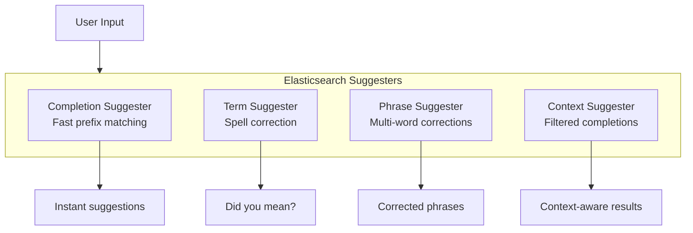
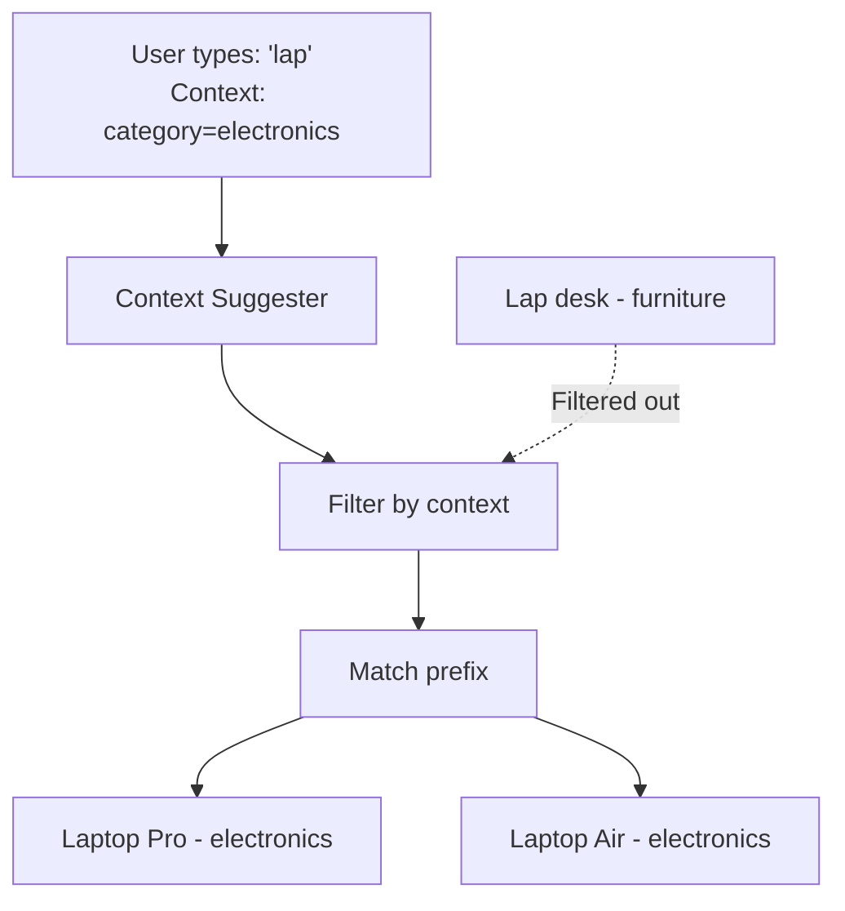
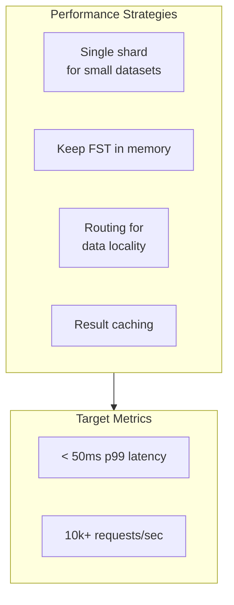

# How to Build Elasticsearch Suggester for Autocomplete

By [Nawaz Dhandala](https://github.com/nawazdhandala)

Tags: Elasticsearch, Autocomplete, Search, Suggester, Performance, Full-Text Search

Description: Learn how to build powerful autocomplete functionality using Elasticsearch suggesters including completion, term, phrase, and context suggesters with performance optimization techniques.

---

> "The best search is the one that anticipates what you're looking for before you finish typing." - Anonymous

Autocomplete has become an essential feature in modern applications. Users expect instant suggestions as they type, whether searching for products, users, or content. Elasticsearch provides several suggester types designed specifically for this purpose, each optimized for different use cases.

## Understanding Elasticsearch Suggesters

Elasticsearch offers four main types of suggesters:



Each suggester serves a specific purpose:

- **Completion Suggester**: Optimized for speed, uses an in-memory data structure (FST) for instant prefix matching
- **Term Suggester**: Provides spelling corrections based on edit distance
- **Phrase Suggester**: Corrects entire phrases while considering word proximity
- **Context Suggester**: Adds filtering capabilities to the completion suggester

## Completion Suggester

The completion suggester is the primary choice for autocomplete. It uses a Finite State Transducer (FST) stored in memory for extremely fast lookups.

### Setting Up the Index Mapping

First, create an index with a completion field type. The `completion` type enables the special data structure needed for fast prefix matching.

```json
// Create index with completion field
// The 'suggest' field uses the completion type for autocomplete
PUT /products
{
  "mappings": {
    "properties": {
      "name": {
        "type": "text"
      },
      "suggest": {
        "type": "completion",
        "analyzer": "simple",
        "preserve_separators": true,
        "preserve_position_increments": true,
        "max_input_length": 50
      }
    }
  }
}
```

### Indexing Documents with Suggestions

When indexing documents, you can provide multiple input variations and assign weights to prioritize certain suggestions.

```json
// Index a document with suggestion inputs
// Multiple inputs allow matching on different variations
// Weight determines priority in results (higher = more relevant)
POST /products/_doc/1
{
  "name": "Apple MacBook Pro 16-inch",
  "suggest": {
    "input": [
      "Apple MacBook Pro",
      "MacBook Pro 16",
      "MacBook Pro",
      "laptop"
    ],
    "weight": 10
  }
}

// Index another product with different weight
POST /products/_doc/2
{
  "name": "Apple MacBook Air M2",
  "suggest": {
    "input": [
      "Apple MacBook Air",
      "MacBook Air M2",
      "MacBook Air",
      "laptop"
    ],
    "weight": 8
  }
}
```

### Querying for Suggestions

The suggest query returns matching suggestions based on the user's prefix input.

```json
// Query for autocomplete suggestions
// 'prefix' is what the user has typed so far
// 'fuzzy' enables tolerance for typos
POST /products/_search
{
  "suggest": {
    "product-suggest": {
      "prefix": "macb",
      "completion": {
        "field": "suggest",
        "size": 5,
        "skip_duplicates": true,
        "fuzzy": {
          "fuzziness": "AUTO"
        }
      }
    }
  }
}
```

### Implementation in Node.js

Here is a complete implementation using the Elasticsearch JavaScript client.

```javascript
// elasticsearch-autocomplete.js
// Complete autocomplete implementation with Elasticsearch

const { Client } = require('@elastic/elasticsearch');

// Initialize the Elasticsearch client
// Configure with your cluster endpoint and credentials
const client = new Client({
  node: process.env.ELASTICSEARCH_URL || 'http://localhost:9200',
  auth: {
    apiKey: process.env.ELASTICSEARCH_API_KEY
  }
});

// Create index with optimized completion mapping
async function createProductIndex() {
  const indexExists = await client.indices.exists({ index: 'products' });

  if (indexExists) {
    console.log('Index already exists, skipping creation');
    return;
  }

  await client.indices.create({
    index: 'products',
    body: {
      settings: {
        // Optimize for autocomplete performance
        number_of_shards: 1,
        number_of_replicas: 1,
        // Use simple analyzer for better prefix matching
        analysis: {
          analyzer: {
            autocomplete_analyzer: {
              type: 'custom',
              tokenizer: 'standard',
              filter: ['lowercase', 'asciifolding']
            }
          }
        }
      },
      mappings: {
        properties: {
          name: { type: 'text' },
          category: { type: 'keyword' },
          price: { type: 'float' },
          suggest: {
            type: 'completion',
            analyzer: 'autocomplete_analyzer',
            // Preserve separators for multi-word matching
            preserve_separators: true,
            // Limit input length to prevent memory issues
            max_input_length: 50
          }
        }
      }
    }
  });

  console.log('Product index created successfully');
}

// Index a product with suggestion inputs
async function indexProduct(product) {
  // Generate multiple input variations for better matching
  const inputs = generateSuggestionInputs(product.name);

  await client.index({
    index: 'products',
    id: product.id,
    body: {
      name: product.name,
      category: product.category,
      price: product.price,
      suggest: {
        input: inputs,
        // Weight based on product popularity or relevance
        weight: product.popularity || 1
      }
    }
  });
}

// Generate multiple input variations for a product name
// This improves matching for different user search patterns
function generateSuggestionInputs(name) {
  const inputs = [name]; // Full name
  const words = name.split(' ');

  // Add individual words longer than 2 characters
  words.forEach(word => {
    if (word.length > 2) {
      inputs.push(word);
    }
  });

  // Add word combinations (first two words, last two words, etc.)
  if (words.length > 1) {
    inputs.push(words.slice(0, 2).join(' '));
    inputs.push(words.slice(-2).join(' '));
  }

  // Remove duplicates
  return [...new Set(inputs)];
}

// Get autocomplete suggestions
async function getAutocompleteSuggestions(prefix, options = {}) {
  const { size = 10, fuzzy = true, category = null } = options;

  const suggestQuery = {
    prefix: prefix,
    completion: {
      field: 'suggest',
      size: size,
      skip_duplicates: true
    }
  };

  // Enable fuzzy matching for typo tolerance
  if (fuzzy) {
    suggestQuery.completion.fuzzy = {
      fuzziness: 'AUTO',
      // Only apply fuzziness after first 2 characters
      prefix_length: 2
    };
  }

  const response = await client.search({
    index: 'products',
    body: {
      // Return source documents along with suggestions
      _source: ['name', 'category', 'price'],
      suggest: {
        'product-suggest': suggestQuery
      }
    }
  });

  // Extract and format suggestions
  const suggestions = response.suggest['product-suggest'][0].options;

  return suggestions.map(option => ({
    text: option.text,
    score: option._score,
    product: option._source
  }));
}

// Express route handler for autocomplete endpoint
async function autocompleteHandler(req, res) {
  try {
    const { q, size = 10 } = req.query;

    if (!q || q.length < 2) {
      return res.json({ suggestions: [] });
    }

    const suggestions = await getAutocompleteSuggestions(q, {
      size: parseInt(size),
      fuzzy: true
    });

    res.json({ suggestions });
  } catch (error) {
    console.error('Autocomplete error:', error);
    res.status(500).json({ error: 'Search failed' });
  }
}

module.exports = {
  createProductIndex,
  indexProduct,
  getAutocompleteSuggestions,
  autocompleteHandler
};
```

## Term Suggester

The term suggester provides "did you mean" functionality by finding similar terms based on edit distance.


### Setting Up Term Suggestions

```json
// Term suggester query
// Finds similar terms based on edit distance
// Useful for spell correction
POST /products/_search
{
  "suggest": {
    "spell-check": {
      "text": "macbok pro",
      "term": {
        "field": "name",
        "suggest_mode": "popular",
        "sort": "frequency",
        "string_distance": "internal",
        "max_edits": 2,
        "prefix_length": 2,
        "min_word_length": 3
      }
    }
  }
}
```

### Term Suggester Implementation

```javascript
// term-suggester.js
// Spell correction using term suggester

async function getSpellingSuggestions(text, field = 'name') {
  const response = await client.search({
    index: 'products',
    body: {
      suggest: {
        'spelling': {
          text: text,
          term: {
            field: field,
            // 'popular' suggests terms that appear more frequently
            suggest_mode: 'popular',
            // Sort by term frequency in the index
            sort: 'frequency',
            // Maximum edit distance (1 or 2)
            max_edits: 2,
            // Don't change first N characters
            prefix_length: 2,
            // Minimum word length to consider
            min_word_length: 3,
            // Minimum frequency in index to be considered
            min_doc_freq: 1
          }
        }
      }
    }
  });

  const suggestions = response.suggest.spelling;

  // Process each word's suggestions
  return suggestions.map(item => ({
    original: item.text,
    suggestions: item.options.map(opt => ({
      text: opt.text,
      score: opt.score,
      frequency: opt.freq
    }))
  }));
}

// Build corrected query from term suggestions
async function buildCorrectedQuery(query) {
  const suggestions = await getSpellingSuggestions(query);

  let correctedQuery = query;

  // Replace each misspelled word with best suggestion
  suggestions.forEach(item => {
    if (item.suggestions.length > 0) {
      const bestSuggestion = item.suggestions[0].text;
      correctedQuery = correctedQuery.replace(
        new RegExp(item.original, 'gi'),
        bestSuggestion
      );
    }
  });

  return {
    original: query,
    corrected: correctedQuery,
    wasModified: correctedQuery !== query
  };
}
```

## Phrase Suggester

The phrase suggester extends term suggestions to handle complete phrases, considering word order and collocation.

```json
// Phrase suggester query
// Corrects entire phrases while considering context
POST /products/_search
{
  "suggest": {
    "phrase-suggest": {
      "text": "macbok pro laptp",
      "phrase": {
        "field": "name.trigram",
        "size": 3,
        "gram_size": 3,
        "confidence": 1.0,
        "direct_generator": [
          {
            "field": "name.trigram",
            "suggest_mode": "always",
            "min_word_length": 3
          }
        ],
        "collate": {
          "query": {
            "source": {
              "match": {
                "name": "{{suggestion}}"
              }
            }
          },
          "prune": true
        }
      }
    }
  }
}
```

### Setting Up Trigram Analysis

For phrase suggestions to work well, you need trigram analysis in your mapping.

```json
// Index mapping with trigram analysis for phrase suggestions
PUT /products
{
  "settings": {
    "analysis": {
      "filter": {
        "trigram_filter": {
          "type": "ngram",
          "min_gram": 3,
          "max_gram": 3
        }
      },
      "analyzer": {
        "trigram_analyzer": {
          "type": "custom",
          "tokenizer": "standard",
          "filter": ["lowercase", "trigram_filter"]
        }
      }
    }
  },
  "mappings": {
    "properties": {
      "name": {
        "type": "text",
        "fields": {
          "trigram": {
            "type": "text",
            "analyzer": "trigram_analyzer"
          }
        }
      }
    }
  }
}
```

### Phrase Suggester Implementation

```javascript
// phrase-suggester.js
// Complete phrase correction

async function getPhraseSuggestions(text) {
  const response = await client.search({
    index: 'products',
    body: {
      suggest: {
        'phrase-correction': {
          text: text,
          phrase: {
            field: 'name.trigram',
            size: 5,
            // Gram size for n-gram analysis
            gram_size: 3,
            // Minimum score threshold
            confidence: 0.5,
            // Maximum errors per word
            max_errors: 2,
            // Generators find candidate corrections
            direct_generator: [
              {
                field: 'name.trigram',
                suggest_mode: 'always',
                min_word_length: 3
              }
            ],
            // Highlight differences
            highlight: {
              pre_tag: '<em>',
              post_tag: '</em>'
            },
            // Verify suggestions exist in index
            collate: {
              query: {
                source: {
                  match: {
                    name: '{{suggestion}}'
                  }
                }
              },
              // Include collate_match in response
              prune: true
            }
          }
        }
      }
    }
  });

  const phraseOptions = response.suggest['phrase-correction'][0].options;

  return phraseOptions.map(option => ({
    text: option.text,
    score: option.score,
    highlighted: option.highlighted,
    // Whether the suggestion matches documents
    existsInIndex: option.collate_match
  }));
}
```

## Context Suggester

The context suggester extends the completion suggester with filtering capabilities. This is useful when suggestions should depend on user context like location or category.



### Setting Up Context Mapping

```json
// Index with context-aware completion
PUT /products
{
  "mappings": {
    "properties": {
      "name": { "type": "text" },
      "category": { "type": "keyword" },
      "suggest": {
        "type": "completion",
        "contexts": [
          {
            "name": "category",
            "type": "category",
            "path": "category"
          },
          {
            "name": "location",
            "type": "geo",
            "path": "location",
            "precision": 4
          }
        ]
      }
    }
  }
}
```

### Indexing with Context

```json
// Index document with context
POST /products/_doc/1
{
  "name": "MacBook Pro 16-inch",
  "category": "electronics",
  "location": {
    "lat": 37.7749,
    "lon": -122.4194
  },
  "suggest": {
    "input": ["MacBook Pro", "laptop"],
    "contexts": {
      "category": ["electronics", "computers"],
      "location": {
        "lat": 37.7749,
        "lon": -122.4194
      }
    }
  }
}
```

### Context-Aware Autocomplete

```javascript
// context-suggester.js
// Autocomplete with category and geo filtering

async function getContextualSuggestions(prefix, context = {}) {
  const { category, location, radius = '10km' } = context;

  const suggestQuery = {
    prefix: prefix,
    completion: {
      field: 'suggest',
      size: 10,
      skip_duplicates: true,
      contexts: {}
    }
  };

  // Add category context if provided
  if (category) {
    suggestQuery.completion.contexts.category = [
      {
        context: category,
        // Boost matching category
        boost: 2
      }
    ];
  }

  // Add geo context if provided
  if (location) {
    suggestQuery.completion.contexts.location = [
      {
        context: location,
        // Match within precision level
        precision: 4,
        // Boost closer results
        boost: 1.5
      }
    ];
  }

  const response = await client.search({
    index: 'products',
    body: {
      _source: ['name', 'category', 'price'],
      suggest: {
        'contextual-suggest': suggestQuery
      }
    }
  });

  return response.suggest['contextual-suggest'][0].options.map(opt => ({
    text: opt.text,
    score: opt._score,
    product: opt._source,
    contexts: opt.contexts
  }));
}

// Express route with context from request
async function contextualAutocompleteHandler(req, res) {
  const { q, category, lat, lon } = req.query;

  if (!q || q.length < 2) {
    return res.json({ suggestions: [] });
  }

  const context = {};

  if (category) {
    context.category = category;
  }

  if (lat && lon) {
    context.location = {
      lat: parseFloat(lat),
      lon: parseFloat(lon)
    };
  }

  const suggestions = await getContextualSuggestions(q, context);
  res.json({ suggestions });
}
```

## Performance Optimization

Autocomplete must be fast - users expect results in under 100ms. Here are key optimization strategies.



### Index Configuration for Performance

```json
// Optimized index settings for autocomplete
PUT /products
{
  "settings": {
    "number_of_shards": 1,
    "number_of_replicas": 2,
    "refresh_interval": "5s",
    "index": {
      "max_result_window": 100
    }
  }
}
```

### Caching Layer Implementation

```javascript
// autocomplete-cache.js
// In-memory caching for autocomplete results

const NodeCache = require('node-cache');

// Cache with 5-minute TTL
const suggestionCache = new NodeCache({
  stdTTL: 300,
  checkperiod: 60,
  maxKeys: 10000
});

// Generate cache key from query parameters
function getCacheKey(prefix, context = {}) {
  const contextStr = JSON.stringify(context);
  return `suggest:${prefix.toLowerCase()}:${contextStr}`;
}

async function getCachedSuggestions(prefix, context, fetchFn) {
  const cacheKey = getCacheKey(prefix, context);

  // Check cache first
  const cached = suggestionCache.get(cacheKey);
  if (cached) {
    return { suggestions: cached, fromCache: true };
  }

  // Fetch from Elasticsearch
  const suggestions = await fetchFn(prefix, context);

  // Cache the results
  suggestionCache.set(cacheKey, suggestions);

  return { suggestions, fromCache: false };
}

// Warm cache with popular prefixes
async function warmCache(popularPrefixes, fetchFn) {
  console.log(`Warming cache with ${popularPrefixes.length} prefixes`);

  for (const prefix of popularPrefixes) {
    await getCachedSuggestions(prefix, {}, fetchFn);
  }

  console.log('Cache warming complete');
}

// Invalidate cache when data changes
function invalidateCache(pattern = null) {
  if (pattern) {
    // Invalidate matching keys
    const keys = suggestionCache.keys();
    keys.forEach(key => {
      if (key.includes(pattern)) {
        suggestionCache.del(key);
      }
    });
  } else {
    // Clear all
    suggestionCache.flushAll();
  }
}
```

### Bulk Indexing for Performance

```javascript
// bulk-indexer.js
// Efficient bulk indexing for large datasets

async function bulkIndexProducts(products, batchSize = 1000) {
  const batches = [];

  // Split into batches
  for (let i = 0; i < products.length; i += batchSize) {
    batches.push(products.slice(i, i + batchSize));
  }

  let indexed = 0;

  for (const batch of batches) {
    const operations = batch.flatMap(product => {
      const inputs = generateSuggestionInputs(product.name);

      return [
        { index: { _index: 'products', _id: product.id } },
        {
          name: product.name,
          category: product.category,
          price: product.price,
          suggest: {
            input: inputs,
            weight: product.popularity || 1
          }
        }
      ];
    });

    const response = await client.bulk({
      refresh: false,
      operations
    });

    if (response.errors) {
      const erroredDocs = response.items.filter(item => item.index.error);
      console.error(`Errors indexing ${erroredDocs.length} documents`);
    }

    indexed += batch.length;
    console.log(`Indexed ${indexed}/${products.length} products`);
  }

  // Refresh after all batches
  await client.indices.refresh({ index: 'products' });

  console.log(`Bulk indexing complete: ${indexed} products`);
}
```

### Query-Time Optimizations

```javascript
// optimized-autocomplete.js
// Query optimizations for low latency

async function getOptimizedSuggestions(prefix, options = {}) {
  const {
    size = 10,
    fuzzy = true,
    timeout = '50ms'
  } = options;

  // Short-circuit for very short prefixes
  if (prefix.length < 2) {
    return [];
  }

  const suggestQuery = {
    prefix: prefix,
    completion: {
      field: 'suggest',
      size: size,
      skip_duplicates: true
    }
  };

  // Only enable fuzzy for longer prefixes
  // Fuzzy matching is more expensive
  if (fuzzy && prefix.length >= 3) {
    suggestQuery.completion.fuzzy = {
      fuzziness: prefix.length < 5 ? 1 : 'AUTO',
      prefix_length: 2,
      transpositions: true
    };
  }

  try {
    const response = await client.search({
      index: 'products',
      // Timeout prevents slow queries
      timeout: timeout,
      // Only return needed fields
      _source: ['name', 'category'],
      body: {
        suggest: {
          'suggestions': suggestQuery
        }
      }
    });

    return response.suggest.suggestions[0].options.map(opt => ({
      text: opt.text,
      product: opt._source
    }));
  } catch (error) {
    if (error.meta?.body?.timed_out) {
      console.warn('Autocomplete query timed out');
      return [];
    }
    throw error;
  }
}
```

## Complete API Implementation

Here is a complete Express.js API combining all suggester types.

```javascript
// autocomplete-api.js
// Complete autocomplete API with all suggester types

const express = require('express');
const { Client } = require('@elastic/elasticsearch');

const app = express();
const client = new Client({ node: process.env.ELASTICSEARCH_URL });

// Middleware for request timing
app.use((req, res, next) => {
  req.startTime = Date.now();
  res.on('finish', () => {
    const duration = Date.now() - req.startTime;
    if (duration > 100) {
      console.warn(`Slow autocomplete: ${duration}ms for ${req.url}`);
    }
  });
  next();
});

// Main autocomplete endpoint
app.get('/api/autocomplete', async (req, res) => {
  const { q, category, type = 'completion' } = req.query;

  if (!q || q.length < 2) {
    return res.json({ suggestions: [] });
  }

  try {
    let suggestions;

    switch (type) {
      case 'completion':
        suggestions = await getCompletionSuggestions(q, { category });
        break;
      case 'term':
        suggestions = await getTermSuggestions(q);
        break;
      case 'phrase':
        suggestions = await getPhraseSuggestions(q);
        break;
      default:
        suggestions = await getCompletionSuggestions(q, { category });
    }

    res.json({
      query: q,
      suggestions,
      took: Date.now() - req.startTime
    });
  } catch (error) {
    console.error('Autocomplete error:', error);
    res.status(500).json({ error: 'Search failed' });
  }
});

// Health check endpoint
app.get('/api/autocomplete/health', async (req, res) => {
  try {
    const health = await client.cluster.health();
    res.json({
      status: 'ok',
      elasticsearch: health.status
    });
  } catch (error) {
    res.status(503).json({ status: 'error', message: error.message });
  }
});

const PORT = process.env.PORT || 3000;
app.listen(PORT, () => {
  console.log(`Autocomplete API running on port ${PORT}`);
});
```

## Monitoring Your Autocomplete

Monitor your Elasticsearch autocomplete performance with [OneUptime](https://oneuptime.com). Track query latency, error rates, and throughput to ensure your users get instant suggestions. OneUptime provides real-time alerting when autocomplete performance degrades, helping you maintain the sub-100ms response times users expect.

## Summary

| Suggester Type | Use Case | Performance |
|----------------|----------|-------------|
| **Completion** | Fast prefix autocomplete | In-memory FST, fastest |
| **Term** | Spell correction | Edit distance calculation |
| **Phrase** | Multi-word correction | N-gram analysis |
| **Context** | Filtered autocomplete | Completion + filtering |

Key takeaways:

1. **Use completion suggester** for primary autocomplete - it is optimized for speed
2. **Add fuzzy matching** for typo tolerance, but only after minimum prefix length
3. **Use context suggester** when results should depend on user context
4. **Cache aggressively** - autocomplete queries are highly repetitive
5. **Monitor performance** - users expect results in under 100ms

Building effective autocomplete requires choosing the right suggester type for your use case and optimizing at every level from index configuration to query-time caching.
