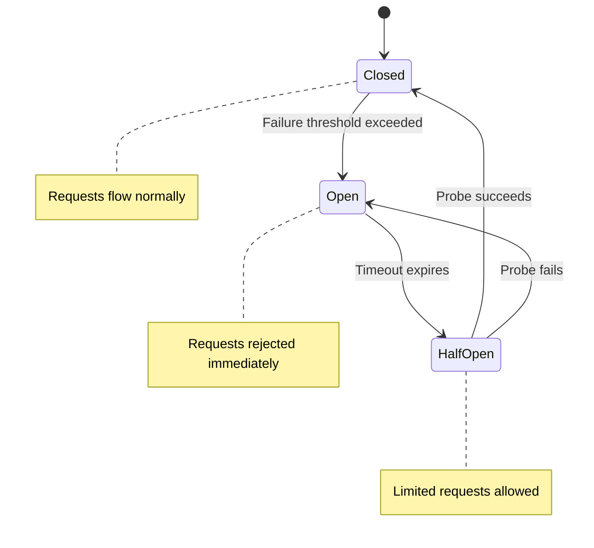
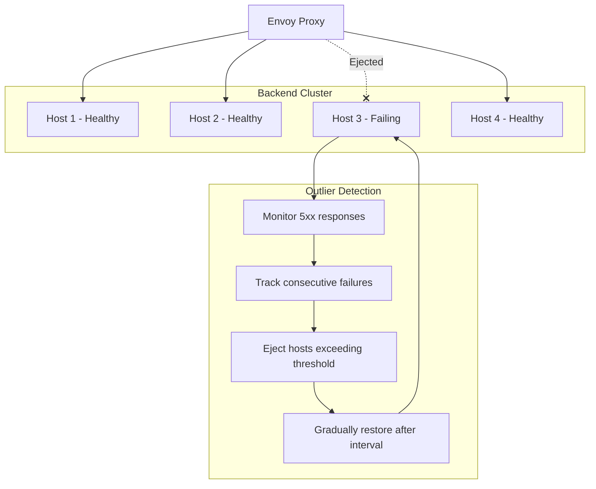
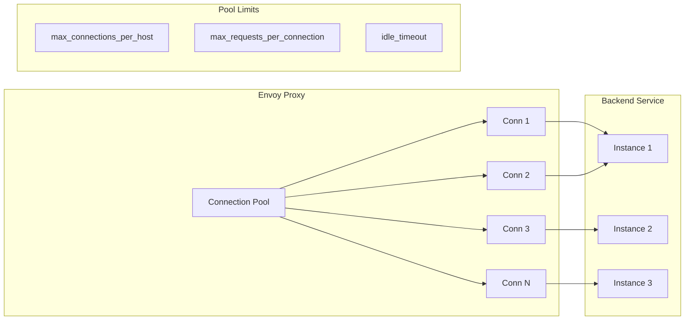
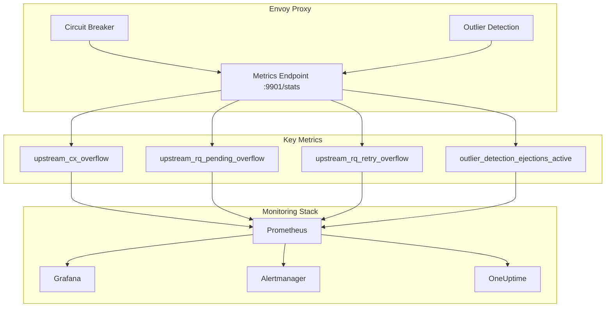

# How to Implement Envoy Circuit Breaker

Author: [nawazdhandala](https://www.github.com/nawazdhandala)

Tags: Envoy, Circuit Breaker, Resilience, Service Mesh, Microservices, DevOps, Observability, Istio

Description: A comprehensive guide to implementing circuit breakers in Envoy Proxy, covering circuit breaker settings, outlier detection, connection pool configuration, and monitoring strategies for building resilient microservices.

---

> "The circuit breaker pattern is the electrical equivalent of the fail-fast principle: when a service is failing, stop sending it traffic before the failure cascades to the entire system." - Release It! by Michael Nygard

Circuit breakers are essential for building resilient distributed systems. When a downstream service becomes unhealthy, continuing to send requests can exhaust resources, increase latency, and cause cascading failures across your entire infrastructure. Envoy Proxy provides powerful circuit breaking capabilities that can protect your services automatically.

## Understanding Circuit Breakers

A circuit breaker monitors the health of downstream services and "trips" when failures exceed a threshold. Once tripped, requests are immediately rejected without attempting the downstream call, allowing the failing service time to recover.



### Why Envoy for Circuit Breaking?

Envoy operates as a sidecar proxy, handling all network traffic for your services. This position makes it ideal for implementing circuit breaking:

- **Language agnostic** - Works with any application regardless of programming language
- **Transparent** - No code changes required in your services
- **Centralized configuration** - Manage circuit breaker policies across your mesh
- **Rich metrics** - Built-in observability for circuit breaker state

## Circuit Breaker Settings

Envoy's circuit breaker configuration lives in the cluster definition. These settings control connection and request limits.

### Basic Circuit Breaker Configuration

```yaml
# envoy.yaml - Basic circuit breaker configuration
static_resources:
  clusters:
    - name: backend_service
      connect_timeout: 5s
      type: STRICT_DNS
      lb_policy: ROUND_ROBIN

      # Circuit breaker thresholds define the limits before
      # Envoy starts rejecting requests
      circuit_breakers:
        thresholds:
          - priority: DEFAULT
            # Maximum number of concurrent connections
            # to this cluster. Once exceeded, new connections
            # are rejected with 503.
            max_connections: 100

            # Maximum number of pending requests waiting
            # for a connection. Prevents queue buildup
            # when the cluster is slow.
            max_pending_requests: 100

            # Maximum number of concurrent requests to
            # all hosts in the cluster. Key limit for
            # protecting downstream services.
            max_requests: 1000

            # Maximum number of concurrent retries
            # across all hosts. Prevents retry storms
            # from overwhelming recovering services.
            max_retries: 3

      load_assignment:
        cluster_name: backend_service
        endpoints:
          - lb_endpoints:
              - endpoint:
                  address:
                    socket_address:
                      address: backend.default.svc.cluster.local
                      port_value: 8080
```

### Priority-Based Thresholds

Envoy supports different thresholds for high and default priority traffic, allowing critical requests to proceed even when normal traffic is being limited.

```yaml
# envoy.yaml - Priority-based circuit breaker configuration
circuit_breakers:
  thresholds:
    # Default priority handles normal traffic
    - priority: DEFAULT
      max_connections: 100
      max_pending_requests: 100
      max_requests: 1000
      max_retries: 3

    # High priority for critical traffic (health checks, admin)
    # These limits are separate from default priority
    - priority: HIGH
      max_connections: 50
      max_pending_requests: 50
      max_requests: 500
      max_retries: 3
```

### Connection Timeout Configuration

```yaml
# envoy.yaml - Complete timeout and circuit breaker setup
clusters:
  - name: backend_service
    # Time to establish a new connection
    connect_timeout: 5s

    # HTTP protocol options with additional timeouts
    typed_extension_protocol_options:
      envoy.extensions.upstreams.http.v3.HttpProtocolOptions:
        "@type": type.googleapis.com/envoy.extensions.upstreams.http.v3.HttpProtocolOptions
        common_http_protocol_options:
          # Maximum time a connection can be idle
          # before being closed
          idle_timeout: 300s

        explicit_http_config:
          http_protocol_options:
            # Enable connection keepalives
            enable_trailers: true

    circuit_breakers:
      thresholds:
        - priority: DEFAULT
          max_connections: 100
          max_pending_requests: 100
          max_requests: 1000
          max_retries: 3

          # Track remaining capacity for observability
          track_remaining: true

          # Budget-based retries (percentage of active requests)
          retry_budget:
            budget_percent:
              value: 20.0
            min_retry_concurrency: 5
```

## Outlier Detection

While circuit breaker thresholds limit resource consumption, outlier detection identifies unhealthy hosts and removes them from the load balancing pool. This is Envoy's implementation of the "eject unhealthy hosts" pattern.



### Configuring Outlier Detection

```yaml
# envoy.yaml - Outlier detection configuration
clusters:
  - name: backend_service
    connect_timeout: 5s
    type: STRICT_DNS
    lb_policy: ROUND_ROBIN

    # Outlier detection monitors host health and
    # removes unhealthy hosts from load balancing
    outlier_detection:
      # Number of consecutive 5xx errors before
      # a host is ejected from the cluster
      consecutive_5xx: 5

      # How often the outlier detection algorithm runs
      # Lower values detect failures faster but increase CPU
      interval: 10s

      # Minimum time a host remains ejected
      # Actual ejection time = base * (num_ejections)
      base_ejection_time: 30s

      # Maximum percentage of hosts that can be ejected
      # Prevents complete cluster unavailability
      max_ejection_percent: 50

      # Include success rate outlier detection
      # Hosts with significantly lower success rate are ejected
      enforcing_success_rate: 100

      # Minimum number of hosts needed to perform
      # success rate outlier detection
      success_rate_minimum_hosts: 3

      # Number of requests needed before host is considered
      # for success rate outlier detection
      success_rate_request_volume: 100

      # Standard deviation factor for success rate.
      # Host is outlier if its success rate is more than
      # (mean - stdev_factor * stdev) of the aggregate
      success_rate_stdev_factor: 1900

      # Also detect consecutive gateway errors (502, 503, 504)
      consecutive_gateway_failure: 5

      # Eject hosts on consecutive local origin failures
      # (connection errors, timeouts)
      consecutive_local_origin_failure: 5

      # Percentage of time outlier detection is enforced
      # for consecutive 5xx failures (100 = always enforced)
      enforcing_consecutive_5xx: 100

      # Percentage for consecutive gateway failures
      enforcing_consecutive_gateway_failure: 100

      # Percentage for local origin failures
      enforcing_consecutive_local_origin_failure: 100
```

### Advanced Outlier Detection Patterns

```yaml
# envoy.yaml - Advanced outlier detection for different failure modes
clusters:
  - name: critical_service
    outlier_detection:
      # Aggressive detection for critical services
      consecutive_5xx: 3
      interval: 5s
      base_ejection_time: 60s
      max_ejection_percent: 30

      # Failure percentage threshold
      # Eject if more than 5% of requests fail
      failure_percentage_threshold: 5
      failure_percentage_minimum_hosts: 3
      failure_percentage_request_volume: 50
      enforcing_failure_percentage: 100

      # Split external and local failures
      # External = 5xx from upstream
      # Local = connection failures, timeouts
      split_external_local_origin_errors: true

      # Maximum ejection time cap (in seconds)
      # Prevents hosts from being ejected forever
      max_ejection_time: 300s

      # Time interval for ejection time increase
      # Ejection time grows with consecutive ejections
      # up to max_ejection_time
      successful_active_health_check_uneject_host: true
```

## Connection Pools

Connection pool configuration determines how Envoy manages connections to upstream services. Proper tuning prevents connection exhaustion and improves performance.



### HTTP/1.1 Connection Pool

```yaml
# envoy.yaml - HTTP/1.1 connection pool configuration
clusters:
  - name: http1_backend
    connect_timeout: 5s
    type: STRICT_DNS
    lb_policy: ROUND_ROBIN

    # Circuit breakers control overall limits
    circuit_breakers:
      thresholds:
        - priority: DEFAULT
          max_connections: 100
          max_pending_requests: 100
          max_requests: 1000
          max_retries: 3

    # HTTP protocol options for connection management
    typed_extension_protocol_options:
      envoy.extensions.upstreams.http.v3.HttpProtocolOptions:
        "@type": type.googleapis.com/envoy.extensions.upstreams.http.v3.HttpProtocolOptions

        explicit_http_config:
          http_protocol_options:
            # Accept HTTP/1.0 responses (for legacy services)
            accept_http_10: true

        common_http_protocol_options:
          # Close connection after this many seconds idle
          idle_timeout: 300s

          # Maximum number of requests per connection
          # After this limit, connection is closed and reopened
          # Helps with load balancing and memory leaks
          max_requests_per_connection: 1000

    # Per-host connection limits
    # These apply to each upstream host individually
    upstream_connection_options:
      tcp_keepalive:
        # Enable TCP keepalives to detect dead connections
        keepalive_probes: 3
        keepalive_time: 60
        keepalive_interval: 10
```

### HTTP/2 Connection Pool

```yaml
# envoy.yaml - HTTP/2 connection pool configuration
clusters:
  - name: http2_backend
    connect_timeout: 5s
    type: STRICT_DNS
    lb_policy: ROUND_ROBIN
    http2_protocol_options: {}

    circuit_breakers:
      thresholds:
        - priority: DEFAULT
          # For HTTP/2, max_connections is less important
          # since multiple requests multiplex over fewer connections
          max_connections: 10
          max_pending_requests: 1000
          # max_requests is the key limit for HTTP/2
          max_requests: 10000
          max_retries: 3

    typed_extension_protocol_options:
      envoy.extensions.upstreams.http.v3.HttpProtocolOptions:
        "@type": type.googleapis.com/envoy.extensions.upstreams.http.v3.HttpProtocolOptions

        explicit_http_config:
          http2_protocol_options:
            # Maximum concurrent streams per connection
            # Each stream handles one request/response
            max_concurrent_streams: 100

            # Initial stream window size (flow control)
            initial_stream_window_size: 65536

            # Initial connection window size
            initial_connection_window_size: 1048576

        common_http_protocol_options:
          idle_timeout: 300s

          # For HTTP/2, this limits streams over the
          # connection lifetime, not concurrent streams
          max_requests_per_connection: 10000
```

### gRPC Connection Pool

```yaml
# envoy.yaml - gRPC-specific connection pool configuration
clusters:
  - name: grpc_backend
    connect_timeout: 5s
    type: STRICT_DNS
    lb_policy: ROUND_ROBIN
    http2_protocol_options: {}

    # gRPC uses HTTP/2, so similar tuning applies
    circuit_breakers:
      thresholds:
        - priority: DEFAULT
          max_connections: 10
          max_pending_requests: 1000
          max_requests: 10000
          max_retries: 3

    typed_extension_protocol_options:
      envoy.extensions.upstreams.http.v3.HttpProtocolOptions:
        "@type": type.googleapis.com/envoy.extensions.upstreams.http.v3.HttpProtocolOptions

        explicit_http_config:
          http2_protocol_options:
            max_concurrent_streams: 100

            # Allow CONNECT for gRPC-Web
            allow_connect: true

        common_http_protocol_options:
          idle_timeout: 3600s

          # gRPC often uses long-lived connections
          # Set higher or remove limit
          max_requests_per_connection: 0

    # Health checking for gRPC
    health_checks:
      - timeout: 5s
        interval: 10s
        unhealthy_threshold: 3
        healthy_threshold: 1
        grpc_health_check:
          service_name: "backend.health.v1.HealthService"
```

## Monitoring Circuit State

Monitoring circuit breaker state is crucial for understanding system health and tuning thresholds. Envoy exposes detailed metrics for circuit breakers.



### Prometheus Configuration

```yaml
# prometheus.yml - Scrape Envoy metrics
scrape_configs:
  - job_name: 'envoy'
    metrics_path: /stats/prometheus
    static_configs:
      - targets: ['envoy:9901']

    # Relabel to add cluster information
    relabel_configs:
      - source_labels: [__address__]
        target_label: instance
      - source_labels: [__address__]
        regex: '([^:]+):\d+'
        target_label: host
```

### Key Circuit Breaker Metrics

```bash
# Query Envoy stats endpoint for circuit breaker metrics
curl http://localhost:9901/stats | grep circuit

# Key metrics to monitor:

# Connection overflow - requests rejected due to max_connections
envoy_cluster_upstream_cx_overflow{cluster_name="backend_service"}

# Pending request overflow - rejected due to max_pending_requests
envoy_cluster_upstream_rq_pending_overflow{cluster_name="backend_service"}

# Request overflow - rejected due to max_requests
envoy_cluster_upstream_rq_retry_overflow{cluster_name="backend_service"}

# Retry overflow - retries rejected due to max_retries
envoy_cluster_upstream_rq_retry_overflow{cluster_name="backend_service"}

# Current number of active connections
envoy_cluster_upstream_cx_active{cluster_name="backend_service"}

# Current pending requests
envoy_cluster_upstream_rq_pending_active{cluster_name="backend_service"}

# Current active requests
envoy_cluster_upstream_rq_active{cluster_name="backend_service"}
```

### Outlier Detection Metrics

```bash
# Query outlier detection metrics
curl http://localhost:9901/stats | grep outlier

# Currently ejected hosts
envoy_cluster_outlier_detection_ejections_active{cluster_name="backend_service"}

# Total ejections (counter)
envoy_cluster_outlier_detection_ejections_total{cluster_name="backend_service"}

# Consecutive 5xx ejections
envoy_cluster_outlier_detection_ejections_enforced_consecutive_5xx{cluster_name="backend_service"}

# Success rate ejections
envoy_cluster_outlier_detection_ejections_enforced_success_rate{cluster_name="backend_service"}

# Failure percentage ejections
envoy_cluster_outlier_detection_ejections_enforced_failure_percentage{cluster_name="backend_service"}

# Local origin failure ejections
envoy_cluster_outlier_detection_ejections_enforced_consecutive_local_origin_failure{cluster_name="backend_service"}
```

### Grafana Dashboard Queries

```promql
# Circuit breaker overflow rate (requests rejected per second)
sum(rate(envoy_cluster_upstream_cx_overflow{cluster_name="backend_service"}[5m]))
+ sum(rate(envoy_cluster_upstream_rq_pending_overflow{cluster_name="backend_service"}[5m]))

# Connection pool utilization percentage
(
  sum(envoy_cluster_upstream_cx_active{cluster_name="backend_service"})
  /
  sum(envoy_cluster_circuit_breakers_default_cx_open{cluster_name="backend_service"})
) * 100

# Outlier ejection rate
sum(rate(envoy_cluster_outlier_detection_ejections_total{cluster_name="backend_service"}[5m]))

# Percentage of hosts currently ejected
(
  sum(envoy_cluster_outlier_detection_ejections_active{cluster_name="backend_service"})
  /
  sum(envoy_cluster_membership_total{cluster_name="backend_service"})
) * 100

# Request success rate by cluster
(
  sum(rate(envoy_cluster_upstream_rq_xx{cluster_name="backend_service",response_code_class="2"}[5m]))
  /
  sum(rate(envoy_cluster_upstream_rq_total{cluster_name="backend_service"}[5m]))
) * 100
```

### Alerting Rules

```yaml
# prometheus-alerts.yaml - Circuit breaker alerts
groups:
  - name: envoy_circuit_breaker
    rules:
      # Alert when circuit breaker is rejecting requests
      - alert: EnvoyCircuitBreakerTripped
        expr: |
          sum(rate(envoy_cluster_upstream_cx_overflow[5m])) by (cluster_name) > 0
          or sum(rate(envoy_cluster_upstream_rq_pending_overflow[5m])) by (cluster_name) > 0
        for: 1m
        labels:
          severity: warning
        annotations:
          summary: "Circuit breaker tripped for {{ $labels.cluster_name }}"
          description: "Envoy is rejecting requests to {{ $labels.cluster_name }} due to circuit breaker limits."

      # Alert when too many hosts are ejected
      - alert: EnvoyHighEjectionRate
        expr: |
          (
            sum(envoy_cluster_outlier_detection_ejections_active) by (cluster_name)
            /
            sum(envoy_cluster_membership_total) by (cluster_name)
          ) > 0.3
        for: 2m
        labels:
          severity: critical
        annotations:
          summary: "High host ejection rate for {{ $labels.cluster_name }}"
          description: "More than 30% of hosts are ejected from {{ $labels.cluster_name }}. Service may be degraded."

      # Alert on sustained retry overflow
      - alert: EnvoyRetryOverflow
        expr: |
          sum(rate(envoy_cluster_upstream_rq_retry_overflow[5m])) by (cluster_name) > 10
        for: 5m
        labels:
          severity: warning
        annotations:
          summary: "Retry overflow for {{ $labels.cluster_name }}"
          description: "Retries are being rejected for {{ $labels.cluster_name }}. Consider increasing max_retries or investigating upstream issues."
```

## Complete Configuration Example

Here is a production-ready Envoy configuration combining all circuit breaker features.

```yaml
# envoy-production.yaml - Complete circuit breaker configuration
admin:
  address:
    socket_address:
      address: 0.0.0.0
      port_value: 9901

static_resources:
  listeners:
    - name: http_listener
      address:
        socket_address:
          address: 0.0.0.0
          port_value: 8080
      filter_chains:
        - filters:
            - name: envoy.filters.network.http_connection_manager
              typed_config:
                "@type": type.googleapis.com/envoy.extensions.filters.network.http_connection_manager.v3.HttpConnectionManager
                stat_prefix: ingress_http
                codec_type: AUTO

                route_config:
                  name: local_route
                  virtual_hosts:
                    - name: backend
                      domains: ["*"]
                      routes:
                        - match:
                            prefix: "/api"
                          route:
                            cluster: api_service
                            # Per-route timeout
                            timeout: 30s
                            retry_policy:
                              retry_on: "5xx,reset,connect-failure"
                              num_retries: 3
                              per_try_timeout: 10s
                              retry_host_predicate:
                                - name: envoy.retry_host_predicates.previous_hosts
                              host_selection_retry_max_attempts: 3

                http_filters:
                  - name: envoy.filters.http.router
                    typed_config:
                      "@type": type.googleapis.com/envoy.extensions.filters.http.router.v3.Router

  clusters:
    - name: api_service
      connect_timeout: 5s
      type: STRICT_DNS
      lb_policy: ROUND_ROBIN

      # Circuit breaker configuration
      circuit_breakers:
        thresholds:
          - priority: DEFAULT
            max_connections: 100
            max_pending_requests: 100
            max_requests: 1000
            max_retries: 10
            track_remaining: true
            retry_budget:
              budget_percent:
                value: 25.0
              min_retry_concurrency: 5

          - priority: HIGH
            max_connections: 50
            max_pending_requests: 50
            max_requests: 500
            max_retries: 5

      # Outlier detection for automatic host ejection
      outlier_detection:
        consecutive_5xx: 5
        consecutive_gateway_failure: 5
        consecutive_local_origin_failure: 5
        interval: 10s
        base_ejection_time: 30s
        max_ejection_percent: 50
        max_ejection_time: 300s

        # Success rate outlier detection
        enforcing_success_rate: 100
        success_rate_minimum_hosts: 3
        success_rate_request_volume: 100
        success_rate_stdev_factor: 1900

        # Split error tracking
        split_external_local_origin_errors: true
        enforcing_consecutive_5xx: 100
        enforcing_consecutive_gateway_failure: 100
        enforcing_consecutive_local_origin_failure: 100

      # Connection pool settings
      typed_extension_protocol_options:
        envoy.extensions.upstreams.http.v3.HttpProtocolOptions:
          "@type": type.googleapis.com/envoy.extensions.upstreams.http.v3.HttpProtocolOptions
          common_http_protocol_options:
            idle_timeout: 300s
            max_requests_per_connection: 1000
          explicit_http_config:
            http_protocol_options: {}

      # TCP keepalive for connection health
      upstream_connection_options:
        tcp_keepalive:
          keepalive_probes: 3
          keepalive_time: 60
          keepalive_interval: 10

      # Active health checking
      health_checks:
        - timeout: 5s
          interval: 10s
          unhealthy_threshold: 3
          healthy_threshold: 1
          http_health_check:
            path: "/health"

      load_assignment:
        cluster_name: api_service
        endpoints:
          - lb_endpoints:
              - endpoint:
                  address:
                    socket_address:
                      address: api.default.svc.cluster.local
                      port_value: 8080
```

## Istio Integration

If you are using Istio service mesh, circuit breakers are configured through DestinationRule resources.

```yaml
# destination-rule.yaml - Istio circuit breaker configuration
apiVersion: networking.istio.io/v1beta1
kind: DestinationRule
metadata:
  name: api-service-circuit-breaker
  namespace: production
spec:
  host: api-service.production.svc.cluster.local

  trafficPolicy:
    # Connection pool settings
    connectionPool:
      tcp:
        # Maximum number of TCP connections
        maxConnections: 100
        # TCP connection timeout
        connectTimeout: 5s
        # TCP keepalive settings
        tcpKeepalive:
          time: 60s
          interval: 10s
          probes: 3

      http:
        # Maximum pending HTTP requests
        h2UpgradePolicy: UPGRADE
        http1MaxPendingRequests: 100
        # Maximum requests per connection
        maxRequestsPerConnection: 1000
        # Maximum concurrent HTTP/2 requests
        http2MaxRequests: 1000
        # Maximum retries
        maxRetries: 3
        # Idle timeout
        idleTimeout: 300s

    # Outlier detection (circuit breaker)
    outlierDetection:
      # Consecutive errors before ejection
      consecutive5xxErrors: 5
      consecutiveGatewayErrors: 5
      consecutiveLocalOriginFailures: 5

      # Detection interval
      interval: 10s

      # Ejection configuration
      baseEjectionTime: 30s
      maxEjectionPercent: 50

      # Minimum healthy hosts percentage
      minHealthPercent: 50

      # Split external vs local errors
      splitExternalLocalOriginErrors: true
```

## Tuning Guidelines

Choosing the right circuit breaker thresholds depends on your traffic patterns and service characteristics.

### Calculating max_connections

```bash
# Formula: max_connections = (requests_per_second * average_latency_seconds) * safety_factor
# Example: 1000 RPS, 100ms latency, 2x safety factor
# max_connections = (1000 * 0.1) * 2 = 200

# Monitor current connections to establish baseline
curl -s http://localhost:9901/stats | grep upstream_cx_active
```

### Calculating max_pending_requests

```bash
# Should handle traffic spikes without dropping requests
# Rule of thumb: 1-2x max_connections for bursty traffic
# max_pending_requests = max_connections * burst_factor

# Monitor pending queue depth
curl -s http://localhost:9901/stats | grep upstream_rq_pending_active
```

### Calculating max_requests

```bash
# For HTTP/1.1: similar to max_connections (one request per connection)
# For HTTP/2: multiply by streams per connection
# max_requests = max_connections * max_concurrent_streams

# Monitor active requests
curl -s http://localhost:9901/stats | grep upstream_rq_active
```

### Outlier Detection Tuning

| Setting | Conservative | Balanced | Aggressive |
|---------|--------------|----------|------------|
| consecutive_5xx | 10 | 5 | 3 |
| interval | 30s | 10s | 5s |
| base_ejection_time | 60s | 30s | 15s |
| max_ejection_percent | 30% | 50% | 70% |

## Monitoring with OneUptime

To effectively monitor your Envoy circuit breakers in production, you need a comprehensive observability platform. [OneUptime](https://oneuptime.com) provides integrated monitoring for circuit breaker metrics, including:

- **Real-time dashboards** for circuit breaker state and overflow metrics
- **Alerting** when circuit breakers trip or ejection rates spike
- **Distributed tracing** to understand the impact of circuit breaker activations
- **Log aggregation** to correlate circuit breaker events with application errors
- **Status pages** to communicate service degradation to stakeholders

With OneUptime, you can set up proactive monitoring that alerts you before circuit breaker thresholds are reached, allowing you to scale services or investigate issues before they impact users.

## Conclusion

Circuit breakers are essential for building resilient microservices. Envoy provides powerful circuit breaking capabilities through:

1. **Threshold-based limits** - Protect downstream services from overload
2. **Outlier detection** - Automatically remove unhealthy hosts
3. **Connection pools** - Manage upstream connections efficiently
4. **Rich metrics** - Monitor circuit state and tune thresholds

Start with conservative thresholds and tune based on observed traffic patterns. Monitor overflow metrics to detect when limits are too tight, and watch ejection rates to ensure outlier detection is not too aggressive.

Remember: a circuit breaker that never trips is not protecting anything, and one that trips constantly is just adding latency. Find the balance that protects your system while maintaining availability.
