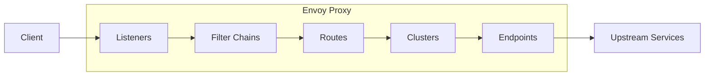
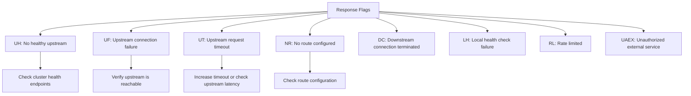
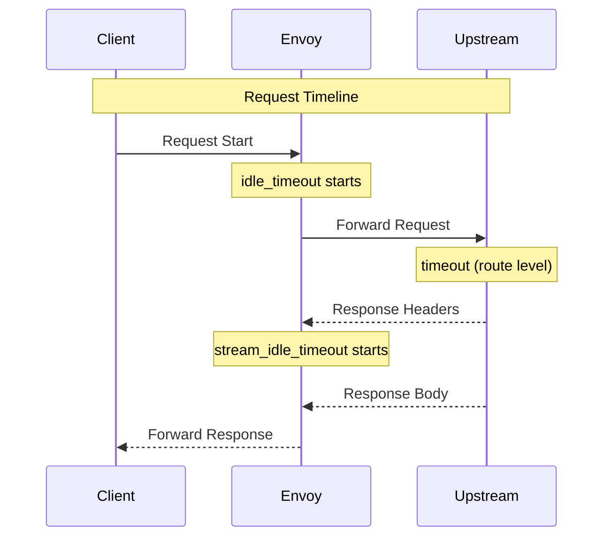

# How to Debug Envoy Configuration Issues

Author: [nawazdhandala](https://github.com/nawazdhandala)

Tags: Envoy, Proxy, Debugging, Configuration, Service Mesh, DevOps, Kubernetes, Troubleshooting

Description: A comprehensive guide to debugging Envoy proxy configuration issues, including admin interface usage, configuration dump analysis, access logging, common errors, and performance troubleshooting techniques.

---

> **Key Insight**: Most Envoy configuration issues stem from three sources: listener conflicts, cluster health problems, or route matching failures. The admin interface at port 9901 is your best friend for diagnosing all three.

## Understanding Envoy Architecture

Before diving into debugging, it is essential to understand how Envoy processes traffic.



**Listeners** accept incoming connections, **Filter Chains** process requests through HTTP filters, **Routes** determine which cluster handles the request, **Clusters** group upstream endpoints, and **Endpoints** are the actual backend servers.

## Enabling the Admin Interface

The admin interface is the most powerful debugging tool for Envoy. Enable it in your configuration.

```yaml
# envoy.yaml - Enable admin interface for debugging
admin:
  # Access log for admin requests (useful for auditing)
  access_log_path: /var/log/envoy/admin_access.log

  # Profile path for CPU/memory profiling
  profile_path: /var/log/envoy/envoy.prof

  address:
    socket_address:
      # Bind to localhost only in production for security
      # Use 0.0.0.0 only in development environments
      address: 127.0.0.1
      port_value: 9901
```

### Essential Admin Endpoints

```bash
# Check if Envoy is ready to accept traffic
# Returns 200 if ready, 503 if not
curl http://localhost:9901/ready

# Get current server info including version and state
curl http://localhost:9901/server_info

# List all available admin endpoints
curl http://localhost:9901/help

# View all runtime statistics
# This is crucial for understanding proxy behavior
curl http://localhost:9901/stats

# Filter stats by pattern (e.g., all cluster stats)
curl "http://localhost:9901/stats?filter=cluster"

# Get stats in Prometheus format for monitoring
curl http://localhost:9901/stats/prometheus
```

## Configuration Dump Analysis

When configuration is not working as expected, dump and analyze it.

```bash
# Dump entire configuration as JSON
# This shows the ACTUAL running configuration after all processing
curl http://localhost:9901/config_dump > config_dump.json

# Dump only specific resource types
# Options: listeners, clusters, routes, endpoints, secrets
curl "http://localhost:9901/config_dump?resource=listeners" | jq .

# Include endpoint discovery service (EDS) data
# Essential for debugging load balancing issues
curl "http://localhost:9901/config_dump?include_eds" | jq .
```

### Analyzing the Configuration Dump

```bash
# Extract all listener names and addresses
# Useful for finding port conflicts
jq '.configs[] |
    select(.["@type"] | contains("ListenersConfigDump")) |
    .dynamic_listeners[] |
    {
        name: .name,
        address: .active_state.listener.address
    }' config_dump.json

# Check cluster health status
# HEALTHY, UNHEALTHY, DEGRADED, or TIMEOUT
jq '.configs[] |
    select(.["@type"] | contains("ClustersConfigDump")) |
    .dynamic_active_clusters[] |
    {
        name: .cluster.name,
        type: .cluster.type,
        health: .cluster.health_checks
    }' config_dump.json

# Extract route configurations
# Shows virtual hosts and route matching rules
jq '.configs[] |
    select(.["@type"] | contains("RoutesConfigDump")) |
    .dynamic_route_configs[] |
    .route_config.virtual_hosts[] |
    {
        name: .name,
        domains: .domains,
        routes: [.routes[].match]
    }' config_dump.json
```

## Access Logging for Debugging

Configure detailed access logs to trace request flow.

```yaml
# HTTP connection manager with debug-friendly access logging
static_resources:
  listeners:
    - name: http_listener
      address:
        socket_address:
          address: 0.0.0.0
          port_value: 8080
      filter_chains:
        - filters:
            - name: envoy.filters.network.http_connection_manager
              typed_config:
                "@type": type.googleapis.com/envoy.extensions.filters.network.http_connection_manager.v3.HttpConnectionManager
                stat_prefix: ingress_http

                # Access log configuration for debugging
                access_log:
                  - name: envoy.access_loggers.stdout
                    typed_config:
                      "@type": type.googleapis.com/envoy.extensions.access_loggers.stream.v3.StdoutAccessLog
                      log_format:
                        # JSON format with all debugging fields
                        json_format:
                          # Request identification
                          request_id: "%REQ(X-REQUEST-ID)%"
                          timestamp: "%START_TIME%"

                          # Client information
                          client_ip: "%DOWNSTREAM_REMOTE_ADDRESS%"

                          # Request details
                          method: "%REQ(:METHOD)%"
                          path: "%REQ(:PATH)%"
                          host: "%REQ(:AUTHORITY)%"
                          user_agent: "%REQ(USER-AGENT)%"

                          # Response details
                          response_code: "%RESPONSE_CODE%"
                          response_flags: "%RESPONSE_FLAGS%"

                          # Timing information (in milliseconds)
                          duration_ms: "%DURATION%"
                          request_duration_ms: "%REQUEST_DURATION%"
                          response_duration_ms: "%RESPONSE_DURATION%"

                          # Upstream information (crucial for debugging)
                          upstream_host: "%UPSTREAM_HOST%"
                          upstream_cluster: "%UPSTREAM_CLUSTER%"
                          upstream_response_time_ms: "%RESP(X-ENVOY-UPSTREAM-SERVICE-TIME)%"

                          # Route information
                          route_name: "%ROUTE_NAME%"

                          # Connection info
                          bytes_received: "%BYTES_RECEIVED%"
                          bytes_sent: "%BYTES_SENT%"

                route_config:
                  name: local_route
                  virtual_hosts:
                    - name: backend
                      domains: ["*"]
                      routes:
                        - match:
                            prefix: "/"
                          route:
                            cluster: backend_service
```

### Understanding Response Flags

Response flags tell you exactly what went wrong.



```bash
# Common response flags and their meanings:
# UH  - No healthy upstream hosts
# UF  - Upstream connection failure
# UO  - Upstream overflow (circuit breaker)
# UT  - Upstream request timeout
# NR  - No route configured
# DC  - Downstream connection termination
# LH  - Local service failed health check
# RL  - Rate limited
# UAEX - Unauthorized external service
# NC  - No cluster found
# DT  - Dynamic timeout
```

## Common Configuration Errors

### Error 1: Listener Binding Conflicts

```yaml
# WRONG: Two listeners on the same port without filter chain matching
static_resources:
  listeners:
    - name: listener_1
      address:
        socket_address:
          address: 0.0.0.0
          port_value: 8080  # Conflict!
      filter_chains:
        - filters: [...]

    - name: listener_2
      address:
        socket_address:
          address: 0.0.0.0
          port_value: 8080  # Same port - will fail!
      filter_chains:
        - filters: [...]
```

```yaml
# CORRECT: Use filter chain matching to handle multiple services
static_resources:
  listeners:
    - name: combined_listener
      address:
        socket_address:
          address: 0.0.0.0
          port_value: 8080
      listener_filters:
        # TLS inspector allows routing based on SNI
        - name: envoy.filters.listener.tls_inspector
          typed_config:
            "@type": type.googleapis.com/envoy.extensions.filters.listener.tls_inspector.v3.TlsInspector
      filter_chains:
        # Filter chain for service A (matched by SNI)
        - filter_chain_match:
            server_names: ["service-a.example.com"]
          filters:
            - name: envoy.filters.network.http_connection_manager
              typed_config:
                "@type": type.googleapis.com/envoy.extensions.filters.network.http_connection_manager.v3.HttpConnectionManager
                stat_prefix: service_a
                route_config:
                  name: service_a_route
                  virtual_hosts:
                    - name: service_a
                      domains: ["*"]
                      routes:
                        - match: { prefix: "/" }
                          route: { cluster: service_a_cluster }

        # Filter chain for service B
        - filter_chain_match:
            server_names: ["service-b.example.com"]
          filters:
            - name: envoy.filters.network.http_connection_manager
              typed_config:
                "@type": type.googleapis.com/envoy.extensions.filters.network.http_connection_manager.v3.HttpConnectionManager
                stat_prefix: service_b
                route_config:
                  name: service_b_route
                  virtual_hosts:
                    - name: service_b
                      domains: ["*"]
                      routes:
                        - match: { prefix: "/" }
                          route: { cluster: service_b_cluster }
```

### Error 2: Cluster Health Check Failures

```bash
# Check cluster health status via admin
curl http://localhost:9901/clusters | grep health

# Output shows health status per endpoint:
# backend_service::172.17.0.2:8080::health_flags::/failed_active_hc
# This means active health checks are failing
```

```yaml
# WRONG: Health check path does not exist on upstream
clusters:
  - name: backend_service
    health_checks:
      - timeout: 1s
        interval: 5s
        unhealthy_threshold: 2
        healthy_threshold: 1
        http_health_check:
          path: /health  # This endpoint must exist!
```

```yaml
# CORRECT: Proper health check configuration
clusters:
  - name: backend_service
    type: STRICT_DNS
    lb_policy: ROUND_ROBIN
    load_assignment:
      cluster_name: backend_service
      endpoints:
        - lb_endpoints:
            - endpoint:
                address:
                  socket_address:
                    address: backend
                    port_value: 8080

    # Health check configuration
    health_checks:
      - timeout: 5s           # Allow enough time for response
        interval: 10s         # Check every 10 seconds
        unhealthy_threshold: 3 # Mark unhealthy after 3 failures
        healthy_threshold: 1   # Mark healthy after 1 success

        http_health_check:
          path: /healthz      # Ensure this endpoint exists
          expected_statuses:
            - start: 200
              end: 299        # Accept any 2xx status

    # Circuit breaker to prevent cascade failures
    circuit_breakers:
      thresholds:
        - priority: DEFAULT
          max_connections: 1000
          max_pending_requests: 1000
          max_requests: 1000
          max_retries: 3
```

### Error 3: Route Matching Issues

```yaml
# WRONG: Routes are evaluated in order - specific routes must come first
route_config:
  virtual_hosts:
    - name: backend
      domains: ["*"]
      routes:
        # This catches everything - routes below never match!
        - match:
            prefix: "/"
          route:
            cluster: default_cluster

        # This will NEVER be reached
        - match:
            prefix: "/api"
          route:
            cluster: api_cluster
```

```yaml
# CORRECT: Order routes from most specific to least specific
route_config:
  virtual_hosts:
    - name: backend
      domains: ["*"]
      routes:
        # Most specific: exact match
        - match:
            path: "/api/v2/health"
          route:
            cluster: health_cluster

        # More specific: longer prefix
        - match:
            prefix: "/api/v2/"
          route:
            cluster: api_v2_cluster

        # Specific: regex match
        - match:
            safe_regex:
              regex: "^/users/[0-9]+$"
          route:
            cluster: users_cluster

        # Less specific: shorter prefix
        - match:
            prefix: "/api/"
          route:
            cluster: api_cluster

        # Least specific: catch-all (always last)
        - match:
            prefix: "/"
          route:
            cluster: default_cluster
```

### Error 4: TLS Configuration Problems

```bash
# Debug TLS issues
# Check if certificates are loaded
curl http://localhost:9901/certs

# Look for certificate errors in logs
docker logs envoy 2>&1 | grep -i "tls\|ssl\|cert"
```

```yaml
# Common TLS configuration with proper certificate handling
static_resources:
  listeners:
    - name: https_listener
      address:
        socket_address:
          address: 0.0.0.0
          port_value: 8443
      filter_chains:
        - transport_socket:
            name: envoy.transport_sockets.tls
            typed_config:
              "@type": type.googleapis.com/envoy.extensions.transport_sockets.tls.v3.DownstreamTlsContext
              common_tls_context:
                tls_certificates:
                  - certificate_chain:
                      # Path to certificate chain (cert + intermediates)
                      filename: /etc/envoy/certs/server.crt
                    private_key:
                      filename: /etc/envoy/certs/server.key

                # Minimum TLS version (1.2 recommended minimum)
                tls_params:
                  tls_minimum_protocol_version: TLSv1_2
                  tls_maximum_protocol_version: TLSv1_3

                # Validate client certificates (mTLS)
                validation_context:
                  trusted_ca:
                    filename: /etc/envoy/certs/ca.crt

          filters:
            - name: envoy.filters.network.http_connection_manager
              # ... HTTP configuration
```

## Performance Troubleshooting

### Identifying Bottlenecks

```bash
# Get all timing-related stats
curl "http://localhost:9901/stats?filter=upstream_rq_time"

# Check connection pool stats
curl "http://localhost:9901/stats?filter=upstream_cx"

# Monitor circuit breaker state
curl "http://localhost:9901/stats?filter=circuit_breaker"

# Example output interpretation:
# cluster.backend.upstream_rq_time: P50=5ms, P99=50ms, P999=200ms
# High P99 indicates occasional slow requests
# cluster.backend.upstream_cx_active: 45
# Shows 45 active connections to upstream
```

### Connection Pool Tuning

```yaml
clusters:
  - name: backend_service
    # Connection pool settings for HTTP/1.1
    type: STRICT_DNS
    lb_policy: ROUND_ROBIN

    # Common HTTP protocol options
    common_http_protocol_options:
      idle_timeout: 300s  # Close idle connections after 5 minutes

    # HTTP/2 specific settings
    http2_protocol_options:
      max_concurrent_streams: 100  # Max streams per connection
      initial_stream_window_size: 65536  # 64KB initial window
      initial_connection_window_size: 1048576  # 1MB connection window

    # Circuit breaker prevents overload
    circuit_breakers:
      thresholds:
        - priority: DEFAULT
          max_connections: 100        # Max connections to upstream
          max_pending_requests: 100   # Max requests waiting for connection
          max_requests: 1000          # Max active requests
          max_retries: 3              # Max concurrent retries

    # Outlier detection for automatic failover
    outlier_detection:
      consecutive_5xx: 5              # Eject after 5 consecutive 5xx
      interval: 10s                   # Check interval
      base_ejection_time: 30s         # Minimum ejection time
      max_ejection_percent: 50        # Max % of hosts ejected
```

### Timeout Configuration



```yaml
# Complete timeout configuration
route_config:
  virtual_hosts:
    - name: backend
      domains: ["*"]
      routes:
        - match:
            prefix: "/"
          route:
            cluster: backend_service

            # Request timeout (total time for request)
            timeout: 30s

            # Idle timeout (time between data frames)
            idle_timeout: 60s

            # Retry policy for failed requests
            retry_policy:
              retry_on: "5xx,reset,connect-failure,retriable-4xx"
              num_retries: 3
              per_try_timeout: 10s  # Timeout per retry attempt
              retry_back_off:
                base_interval: 100ms
                max_interval: 1s
```

## Debugging with Tap Filter

The tap filter allows you to capture full request/response data for debugging.

```yaml
# Add tap filter for request/response capture
http_filters:
  - name: envoy.filters.http.tap
    typed_config:
      "@type": type.googleapis.com/envoy.extensions.filters.http.tap.v3.Tap
      common_config:
        admin_config:
          # Enable tap via admin interface
          config_id: tap_config

  - name: envoy.filters.http.router
    typed_config:
      "@type": type.googleapis.com/envoy.extensions.filters.http.router.v3.Router
```

```bash
# Enable tap for specific requests
curl -X POST http://localhost:9901/tap \
  -d '{
    "config_id": "tap_config",
    "tap_config": {
      "match_config": {
        "http_request_headers_match": {
          "headers": [
            {
              "name": ":path",
              "prefix_match": "/api/"
            }
          ]
        }
      },
      "output_config": {
        "sinks": [
          {
            "streaming_admin": {}
          }
        ],
        "max_buffered_rx_bytes": 1024,
        "max_buffered_tx_bytes": 1024
      }
    }
  }'
```

## Kubernetes-Specific Debugging

When running Envoy as a sidecar in Kubernetes (e.g., with Istio).

```bash
# Access Envoy admin in a Kubernetes pod
kubectl port-forward pod/my-app-pod 9901:15000

# Check Envoy config in Istio sidecar
kubectl exec -it my-app-pod -c istio-proxy -- \
  curl localhost:15000/config_dump | jq .

# View Envoy logs
kubectl logs my-app-pod -c istio-proxy

# Check listener configuration
kubectl exec -it my-app-pod -c istio-proxy -- \
  curl localhost:15000/listeners

# Check cluster configuration
kubectl exec -it my-app-pod -c istio-proxy -- \
  curl localhost:15000/clusters
```

```yaml
# Debug sidecar injection issues
# Check if sidecar is present
apiVersion: v1
kind: Pod
metadata:
  name: debug-pod
  annotations:
    # Enable Istio sidecar injection
    sidecar.istio.io/inject: "true"
    # Enable debug logging for proxy
    proxy.istio.io/config: |
      proxyStatsMatcher:
        inclusionPrefixes:
          - "cluster"
          - "listener"
          - "http"
      componentLogLevel: "misc:debug,filter:debug"
spec:
  containers:
    - name: app
      image: my-app:latest
```

## Best Practices Summary

1. **Always enable admin interface** in development and staging environments. Restrict access in production.

2. **Use structured JSON logging** with response flags to quickly identify the root cause of failures.

3. **Order routes correctly** from most specific to least specific. The first matching route wins.

4. **Configure health checks properly** with realistic timeouts and thresholds that match your application behavior.

5. **Set circuit breakers** to prevent cascade failures when upstream services are unhealthy.

6. **Monitor key metrics** including upstream_rq_time, upstream_cx_active, and circuit_breaker stats.

7. **Use outlier detection** to automatically remove unhealthy hosts from the load balancing pool.

8. **Configure appropriate timeouts** at each level: connection, request, and idle timeouts.

9. **Test configuration changes** using `envoy --mode validate -c config.yaml` before deploying.

10. **Keep configurations version controlled** and use config dump to verify what is actually running.

```bash
# Validate configuration before deployment
envoy --mode validate -c /etc/envoy/envoy.yaml

# Hot restart for configuration updates (zero downtime)
envoy -c /etc/envoy/envoy.yaml \
  --restart-epoch 1 \
  --parent-shutdown-time-s 60
```

---

For comprehensive observability of your Envoy proxies and the services behind them, [OneUptime](https://oneuptime.com) provides unified monitoring, logging, and alerting that integrates seamlessly with Envoy metrics and traces exported via OpenTelemetry.
