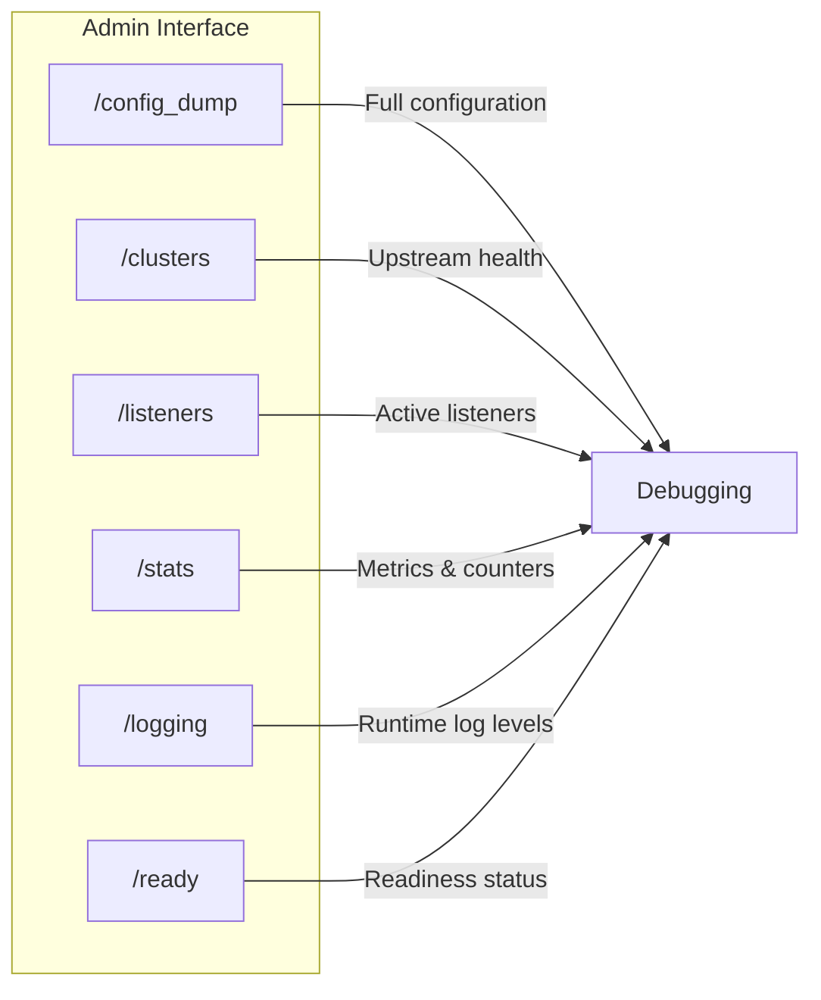
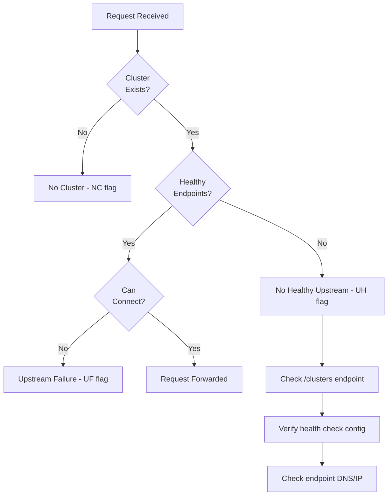
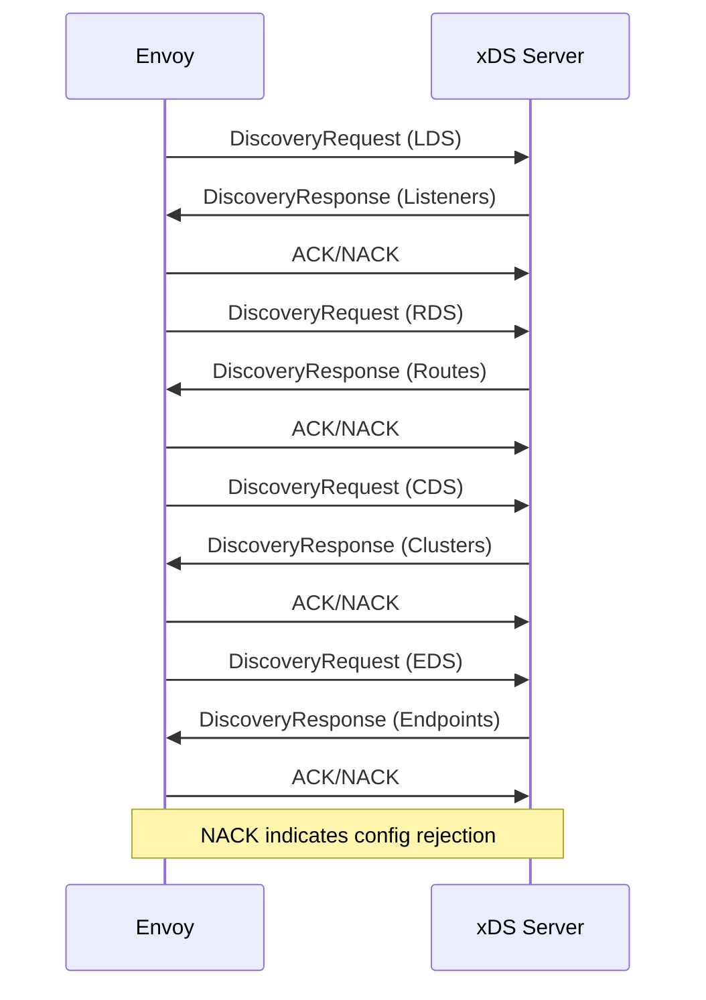
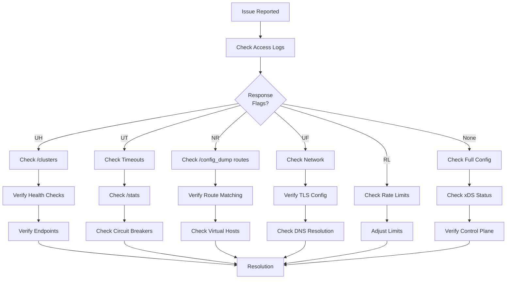

# How to Debug Envoy Configuration Issues

By [Nawaz Dhandala](https://github.com/nawazdhandala)

Tags: Envoy, Proxy, Debugging, Kubernetes, Service Mesh, DevOps, Troubleshooting

Description: A comprehensive guide to debugging Envoy proxy configuration issues using the admin interface, access logs, configuration dumps, and systematic troubleshooting techniques.

---

> "The most effective debugging tool is still careful thought, coupled with judiciously placed print statements." - Brian Kernighan. With Envoy, those print statements are your admin interface and access logs.

## Understanding Envoy's Architecture

Before diving into debugging, understanding Envoy's core components helps identify where problems originate.

```mermaid
flowchart TB
    subgraph Envoy Proxy
        LIS[Listeners] --> FC[Filter Chains]
        FC --> HCM[HTTP Connection Manager]
        HCM --> RF[Router Filter]
        RF --> CL[Clusters]
        CL --> EP[Endpoints]
    end

    CLIENT[Client Request] --> LIS
    EP --> UPSTREAM[Upstream Services]

    subgraph Configuration Sources
        STATIC[Static Config]
        XDS[xDS Server]
    end

    STATIC --> Envoy Proxy
    XDS --> Envoy Proxy
```

### Key Components

- **Listeners**: Accept incoming connections on specific ports
- **Filter Chains**: Process requests through ordered filters
- **Clusters**: Groups of upstream hosts that Envoy routes to
- **Endpoints**: Individual upstream service instances
- **Routes**: Rules that map requests to clusters

## Enabling the Admin Interface

The admin interface is your primary debugging tool. Enable it in your Envoy configuration.

```yaml
# envoy.yaml - Enable admin interface
# The admin interface provides runtime debugging endpoints
# WARNING: Never expose this to untrusted networks
admin:
  address:
    socket_address:
      # Bind to localhost for security
      address: 127.0.0.1
      # Choose a port that doesn't conflict with your services
      port_value: 9901
  # Optional: Restrict access paths
  access_log:
    - name: envoy.access_loggers.file
      typed_config:
        "@type": type.googleapis.com/envoy.extensions.access_loggers.file.v3.FileAccessLog
        path: /var/log/envoy/admin_access.log
```

### Accessing the Admin Interface

```bash
# Port-forward if running in Kubernetes
# This creates a secure tunnel to the Envoy pod's admin interface
kubectl port-forward pod/envoy-pod 9901:9901

# Access the admin dashboard in your browser
# Or use curl for scripted debugging
curl http://localhost:9901/

# List all available admin endpoints
# Useful for discovering debugging capabilities
curl http://localhost:9901/help
```

## Essential Admin Endpoints

The admin interface exposes numerous endpoints for debugging. Here are the most critical ones.



### Configuration Dump

```bash
# Get the complete running configuration
# This shows the actual config Envoy is using, not just what you provided
curl -s http://localhost:9901/config_dump | jq .

# Get only static configuration (your original config)
# Useful for verifying your config was loaded correctly
curl -s http://localhost:9901/config_dump?resource=static_clusters | jq .

# Get dynamic configuration from xDS
# Shows what the control plane has sent
curl -s http://localhost:9901/config_dump?resource=dynamic_active_clusters | jq .

# Filter by specific cluster name
# Replace 'my-service' with your cluster name
curl -s "http://localhost:9901/config_dump?resource=dynamic_active_clusters&name_regex=my-service" | jq .

# Get listener configuration
curl -s http://localhost:9901/config_dump?resource=dynamic_listeners | jq .

# Get route configuration
curl -s http://localhost:9901/config_dump?resource=dynamic_route_configs | jq .
```

### Cluster Status

```bash
# View all clusters and their health status
# This is crucial for debugging upstream connectivity issues
curl -s http://localhost:9901/clusters

# Output format explanation:
# cluster_name::endpoint_address:port::health_flags::weight::region::zone::sub_zone::canary::priority::success_rate

# Example output:
# my-service::10.0.1.5:8080::healthy::1::us-east-1::zone-a::::0::100.0%

# Get clusters in JSON format for easier parsing
curl -s "http://localhost:9901/clusters?format=json" | jq .

# Check specific cluster health
curl -s "http://localhost:9901/clusters?format=json" | jq '.cluster_statuses[] | select(.name=="my-service")'
```

### Health Status Flags

Understanding health flags helps diagnose why endpoints are marked unhealthy.

```bash
# Health flag meanings:
# /failed_active_hc  - Failed active health check
# /failed_outlier_check - Ejected by outlier detection
# /failed_eds_health - EDS marked as unhealthy
# /pending_dynamic_removal - Being removed
# /pending_active_hc - Waiting for first health check
# /excluded_via_immediate_hc_fail - Immediate health check failure
# /active_hc_timeout - Health check timed out

# Check for unhealthy endpoints
curl -s http://localhost:9901/clusters | grep -v "healthy"
```

### Statistics

```bash
# Get all statistics
# Envoy tracks thousands of metrics - use grep to filter
curl -s http://localhost:9901/stats

# Get statistics in Prometheus format
# Useful for integration with monitoring systems
curl -s http://localhost:9901/stats/prometheus

# Filter stats by pattern
# Example: Get all HTTP-related stats
curl -s http://localhost:9901/stats?filter=http

# Get upstream connection stats for a specific cluster
curl -s "http://localhost:9901/stats?filter=cluster.my-service"

# Important stats to monitor:
# - cluster.*.upstream_cx_active: Active connections
# - cluster.*.upstream_rq_pending_active: Pending requests
# - cluster.*.upstream_rq_timeout: Timed out requests
# - cluster.*.upstream_rq_retry: Retry count
# - cluster.*.outlier_detection.ejections_active: Currently ejected hosts

# Get stats in JSON format
curl -s "http://localhost:9901/stats?format=json" | jq .
```

### Runtime Logging

```bash
# View current log levels for all loggers
curl -s http://localhost:9901/logging

# Enable debug logging globally
# WARNING: This generates significant log volume
curl -X POST "http://localhost:9901/logging?level=debug"

# Enable debug logging for specific component
# More targeted approach to reduce log noise
curl -X POST "http://localhost:9901/logging?connection=debug"
curl -X POST "http://localhost:9901/logging?http=debug"
curl -X POST "http://localhost:9901/logging?router=debug"
curl -X POST "http://localhost:9901/logging?upstream=debug"

# Reset to warning level after debugging
curl -X POST "http://localhost:9901/logging?level=warning"

# Available loggers include:
# admin, aws, assert, backtrace, cache_filter, client, config
# connection, conn_handler, decompression, dns, dubbo, envoy_bug
# ext_authz, ext_proc, file, filter, forward_proxy, grpc, hc
# health_checker, http, http2, hystrix, init, io, jwt, kafka
# lua, main, matcher, misc, mongo, multi_connection, oauth2
# pool, quic, quic_stream, ratelimit, rbac, redis, router, runtime
# secret, tap, tcp, testing, thrift, tracing, upstream, wasm
```

## Configuring Access Logs

Access logs provide request-level debugging information. Configure them to capture what you need.

```yaml
# Detailed access log configuration
# Place this in your HTTP connection manager filter
static_resources:
  listeners:
    - name: http_listener
      address:
        socket_address:
          address: 0.0.0.0
          port_value: 8080
      filter_chains:
        - filters:
            - name: envoy.filters.network.http_connection_manager
              typed_config:
                "@type": type.googleapis.com/envoy.extensions.filters.network.http_connection_manager.v3.HttpConnectionManager
                stat_prefix: ingress_http
                # Enable detailed access logging
                access_log:
                  - name: envoy.access_loggers.file
                    typed_config:
                      "@type": type.googleapis.com/envoy.extensions.access_loggers.file.v3.FileAccessLog
                      path: /var/log/envoy/access.log
                      # Custom log format with all debugging fields
                      log_format:
                        json_format:
                          # Timestamp for correlation
                          timestamp: "%START_TIME%"
                          # Client information
                          client_ip: "%DOWNSTREAM_REMOTE_ADDRESS%"
                          # Request details
                          method: "%REQ(:METHOD)%"
                          path: "%REQ(:PATH)%"
                          host: "%REQ(:AUTHORITY)%"
                          # Response information
                          response_code: "%RESPONSE_CODE%"
                          response_flags: "%RESPONSE_FLAGS%"
                          # Timing information (in milliseconds)
                          duration_ms: "%DURATION%"
                          upstream_service_time: "%RESP(X-ENVOY-UPSTREAM-SERVICE-TIME)%"
                          # Upstream information
                          upstream_host: "%UPSTREAM_HOST%"
                          upstream_cluster: "%UPSTREAM_CLUSTER%"
                          # Tracing
                          request_id: "%REQ(X-REQUEST-ID)%"
                          trace_id: "%REQ(X-B3-TRACEID)%"
                          # Error details
                          upstream_transport_failure: "%UPSTREAM_TRANSPORT_FAILURE_REASON%"
```

### Understanding Response Flags

Response flags indicate why a request was handled in a particular way.

```bash
# Common response flags and their meanings:
# DC  - Downstream connection termination
# UF  - Upstream connection failure
# UH  - No healthy upstream
# UT  - Upstream request timeout
# LR  - Connection local reset
# UR  - Upstream remote reset
# UC  - Upstream connection termination
# DI  - Request delayed (fault injection)
# FI  - Request aborted (fault injection)
# RL  - Rate limited
# UAEX - Unauthorized external service
# RLSE - Rate limit service error
# NC  - No cluster found
# DT  - Response from downstream terminal
# URX - Request rejected (upstream retry limit)
# SI  - Stream idle timeout
# DPE - Downstream protocol error
# UPE - Upstream protocol error
# UMSDR - Upstream request reached max stream duration

# Search logs for specific response flags
# UH indicates no healthy upstream hosts
grep '"response_flags":"UH"' /var/log/envoy/access.log

# Find all failed requests
grep -v '"response_flags":"-"' /var/log/envoy/access.log

# Find requests with upstream failures
grep -E '"response_flags":"(UF|UH|UT|UR)"' /var/log/envoy/access.log
```

## Common Issues and Solutions

### Issue 1: No Healthy Upstream Hosts (UH)



**Symptoms:**
- Requests return 503 Service Unavailable
- Access logs show `response_flags: "UH"`

**Debugging Steps:**

```bash
# Step 1: Check cluster status
curl -s http://localhost:9901/clusters | grep -A5 "my-cluster"

# Step 2: Verify endpoints are registered
curl -s "http://localhost:9901/clusters?format=json" | \
  jq '.cluster_statuses[] | select(.name=="my-cluster") | .host_statuses'

# Step 3: Check health check configuration
curl -s http://localhost:9901/config_dump | \
  jq '.configs[] | select(.["@type"]=="type.googleapis.com/envoy.admin.v3.ClustersConfigDump") | .dynamic_active_clusters[] | select(.cluster.name=="my-cluster") | .cluster.health_checks'

# Step 4: Test connectivity to upstream manually
kubectl exec -it envoy-pod -- curl -v http://upstream-service:8080/health
```

**Solution:**

```yaml
# Ensure health check configuration matches your upstream
clusters:
  - name: my-cluster
    connect_timeout: 5s
    type: STRICT_DNS
    lb_policy: ROUND_ROBIN
    load_assignment:
      cluster_name: my-cluster
      endpoints:
        - lb_endpoints:
            - endpoint:
                address:
                  socket_address:
                    address: my-service.default.svc.cluster.local
                    port_value: 8080
    # Health check configuration
    health_checks:
      - timeout: 5s
        interval: 10s
        unhealthy_threshold: 3
        healthy_threshold: 2
        http_health_check:
          # Ensure this path exists and returns 200
          path: /health
          # Use the correct host header
          host: my-service
```

### Issue 2: Upstream Connection Timeout (UT)

**Symptoms:**
- Requests are slow and eventually timeout
- Access logs show `response_flags: "UT"`

**Debugging Steps:**

```bash
# Check timeout configuration
curl -s http://localhost:9901/config_dump | \
  jq '.. | .route_config? // empty | .virtual_hosts[]? | .routes[]? | {name: .name, timeout: .route.timeout}'

# Check cluster connection stats
curl -s "http://localhost:9901/stats?filter=cluster.my-cluster.upstream_cx"

# Monitor active connections
watch -n 1 'curl -s "http://localhost:9901/stats?filter=upstream_cx_active"'

# Check if connection pool is exhausted
curl -s "http://localhost:9901/stats?filter=upstream_cx_overflow"
```

**Solution:**

```yaml
# Adjust timeout settings appropriately
routes:
  - match:
      prefix: "/"
    route:
      cluster: my-cluster
      # Request timeout (how long to wait for response)
      timeout: 30s
      # Retry configuration
      retry_policy:
        retry_on: "5xx,reset,connect-failure"
        num_retries: 3
        per_try_timeout: 10s

clusters:
  - name: my-cluster
    # Connection timeout (how long to wait for connection)
    connect_timeout: 5s
    # Circuit breaker configuration
    circuit_breakers:
      thresholds:
        - priority: DEFAULT
          # Maximum concurrent connections
          max_connections: 1024
          # Maximum pending requests
          max_pending_requests: 1024
          # Maximum concurrent requests
          max_requests: 1024
          # Maximum retries
          max_retries: 3
```

### Issue 3: Route Not Found (NR)

**Symptoms:**
- Requests return 404 Not Found
- Access logs show `response_flags: "NR"` or no matched route

**Debugging Steps:**

```bash
# List all configured routes
curl -s http://localhost:9901/config_dump | \
  jq '.. | .route_config? // empty | .virtual_hosts[] | {domain: .domains, routes: [.routes[].match]}'

# Check which virtual host matches your request
# Test with specific host header
curl -H "Host: api.example.com" http://localhost:8080/my-path -v

# Verify route matching order (first match wins)
curl -s http://localhost:9901/config_dump | \
  jq '.. | .route_config? // empty | .virtual_hosts[] | select(.domains[] | contains("api.example.com")) | .routes'
```

**Solution:**

```yaml
# Ensure routes are configured correctly
route_config:
  name: local_route
  virtual_hosts:
    - name: api_service
      # Domains to match (use * for catch-all)
      domains: ["api.example.com", "api.example.com:*"]
      routes:
        # Routes are matched in order - put specific routes first
        - match:
            # Exact path match
            path: "/api/v1/specific"
          route:
            cluster: specific_cluster
        - match:
            # Prefix match (catches all /api/v1/* paths)
            prefix: "/api/v1/"
          route:
            cluster: api_v1_cluster
        - match:
            # Catch-all route (should be last)
            prefix: "/"
          route:
            cluster: default_cluster
```

### Issue 4: TLS/SSL Handshake Failures

**Symptoms:**
- Connections reset during handshake
- Access logs show `response_flags: "UC"` or `"UF"`

**Debugging Steps:**

```bash
# Check TLS stats
curl -s "http://localhost:9901/stats?filter=ssl"

# Look for specific TLS errors
curl -s "http://localhost:9901/stats?filter=ssl.handshake"
curl -s "http://localhost:9901/stats?filter=ssl.fail_verify"

# Verify certificate configuration
curl -s http://localhost:9901/config_dump | \
  jq '.. | .transport_socket? // empty'

# Check certificate expiry
curl -s http://localhost:9901/certs | jq .
```

**Solution:**

```yaml
# Proper TLS configuration for upstream
clusters:
  - name: secure_cluster
    transport_socket:
      name: envoy.transport_sockets.tls
      typed_config:
        "@type": type.googleapis.com/envoy.extensions.transport_sockets.tls.v3.UpstreamTlsContext
        # SNI for the upstream service
        sni: api.example.com
        common_tls_context:
          # Validation context for upstream certificates
          validation_context:
            trusted_ca:
              filename: /etc/ssl/certs/ca-certificates.crt
            # Verify the upstream hostname
            match_typed_subject_alt_names:
              - san_type: DNS
                matcher:
                  exact: "api.example.com"
          # Minimum TLS version
          tls_params:
            tls_minimum_protocol_version: TLSv1_2
            tls_maximum_protocol_version: TLSv1_3
```

### Issue 5: Rate Limiting Triggered (RL)

**Symptoms:**
- Requests return 429 Too Many Requests
- Access logs show `response_flags: "RL"`

**Debugging Steps:**

```bash
# Check rate limit stats
curl -s "http://localhost:9901/stats?filter=ratelimit"

# Check local rate limit configuration
curl -s http://localhost:9901/config_dump | \
  jq '.. | .filters[]? | select(.name=="envoy.filters.http.local_ratelimit")'

# Monitor rate limit hits
watch -n 1 'curl -s "http://localhost:9901/stats?filter=http_local_rate_limit"'
```

**Solution:**

```yaml
# Adjust rate limit configuration
http_filters:
  - name: envoy.filters.http.local_ratelimit
    typed_config:
      "@type": type.googleapis.com/envoy.extensions.filters.http.local_ratelimit.v3.LocalRateLimit
      stat_prefix: http_local_rate_limiter
      token_bucket:
        # Maximum tokens (burst capacity)
        max_tokens: 100
        # Tokens added per fill interval
        tokens_per_fill: 100
        # How often to add tokens
        fill_interval: 1s
      filter_enabled:
        runtime_key: local_rate_limit_enabled
        default_value:
          numerator: 100
          denominator: HUNDRED
      filter_enforced:
        runtime_key: local_rate_limit_enforced
        default_value:
          numerator: 100
          denominator: HUNDRED
      # Custom response when rate limited
      response_headers_to_add:
        - append_action: OVERWRITE_IF_EXISTS_OR_ADD
          header:
            key: x-rate-limit-remaining
            value: "0"
```

## Debugging xDS Configuration

When using a control plane (like Istio or a custom xDS server), configuration issues often stem from xDS communication.



### Checking xDS Status

```bash
# View xDS configuration status
curl -s http://localhost:9901/config_dump | \
  jq '.configs[] | select(.["@type"] | contains("Bootstrap")) | .bootstrap.dynamic_resources'

# Check for NACK (configuration rejections)
curl -s "http://localhost:9901/stats?filter=control_plane"

# View xDS connection status
curl -s "http://localhost:9901/stats?filter=xds"

# Common xDS stats to monitor:
# control_plane.connected_state - 1 if connected, 0 if not
# control_plane.pending_requests - Pending xDS requests
# xds.*.update_rejected - Configuration updates rejected
# xds.*.update_success - Successful updates
```

### Common xDS Issues

```bash
# Check for version mismatches
curl -s http://localhost:9901/config_dump | \
  jq '.configs[].dynamic_active_clusters[]? | {name: .cluster.name, version: .version_info}'

# Look for rejected configurations
curl -s "http://localhost:9901/stats?filter=update_rejected" | grep -v ": 0$"

# Check control plane connectivity
curl -s "http://localhost:9901/stats?filter=connected_state"
```

## Kubernetes-Specific Debugging

When running Envoy in Kubernetes (especially with Istio), additional debugging tools are available.

```bash
# Check Envoy sidecar logs in a pod
kubectl logs <pod-name> -c istio-proxy

# Get Envoy config from Istio proxy
kubectl exec <pod-name> -c istio-proxy -- pilot-agent request GET config_dump

# Check Istio proxy status
istioctl proxy-status

# Analyze Istio configuration for issues
istioctl analyze

# Get detailed proxy config for a specific pod
istioctl proxy-config all <pod-name>

# Check listeners
istioctl proxy-config listeners <pod-name>

# Check routes
istioctl proxy-config routes <pod-name>

# Check clusters
istioctl proxy-config clusters <pod-name>

# Check endpoints
istioctl proxy-config endpoints <pod-name>
```

## Systematic Debugging Workflow

Follow this workflow when debugging Envoy issues.



### Step-by-Step Process

```bash
# Step 1: Identify the issue from access logs
tail -f /var/log/envoy/access.log | jq -r 'select(.response_code >= 400)'

# Step 2: Note the response flags and upstream information
# response_flags tells you what went wrong
# upstream_host shows which backend was selected (if any)

# Step 3: Check relevant admin endpoints based on flags
# For UH (no healthy upstream):
curl -s http://localhost:9901/clusters | grep -v healthy

# For routing issues:
curl -s http://localhost:9901/config_dump?resource=dynamic_route_configs | jq .

# Step 4: Enable debug logging for the relevant component
curl -X POST "http://localhost:9901/logging?router=debug"

# Step 5: Reproduce the issue and check logs
kubectl logs <pod-name> -c envoy -f

# Step 6: Reset logging level after debugging
curl -X POST "http://localhost:9901/logging?level=warning"
```

## Monitoring Envoy with OneUptime

For production environments, proactive monitoring prevents issues before they impact users. [OneUptime](https://oneuptime.com) provides comprehensive monitoring for Envoy proxies.

### Key Metrics to Monitor

- **Upstream Health**: Monitor `cluster.*.healthy` to catch endpoint failures early
- **Request Latency**: Track P50, P95, P99 latencies for performance degradation
- **Error Rates**: Alert on spikes in 4xx/5xx responses
- **Circuit Breaker Status**: Monitor when circuit breakers open
- **Connection Pool**: Watch for connection pool exhaustion

### Setting Up Alerts

Configure OneUptime to scrape Envoy's Prometheus endpoint (`/stats/prometheus`) and set up alerts for:

- No healthy upstreams in a cluster
- Error rate exceeding threshold
- Latency P99 exceeding SLA
- Circuit breaker opens
- xDS disconnection

## Conclusion

Debugging Envoy configuration issues becomes systematic when you understand the tools available:

1. **Admin Interface**: Your real-time window into Envoy's state
2. **Access Logs**: Request-level debugging with response flags
3. **Configuration Dump**: Verify what Envoy is actually running
4. **Statistics**: Quantitative metrics for trends and anomalies

Start with access logs to identify the response flag, use the admin interface to investigate the specific subsystem, and verify your configuration matches your intent. With practice, most Envoy issues can be diagnosed and resolved quickly using these techniques.
