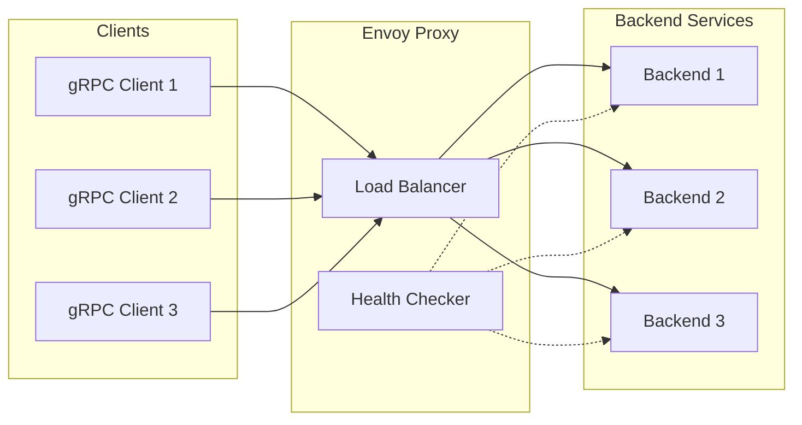
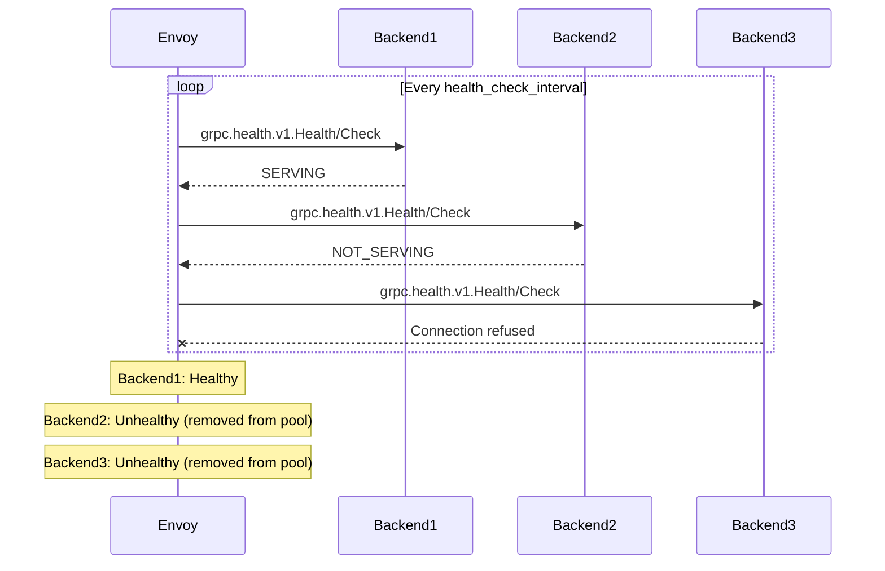
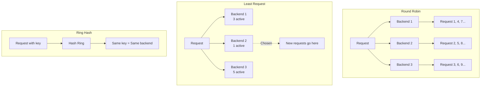
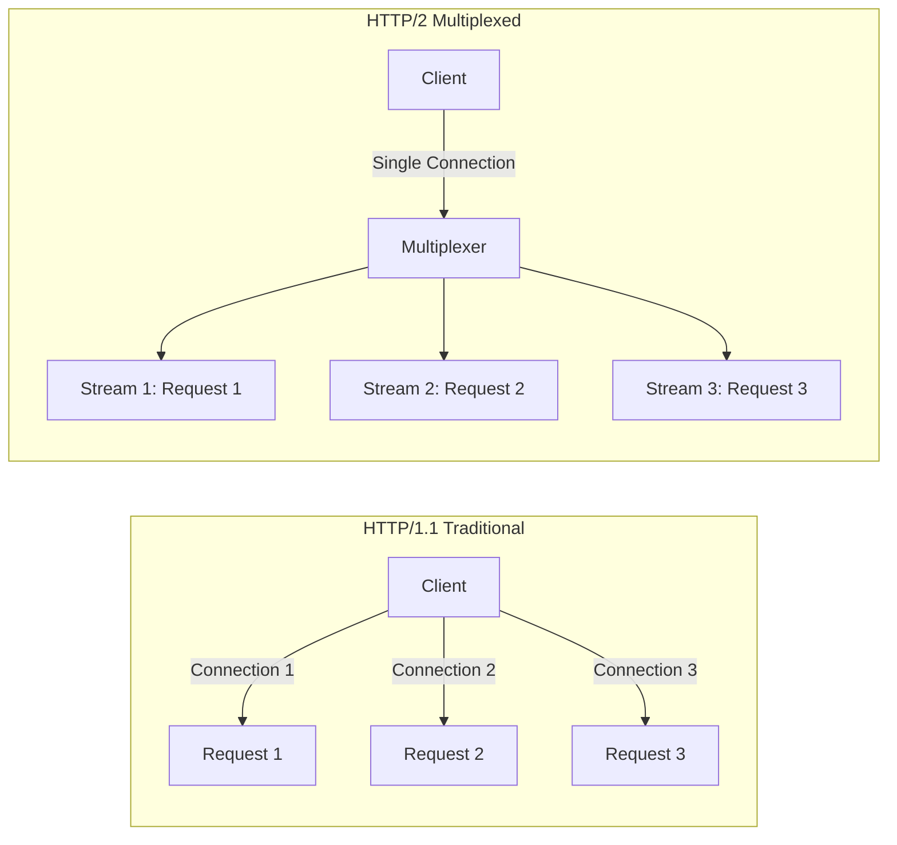

# How to Use Envoy for gRPC Load Balancing

Author: [nawazdhandala](https://github.com/nawazdhandala)

Tags: Envoy, gRPC, Load Balancing, HTTP/2, Kubernetes, Microservices, Service Mesh, Observability

Description: A comprehensive guide to configuring Envoy proxy for gRPC load balancing, covering HTTP/2 settings, health checking, load balancing algorithms, and connection multiplexing for high-performance microservices.

---

> "gRPC's HTTP/2 foundation enables multiplexing and persistent connections, but without proper load balancing, you'll send all requests to a single backend. Envoy solves this by load balancing at the request level, not the connection level."

## Why Envoy for gRPC Load Balancing

Traditional load balancers operate at the TCP connection level (L4). When a gRPC client establishes a persistent HTTP/2 connection, all requests flow through that single connection to one backend server. This defeats the purpose of having multiple backend instances.

Envoy understands HTTP/2 and gRPC natively. It can multiplex requests across multiple backend connections, enabling true request-level load balancing even over persistent connections.



## HTTP/2 Configuration

The foundation of gRPC load balancing in Envoy is proper HTTP/2 configuration. Both the downstream (client-facing) and upstream (backend-facing) connections must be configured for HTTP/2.

### Basic HTTP/2 Listener Configuration

```yaml
# envoy.yaml - Basic HTTP/2 configuration for gRPC
# This configuration sets up Envoy to accept gRPC connections on port 8080
# and forward them to backend services

static_resources:
  listeners:
    - name: grpc_listener
      address:
        socket_address:
          # Listen on all interfaces
          address: 0.0.0.0
          port_value: 8080
      filter_chains:
        - filters:
            - name: envoy.filters.network.http_connection_manager
              typed_config:
                "@type": type.googleapis.com/envoy.extensions.filters.network.http_connection_manager.v3.HttpConnectionManager
                stat_prefix: grpc_ingress
                # codec_type AUTO detects HTTP/1.1 or HTTP/2 automatically
                # For gRPC-only services, explicitly set to HTTP2
                codec_type: HTTP2
                http2_protocol_options:
                  # Maximum concurrent streams per connection
                  # Higher values allow more multiplexing but use more memory
                  max_concurrent_streams: 1000
                  # Initial stream window size (bytes)
                  # Controls flow control for individual streams
                  initial_stream_window_size: 65536
                  # Initial connection window size (bytes)
                  # Controls flow control for the entire connection
                  initial_connection_window_size: 1048576
                route_config:
                  name: grpc_routes
                  virtual_hosts:
                    - name: grpc_services
                      domains: ["*"]
                      routes:
                        - match:
                            # Match all gRPC requests
                            prefix: "/"
                            grpc: {}
                          route:
                            cluster: grpc_backend
                            # Timeout for the entire request/response
                            timeout: 30s
                http_filters:
                  - name: envoy.filters.http.router
                    typed_config:
                      "@type": type.googleapis.com/envoy.extensions.filters.http.router.v3.Router
```

### Upstream HTTP/2 Configuration

```yaml
# Cluster configuration with HTTP/2 for upstream connections
# This ensures Envoy speaks HTTP/2 to your gRPC backends

clusters:
  - name: grpc_backend
    connect_timeout: 5s
    type: STRICT_DNS
    lb_policy: ROUND_ROBIN
    # Critical: Enable HTTP/2 for upstream connections
    typed_extension_protocol_options:
      envoy.extensions.upstreams.http.v3.HttpProtocolOptions:
        "@type": type.googleapis.com/envoy.extensions.upstreams.http.v3.HttpProtocolOptions
        # explicit_http_config ensures HTTP/2 is always used
        explicit_http_config:
          http2_protocol_options:
            # Maximum concurrent streams to each backend
            max_concurrent_streams: 100
            # Connection keepalive settings
            connection_keepalive:
              # Send keepalive pings every 30 seconds
              interval: 30s
              # Close connection if no response within 5 seconds
              timeout: 5s
    load_assignment:
      cluster_name: grpc_backend
      endpoints:
        - lb_endpoints:
            - endpoint:
                address:
                  socket_address:
                    address: backend-service
                    port_value: 50051
```

## gRPC Health Checking

Envoy supports native gRPC health checking using the standard gRPC health checking protocol defined in `grpc.health.v1.Health`. This is essential for removing unhealthy backends from the load balancing pool.



### Configuring gRPC Health Checks

```yaml
# Cluster with gRPC health checking
# Backends must implement the gRPC health checking protocol

clusters:
  - name: grpc_backend
    connect_timeout: 5s
    type: STRICT_DNS
    lb_policy: ROUND_ROBIN
    typed_extension_protocol_options:
      envoy.extensions.upstreams.http.v3.HttpProtocolOptions:
        "@type": type.googleapis.com/envoy.extensions.upstreams.http.v3.HttpProtocolOptions
        explicit_http_config:
          http2_protocol_options: {}
    # Health check configuration
    health_checks:
      - timeout: 5s
        # How often to check health
        interval: 10s
        # Number of consecutive failures before marking unhealthy
        unhealthy_threshold: 3
        # Number of consecutive successes before marking healthy
        healthy_threshold: 2
        # gRPC-specific health check configuration
        grpc_health_check:
          # Service name to check (empty string checks overall server health)
          service_name: "myservice.v1.MyService"
          # Optional: authority header for the health check request
          authority: "backend-service"
    load_assignment:
      cluster_name: grpc_backend
      endpoints:
        - lb_endpoints:
            - endpoint:
                address:
                  socket_address:
                    address: backend-1
                    port_value: 50051
            - endpoint:
                address:
                  socket_address:
                    address: backend-2
                    port_value: 50051
            - endpoint:
                address:
                  socket_address:
                    address: backend-3
                    port_value: 50051
```

### Implementing the gRPC Health Check Service

Your backend services must implement the gRPC health checking protocol. Here is an example in Go:

```go
// health_server.go
// Implements the gRPC health checking protocol for Envoy compatibility

package main

import (
    "context"
    "sync"

    "google.golang.org/grpc"
    "google.golang.org/grpc/health"
    healthpb "google.golang.org/grpc/health/grpc_health_v1"
)

// HealthServer manages service health status
type HealthServer struct {
    mu       sync.RWMutex
    statuses map[string]healthpb.HealthCheckResponse_ServingStatus
}

// NewHealthServer creates a health server with default healthy status
func NewHealthServer() *HealthServer {
    return &HealthServer{
        statuses: make(map[string]healthpb.HealthCheckResponse_ServingStatus),
    }
}

// SetServingStatus updates the health status for a service
func (h *HealthServer) SetServingStatus(service string, status healthpb.HealthCheckResponse_ServingStatus) {
    h.mu.Lock()
    defer h.mu.Unlock()
    h.statuses[service] = status
}

// Check implements the health check RPC
func (h *HealthServer) Check(ctx context.Context, req *healthpb.HealthCheckRequest) (*healthpb.HealthCheckResponse, error) {
    h.mu.RLock()
    defer h.mu.RUnlock()

    // Empty service name checks overall server health
    service := req.GetService()
    if service == "" {
        service = ""
    }

    status, ok := h.statuses[service]
    if !ok {
        // Default to SERVING if not explicitly set
        status = healthpb.HealthCheckResponse_SERVING
    }

    return &healthpb.HealthCheckResponse{
        Status: status,
    }, nil
}

// Watch implements the streaming health check (optional)
func (h *HealthServer) Watch(req *healthpb.HealthCheckRequest, stream healthpb.Health_WatchServer) error {
    // Implementation for streaming health checks
    // Useful for long-lived connections that need health updates
    return nil
}

func main() {
    server := grpc.NewServer()

    // Register the health service
    healthServer := NewHealthServer()
    healthpb.RegisterHealthServer(server, healthServer)

    // Set initial health status for your services
    healthServer.SetServingStatus("", healthpb.HealthCheckResponse_SERVING)
    healthServer.SetServingStatus("myservice.v1.MyService", healthpb.HealthCheckResponse_SERVING)

    // When shutting down or during maintenance:
    // healthServer.SetServingStatus("myservice.v1.MyService", healthpb.HealthCheckResponse_NOT_SERVING)
}
```

## Load Balancing Algorithms

Envoy supports multiple load balancing algorithms, each suited for different use cases. For gRPC services, the choice of algorithm significantly impacts request distribution and latency.



### Round Robin (Default)

Round robin distributes requests evenly across all healthy backends. Simple and effective for homogeneous backends.

```yaml
# Round robin load balancing configuration
# Best for: Homogeneous backends with similar capacity

clusters:
  - name: grpc_backend
    connect_timeout: 5s
    type: STRICT_DNS
    # Round robin distributes requests evenly
    lb_policy: ROUND_ROBIN
    typed_extension_protocol_options:
      envoy.extensions.upstreams.http.v3.HttpProtocolOptions:
        "@type": type.googleapis.com/envoy.extensions.upstreams.http.v3.HttpProtocolOptions
        explicit_http_config:
          http2_protocol_options: {}
    load_assignment:
      cluster_name: grpc_backend
      endpoints:
        - lb_endpoints:
            - endpoint:
                address:
                  socket_address:
                    address: backend-1
                    port_value: 50051
            - endpoint:
                address:
                  socket_address:
                    address: backend-2
                    port_value: 50051
```

### Least Request

Least request sends new requests to the backend with the fewest active requests. Excellent for varying request durations.

```yaml
# Least request load balancing configuration
# Best for: Requests with varying processing times

clusters:
  - name: grpc_backend
    connect_timeout: 5s
    type: STRICT_DNS
    # Least request considers active request count
    lb_policy: LEAST_REQUEST
    # Configuration specific to least request
    least_request_lb_config:
      # Number of random healthy hosts to consider
      # Higher values give better distribution but more overhead
      choice_count: 5
    typed_extension_protocol_options:
      envoy.extensions.upstreams.http.v3.HttpProtocolOptions:
        "@type": type.googleapis.com/envoy.extensions.upstreams.http.v3.HttpProtocolOptions
        explicit_http_config:
          http2_protocol_options: {}
    load_assignment:
      cluster_name: grpc_backend
      endpoints:
        - lb_endpoints:
            - endpoint:
                address:
                  socket_address:
                    address: backend-1
                    port_value: 50051
            - endpoint:
                address:
                  socket_address:
                    address: backend-2
                    port_value: 50051
```

### Ring Hash (Consistent Hashing)

Ring hash provides consistent hashing, ensuring requests with the same key always go to the same backend. Useful for caching or session affinity.

```yaml
# Ring hash load balancing configuration
# Best for: Session affinity, caching, or stateful backends

clusters:
  - name: grpc_backend
    connect_timeout: 5s
    type: STRICT_DNS
    # Ring hash for consistent request routing
    lb_policy: RING_HASH
    ring_hash_lb_config:
      # Minimum ring size (more = better distribution, more memory)
      minimum_ring_size: 1024
      # Maximum ring size
      maximum_ring_size: 8388608
      # Hash function: XX_HASH (default) or MURMUR_HASH_2
      hash_function: XX_HASH
    typed_extension_protocol_options:
      envoy.extensions.upstreams.http.v3.HttpProtocolOptions:
        "@type": type.googleapis.com/envoy.extensions.upstreams.http.v3.HttpProtocolOptions
        explicit_http_config:
          http2_protocol_options: {}
    load_assignment:
      cluster_name: grpc_backend
      endpoints:
        - lb_endpoints:
            - endpoint:
                address:
                  socket_address:
                    address: backend-1
                    port_value: 50051
            - endpoint:
                address:
                  socket_address:
                    address: backend-2
                    port_value: 50051
```

To use ring hash effectively, configure the route to specify which header or metadata to hash:

```yaml
# Route configuration for ring hash
# Specify which request attribute to use for hashing

route_config:
  name: grpc_routes
  virtual_hosts:
    - name: grpc_services
      domains: ["*"]
      routes:
        - match:
            prefix: "/"
            grpc: {}
          route:
            cluster: grpc_backend
            # Hash policy determines which request attribute to hash
            hash_policy:
              # Hash based on a specific header
              - header:
                  header_name: "x-user-id"
                # If header is missing, use a different policy
                terminal: false
              # Fallback: hash based on source IP
              - connection_properties:
                  source_ip: true
                terminal: true
```

### Weighted Load Balancing

Assign different weights to backends for gradual rollouts or capacity differences.

```yaml
# Weighted load balancing configuration
# Best for: Canary deployments, backends with different capacities

clusters:
  - name: grpc_backend
    connect_timeout: 5s
    type: STRICT_DNS
    lb_policy: ROUND_ROBIN
    typed_extension_protocol_options:
      envoy.extensions.upstreams.http.v3.HttpProtocolOptions:
        "@type": type.googleapis.com/envoy.extensions.upstreams.http.v3.HttpProtocolOptions
        explicit_http_config:
          http2_protocol_options: {}
    load_assignment:
      cluster_name: grpc_backend
      endpoints:
        - lb_endpoints:
            # Production backend - gets 90% of traffic
            - endpoint:
                address:
                  socket_address:
                    address: backend-stable
                    port_value: 50051
              load_balancing_weight: 90
            # Canary backend - gets 10% of traffic
            - endpoint:
                address:
                  socket_address:
                    address: backend-canary
                    port_value: 50051
              load_balancing_weight: 10
```

## Connection Multiplexing

HTTP/2 multiplexing allows multiple gRPC requests to share a single TCP connection. Proper configuration of multiplexing is crucial for performance and resource efficiency.



### Optimizing Connection Pooling

```yaml
# Connection pool configuration for optimal multiplexing
# Balance between connection reuse and resource consumption

clusters:
  - name: grpc_backend
    connect_timeout: 5s
    type: STRICT_DNS
    lb_policy: LEAST_REQUEST
    typed_extension_protocol_options:
      envoy.extensions.upstreams.http.v3.HttpProtocolOptions:
        "@type": type.googleapis.com/envoy.extensions.upstreams.http.v3.HttpProtocolOptions
        explicit_http_config:
          http2_protocol_options:
            # Limit concurrent streams per connection
            # When reached, Envoy opens a new connection
            max_concurrent_streams: 100
            # Initial window sizes for flow control
            initial_stream_window_size: 65536
            initial_connection_window_size: 1048576
        # Common HTTP options
        common_http_protocol_options:
          # Idle timeout for connections
          idle_timeout: 300s
          # Maximum requests per connection (0 = unlimited)
          max_requests_per_connection: 0
    # Circuit breaker settings to limit resource usage
    circuit_breakers:
      thresholds:
        - priority: DEFAULT
          # Maximum connections to each backend
          max_connections: 100
          # Maximum pending requests when connections are full
          max_pending_requests: 1000
          # Maximum active requests
          max_requests: 10000
          # Maximum retries
          max_retries: 3
    load_assignment:
      cluster_name: grpc_backend
      endpoints:
        - lb_endpoints:
            - endpoint:
                address:
                  socket_address:
                    address: backend-service
                    port_value: 50051
```

### Connection Keepalive Configuration

```yaml
# HTTP/2 keepalive settings
# Prevent connections from being closed by intermediate proxies or firewalls

typed_extension_protocol_options:
  envoy.extensions.upstreams.http.v3.HttpProtocolOptions:
    "@type": type.googleapis.com/envoy.extensions.upstreams.http.v3.HttpProtocolOptions
    explicit_http_config:
      http2_protocol_options:
        max_concurrent_streams: 100
        # Keepalive configuration
        connection_keepalive:
          # Send HTTP/2 PING frames at this interval
          interval: 30s
          # Close connection if PING not acknowledged within timeout
          timeout: 5s
          # Percentage of interval to add as jitter
          interval_jitter:
            value: 15
```

## Complete Production Configuration

Here is a comprehensive Envoy configuration combining all the concepts for production gRPC load balancing:

```yaml
# envoy-production.yaml
# Complete production configuration for gRPC load balancing
# Includes health checking, load balancing, and observability

admin:
  address:
    socket_address:
      address: 127.0.0.1
      port_value: 9901

static_resources:
  listeners:
    - name: grpc_listener
      address:
        socket_address:
          address: 0.0.0.0
          port_value: 8080
      filter_chains:
        - filters:
            - name: envoy.filters.network.http_connection_manager
              typed_config:
                "@type": type.googleapis.com/envoy.extensions.filters.network.http_connection_manager.v3.HttpConnectionManager
                stat_prefix: grpc_ingress
                codec_type: HTTP2
                # Enable access logging for debugging
                access_log:
                  - name: envoy.access_loggers.stdout
                    typed_config:
                      "@type": type.googleapis.com/envoy.extensions.access_loggers.stream.v3.StdoutAccessLog
                      log_format:
                        json_format:
                          timestamp: "%START_TIME%"
                          method: "%REQ(:METHOD)%"
                          path: "%REQ(:PATH)%"
                          protocol: "%PROTOCOL%"
                          response_code: "%RESPONSE_CODE%"
                          response_flags: "%RESPONSE_FLAGS%"
                          duration_ms: "%DURATION%"
                          upstream_host: "%UPSTREAM_HOST%"
                          grpc_status: "%GRPC_STATUS%"
                http2_protocol_options:
                  max_concurrent_streams: 1000
                  initial_stream_window_size: 65536
                  initial_connection_window_size: 1048576
                # Stream and request timeouts
                stream_idle_timeout: 300s
                request_timeout: 60s
                route_config:
                  name: grpc_routes
                  virtual_hosts:
                    - name: grpc_services
                      domains: ["*"]
                      routes:
                        # Route for user service
                        - match:
                            prefix: "/user.v1."
                            grpc: {}
                          route:
                            cluster: user_service
                            timeout: 30s
                            retry_policy:
                              retry_on: "unavailable,resource-exhausted"
                              num_retries: 3
                              per_try_timeout: 10s
                        # Route for order service
                        - match:
                            prefix: "/order.v1."
                            grpc: {}
                          route:
                            cluster: order_service
                            timeout: 60s
                            retry_policy:
                              retry_on: "unavailable"
                              num_retries: 2
                        # Default route for unmatched services
                        - match:
                            prefix: "/"
                            grpc: {}
                          route:
                            cluster: default_service
                http_filters:
                  # gRPC-Web support (optional)
                  - name: envoy.filters.http.grpc_web
                    typed_config:
                      "@type": type.googleapis.com/envoy.extensions.filters.http.grpc_web.v3.GrpcWeb
                  # Router filter (must be last)
                  - name: envoy.filters.http.router
                    typed_config:
                      "@type": type.googleapis.com/envoy.extensions.filters.http.router.v3.Router

  clusters:
    # User service cluster
    - name: user_service
      connect_timeout: 5s
      type: STRICT_DNS
      lb_policy: LEAST_REQUEST
      least_request_lb_config:
        choice_count: 5
      typed_extension_protocol_options:
        envoy.extensions.upstreams.http.v3.HttpProtocolOptions:
          "@type": type.googleapis.com/envoy.extensions.upstreams.http.v3.HttpProtocolOptions
          explicit_http_config:
            http2_protocol_options:
              max_concurrent_streams: 100
              connection_keepalive:
                interval: 30s
                timeout: 5s
      health_checks:
        - timeout: 5s
          interval: 10s
          unhealthy_threshold: 3
          healthy_threshold: 2
          grpc_health_check:
            service_name: "user.v1.UserService"
      circuit_breakers:
        thresholds:
          - priority: DEFAULT
            max_connections: 100
            max_pending_requests: 1000
            max_requests: 10000
            max_retries: 3
      load_assignment:
        cluster_name: user_service
        endpoints:
          - lb_endpoints:
              - endpoint:
                  address:
                    socket_address:
                      address: user-service
                      port_value: 50051

    # Order service cluster
    - name: order_service
      connect_timeout: 5s
      type: STRICT_DNS
      lb_policy: ROUND_ROBIN
      typed_extension_protocol_options:
        envoy.extensions.upstreams.http.v3.HttpProtocolOptions:
          "@type": type.googleapis.com/envoy.extensions.upstreams.http.v3.HttpProtocolOptions
          explicit_http_config:
            http2_protocol_options:
              max_concurrent_streams: 100
      health_checks:
        - timeout: 5s
          interval: 10s
          unhealthy_threshold: 3
          healthy_threshold: 2
          grpc_health_check:
            service_name: "order.v1.OrderService"
      load_assignment:
        cluster_name: order_service
        endpoints:
          - lb_endpoints:
              - endpoint:
                  address:
                    socket_address:
                      address: order-service
                      port_value: 50051

    # Default service cluster
    - name: default_service
      connect_timeout: 5s
      type: STRICT_DNS
      lb_policy: ROUND_ROBIN
      typed_extension_protocol_options:
        envoy.extensions.upstreams.http.v3.HttpProtocolOptions:
          "@type": type.googleapis.com/envoy.extensions.upstreams.http.v3.HttpProtocolOptions
          explicit_http_config:
            http2_protocol_options: {}
      load_assignment:
        cluster_name: default_service
        endpoints:
          - lb_endpoints:
              - endpoint:
                  address:
                    socket_address:
                      address: default-service
                      port_value: 50051
```

## Kubernetes Deployment

Deploy Envoy as a gRPC load balancer in Kubernetes:

```yaml
# kubernetes/envoy-deployment.yaml
# Deploys Envoy as a gRPC load balancer in Kubernetes

apiVersion: v1
kind: ConfigMap
metadata:
  name: envoy-config
  namespace: default
data:
  envoy.yaml: |
    admin:
      address:
        socket_address:
          address: 127.0.0.1
          port_value: 9901
    static_resources:
      listeners:
        - name: grpc_listener
          address:
            socket_address:
              address: 0.0.0.0
              port_value: 8080
          filter_chains:
            - filters:
                - name: envoy.filters.network.http_connection_manager
                  typed_config:
                    "@type": type.googleapis.com/envoy.extensions.filters.network.http_connection_manager.v3.HttpConnectionManager
                    stat_prefix: grpc_ingress
                    codec_type: HTTP2
                    http2_protocol_options:
                      max_concurrent_streams: 1000
                    route_config:
                      name: grpc_routes
                      virtual_hosts:
                        - name: grpc_services
                          domains: ["*"]
                          routes:
                            - match:
                                prefix: "/"
                                grpc: {}
                              route:
                                cluster: grpc_backend
                    http_filters:
                      - name: envoy.filters.http.router
                        typed_config:
                          "@type": type.googleapis.com/envoy.extensions.filters.http.router.v3.Router
      clusters:
        - name: grpc_backend
          connect_timeout: 5s
          type: STRICT_DNS
          lb_policy: LEAST_REQUEST
          typed_extension_protocol_options:
            envoy.extensions.upstreams.http.v3.HttpProtocolOptions:
              "@type": type.googleapis.com/envoy.extensions.upstreams.http.v3.HttpProtocolOptions
              explicit_http_config:
                http2_protocol_options:
                  max_concurrent_streams: 100
          health_checks:
            - timeout: 5s
              interval: 10s
              unhealthy_threshold: 3
              healthy_threshold: 2
              grpc_health_check:
                service_name: ""
          load_assignment:
            cluster_name: grpc_backend
            endpoints:
              - lb_endpoints:
                  - endpoint:
                      address:
                        socket_address:
                          # Kubernetes headless service for backend discovery
                          address: grpc-backend-headless
                          port_value: 50051

---
apiVersion: apps/v1
kind: Deployment
metadata:
  name: envoy-grpc-lb
  namespace: default
spec:
  replicas: 2
  selector:
    matchLabels:
      app: envoy-grpc-lb
  template:
    metadata:
      labels:
        app: envoy-grpc-lb
    spec:
      containers:
        - name: envoy
          image: envoyproxy/envoy:v1.28-latest
          ports:
            - containerPort: 8080
              name: grpc
            - containerPort: 9901
              name: admin
          volumeMounts:
            - name: envoy-config
              mountPath: /etc/envoy
          command:
            - envoy
            - -c
            - /etc/envoy/envoy.yaml
            - --service-cluster
            - grpc-lb
            - --service-node
            - $(POD_NAME)
          env:
            - name: POD_NAME
              valueFrom:
                fieldRef:
                  fieldPath: metadata.name
          resources:
            requests:
              memory: "256Mi"
              cpu: "250m"
            limits:
              memory: "512Mi"
              cpu: "500m"
          readinessProbe:
            httpGet:
              path: /ready
              port: 9901
            initialDelaySeconds: 5
            periodSeconds: 10
          livenessProbe:
            httpGet:
              path: /server_info
              port: 9901
            initialDelaySeconds: 10
            periodSeconds: 30
      volumes:
        - name: envoy-config
          configMap:
            name: envoy-config

---
apiVersion: v1
kind: Service
metadata:
  name: envoy-grpc-lb
  namespace: default
spec:
  selector:
    app: envoy-grpc-lb
  ports:
    - port: 8080
      targetPort: 8080
      name: grpc
  type: ClusterIP

---
# Headless service for backend pod discovery
apiVersion: v1
kind: Service
metadata:
  name: grpc-backend-headless
  namespace: default
spec:
  selector:
    app: grpc-backend
  ports:
    - port: 50051
      targetPort: 50051
  # Headless service returns individual pod IPs
  clusterIP: None
```

## Monitoring and Observability

Envoy exposes detailed metrics for monitoring gRPC load balancing performance. Configure these endpoints for observability:

```yaml
# Envoy admin interface exposes metrics at /stats/prometheus
# Configure Prometheus to scrape these metrics

# prometheus-scrape-config.yaml
- job_name: 'envoy'
  metrics_path: /stats/prometheus
  static_configs:
    - targets: ['envoy-grpc-lb:9901']
```

### Key Metrics to Monitor

| Metric | Description | Alert Threshold |
|--------|-------------|-----------------|
| `envoy_cluster_upstream_rq_total` | Total requests per cluster | Baseline variance |
| `envoy_cluster_upstream_rq_xx` | Requests by response code | 5xx > 1% |
| `envoy_cluster_upstream_rq_time` | Request latency histogram | p99 > SLO |
| `envoy_cluster_membership_healthy` | Healthy backends count | < expected |
| `envoy_cluster_upstream_cx_active` | Active connections | Capacity limit |
| `envoy_http_downstream_rq_total` | Total downstream requests | Traffic baseline |

For comprehensive monitoring of your Envoy and gRPC infrastructure, [OneUptime](https://oneuptime.com) provides unified observability with distributed tracing, metrics collection, and alerting. Connect your Envoy metrics and traces to gain visibility into request flows, identify bottlenecks, and set up proactive alerts before issues impact users.

## Troubleshooting Common Issues

### Connection Reuse Not Working

```bash
# Check if HTTP/2 is being used
# Look for "x-envoy-upstream-service-time" header in responses

# Verify upstream protocol in Envoy admin
curl http://localhost:9901/clusters | grep -A5 "grpc_backend"

# Check connection count - should be low if multiplexing is working
curl http://localhost:9901/stats | grep "cx_active"
```

### Health Checks Failing

```bash
# Check health check status in Envoy admin
curl http://localhost:9901/clusters | grep "health_flags"

# Test gRPC health check manually
grpcurl -plaintext backend-service:50051 grpc.health.v1.Health/Check

# Check health check logs
curl http://localhost:9901/stats | grep "health_check"
```

### Uneven Load Distribution

```bash
# Check per-endpoint request counts
curl http://localhost:9901/clusters | grep "rq_total"

# Verify load balancing policy
curl http://localhost:9901/config_dump | jq '.configs[].dynamic_active_clusters[].cluster.lb_policy'

# Check if circuit breakers are triggering
curl http://localhost:9901/stats | grep "circuit_breakers"
```

## Summary

| Component | Configuration | Purpose |
|-----------|---------------|---------|
| HTTP/2 | `codec_type: HTTP2` | Enable gRPC protocol support |
| Health Checks | `grpc_health_check` | Remove unhealthy backends |
| Load Balancing | `lb_policy: LEAST_REQUEST` | Distribute requests evenly |
| Multiplexing | `max_concurrent_streams` | Share connections efficiently |
| Circuit Breakers | `circuit_breakers` | Prevent cascade failures |

Envoy transforms gRPC load balancing from a connection-level concern to a request-level feature. With proper HTTP/2 configuration, health checking, and load balancing policies, your gRPC services can scale horizontally while maintaining low latency and high availability.

---

For end-to-end monitoring of your Envoy proxy and gRPC services, check out [OneUptime](https://oneuptime.com) - the open-source observability platform that helps you trace requests across services, monitor health check status, and alert on load balancing anomalies before they impact users.
