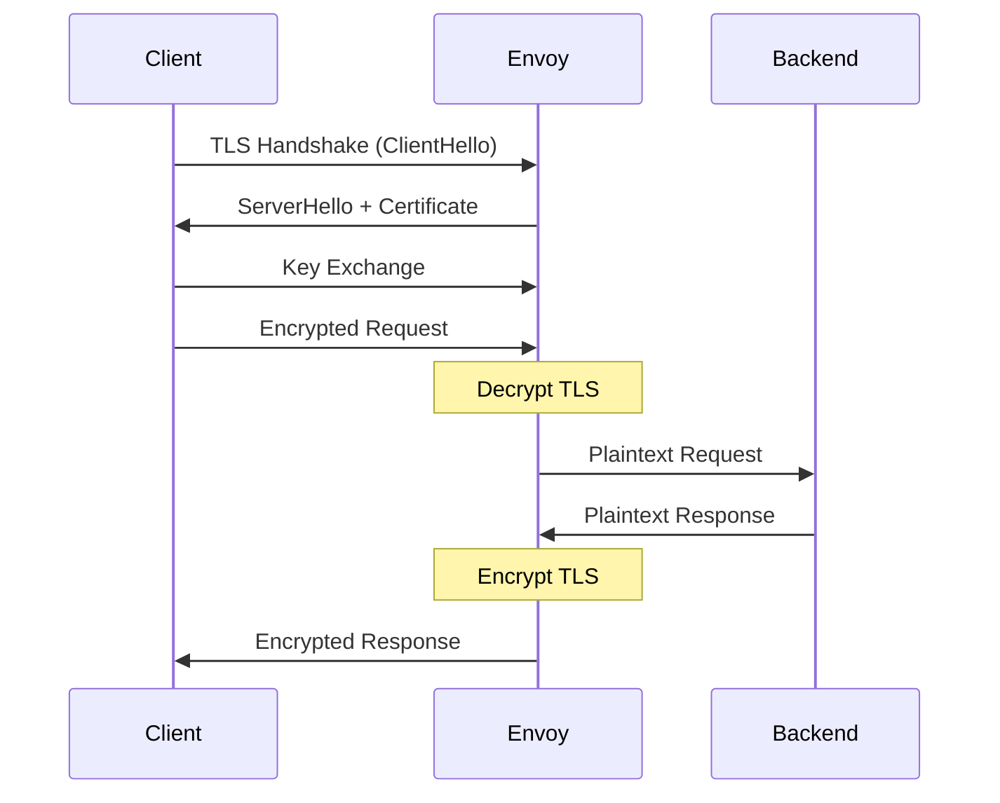
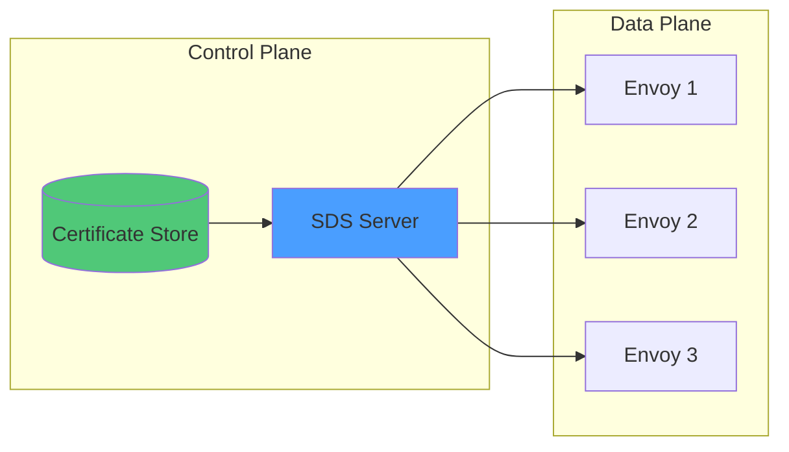
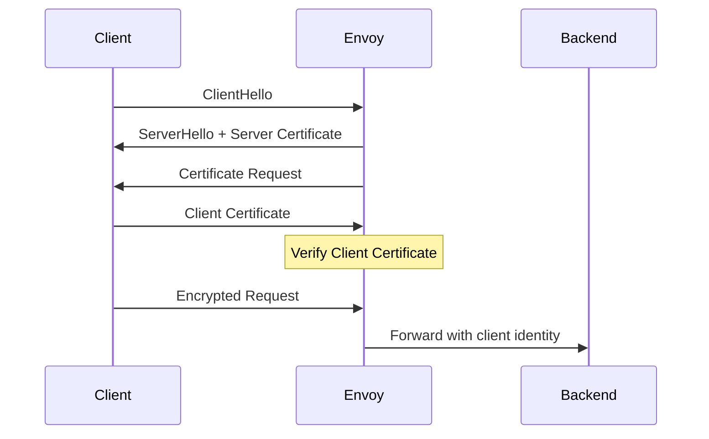
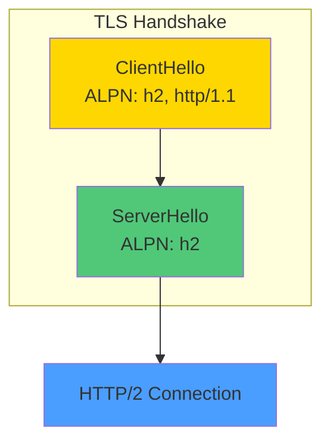

# How to Configure Envoy TLS Termination

Author: [nawazdhandala](https://www.github.com/nawazdhandala)

Tags: Envoy, TLS, Security, mTLS, HTTPS, Proxy, Load Balancer, DevOps, Kubernetes

Description: A comprehensive guide to configuring TLS termination in Envoy Proxy, covering certificate management, SDS-based rotation, mTLS authentication, and ALPN protocol negotiation for secure service communication.

---

> "Security is not a product, but a process." - Bruce Schneier

TLS termination is the process of decrypting encrypted traffic at a proxy before forwarding it to backend services. Envoy Proxy excels at this, offering flexible certificate management, automatic rotation via SDS, and mutual TLS for zero-trust architectures.

## Understanding TLS Termination in Envoy

When Envoy terminates TLS, it handles the cryptographic handshake with clients, decrypts the traffic, and forwards plaintext (or re-encrypted) requests to upstream services.



### Benefits of TLS Termination at the Edge

- **Centralized certificate management** - Update certificates in one place
- **Reduced backend complexity** - Services don't need TLS configuration
- **Better performance** - Offload CPU-intensive crypto from application servers
- **Easier debugging** - Inspect plaintext traffic between Envoy and backends

## Basic TLS Configuration

Start with a simple listener that terminates TLS using static certificates.

```yaml
# envoy.yaml - Basic TLS termination configuration
static_resources:
  listeners:
    - name: https_listener
      address:
        socket_address:
          address: 0.0.0.0
          port_value: 443
      filter_chains:
        - filters:
            - name: envoy.filters.network.http_connection_manager
              typed_config:
                "@type": type.googleapis.com/envoy.extensions.filters.network.http_connection_manager.v3.HttpConnectionManager
                stat_prefix: ingress_http
                codec_type: AUTO
                route_config:
                  name: local_route
                  virtual_hosts:
                    - name: backend
                      domains: ["*"]
                      routes:
                        - match:
                            prefix: "/"
                          route:
                            cluster: backend_service
                http_filters:
                  - name: envoy.filters.http.router
                    typed_config:
                      "@type": type.googleapis.com/envoy.extensions.filters.http.router.v3.Router
          # TLS context for termination
          transport_socket:
            name: envoy.transport_sockets.tls
            typed_config:
              "@type": type.googleapis.com/envoy.extensions.transport_sockets.tls.v3.DownstreamTlsContext
              common_tls_context:
                tls_certificates:
                  # Certificate chain (server cert + intermediates)
                  - certificate_chain:
                      filename: /etc/envoy/certs/server.crt
                    # Private key for the certificate
                    private_key:
                      filename: /etc/envoy/certs/server.key
  clusters:
    - name: backend_service
      type: STRICT_DNS
      lb_policy: ROUND_ROBIN
      load_assignment:
        cluster_name: backend_service
        endpoints:
          - lb_endpoints:
              - endpoint:
                  address:
                    socket_address:
                      address: backend
                      port_value: 8080
```

### TLS Protocol and Cipher Configuration

Control which TLS versions and cipher suites are allowed.

```yaml
# Enhanced TLS context with protocol/cipher restrictions
transport_socket:
  name: envoy.transport_sockets.tls
  typed_config:
    "@type": type.googleapis.com/envoy.extensions.transport_sockets.tls.v3.DownstreamTlsContext
    common_tls_context:
      tls_certificates:
        - certificate_chain:
            filename: /etc/envoy/certs/server.crt
          private_key:
            filename: /etc/envoy/certs/server.key
      # Minimum TLS version - reject TLS 1.0/1.1
      tls_params:
        tls_minimum_protocol_version: TLSv1_2
        tls_maximum_protocol_version: TLSv1_3
        # Explicitly set allowed cipher suites for TLS 1.2
        cipher_suites:
          - ECDHE-ECDSA-AES256-GCM-SHA384
          - ECDHE-RSA-AES256-GCM-SHA384
          - ECDHE-ECDSA-AES128-GCM-SHA256
          - ECDHE-RSA-AES128-GCM-SHA256
      # ALPN protocols for HTTP/2 and HTTP/1.1 negotiation
      alpn_protocols:
        - h2
        - http/1.1
```

## Certificate Rotation with SDS (Secret Discovery Service)

Static certificates require Envoy restarts for rotation. SDS enables dynamic certificate updates without downtime.



### SDS Configuration

Configure Envoy to fetch certificates from an SDS server.

```yaml
# envoy.yaml - SDS-based TLS configuration
static_resources:
  listeners:
    - name: https_listener
      address:
        socket_address:
          address: 0.0.0.0
          port_value: 443
      filter_chains:
        - filters:
            - name: envoy.filters.network.http_connection_manager
              typed_config:
                "@type": type.googleapis.com/envoy.extensions.filters.network.http_connection_manager.v3.HttpConnectionManager
                stat_prefix: ingress_http
                route_config:
                  name: local_route
                  virtual_hosts:
                    - name: backend
                      domains: ["*"]
                      routes:
                        - match:
                            prefix: "/"
                          route:
                            cluster: backend_service
                http_filters:
                  - name: envoy.filters.http.router
                    typed_config:
                      "@type": type.googleapis.com/envoy.extensions.filters.http.router.v3.Router
          transport_socket:
            name: envoy.transport_sockets.tls
            typed_config:
              "@type": type.googleapis.com/envoy.extensions.transport_sockets.tls.v3.DownstreamTlsContext
              common_tls_context:
                # Reference SDS for certificate instead of static files
                tls_certificate_sds_secret_configs:
                  - name: server_cert
                    sds_config:
                      # Use API config source for dynamic updates
                      api_config_source:
                        api_type: GRPC
                        transport_api_version: V3
                        grpc_services:
                          - envoy_grpc:
                              cluster_name: sds_cluster
                      # How often to check for updates
                      resource_api_version: V3

  clusters:
    # SDS server cluster
    - name: sds_cluster
      type: STRICT_DNS
      connect_timeout: 5s
      lb_policy: ROUND_ROBIN
      typed_extension_protocol_options:
        envoy.extensions.upstreams.http.v3.HttpProtocolOptions:
          "@type": type.googleapis.com/envoy.extensions.upstreams.http.v3.HttpProtocolOptions
          explicit_http_config:
            http2_protocol_options: {}
      load_assignment:
        cluster_name: sds_cluster
        endpoints:
          - lb_endpoints:
              - endpoint:
                  address:
                    socket_address:
                      address: sds-server.default.svc.cluster.local
                      port_value: 8080

    - name: backend_service
      type: STRICT_DNS
      lb_policy: ROUND_ROBIN
      load_assignment:
        cluster_name: backend_service
        endpoints:
          - lb_endpoints:
              - endpoint:
                  address:
                    socket_address:
                      address: backend
                      port_value: 8080
```

### File-Based SDS (Simpler Alternative)

For simpler deployments, use file-based SDS that watches certificate files.

```yaml
# File-based SDS - watches files for changes
transport_socket:
  name: envoy.transport_sockets.tls
  typed_config:
    "@type": type.googleapis.com/envoy.extensions.transport_sockets.tls.v3.DownstreamTlsContext
    common_tls_context:
      tls_certificate_sds_secret_configs:
        - name: server_cert
          sds_config:
            # Path-based config source watches files for changes
            path_config_source:
              path: /etc/envoy/sds/server_cert.yaml
              # Watch for changes every 5 seconds
              watched_directory:
                path: /etc/envoy/sds
```

Create the SDS secret file that Envoy watches:

```yaml
# /etc/envoy/sds/server_cert.yaml
resources:
  - "@type": type.googleapis.com/envoy.extensions.transport_sockets.tls.v3.Secret
    name: server_cert
    tls_certificate:
      certificate_chain:
        filename: /etc/envoy/certs/server.crt
      private_key:
        filename: /etc/envoy/certs/server.key
```

## Mutual TLS (mTLS) Configuration

mTLS requires both client and server to present certificates, enabling zero-trust communication.



### mTLS Server Configuration

Configure Envoy to require and verify client certificates.

```yaml
# envoy.yaml - mTLS configuration requiring client certificates
static_resources:
  listeners:
    - name: mtls_listener
      address:
        socket_address:
          address: 0.0.0.0
          port_value: 443
      filter_chains:
        - filters:
            - name: envoy.filters.network.http_connection_manager
              typed_config:
                "@type": type.googleapis.com/envoy.extensions.filters.network.http_connection_manager.v3.HttpConnectionManager
                stat_prefix: ingress_http
                # Forward client certificate info to backend
                forward_client_cert_details: SANITIZE_SET
                set_current_client_cert_details:
                  subject: true
                  uri: true
                  dns: true
                route_config:
                  name: local_route
                  virtual_hosts:
                    - name: backend
                      domains: ["*"]
                      routes:
                        - match:
                            prefix: "/"
                          route:
                            cluster: backend_service
                http_filters:
                  - name: envoy.filters.http.router
                    typed_config:
                      "@type": type.googleapis.com/envoy.extensions.filters.http.router.v3.Router
          transport_socket:
            name: envoy.transport_sockets.tls
            typed_config:
              "@type": type.googleapis.com/envoy.extensions.transport_sockets.tls.v3.DownstreamTlsContext
              # Require client certificate
              require_client_certificate: true
              common_tls_context:
                tls_certificates:
                  - certificate_chain:
                      filename: /etc/envoy/certs/server.crt
                    private_key:
                      filename: /etc/envoy/certs/server.key
                # Validation context for client certificates
                validation_context:
                  # CA certificate(s) to verify client certs
                  trusted_ca:
                    filename: /etc/envoy/certs/ca.crt
                  # Optional: Only allow specific client certificate subjects
                  match_typed_subject_alt_names:
                    - san_type: DNS
                      matcher:
                        exact: "client.example.com"
                  # Verify certificate chain depth
                  max_verify_depth: 2
```

### mTLS with Certificate Revocation

Add CRL or OCSP checking for revoked certificates.

```yaml
# mTLS with CRL checking
validation_context:
  trusted_ca:
    filename: /etc/envoy/certs/ca.crt
  # Certificate Revocation List
  crl:
    filename: /etc/envoy/certs/ca.crl
  # Or use OCSP stapling
  only_verify_leaf_cert_crl: false
```

### Upstream mTLS (Envoy as Client)

Configure Envoy to present client certificates when connecting to upstream services.

```yaml
# Cluster with upstream mTLS
clusters:
  - name: secure_backend
    type: STRICT_DNS
    lb_policy: ROUND_ROBIN
    load_assignment:
      cluster_name: secure_backend
      endpoints:
        - lb_endpoints:
            - endpoint:
                address:
                  socket_address:
                    address: secure-backend.example.com
                    port_value: 443
    # Upstream TLS configuration (Envoy as client)
    transport_socket:
      name: envoy.transport_sockets.tls
      typed_config:
        "@type": type.googleapis.com/envoy.extensions.transport_sockets.tls.v3.UpstreamTlsContext
        # SNI for the upstream connection
        sni: secure-backend.example.com
        common_tls_context:
          # Client certificate for mTLS
          tls_certificates:
            - certificate_chain:
                filename: /etc/envoy/certs/client.crt
              private_key:
                filename: /etc/envoy/certs/client.key
          # Verify the upstream server certificate
          validation_context:
            trusted_ca:
              filename: /etc/envoy/certs/upstream-ca.crt
            match_typed_subject_alt_names:
              - san_type: DNS
                matcher:
                  exact: "secure-backend.example.com"
```

## ALPN Protocol Negotiation

ALPN (Application-Layer Protocol Negotiation) allows clients and servers to negotiate which protocol to use during the TLS handshake.



### Configuring ALPN for HTTP/2

```yaml
# ALPN configuration for HTTP/2 support
transport_socket:
  name: envoy.transport_sockets.tls
  typed_config:
    "@type": type.googleapis.com/envoy.extensions.transport_sockets.tls.v3.DownstreamTlsContext
    common_tls_context:
      tls_certificates:
        - certificate_chain:
            filename: /etc/envoy/certs/server.crt
          private_key:
            filename: /etc/envoy/certs/server.key
      # ALPN protocols in preference order
      alpn_protocols:
        - h2      # HTTP/2 preferred
        - http/1.1  # Fallback to HTTP/1.1
```

### ALPN for gRPC Services

gRPC requires HTTP/2, so configure ALPN accordingly.

```yaml
# ALPN for gRPC-only services
static_resources:
  listeners:
    - name: grpc_listener
      address:
        socket_address:
          address: 0.0.0.0
          port_value: 443
      filter_chains:
        - filters:
            - name: envoy.filters.network.http_connection_manager
              typed_config:
                "@type": type.googleapis.com/envoy.extensions.filters.network.http_connection_manager.v3.HttpConnectionManager
                stat_prefix: grpc
                # Force HTTP/2 for gRPC
                codec_type: HTTP2
                route_config:
                  name: grpc_route
                  virtual_hosts:
                    - name: grpc_service
                      domains: ["*"]
                      routes:
                        - match:
                            prefix: "/"
                            grpc: {}
                          route:
                            cluster: grpc_backend
                http_filters:
                  - name: envoy.filters.http.router
                    typed_config:
                      "@type": type.googleapis.com/envoy.extensions.filters.http.router.v3.Router
          transport_socket:
            name: envoy.transport_sockets.tls
            typed_config:
              "@type": type.googleapis.com/envoy.extensions.transport_sockets.tls.v3.DownstreamTlsContext
              common_tls_context:
                tls_certificates:
                  - certificate_chain:
                      filename: /etc/envoy/certs/server.crt
                    private_key:
                      filename: /etc/envoy/certs/server.key
                # HTTP/2 only for gRPC
                alpn_protocols:
                  - h2
```

## SNI-Based Routing

Route to different backends based on the SNI (Server Name Indication) in the TLS handshake.

```yaml
# SNI-based routing to different backends
static_resources:
  listeners:
    - name: sni_listener
      address:
        socket_address:
          address: 0.0.0.0
          port_value: 443
      listener_filters:
        # Extract SNI before filter chain selection
        - name: envoy.filters.listener.tls_inspector
          typed_config:
            "@type": type.googleapis.com/envoy.extensions.filters.listener.tls_inspector.v3.TlsInspector
      filter_chains:
        # Filter chain for api.example.com
        - filter_chain_match:
            server_names:
              - "api.example.com"
          filters:
            - name: envoy.filters.network.http_connection_manager
              typed_config:
                "@type": type.googleapis.com/envoy.extensions.filters.network.http_connection_manager.v3.HttpConnectionManager
                stat_prefix: api
                route_config:
                  virtual_hosts:
                    - name: api
                      domains: ["*"]
                      routes:
                        - match:
                            prefix: "/"
                          route:
                            cluster: api_backend
                http_filters:
                  - name: envoy.filters.http.router
                    typed_config:
                      "@type": type.googleapis.com/envoy.extensions.filters.http.router.v3.Router
          transport_socket:
            name: envoy.transport_sockets.tls
            typed_config:
              "@type": type.googleapis.com/envoy.extensions.transport_sockets.tls.v3.DownstreamTlsContext
              common_tls_context:
                tls_certificates:
                  - certificate_chain:
                      filename: /etc/envoy/certs/api.example.com.crt
                    private_key:
                      filename: /etc/envoy/certs/api.example.com.key

        # Filter chain for app.example.com
        - filter_chain_match:
            server_names:
              - "app.example.com"
          filters:
            - name: envoy.filters.network.http_connection_manager
              typed_config:
                "@type": type.googleapis.com/envoy.extensions.filters.network.http_connection_manager.v3.HttpConnectionManager
                stat_prefix: app
                route_config:
                  virtual_hosts:
                    - name: app
                      domains: ["*"]
                      routes:
                        - match:
                            prefix: "/"
                          route:
                            cluster: app_backend
                http_filters:
                  - name: envoy.filters.http.router
                    typed_config:
                      "@type": type.googleapis.com/envoy.extensions.filters.http.router.v3.Router
          transport_socket:
            name: envoy.transport_sockets.tls
            typed_config:
              "@type": type.googleapis.com/envoy.extensions.transport_sockets.tls.v3.DownstreamTlsContext
              common_tls_context:
                tls_certificates:
                  - certificate_chain:
                      filename: /etc/envoy/certs/app.example.com.crt
                    private_key:
                      filename: /etc/envoy/certs/app.example.com.key
```

## Complete Production Example

Here is a production-ready configuration combining all the concepts.

```yaml
# production-envoy.yaml - Complete TLS termination setup
admin:
  address:
    socket_address:
      address: 127.0.0.1
      port_value: 9901

static_resources:
  listeners:
    # HTTPS listener with mTLS support
    - name: https_listener
      address:
        socket_address:
          address: 0.0.0.0
          port_value: 443
      per_connection_buffer_limit_bytes: 32768
      listener_filters:
        - name: envoy.filters.listener.tls_inspector
          typed_config:
            "@type": type.googleapis.com/envoy.extensions.filters.listener.tls_inspector.v3.TlsInspector
      filter_chains:
        - filters:
            - name: envoy.filters.network.http_connection_manager
              typed_config:
                "@type": type.googleapis.com/envoy.extensions.filters.network.http_connection_manager.v3.HttpConnectionManager
                stat_prefix: ingress_https
                codec_type: AUTO
                # Connection timeouts
                stream_idle_timeout: 300s
                request_timeout: 60s
                # Forward client cert details to backend
                forward_client_cert_details: APPEND_FORWARD
                set_current_client_cert_details:
                  subject: true
                  uri: true
                # Access logging
                access_log:
                  - name: envoy.access_loggers.stdout
                    typed_config:
                      "@type": type.googleapis.com/envoy.extensions.access_loggers.stream.v3.StdoutAccessLog
                      log_format:
                        json_format:
                          timestamp: "%START_TIME%"
                          client_ip: "%DOWNSTREAM_REMOTE_ADDRESS_WITHOUT_PORT%"
                          method: "%REQ(:METHOD)%"
                          path: "%REQ(:PATH)%"
                          protocol: "%PROTOCOL%"
                          response_code: "%RESPONSE_CODE%"
                          duration_ms: "%DURATION%"
                          tls_version: "%DOWNSTREAM_TLS_VERSION%"
                          tls_cipher: "%DOWNSTREAM_TLS_CIPHER%"
                route_config:
                  name: local_route
                  virtual_hosts:
                    - name: backend
                      domains: ["*"]
                      routes:
                        - match:
                            prefix: "/api/"
                          route:
                            cluster: api_service
                            timeout: 30s
                        - match:
                            prefix: "/"
                          route:
                            cluster: web_service
                            timeout: 30s
                http_filters:
                  # Health check filter
                  - name: envoy.filters.http.health_check
                    typed_config:
                      "@type": type.googleapis.com/envoy.extensions.filters.http.health_check.v3.HealthCheck
                      pass_through_mode: false
                      headers:
                        - name: ":path"
                          exact_match: "/healthz"
                  - name: envoy.filters.http.router
                    typed_config:
                      "@type": type.googleapis.com/envoy.extensions.filters.http.router.v3.Router
          transport_socket:
            name: envoy.transport_sockets.tls
            typed_config:
              "@type": type.googleapis.com/envoy.extensions.transport_sockets.tls.v3.DownstreamTlsContext
              # Optional client certificate (mTLS)
              require_client_certificate: false
              common_tls_context:
                # Use SDS for dynamic certificate rotation
                tls_certificate_sds_secret_configs:
                  - name: server_cert
                    sds_config:
                      path_config_source:
                        path: /etc/envoy/sds/server_cert.yaml
                        watched_directory:
                          path: /etc/envoy/sds
                # TLS parameters
                tls_params:
                  tls_minimum_protocol_version: TLSv1_2
                  tls_maximum_protocol_version: TLSv1_3
                  cipher_suites:
                    - ECDHE-ECDSA-AES256-GCM-SHA384
                    - ECDHE-RSA-AES256-GCM-SHA384
                    - ECDHE-ECDSA-AES128-GCM-SHA256
                    - ECDHE-RSA-AES128-GCM-SHA256
                # ALPN for HTTP/2 and HTTP/1.1
                alpn_protocols:
                  - h2
                  - http/1.1
                # Client certificate validation (optional mTLS)
                validation_context:
                  trusted_ca:
                    filename: /etc/envoy/certs/ca.crt
                  allow_expired_certificate: false

    # HTTP redirect to HTTPS
    - name: http_redirect
      address:
        socket_address:
          address: 0.0.0.0
          port_value: 80
      filter_chains:
        - filters:
            - name: envoy.filters.network.http_connection_manager
              typed_config:
                "@type": type.googleapis.com/envoy.extensions.filters.network.http_connection_manager.v3.HttpConnectionManager
                stat_prefix: ingress_http
                route_config:
                  virtual_hosts:
                    - name: redirect
                      domains: ["*"]
                      routes:
                        - match:
                            prefix: "/"
                          redirect:
                            https_redirect: true
                            response_code: MOVED_PERMANENTLY
                http_filters:
                  - name: envoy.filters.http.router
                    typed_config:
                      "@type": type.googleapis.com/envoy.extensions.filters.http.router.v3.Router

  clusters:
    - name: api_service
      type: STRICT_DNS
      lb_policy: ROUND_ROBIN
      connect_timeout: 5s
      # Health checks
      health_checks:
        - timeout: 5s
          interval: 10s
          unhealthy_threshold: 3
          healthy_threshold: 2
          http_health_check:
            path: /health
      load_assignment:
        cluster_name: api_service
        endpoints:
          - lb_endpoints:
              - endpoint:
                  address:
                    socket_address:
                      address: api-service.default.svc.cluster.local
                      port_value: 8080

    - name: web_service
      type: STRICT_DNS
      lb_policy: ROUND_ROBIN
      connect_timeout: 5s
      load_assignment:
        cluster_name: web_service
        endpoints:
          - lb_endpoints:
              - endpoint:
                  address:
                    socket_address:
                      address: web-service.default.svc.cluster.local
                      port_value: 8080
```

## Kubernetes Deployment

Deploy Envoy with TLS termination in Kubernetes.

```yaml
# envoy-deployment.yaml
apiVersion: v1
kind: ConfigMap
metadata:
  name: envoy-config
data:
  envoy.yaml: |
    # ... your envoy configuration here ...

---
apiVersion: v1
kind: Secret
metadata:
  name: envoy-certs
type: kubernetes.io/tls
data:
  tls.crt: <base64-encoded-cert>
  tls.key: <base64-encoded-key>
  ca.crt: <base64-encoded-ca>

---
apiVersion: apps/v1
kind: Deployment
metadata:
  name: envoy
spec:
  replicas: 3
  selector:
    matchLabels:
      app: envoy
  template:
    metadata:
      labels:
        app: envoy
    spec:
      containers:
        - name: envoy
          image: envoyproxy/envoy:v1.28-latest
          ports:
            - containerPort: 443
              name: https
            - containerPort: 80
              name: http
            - containerPort: 9901
              name: admin
          volumeMounts:
            - name: config
              mountPath: /etc/envoy
              readOnly: true
            - name: certs
              mountPath: /etc/envoy/certs
              readOnly: true
          resources:
            requests:
              cpu: 100m
              memory: 128Mi
            limits:
              cpu: 500m
              memory: 512Mi
          readinessProbe:
            httpGet:
              path: /ready
              port: 9901
            initialDelaySeconds: 5
            periodSeconds: 10
          livenessProbe:
            httpGet:
              path: /ready
              port: 9901
            initialDelaySeconds: 10
            periodSeconds: 15
      volumes:
        - name: config
          configMap:
            name: envoy-config
        - name: certs
          secret:
            secretName: envoy-certs

---
apiVersion: v1
kind: Service
metadata:
  name: envoy
spec:
  type: LoadBalancer
  ports:
    - port: 443
      targetPort: 443
      name: https
    - port: 80
      targetPort: 80
      name: http
  selector:
    app: envoy
```

## Troubleshooting TLS Issues

### Verify Certificate Chain

```bash
# Check certificate details
openssl x509 -in server.crt -text -noout

# Verify certificate chain
openssl verify -CAfile ca.crt server.crt

# Test TLS connection
openssl s_client -connect localhost:443 -servername example.com

# Check ALPN negotiation
openssl s_client -connect localhost:443 -alpn h2,http/1.1
```

### Envoy TLS Statistics

```bash
# Check TLS handshake stats
curl -s localhost:9901/stats | grep ssl

# Common stats to monitor:
# ssl.handshake - Total TLS handshakes
# ssl.session_reused - TLS session resumption
# ssl.no_certificate - Client did not present certificate
# ssl.fail_verify_error - Certificate verification failures
```

### Common Issues

| Issue | Cause | Solution |
|-------|-------|----------|
| `CERTIFICATE_VERIFY_FAILED` | Invalid or missing CA | Check `trusted_ca` path |
| `NO_SHARED_CIPHER` | Incompatible ciphers | Update `cipher_suites` |
| `TLSV1_ALERT_PROTOCOL_VERSION` | TLS version mismatch | Check `tls_minimum_protocol_version` |
| `CERTIFICATE_REQUIRED` | Missing client cert | Provide client certificate for mTLS |

## Monitoring TLS with OneUptime

Proper monitoring is essential for TLS-terminated services. [OneUptime](https://oneuptime.com) provides comprehensive monitoring for your Envoy-based infrastructure:

- **SSL Certificate Monitoring** - Get alerts before certificates expire
- **TLS Handshake Latency** - Track performance of TLS negotiations
- **Error Rate Tracking** - Monitor TLS errors and failures
- **Custom Dashboards** - Visualize Envoy stats alongside application metrics

Set up alerting for certificate expiration and TLS errors to catch issues before they impact users.

---

TLS termination is foundational for secure service communication. Envoy's flexible configuration supports everything from simple certificate management to complex mTLS deployments with dynamic rotation. Start simple, add complexity as needed, and always monitor your TLS health.
