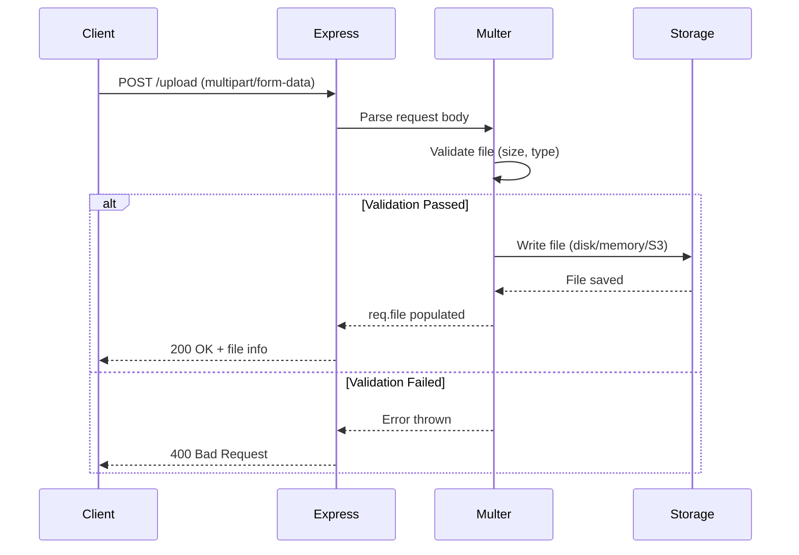
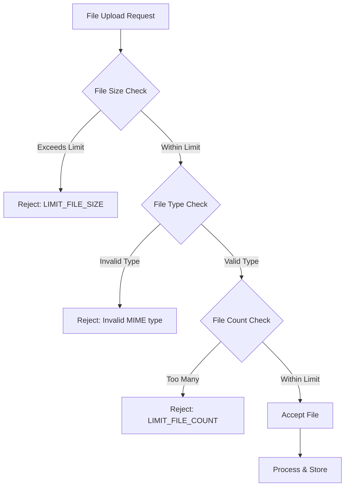
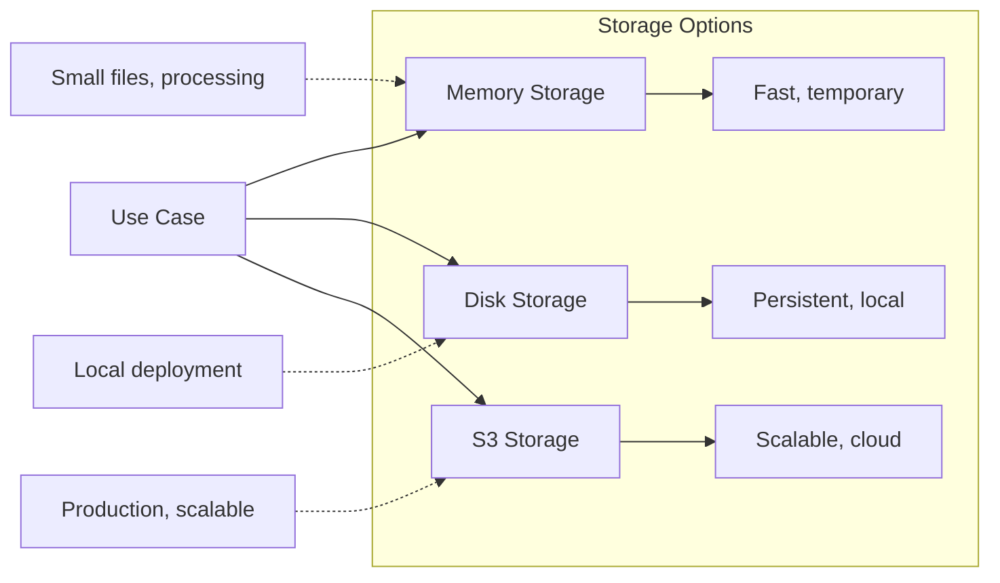

# How to Build File Upload APIs with Express and Multer

By [Nawaz Dhandala](https://github.com/nawazdhandala)

Tags: NodeJS, Express, Multer, File Upload, API, Storage, AWS S3, DevOps

Description: A comprehensive guide to building robust file upload APIs with Express and Multer, covering configuration, validation, storage options, and production-ready error handling.

---

> "The best APIs are like good plumbing - you never notice them until something goes wrong." - Unknown

File uploads are a fundamental feature of modern web applications, from profile pictures to document management systems. Express.js combined with Multer provides a powerful, flexible solution for handling multipart/form-data, the encoding type used for file uploads. This guide walks you through building production-ready file upload APIs.

## Understanding the File Upload Flow

Before diving into code, let's understand how file uploads work in a typical web application:



## Setting Up the Project

First, let's set up a new Express project with the necessary dependencies:

```bash
# Create project directory
mkdir express-upload-api
cd express-upload-api

# Initialize npm project
npm init -y

# Install dependencies
npm install express multer
npm install @aws-sdk/client-s3 @aws-sdk/lib-storage multer-s3  # For S3 storage
npm install uuid  # For unique filenames
```

## Basic Multer Configuration

Multer is a middleware that handles `multipart/form-data` requests. Here's a basic setup:

```javascript
// server.js
const express = require('express');
const multer = require('multer');
const path = require('path');

const app = express();

// Basic multer configuration with disk storage
const storage = multer.diskStorage({
  // Define where files should be stored
  destination: function (req, file, cb) {
    cb(null, 'uploads/');
  },
  // Define how files should be named
  filename: function (req, file, cb) {
    // Generate unique filename: timestamp-randomstring.extension
    const uniqueSuffix = Date.now() + '-' + Math.round(Math.random() * 1E9);
    cb(null, file.fieldname + '-' + uniqueSuffix + path.extname(file.originalname));
  }
});

// Create multer instance with configuration
const upload = multer({ storage: storage });

// Start server
app.listen(3000, () => {
  console.log('Server running on port 3000');
});
```

## Single File Upload

The most common use case is uploading a single file:

```javascript
// Single file upload endpoint
// 'avatar' is the field name in the form
app.post('/upload/single', upload.single('avatar'), (req, res) => {
  // req.file contains information about the uploaded file
  // req.body contains any text fields from the form

  if (!req.file) {
    return res.status(400).json({
      success: false,
      message: 'No file uploaded'
    });
  }

  // Return file information to client
  res.json({
    success: true,
    message: 'File uploaded successfully',
    file: {
      filename: req.file.filename,
      originalName: req.file.originalname,
      mimetype: req.file.mimetype,
      size: req.file.size,
      path: req.file.path
    }
  });
});
```

## Multiple File Uploads

For scenarios where users need to upload multiple files at once:

```javascript
// Multiple files upload - same field name
// Accepts up to 5 files with field name 'photos'
app.post('/upload/multiple', upload.array('photos', 5), (req, res) => {
  // req.files is an array of file objects

  if (!req.files || req.files.length === 0) {
    return res.status(400).json({
      success: false,
      message: 'No files uploaded'
    });
  }

  // Map files to response format
  const uploadedFiles = req.files.map(file => ({
    filename: file.filename,
    originalName: file.originalname,
    mimetype: file.mimetype,
    size: file.size
  }));

  res.json({
    success: true,
    message: `${req.files.length} files uploaded successfully`,
    files: uploadedFiles
  });
});

// Multiple files upload - different field names
// Useful for forms with distinct file inputs
const multipleFields = upload.fields([
  { name: 'avatar', maxCount: 1 },
  { name: 'documents', maxCount: 3 },
  { name: 'gallery', maxCount: 10 }
]);

app.post('/upload/fields', multipleFields, (req, res) => {
  // req.files is an object with field names as keys
  // req.files.avatar[0], req.files.documents[], req.files.gallery[]

  const response = {
    avatar: req.files['avatar'] ? req.files['avatar'][0].filename : null,
    documents: req.files['documents'] ? req.files['documents'].map(f => f.filename) : [],
    gallery: req.files['gallery'] ? req.files['gallery'].map(f => f.filename) : []
  };

  res.json({
    success: true,
    files: response
  });
});
```

## File Validation

Proper validation is crucial for security and user experience. Multer provides several validation options:



### Size Validation

```javascript
// Configure size limits
const uploadWithLimits = multer({
  storage: storage,
  limits: {
    fileSize: 5 * 1024 * 1024,  // 5MB max file size
    files: 5,                    // Max 5 files per request
    fields: 10,                  // Max 10 non-file fields
    parts: 15,                   // Max 15 parts (files + fields)
    headerPairs: 2000            // Max header key-value pairs
  }
});
```

### File Type Validation

```javascript
// File filter function for type validation
const fileFilter = (req, file, cb) => {
  // Define allowed MIME types
  const allowedMimes = [
    'image/jpeg',
    'image/png',
    'image/gif',
    'image/webp',
    'application/pdf'
  ];

  // Define allowed extensions
  const allowedExtensions = ['.jpg', '.jpeg', '.png', '.gif', '.webp', '.pdf'];

  // Get file extension
  const ext = path.extname(file.originalname).toLowerCase();

  // Check both MIME type and extension
  if (allowedMimes.includes(file.mimetype) && allowedExtensions.includes(ext)) {
    // Accept file
    cb(null, true);
  } else {
    // Reject file with custom error
    cb(new Error(`Invalid file type. Allowed types: ${allowedExtensions.join(', ')}`), false);
  }
};

// Create multer instance with all validations
const secureUpload = multer({
  storage: storage,
  limits: {
    fileSize: 5 * 1024 * 1024  // 5MB
  },
  fileFilter: fileFilter
});

// Use in route
app.post('/upload/secure', secureUpload.single('file'), (req, res) => {
  res.json({
    success: true,
    file: req.file
  });
});
```

### Advanced Validation with Magic Bytes

MIME types can be spoofed. For better security, validate files by their magic bytes:

```javascript
const fileType = require('file-type');
const fs = require('fs');

// Middleware to validate file content after upload
const validateFileContent = async (req, res, next) => {
  if (!req.file) {
    return next();
  }

  try {
    // Read the file and detect its type from magic bytes
    const buffer = await fs.promises.readFile(req.file.path);
    const type = await fileType.fromBuffer(buffer);

    // Define truly allowed types based on magic bytes
    const allowedTypes = ['image/jpeg', 'image/png', 'image/gif', 'application/pdf'];

    if (!type || !allowedTypes.includes(type.mime)) {
      // Delete the invalid file
      await fs.promises.unlink(req.file.path);

      return res.status(400).json({
        success: false,
        message: 'Invalid file content. File type does not match extension.'
      });
    }

    // Attach detected type to request for later use
    req.detectedFileType = type;
    next();
  } catch (error) {
    next(error);
  }
};

// Use both multer and content validation
app.post('/upload/validated',
  secureUpload.single('file'),
  validateFileContent,
  (req, res) => {
    res.json({
      success: true,
      file: req.file,
      detectedType: req.detectedFileType
    });
  }
);
```

## Storage Options

Multer supports different storage engines for various use cases:



### Memory Storage

Stores files in memory as Buffer objects. Best for small files that need immediate processing:

```javascript
// Memory storage configuration
const memoryStorage = multer.memoryStorage();

const memoryUpload = multer({
  storage: memoryStorage,
  limits: {
    fileSize: 1 * 1024 * 1024  // 1MB limit for memory storage
  }
});

app.post('/upload/memory', memoryUpload.single('file'), async (req, res) => {
  // req.file.buffer contains the file data
  // Process file in memory (e.g., image manipulation)

  if (!req.file) {
    return res.status(400).json({ success: false, message: 'No file uploaded' });
  }

  // Example: Get file hash for deduplication
  const crypto = require('crypto');
  const hash = crypto.createHash('sha256').update(req.file.buffer).digest('hex');

  res.json({
    success: true,
    file: {
      originalName: req.file.originalname,
      mimetype: req.file.mimetype,
      size: req.file.size,
      hash: hash
    }
  });
});
```

### Disk Storage

The default and most common option for local deployments:

```javascript
const fs = require('fs');
const { v4: uuidv4 } = require('uuid');

// Ensure upload directory exists
const uploadDir = 'uploads';
if (!fs.existsSync(uploadDir)) {
  fs.mkdirSync(uploadDir, { recursive: true });
}

// Advanced disk storage configuration
const diskStorage = multer.diskStorage({
  destination: function (req, file, cb) {
    // Organize files by date
    const date = new Date();
    const year = date.getFullYear();
    const month = String(date.getMonth() + 1).padStart(2, '0');
    const day = String(date.getDate()).padStart(2, '0');

    const dir = path.join(uploadDir, year.toString(), month, day);

    // Create directory if it doesn't exist
    fs.mkdirSync(dir, { recursive: true });

    cb(null, dir);
  },
  filename: function (req, file, cb) {
    // Generate UUID-based filename to prevent collisions
    const ext = path.extname(file.originalname);
    const filename = `${uuidv4()}${ext}`;
    cb(null, filename);
  }
});

const diskUpload = multer({
  storage: diskStorage,
  limits: { fileSize: 50 * 1024 * 1024 }  // 50MB for disk storage
});
```

### AWS S3 Storage

For production applications, cloud storage like S3 provides scalability and reliability:

```javascript
const { S3Client } = require('@aws-sdk/client-s3');
const multerS3 = require('multer-s3');

// Configure S3 client
const s3 = new S3Client({
  region: process.env.AWS_REGION || 'us-east-1',
  credentials: {
    accessKeyId: process.env.AWS_ACCESS_KEY_ID,
    secretAccessKey: process.env.AWS_SECRET_ACCESS_KEY
  }
});

// S3 storage configuration
const s3Storage = multerS3({
  s3: s3,
  bucket: process.env.S3_BUCKET_NAME,

  // Set access control (private by default)
  acl: 'private',

  // Set content type automatically
  contentType: multerS3.AUTO_CONTENT_TYPE,

  // Define S3 key (file path in bucket)
  key: function (req, file, cb) {
    const date = new Date();
    const year = date.getFullYear();
    const month = String(date.getMonth() + 1).padStart(2, '0');

    // Organize by user and date
    const userId = req.user?.id || 'anonymous';
    const filename = `${uuidv4()}${path.extname(file.originalname)}`;
    const key = `uploads/${userId}/${year}/${month}/${filename}`;

    cb(null, key);
  },

  // Optional: Set metadata
  metadata: function (req, file, cb) {
    cb(null, {
      fieldName: file.fieldname,
      originalName: file.originalname,
      uploadedBy: req.user?.id || 'anonymous'
    });
  }
});

const s3Upload = multer({
  storage: s3Storage,
  limits: { fileSize: 100 * 1024 * 1024 },  // 100MB for S3
  fileFilter: fileFilter
});

// S3 upload endpoint
app.post('/upload/s3', s3Upload.single('file'), (req, res) => {
  if (!req.file) {
    return res.status(400).json({ success: false, message: 'No file uploaded' });
  }

  res.json({
    success: true,
    file: {
      key: req.file.key,
      location: req.file.location,  // S3 URL
      bucket: req.file.bucket,
      mimetype: req.file.mimetype,
      size: req.file.size
    }
  });
});
```

## Error Handling

Robust error handling is essential for production APIs:

```javascript
// Custom error class for upload errors
class UploadError extends Error {
  constructor(message, code, status = 400) {
    super(message);
    this.name = 'UploadError';
    this.code = code;
    this.status = status;
  }
}

// Multer error handler middleware
const handleMulterError = (err, req, res, next) => {
  if (err instanceof multer.MulterError) {
    // Handle Multer-specific errors
    const errorMessages = {
      LIMIT_FILE_SIZE: 'File size exceeds the maximum allowed limit',
      LIMIT_FILE_COUNT: 'Too many files uploaded',
      LIMIT_FIELD_KEY: 'Field name is too long',
      LIMIT_FIELD_VALUE: 'Field value is too long',
      LIMIT_FIELD_COUNT: 'Too many fields in the request',
      LIMIT_UNEXPECTED_FILE: 'Unexpected file field',
      LIMIT_PART_COUNT: 'Too many parts in the request'
    };

    return res.status(400).json({
      success: false,
      error: {
        code: err.code,
        message: errorMessages[err.code] || 'File upload error',
        field: err.field
      }
    });
  }

  if (err instanceof UploadError) {
    return res.status(err.status).json({
      success: false,
      error: {
        code: err.code,
        message: err.message
      }
    });
  }

  // Handle other errors (e.g., from fileFilter)
  if (err) {
    return res.status(400).json({
      success: false,
      error: {
        code: 'UPLOAD_ERROR',
        message: err.message
      }
    });
  }

  next();
};

// Apply error handler to all routes
app.use(handleMulterError);

// Async error wrapper for route handlers
const asyncHandler = (fn) => (req, res, next) => {
  Promise.resolve(fn(req, res, next)).catch(next);
};

// Example route with proper error handling
app.post('/upload/safe',
  secureUpload.single('file'),
  asyncHandler(async (req, res) => {
    if (!req.file) {
      throw new UploadError('No file provided', 'NO_FILE', 400);
    }

    // Process file...
    const result = await processFile(req.file);

    res.json({
      success: true,
      data: result
    });
  })
);

// Cleanup on error - remove partially uploaded files
app.use(async (err, req, res, next) => {
  // If there's an error and a file was uploaded, clean it up
  if (req.file && req.file.path) {
    try {
      await fs.promises.unlink(req.file.path);
    } catch (unlinkErr) {
      console.error('Failed to cleanup file:', unlinkErr);
    }
  }

  // If multiple files were uploaded
  if (req.files) {
    const files = Array.isArray(req.files) ? req.files : Object.values(req.files).flat();
    for (const file of files) {
      if (file.path) {
        try {
          await fs.promises.unlink(file.path);
        } catch (unlinkErr) {
          console.error('Failed to cleanup file:', unlinkErr);
        }
      }
    }
  }

  next(err);
});
```

## Complete Production Example

Here's a complete, production-ready file upload API:

```javascript
// app.js - Complete Express + Multer File Upload API
const express = require('express');
const multer = require('multer');
const path = require('path');
const fs = require('fs');
const { v4: uuidv4 } = require('uuid');
const { S3Client, DeleteObjectCommand } = require('@aws-sdk/client-s3');
const multerS3 = require('multer-s3');

const app = express();
app.use(express.json());

// ============================================
// Configuration
// ============================================

const config = {
  maxFileSize: parseInt(process.env.MAX_FILE_SIZE) || 10 * 1024 * 1024,  // 10MB
  maxFiles: parseInt(process.env.MAX_FILES) || 5,
  uploadDir: process.env.UPLOAD_DIR || 'uploads',
  storageType: process.env.STORAGE_TYPE || 'disk',  // 'disk', 'memory', or 's3'
  allowedMimes: [
    'image/jpeg',
    'image/png',
    'image/gif',
    'image/webp',
    'application/pdf',
    'application/msword',
    'application/vnd.openxmlformats-officedocument.wordprocessingml.document'
  ]
};

// ============================================
// Storage Configuration
// ============================================

// File filter (shared across all storage types)
const fileFilter = (req, file, cb) => {
  if (config.allowedMimes.includes(file.mimetype)) {
    cb(null, true);
  } else {
    cb(new Error(`Invalid file type: ${file.mimetype}`), false);
  }
};

// Disk storage
const diskStorage = multer.diskStorage({
  destination: (req, file, cb) => {
    const dir = path.join(config.uploadDir, new Date().toISOString().split('T')[0]);
    fs.mkdirSync(dir, { recursive: true });
    cb(null, dir);
  },
  filename: (req, file, cb) => {
    cb(null, `${uuidv4()}${path.extname(file.originalname)}`);
  }
});

// S3 storage (conditional)
let s3Storage = null;
if (config.storageType === 's3') {
  const s3 = new S3Client({
    region: process.env.AWS_REGION,
    credentials: {
      accessKeyId: process.env.AWS_ACCESS_KEY_ID,
      secretAccessKey: process.env.AWS_SECRET_ACCESS_KEY
    }
  });

  s3Storage = multerS3({
    s3: s3,
    bucket: process.env.S3_BUCKET_NAME,
    contentType: multerS3.AUTO_CONTENT_TYPE,
    key: (req, file, cb) => {
      const key = `uploads/${new Date().toISOString().split('T')[0]}/${uuidv4()}${path.extname(file.originalname)}`;
      cb(null, key);
    }
  });
}

// Select storage based on config
const getStorage = () => {
  switch (config.storageType) {
    case 'memory':
      return multer.memoryStorage();
    case 's3':
      return s3Storage;
    default:
      return diskStorage;
  }
};

// Create multer instance
const upload = multer({
  storage: getStorage(),
  limits: {
    fileSize: config.maxFileSize,
    files: config.maxFiles
  },
  fileFilter: fileFilter
});

// ============================================
// Routes
// ============================================

// Health check
app.get('/health', (req, res) => {
  res.json({ status: 'ok', storageType: config.storageType });
});

// Single file upload
app.post('/api/upload', upload.single('file'), (req, res) => {
  if (!req.file) {
    return res.status(400).json({ success: false, message: 'No file uploaded' });
  }

  const fileInfo = {
    id: uuidv4(),
    filename: req.file.filename || req.file.key,
    originalName: req.file.originalname,
    mimetype: req.file.mimetype,
    size: req.file.size,
    url: req.file.location || `/files/${req.file.filename}`
  };

  res.status(201).json({ success: true, file: fileInfo });
});

// Multiple file upload
app.post('/api/upload/multiple', upload.array('files', config.maxFiles), (req, res) => {
  if (!req.files || req.files.length === 0) {
    return res.status(400).json({ success: false, message: 'No files uploaded' });
  }

  const files = req.files.map(file => ({
    id: uuidv4(),
    filename: file.filename || file.key,
    originalName: file.originalname,
    mimetype: file.mimetype,
    size: file.size,
    url: file.location || `/files/${file.filename}`
  }));

  res.status(201).json({ success: true, files: files });
});

// Serve uploaded files (for disk storage)
app.use('/files', express.static(config.uploadDir));

// ============================================
// Error Handling
// ============================================

app.use((err, req, res, next) => {
  console.error('Upload error:', err);

  // Cleanup uploaded files on error
  if (req.file?.path) {
    fs.unlink(req.file.path, () => {});
  }
  if (req.files) {
    const files = Array.isArray(req.files) ? req.files : Object.values(req.files).flat();
    files.forEach(f => f.path && fs.unlink(f.path, () => {}));
  }

  if (err instanceof multer.MulterError) {
    return res.status(400).json({
      success: false,
      error: { code: err.code, message: err.message }
    });
  }

  res.status(err.status || 500).json({
    success: false,
    error: { message: err.message || 'Internal server error' }
  });
});

// ============================================
// Server
// ============================================

const PORT = process.env.PORT || 3000;
app.listen(PORT, () => {
  console.log(`Server running on port ${PORT}`);
  console.log(`Storage type: ${config.storageType}`);
  console.log(`Max file size: ${config.maxFileSize / 1024 / 1024}MB`);
});

module.exports = app;
```

## Monitoring Your Upload API

File upload APIs require careful monitoring to ensure reliability. Track these key metrics:

- **Upload success/failure rates** - Identify issues early
- **Upload duration** - Detect performance degradation
- **File sizes** - Monitor storage usage trends
- **Error types** - Understand common failure modes

[OneUptime](https://oneuptime.com) provides comprehensive monitoring for your Express APIs, including:

- Real-time performance metrics and alerting
- Error tracking with detailed stack traces
- Custom dashboards for upload-specific metrics
- Incident management when issues arise

```javascript
// Example: Add custom metrics for upload monitoring
app.post('/api/upload', upload.single('file'), (req, res) => {
  const startTime = Date.now();

  // ... upload logic ...

  // Log metrics (send to your monitoring service)
  const duration = Date.now() - startTime;
  console.log(JSON.stringify({
    event: 'file_upload',
    duration_ms: duration,
    file_size: req.file?.size || 0,
    mime_type: req.file?.mimetype,
    success: !!req.file
  }));

  res.status(201).json({ success: true, file: fileInfo });
});
```

## Summary

Building file upload APIs with Express and Multer involves:

1. **Configuration** - Set up storage engine, limits, and file filters
2. **Validation** - Check file size, type, and content
3. **Storage** - Choose between memory, disk, or cloud storage based on your needs
4. **Error handling** - Implement comprehensive error handling and cleanup
5. **Monitoring** - Track upload metrics for reliability

Key takeaways:

- Always validate files on both client and server
- Use disk or S3 storage for production workloads
- Implement proper error handling with cleanup
- Monitor your upload endpoints for reliability
- Consider streaming for large files to avoid memory issues

With these patterns, you can build robust, scalable file upload APIs that handle real-world traffic reliably.
