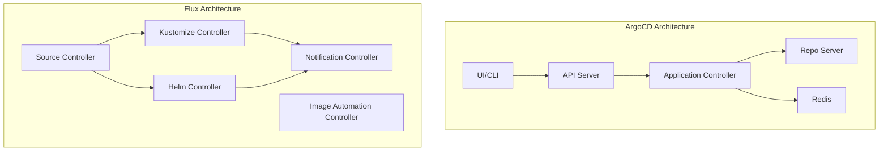
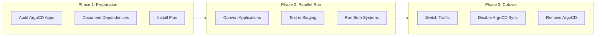
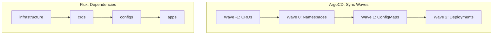
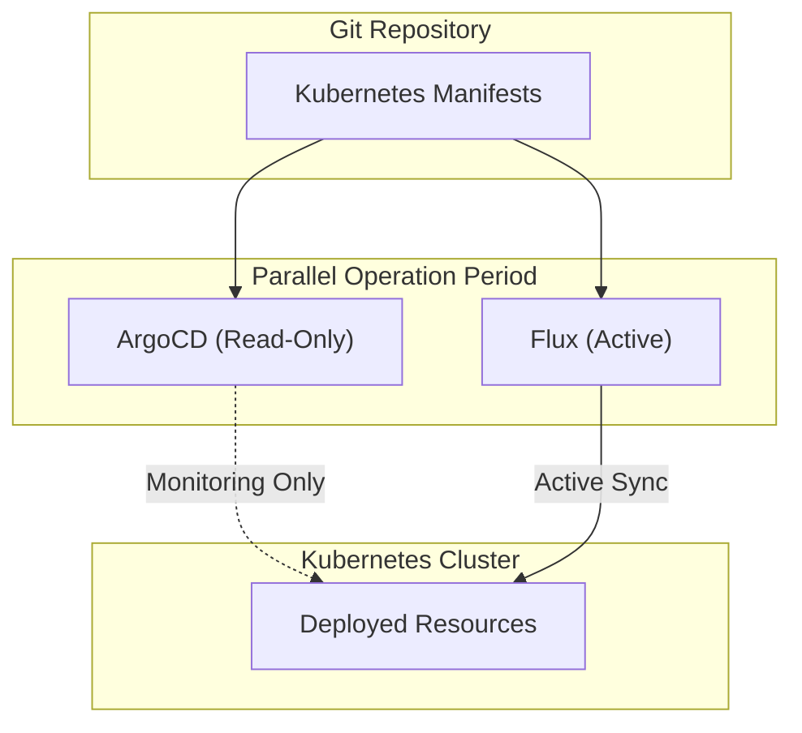

# How to Migrate from ArgoCD to Flux

Author: [nawazdhandala](https://www.github.com/nawazdhandala)

Tags: Kubernetes, GitOps, Flux, ArgoCD, Migration, CI/CD, DevOps

Description: A comprehensive guide to migrating your GitOps workflow from ArgoCD to Flux, covering architecture differences, migration strategies, converting Applications to Kustomizations, handling Helm releases, and ensuring zero-downtime transitions.

---

> "The best time to migrate is when you understand both systems deeply. The second best time is now." - DevOps Proverb

## Introduction

ArgoCD and Flux are the two leading GitOps tools for Kubernetes. While ArgoCD offers a polished UI and is often easier to get started with, Flux provides a more composable, Kubernetes-native approach that many teams prefer at scale. This guide walks you through migrating from ArgoCD to Flux with minimal disruption.

## Comparing ArgoCD and Flux

Before migrating, understand the fundamental differences between these tools.



### Feature Comparison

| Feature | ArgoCD | Flux |
|---------|--------|------|
| **Architecture** | Monolithic with UI | Modular controllers |
| **UI** | Built-in web UI | Third-party (Weave GitOps) |
| **CRDs** | Application, AppProject | GitRepository, Kustomization, HelmRelease |
| **Multi-tenancy** | AppProjects | Kubernetes RBAC |
| **Helm Support** | Native | HelmRelease CRD |
| **Image Updates** | Argo Image Updater | Built-in automation |
| **Notifications** | Built-in | Notification controller |
| **Health Checks** | Built-in health assessments | Kubernetes-native |

### When to Consider Flux

Flux might be the better choice when you need:

```yaml
# Flux excels at these scenarios:
# 1. Modular, composable architecture
# 2. Native Kubernetes RBAC integration
# 3. Automated image updates built-in
# 4. Lighter resource footprint
# 5. Multi-cluster without central control plane
```

## Migration Strategy Overview

A successful migration requires careful planning. Here is the recommended approach.



### Phase 1: Preparation

First, audit your existing ArgoCD setup.

```bash
# List all ArgoCD applications
kubectl get applications -n argocd -o wide

# Export application configurations for reference
kubectl get applications -n argocd -o yaml > argocd-apps-backup.yaml

# List all AppProjects
kubectl get appprojects -n argocd -o yaml > argocd-projects-backup.yaml

# Check for ApplicationSets
kubectl get applicationsets -n argocd -o yaml > argocd-appsets-backup.yaml
```

### Install Flux

```bash
# Install Flux CLI
# macOS
brew install fluxcd/tap/flux

# Linux
curl -s https://fluxcd.io/install.sh | sudo bash

# Verify prerequisites
flux check --pre

# Bootstrap Flux with your Git repository
flux bootstrap github \
  --owner=myorg \
  --repository=fleet-infra \
  --branch=main \
  --path=clusters/production \
  --personal
```

This creates the following structure in your repository:

```
fleet-infra/
└── clusters/
    └── production/
        └── flux-system/
            ├── gotk-components.yaml
            ├── gotk-sync.yaml
            └── kustomization.yaml
```

## Converting Application to Kustomization

The core migration task is converting ArgoCD Applications to Flux Kustomizations.

### ArgoCD Application (Before)

```yaml
# ArgoCD Application definition
apiVersion: argoproj.io/v1alpha1
kind: Application
metadata:
  name: myapp
  namespace: argocd
spec:
  project: default
  source:
    # Git repository containing Kubernetes manifests
    repoURL: https://github.com/myorg/myapp.git
    targetRevision: main
    path: k8s/overlays/production
  destination:
    # Target cluster and namespace
    server: https://kubernetes.default.svc
    namespace: production
  syncPolicy:
    automated:
      # Automatically remove resources not in Git
      prune: true
      # Fix manual changes (drift correction)
      selfHeal: true
    syncOptions:
      - CreateNamespace=true
```

### Flux Kustomization (After)

Converting to Flux requires two resources: a GitRepository and a Kustomization.

```yaml
# Step 1: Define the Git source
# This tells Flux where to fetch the manifests from
apiVersion: source.toolkit.fluxcd.io/v1
kind: GitRepository
metadata:
  name: myapp
  namespace: flux-system
spec:
  # How often to check for updates
  interval: 1m
  # Repository URL (HTTPS or SSH)
  url: https://github.com/myorg/myapp.git
  ref:
    branch: main
  # Optional: specify credentials for private repos
  # secretRef:
  #   name: myapp-git-credentials
---
# Step 2: Define what to deploy from the source
# Kustomization controls the deployment of manifests
apiVersion: kustomize.toolkit.fluxcd.io/v1
kind: Kustomization
metadata:
  name: myapp
  namespace: flux-system
spec:
  # How often to reconcile (check and apply changes)
  interval: 5m
  # Reference to the GitRepository
  sourceRef:
    kind: GitRepository
    name: myapp
  # Path within the repository to deploy
  path: ./k8s/overlays/production
  # Enable pruning (remove resources not in Git)
  prune: true
  # Target namespace for resources without explicit namespace
  targetNamespace: production
  # Timeout for apply operations
  timeout: 3m
  # Wait for resources to be ready
  wait: true
  # Health checks configuration
  healthChecks:
    - apiVersion: apps/v1
      kind: Deployment
      name: myapp
      namespace: production
```

### Conversion Reference Table

| ArgoCD Field | Flux Equivalent |
|--------------|-----------------|
| `source.repoURL` | `GitRepository.spec.url` |
| `source.targetRevision` | `GitRepository.spec.ref.branch/tag/commit` |
| `source.path` | `Kustomization.spec.path` |
| `destination.namespace` | `Kustomization.spec.targetNamespace` |
| `syncPolicy.automated.prune` | `Kustomization.spec.prune: true` |
| `syncPolicy.automated.selfHeal` | Default behavior (interval-based) |

## Handling Helm Releases

ArgoCD and Flux handle Helm differently. ArgoCD uses Applications with Helm sources, while Flux uses dedicated HelmRelease and HelmRepository CRDs.

### ArgoCD Helm Application (Before)

```yaml
# ArgoCD Helm Application
apiVersion: argoproj.io/v1alpha1
kind: Application
metadata:
  name: nginx-ingress
  namespace: argocd
spec:
  project: default
  source:
    # Helm chart repository URL
    repoURL: https://kubernetes.github.io/ingress-nginx
    chart: ingress-nginx
    targetRevision: 4.8.3
    helm:
      # Values to override defaults
      values: |
        controller:
          replicaCount: 3
          service:
            type: LoadBalancer
          metrics:
            enabled: true
      # Individual value overrides
      parameters:
        - name: controller.nodeSelector.dedicated
          value: ingress
  destination:
    server: https://kubernetes.default.svc
    namespace: ingress-nginx
  syncPolicy:
    automated:
      prune: true
      selfHeal: true
    syncOptions:
      - CreateNamespace=true
```

### Flux HelmRelease (After)

```yaml
# Step 1: Define the Helm repository source
apiVersion: source.toolkit.fluxcd.io/v1
kind: HelmRepository
metadata:
  name: ingress-nginx
  namespace: flux-system
spec:
  # How often to fetch the repository index
  interval: 1h
  # Helm repository URL
  url: https://kubernetes.github.io/ingress-nginx
---
# Step 2: Define the Helm release
apiVersion: helm.toolkit.fluxcd.io/v2
kind: HelmRelease
metadata:
  name: nginx-ingress
  namespace: flux-system
spec:
  # How often to reconcile the release
  interval: 5m
  # Target namespace for the release
  targetNamespace: ingress-nginx
  # Create namespace if it does not exist
  install:
    createNamespace: true
    # Remediation on install failure
    remediation:
      retries: 3
  # Chart reference
  chart:
    spec:
      chart: ingress-nginx
      version: "4.8.3"
      sourceRef:
        kind: HelmRepository
        name: ingress-nginx
        namespace: flux-system
  # Values configuration
  values:
    controller:
      replicaCount: 3
      service:
        type: LoadBalancer
      metrics:
        enabled: true
      nodeSelector:
        dedicated: ingress
  # Upgrade configuration
  upgrade:
    # Clean up on failed upgrade
    cleanupOnFail: true
    # Remediation on upgrade failure
    remediation:
      retries: 3
```

### Helm Values from ConfigMap or Secret

Flux supports loading values from ConfigMaps or Secrets.

```yaml
apiVersion: helm.toolkit.fluxcd.io/v2
kind: HelmRelease
metadata:
  name: myapp
  namespace: flux-system
spec:
  interval: 5m
  chart:
    spec:
      chart: myapp
      sourceRef:
        kind: HelmRepository
        name: myrepo
  # Load values from multiple sources in order
  valuesFrom:
    # Base values from ConfigMap
    - kind: ConfigMap
      name: myapp-base-values
      valuesKey: values.yaml
    # Environment-specific overrides
    - kind: ConfigMap
      name: myapp-env-values
      valuesKey: production.yaml
    # Secrets (credentials, API keys)
    - kind: Secret
      name: myapp-secrets
      valuesKey: secrets.yaml
  # Inline values take highest precedence
  values:
    image:
      tag: v1.2.3
```

## Migrating ApplicationSets

ArgoCD ApplicationSets become Flux Kustomizations with variable substitution.

### ArgoCD ApplicationSet (Before)

```yaml
# ArgoCD ApplicationSet for multi-environment deployment
apiVersion: argoproj.io/v1alpha1
kind: ApplicationSet
metadata:
  name: myapp-environments
  namespace: argocd
spec:
  generators:
    - list:
        elements:
          - env: development
            replicas: "1"
          - env: staging
            replicas: "2"
          - env: production
            replicas: "3"
  template:
    metadata:
      name: 'myapp-{{env}}'
    spec:
      project: default
      source:
        repoURL: https://github.com/myorg/myapp.git
        targetRevision: main
        path: 'k8s/overlays/{{env}}'
      destination:
        server: https://kubernetes.default.svc
        namespace: '{{env}}'
      syncPolicy:
        automated:
          prune: true
```

### Flux Equivalent (After)

```yaml
# Flux approach: Use Kustomization with postBuild substitution
# and directory structure for environments

# Base Kustomization that other environments extend
apiVersion: kustomize.toolkit.fluxcd.io/v1
kind: Kustomization
metadata:
  name: myapp-production
  namespace: flux-system
spec:
  interval: 5m
  sourceRef:
    kind: GitRepository
    name: myapp
  path: ./k8s/overlays/production
  prune: true
  targetNamespace: production
  # Variable substitution from environment-specific values
  postBuild:
    substitute:
      ENV: production
      REPLICAS: "3"
    # Can also substitute from ConfigMaps/Secrets
    substituteFrom:
      - kind: ConfigMap
        name: cluster-vars
---
# Development environment
apiVersion: kustomize.toolkit.fluxcd.io/v1
kind: Kustomization
metadata:
  name: myapp-development
  namespace: flux-system
spec:
  interval: 5m
  sourceRef:
    kind: GitRepository
    name: myapp
  path: ./k8s/overlays/development
  prune: true
  targetNamespace: development
  postBuild:
    substitute:
      ENV: development
      REPLICAS: "1"
```

## Handling Sync Waves and Dependencies

ArgoCD uses sync waves for ordering. Flux uses `dependsOn` for explicit dependencies.



### ArgoCD Sync Waves (Before)

```yaml
# Resources with sync-wave annotations
apiVersion: v1
kind: Namespace
metadata:
  name: myapp
  annotations:
    argocd.argoproj.io/sync-wave: "0"
---
apiVersion: v1
kind: ConfigMap
metadata:
  name: myapp-config
  annotations:
    argocd.argoproj.io/sync-wave: "1"
---
apiVersion: apps/v1
kind: Deployment
metadata:
  name: myapp
  annotations:
    argocd.argoproj.io/sync-wave: "2"
```

### Flux Dependencies (After)

```yaml
# Flux uses explicit Kustomization dependencies

# Infrastructure layer (applied first)
apiVersion: kustomize.toolkit.fluxcd.io/v1
kind: Kustomization
metadata:
  name: infrastructure
  namespace: flux-system
spec:
  interval: 10m
  sourceRef:
    kind: GitRepository
    name: fleet-infra
  path: ./infrastructure
  prune: true
---
# CRDs layer (depends on infrastructure)
apiVersion: kustomize.toolkit.fluxcd.io/v1
kind: Kustomization
metadata:
  name: crds
  namespace: flux-system
spec:
  interval: 10m
  sourceRef:
    kind: GitRepository
    name: fleet-infra
  path: ./crds
  prune: true
  # Wait for infrastructure before applying CRDs
  dependsOn:
    - name: infrastructure
---
# Applications layer (depends on CRDs)
apiVersion: kustomize.toolkit.fluxcd.io/v1
kind: Kustomization
metadata:
  name: apps
  namespace: flux-system
spec:
  interval: 5m
  sourceRef:
    kind: GitRepository
    name: fleet-infra
  path: ./apps
  prune: true
  # Explicit dependency chain
  dependsOn:
    - name: crds
  # Health checks ensure apps are ready
  healthChecks:
    - apiVersion: apps/v1
      kind: Deployment
      name: myapp
      namespace: production
```

## Migration Script

Here is a script to automate parts of the migration.

```bash
#!/bin/bash
# migrate-argocd-to-flux.sh
# Converts ArgoCD Applications to Flux Kustomizations

set -euo pipefail

# Configuration
ARGOCD_NAMESPACE="argocd"
FLUX_NAMESPACE="flux-system"
OUTPUT_DIR="./flux-migration"

# Create output directory
mkdir -p "${OUTPUT_DIR}"

# Function to convert ArgoCD Application to Flux resources
convert_application() {
    local app_name=$1
    local app_yaml

    echo "Converting application: ${app_name}"

    # Get ArgoCD application details
    app_yaml=$(kubectl get application "${app_name}" -n "${ARGOCD_NAMESPACE}" -o yaml)

    # Extract values using yq or manual parsing
    local repo_url=$(echo "${app_yaml}" | yq '.spec.source.repoURL')
    local path=$(echo "${app_yaml}" | yq '.spec.source.path')
    local target_revision=$(echo "${app_yaml}" | yq '.spec.source.targetRevision // "main"')
    local dest_namespace=$(echo "${app_yaml}" | yq '.spec.destination.namespace')
    local prune=$(echo "${app_yaml}" | yq '.spec.syncPolicy.automated.prune // false')

    # Check if it is a Helm application
    local chart=$(echo "${app_yaml}" | yq '.spec.source.chart // ""')

    if [ -n "${chart}" ] && [ "${chart}" != "null" ]; then
        # Generate HelmRelease
        generate_helm_release "${app_name}" "${repo_url}" "${chart}" \
            "${target_revision}" "${dest_namespace}" "${app_yaml}"
    else
        # Generate GitRepository and Kustomization
        generate_git_kustomization "${app_name}" "${repo_url}" "${path}" \
            "${target_revision}" "${dest_namespace}" "${prune}"
    fi
}

# Generate GitRepository and Kustomization
generate_git_kustomization() {
    local name=$1
    local repo_url=$2
    local path=$3
    local revision=$4
    local namespace=$5
    local prune=$6

    cat > "${OUTPUT_DIR}/${name}-source.yaml" <<EOF
apiVersion: source.toolkit.fluxcd.io/v1
kind: GitRepository
metadata:
  name: ${name}
  namespace: ${FLUX_NAMESPACE}
spec:
  interval: 1m
  url: ${repo_url}
  ref:
    branch: ${revision}
EOF

    cat > "${OUTPUT_DIR}/${name}-kustomization.yaml" <<EOF
apiVersion: kustomize.toolkit.fluxcd.io/v1
kind: Kustomization
metadata:
  name: ${name}
  namespace: ${FLUX_NAMESPACE}
spec:
  interval: 5m
  sourceRef:
    kind: GitRepository
    name: ${name}
  path: ./${path}
  prune: ${prune}
  targetNamespace: ${namespace}
  timeout: 3m
EOF

    echo "  Created: ${OUTPUT_DIR}/${name}-source.yaml"
    echo "  Created: ${OUTPUT_DIR}/${name}-kustomization.yaml"
}

# Generate HelmRepository and HelmRelease
generate_helm_release() {
    local name=$1
    local repo_url=$2
    local chart=$3
    local version=$4
    local namespace=$5
    local app_yaml=$6

    # Extract Helm values
    local values=$(echo "${app_yaml}" | yq '.spec.source.helm.values // ""')

    cat > "${OUTPUT_DIR}/${name}-helmrepo.yaml" <<EOF
apiVersion: source.toolkit.fluxcd.io/v1
kind: HelmRepository
metadata:
  name: ${name}
  namespace: ${FLUX_NAMESPACE}
spec:
  interval: 1h
  url: ${repo_url}
EOF

    cat > "${OUTPUT_DIR}/${name}-helmrelease.yaml" <<EOF
apiVersion: helm.toolkit.fluxcd.io/v2
kind: HelmRelease
metadata:
  name: ${name}
  namespace: ${FLUX_NAMESPACE}
spec:
  interval: 5m
  targetNamespace: ${namespace}
  chart:
    spec:
      chart: ${chart}
      version: "${version}"
      sourceRef:
        kind: HelmRepository
        name: ${name}
        namespace: ${FLUX_NAMESPACE}
  install:
    createNamespace: true
    remediation:
      retries: 3
  upgrade:
    cleanupOnFail: true
    remediation:
      retries: 3
EOF

    # Append values if present
    if [ -n "${values}" ] && [ "${values}" != "null" ]; then
        echo "  values:" >> "${OUTPUT_DIR}/${name}-helmrelease.yaml"
        echo "${values}" | sed 's/^/    /' >> "${OUTPUT_DIR}/${name}-helmrelease.yaml"
    fi

    echo "  Created: ${OUTPUT_DIR}/${name}-helmrepo.yaml"
    echo "  Created: ${OUTPUT_DIR}/${name}-helmrelease.yaml"
}

# Main execution
echo "ArgoCD to Flux Migration Tool"
echo "=============================="

# Get all ArgoCD applications
apps=$(kubectl get applications -n "${ARGOCD_NAMESPACE}" -o jsonpath='{.items[*].metadata.name}')

for app in ${apps}; do
    convert_application "${app}"
    echo ""
done

echo "Migration files generated in: ${OUTPUT_DIR}"
echo ""
echo "Next steps:"
echo "1. Review generated files"
echo "2. Apply to cluster: kubectl apply -f ${OUTPUT_DIR}/"
echo "3. Verify Flux reconciliation: flux get kustomizations"
echo "4. Disable ArgoCD auto-sync for migrated apps"
```

## Parallel Running Strategy

During migration, run both systems in parallel for safety.



### Step 1: Disable ArgoCD Auto-Sync

```bash
# Disable auto-sync on ArgoCD applications during migration
# This prevents ArgoCD from fighting with Flux

for app in $(kubectl get applications -n argocd -o jsonpath='{.items[*].metadata.name}'); do
    echo "Disabling auto-sync for: ${app}"
    kubectl patch application "${app}" -n argocd --type merge -p '
{
  "spec": {
    "syncPolicy": {
      "automated": null
    }
  }
}'
done
```

### Step 2: Apply Flux Resources

```bash
# Apply Flux resources and monitor reconciliation
kubectl apply -f flux-migration/

# Watch Flux reconciliation status
flux get kustomizations --watch

# Check for any errors
flux logs --level=error
```

### Step 3: Verify Deployment

```bash
# Compare resources managed by both systems
# ArgoCD resources
kubectl get applications -n argocd -o wide

# Flux resources
flux get all

# Verify no drift between systems
flux reconcile kustomization myapp --with-source
```

## Post-Migration Cleanup

Once confident in the Flux setup, remove ArgoCD.

```bash
# Step 1: Remove ArgoCD Applications (but not the deployed resources)
kubectl delete applications --all -n argocd

# Step 2: Remove ArgoCD AppProjects
kubectl delete appprojects --all -n argocd

# Step 3: Uninstall ArgoCD
kubectl delete namespace argocd

# Or if installed via Helm
helm uninstall argocd -n argocd
kubectl delete namespace argocd

# Step 4: Remove ArgoCD CRDs (optional, be careful)
kubectl delete crd applications.argoproj.io
kubectl delete crd applicationsets.argoproj.io
kubectl delete crd appprojects.argoproj.io
```

## Setting Up Flux Notifications

Replace ArgoCD notifications with Flux notification controller.

```yaml
# Slack provider configuration
apiVersion: notification.toolkit.fluxcd.io/v1beta3
kind: Provider
metadata:
  name: slack
  namespace: flux-system
spec:
  type: slack
  channel: deployments
  # Reference to secret containing webhook URL
  secretRef:
    name: slack-webhook
---
# Secret containing Slack webhook
apiVersion: v1
kind: Secret
metadata:
  name: slack-webhook
  namespace: flux-system
stringData:
  address: https://hooks.slack.com/services/YOUR/WEBHOOK/URL
---
# Alert configuration
apiVersion: notification.toolkit.fluxcd.io/v1beta3
kind: Alert
metadata:
  name: deployment-alerts
  namespace: flux-system
spec:
  # Send alerts to Slack
  providerRef:
    name: slack
  # Event severity filter
  eventSeverity: info
  # Sources to monitor
  eventSources:
    - kind: Kustomization
      name: '*'
    - kind: HelmRelease
      name: '*'
  # Exclude certain events
  exclusionList:
    - ".*upgrade.*in progress.*"
```

## Monitoring Your Migration with OneUptime

During and after migration, robust monitoring is essential. [OneUptime](https://oneuptime.com) provides comprehensive observability for your Kubernetes clusters and GitOps workflows.

```yaml
# Example: Monitor Flux controllers with OneUptime
# Deploy OpenTelemetry collector to send metrics

apiVersion: kustomize.toolkit.fluxcd.io/v1
kind: Kustomization
metadata:
  name: monitoring
  namespace: flux-system
spec:
  interval: 10m
  sourceRef:
    kind: GitRepository
    name: fleet-infra
  path: ./monitoring
  prune: true
  # Health checks for monitoring stack
  healthChecks:
    - apiVersion: apps/v1
      kind: Deployment
      name: otel-collector
      namespace: monitoring
```

Key metrics to track during migration:

1. **Reconciliation Success Rate** - Ensure Flux is successfully syncing
2. **Drift Detection** - Monitor for configuration drift
3. **Deployment Frequency** - Track GitOps deployment velocity
4. **Error Rates** - Catch failed reconciliations early

## Troubleshooting Common Issues

### Flux Not Syncing

```bash
# Check source status
flux get sources git

# Force reconciliation
flux reconcile source git myapp

# Check controller logs
kubectl logs -n flux-system deploy/source-controller

# Verify Git credentials
flux create secret git myapp-auth \
  --url=https://github.com/myorg/myapp \
  --username=git \
  --password=${GITHUB_TOKEN}
```

### Helm Release Stuck

```bash
# Check HelmRelease status
flux get helmreleases

# Describe for detailed errors
kubectl describe helmrelease myapp -n flux-system

# Force upgrade
flux reconcile helmrelease myapp --force
```

### Resource Conflicts

```bash
# If resources are owned by ArgoCD labels
# Remove ArgoCD tracking labels before Flux takes over

kubectl label deployment myapp \
  app.kubernetes.io/instance- \
  argocd.argoproj.io/instance- \
  -n production
```

## Conclusion

Migrating from ArgoCD to Flux is a significant undertaking, but the modular architecture and Kubernetes-native approach of Flux can provide long-term benefits for teams managing complex deployments. The key is to migrate incrementally, run both systems in parallel during transition, and thoroughly test each converted application before removing ArgoCD.

Remember to monitor your migration closely using tools like [OneUptime](https://oneuptime.com) to catch issues early and ensure a smooth transition to your new GitOps workflow.
