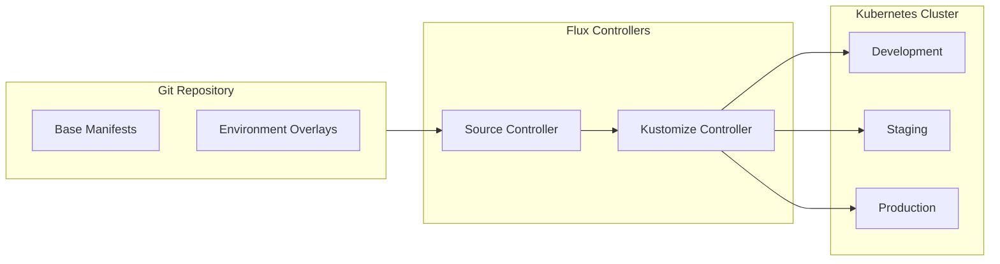
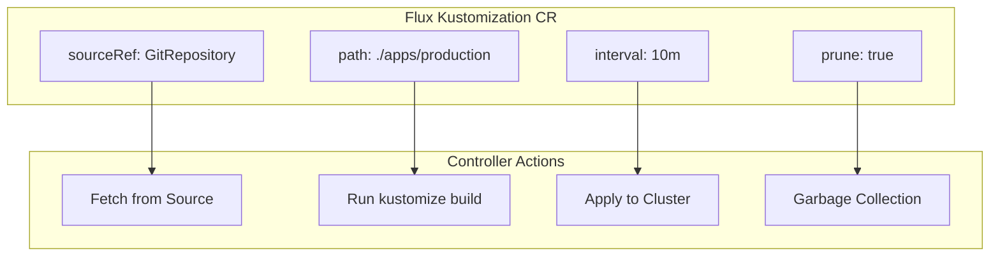
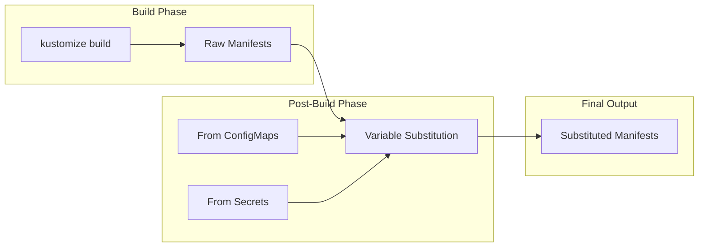
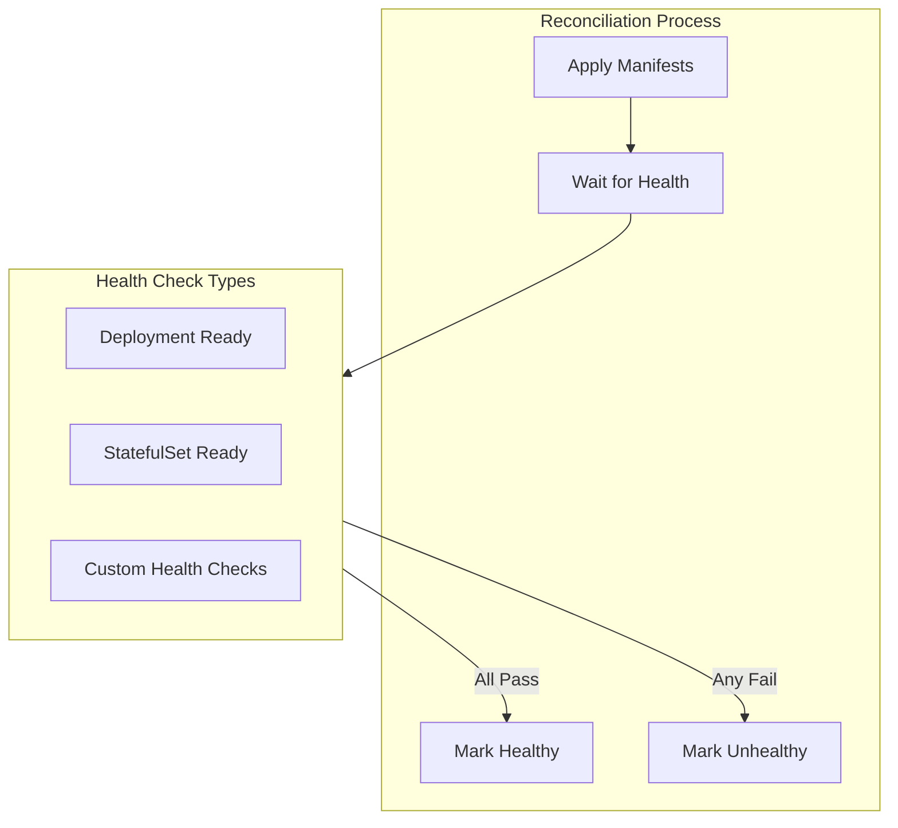
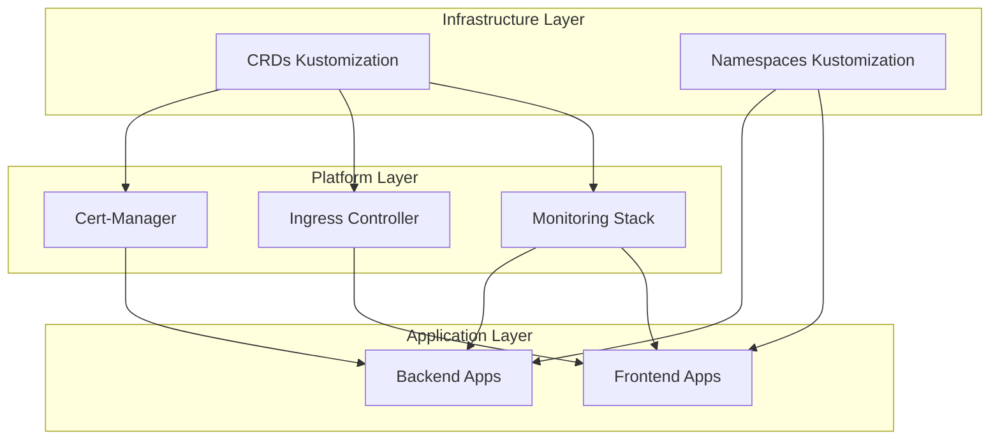
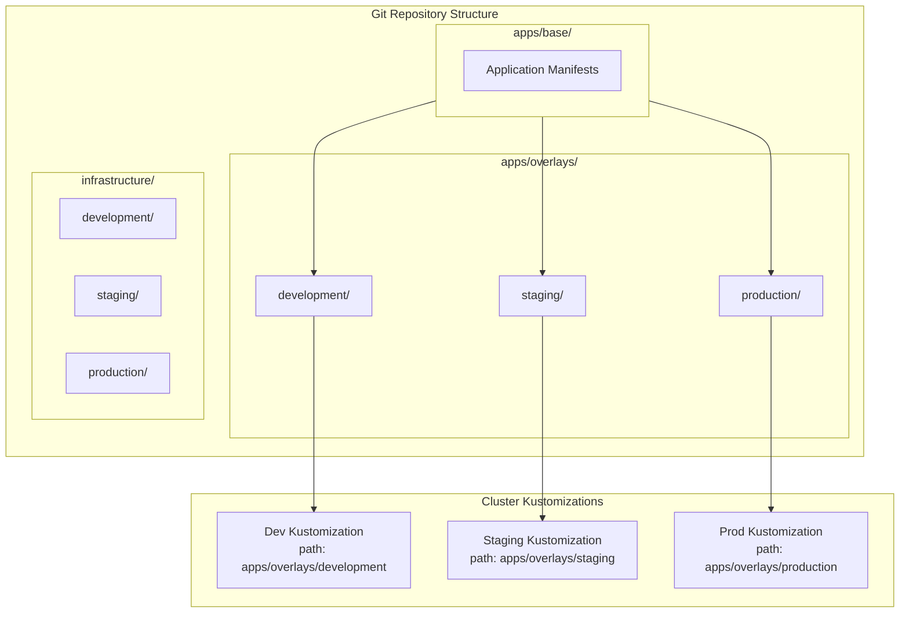
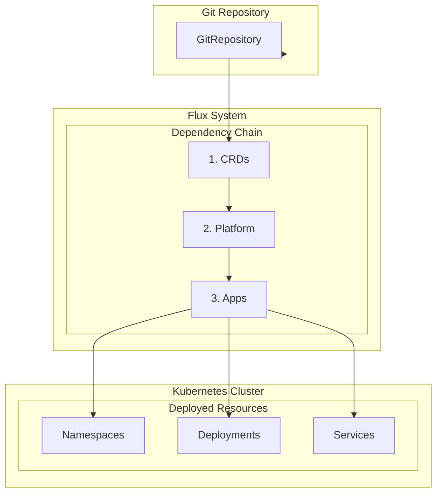

# How to Use Flux with Kustomize

Author: [nawazdhandala](https://www.github.com/nawazdhandala)

Tags: Kubernetes, Flux, Kustomize, GitOps, CI/CD, DevOps, Automation

Description: A comprehensive guide to using Flux with Kustomize for GitOps-driven Kubernetes deployments. Learn how to configure Kustomization resources, use post-build variable substitution, implement health checks, manage dependencies, and target specific paths in your Git repositories.

---

> **Key Insight:** Flux and Kustomize together create a powerful GitOps workflow where your Git repository becomes the single source of truth. Flux continuously reconciles your cluster state with what's defined in Git, while Kustomize provides the flexibility to manage environment-specific configurations without duplicating YAML files.

## What Is Flux?

Flux is a set of continuous and progressive delivery solutions for Kubernetes that are open and extensible. It keeps Kubernetes clusters in sync with sources of configuration (like Git repositories) and automates updates to configuration when there is new code to deploy.



## Installing Flux

Before diving into Kustomize configurations, let's install Flux on your cluster.

### Prerequisites Check

```bash
# Check Flux prerequisites
# This command verifies your cluster meets Flux requirements
flux check --pre
```

### Bootstrap Flux with GitHub

```bash
# Bootstrap Flux with your GitHub repository
# This creates the Flux system components and configures them to sync with your repo
flux bootstrap github \
  --owner=your-org \
  --repository=fleet-infra \
  --branch=main \
  --path=clusters/my-cluster \
  --personal
```

### Verify Installation

```bash
# Verify all Flux components are running
# You should see source-controller, kustomize-controller, helm-controller, and notification-controller
kubectl get pods -n flux-system
```

## Understanding Kustomization Resources

In Flux, a `Kustomization` is a custom resource that tells the Kustomize Controller where to find Kubernetes manifests and how to apply them.



### Basic Kustomization Resource

```yaml
# flux-system/apps-kustomization.yaml
# This Kustomization tells Flux to deploy applications from the specified path
apiVersion: kustomize.toolkit.fluxcd.io/v1
kind: Kustomization
metadata:
  name: apps
  namespace: flux-system
spec:
  # How often to check for changes and reconcile
  interval: 10m0s

  # Reference to the Git repository source
  sourceRef:
    kind: GitRepository
    name: flux-system

  # Path within the repository to the kustomization directory
  path: ./apps/production

  # Enable garbage collection - remove resources that are no longer in Git
  prune: true

  # Timeout for apply operations
  timeout: 5m0s
```

### GitRepository Source

```yaml
# flux-system/git-repository.yaml
# Define the Git repository that contains your Kubernetes manifests
apiVersion: source.toolkit.fluxcd.io/v1
kind: GitRepository
metadata:
  name: flux-system
  namespace: flux-system
spec:
  # How often to fetch from the repository
  interval: 1m0s

  # Repository URL
  url: https://github.com/your-org/fleet-infra

  # Branch to track
  ref:
    branch: main

  # Secret containing credentials (if private repo)
  secretRef:
    name: flux-system
```

## Post-Build Variable Substitution

One of the most powerful features of Flux Kustomizations is post-build variable substitution. This allows you to inject environment-specific values after Kustomize builds the manifests.



### Inline Variable Substitution

```yaml
# clusters/production/apps.yaml
# Kustomization with inline variable substitution
apiVersion: kustomize.toolkit.fluxcd.io/v1
kind: Kustomization
metadata:
  name: apps
  namespace: flux-system
spec:
  interval: 10m0s
  sourceRef:
    kind: GitRepository
    name: flux-system
  path: ./apps/base
  prune: true

  # Post-build variable substitution configuration
  postBuild:
    # Define variables inline
    substitute:
      # These variables will replace ${VAR_NAME} in your manifests
      CLUSTER_NAME: production
      ENVIRONMENT: prod
      REPLICAS: "3"
      LOG_LEVEL: warn
```

### Variables from ConfigMaps and Secrets

```yaml
# clusters/production/apps.yaml
# Kustomization with variables sourced from ConfigMaps and Secrets
apiVersion: kustomize.toolkit.fluxcd.io/v1
kind: Kustomization
metadata:
  name: apps
  namespace: flux-system
spec:
  interval: 10m0s
  sourceRef:
    kind: GitRepository
    name: flux-system
  path: ./apps/base
  prune: true

  postBuild:
    # Inline substitutions (lower priority)
    substitute:
      ENVIRONMENT: prod

    # External sources for variables (higher priority)
    substituteFrom:
      # Variables from a ConfigMap
      - kind: ConfigMap
        name: cluster-vars
      # Sensitive variables from a Secret
      - kind: Secret
        name: cluster-secrets
```

### ConfigMap for Variables

```yaml
# clusters/production/cluster-vars.yaml
# ConfigMap containing environment-specific variables
apiVersion: v1
kind: ConfigMap
metadata:
  name: cluster-vars
  namespace: flux-system
data:
  # Each key-value pair becomes a substitution variable
  CLUSTER_NAME: production-us-east-1
  INGRESS_CLASS: nginx
  STORAGE_CLASS: fast-ssd
  REPLICAS: "5"
  CPU_REQUEST: "500m"
  MEMORY_REQUEST: "512Mi"
  CPU_LIMIT: "2000m"
  MEMORY_LIMIT: "2Gi"
```

### Using Variables in Manifests

```yaml
# apps/base/deployment.yaml
# Deployment template using substitution variables
apiVersion: apps/v1
kind: Deployment
metadata:
  name: myapp
  labels:
    environment: ${ENVIRONMENT}
    cluster: ${CLUSTER_NAME}
spec:
  # Variable for replica count - note: must be a string in the variable definition
  replicas: ${REPLICAS}
  selector:
    matchLabels:
      app: myapp
  template:
    metadata:
      labels:
        app: myapp
    spec:
      containers:
        - name: myapp
          image: myapp:${IMAGE_TAG}
          env:
            - name: LOG_LEVEL
              value: ${LOG_LEVEL}
            - name: ENVIRONMENT
              value: ${ENVIRONMENT}
          resources:
            requests:
              cpu: ${CPU_REQUEST}
              memory: ${MEMORY_REQUEST}
            limits:
              cpu: ${CPU_LIMIT}
              memory: ${MEMORY_LIMIT}
```

## Health Checks

Flux can wait for deployed resources to become healthy before considering a reconciliation successful. This is crucial for implementing safe progressive delivery.



### Built-in Health Assessment

```yaml
# clusters/production/apps.yaml
# Kustomization with health assessment enabled
apiVersion: kustomize.toolkit.fluxcd.io/v1
kind: Kustomization
metadata:
  name: apps
  namespace: flux-system
spec:
  interval: 10m0s
  sourceRef:
    kind: GitRepository
    name: flux-system
  path: ./apps/production
  prune: true

  # Enable health assessment for all deployed resources
  # Flux will wait for Deployments, StatefulSets, DaemonSets, etc. to be ready
  wait: true

  # Timeout for health checks (default is the interval)
  timeout: 10m0s
```

### Custom Health Checks

```yaml
# clusters/production/apps.yaml
# Kustomization with custom health checks for specific resources
apiVersion: kustomize.toolkit.fluxcd.io/v1
kind: Kustomization
metadata:
  name: apps
  namespace: flux-system
spec:
  interval: 10m0s
  sourceRef:
    kind: GitRepository
    name: flux-system
  path: ./apps/production
  prune: true
  wait: true
  timeout: 15m0s

  # Define custom health checks for specific resources
  healthChecks:
    # Wait for a specific Deployment
    - apiVersion: apps/v1
      kind: Deployment
      name: api-server
      namespace: production

    # Wait for a StatefulSet (e.g., database)
    - apiVersion: apps/v1
      kind: StatefulSet
      name: postgresql
      namespace: production

    # Wait for a custom resource (e.g., a database that exposes status)
    - apiVersion: postgresql.cnpg.io/v1
      kind: Cluster
      name: main-database
      namespace: production

    # Wait for a Job to complete
    - apiVersion: batch/v1
      kind: Job
      name: db-migration
      namespace: production
```

### Health Check Status Expression

```yaml
# clusters/production/infrastructure.yaml
# Advanced health checks using status expressions
apiVersion: kustomize.toolkit.fluxcd.io/v1
kind: Kustomization
metadata:
  name: infrastructure
  namespace: flux-system
spec:
  interval: 10m0s
  sourceRef:
    kind: GitRepository
    name: flux-system
  path: ./infrastructure/production
  prune: true
  wait: true

  healthChecks:
    # Custom health check for Certificate resource
    - apiVersion: cert-manager.io/v1
      kind: Certificate
      name: wildcard-tls
      namespace: production

    # Health check for Ingress (waits for address assignment)
    - apiVersion: networking.k8s.io/v1
      kind: Ingress
      name: main-ingress
      namespace: production
```

## Dependencies Between Kustomizations

In complex deployments, you often need resources to be deployed in a specific order. Flux supports declaring dependencies between Kustomizations.



### Infrastructure Kustomization (No Dependencies)

```yaml
# clusters/production/infrastructure/crds.yaml
# CRDs must be deployed first - no dependencies
apiVersion: kustomize.toolkit.fluxcd.io/v1
kind: Kustomization
metadata:
  name: crds
  namespace: flux-system
spec:
  interval: 10m0s
  sourceRef:
    kind: GitRepository
    name: flux-system
  path: ./infrastructure/crds
  prune: true
  wait: true
  # No dependsOn - this is the first layer
```

### Platform Layer with Dependencies

```yaml
# clusters/production/infrastructure/cert-manager.yaml
# Cert-manager depends on CRDs being ready
apiVersion: kustomize.toolkit.fluxcd.io/v1
kind: Kustomization
metadata:
  name: cert-manager
  namespace: flux-system
spec:
  interval: 10m0s
  sourceRef:
    kind: GitRepository
    name: flux-system
  path: ./infrastructure/cert-manager
  prune: true
  wait: true

  # This Kustomization will not start until CRDs are healthy
  dependsOn:
    - name: crds
```

### Multiple Dependencies

```yaml
# clusters/production/apps/backend.yaml
# Backend apps depend on multiple infrastructure components
apiVersion: kustomize.toolkit.fluxcd.io/v1
kind: Kustomization
metadata:
  name: backend-apps
  namespace: flux-system
spec:
  interval: 10m0s
  sourceRef:
    kind: GitRepository
    name: flux-system
  path: ./apps/backend/production
  prune: true
  wait: true
  timeout: 15m0s

  # Multiple dependencies - all must be healthy before this starts
  dependsOn:
    # Wait for cert-manager (for TLS certificates)
    - name: cert-manager
    # Wait for ingress controller
    - name: ingress-nginx
    # Wait for monitoring stack (for ServiceMonitors)
    - name: monitoring
    # Wait for database operator
    - name: database-operator
```

### Full Dependency Chain Example

```yaml
# clusters/production/kustomization.yaml
# Root kustomization that references all layers in order
apiVersion: kustomize.config.k8s.io/v1beta1
kind: Kustomization
resources:
  # Layer 1: Foundation
  - infrastructure/namespaces.yaml
  - infrastructure/crds.yaml

  # Layer 2: Platform Services
  - infrastructure/cert-manager.yaml
  - infrastructure/ingress-nginx.yaml
  - infrastructure/monitoring.yaml
  - infrastructure/database-operator.yaml

  # Layer 3: Applications
  - apps/backend.yaml
  - apps/frontend.yaml
  - apps/workers.yaml
```

```yaml
# clusters/production/infrastructure/monitoring.yaml
# Monitoring depends on CRDs and namespaces
apiVersion: kustomize.toolkit.fluxcd.io/v1
kind: Kustomization
metadata:
  name: monitoring
  namespace: flux-system
spec:
  interval: 10m0s
  sourceRef:
    kind: GitRepository
    name: flux-system
  path: ./infrastructure/monitoring/production
  prune: true
  wait: true

  dependsOn:
    - name: crds
    - name: namespaces

  # Post-build substitution for environment-specific monitoring config
  postBuild:
    substitute:
      RETENTION_DAYS: "30"
      STORAGE_SIZE: "100Gi"
```

## Targeting Specific Paths

Flux allows you to organize your manifests in a logical directory structure and target specific paths for different environments or components.



### Repository Structure

```
fleet-infra/
├── clusters/
│   ├── development/
│   │   ├── flux-system/          # Flux bootstrap files
│   │   └── apps.yaml             # Points to apps/overlays/development
│   ├── staging/
│   │   ├── flux-system/
│   │   └── apps.yaml             # Points to apps/overlays/staging
│   └── production/
│       ├── flux-system/
│       └── apps.yaml             # Points to apps/overlays/production
├── apps/
│   ├── base/
│   │   ├── kustomization.yaml
│   │   ├── deployment.yaml
│   │   ├── service.yaml
│   │   └── configmap.yaml
│   └── overlays/
│       ├── development/
│       │   ├── kustomization.yaml
│       │   └── patches/
│       ├── staging/
│       │   ├── kustomization.yaml
│       │   └── patches/
│       └── production/
│           ├── kustomization.yaml
│           └── patches/
└── infrastructure/
    ├── controllers/
    │   ├── cert-manager/
    │   ├── ingress-nginx/
    │   └── monitoring/
    └── configs/
        ├── development/
        ├── staging/
        └── production/
```

### Development Cluster Configuration

```yaml
# clusters/development/apps.yaml
# Kustomization targeting development overlay
apiVersion: kustomize.toolkit.fluxcd.io/v1
kind: Kustomization
metadata:
  name: apps
  namespace: flux-system
spec:
  interval: 5m0s  # More frequent reconciliation for dev
  sourceRef:
    kind: GitRepository
    name: flux-system

  # Target the development overlay
  path: ./apps/overlays/development

  prune: true
  wait: true

  postBuild:
    substitute:
      ENVIRONMENT: development
      REPLICAS: "1"
      LOG_LEVEL: debug
```

### Production Cluster Configuration

```yaml
# clusters/production/apps.yaml
# Kustomization targeting production overlay with stricter settings
apiVersion: kustomize.toolkit.fluxcd.io/v1
kind: Kustomization
metadata:
  name: apps
  namespace: flux-system
spec:
  interval: 10m0s  # Less frequent for stability
  sourceRef:
    kind: GitRepository
    name: flux-system

  # Target the production overlay
  path: ./apps/overlays/production

  prune: true
  wait: true
  timeout: 15m0s

  # Retry configuration for production reliability
  retryInterval: 2m0s

  postBuild:
    substitute:
      ENVIRONMENT: production
      REPLICAS: "5"
      LOG_LEVEL: warn
    substituteFrom:
      - kind: Secret
        name: production-secrets
```

### Base Kustomization

```yaml
# apps/base/kustomization.yaml
# Base kustomization with common resources
apiVersion: kustomize.config.k8s.io/v1beta1
kind: Kustomization

# Common labels applied to all resources
commonLabels:
  app.kubernetes.io/managed-by: flux

resources:
  - namespace.yaml
  - deployment.yaml
  - service.yaml
  - configmap.yaml
  - serviceaccount.yaml
```

### Environment Overlay

```yaml
# apps/overlays/production/kustomization.yaml
# Production overlay extending the base
apiVersion: kustomize.config.k8s.io/v1beta1
kind: Kustomization

# Reference the base configuration
resources:
  - ../../base

# Production namespace
namespace: production

# Production-specific labels
commonLabels:
  environment: production

# Strategic merge patches for production settings
patches:
  # Increase replicas for production
  - target:
      kind: Deployment
      name: myapp
    patch: |-
      - op: replace
        path: /spec/replicas
        value: 5

  # Add production resource limits
  - path: patches/resources.yaml

# Production images with specific tags
images:
  - name: myapp
    newName: registry.example.com/myapp
    newTag: v2.1.0

# Production-specific ConfigMap generator
configMapGenerator:
  - name: app-config
    behavior: merge
    literals:
      - ENVIRONMENT=production
      - LOG_LEVEL=warn
```

### Multi-Tenant Path Targeting

```yaml
# clusters/production/tenants/tenant-a.yaml
# Kustomization for tenant A's applications
apiVersion: kustomize.toolkit.fluxcd.io/v1
kind: Kustomization
metadata:
  name: tenant-a-apps
  namespace: flux-system
spec:
  interval: 10m0s
  sourceRef:
    kind: GitRepository
    name: tenants-repo

  # Each tenant has their own path
  path: ./tenants/tenant-a/apps

  prune: true

  # Target tenant's namespace
  targetNamespace: tenant-a

  # Service account for tenant isolation
  serviceAccountName: tenant-a-flux

  postBuild:
    substitute:
      TENANT_NAME: tenant-a
      TENANT_DOMAIN: tenant-a.example.com
```

## Putting It All Together

Here's a complete example showing all concepts working together.



### Complete Production Setup

```yaml
# clusters/production/infrastructure/kustomization.yaml
# Root infrastructure kustomization
apiVersion: kustomize.toolkit.fluxcd.io/v1
kind: Kustomization
metadata:
  name: infrastructure
  namespace: flux-system
spec:
  interval: 1h0m0s
  retryInterval: 1m0s
  sourceRef:
    kind: GitRepository
    name: flux-system
  path: ./infrastructure/production
  prune: true
  wait: true
  timeout: 30m0s

  # Infrastructure rarely changes, use longer intervals
  # and comprehensive health checks
  healthChecks:
    - apiVersion: apps/v1
      kind: Deployment
      name: ingress-nginx-controller
      namespace: ingress-nginx
    - apiVersion: apps/v1
      kind: Deployment
      name: cert-manager
      namespace: cert-manager

---
# clusters/production/apps/kustomization.yaml
# Main application kustomization
apiVersion: kustomize.toolkit.fluxcd.io/v1
kind: Kustomization
metadata:
  name: apps
  namespace: flux-system
spec:
  interval: 10m0s
  retryInterval: 2m0s
  sourceRef:
    kind: GitRepository
    name: flux-system
  path: ./apps/overlays/production
  prune: true
  wait: true
  timeout: 15m0s

  # Depend on infrastructure being ready
  dependsOn:
    - name: infrastructure

  # Environment-specific variable substitution
  postBuild:
    substitute:
      CLUSTER_NAME: prod-us-east-1
      ENVIRONMENT: production
    substituteFrom:
      - kind: ConfigMap
        name: cluster-config
      - kind: Secret
        name: cluster-secrets
        optional: true

  # Health checks for critical applications
  healthChecks:
    - apiVersion: apps/v1
      kind: Deployment
      name: api-server
      namespace: production
    - apiVersion: apps/v1
      kind: Deployment
      name: web-frontend
      namespace: production
```

## Best Practices Summary

### Repository Organization
- **Separate base from overlays**: Keep environment-agnostic manifests in `base/` and environment-specific customizations in `overlays/`
- **Use meaningful directory names**: Structure paths to reflect the deployment hierarchy (e.g., `infrastructure/`, `apps/`, `tenants/`)
- **Keep cluster configurations isolated**: Each cluster should have its own directory under `clusters/`

### Dependency Management
- **Layer your deployments**: CRDs first, then operators, then applications
- **Use explicit dependencies**: Always declare `dependsOn` for resources that require other components
- **Enable health checks**: Use `wait: true` to ensure dependencies are actually ready

### Variable Substitution
- **Use ConfigMaps for non-sensitive values**: Environment configurations, feature flags, resource limits
- **Use Secrets for sensitive data**: API keys, database credentials, certificates
- **Document your variables**: Maintain a list of expected variables for each environment

### Health and Reliability
- **Set appropriate timeouts**: Production deployments may need longer timeouts
- **Configure retry intervals**: Allow Flux to recover from transient failures
- **Enable pruning carefully**: Understand that `prune: true` will delete resources removed from Git

### Security
- **Use service accounts with minimal permissions**: Each Kustomization can have its own service account
- **Isolate tenants**: Use separate paths, namespaces, and service accounts for multi-tenant deployments
- **Encrypt secrets in Git**: Use tools like SOPS or Sealed Secrets for sensitive data

## Monitoring Your Flux Deployments

Track your GitOps pipeline health with proper observability.

```bash
# Check Kustomization status
flux get kustomizations

# Watch reconciliation in real-time
flux get kustomizations --watch

# Get detailed status for a specific Kustomization
flux get kustomization apps -o yaml

# Check for failed reconciliations
flux get kustomizations --status-selector ready=false
```

For comprehensive monitoring of your Kubernetes infrastructure and Flux deployments, consider using [OneUptime](https://oneuptime.com). OneUptime provides real-time alerts, status pages, and incident management to ensure your GitOps pipelines stay healthy and your applications remain available.

---

Flux with Kustomize transforms Kubernetes deployments into a declarative, Git-driven workflow. Start with a simple setup, add dependencies as your infrastructure grows, and leverage variable substitution to manage multiple environments from a single codebase. The combination of Flux's reconciliation loop and Kustomize's configuration management creates a robust, auditable deployment pipeline.
