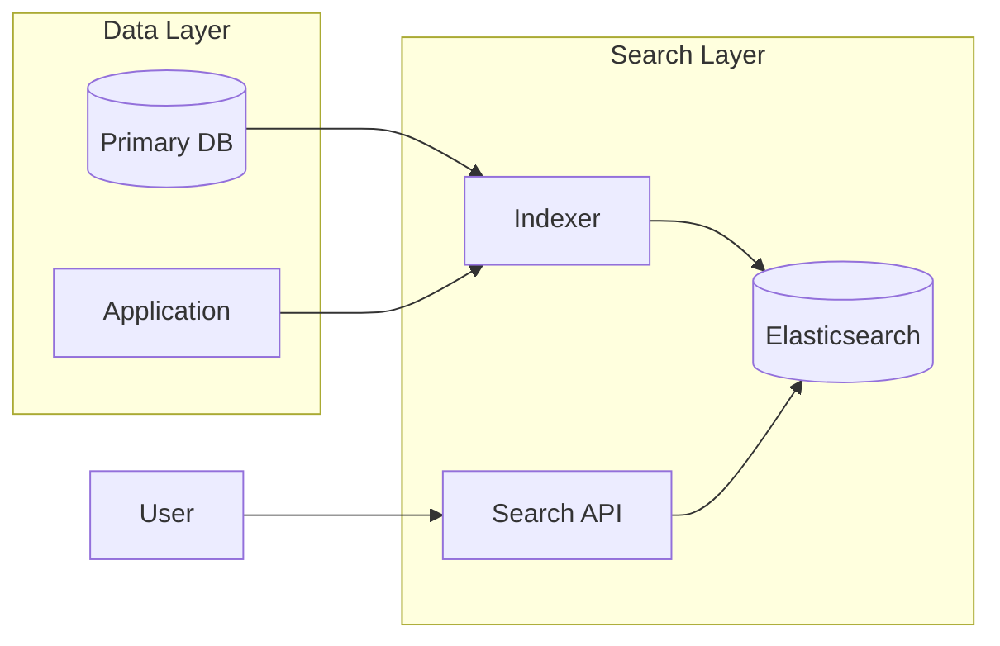

# How to Build Full-Text Search with NEST in .NET

Author: [nawazdhandala](https://www.github.com/nawazdhandala)

Tags: .NET, C#, Elasticsearch, NEST, Full-Text Search, Search, Observability

Description: Learn how to implement full-text search in .NET applications using NEST, the official Elasticsearch client, with indexing, querying, faceted search, and relevance tuning.

---

Full-text search lets users find content using natural language queries instead of exact matches. Elasticsearch combined with NEST, its official .NET client, provides powerful search capabilities including fuzzy matching, highlighting, facets, and relevance scoring.

## Architecture Overview

A search system typically consists of an indexing pipeline that keeps Elasticsearch in sync with your primary database, and a query layer that translates user searches into Elasticsearch queries.



## Project Setup

Add the NEST package to your project.

```bash
dotnet add package NEST
```

## Configuring the Elasticsearch Client

Create a configured client that handles connection pooling and serialization.

```csharp
// Services/ElasticsearchService.cs
using Nest;

public static class ElasticsearchExtensions
{
    public static IServiceCollection AddElasticsearch(
        this IServiceCollection services,
        IConfiguration configuration)
    {
        var settings = new ConnectionSettings(
            new Uri(configuration["Elasticsearch:Url"] ?? "http://localhost:9200"))
            .DefaultIndex(configuration["Elasticsearch:DefaultIndex"] ?? "products")
            .EnableDebugMode()  // Remove in production
            .PrettyJson()
            .RequestTimeout(TimeSpan.FromSeconds(30));

        // Add authentication if configured
        var username = configuration["Elasticsearch:Username"];
        var password = configuration["Elasticsearch:Password"];
        if (!string.IsNullOrEmpty(username) && !string.IsNullOrEmpty(password))
        {
            settings.BasicAuthentication(username, password);
        }

        var client = new ElasticClient(settings);

        services.AddSingleton<IElasticClient>(client);
        return services;
    }
}

// Program.cs
builder.Services.AddElasticsearch(builder.Configuration);
```

## Defining the Search Document

Create a document class that maps to your Elasticsearch index.

```csharp
// Models/ProductDocument.cs
using Nest;

[ElasticsearchType(IdProperty = nameof(Id))]
public class ProductDocument
{
    public string Id { get; set; } = string.Empty;

    // Text field for full-text search
    [Text(Analyzer = "standard", Boost = 2.0)]
    public string Name { get; set; } = string.Empty;

    // Text with keyword sub-field for both search and aggregations
    [Text(Analyzer = "standard")]
    public string Description { get; set; } = string.Empty;

    // Keyword for exact matching and filtering
    [Keyword]
    public string Category { get; set; } = string.Empty;

    [Keyword]
    public string Brand { get; set; } = string.Empty;

    [Keyword]
    public List<string> Tags { get; set; } = new();

    [Number(NumberType.Double)]
    public decimal Price { get; set; }

    [Number(NumberType.Integer)]
    public int StockQuantity { get; set; }

    [Date(Format = "strict_date_optional_time")]
    public DateTime CreatedAt { get; set; }

    [Date(Format = "strict_date_optional_time")]
    public DateTime? UpdatedAt { get; set; }

    [Number(NumberType.Float)]
    public float Rating { get; set; }

    [Number(NumberType.Integer)]
    public int ReviewCount { get; set; }

    [Boolean]
    public bool IsActive { get; set; }

    // Nested object for complex data
    [Nested]
    public List<ProductAttribute> Attributes { get; set; } = new();
}

public class ProductAttribute
{
    [Keyword]
    public string Name { get; set; } = string.Empty;

    [Keyword]
    public string Value { get; set; } = string.Empty;
}
```

## Creating the Index

Set up the index with custom analyzers and mappings.

```csharp
// Services/SearchIndexService.cs
public class SearchIndexService
{
    private readonly IElasticClient _client;
    private readonly ILogger<SearchIndexService> _logger;

    public SearchIndexService(
        IElasticClient client,
        ILogger<SearchIndexService> logger)
    {
        _client = client;
        _logger = logger;
    }

    public async Task CreateIndexAsync(string indexName)
    {
        var existsResponse = await _client.Indices.ExistsAsync(indexName);

        if (existsResponse.Exists)
        {
            _logger.LogInformation("Index {IndexName} already exists", indexName);
            return;
        }

        var createResponse = await _client.Indices.CreateAsync(indexName, c => c
            .Settings(s => s
                .NumberOfShards(2)
                .NumberOfReplicas(1)
                .Analysis(a => a
                    // Custom analyzer for autocomplete
                    .TokenFilters(tf => tf
                        .EdgeNGram("autocomplete_filter", e => e
                            .MinGram(2)
                            .MaxGram(20)))
                    .Analyzers(an => an
                        .Custom("autocomplete", ca => ca
                            .Tokenizer("standard")
                            .Filters("lowercase", "autocomplete_filter"))
                        .Custom("autocomplete_search", ca => ca
                            .Tokenizer("standard")
                            .Filters("lowercase")))))
            .Map<ProductDocument>(m => m
                .AutoMap()
                .Properties(p => p
                    // Add autocomplete field for name
                    .Text(t => t
                        .Name(n => n.Name)
                        .Analyzer("standard")
                        .Boost(2.0)
                        .Fields(f => f
                            .Text(st => st
                                .Name("autocomplete")
                                .Analyzer("autocomplete")
                                .SearchAnalyzer("autocomplete_search"))
                            .Keyword(k => k
                                .Name("keyword"))))
                    // Description with standard analysis
                    .Text(t => t
                        .Name(n => n.Description)
                        .Analyzer("standard")))));

        if (!createResponse.IsValid)
        {
            _logger.LogError(
                "Failed to create index {IndexName}: {Error}",
                indexName, createResponse.DebugInformation);
            throw new InvalidOperationException(
                $"Failed to create index: {createResponse.DebugInformation}");
        }

        _logger.LogInformation("Created index {IndexName}", indexName);
    }

    public async Task DeleteIndexAsync(string indexName)
    {
        var response = await _client.Indices.DeleteAsync(indexName);

        if (!response.IsValid)
        {
            _logger.LogWarning(
                "Failed to delete index {IndexName}: {Error}",
                indexName, response.DebugInformation);
        }
    }
}
```

## Indexing Documents

Create a service for indexing and updating documents.

```csharp
// Services/ProductIndexer.cs
public class ProductIndexer
{
    private readonly IElasticClient _client;
    private readonly ILogger<ProductIndexer> _logger;
    private const string IndexName = "products";

    public ProductIndexer(
        IElasticClient client,
        ILogger<ProductIndexer> logger)
    {
        _client = client;
        _logger = logger;
    }

    // Index a single document
    public async Task IndexAsync(ProductDocument document)
    {
        var response = await _client.IndexAsync(document, i => i
            .Index(IndexName)
            .Id(document.Id)
            .Refresh(Refresh.WaitFor));

        if (!response.IsValid)
        {
            _logger.LogError(
                "Failed to index document {Id}: {Error}",
                document.Id, response.DebugInformation);
            throw new InvalidOperationException(
                $"Failed to index document: {response.DebugInformation}");
        }

        _logger.LogDebug("Indexed document {Id}", document.Id);
    }

    // Bulk index for efficiency
    public async Task BulkIndexAsync(IEnumerable<ProductDocument> documents)
    {
        var bulkResponse = await _client.BulkAsync(b => b
            .Index(IndexName)
            .IndexMany(documents));

        if (bulkResponse.Errors)
        {
            foreach (var item in bulkResponse.ItemsWithErrors)
            {
                _logger.LogError(
                    "Failed to index document {Id}: {Error}",
                    item.Id, item.Error?.Reason);
            }
        }

        _logger.LogInformation(
            "Bulk indexed {Count} documents, {Errors} errors",
            bulkResponse.Items.Count,
            bulkResponse.ItemsWithErrors.Count());
    }

    // Update a document
    public async Task UpdateAsync(string id, Action<ProductDocument> updateAction)
    {
        var response = await _client.UpdateAsync<ProductDocument>(id, u => u
            .Index(IndexName)
            .Script(s => s
                .Source("ctx._source.updatedAt = params.now")
                .Params(p => p.Add("now", DateTime.UtcNow)))
            .Refresh(Refresh.WaitFor));

        if (!response.IsValid)
        {
            _logger.LogError(
                "Failed to update document {Id}: {Error}",
                id, response.DebugInformation);
        }
    }

    // Delete a document
    public async Task DeleteAsync(string id)
    {
        var response = await _client.DeleteAsync<ProductDocument>(id, d => d
            .Index(IndexName)
            .Refresh(Refresh.WaitFor));

        if (!response.IsValid)
        {
            _logger.LogWarning(
                "Failed to delete document {Id}: {Error}",
                id, response.DebugInformation);
        }
    }
}
```

## Basic Search

Implement a search service with various query types.

```csharp
// Services/ProductSearchService.cs
public class ProductSearchService
{
    private readonly IElasticClient _client;
    private readonly ILogger<ProductSearchService> _logger;
    private const string IndexName = "products";

    public ProductSearchService(
        IElasticClient client,
        ILogger<ProductSearchService> logger)
    {
        _client = client;
        _logger = logger;
    }

    // Simple search across multiple fields
    public async Task<SearchResult<ProductDocument>> SearchAsync(
        string query,
        int page = 1,
        int pageSize = 20)
    {
        var response = await _client.SearchAsync<ProductDocument>(s => s
            .Index(IndexName)
            .From((page - 1) * pageSize)
            .Size(pageSize)
            .Query(q => q
                .MultiMatch(m => m
                    .Query(query)
                    .Fields(f => f
                        .Field(p => p.Name, boost: 3)
                        .Field(p => p.Description, boost: 1)
                        .Field(p => p.Category, boost: 2)
                        .Field(p => p.Tags, boost: 1.5))
                    .Type(TextQueryType.BestFields)
                    .Fuzziness(Fuzziness.Auto)
                    .PrefixLength(2)
                    .Operator(Operator.Or))));

        return MapSearchResult(response, page, pageSize);
    }

    // Search with filters
    public async Task<SearchResult<ProductDocument>> SearchWithFiltersAsync(
        ProductSearchRequest request)
    {
        var response = await _client.SearchAsync<ProductDocument>(s => s
            .Index(IndexName)
            .From((request.Page - 1) * request.PageSize)
            .Size(request.PageSize)
            .Query(q => q
                .Bool(b => b
                    // Must match the search query
                    .Must(mu => mu
                        .MultiMatch(m => m
                            .Query(request.Query)
                            .Fields(f => f
                                .Field(p => p.Name, boost: 3)
                                .Field(p => p.Description))
                            .Fuzziness(Fuzziness.Auto)))
                    // Filter conditions (don't affect scoring)
                    .Filter(fi =>
                    {
                        var filters = new List<Func<QueryContainerDescriptor<ProductDocument>, QueryContainer>>();

                        // Category filter
                        if (!string.IsNullOrEmpty(request.Category))
                        {
                            filters.Add(f => f.Term(t => t
                                .Field(p => p.Category)
                                .Value(request.Category)));
                        }

                        // Brand filter
                        if (request.Brands?.Any() == true)
                        {
                            filters.Add(f => f.Terms(t => t
                                .Field(p => p.Brand)
                                .Terms(request.Brands)));
                        }

                        // Price range filter
                        if (request.MinPrice.HasValue || request.MaxPrice.HasValue)
                        {
                            filters.Add(f => f.Range(r => r
                                .Field(p => p.Price)
                                .GreaterThanOrEquals((double?)request.MinPrice)
                                .LessThanOrEquals((double?)request.MaxPrice)));
                        }

                        // Only active products
                        filters.Add(f => f.Term(t => t
                            .Field(p => p.IsActive)
                            .Value(true)));

                        // In stock filter
                        if (request.InStockOnly)
                        {
                            filters.Add(f => f.Range(r => r
                                .Field(p => p.StockQuantity)
                                .GreaterThan(0)));
                        }

                        return fi.Bool(fb => fb.Must(filters.ToArray()));
                    })))
            // Sorting
            .Sort(sort =>
            {
                return request.SortBy?.ToLower() switch
                {
                    "price_asc" => sort.Ascending(p => p.Price),
                    "price_desc" => sort.Descending(p => p.Price),
                    "rating" => sort.Descending(p => p.Rating),
                    "newest" => sort.Descending(p => p.CreatedAt),
                    _ => sort.Descending(SortSpecialField.Score)
                };
            })
            // Highlighting
            .Highlight(h => h
                .PreTags("<mark>")
                .PostTags("</mark>")
                .Fields(
                    f => f.Field(p => p.Name),
                    f => f.Field(p => p.Description))));

        return MapSearchResult(response, request.Page, request.PageSize);
    }

    private SearchResult<ProductDocument> MapSearchResult(
        ISearchResponse<ProductDocument> response,
        int page,
        int pageSize)
    {
        if (!response.IsValid)
        {
            _logger.LogError(
                "Search failed: {Error}", response.DebugInformation);
            return new SearchResult<ProductDocument>
            {
                Items = new List<SearchHit<ProductDocument>>(),
                TotalCount = 0,
                Page = page,
                PageSize = pageSize
            };
        }

        return new SearchResult<ProductDocument>
        {
            Items = response.Hits.Select(h => new SearchHit<ProductDocument>
            {
                Document = h.Source,
                Score = h.Score ?? 0,
                Highlights = h.Highlight?.ToDictionary(
                    kv => kv.Key,
                    kv => kv.Value.ToList()) ?? new()
            }).ToList(),
            TotalCount = response.Total,
            Page = page,
            PageSize = pageSize,
            Took = response.Took
        };
    }
}

public class ProductSearchRequest
{
    public string Query { get; set; } = string.Empty;
    public string? Category { get; set; }
    public List<string>? Brands { get; set; }
    public decimal? MinPrice { get; set; }
    public decimal? MaxPrice { get; set; }
    public bool InStockOnly { get; set; }
    public string? SortBy { get; set; }
    public int Page { get; set; } = 1;
    public int PageSize { get; set; } = 20;
}

public class SearchResult<T>
{
    public List<SearchHit<T>> Items { get; set; } = new();
    public long TotalCount { get; set; }
    public int Page { get; set; }
    public int PageSize { get; set; }
    public long Took { get; set; }
}

public class SearchHit<T>
{
    public T Document { get; set; } = default!;
    public double Score { get; set; }
    public Dictionary<string, List<string>> Highlights { get; set; } = new();
}
```

## Faceted Search

Add aggregations for filtering options.

```csharp
// Services/ProductSearchService.cs (continued)
public async Task<FacetedSearchResult> SearchWithFacetsAsync(
    ProductSearchRequest request)
{
    var response = await _client.SearchAsync<ProductDocument>(s => s
        .Index(IndexName)
        .From((request.Page - 1) * request.PageSize)
        .Size(request.PageSize)
        .Query(q => BuildSearchQuery(q, request))
        // Aggregations for facets
        .Aggregations(a => a
            // Category facet
            .Terms("categories", t => t
                .Field(p => p.Category)
                .Size(20))
            // Brand facet
            .Terms("brands", t => t
                .Field(p => p.Brand)
                .Size(50))
            // Price ranges
            .Range("price_ranges", r => r
                .Field(p => p.Price)
                .Ranges(
                    ra => ra.To(25).Key("Under $25"),
                    ra => ra.From(25).To(50).Key("$25 - $50"),
                    ra => ra.From(50).To(100).Key("$50 - $100"),
                    ra => ra.From(100).To(200).Key("$100 - $200"),
                    ra => ra.From(200).Key("$200+")))
            // Rating distribution
            .Range("ratings", r => r
                .Field(p => p.Rating)
                .Ranges(
                    ra => ra.From(4).Key("4+ Stars"),
                    ra => ra.From(3).To(4).Key("3-4 Stars"),
                    ra => ra.From(2).To(3).Key("2-3 Stars"),
                    ra => ra.To(2).Key("Under 2 Stars")))
            // Stats for price
            .Stats("price_stats", st => st
                .Field(p => p.Price))));

    var result = new FacetedSearchResult
    {
        SearchResult = MapSearchResult(response, request.Page, request.PageSize),
        Facets = new Dictionary<string, List<FacetValue>>()
    };

    // Extract category facets
    var categories = response.Aggregations.Terms("categories");
    if (categories != null)
    {
        result.Facets["categories"] = categories.Buckets
            .Select(b => new FacetValue
            {
                Value = b.Key,
                Count = b.DocCount ?? 0
            }).ToList();
    }

    // Extract brand facets
    var brands = response.Aggregations.Terms("brands");
    if (brands != null)
    {
        result.Facets["brands"] = brands.Buckets
            .Select(b => new FacetValue
            {
                Value = b.Key,
                Count = b.DocCount ?? 0
            }).ToList();
    }

    // Extract price range facets
    var priceRanges = response.Aggregations.Range("price_ranges");
    if (priceRanges != null)
    {
        result.Facets["priceRanges"] = priceRanges.Buckets
            .Select(b => new FacetValue
            {
                Value = b.Key,
                Count = b.DocCount
            }).ToList();
    }

    return result;
}

private QueryContainer BuildSearchQuery(
    QueryContainerDescriptor<ProductDocument> q,
    ProductSearchRequest request)
{
    return q.Bool(b => b
        .Must(mu => mu
            .MultiMatch(m => m
                .Query(request.Query)
                .Fields(f => f
                    .Field(p => p.Name, boost: 3)
                    .Field(p => p.Description))
                .Fuzziness(Fuzziness.Auto)))
        .Filter(BuildFilters(request).ToArray()));
}

private IEnumerable<Func<QueryContainerDescriptor<ProductDocument>, QueryContainer>> BuildFilters(
    ProductSearchRequest request)
{
    yield return f => f.Term(t => t.Field(p => p.IsActive).Value(true));

    if (!string.IsNullOrEmpty(request.Category))
    {
        yield return f => f.Term(t => t.Field(p => p.Category).Value(request.Category));
    }

    if (request.Brands?.Any() == true)
    {
        yield return f => f.Terms(t => t.Field(p => p.Brand).Terms(request.Brands));
    }

    if (request.MinPrice.HasValue || request.MaxPrice.HasValue)
    {
        yield return f => f.Range(r => r
            .Field(p => p.Price)
            .GreaterThanOrEquals((double?)request.MinPrice)
            .LessThanOrEquals((double?)request.MaxPrice));
    }
}

public class FacetedSearchResult
{
    public SearchResult<ProductDocument> SearchResult { get; set; } = new();
    public Dictionary<string, List<FacetValue>> Facets { get; set; } = new();
}

public class FacetValue
{
    public string Value { get; set; } = string.Empty;
    public long Count { get; set; }
}
```

## Autocomplete

Implement search suggestions as users type.

```csharp
// Services/ProductSearchService.cs (continued)
public async Task<List<string>> AutocompleteAsync(string prefix, int maxResults = 10)
{
    var response = await _client.SearchAsync<ProductDocument>(s => s
        .Index(IndexName)
        .Size(maxResults)
        .Source(src => src.Includes(i => i.Field(p => p.Name)))
        .Query(q => q
            .Bool(b => b
                .Should(
                    // Match on autocomplete field
                    sh => sh.Match(m => m
                        .Field(p => p.Name.Suffix("autocomplete"))
                        .Query(prefix)),
                    // Boost exact prefix matches
                    sh => sh.Prefix(p => p
                        .Field(f => f.Name.Suffix("keyword"))
                        .Value(prefix)
                        .Boost(2)))
                .MinimumShouldMatch(1)
                // Only active products
                .Filter(fi => fi.Term(t => t
                    .Field(p => p.IsActive)
                    .Value(true))))));

    if (!response.IsValid)
    {
        _logger.LogError("Autocomplete failed: {Error}", response.DebugInformation);
        return new List<string>();
    }

    return response.Hits
        .Select(h => h.Source.Name)
        .Distinct()
        .ToList();
}
```

## API Controller

Expose search functionality through a REST API.

```csharp
// Controllers/SearchController.cs
[ApiController]
[Route("api/[controller]")]
public class SearchController : ControllerBase
{
    private readonly ProductSearchService _searchService;

    public SearchController(ProductSearchService searchService)
    {
        _searchService = searchService;
    }

    [HttpGet]
    public async Task<IActionResult> Search([FromQuery] ProductSearchRequest request)
    {
        var result = await _searchService.SearchWithFiltersAsync(request);
        return Ok(result);
    }

    [HttpGet("facets")]
    public async Task<IActionResult> SearchWithFacets([FromQuery] ProductSearchRequest request)
    {
        var result = await _searchService.SearchWithFacetsAsync(request);
        return Ok(result);
    }

    [HttpGet("autocomplete")]
    public async Task<IActionResult> Autocomplete([FromQuery] string q)
    {
        if (string.IsNullOrWhiteSpace(q) || q.Length < 2)
        {
            return Ok(new List<string>());
        }

        var suggestions = await _searchService.AutocompleteAsync(q);
        return Ok(suggestions);
    }
}
```

## Summary

| Feature | Implementation |
|---------|----------------|
| Full-text search | Multi-match query with fuzzy matching |
| Filtering | Bool query with filter context |
| Facets | Term and range aggregations |
| Autocomplete | Edge n-gram analyzer with prefix queries |
| Relevance | Field boosting and scoring |
| Highlighting | Pre/post tags for matched terms |

NEST provides a fluent, strongly-typed interface for Elasticsearch in .NET. Start with basic multi-match queries, add filters for faceted navigation, and tune relevance with field boosting. The patterns shown here handle common e-commerce and content search scenarios.
