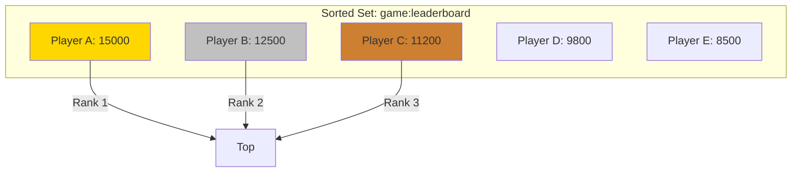

# How to Build Gaming Leaderboards with Redis Sorted Sets

Author: [nawazdhandala](https://www.github.com/nawazdhandala)

Tags: Redis, Sorted Sets, Gaming, Leaderboards, Performance, Real-Time

Description: Learn how to build fast, scalable gaming leaderboards using Redis Sorted Sets. This guide covers score updates, rankings, pagination, and handling millions of players.

---

Leaderboards are everywhere in gaming, from casual mobile games to competitive esports. They need to update instantly when scores change and return rankings quickly even with millions of players. Redis Sorted Sets are perfect for this because they maintain automatic ordering and provide O(log N) operations for most leaderboard queries.

## Why Redis Sorted Sets?

Sorted Sets store members with associated scores, keeping everything sorted by score automatically. This gives you:

- **O(log N) insertions** - Adding or updating a score is fast regardless of leaderboard size
- **O(log N) rank lookups** - Get any player's rank instantly
- **O(log N + M) range queries** - Fetch top 100 players, or players around a specific rank
- **Automatic deduplication** - Each member appears once, scores update in place



## Basic Leaderboard Implementation

Let's start with core leaderboard operations.

```javascript
// leaderboard.js
// Basic leaderboard implementation with Redis Sorted Sets
const Redis = require('ioredis');
const redis = new Redis();

class Leaderboard {
  constructor(name) {
    this.key = `lb:${name}`;
  }

  // Add or update a player's score
  // ZADD automatically updates if member exists
  async setScore(playerId, score) {
    await redis.zadd(this.key, score, playerId);
  }

  // Increment a player's score (useful for cumulative scores)
  async incrementScore(playerId, amount) {
    const newScore = await redis.zincrby(this.key, amount, playerId);
    return parseFloat(newScore);
  }

  // Get player's score
  async getScore(playerId) {
    const score = await redis.zscore(this.key, playerId);
    return score ? parseFloat(score) : null;
  }

  // Get player's rank (0-indexed, highest score = rank 0)
  // ZREVRANK returns rank in descending order
  async getRank(playerId) {
    const rank = await redis.zrevrank(this.key, playerId);
    return rank !== null ? rank + 1 : null; // Convert to 1-indexed
  }

  // Get top N players
  // ZREVRANGE returns members from highest to lowest score
  async getTopPlayers(count = 10) {
    const results = await redis.zrevrange(this.key, 0, count - 1, 'WITHSCORES');
    return this.parseResults(results);
  }

  // Get players around a specific rank (for "players near me" feature)
  async getPlayersAroundRank(rank, range = 5) {
    // Convert to 0-indexed
    const zeroRank = rank - 1;
    const start = Math.max(0, zeroRank - range);
    const end = zeroRank + range;

    const results = await redis.zrevrange(this.key, start, end, 'WITHSCORES');
    return this.parseResults(results, start + 1);
  }

  // Get players around a specific player
  async getPlayersAround(playerId, range = 5) {
    const rank = await this.getRank(playerId);
    if (rank === null) return [];
    return this.getPlayersAroundRank(rank, range);
  }

  // Get paginated leaderboard
  async getPage(page = 1, pageSize = 20) {
    const start = (page - 1) * pageSize;
    const end = start + pageSize - 1;

    const [results, total] = await Promise.all([
      redis.zrevrange(this.key, start, end, 'WITHSCORES'),
      redis.zcard(this.key),
    ]);

    return {
      players: this.parseResults(results, start + 1),
      page,
      pageSize,
      totalPlayers: total,
      totalPages: Math.ceil(total / pageSize),
    };
  }

  // Remove a player from the leaderboard
  async removePlayer(playerId) {
    await redis.zrem(this.key, playerId);
  }

  // Get total number of players
  async getPlayerCount() {
    return redis.zcard(this.key);
  }

  // Parse Redis results into structured data
  parseResults(results, startRank = 1) {
    const players = [];
    for (let i = 0; i < results.length; i += 2) {
      players.push({
        playerId: results[i],
        score: parseFloat(results[i + 1]),
        rank: startRank + (i / 2),
      });
    }
    return players;
  }
}

module.exports = Leaderboard;
```

## Time-Based Leaderboards

Games often have daily, weekly, and all-time leaderboards. Here's how to manage multiple time periods.

```javascript
// time-leaderboards.js
// Leaderboards with time periods (daily, weekly, monthly, all-time)
const Redis = require('ioredis');
const redis = new Redis();

class TimeBasedLeaderboard {
  constructor(gameName) {
    this.gameName = gameName;
  }

  // Generate key for a specific time period
  getKey(period) {
    const now = new Date();

    switch (period) {
      case 'daily':
        return `lb:${this.gameName}:d:${now.toISOString().split('T')[0]}`;
      case 'weekly':
        // Get ISO week number
        const weekNum = this.getWeekNumber(now);
        return `lb:${this.gameName}:w:${now.getFullYear()}-W${weekNum}`;
      case 'monthly':
        return `lb:${this.gameName}:m:${now.getFullYear()}-${String(now.getMonth() + 1).padStart(2, '0')}`;
      case 'alltime':
        return `lb:${this.gameName}:all`;
      default:
        throw new Error(`Unknown period: ${period}`);
    }
  }

  getWeekNumber(date) {
    const d = new Date(Date.UTC(date.getFullYear(), date.getMonth(), date.getDate()));
    const dayNum = d.getUTCDay() || 7;
    d.setUTCDate(d.getUTCDate() + 4 - dayNum);
    const yearStart = new Date(Date.UTC(d.getUTCFullYear(), 0, 1));
    return Math.ceil((((d - yearStart) / 86400000) + 1) / 7);
  }

  // Update score across all relevant time periods
  async updateScore(playerId, score) {
    const periods = ['daily', 'weekly', 'monthly', 'alltime'];
    const pipeline = redis.pipeline();

    for (const period of periods) {
      const key = this.getKey(period);
      pipeline.zadd(key, score, playerId);

      // Set TTL for time-limited boards
      if (period === 'daily') {
        pipeline.expire(key, 2 * 24 * 60 * 60); // 2 days
      } else if (period === 'weekly') {
        pipeline.expire(key, 14 * 24 * 60 * 60); // 2 weeks
      } else if (period === 'monthly') {
        pipeline.expire(key, 62 * 24 * 60 * 60); // ~2 months
      }
    }

    await pipeline.exec();
  }

  // Increment score across all periods
  async incrementScore(playerId, amount) {
    const periods = ['daily', 'weekly', 'monthly', 'alltime'];
    const pipeline = redis.pipeline();

    for (const period of periods) {
      const key = this.getKey(period);
      pipeline.zincrby(key, amount, playerId);

      // Set TTL
      if (period === 'daily') {
        pipeline.expire(key, 2 * 24 * 60 * 60);
      } else if (period === 'weekly') {
        pipeline.expire(key, 14 * 24 * 60 * 60);
      } else if (period === 'monthly') {
        pipeline.expire(key, 62 * 24 * 60 * 60);
      }
    }

    const results = await pipeline.exec();

    // Return the all-time score (last ZINCRBY result)
    return parseFloat(results[results.length - 2][1]);
  }

  // Get leaderboard for specific period
  async getLeaderboard(period, page = 1, pageSize = 20) {
    const key = this.getKey(period);
    const start = (page - 1) * pageSize;
    const end = start + pageSize - 1;

    const [results, total] = await Promise.all([
      redis.zrevrange(key, start, end, 'WITHSCORES'),
      redis.zcard(key),
    ]);

    const players = [];
    for (let i = 0; i < results.length; i += 2) {
      players.push({
        playerId: results[i],
        score: parseFloat(results[i + 1]),
        rank: start + (i / 2) + 1,
      });
    }

    return {
      period,
      players,
      page,
      pageSize,
      totalPlayers: total,
      totalPages: Math.ceil(total / pageSize),
    };
  }

  // Get player's rank across all periods
  async getPlayerRanks(playerId) {
    const periods = ['daily', 'weekly', 'monthly', 'alltime'];
    const pipeline = redis.pipeline();

    for (const period of periods) {
      const key = this.getKey(period);
      pipeline.zrevrank(key, playerId);
      pipeline.zscore(key, playerId);
    }

    const results = await pipeline.exec();
    const ranks = {};

    for (let i = 0; i < periods.length; i++) {
      const rank = results[i * 2][1];
      const score = results[i * 2 + 1][1];

      ranks[periods[i]] = {
        rank: rank !== null ? rank + 1 : null,
        score: score ? parseFloat(score) : null,
      };
    }

    return ranks;
  }
}

module.exports = TimeBasedLeaderboard;
```

## Handling Ties and Secondary Sorting

When players have the same score, you often want to break ties by who achieved it first. Here's a solution using composite scores.

```javascript
// tie-breaking.js
// Handle tie-breaking in leaderboards
const Redis = require('ioredis');
const redis = new Redis();

class TieBreakingLeaderboard {
  constructor(name) {
    this.key = `lb:${name}`;
    // We'll use 6 decimal places for timestamp, giving us microsecond precision
    // Score format: SCORE.TIMESTAMP where timestamp is inverse (earlier = higher)
    this.timestampPrecision = 1000000;
  }

  // Create composite score: main score + time tiebreaker
  // Earlier achievements get higher composite score (for same main score)
  createCompositeScore(score, timestamp = Date.now()) {
    // Invert timestamp so earlier times sort higher
    // Max timestamp we'll support is year 2100
    const maxTimestamp = 4102444800000;
    const invertedTime = maxTimestamp - timestamp;

    // Normalize to decimal
    const timePart = invertedTime / (maxTimestamp * 10);

    return score + timePart;
  }

  // Extract original score from composite
  extractScore(compositeScore) {
    return Math.floor(compositeScore);
  }

  // Set score with automatic tie-breaking
  async setScore(playerId, score, timestamp = Date.now()) {
    const compositeScore = this.createCompositeScore(score, timestamp);
    await redis.zadd(this.key, compositeScore, playerId);
    return compositeScore;
  }

  // Get top players with original scores
  async getTopPlayers(count = 10) {
    const results = await redis.zrevrange(this.key, 0, count - 1, 'WITHSCORES');

    const players = [];
    for (let i = 0; i < results.length; i += 2) {
      const compositeScore = parseFloat(results[i + 1]);
      players.push({
        playerId: results[i],
        score: this.extractScore(compositeScore),
        rank: (i / 2) + 1,
      });
    }

    return players;
  }

  async getRank(playerId) {
    const rank = await redis.zrevrank(this.key, playerId);
    return rank !== null ? rank + 1 : null;
  }
}

// Alternative: Use lexicographic sorting for exact ties
class LexLeaderboard {
  constructor(name) {
    this.scoreKey = `lb:${name}:scores`;
    this.timeKey = `lb:${name}:times`;
  }

  async setScore(playerId, score, timestamp = Date.now()) {
    const pipeline = redis.pipeline();

    // Store in primary score set
    pipeline.zadd(this.scoreKey, score, playerId);

    // Store timestamp for tie-breaking queries
    pipeline.hset(this.timeKey, playerId, timestamp);

    await pipeline.exec();
  }

  // Get players at a specific score, sorted by time
  async getPlayersAtScore(score) {
    // Get all players with this exact score
    const players = await redis.zrangebyscore(this.scoreKey, score, score);

    if (players.length <= 1) {
      return players.map((id, i) => ({ playerId: id, score, rank: i + 1 }));
    }

    // Get timestamps for tie-breaking
    const times = await redis.hmget(this.timeKey, ...players);

    // Sort by timestamp (earlier first)
    const sorted = players
      .map((id, i) => ({ playerId: id, time: parseInt(times[i]) || 0 }))
      .sort((a, b) => a.time - b.time);

    return sorted.map((p, i) => ({
      playerId: p.playerId,
      score,
      rank: i + 1,
    }));
  }
}

module.exports = { TieBreakingLeaderboard, LexLeaderboard };
```

## High Score Tracking

Track personal best scores while maintaining the global leaderboard.

```javascript
// high-scores.js
// Track personal best scores alongside global leaderboard
const Redis = require('ioredis');
const redis = new Redis();

class HighScoreTracker {
  constructor(gameName) {
    this.leaderboardKey = `lb:${gameName}`;
    this.personalBestKey = `pb:${gameName}`;
    this.recentScoresKey = `recent:${gameName}`;
  }

  // Submit a score - only updates leaderboard if it's a personal best
  async submitScore(playerId, score) {
    // Get current personal best
    const currentBest = await redis.zscore(this.leaderboardKey, playerId);

    const result = {
      playerId,
      score,
      isNewPersonalBest: false,
      previousBest: currentBest ? parseFloat(currentBest) : null,
      rank: null,
    };

    // Check if this is a new personal best
    if (currentBest === null || score > parseFloat(currentBest)) {
      result.isNewPersonalBest = true;

      // Update leaderboard with new best
      await redis.zadd(this.leaderboardKey, score, playerId);

      // Get new rank
      const rank = await redis.zrevrank(this.leaderboardKey, playerId);
      result.rank = rank + 1;
    }

    // Always store in recent scores for history
    const scoreRecord = JSON.stringify({
      score,
      timestamp: Date.now(),
      isPersonalBest: result.isNewPersonalBest,
    });

    await redis.lpush(`${this.recentScoresKey}:${playerId}`, scoreRecord);
    await redis.ltrim(`${this.recentScoresKey}:${playerId}`, 0, 99); // Keep last 100

    return result;
  }

  // Get player's recent scores
  async getRecentScores(playerId, count = 10) {
    const scores = await redis.lrange(
      `${this.recentScoresKey}:${playerId}`,
      0,
      count - 1
    );

    return scores.map((s) => JSON.parse(s));
  }

  // Get player stats
  async getPlayerStats(playerId) {
    const [score, rank, recentScores] = await Promise.all([
      redis.zscore(this.leaderboardKey, playerId),
      redis.zrevrank(this.leaderboardKey, playerId),
      redis.lrange(`${this.recentScoresKey}:${playerId}`, 0, -1),
    ]);

    const scores = recentScores.map((s) => JSON.parse(s).score);

    return {
      playerId,
      personalBest: score ? parseFloat(score) : null,
      rank: rank !== null ? rank + 1 : null,
      gamesPlayed: recentScores.length,
      averageScore: scores.length > 0
        ? Math.round(scores.reduce((a, b) => a + b, 0) / scores.length)
        : 0,
      recentBest: scores.length > 0 ? Math.max(...scores) : null,
    };
  }
}

module.exports = HighScoreTracker;
```

## Express API for Leaderboards

Here's a complete REST API for leaderboard functionality.

```javascript
// api.js
// Express API for gaming leaderboards
const express = require('express');
const Leaderboard = require('./leaderboard');
const TimeBasedLeaderboard = require('./time-leaderboards');
const HighScoreTracker = require('./high-scores');

const app = express();
app.use(express.json());

// Initialize leaderboard instances
const leaderboards = new Map();

function getLeaderboard(gameName) {
  if (!leaderboards.has(gameName)) {
    leaderboards.set(gameName, {
      basic: new Leaderboard(gameName),
      timed: new TimeBasedLeaderboard(gameName),
      highScore: new HighScoreTracker(gameName),
    });
  }
  return leaderboards.get(gameName);
}

// Submit a score
app.post('/games/:game/scores', async (req, res) => {
  try {
    const { game } = req.params;
    const { playerId, score } = req.body;

    if (!playerId || typeof score !== 'number') {
      return res.status(400).json({ error: 'playerId and score required' });
    }

    const lb = getLeaderboard(game);

    // Update all leaderboards
    const [highScoreResult] = await Promise.all([
      lb.highScore.submitScore(playerId, score),
      lb.timed.updateScore(playerId, score),
    ]);

    res.json(highScoreResult);
  } catch (error) {
    res.status(500).json({ error: error.message });
  }
});

// Get leaderboard
app.get('/games/:game/leaderboard', async (req, res) => {
  try {
    const { game } = req.params;
    const { period = 'alltime', page = 1, pageSize = 20 } = req.query;

    const lb = getLeaderboard(game);
    const results = await lb.timed.getLeaderboard(
      period,
      parseInt(page),
      parseInt(pageSize)
    );

    res.json(results);
  } catch (error) {
    res.status(500).json({ error: error.message });
  }
});

// Get player stats
app.get('/games/:game/players/:playerId', async (req, res) => {
  try {
    const { game, playerId } = req.params;

    const lb = getLeaderboard(game);

    const [stats, ranks] = await Promise.all([
      lb.highScore.getPlayerStats(playerId),
      lb.timed.getPlayerRanks(playerId),
    ]);

    res.json({
      ...stats,
      ranks,
    });
  } catch (error) {
    res.status(500).json({ error: error.message });
  }
});

// Get players around a player
app.get('/games/:game/players/:playerId/around', async (req, res) => {
  try {
    const { game, playerId } = req.params;
    const { range = 5 } = req.query;

    const lb = getLeaderboard(game);
    const players = await lb.basic.getPlayersAround(playerId, parseInt(range));

    res.json({ players });
  } catch (error) {
    res.status(500).json({ error: error.message });
  }
});

const PORT = process.env.PORT || 3000;
app.listen(PORT, () => console.log(`Leaderboard API running on port ${PORT}`));
```

## Performance Tips

| Operation | Complexity | Notes |
|-----------|------------|-------|
| ZADD | O(log N) | Fast even with millions of players |
| ZREVRANK | O(log N) | Get any player's rank quickly |
| ZREVRANGE | O(log N + M) | M is the number of results |
| ZINCRBY | O(log N) | Atomic score increment |

For millions of players:
- Paginate all responses (never fetch all at once)
- Use pipelining for batch operations
- Consider sharding by game or region for very large scale
- Set appropriate TTLs on time-based leaderboards

Redis Sorted Sets handle gaming leaderboards exceptionally well. The automatic ordering and O(log N) operations mean your leaderboard stays responsive even as your player base grows to millions.
